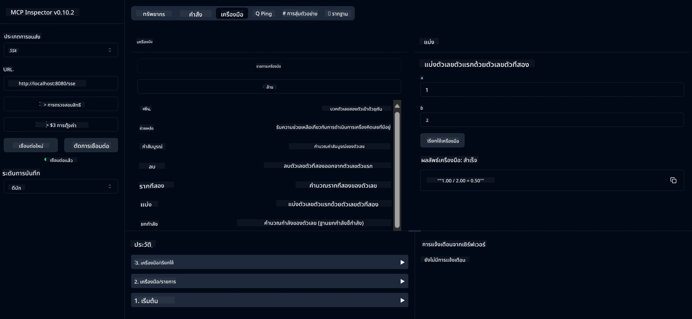

# บริการเครื่องคิดเลขพื้นฐาน MCP

> [!NOTE]
> ตัวอย่างนี้ใช้การขนส่ง HTTP+SSE แบบเก่าและมีเป้าหมายเป็น SDK ที่เข้ากันได้
> กับ MCP `2025-11-25` เซิร์ฟเวอร์ระยะไกลใหม่ควรใช้การสนับสนุน HTTP Streamable
> `2026-07-28`

บริการนี้ให้การดำเนินการเครื่องคิดเลขพื้นฐานผ่าน Model Context Protocol (MCP) โดยใช้ Spring Boot กับการขนส่ง WebFlux ซึ่งออกแบบมาเป็นตัวอย่างง่าย ๆ สำหรับผู้เริ่มต้นที่เรียนรู้เกี่ยวกับการใช้งาน MCP

สำหรับข้อมูลเพิ่มเติม โปรดดูเอกสารอ้างอิง [MCP Server Boot Starter](https://docs.spring.io/spring-ai/reference/api/mcp/mcp-server-boot-starter-docs.html)

## ภาพรวม

บริการนี้แสดงตัวอย่าง:
- การรองรับ SSE (Server-Sent Events)
- การลงทะเบียนเครื่องมืออัตโนมัติด้วย annotation `@Tool` ของ Spring AI
- ฟังก์ชันเครื่องคิดเลขพื้นฐาน:
  - การบวก, การลบ, การคูณ, การหาร
  - การคำนวณกำลังและรากที่สอง
  - โมดูลัส (เศษเหลือ) และค่าสัมบูรณ์
  - ฟังก์ชันช่วยเหลือสำหรับคำอธิบายการดำเนินงาน

## คุณสมบัติ

บริการเครื่องคิดเลขนี้มีความสามารถดังนี้:

1. **การดำเนินการเลขคณิตพื้นฐาน**:
   - การบวกเลขสองจำนวน
   - การลบเลขจำนวนหนึ่งจากอีกจำนวนหนึ่ง
   - การคูณเลขสองจำนวน
   - การหารเลขจำนวนหนึ่งด้วยอีกจำนวนหนึ่ง (ตรวจสอบการหารด้วยศูนย์)

2. **การดำเนินการขั้นสูง**:
   - การคำนวณกำลัง (ยกฐานกำลังหนึ่ง)
   - การคำนวณรากที่สอง (ตรวจสอบเลขลบ)
   - การคำนวณโมดูลัส (เศษเหลือ)
   - การคำนวณค่าสัมบูรณ์

3. **ระบบช่วยเหลือ**:
   - ฟังก์ชันช่วยเหลือในตัวที่อธิบายการดำเนินงานทั้งหมดที่มีให้

## การใช้บริการ

บริการนี้เปิดเผย API ต่อไปนี้ผ่านโปรโตคอล MCP:

- `add(a, b)`: บวกเลขสองจำนวนเข้าด้วยกัน
- `subtract(a, b)`: ลบจำนวนที่สองออกจากจำนวนแรก
- `multiply(a, b)`: คูณเลขสองจำนวน
- `divide(a, b)`: หารจำนวนแรกด้วยจำนวนที่สอง (ตรวจสอบศูนย์)
- `power(base, exponent)`: คำนวณกำลังของจำนวน
- `squareRoot(number)`: คำนวณรากที่สอง (ตรวจสอบเลขลบ)
- `modulus(a, b)`: คำนวณเศษเหลือจากการหาร
- `absolute(number)`: คำนวณค่าสัมบูรณ์
- `help()`: รับข้อมูลเกี่ยวกับการดำเนินงานที่มีให้

## ลูกค้าทดสอบ

มีลูกค้าทดสอบง่าย ๆ ในแพ็กเกจ `com.microsoft.mcp.sample.client` คลาส `SampleCalculatorClient` แสดงตัวอย่างการใช้การดำเนินงานต่าง ๆ ของบริการเครื่องคิดเลข

## การใช้ลูกค้า LangChain4j

โครงการนี้รวมตัวอย่างลูกค้า LangChain4j ใน `com.microsoft.mcp.sample.client.LangChain4jClient` ที่แสดงวิธีการรวมบริการเครื่องคิดเลขกับ LangChain4j และโมเดล GitHub:

### สิ่งที่ต้องมี

1. **การตั้งค่าโทเค็น GitHub**:
   
   เพื่อใช้โมเดล AI ของ GitHub (เช่น phi-4) คุณต้องมีโทเค็นการเข้าถึงส่วนตัวของ GitHub:

   ก. ไปที่การตั้งค่าบัญชี GitHub ของคุณ: https://github.com/settings/tokens
   
   ข. คลิก "Generate new token" → "Generate new token (classic)"
   
   ค. ตั้งชื่อโทเค็นของคุณให้เหมาะสม
   
   ง. เลือกขอบเขตดังนี้:
      - `repo` (การควบคุมเต็มที่ของที่เก็บข้อมูลส่วนตัว)
      - `read:org` (อ่านสมาชิกองค์กรและทีม, อ่านโครงการองค์กร)
      - `gist` (สร้าง gists)
      - `user:email` (เข้าถึงที่อยู่อีเมลของผู้ใช้ (อ่านอย่างเดียว))
   
   จ. คลิก "Generate token" และคัดลอกโทเค็นใหม่นี้
   
   ฉ. ตั้งค่าเป็นตัวแปรแวดล้อม:
      
      บน Windows:
      ```
      set GITHUB_TOKEN=your-github-token
      ```
      
      บน macOS/Linux:
      ```bash
      export GITHUB_TOKEN=your-github-token
      ```

   ช. สำหรับการตั้งค่าถาวร เพิ่มมันในตัวแปรแวดล้อมผ่านการตั้งค่าระบบ

2. เพิ่ม dependency LangChain4j GitHub ลงในโครงการของคุณ (รวมอยู่ใน pom.xml แล้ว):
   ```xml
   <dependency>
       <groupId>dev.langchain4j</groupId>
       <artifactId>langchain4j-github</artifactId>
       <version>${langchain4j.version}</version>
   </dependency>
   ```

3. ตรวจสอบให้แน่ใจว่าเซิร์ฟเวอร์เครื่องคิดเลขกำลังทำงานบน `localhost:8080`

### การรันลูกค้า LangChain4j

ตัวอย่างนี้แสดง:
- การเชื่อมต่อกับเซิร์ฟเวอร์ MCP เครื่องคิดเลขผ่านการขนส่ง SSE
- การใช้ LangChain4j เพื่อสร้างแชทบอทที่ใช้การดำเนินงานเครื่องคิดเลข
- การรวมกับโมเดล AI ของ GitHub (ตอนนี้ใช้โมเดล phi-4)

ลูกค้าส่งคำถามตัวอย่างต่อไปนี้เพื่อแสดงฟังก์ชันการทำงาน:
1. การคำนวณผลรวมของเลขสองจำนวน
2. การหาค่ารากที่สองของเลขจำนวนหนึ่ง
3. การขอข้อมูลช่วยเหลือเกี่ยวกับการดำเนินงานเครื่องคิดเลขที่มีให้

รันตัวอย่างและตรวจสอบผลลัพธ์บนคอนโซลเพื่อดูว่าโมเดล AI ใช้เครื่องมือเครื่องคิดเลขเพื่อตอบคำถามอย่างไร

### การตั้งค่าโมเดล GitHub

ลูกค้า LangChain4j ถูกตั้งค่าให้ใช้โมเดล phi-4 ของ GitHub ด้วยการตั้งค่าต่อไปนี้:

```java
ChatLanguageModel model = GitHubChatModel.builder()
    .apiKey(System.getenv("GITHUB_TOKEN"))
    .timeout(Duration.ofSeconds(60))
    .modelName("phi-4")
    .logRequests(true)
    .logResponses(true)
    .build();
```

เพื่อใช้โมเดล GitHub อื่น ๆ ให้เปลี่ยนพารามิเตอร์ `modelName` เป็นโมเดลที่รองรับอื่น (เช่น "claude-3-haiku-20240307", "llama-3-70b-8192" เป็นต้น)

## การพึ่งพา

โครงการนี้ต้องการการพึ่งพาสำคัญดังนี้:

```xml
<!-- For MCP Server -->
<dependency>
    <groupId>org.springframework.ai</groupId>
    <artifactId>spring-ai-starter-mcp-server-webflux</artifactId>
</dependency>

<!-- For LangChain4j integration -->
<dependency>
    <groupId>dev.langchain4j</groupId>
    <artifactId>langchain4j-mcp</artifactId>
    <version>${langchain4j.version}</version>
</dependency>

<!-- For GitHub models support -->
<dependency>
    <groupId>dev.langchain4j</groupId>
    <artifactId>langchain4j-github</artifactId>
    <version>${langchain4j.version}</version>
</dependency>
```

## การสร้างโปรเจกต์

สร้างโปรเจกต์โดยใช้ Maven:
```bash
./mvnw clean install -DskipTests
```

## การรันเซิร์ฟเวอร์

### การใช้ Java

```bash
java -jar target/calculator-server-0.0.1-SNAPSHOT.jar
```

### การใช้ MCP Inspector

MCP Inspector เป็นเครื่องมือช่วยที่ช่วยในการโต้ตอบกับบริการ MCP ในการใช้มันกับบริการเครื่องคิดเลขนี้:

1. **ติดตั้งและรัน MCP Inspector** ในหน้าต่างเทอร์มินัลใหม่:
   ```bash
   npx @modelcontextprotocol/inspector
   ```

2. **เข้าถึงเว็บ UI** โดยคลิกที่ URL ที่แอปแสดง (ปกติคือ http://localhost:6274)

3. **ตั้งค่าการเชื่อมต่อ**:
   - ตั้งค่าประเภทการขนส่งเป็น "SSE"
   - ตั้งค่า URL ไปยัง endpoint SSE ของเซิร์ฟเวอร์ที่กำลังรัน: `http://localhost:8080/sse`
   - คลิก "Connect"

4. **ใช้เครื่องมือ**:
   - คลิก "List Tools" เพื่อดูรายการการดำเนินงานเครื่องคิดเลขที่มี
   - เลือกเครื่องมือและคลิก "Run Tool" เพื่อรันการดำเนินงาน



### การใช้ Docker

โครงการนี้รวม Dockerfile สำหรับการปรับใช้แบบ containerized:

1. **สร้างอิมเมจ Docker**:
   ```bash
   docker build -t calculator-mcp-service .
   ```

2. **รันคอนเทนเนอร์ Docker**:
   ```bash
   docker run -p 8080:8080 calculator-mcp-service
   ```

การดำเนินการนี้จะ:
- สร้างอิมเมจ Docker แบบหลายขั้นตอนด้วย Maven 3.9.9 และ Eclipse Temurin 24 JDK
- สร้างอิมเมจคอนเทนเนอร์ที่ปรับแต่งแล้ว
- เปิดเผยบริการบนพอร์ต 8080
- เริ่มบริการ MCP เครื่องคิดเลขภายในคอนเทนเนอร์

คุณสามารถเข้าถึงบริการที่ `http://localhost:8080` เมื่อคอนเทนเนอร์กำลังทำงานแล้ว

## การแก้ไขปัญหา

### ปัญหาทั่วไปเกี่ยวกับโทเค็น GitHub

1. **ปัญหาสิทธิ์โทเค็น**: หากคุณได้รับข้อผิดพลาด 403 Forbidden ให้ตรวจสอบว่าโทเค็นของคุณมีสิทธิ์ที่ถูกต้องตามที่กำหนดไว้ในสิ่งที่ต้องมี

2. **ไม่พบโทเค็น**: หากคุณได้รับข้อผิดพลาด "No API key found" ให้ตรวจสอบว่าตัวแปรแวดล้อม GITHUB_TOKEN ถูกตั้งค่าอย่างถูกต้อง

3. **การจำกัดอัตราการใช้งาน (Rate Limiting)**: GitHub API มีการจำกัดอัตราการใช้งาน หากคุณเจอข้อผิดพลาดอัตราการใช้งาน (รหัสสถานะ 429) ให้รอสักครู่ก่อนลองใหม่

4. **โทเค็นหมดอายุ**: โทเค็น GitHub อาจหมดอายุ หากคุณได้รับข้อผิดพลาดการรับรองความถูกต้องหลังจากใช้ไปสักพัก ให้สร้างโทเค็นใหม่และอัปเดตตัวแปรแวดล้อม

หากคุณต้องการความช่วยเหลือเพิ่มเติม โปรดตรวจสอบ [เอกสาร LangChain4j](https://github.com/langchain4j/langchain4j) หรือ [เอกสาร GitHub API](https://docs.github.com/en/rest)

---

<!-- CO-OP TRANSLATOR DISCLAIMER START -->
**ปฏิเสธความรับผิดชอบ**:
เอกสารนี้ได้รับการแปลโดยใช้บริการแปลภาษา AI [Co-op Translator](https://github.com/Azure/co-op-translator) ขณะที่เราพยายามให้ความถูกต้อง โปรดทราบว่าการแปลโดยอัตโนมัติอาจมีข้อผิดพลาดหรือความไม่ถูกต้อง เอกสารต้นฉบับในภาษาต้นทางควรถูกพิจารณาเป็นแหล่งข้อมูลที่เชื่อถือได้ สำหรับข้อมูลที่สำคัญ แนะนำให้ใช้การแปลโดยมนุษย์มืออาชีพ เราไม่รับผิดชอบต่อความเข้าใจผิดหรือการตีความที่ผิดพลาดที่เกิดขึ้นจากการใช้การแปลนี้
<!-- CO-OP TRANSLATOR DISCLAIMER END -->