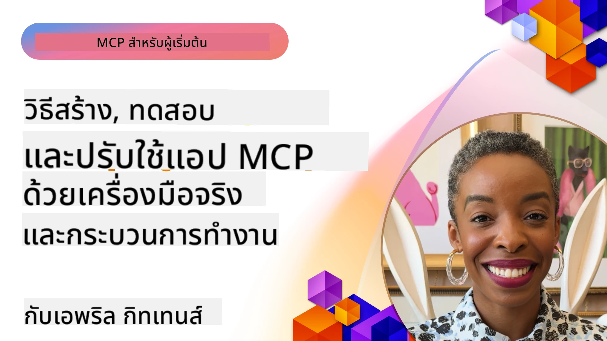
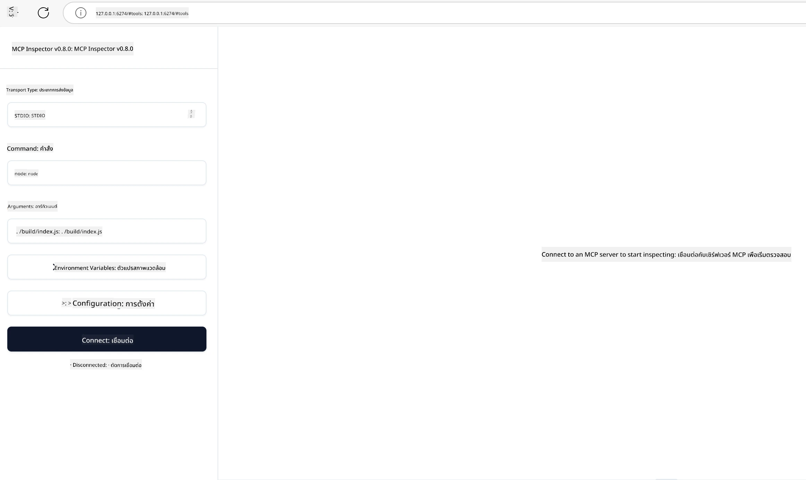

# การใช้งานจริง

[](https://youtu.be/vCN9-mKBDfQ)

_(คลิกที่ภาพด้านบนเพื่อดูวิดีโอบทเรียนนี้)_

การใช้งานจริงคือจุดที่พลังของ Model Context Protocol (MCP) กลายเป็นสิ่งที่จับต้องได้ ในขณะที่การเข้าใจทฤษฎีและสถาปัตยกรรมเบื้องหลัง MCP เป็นสิ่งสำคัญ แต่คุณค่าที่แท้จริงจะเกิดขึ้นเมื่อคุณนำแนวคิดเหล่านี้มาใช้สร้าง ทดสอบ และปรับใช้โซลูชันที่แก้ปัญหาในโลกจริง บทนี้เชื่อมช่องว่างระหว่างความรู้เชิงแนวคิดกับการพัฒนาจริงโดยแนะนำคุณผ่านกระบวนการนำแอปพลิเคชันที่ใช้ MCP มาสู่ชีวิต

ไม่ว่าคุณจะพัฒนาแอสซิสแทนต์อัจฉริยะ การรวม AI เข้ากับเวิร์กโฟลว์ธุรกิจ หรือสร้างเครื่องมือเฉพาะสำหรับการประมวลผลข้อมูล MCP ให้พื้นฐานที่ยืดหยุ่น การออกแบบที่ไม่ขึ้นกับภาษาและ SDK ทางการสำหรับภาษายอดนิยมช่วยให้ผู้พัฒนาหลากหลายกลุ่มเข้าถึงได้ โดยการใช้ SDK เหล่านี้คุณสามารถสร้างต้นแบบ ทดสอบซ้ำ และขยายโซลูชันของคุณในแพลตฟอร์มและสภาพแวดล้อมต่าง ๆ ได้อย่างรวดเร็ว

ในส่วนถัดไปนี้ คุณจะพบตัวอย่างการใช้งานจริง โค้ดตัวอย่าง และกลยุทธ์การปรับใช้ที่แสดงให้เห็นวิธีการใช้งาน MCP ใน C#, Java with Spring, TypeScript, JavaScript และ Python นอกจากนี้คุณจะได้เรียนรู้วิธีการดีบักและทดสอบเซิร์ฟเวอร์ MCP จัดการ API และปรับใช้โซลูชันไปยังคลาวด์ด้วย Azure ทรัพยากรเชิงปฏิบัติเหล่านี้ถูกออกแบบมาเพื่อเร่งการเรียนรู้ของคุณและช่วยให้คุณสร้างแอปพลิเคชัน MCP ที่มั่นคงและพร้อมสำหรับการใช้งานจริงได้อย่างมั่นใจ

## ภาพรวม

บทเรียนนี้มุ่งเน้นไปที่แง่มุมการใช้งานจริงของการนำ MCP ไปใช้ในหลายภาษาโปรแกรม เราจะสำรวจวิธีการใช้ SDK ของ MCP ใน C#, Java with Spring, TypeScript, JavaScript และ Python เพื่อสร้างแอปพลิเคชันที่มั่นคง ดีบักและทดสอบเซิร์ฟเวอร์ MCP รวมถึงสร้างทรัพยากร, prompt และเครื่องมือที่นำกลับมาใช้ใหม่ได้

## วัตถุประสงค์การเรียนรู้

เมื่อจบบทเรียนนี้ คุณจะสามารถ:

- นำโซลูชัน MCP ไปใช้โดยใช้ SDK ทางการในหลายภาษาโปรแกรม
- ดีบักและทดสอบเซิร์ฟเวอร์ MCP อย่างเป็นระบบ
- สร้างและใช้ฟีเจอร์ของเซิร์ฟเวอร์ (ทรัพยากร, prompt, และเครื่องมือ)
- ออกแบบเวิร์กโฟลว์ MCP ที่มีประสิทธิภาพสำหรับงานที่ซับซ้อน
- ปรับแต่งการใช้งาน MCP เพื่อประสิทธิภาพและความน่าเชื่อถือ

## แหล่งข้อมูล SDK ทางการ

Model Context Protocol มี SDK ทางการสำหรับหลายภาษา (สอดคล้องกับ [MCP Specification 2025-11-25](https://spec.modelcontextprotocol.io/specification/2025-11-25/)):

- [C# SDK](https://github.com/modelcontextprotocol/csharp-sdk)
- [Java with Spring SDK](https://github.com/modelcontextprotocol/java-sdk) **หมายเหตุ:** ต้องมี dependency กับ [Project Reactor](https://projectreactor.io) (ดู [ข้อถกเถียง issue 246](https://github.com/orgs/modelcontextprotocol/discussions/246))
- [TypeScript SDK](https://github.com/modelcontextprotocol/typescript-sdk)
- [Python SDK](https://github.com/modelcontextprotocol/python-sdk)
- [Kotlin SDK](https://github.com/modelcontextprotocol/kotlin-sdk)
- [Go SDK](https://github.com/modelcontextprotocol/go-sdk)

## การใช้งานกับ SDK MCP

ส่วนนี้มีตัวอย่างการใช้ MCP ในหลายภาษาโปรแกรม คุณสามารถหาตัวอย่างโค้ดในไดเรกทอรี `samples` ที่จัดแยกตามภาษา

### ตัวอย่างที่มีให้ใช้งาน

ที่เก็บนี้รวมถึง [ตัวอย่างการใช้งาน](../../../04-PracticalImplementation/samples) ในภาษาต่อไปนี้:

- [C#](./samples/csharp/README.md)
- [Java with Spring](./samples/java/containerapp/README.md)
- [TypeScript](./samples/typescript/README.md)
- [JavaScript](./samples/javascript/README.md)
- [Python](./samples/python/README.md)

แต่ละตัวอย่างแสดงแนวคิดหลักของ MCP และรูปแบบการใช้งานสำหรับภาษาและระบบนิเวศเฉพาะทางนั้น

### คู่มือเชิงปฏิบัติ

คู่มือเพิ่มเติมสำหรับการใช้งาน MCP เชิงปฏิบัติ:

- [การแบ่งหน้าและชุดผลลัพธ์ขนาดใหญ่](./pagination/README.md) - จัดการการแบ่งหน้าด้วย cursor สำหรับเครื่องมือ ทรัพยากร และชุดข้อมูลขนาดใหญ่

## ฟีเจอร์หลักของเซิร์ฟเวอร์

เซิร์ฟเวอร์ MCP สามารถใช้งานฟีเจอร์ใดก็ได้ตามนี้:

### ทรัพยากร

ทรัพยากรให้บริบทและข้อมูลสำหรับผู้ใช้หรือโมเดล AI ใช้:

- ที่เก็บเอกสาร
- ฐานความรู้
- แหล่งข้อมูลโครงสร้าง
- ระบบไฟล์

### prompt

prompt คือข้อความแม่แบบและเวิร์กโฟลว์สำหรับผู้ใช้:

- แม่แบบการสนทนาที่กำหนดไว้ล่วงหน้า
- รูปแบบการโต้ตอบที่มีคำแนะนำ
- โครงสร้างการสนทนาเฉพาะทาง

### เครื่องมือ

เครื่องมือคือฟังก์ชันที่โมเดล AI ใช้ดำเนินการ:

- ยูทิลิตี้การประมวลผลข้อมูล
- การรวม API ภายนอก
- ความสามารถในการคำนวณ
- ฟังก์ชันการค้นหา

## ตัวอย่างการใช้งาน: การใช้งาน C#

ที่เก็บ SDK C# ทางการมีตัวอย่างการใช้งานหลายตัวที่แสดงแง่มุมต่าง ๆ ของ MCP:

- **ไคลเอนต์ MCP พื้นฐาน**: ตัวอย่างง่าย ๆ แสดงวิธีสร้างไคลเอนต์ MCP และเรียกใช้เครื่องมือ
- **เซิร์ฟเวอร์ MCP พื้นฐาน**: การใช้งานเซิร์ฟเวอร์ขั้นต่ำที่มีการลงทะเบียนเครื่องมือพื้นฐาน
- **เซิร์ฟเวอร์ MCP ขั้นสูง**: เซิร์ฟเวอร์ฟีเจอร์ครบที่มีการลงทะเบียนเครื่องมือ การตรวจสอบสิทธิ์ และการจัดการข้อผิดพลาด
- **การรวมกับ ASP.NET**: ตัวอย่างการรวมกับ ASP.NET Core
- **รูปแบบการใช้งานเครื่องมือ**: รูปแบบต่าง ๆ สำหรับการใช้งานเครื่องมือที่มีความซับซ้อนต่างกัน

SDK C# MCP อยู่ในสถานะพรีวิวและ API อาจมีการเปลี่ยนแปลง เราจะอัปเดตบล็อกนี้อย่างต่อเนื่องตามการพัฒนา SDK

### ฟีเจอร์สำคัญ

- [C# MCP Nuget ModelContextProtocol](https://www.nuget.org/packages/ModelContextProtocol)
- การสร้าง [เซิร์ฟเวอร์ MCP ตัวแรกของคุณ](https://devblogs.microsoft.com/dotnet/build-a-model-context-protocol-mcp-server-in-csharp/)

สำหรับตัวอย่างการใช้งาน C# ครบถ้วน ดูที่ [ที่เก็บตัวอย่าง SDK C# ทางการ](https://github.com/modelcontextprotocol/csharp-sdk)

## ตัวอย่างการใช้งาน: Java with Spring

SDK Java with Spring มีตัวเลือกการใช้งาน MCP ที่แข็งแกร่งพร้อมฟีเจอร์ระดับองค์กร

### ฟีเจอร์สำคัญ

- การรวม Spring Framework
- ความปลอดภัยของชนิดข้อมูลที่เข้มงวด
- สนับสนุนโปรแกรมเชิงปฏิกิริยา
- การจัดการข้อผิดพลาดอย่างครบถ้วน

สำหรับตัวอย่างใช้งาน Java with Spring แบบครบถ้วน ดูที่ [ตัวอย่าง Java with Spring](samples/java/containerapp/README.md) ในไดเรกทอรีตัวอย่าง

## ตัวอย่างการใช้งาน: JavaScript

SDK JavaScript ให้วิธีการใช้งาน MCP แบบน้ำหนักเบาและยืดหยุ่น

### ฟีเจอร์สำคัญ

- รองรับ Node.js และเบราว์เซอร์
- API แบบ Promise
- รวมง่ายกับ Express และเฟรมเวิร์กอื่น ๆ
- รองรับ WebSocket สำหรับการสตรีม

สำหรับตัวอย่างใช้งาน JavaScript แบบครบถ้วน ดูที่ [ตัวอย่าง JavaScript](samples/javascript/README.md) ในไดเรกทอรีตัวอย่าง

## ตัวอย่างการใช้งาน: Python

SDK Python ให้แนวทางแบบ Pythonic สำหรับการใช้งาน MCP พร้อมการรวมกับเฟรมเวิร์ก ML ที่ยอดเยี่ยม

### ฟีเจอร์สำคัญ

- รองรับ Async/await ด้วย asyncio
- การรวม FastAPI
- การลงทะเบียนเครื่องมือที่เรียบง่าย
- การรวมเนทีฟกับไลบรารี ML ยอดนิยม

สำหรับตัวอย่างการใช้งาน Python แบบครบถ้วน ดูที่ [ตัวอย่าง Python](samples/python/README.md) ในไดเรกทอรีตัวอย่าง

## การจัดการ API

Azure API Management เป็นคำตอบที่ดีว่าทำอย่างไรเราจะรักษาความปลอดภัยเซิร์ฟเวอร์ MCP ได้ โดยแนวคิดคือวางอินสแตนซ์ Azure API Management ไว้หน้าตัวเซิร์ฟเวอร์ MCP ของคุณและปล่อยให้จัดการฟีเจอร์ที่คุณคาดหวังเช่น:

- การจำกัดอัตรา (rate limiting)
- การจัดการโทเค็น
- การตรวจสอบ
- การบาลานซ์โหลด
- ความปลอดภัย

### ตัวอย่าง Azure

นี่คือตัวอย่าง Azure ที่ทำแบบนั้นจริง ๆ คือ [การสร้างเซิร์ฟเวอร์ MCP และรักษาความปลอดภัยด้วย Azure API Management](https://github.com/Azure-Samples/remote-mcp-apim-functions-python)

ดูภาพด้านล่างนี้เพื่อดูว่ากระบวนการ authorization เกิดขึ้นอย่างไร:


ในภาพก่อนหน้านี้ เกิดเหตุการณ์ดังนี้:

- การตรวจสอบสิทธิ์/อนุญาตเกิดขึ้นด้วย Microsoft Entra
- Azure API Management ทำหน้าที่เป็นเกตเวย์และใช้โพลิซีย์เพื่อกำหนดทิศทางและจัดการการรับส่งข้อมูล
- Azure Monitor บันทึกคำขอทั้งหมดเพื่อการวิเคราะห์เพิ่มเติม

#### กระบวนการอนุญาต

มาดูรายละเอียดของกระบวนการอนุญาตเพิ่มเติม:


#### สเปคการอนุญาต MCP

เรียนรู้เพิ่มเติมเกี่ยวกับ [สเปคการอนุญาต MCP](https://spec.modelcontextprotocol.io/specification/2025-11-25/basic/authorization/)

## ปรับใช้เซิร์ฟเวอร์ MCP ระยะไกลไปยัง Azure

มาดูกันว่าเราจะปรับใช้ตัวอย่างที่กล่าวถึงก่อนหน้านี้ได้อย่างไร:

1. โคลน repo

    ```bash
    git clone https://github.com/Azure-Samples/remote-mcp-apim-functions-python.git
    cd remote-mcp-apim-functions-python
    ```

1. ลงทะเบียน `Microsoft.App` resource provider

   - หากคุณใช้ Azure CLI ให้รัน `az provider register --namespace Microsoft.App --wait`
   - หากคุณใช้ Azure PowerShell ให้รัน `Register-AzResourceProvider -ProviderNamespace Microsoft.App` จากนั้นรัน `(Get-AzResourceProvider -ProviderNamespace Microsoft.App).RegistrationState` หลังจากเวลาผ่านไปเพื่อตรวจสอบว่าการลงทะเบียนเสร็จสมบูรณ์หรือไม่

1. รันคำสั่ง [azd](https://aka.ms/azd) นี้เพื่อจัดเตรียมบริการ API Management, ฟังก์ชันแอป (พร้อมโค้ด) และทรัพยากร Azure ที่จำเป็นทั้งหมด

    ```shell
    azd up
    ```

    คำสั่งนี้จะปรับใช้ทรัพยากรทั้งหมดบน Azure

### การทดสอบเซิร์ฟเวอร์ของคุณด้วย MCP Inspector

1. ใน **หน้าต่างเทอร์มินัลใหม่** ให้ติดตั้งและรัน MCP Inspector

    ```shell
    npx @modelcontextprotocol/inspector
    ```

    คุณควรเห็นอินเทอร์เฟซที่คล้ายกับ:

    

1. กด CTRL คลิกเพื่อโหลดเว็บแอป MCP Inspector จาก URL ที่แสดงโดยแอป (เช่น [http://127.0.0.1:6274/#resources](http://127.0.0.1:6274/#resources))
1. ตั้งค่าประเภททรานสปอร์ตเป็น `SSE`
1. ตั้งค่า URL ให้เป็นจุดเชื่อมต่อ API Management SSE ที่กำลังทำงานซึ่งแสดงหลังจาก `azd up` และ **เชื่อมต่อ**:

    ```shell
    https://<apim-servicename-from-azd-output>.azure-api.net/mcp/sse
    ```

1. **รายการเครื่องมือ** คลิกที่เครื่องมือและ **เรียกใช้เครื่องมือ**

หากทำขั้นตอนทั้งหมดนี้สำเร็จ คุณควรเชื่อมต่อกับเซิร์ฟเวอร์ MCP และเรียกใช้เครื่องมือได้

## เซิร์ฟเวอร์ MCP สำหรับ Azure

[Remote-mcp-functions](https://github.com/Azure-Samples/remote-mcp-functions-dotnet): เซ็ตของ repos เหล่านี้เป็นเทมเพลตเริ่มต้นอย่างรวดเร็วสำหรับการสร้างและปรับใช้เซิร์ฟเวอร์ MCP (Model Context Protocol) ระยะไกลแบบกำหนดเองโดยใช้ Azure Functions กับ Python, C# .NET หรือ Node/TypeScript

ตัวอย่างเหล่านี้มอบโซลูชันครบถ้วนที่ช่วยให้นักพัฒนาสามารถ:

- สร้างและรันในเครื่อง: พัฒนาและดีบักเซิร์ฟเวอร์ MCP บนเครื่องคอมพิวเตอร์ท้องถิ่น
- ปรับใช้บน Azure: ปรับใช้ขึ้นคลาวด์ได้ง่ายด้วยคำสั่ง azd up เพียงคำสั่งเดียว
- เชื่อมต่อจากไคลเอนต์: เชื่อมต่อกับเซิร์ฟเวอร์ MCP จากไคลเอนต์หลากหลายรวมถึงโหมด Copilot agent ของ VS Code และเครื่องมือ MCP Inspector

### ฟีเจอร์สำคัญ

- ความปลอดภัยโดยออกแบบ: เซิร์ฟเวอร์ MCP มีความปลอดภัยโดยใช้คีย์และ HTTPS
- ตัวเลือกการตรวจสอบสิทธิ์: รองรับ OAuth ด้วยการตรวจสอบสิทธิ์ในตัวและ/หรือ API Management
- การแยกเครือข่าย: รองรับการแยกเครือข่ายโดยใช้ Azure Virtual Networks (VNET)
- สถาปัตยกรรมแบบเซิร์ฟเวอร์เลส: ใช้ Azure Functions สำหรับการประมวลผลแบบอีเวนต์และปรับขนาดได้
- การพัฒนาในเครื่อง: สนับสนุนการพัฒนาและดีบักในเครื่องอย่างครบถ้วน
- การปรับใช้ที่ง่าย: กระบวนการปรับใช้ไปยัง Azure ที่เรียบง่าย

ที่เก็บนี้มีไฟล์กำหนดค่าทั้งหมด โค้ดต้นฉบับ และนิยามสถาปัตยกรรมที่จะช่วยให้เริ่มต้นใช้เซิร์ฟเวอร์ MCP พร้อมใช้งานสำหรับผลิตจริงได้อย่างรวดเร็ว

- [Azure Remote MCP Functions Python](https://github.com/Azure-Samples/remote-mcp-functions-python) - ตัวอย่างการใช้งาน MCP ด้วย Azure Functions โดยใช้ Python

- [Azure Remote MCP Functions .NET](https://github.com/Azure-Samples/remote-mcp-functions-dotnet) - ตัวอย่างการใช้งาน MCP ด้วย Azure Functions โดยใช้ C# .NET

- [Azure Remote MCP Functions Node/Typescript](https://github.com/Azure-Samples/remote-mcp-functions-typescript) - ตัวอย่างการใช้งาน MCP ด้วย Azure Functions โดยใช้ Node/TypeScript

## ประเด็นสำคัญ

- SDK MCP มอบเครื่องมือเฉพาะภาษาเพื่อการสร้างโซลูชัน MCP ที่มั่นคง
- กระบวนการดีบักและทดสอบสำคัญสำหรับแอป MCP ที่เชื่อถือได้
- prompt แม่แบบที่นำกลับมาใช้ใหม่ได้ช่วยให้การโต้ตอบกับ AI เป็นไปอย่างสม่ำเสมอ
- เวิร์กโฟลว์ที่ออกแบบดีสามารถประสานงานงานซับซ้อนได้โดยใช้หลายเครื่องมือ
- การใช้งานโซลูชัน MCP ต้องคำนึงถึงความปลอดภัย ประสิทธิภาพ และการจัดการข้อผิดพลาด

## แบบฝึกหัด

ออกแบบเวิร์กโฟลว์ MCP ที่ปฏิบัติได้จริงซึ่งแก้ปัญหาโลกจริงในโดเมนของคุณ:

1. ระบุ 3-4 เครื่องมือที่เป็นประโยชน์ในการแก้ปัญหานี้
2. สร้างแผนผังเวิร์กโฟลว์ที่แสดงการทำงานร่วมกันของเครื่องมือเหล่านี้
3. สร้างเวอร์ชันพื้นฐานของหนึ่งในเครื่องมือโดยใช้ภาษาที่คุณถนัด
4. สร้าง prompt แม่แบบที่จะช่วยให้โมเดลใช้เครื่องมือของคุณได้อย่างมีประสิทธิภาพ

## แหล่งข้อมูลเพิ่มเติม

---

## ต่อไป

ต่อไป: [หัวข้อขั้นสูง](../05-AdvancedTopics/README.md)

---

<!-- CO-OP TRANSLATOR DISCLAIMER START -->
**ข้อจำกัดความรับผิดชอบ**:  
เอกสารนี้ได้รับการแปลโดยใช้บริการแปลด้วย AI [Co-op Translator](https://github.com/Azure/co-op-translator) แม้ว่าเราจะพยายามให้ความถูกต้อง แต่โปรดทราบว่าการแปลอัตโนมัติอาจมีข้อผิดพลาดหรือความคลาดเคลื่อนได้ เอกสารต้นฉบับในภาษาต้นทางควรถูกพิจารณาเป็นแหล่งข้อมูลที่เชื่อถือได้ สำหรับข้อมูลสำคัญ แนะนำให้ใช้การแปลโดยมืออาชีพที่เป็นมนุษย์ เราไม่รับผิดชอบต่อความเข้าใจผิดหรือการตีความที่ผิดพลาดใด ๆ ที่เกิดจากการใช้การแปลนี้
<!-- CO-OP TRANSLATOR DISCLAIMER END -->