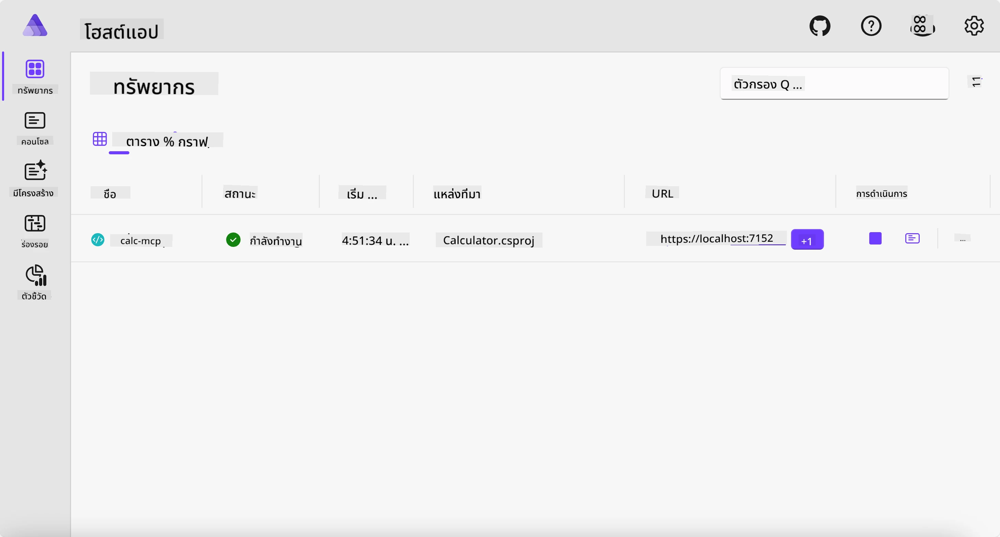
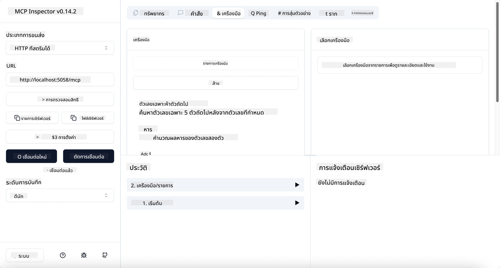
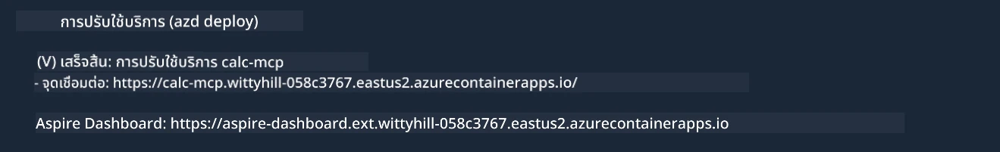

# ตัวอย่าง

ตัวอย่างก่อนหน้านี้แสดงวิธีใช้งานโปรเจ็กต์ .NET แบบท้องถิ่นด้วยประเภท `stdio` และวิธีรันเซิร์ฟเวอร์ในเครื่องในคอนเทนเนอร์ นี่เป็นวิธีแก้ปัญหาที่ดีในหลายสถานการณ์ อย่างไรก็ตาม การให้เซิร์ฟเวอร์ทำงานจากระยะไกล เช่น ในสภาพแวดล้อมคลาวด์อาจมีประโยชน์ ซึ่งตรงนี้คือที่ที่ประเภท `http` เข้ามา

เมื่อดูที่โซลูชันในโฟลเดอร์ `04-PracticalImplementation` อาจดูซับซ้อนกว่าตัวอย่างก่อนหน้านี้มาก แต่จริงๆ แล้วไม่ใช่ ถ้าคุณดูโปรเจ็กต์ `src/Calculator` อย่างละเอียด จะเห็นว่าเป็นโค้ดเดียวกับตัวอย่างก่อนหน้า แตกต่างเพียงแค่เราใช้ไลบรารี `ModelContextProtocol.AspNetCore` ในการจัดการคำขอ HTTP และเราเปลี่ยนเมทอด `IsPrime` ให้เป็นส่วนตัว เพื่อแสดงว่าคุณสามารถมีเมทอดส่วนตัวในโค้ดได้ ส่วนที่เหลือของโค้ดยังคงเหมือนเดิม

โปรเจ็กต์อื่น ๆ มาจาก [Aspire](https://aspire.dev/get-started/what-is-aspire/) การมี Aspire ในโซลูชันจะช่วยปรับปรุงประสบการณ์ของนักพัฒนาในระหว่างการพัฒนาและทดสอบ รวมถึงช่วยตรวจสอบสถานะระบบ มันไม่จำเป็นสำหรับการรันเซิร์ฟเวอร์ แต่เป็นแนวทางปฏิบัติที่ดีที่จะมีไว้ในโซลูชันของคุณ

## เริ่มต้นเซิร์ฟเวอร์ในเครื่อง

1. จาก VS Code (พร้อมส่วนขยาย C# DevKit) ให้ไปที่ไดเรกทอรี `04-PracticalImplementation/samples/csharp`
1. รันคำสั่งต่อไปนี้เพื่อเริ่มเซิร์ฟเวอร์:

   ```bash
    dotnet watch run --project ./src/AppHost
   ```

1. เมื่อเว็บเบราว์เซอร์เปิด Aspire dashboard ให้สังเกต URL `http` ซึ่งควรเป็นอย่างเช่น `http://localhost:5058/`

   

## ทดสอบ Streamable HTTP ด้วย MCP Inspector

ถ้าคุณมี Node.js เวอร์ชัน 22.7.5 ขึ้นไป สามารถใช้ MCP Inspector ในการทดสอบเซิร์ฟเวอร์ของคุณได้

เริ่มเซิร์ฟเวอร์แล้วรันคำสั่งต่อไปนี้ในเทอร์มินัล:

```bash
npx @modelcontextprotocol/inspector http://localhost:5058
```



- เลือก `Streamable HTTP` เป็นประเภทการส่งข้อมูล
- ในช่อง Url ให้ใส่ URL ของเซิร์ฟเวอร์ที่จดไว้ก่อนหน้า พร้อมต่อท้ายด้วย `/mcp` ซึ่งควรเป็น `http` (ไม่ใช่ `https`) เช่น `http://localhost:5058/mcp`
- เลือกปุ่ม Connect

สิ่งดีของ Inspector คือให้การมองเห็นที่ดีว่ากำลังเกิดอะไรขึ้น

- ลองแสดงรายการเครื่องมือที่มี
- ลองใช้งานเครื่องมือบางตัว มันควรทำงานเหมือนเดิม

## ทดสอบ MCP Server กับ GitHub Copilot Chat ใน VS Code

เพื่อใช้การส่งข้อมูล Streamable HTTP กับ GitHub Copilot Chat ให้เปลี่ยนการตั้งค่าเซิร์ฟเวอร์ `calc-mcp` ที่สร้างไว้ก่อนหน้า ให้ดูเหมือนด้านล่างนี้:

```jsonc
// .vscode/mcp.json
{
  "servers": {
    "calc-mcp": {
      "type": "http",
      "url": "http://localhost:5058/mcp"
    }
  }
}
```

ทำการทดสอบ:

- ถามว่า "3 prime numbers after 6780" สังเกตว่า Copilot จะใช้เครื่องมือใหม่ `NextFivePrimeNumbers` และคืนค่าจำนวนเฉพาะ 3 ตัวแรกเท่านั้น
- ถามว่า "7 prime numbers after 111" ดูว่าเกิดอะไรขึ้น
- ถามว่า "John มีลูกกวาด 24 เม็ดและต้องการแจกให้ลูก ๆ 3 คนเท่า ๆ กัน ลูกแต่ละคนจะได้รับกี่เม็ด" ดูว่าเกิดอะไรขึ้น

## ปล่อยเซิร์ฟเวอร์ไปที่ Azure

มาปล่อยเซิร์ฟเวอร์ไปที่ Azure เพื่อให้ผู้คนมากขึ้นใช้ได้

จากเทอร์มินัล ให้ไปยังโฟลเดอร์ `04-PracticalImplementation/samples/csharp` และรันคำสั่งต่อไปนี้:

```bash
azd up
```

เมื่อการปล่อยเสร็จสิ้น คุณควรเห็นข้อความแบบนี้:



คัดลอก URL ไปใช้ใน MCP Inspector และ GitHub Copilot Chat

```jsonc
// .vscode/mcp.json
{
  "servers": {
    "calc-mcp": {
      "type": "http",
      "url": "https://calc-mcp.gentleriver-3977fbcf.australiaeast.azurecontainerapps.io/mcp"
    }
  }
}
```

## ขั้นตอนต่อไปคืออะไร?

เราทดลองประเภทการส่งข้อมูลและเครื่องมือทดสอบต่าง ๆ รวมถึงปล่อยเซิร์ฟเวอร์ MCP ของคุณไปที่ Azure แต่ถ้าเซิร์ฟเวอร์ของเราต้องเข้าถึงทรัพยากรส่วนตัว เช่น ฐานข้อมูลหรือ API ส่วนตัวล่ะ? ในบทถัดไป เราจะดูวิธีเพิ่มความปลอดภัยให้เซิร์ฟเวอร์ของเรา

---

<!-- CO-OP TRANSLATOR DISCLAIMER START -->
**ปฏิเสธความรับผิดชอบ**:
เอกสารนี้ได้รับการแปลโดยใช้บริการแปลภาษา AI [Co-op Translator](https://github.com/Azure/co-op-translator) ขณะที่เราพยายามให้ความถูกต้อง โปรดทราบว่าการแปลโดยอัตโนมัติอาจมีข้อผิดพลาดหรือความไม่ถูกต้อง เอกสารต้นฉบับในภาษาต้นทางควรถูกพิจารณาเป็นแหล่งข้อมูลที่เชื่อถือได้ สำหรับข้อมูลที่สำคัญ แนะนำให้ใช้การแปลโดยมนุษย์มืออาชีพ เราไม่รับผิดชอบต่อความเข้าใจผิดหรือการตีความที่ผิดพลาดที่เกิดขึ้นจากการใช้การแปลนี้
<!-- CO-OP TRANSLATOR DISCLAIMER END -->