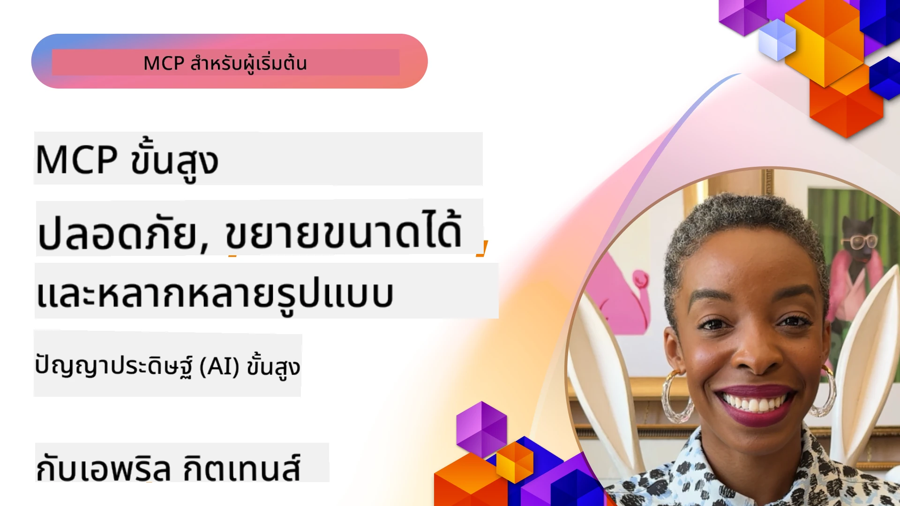

# หัวข้อขั้นสูงใน MCP

_(คลิกที่ภาพด้านบนเพื่อดูวิดีโอของบทเรียนนี้)_

บทนี้ครอบคลุมหัวข้อขั้นสูงหลายประการในการใช้งาน Model Context Protocol (MCP) รวมถึงการบูรณาการแบบมัลติ-โหมด, การปรับขนาด, แนวปฏิบัติที่ดีที่สุดด้านความปลอดภัย และการรวมระบบสำหรับองค์กร หัวข้อเหล่านี้มีความสำคัญสำหรับการสร้างแอปพลิเคชัน MCP ที่ทนทานและพร้อมใช้งานในสภาพแวดล้อมการผลิตที่สามารถตอบสนองความต้องการของระบบ AI สมัยใหม่ได้

## ภาพรวม

บทเรียนนี้สำรวจแนวคิดขั้นสูงในการใช้งาน Model Context Protocol โดยมุ่งเน้นที่การบูรณาการแบบมัลติ-โหมด, การปรับขนาด, แนวปฏิบัติที่ดีที่สุดด้านความปลอดภัย และการรวมระบบสำหรับองค์กร หัวข้อเหล่านี้เป็นสิ่งจำเป็นสำหรับการสร้างแอปพลิเคชัน MCP ระดับการผลิตที่สามารถจัดการกับความต้องการที่ซับซ้อนในสภาพแวดล้อมองค์กร

> **บันทึกสเปคปัจจุบัน:** MCP `2026-07-28` เลิกใช้ Roots และ
> primitive Sampling ที่ครอบคลุมในบทเรียน 5.4 และ 5.6 นอกจากนี้
> ยังได้ย้ายฟีเจอร์ทดลอง Tasks ที่อ้างอิงใน Protocol Features (5.16)
> ไปยังส่วนขยาย Tasks เฉพาะ บทเรียนเหล่านั้นยังคงรักษาไว้สำหรับ
> การใช้งาน `2025-11-25` แบบเก่าและรวมคำแนะนำการย้ายข้อมูลไว้ ดู
> [สิ่งที่เปลี่ยนแปลงใน MCP: สเปค 2026-07-28](../01-CoreConcepts/mcp-2026-07-28.md)

## วัตถุประสงค์การเรียนรู้

เมื่อจบบทเรียนนี้ คุณจะสามารถ:

- ดำเนินการฟีเจอร์มัลติ-โหมดในกรอบงาน MCP
- ออกแบบสถาปัตยกรรม MCP ที่ปรับขนาดได้สำหรับสถานการณ์ที่ต้องการสูง
- นำแนวปฏิบัติความปลอดภัยที่ดีที่สุดมาใช้โดยสอดคล้องกับหลักการความปลอดภัยของ MCP
- รวม MCP เข้ากับระบบ AI และกรอบงานสำหรับองค์กร
- ปรับปรุงประสิทธิภาพและความน่าเชื่อถือในสภาพแวดล้อมการผลิต

## บทเรียนและโครงการตัวอย่าง

| ลิงก์ | ชื่อเรื่อง | คำอธิบาย |
|------|-------|-------------|
| [5.1 Integration with Azure](./mcp-integration/README.md) | การรวมกับ Azure | เรียนรู้วิธีการรวม MCP Server ของคุณบน Azure |
| [5.2 Multi modal sample](./mcp-multi-modality/README.md) | ตัวอย่างมัลติ-โหมด MCP | ตัวอย่างสำหรับเสียง, ภาพ และการตอบสนองแบบมัลติ-โหมด |
| [5.3 MCP OAuth2 sample](../../../05-AdvancedTopics/mcp-oauth2-demo) | ตัวอย่าง MCP OAuth2 | แอป Spring Boot ขั้นต่ำที่แสดงการใช้ OAuth2 กับ MCP ทั้งในฐานะ Authorization และ Resource Server แสดงการออกโทเค็นอย่างปลอดภัย, ป้องกันจุดสิ้นสุด, การปรับใช้ใน Azure Container Apps และการรวมมือกับ API Management |
| [5.4 Root Contexts](./mcp-root-contexts/README.md) | Root contexts | เรียนรู้ primitive Roots รุ่นเก่า `2025-11-25` และตัวเลือกการย้ายข้อมูลปัจจุบัน (เลิกใช้ใน `2026-07-28`) |
| [5.5 Routing](./mcp-routing/README.md) | Routing | เรียนรู้ประเภทต่าง ๆ ของ routing |
| [5.6 Sampling](./mcp-sampling/README.md) | Sampling | เรียนรู้ primitive Sampling รุ่นเก่า `2025-11-25` และตัวเลือกการย้ายข้อมูลปัจจุบัน (เลิกใช้ใน `2026-07-28`) |
| [5.7 Scaling](./mcp-scaling/README.md) | การปรับขนาด | เรียนรู้เกี่ยวกับการปรับขนาด |
| [5.8 Security](./mcp-security/README.md) | ความปลอดภัย | ปกป้อง MCP Server ของคุณ |
| [5.9 Web Search sample](./web-search-mcp/README.md) | Web Search MCP | MCP server และ client ภาษา Python ที่รวมกับ SerpAPI สำหรับการค้นหาเว็บ, ข่าว, สินค้า และ Q&A แบบเรียลไทม์ แสดงการประสานงานเครื่องมือหลายตัว, การรวม API ภายนอก และการจัดการข้อผิดพลาดอย่างมั่นคง |
| [5.10 Realtime Streaming](./mcp-realtimestreaming/README.md) | การสตรีมมิ่ง | การสตรีมข้อมูลแบบเรียลไทม์กลายเป็นสิ่งสำคัญในโลกที่ขับเคลื่อนด้วยข้อมูลปัจจุบัน ซึ่งธุรกิจและแอปต้องการเข้าถึงข้อมูลทันทีเพื่อการตัดสินใจที่ทันท่วงที |
| [5.11 Realtime Web Search](./mcp-realtimesearch/README.md) | การค้นหาเว็บ | การค้นหาเว็บแบบเรียลไทม์ MCP เปลี่ยนแปลงการค้นหาเว็บแบบเรียลไทม์โดยการจัดการบริบทอย่างมาตรฐานในโมเดล AI, เครื่องมือค้นหา และแอปพลิเคชัน |
| [5.12  Entra ID Authentication for Model Context Protocol Servers](./mcp-security-entra/README.md) | การตรวจสอบตัวตน Entra ID | Microsoft Entra ID ให้โซลูชั่นการจัดการตัวตนและการเข้าถึงบนคลาวด์ที่แข็งแกร่ง ช่วยให้มั่นใจว่าผู้ใช้และแอปที่ได้รับอนุญาตเท่านั้นที่สามารถโต้ตอบกับ MCP server ของคุณ |
| [5.13 Microsoft Foundry Agent Integration](./mcp-foundry-agent-integration/README.md) | การรวม Microsoft Foundry | เรียนรู้วิธีรวม MCP servers กับ agents ของ Microsoft Foundry เพื่อเปิดใช้งานการประสานงานเครื่องมือที่ทรงพลังและความสามารถ AI สำหรับองค์กรด้วยการเชื่อมต่อแหล่งข้อมูลภายนอกอย่างมาตรฐาน |
| [5.14 Context Engineering](./mcp-contextengineering/README.md) | วิศวกรรมบริบท | โอกาสในอนาคตของเทคนิควิศวกรรมบริบทสำหรับ MCP servers รวมถึงการเพิ่มประสิทธิภาพบริบท, การจัดการบริบทแบบไดนามิก และกลยุทธ์สำหรับการออกแบบ prompt ที่มีประสิทธิผลภายในกรอบ MCP |
| [5.15 MCP Custom Transport](./mcp-transport/README.md) | การขนส่งแบบกำหนดเอง | เรียนรู้วิธีการใช้งานกลไกการขนส่งแบบกำหนดเองสำหรับสถานการณ์การสื่อสาร MCP พิเศษ |
| [5.16 Protocol Features Deep Dive](./mcp-protocol-features/README.md) | ฟีเจอร์โปรโตคอล | เชี่ยวชาญฟีเจอร์โปรโตคอลขั้นสูง รวมถึงการแจ้งความคืบหน้า, การยกเลิกคำขอ, แม่แบบทรัพยากร และรูปแบบการจัดการข้อผิดพลาด |
| [5.17 Adversarial Multi-Agent Reasoning](./mcp-adversarial-agents/README.md) | ตัวแทนคู่ต่อสู้ | ใช้ตัวแทนสองตัวที่มีจุดยืนตรงข้าม แชร์ชุดเครื่องมือ MCP เดียวกัน เพื่อตรวจจับฮัลูซิเนชัน, เผยกรณีขอบ และสร้างผลลัพธ์ที่แม่นยำยิ่งขึ้นผ่านการโต้วาทีที่มีโครงสร้าง |

> **บันทึกประวัติศาสตร์ `2025-11-25`:** เวอร์ชันนั้นเพิ่มฟีเจอร์
> ทดลอง Tasks และขยายฟีเจอร์โปรโตคอลหลายรายการ ใน `2026-07-28`
> Tasks ได้ย้ายไปยังส่วนขยายอย่างเป็นทางการและ Roots ถูกเลิกใช้ ห้ามใช้
> สถานะฟีเจอร์ `2025-11-25` เป็นคำแนะนำปัจจุบัน; ดู
> [บันทึกการเปลี่ยนแปลง 2026-07-28](https://modelcontextprotocol.io/specification/2026-07-28/changelog)

## เอกสารอ้างอิงเพิ่มเติม

สำหรับข้อมูลล่าสุดเกี่ยวกับหัวข้อขั้นสูงของ MCP ให้ดูที่:
- [เอกสาร MCP](https://modelcontextprotocol.io/)
- [สเปค MCP (2026-07-28)](https://modelcontextprotocol.io/specification/2026-07-28/)
- [GitHub Repository](https://github.com/modelcontextprotocol)
- [OWASP MCP Top 10](https://microsoft.github.io/mcp-azure-security-guide/mcp/) - ความเสี่ยงความปลอดภัยและมาตรการบรรเทา
- [MCP Security Summit Workshop (Sherpa)](https://azure-samples.github.io/sherpa/) - การฝึกอบรมความปลอดภัยแบบทำปฏิบัติ

## ประเด็นสำคัญที่ควรจดจำ

- การใช้งาน MCP แบบมัลติ-โหมดช่วยขยายความสามารถ AI นอกเหนือจากการประมวลผลข้อความ
- การปรับขนาดเป็นสิ่งจำเป็นสำหรับการปรับใช้ในองค์กรและสามารถจัดการได้ด้วยการปรับขนาดในแนวนอนและแนวตั้ง
- มาตรการความปลอดภัยครบวงจรช่วยปกป้องข้อมูลและรับรองการควบคุมการเข้าถึงที่เหมาะสม
- การรวมระบบองค์กรกับแพลตฟอร์มเช่น Azure OpenAI และ Microsoft AI Foundry ช่วยเพิ่มความสามารถของ MCP
- การใช้งาน MCP ขั้นสูงได้ประโยชน์จากสถาปัตยกรรมที่ปรับแต่งและการจัดการทรัพยากรอย่างรอบคอบ

## แบบฝึกหัด

ออกแบบการใช้งาน MCP ระดับองค์กรสำหรับกรณีการใช้งานเฉพาะ:

1. ระบุความต้องการแบบมัลติ-โหมดสำหรับกรณีการใช้งานของคุณ
2. สรุปการควบคุมความปลอดภัยที่จำเป็นเพื่อปกป้องข้อมูลที่ละเอียดอ่อน
3. ออกแบบสถาปัตยกรรมที่ปรับขนาดได้ซึ่งสามารถจัดการกับภาระงานที่แตกต่างกัน
4. วางแผนจุดรวมระบบกับระบบ AI สำหรับองค์กร
5. จดบันทึกปัญหาอาจเกิดขึ้นในประสิทธิภาพและแนวทางบรรเทา

## ทรัพยากรเพิ่มเติม

- [เอกสาร Azure OpenAI](https://learn.microsoft.com/en-us/azure/ai-services/openai/)
- [เอกสาร Microsoft AI Foundry](https://learn.microsoft.com/en-us/ai-services/)

---

## ต่อไป

สำรวจบทเรียนในโมดูลนี้เริ่มจาก: [5.1 การรวม MCP](./mcp-integration/README.md)

เมื่อคุณทำโมดูลนี้เสร็จแล้ว ให้ไปต่อที่: [โมดูล 6: การมีส่วนร่วมของชุมชน](../06-CommunityContributions/README.md)

---

<!-- CO-OP TRANSLATOR DISCLAIMER START -->
**ปฏิเสธความรับผิดชอบ**:
เอกสารนี้ได้รับการแปลโดยใช้บริการแปลภาษา AI [Co-op Translator](https://github.com/Azure/co-op-translator) ขณะที่เราพยายามให้ความถูกต้อง โปรดทราบว่าการแปลโดยอัตโนมัติอาจมีข้อผิดพลาดหรือความไม่ถูกต้อง เอกสารต้นฉบับในภาษาต้นทางควรถูกพิจารณาเป็นแหล่งข้อมูลที่เชื่อถือได้ สำหรับข้อมูลที่สำคัญ แนะนำให้ใช้การแปลโดยมนุษย์มืออาชีพ เราไม่รับผิดชอบต่อความเข้าใจผิดหรือการตีความที่ผิดพลาดที่เกิดขึ้นจากการใช้การแปลนี้
<!-- CO-OP TRANSLATOR DISCLAIMER END -->