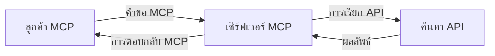
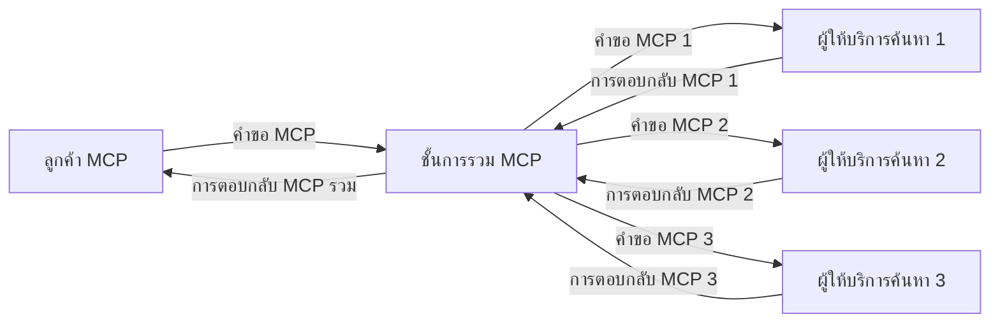
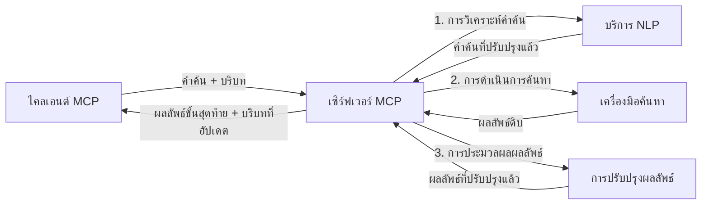

# โปรโตคอลบริบทโมเดลสำหรับการค้นหาเว็บแบบเรียลไทม์

## ภาพรวม

การค้นหาเว็บแบบเรียลไทม์กลายเป็นสิ่งสำคัญในสภาพแวดล้อมข้อมูลในปัจจุบันที่แอปพลิเคชันต้องการเข้าถึงข้อมูลล่าสุดทันทีทั่วอินเทอร์เน็ตเพื่อให้สามารถตอบสนองได้อย่างตรงประเด็นและทันเวลา โปรโตคอลบริบทโมเดล (MCP) ถือเป็นความก้าวหน้าที่สำคัญในการเพิ่มประสิทธิภาพกระบวนการค้นหาแบบเรียลไทม์เหล่านี้ ทั้งการเพิ่มประสิทธิภาพการค้นหา การรักษาความสมบูรณ์ของบริบท และการปรับปรุงประสิทธิภาพโดยรวมของระบบ

โมดูลนี้สำรวจว่า MCP เปลี่ยนแปลงการค้นหาเว็บแบบเรียลไทม์อย่างไรโดยการจัดหาวิธีการมาตรฐานในการจัดการบริบทระหว่างโมเดล AI, เครื่องมือค้นหา และแอปพลิเคชันต่างๆ

### สิ่งที่คุณจะได้เรียนรู้

ในคู่มือครอบคลุมนี้ คุณจะพบกับ:

- วิธีที่ MCP สร้างสะพานเชื่อมต่ออย่างราบรื่นระหว่างโมเดล AI และความสามารถในการค้นหาเว็บแบบเรียลไทม์
- รูปแบบสถาปัตยกรรมสำหรับการพัฒนาวิธีแก้ไขการค้นหาที่มีประสิทธิภาพและขยายตัวได้ด้วย MCP
- เทคนิคในการรักษาบริบทการค้นหาข้ามหลายคำค้นหาและปฏิสัมพันธ์
- ตัวอย่างโค้ดเชิงปฏิบัติใน Python และ JavaScript สำหรับสถานการณ์การค้นหาต่างๆ
- วิธีการปรับสมดุลความเกี่ยวข้อง ความทันสมัย และประสิทธิภาพในระบบค้นหาที่ใช้ MCP

## บทนำสู่การค้นหาเว็บแบบเรียลไทม์

การค้นหาเว็บแบบเรียลไทม์เป็นวิธีการทางเทคโนโลยีที่ช่วยให้สามารถสอบถาม ประมวลผล และวิเคราะห์ข้อมูลบนเว็บอย่างต่อเนื่องในขณะที่ข้อมูลถูกเผยแพร่หรืออัปเดต ทำให้ระบบสามารถให้ข้อมูลที่สดใหม่และเกี่ยวข้องได้ด้วยความหน่วงเวลาต่ำ แตกต่างจากระบบค้นหาแบบดั้งเดิมที่ทำงานบนข้อมูลที่จัดทำดัชนีซึ่งอาจเก่าเป็นชั่วโมงหรือวัน การค้นหาแบบเรียลไทม์จะประมวลผลข้อมูลสดจากเว็บ ส่งมอบข้อมูลและข้อเท็จจริงที่สะท้อนสถานะปัจจุบันของเนื้อหาออนไลน์

### แนวคิดหลักของการค้นหาเว็บแบบเรียลไทม์:

- **การประมวลผลคำค้นหาต่อเนื่อง**: การค้นหาจะดำเนินการกับแหล่งข้อมูลที่อัปเดตอย่างต่อเนื่อง
- **การให้ความสำคัญกับความทันสมัย**: ระบบถูกออกแบบเพื่อเน้นข้อมูลใหม่เป็นหลัก
- **การปรับสมดุลความเกี่ยวข้อง**: รักษาสมดุลระหว่างความเกี่ยวข้องและความทันสมัย
- **สถาปัตยกรรมที่สามารถขยายตัวได้**: ระบบต้องรองรับโหลดคำค้นหาและปริมาณข้อมูลที่แตกต่างกันได้
- **ความเข้าใจบริบท**: การรักษาบริบทของผู้ใช้ในหลายๆ การค้นหามีความสำคัญต่อผลลัพธ์ที่มีความหมาย
- **การปรับคำค้นหาแบบไดนามิก**: การปรับเปลี่ยนคำค้นหาอย่างมีประสิทธิภาพตามบริบทและผลลัพธ์ก่อนหน้า
- **การรวมข้อมูลจากหลายแหล่ง**: การผสมผสานผลการค้นหาจากผู้ให้บริการค้นหาและแหล่งเว็บหลายแห่ง
- **ความเข้าใจทางความหมาย**: การประมวลผลคำค้นหาและเนื้อหาตามความหมายมากกว่าคำสำคัญเพียงอย่างเดียว
- **การจัดอันดับแบบเรียลไทม์**: การปรับอันดับผลการค้นหาอย่างต่อเนื่องตามข้อมูลใหม่ที่เข้ามา

### โปรโตคอลบริบทโมเดลและการค้นหาเว็บแบบเรียลไทม์

โปรโตคอลบริบทโมเดล (MCP) แก้ไขความท้าทายหลายประการในสภาพแวดล้อมการค้นหาเว็บแบบเรียลไทม์ดังนี้:

1. **การรักษาบริบทการค้นหา**: MCP มาตรฐานวิธีการรักษาบริบทในส่วนประกอบการค้นหาที่กระจายอยู่ เพื่อให้โมเดล AI และโหนดประมวลผลสามารถเข้าถึงประวัติคำค้นหาและความชอบของผู้ใช้อย่างเหมาะสม

2. **การจัดการคำค้นหาที่มีประสิทธิภาพ**: โดยการจัดเตรียมกลไกโครงสร้างสำหรับการส่งผ่านบริบท MCP ช่วยลดภาระการทำซ้ำบริบทในทุกขั้นตอนของการค้นหา

3. **ความสามารถในการทำงานร่วมกัน**: MCP สร้างภาษาทั่วไปสำหรับการแบ่งปันบริบทระหว่างเทคโนโลยีการค้นหาที่หลากหลายและโมเดล AI ทำให้สถาปัตยกรรมยืดหยุ่นและขยายตัวได้มากขึ้น

4. **บริบทที่เหมาะสมกับการค้นหา**: การนำ MCP ไปใช้ช่วยให้สามารถจัดลำดับความสำคัญขององค์ประกอบบริบทที่เกี่ยวข้องเพื่อการค้นหาที่มีประสิทธิภาพสูงสุด โดยมุ่งเน้นทั้งประสิทธิภาพและความแม่นยำ

5. **การประมวลผลค้นหาแบบปรับตัว**: ด้วยการจัดการบริบทที่เหมาะสมผ่าน MCP ระบบค้นหาสามารถปรับการประมวลผลได้อย่างไดนามิกตามความต้องการผู้ใช้และสภาพแวดล้อมข้อมูลที่เปลี่ยนแปลง

ในแอปพลิเคชันสมัยใหม่ตั้งแต่การรวบรวมข่าวสารจนถึงผู้ช่วยวิจัย การผสาน MCP กับเทคโนโลยีค้นหาเว็บช่วยให้การค้นหาฉลาดขึ้นและตระหนักบริบทมากขึ้น ซึ่งสามารถให้ผลลัพธ์ที่เกี่ยวข้องยิ่งขึ้นตามปฏิสัมพันธ์ของผู้ใช้ที่ดำเนินต่อไป

## วัตถุประสงค์การเรียนรู้

เมื่อสิ้นสุดบทเรียนนี้ คุณจะสามารถ:

- เข้าใจพื้นฐานของการค้นหาเว็บแบบเรียลไทม์และความท้าทายในแอปพลิเคชันสมัยใหม่
- อธิบายว่าโปรโตคอลบริบทโมเดล (MCP) ช่วยเพิ่มขีดความสามารถในการค้นหาเว็บแบบเรียลไทม์อย่างไร
- พัฒนาวิธีแก้ไขการค้นหาที่ใช้ MCP ด้วยเฟรมเวิร์กและ API ยอดนิยม
- ออกแบบและปรับใช้สถาปัตยกรรมค้นหาที่ขยายตัวและมีประสิทธิภาพสูงด้วย MCP
- นำแนวคิด MCP ไปใช้กับกรณีใช้งานต่างๆ รวมทั้งการค้นหาเชิงความหมาย ผู้ช่วยวิจัย และการท่องเว็บเสริมด้วย AI
- ประเมินแนวโน้มใหม่และนวัตกรรมในเทคโนโลยีการค้นหาที่ใช้ MCP
- พัฒนาระบบค้นหาที่ตระหนักถึงบริบทและเรียนรู้จากการโต้ตอบของผู้ใช้
- ผสานความสามารถค้นหาเว็บเข้ากับผู้ช่วย AI โดยใช้โปรโตคอล MCP ที่เป็นมาตรฐาน
- สร้างสายการค้นหาหลายขั้นตอนที่ค่อยๆ ปรับผลลัพธ์โดยพิจารณาบริบท
- ปรับประสิทธิภาพการค้นหาในขณะที่รักษาการตระหนักรู้บริบทอย่างครบถ้วน

### คำนิยามและความสำคัญ

การค้นหาเว็บแบบเรียลไทม์คือการค้นหา การดึงข้อมูล และการส่งมอบข้อมูลบนเว็บอย่างต่อเนื่องด้วยความหน่วงเวลาต่ำ แตกต่างจากเครื่องมือค้นหาแบบดั้งเดิมที่รวบรวมและจัดทำดัชนีเว็บเป็นระยะ ๆ การค้นหาแบบเรียลไทม์มุ่งเน้นให้ข้อมูลปรากฏขึ้นทันทีเมื่อมีข้อมูลใหม่ ทำให้สามารถเข้าถึงเนื้อหาที่ทันสมัยที่สุดได้ทันที

ลักษณะสำคัญของการค้นหาเว็บแบบเรียลไทม์ได้แก่:

- **ความสดใหม่**: ให้ความสำคัญกับเนื้อหาและการปรับปรุงล่าสุด
- **การประมวลผลต่อเนื่อง**: ตรวจสอบข้อมูลใหม่อย่างสม่ำเสมอ
- **การปรับคำค้นหา**: ปรับแต่งคำค้นหาตามบริบทและข้อเสนอแนะ
- **การส่งมอบทันที**: ให้ผลค้นหาด้วยความล่าช้าน้อยที่สุด
- **การรักษาบริบท**: ใช้ข้อมูลจากคำค้นหาก่อนหน้าเพื่อเพิ่มความเกี่ยวข้อง

### ความท้าทายในค้นหาเว็บแบบดั้งเดิม

วิธีการค้นหาเว็บแบบดั้งเดิมเผชิญข้อจำกัดหลายประการเมื่อใช้ในสถานการณ์แบบเรียลไทม์:

1. **บริบทกระจัดกระจาย**: การรักษาบริบทการค้นหาข้ามหลายคำค้นหาทำได้ยาก
2. **ความสดใหม่ของข้อมูล**: มีปัญหาในการเข้าถึงและให้ความสำคัญกับข้อมูลล่าสุด
3. **ความซับซ้อนในการผสานรวม**: ปัญหาในการทำงานร่วมกันระหว่างระบบค้นหาและแอปพลิเคชันต่างๆ
4. **ปัญหาความหน่วงเวลา**: การปรับสมดุลระหว่างการค้นหาครอบคลุมและเวลาตอบสนอง
5. **การปรับจูนความเกี่ยวข้อง**: การรักษาความแม่นยำและความเกี่ยวข้องในขณะให้ความสำคัญกับความทันสมัย

## ความเข้าใจโปรโตคอลบริบทโมเดล (MCP) สำหรับการค้นหา

### MCP คืออะไรในบริบทการค้นหา?

โปรโตคอลบริบทโมเดล (MCP) คือโปรโตคอลการสื่อสารที่เป็นมาตรฐานสำหรับช่วยให้เกิดการโต้ตอบที่มีประสิทธิภาพระหว่างโมเดล AI และแอปพลิเคชัน ในบริบทของการค้นหาเว็บแบบเรียลไทม์ MCP จัดเตรียมกรอบการทำงานสำหรับ:

- การรักษาบริบทการค้นหาตลอดช่วงคำค้นหา
- การมาตรฐานรูปแบบคำค้นหาและผลลัพธ์การค้นหา
- การเพิ่มประสิทธิภาพการส่งผ่านพารามิเตอร์และผลลัพธ์การค้นหา
- การเสริมการสื่อสารระหว่างโมเดลและเครื่องมือค้นหา

### ส่วนประกอบหลักและสถาปัตยกรรม

สถาปัตยกรรม MCP สำหรับการค้นหาเว็บแบบเรียลไทม์ประกอบด้วยส่วนประกอบสำคัญดังนี้:

1. **ผู้จัดการบริบทคำค้นหา**: จัดการและรักษาบริบทการค้นหาข้ามหลายคำค้นหา
2. **ตัวประมวลผลการค้นหา**: ประมวลผลคำขอค้นหาที่เข้ามาโดยใช้เทคนิคที่ตระหนักถึงบริบท
3. **ตัวแปลงโปรโตคอล**: แปลงระหว่าง API การค้นหาต่างๆ ขณะรักษาบริบท
4. **คลังบริบท**: จัดเก็บและดึงประวัติการค้นหาและความชอบได้อย่างมีประสิทธิภาพ
5. **ตัวเชื่อมต่อการค้นหา**: เชื่อมต่อกับเครื่องมือค้นหาและ API เว็บต่างๆ


### MCP ช่วยปรับปรุงการค้นหาเว็บแบบเรียลไทม์อย่างไร

MCP แก้ไขความท้าทายในค้นหาเว็บแบบดั้งเดิมด้วย:

- **ความต่อเนื่องของบริบท**: รักษาความสัมพันธ์ระหว่างคำค้นหาในช่วงเซสชันการค้นหาทั้งหมด
- **การส่งผ่านที่ปรับแต่ง**: ลดความซ้ำซ้อนในพารามิเตอร์การค้นหาผ่านการจัดการบริบทอย่างชาญฉลาด
- **อินเทอร์เฟซมาตรฐาน**: ให้ API ที่สม่ำเสมอสำหรับส่วนประกอบค้นหา
- **ลดความหน่วงเวลา**: ลดภาระการประมวลผลด้วยการจัดการบริบทที่มีประสิทธิภาพ
- **เพิ่มความเกี่ยวข้อง**: ปรับปรุงความเกี่ยวข้องโดยรักษาเจตนาของผู้ใช้ในหลายคำค้นหา

## การผสานรวมและการใช้งาน

ระบบค้นหาเว็บแบบเรียลไทม์ต้องมีการออกแบบสถาปัตยกรรมและการใช้งานอย่างระมัดระวังเพื่อรักษาทั้งประสิทธิภาพและความสมบูรณ์ของบริบท โปรโตคอลบริบทโมเดลมอบวิธีมาตรฐานในการผสานโมเดล AI และเทคโนโลยีค้นหา ทำให้สามารถสร้างสายการค้นหาที่ตระหนักบริบทได้อย่างซับซ้อนยิ่งขึ้น

### ภาพรวมการผสาน MCP ในสถาปัตยกรรมการค้นหา

การนำ MCP ไปใช้ในสภาพแวดล้อมการค้นหาเว็บแบบเรียลไทม์มีข้อพิจารณาหลักหลายประการ:

1. **การอนุกรมวิธานบริบทการค้นหา**: MCP มีวิธีที่มีประสิทธิภาพในการเข้ารหัสข้อมูลบริบทในคำขอค้นหา เพื่อให้บริบทสำคัญติดตามคำค้นหาไปตลอดสายการประมวลผล ซึ่งรวมถึงรูปแบบการอนุกรมวิธานมาตรฐานที่เหมาะสำหรับเมตาดาต้าการค้นหา

2. **การประมวลผลค้นหาแบบมีสถานะ**: MCP ช่วยให้การประมวลผลที่ชาญฉลาดและมีความสม่ำเสมอในตัวแทนการบริหารบริบทตลอดคำค้นหาหลายรอบ ซึ่งมีค่าอย่างยิ่งในสายการค้นหาหลายขั้นตอนที่การปรับปรุงบริบทช่วยให้ผลลัพธ์ดีขึ้น

3. **การขยายและปรับแต่งคำค้นหา**: การใช้งาน MCP ในระบบค้นหาสามารถสนับสนุนการขยายและปรับแต่งคำค้นหาที่ซับซ้อนตามบริบทที่สะสม ทำให้ผลลัพธ์มีความเกี่ยวข้องมากขึ้นเมื่อเซสชันการค้นหาดำเนินต่อไป

4. **การแคชผลลัพธ์และการจัดลำดับความสำคัญ**: ด้วยการจัดการบริบทที่เป็นมาตรฐาน MCP ช่วยควบคุมการแคชผลลัพธ์และการจัดลำดับความสำคัญ ทำให้ส่วนประกอบสามารถปรับตัวตามบริบทการค้นหาที่เปลี่ยนแปลง

5. **การรวมและรวบรวมผลการค้นหาแบบสหพันธ์**: MCP ช่วยให้การรวมผลการค้นหาจากแบ็กเอนด์หลายแห่งมีความซับซ้อนขึ้นโดยให้การแทนบริบทการค้นหาในรูปแบบโครงสร้าง ช่วยให้สามารถรวบรวมผลลัพธ์จากแหล่งข้อมูลหลากหลายได้อย่างมีความหมายมากกว่าเดิม

การใช้งาน MCP กับเทคโนโลยีค้นหาต่างๆ สร้างแนวทางรวมศูนย์ในการจัดการบริบท ลดความจำเป็นในโค้ดผสานรวมแบบกำหนดเองในขณะเดียวกันก็เพิ่มความสามารถของระบบในการรักษาบริบทที่มีความหมายเมื่อคำค้นหาเปลี่ยนแปลง

### MCP ในการใช้งานค้นหาเว็บต่างๆ

ตัวอย่างเหล่านี้แสดงถึงข้อกำหนด MCP ปัจจุบันที่เน้นโปรโตคอล JSON-RPC พร้อมกลไกการส่งข้อมูลที่แตกต่างกัน โค้ดแสดงวิธีที่คุณสามารถนำไปใช้งานผสานการค้นหาแบบกำหนดเองในขณะที่คงความเข้ากันได้เต็มที่กับโปรโตคอล MCP


<details>
<summary>การใช้งานใน Python กับ Generic Search API</summary>

```python
import asyncio
import json
import aiohttp
from typing import Dict, Any, Optional, List
from contextlib import asynccontextmanager
from collections.abc import AsyncIterator

# นำเข้าไลบรารี MCP มาตรฐาน
from mcp.client.session import ClientSession
from mcp.client.streamable_http import streamablehttp_client
from mcp.types import TextContent, CreateMessageRequestParams, CreateMessageResult
from mcp.server.fastmcp import FastMCP

# สร้างเซิร์ฟเวอร์ FastMCP สำหรับการค้นหาเว็บ
search_server = FastMCP("WebSearch")

# คลาสสำหรับจัดการการดำเนินงานการค้นหาเว็บ
class WebSearchHandler:
    def __init__(self, api_endpoint: str, api_key: str):
        self.api_endpoint = api_endpoint
        self.api_key = api_key
        self.session = None
        
    async def initialize(self):
        """Initialize the HTTP session"""
        self.session = aiohttp.ClientSession(
            headers={"Authorization": f"Bearer {self.api_key}"}
        )
    
    async def close(self):
        """Close the HTTP session"""
        if self.session:
            await self.session.close()
            
    async def perform_search(self, query: str, max_results: int = 5, 
                           include_domains: List[str] = None, 
                           exclude_domains: List[str] = None,
                           time_period: str = "any") -> Dict[str, Any]:
        """Perform web search using the search API"""
        # สร้างพารามิเตอร์การค้นหา
        search_params = {
            "q": query,
            "limit": max_results,
            "time": time_period
        }
        
        if include_domains:
            search_params["site"] = ",".join(include_domains)
            
        if exclude_domains:
            search_params["exclude_site"] = ",".join(exclude_domains)
        
        # ดำเนินการคำขอค้นหา
        try:
            async with self.session.get(
                self.api_endpoint,
                params=search_params
            ) as response:
                if response.status != 200:
                    error_text = await response.text()
                    raise Exception(f"Search API error: {response.status} - {error_text}")
                
                search_data = await response.json()
                
                # แปลงการตอบสนองเฉพาะ API เป็นรูปแบบมาตรฐาน
                results = []
                for item in search_data.get("results", []):
                    results.append({
                        "title": item.get("title", ""),
                        "url": item.get("url", ""),
                        "snippet": item.get("snippet", ""),
                        "date": item.get("published_date", ""),
                        "source": item.get("source", "")
                    })
                
                return {
                    "query": query,
                    "totalResults": len(results),
                    "results": results
                }
        except Exception as e:
            print(f"Search API request error: {e}")
            raise

# เริ่มต้นตัวจัดการการค้นหา
search_handler = WebSearchHandler(
    api_endpoint="https://api.search-service.example/search",
    api_key="your-api-key-here"
)

# ตั้งค่าระยะเวลาการใช้งานเพื่อจัดการตัวจัดการการค้นหา
@asyncio.asynccontextmanager
async def app_lifespan(server: FastMCP):
    """Manage application lifecycle"""
    await search_handler.initialize()
    try:
        yield {"search_handler": search_handler}
    finally:
        await search_handler.close()

# กำหนดระยะเวลาการใช้งานสำหรับเซิร์ฟเวอร์
search_server = FastMCP("WebSearch", lifespan=app_lifespan)

# ลงทะเบียนเครื่องมือค้นหาเว็บ
@search_server.tool()
async def web_search(query: str, max_results: int = 5, 
                   include_domains: List[str] = None,
                   exclude_domains: List[str] = None,
                   time_period: str = "any") -> Dict[str, Any]:
    """
    Search the web for information
    
    Args:
        query: The search query
        max_results: Maximum number of results to return (default: 5)
        include_domains: List of domains to include in search results
        exclude_domains: List of domains to exclude from search results
        time_period: Time period for results ("day", "week", "month", "any")
        
    Returns:
        Dictionary containing search results
    """
    ctx = search_server.get_context()
    search_handler = ctx.request_context.lifespan_context["search_handler"]
    
    results = await search_handler.perform_search(
        query=query,
        max_results=max_results,
        include_domains=include_domains,
        exclude_domains=exclude_domains,
        time_period=time_period
    )
    
    return results

# ตัวอย่างการใช้งานของไคลเอนต์
async def client_example():
    # เชื่อมต่อกับเซิร์ฟเวอร์ค้นหาโดยใช้ Streamable HTTP transport
    async with streamablehttp_client("http://localhost:8000/mcp") as (read, write, _):
        async with ClientSession(read, write) as session:
            # เริ่มต้นการเชื่อมต่อ
            await session.initialize()
            
            # เรียกใช้เครื่องมือ web_search
            search_results = await session.call_tool(
                "web_search", 
                {
                    "query": "latest developments in AI and Model Context Protocol",
                    "max_results": 5,
                    "time_period": "day",
                    "include_domains": ["github.com", "microsoft.com"]
                }
            )
            
            print(f"Search results: {search_results}")

# ตัวอย่างการทำงานของเซิร์ฟเวอร์
if __name__ == "__main__":
    # รันเซิร์ฟเวอร์ด้วย Streamable HTTP transport
    search_server.run(transport="streamable-http")
```
</details> 

<details>
<summary>การใช้งานใน JavaScript กับการค้นหาเบราว์เซอร์</summary>


```javascript
// การติดตั้งเซิร์ฟเวอร์ MCP สำหรับการค้นหาเว็บ
import { McpServer, ResourceTemplate } from '@modelcontextprotocol/sdk/server/mcp.js';
import { StreamableHTTPServerTransport } from '@modelcontextprotocol/sdk/server/streamableHttp.js';
import { z } from 'zod';

// สร้างเซิร์ฟเวอร์ MCP สำหรับการค้นหาเว็บ
const searchServer = new McpServer({
    name: "BrowserSearch",
    description: "A server that provides web search capabilities"
});

// คลาสบริการค้นหา
class SearchService {
    constructor(searchApiUrl, apiKey) {
        this.searchApiUrl = searchApiUrl;
        this.apiKey = apiKey;
    }

    async performSearch(parameters) {
        const {
            query = '',
            maxResults = 5,
            includeDomains = [],
            excludeDomains = [],
            timePeriod = 'any'
        } = parameters;
        
        // สร้าง URL การค้นหาพร้อมพารามิเตอร์
        const url = new URL(this.searchApiUrl);
        url.searchParams.append('q', query);
        url.searchParams.append('limit', maxResults);
        url.searchParams.append('time', timePeriod);
        
        if (includeDomains.length > 0) {
            url.searchParams.append('site', includeDomains.join(','));
        }
        
        if (excludeDomains.length > 0) {
            url.searchParams.append('exclude_site', excludeDomains.join(','));
        }
        
        try {
            const response = await fetch(url.toString(), {
                method: 'GET',
                headers: {
                    'Authorization': `Bearer ${this.apiKey}`,
                    'Content-Type': 'application/json'
                }
            });
            
            if (!response.ok) {
                const errorText = await response.text();
                throw new Error(`Search API error: ${response.status} - ${errorText}`);
            }
            
            const searchData = await response.json();
            
            // แปลงการตอบสนองเฉพาะ API เป็นรูปแบบมาตรฐาน
            const results = searchData.results?.map(item => ({
                title: item.title || '',
                url: item.url || '',
                snippet: item.snippet || '',
                date: item.published_date || '',
                source: item.source || ''
            })) || [];
            
            return {
                query,
                totalResults: results.length,
                results
            };
        } catch (error) {
            console.error('Search API request error:', error);
            throw error;
        }
    }
}

// เริ่มต้นบริการค้นหา
const searchService = new SearchService(
    'https://api.search-service.example/search',
    'your-api-key-here'
);

// ตั้งค่าผู้ให้บริบทสำหรับเซิร์ฟเวอร์
searchServer.setContextProvider(() => {
    return {
        searchService
    };
});

// ลงทะเบียนเครื่องมือค้นหาเว็บ
searchServer.tool({
    name: 'web_search',
    description: 'Search the web for information',
    parameters: {
        type: 'object',
        properties: {
            query: {
                type: 'string',
                description: 'The search query'
            },
            maxResults: {
                type: 'integer',
                description: 'Maximum number of results to return',
                default: 5
            },
            includeDomains: {
                type: 'array',
                items: { type: 'string' },
                description: 'List of domains to include in search results'
            },
            excludeDomains: {
                type: 'array',
                items: { type: 'string' },
                description: 'List of domains to exclude from search results'
            },
            timePeriod: {
                type: 'string',
                description: 'Time period for results',
                enum: ['day', 'week', 'month', 'any'],
                default: 'any'
            }
        },
        required: ['query']
    },
    handler: async (params, context) => {
        const { searchService } = context;
        return await searchService.performSearch(params);
    }
});

// ตัวอย่างโค้ดไคลเอนต์เพื่อเชื่อมต่อกับเซิร์ฟเวอร์ค้นหา
import { Client } from '@modelcontextprotocol/sdk/client/index.js';
import { StreamableHTTPClientTransport } from '@modelcontextprotocol/sdk/client/streamableHttp.js';

async function connectToSearchServer() {
    // เชื่อมต่อกับเซิร์ฟเวอร์ค้นหา
    const transport = new StreamableHTTPClientTransport(
        new URL('http://localhost:8000/mcp')
    );
    
    const client = new Client({
        name: 'search-client',
        version: '1.0.0'
    });
    
    await client.connect(transport);
    
    // รันเครื่องมือค้นหา
    const searchResults = await client.callTool({
        name: 'web_search',
        arguments: {
            query: 'Model Context Protocol implementation examples',
            maxResults: 10,
            timePeriod: 'week',
            includeDomains: ['github.com', 'docs.microsoft.com']
        }
    });
    
    console.log('Search results:', searchResults);
    
    // ทำความสะอาด
    await client.disconnect();
}

// เริ่มเซิร์ฟเวอร์
const transport = new StreamableHTTPServerTransport();
await searchServer.connect(transport);
console.log('Search server running at http://localhost:8000/mcp');

// ในกระบวนการแยกต่างหากหรือตอนหลังจากเซิร์ฟเวอร์เริ่มทำงาน
// connectToSearchServer().catch(console.error);
```
</details> 


## คำเตือนเกี่ยวกับตัวอย่างโค้ด

> **หมายเหตุสำคัญ**: ตัวอย่างโค้ดด้านล่างแสดงการผสานโปรโตคอลบริบทโมเดล (MCP) กับฟังก์ชันการค้นหาเว็บ แม้ว่าจะปฏิบัติตามรูปแบบและโครงสร้างของ SDK MCP อย่างเป็นทางการ ตัวอย่างเหล่านี้ถูกทำให้ง่ายขึ้นเพื่อวัตถุประสงค์ทางการศึกษา
> 
> ตัวอย่างเหล่านี้แสดง:
> 
> 1. **การใช้งาน Python**: การใช้งานเซิร์ฟเวอร์ FastMCP ที่เป็นเครื่องมือค้นหาเว็บและเชื่อมต่อกับ API การค้นหาภายนอก ตัวอย่างนี้แสดงการจัดการช่วงชีวิตฟังก์ชัน การจัดการบริบท และการใช้งานเครื่องมืออย่างถูกต้องตามแบบแผนของ [SDK Python MCP อย่างเป็นทางการ](https://github.com/modelcontextprotocol/python-sdk) เซิร์ฟเวอร์ใช้การส่งข้อมูล HTTP แบบ Streamable ซึ่งเป็นที่แนะนำแทนที่การส่งข้อมูล SSE แบบเก่าสำหรับการใช้งานจริง
> 
> 2. **การใช้งาน JavaScript**: การใช้งาน TypeScript/JavaScript ที่ใช้โมเดล FastMCP จาก [SDK TypeScript MCP อย่างเป็นทางการ](https://github.com/modelcontextprotocol/typescript-sdk) เพื่อสร้างเซิร์ฟเวอร์ค้นหาพร้อมการกำหนดเครื่องมือและการเชื่อมต่อลูกค้าอย่างเหมาะสม ติดตามรูปแบบที่แนะนำล่าสุดสำหรับการจัดการเซสชันและการรักษาบริบท
> 
> ตัวอย่างเหล่านี้จำเป็นต้องเพิ่มการจัดการข้อผิดพลาด การตรวจสอบสิทธิ์ และโค้ดผสาน API ที่เฉพาะเจาะจงสำหรับการใช้งานจริง จุดปลาย API การค้นหาที่แสดง (`https://api.search-service.example/search`) เป็นเพียงตัวแทนและต้องถูกแทนที่ด้วยจุดบริการค้นหาจริง
> 
> สำหรับรายละเอียดการใช้งานครบถ้วนและแนวทางที่อัปเดตที่สุด กรุณาเยี่ยมชม [ข้อกำหนด MCP อย่างเป็นทางการ](https://spec.modelcontextprotocol.io/) และเอกสาร SDK

## แนวคิดหลัก

### โครงสร้างโปรโตคอลบริบทโมเดล (MCP)

เบื้องต้น โปรโตคอลบริบทโมเดลเสนอวิธีมาตรฐานสำหรับโมเดล AI แอปพลิเคชัน และบริการในการแลกเปลี่ยนบริบท ในการค้นหาเว็บแบบเรียลไทม์ กรอบนี้มีความสำคัญต่อการสร้างประสบการณ์การค้นหาหลายรอบที่สอดคล้องกัน ส่วนประกอบหลักรวมถึง:

1. **สถาปัตยกรรมไคลเอนต์-เซิร์ฟเวอร์**: MCP กำหนดการแยกไคลเอนต์ค้นหา (ผู้ร้องขอ) กับเซิร์ฟเวอร์ค้นหา (ผู้ให้บริการ) อย่างชัดเจน ให้รองรับโมเดลการติดตั้งที่ยืดหยุ่น

2. **การสื่อสาร JSON-RPC**: โปรโตคอลใช้ JSON-RPC สำหรับแลกเปลี่ยนข้อความ ทำให้เข้ากันได้กับเทคโนโลยีเว็บและง่ายต่อการนำไปใช้บนแพลตฟอร์มต่างๆ

3. **การจัดการบริบท**: MCP กำหนดวิธีที่เป็นโครงสร้างสำหรับการรักษา อัปเดต และใช้บริบทในการค้นหาข้ามหลายปฏิสัมพันธ์

4. **การกำหนดเครื่องมือ**: ความสามารถในการค้นหาถูกเปิดเผยเป็นเครื่องมือมาตรฐานที่มีพารามิเตอร์และค่าผลลัพธ์ชัดเจน

5. **การสนับสนุนการสตรีม**: โปรโตคอลรองรับการสตรีมผลลัพธ์ ซึ่งจำเป็นสำหรับการค้นหาแบบเรียลไทม์ที่ผลลัพธ์อาจมาถึงอย่างต่อเนื่อง

### รูปแบบการผสานเว็บค้นหา

เมื่อผสาน MCP กับการค้นหาเว็บ จะปรากฏรูปแบบหลักหลายแบบ:

#### 1. การผสานผู้ให้บริการค้นหาโดยตรง



ในรูปแบบนี้ เซิร์ฟเวอร์ MCP ติดต่อโดยตรงกับ API การค้นหาอย่างน้อยหนึ่งแห่ง แปลงคำขอ MCP เป็นคำขอเฉพาะ API และจัดรูปแบบผลลัพธ์เป็นการตอบสนอง MCP

#### 2. การค้นหาแบบสหพันธ์พร้อมการรักษาบริบท



รูปแบบนี้กระจายคำค้นหาไปยังผู้ให้บริการค้นหาที่เข้ากันได้กับ MCP หลายราย ซึ่งแต่ละรายอาจเชี่ยวชาญด้านเนื้อหาหรือความสามารถการค้นหาที่แตกต่างกันไป ในขณะที่รักษาบริบทเดียวกัน

#### 3. สายการค้นหาที่เสริมบริบท



ในรูปแบบนี้ กระบวนการค้นหาจะแบ่งเป็นหลายขั้นตอน โดยบริบทถูกเพิ่มพูนในแต่ละขั้นตอน ทำให้ผลลัพธ์มีความเกี่ยวข้องเพิ่มขึ้นอย่างต่อเนื่อง

### ส่วนประกอบบริบทการค้นหา

ในการค้นหาเว็บที่ใช้ MCP บริบทโดยทั่วไปประกอบด้วย:

- **ประวัติคำค้นหา**: คำค้นหาก่อนหน้าในเซสชัน
- **ความชอบของผู้ใช้**: ภาษา เขตภูมิศาสตร์ การตั้งค่าการค้นหาอย่างปลอดภัย
- **ประวัติการโต้ตอบ**: ผลลัพธ์ที่คลิก เวลาใช้ในผลลัพธ์
- **พารามิเตอร์การค้นหา**: ตัวกรอง ลำดับการจัดเรียง และตัวแก้ไขการค้นหาอื่นๆ
- **ความรู้เฉพาะเรื่อง**: บริบทที่เกี่ยวข้องกับวิชาหรือหัวข้อเฉพาะที่ค้นหา
- **บริบทตามเวลา**: ปัจจัยความเกี่ยวข้องตามเวลา
- **ความชอบแหล่งข้อมูล**: แหล่งข้อมูลที่เชื่อถือหรือชื่นชอบ

## กรณีการใช้งานและแอปพลิเคชัน

### การวิจัยและการรวบรวมข้อมูล

MCP ช่วยเสริมกระบวนการวิจัยโดย:

- รักษาบริบทการวิจัยข้ามเซสชันการค้นหา
- เปิดโอกาสให้คำค้นหาที่ซับซ้อนและเกี่ยวข้องกับบริบทมากขึ้น
- สนับสนุนการรวมผลการค้นหาจากแหล่งหลายแห่ง
- ช่วยในการสกัดองค์ความรู้จากผลการค้นหา

### การตรวจสอบข่าวสารและเทรนด์แบบเรียลไทม์

การค้นหาที่ใช้ MCP มีประโยชน์สำหรับการตรวจสอบข่าวสาร:

- การค้นพบข่าวสารที่เกิดขึ้นใหม่แบบเกือบจะเรียลไทม์
- การกรองข้อมูลที่เกี่ยวข้องโดยใช้บริบท
- การติดตามหัวข้อและเอนทิตีจากแหล่งข้อมูลหลายแห่ง
- การแจ้งเตือนข่าวที่ปรับแต่งตามบริบทผู้ใช้

### การท่องเว็บและวิจัยเสริมด้วย AI

MCP สร้างโอกาสใหม่สำหรับการท่องเว็บเสริมด้วย AI โดย:

- การแนะนำการค้นหาที่ตระหนักบริบทตามกิจกรรมเบราว์เซอร์ปัจจุบัน
- การผสานการค้นหาเว็บอย่างราบรื่นกับผู้ช่วยที่ใช้ LLM
- การปรับปรุงการค้นหาแบบหลายรอบโดยรักษาบริบทไว้
- การตรวจสอบข้อเท็จจริงและการยืนยันข้อมูลที่มีประสิทธิภาพมากขึ้น

## แนวโน้มและนวัตกรรมในอนาคต

### การพัฒนาของ MCP ในการค้นหาเว็บ

มองไปข้างหน้า เราคาดว่า MCP จะพัฒนาเพื่อแก้ไข:


- **การค้นหาหลายรูปแบบ**: การรวมการค้นหาข้อความ รูปภาพ เสียง และวิดีโอโดยรักษาบริบทไว้
- **การค้นหาแบบกระจายศูนย์**: รองรับระบบนิเวศการค้นหาแบบกระจายและสหพันธ์
- **ความเป็นส่วนตัวในการค้นหา**: กลไกการค้นหาที่รักษาความเป็นส่วนตัวโดยตระหนักถึงบริบท
- **ความเข้าใจคำค้น**: การแยกวิเคราะห์เชิงความหมายเชิงลึกของคำค้นภาษาธรรมชาติ

### ความก้าวหน้าที่อาจเกิดขึ้นในเทคโนโลยี

เทคโนโลยีเกิดใหม่ที่จะกำหนดอนาคตของการค้นหา MCP:

1. **สถาปัตยกรรมการค้นหาแบบนิวรอล**: ระบบค้นหาที่อิงการฝังตัว ถูกปรับแต่งสำหรับ MCP
2. **บริบทการค้นหาส่วนบุคคล**: เรียนรู้รูปแบบการค้นหาของผู้ใช้แต่ละคนเมื่อเวลาผ่านไป
3. **การรวมกราฟความรู้**: การค้นหาโดยใช้บริบทที่ได้รับการเพิ่มประสิทธิภาพด้วยกราฟความรู้เฉพาะโดเมน
4. **บริบทข้ามรูปแบบ**: การรักษาบริบทข้ามรูปแบบการค้นหาที่แตกต่างกัน

## แบบฝึกหัดเชิงปฏิบัติ

### แบบฝึกหัด 1: การตั้งค่าท่อค้นหา MCP ขั้นพื้นฐาน

ในแบบฝึกหัดนี้ คุณจะได้เรียนรู้วิธี:
- ตั้งค่าสภาพแวดล้อมการค้นหา MCP ขั้นพื้นฐาน
- ใช้จัดการบริบทสำหรับการค้นหาเว็บ
- ทดสอบและยืนยันการรักษาบริบทในแต่ละรอบการค้นหา

### แบบฝึกหัด 2: สร้างผู้ช่วยวิจัยด้วยการค้นหา MCP

สร้างแอปพลิเคชันที่สมบูรณ์ซึ่ง:
- ประมวลผลคำถามการวิจัยด้วยภาษาธรรมชาติ
- ดำเนินการค้นหาเว็บโดยตระหนักถึงบริบท
- สังเคราะห์ข้อมูลจากหลายแหล่ง
- นำเสนอผลการวิจัยที่จัดระเบียบแล้ว

### แบบฝึกหัด 3: การประสานงานการค้นหาหลายแหล่งด้วย MCP

แบบฝึกหัดขั้นสูงครอบคลุม:
- การส่งคำค้นที่ตระหนักถึงบริบทไปยังเครื่องมือค้นหาหลายตัว
- การจัดอันดับและรวบรวมผลลัพธ์
- การกำจัดผลลัพธ์ซ้ำโดยใช้บริบท
- การจัดการข้อมูลเมตาของแหล่งข้อมูลเฉพาะ

## แหล่งข้อมูลเพิ่มเติม

- [ข้อกำหนด Model Context Protocol](https://spec.modelcontextprotocol.io/) - ข้อกำหนดอย่างเป็นทางการและเอกสารโปรโตคอลละเอียด
- [เอกสาร Model Context Protocol](https://modelcontextprotocol.io/) - บทเรียนและคำแนะนำการใช้งานอย่างละเอียด
- [MCP Python SDK](https://github.com/modelcontextprotocol/python-sdk) - การใช้งาน MCP อย่างเป็นทางการในภาษา Python
- [MCP TypeScript SDK](https://github.com/modelcontextprotocol/typescript-sdk) - การใช้งาน MCP อย่างเป็นทางการในภาษา TypeScript
- [เซิร์ฟเวอร์อ้างอิง MCP](https://github.com/modelcontextprotocol/servers) - การใช้งานเซิร์ฟเวอร์ MCP อ้างอิง
- [เอกสาร Bing Web Search API](https://learn.microsoft.com/en-us/bing/search-apis/bing-web-search/overview) - API การค้นหาบนเว็บของ Microsoft
- [Google Custom Search JSON API](https://developers.google.com/custom-search/v1/overview) - เครื่องมือค้นหาที่ตั้งโปรแกรมได้ของ Google
- [เอกสาร SerpAPI](https://serpapi.com/search-api) - API หน้าแสดงผลลัพธ์เครื่องมือค้นหา
- [เอกสาร Meilisearch](https://www.meilisearch.com/docs) - เครื่องมือค้นหาโอเพ่นซอร์ส
- [เอกสาร Elasticsearch](https://www.elastic.co/guide/index.html) - เครื่องมือค้นหาและวิเคราะห์แบบกระจาย
- [เอกสาร LangChain](https://python.langchain.com/docs/get_started/introduction) - การสร้างแอปพลิเคชันด้วย LLM

## ผลลัพธ์การเรียนรู้

เมื่อทำโมดูลนี้เสร็จ คุณจะสามารถ:

- เข้าใจพื้นฐานของการค้นหาเว็บแบบเรียลไทม์และความท้าทายที่เกี่ยวข้อง
- อธิบายว่าข้อกำหนด Model Context Protocol (MCP) ช่วยเสริมความสามารถการค้นหาเว็บแบบเรียลไทม์อย่างไร
- ใช้โซลูชันการค้นหาที่อิง MCP โดยใช้เฟรมเวิร์กและ API ที่นิยม
- ออกแบบและปรับใช้สถาปัตยกรรมการค้นหาที่ขยายขนาดได้และมีประสิทธิภาพสูงด้วย MCP
- นำแนวคิด MCP ไปใช้ในกรณีใช้งานต่างๆ รวมถึงการค้นหาความหมาย การช่วยในการวิจัย และการท่องเว็บที่เสริมด้วย AI
- ประเมินแนวโน้มเกิดใหม่และนวัตกรรมในอนาคตของเทคโนโลยีการค้นหาที่อิง MCP


### ข้อควรพิจารณาด้านความน่าเชื่อถือและความปลอดภัย

เมื่อใช้โซลูชันการค้นหาเว็บที่อิง MCP โปรดจำหลักการสำคัญเหล่านี้จากข้อกำหนด MCP:

1. **ความยินยอมและการควบคุมของผู้ใช้**: ผู้ใช้ต้องให้ความยินยอมอย่างชัดเจนและเข้าใจการเข้าถึงข้อมูลและการดำเนินการทั้งหมด ซึ่งสำคัญอย่างยิ่งสำหรับการใช้งานการค้นหาเว็บที่อาจเข้าถึงแหล่งข้อมูลภายนอก

2. **ความเป็นส่วนตัวของข้อมูล**: ดูแลคำค้นและผลลัพธ์อย่างเหมาะสม โดยเฉพาะเมื่ออาจมีข้อมูลที่ละเอียดอ่อน ดำเนินการควบคุมการเข้าถึงอย่างเหมาะสมเพื่อปกป้องข้อมูลผู้ใช้

3. **ความปลอดภัยของเครื่องมือ**: ใช้อำนาจอนุญาตและการตรวจสอบที่เหมาะสมกับเครื่องมือค้นหา เนื่องจากอาจเป็นความเสี่ยงด้านความปลอดภัยจากการรันโค้ดที่ไม่คาดคิด คำอธิบายพฤติกรรมของเครื่องมือจึงไม่ควรวางใจเว้นแต่ว่าจะได้รับจากเซิร์ฟเวอร์ที่เชื่อถือได้

4. **เอกสารชัดเจน**: จัดทำเอกสารอย่างชัดเจนเกี่ยวกับความสามารถ ข้อจำกัด และข้อควรพิจารณาด้านความปลอดภัยของการใช้งานการค้นหาที่อิง MCP ตามแนวทางการใช้งานในข้อกำหนด MCP

5. **กระบวนการขอความยินยอมที่รัดกุม**: สร้างกระบวนการขอความยินยอมและอนุญาตที่รัดกุมที่อธิบายอย่างชัดเจนว่าแต่ละเครื่องมือทำงานอย่างไรก่อนอนุญาตใช้งาน โดยเฉพาะเครื่องมือที่เชื่อมต่อกับแหล่งข้อมูลเว็บภายนอก

สำหรับรายละเอียดครบถ้วนเกี่ยวกับความปลอดภัยและข้อควรพิจารณาด้านความน่าเชื่อถือของ MCP โปรดดูที่ [เอกสารอย่างเป็นทางการ](https://modelcontextprotocol.io/specification/2025-11-25/basic/security_best_practices)

## ต่อไปคืออะไร

- [5.12 การยืนยันตัวตน Entra ID สำหรับเซิร์ฟเวอร์ Model Context Protocol](../mcp-security-entra/README.md)

---

<!-- CO-OP TRANSLATOR DISCLAIMER START -->
**ปฏิเสธความรับผิดชอบ**:
เอกสารนี้ได้รับการแปลโดยใช้บริการแปลภาษา AI [Co-op Translator](https://github.com/Azure/co-op-translator) ขณะที่เราพยายามให้ความถูกต้อง โปรดทราบว่าการแปลโดยอัตโนมัติอาจมีข้อผิดพลาดหรือความไม่ถูกต้อง เอกสารต้นฉบับในภาษาต้นทางควรถูกพิจารณาเป็นแหล่งข้อมูลที่เชื่อถือได้ สำหรับข้อมูลที่สำคัญ แนะนำให้ใช้การแปลโดยมนุษย์มืออาชีพ เราไม่รับผิดชอบต่อความเข้าใจผิดหรือการตีความที่ผิดพลาดที่เกิดขึ้นจากการใช้การแปลนี้
<!-- CO-OP TRANSLATOR DISCLAIMER END -->