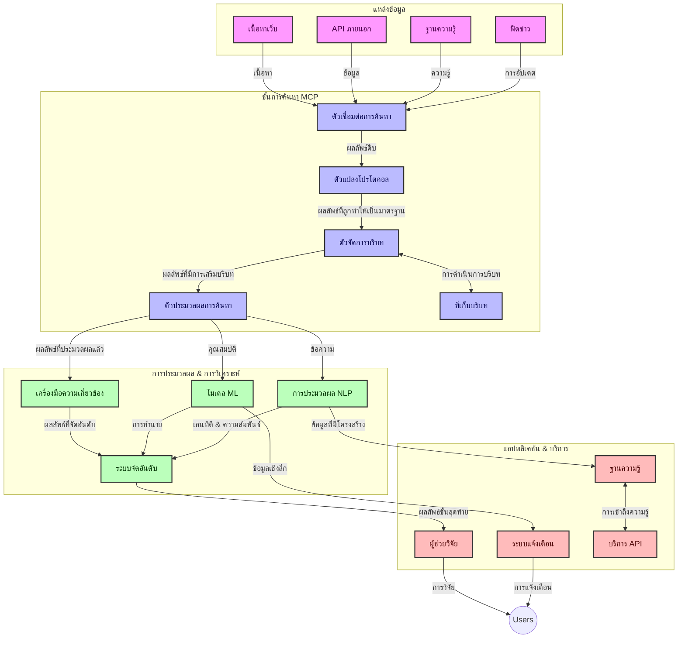
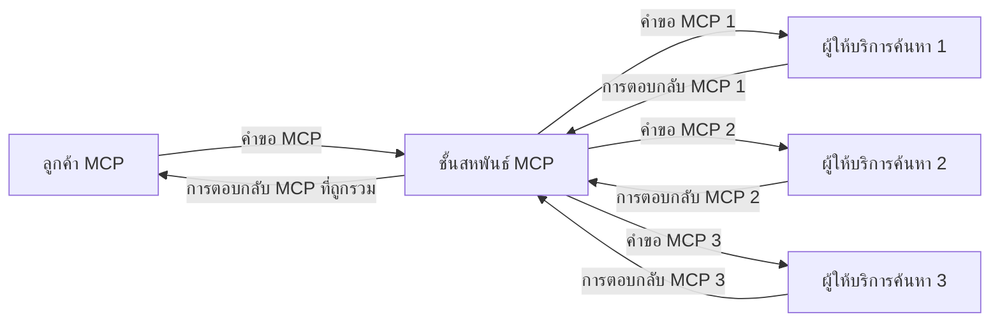
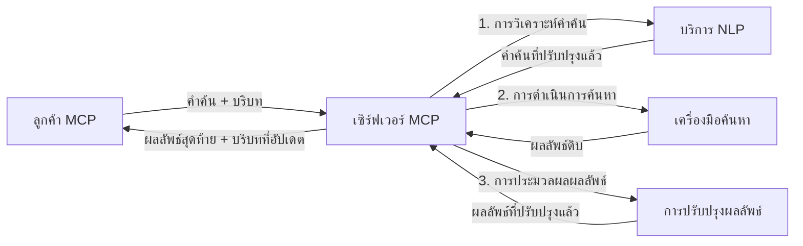

# โปรโตคอลบริบทของโมเดลสำหรับการค้นหาเว็บแบบเรียลไทม์

## ภาพรวม

การค้นหาเว็บแบบเรียลไทม์ได้กลายเป็นสิ่งสำคัญในสภาพแวดล้อมข้อมูลในปัจจุบัน ที่ซึ่งแอปพลิเคชันต้องการการเข้าถึงข้อมูลที่เป็นปัจจุบันทันด่วนผ่านอินเทอร์เน็ตเพื่อให้ได้ผลลัพธ์ที่เกี่ยวข้องและทันเวลา โปรโตคอลบริบทของโมเดล (MCP) เป็นความก้าวหน้าครั้งสำคัญในการปรับปรุงกระบวนการค้นหาแบบเรียลไทม์เหล่านี้ เพิ่มประสิทธิภาพในการค้นหา รักษาความสมบูรณ์ของบริบท และปรับปรุงประสิทธิภาพโดยรวมของระบบ

โมดูลนี้จะสำรวจว่า MCP เปลี่ยนแปลงการค้นหาเว็บแบบเรียลไทม์อย่างไรโดยจัดให้มีวิธีการมาตรฐานในการจัดการบริบทข้ามโมเดล AI เครื่องมือค้นหา และแอปพลิเคชันต่างๆ

### สิ่งที่คุณจะได้เรียนรู้

ในคู่มือที่ครอบคลุมนี้ คุณจะได้ค้นพบ:

- วิธีที่ MCP สร้างสะพานเชื่อมอย่างราบรื่นระหว่างโมเดล AI กับความสามารถในการค้นหาเว็บแบบเรียลไทม์
- รูปแบบสถาปัตยกรรมสำหรับการนำโซลูชันการค้นหาที่มีประสิทธิภาพและขยายตัวได้มาใช้กับ MCP
- เทคนิคในการรักษาบริบทของการค้นหาข้ามหลายคำค้นและการโต้ตอบ
- ตัวอย่างโค้ดปฏิบัติใน Python และ JavaScript สำหรับสถานการณ์การค้นหาต่างๆ
- วิธีการปรับสมดุลระหว่างความเกี่ยวข้อง ความใหม่ และประสิทธิภาพในระบบค้นหาที่ใช้ MCP

## บทนำสู่การค้นหาเว็บแบบเรียลไทม์

การค้นหาเว็บแบบเรียลไทม์เป็นแนวทางทางเทคโนโลยีที่ช่วยให้สามารถสืบค้น ประมวลผล และวิเคราะห์ข้อมูลบนเว็บอย่างต่อเนื่องขณะที่ข้อมูลนั้นถูกเผยแพร่หรืออัปเดต ช่วยให้ระบบสามารถให้ข้อมูลที่สดใหม่และเกี่ยวข้องได้โดยมีความหน่วงเวลาต่ำ ต่างจากระบบค้นหาดั้งเดิมที่ทำงานบนข้อมูลที่ถูกจัดทำดัชนีซึ่งอาจล้าสมัยหลายชั่วโมงหรือหลายวัน การค้นหาแบบเรียลไทม์ประมวลผลข้อมูลสดจากเว็บ มอบข้อมูลเชิงลึกและข้อมูลที่สะท้อนสถานะปัจจุบันของเนื้อหาออนไลน์

### แนวคิดหลักของการค้นหาเว็บแบบเรียลไทม์:

- **การประมวลผลคำค้นอย่างต่อเนื่อง**: คำค้นถูกประมวลผลกับแหล่งข้อมูลที่ปรับปรุงอยู่ตลอดเวลา
- **การให้ความสำคัญกับข้อมูลใหม่**: ระบบถูกออกแบบมาเพื่อให้ความสำคัญกับข้อมูลที่สดใหม่
- **การปรับสมดุลความเกี่ยวข้อง**: การรักษาสมดุลระหว่างความเกี่ยวข้องและความใหม่
- **สถาปัตยกรรมที่ปรับขยายได้**: ระบบต้องรองรับภาระการค้นหาและปริมาณข้อมูลที่แตกต่างกัน
- **ความเข้าใจบริบท**: การรักษาบริบทของผู้ใช้ข้ามการค้นหาหลายรอบเป็นสิ่งสำคัญสำหรับผลลัพธ์ที่มีความหมาย
- **การปรับปรุงคำค้นแบบไดนามิก**: การปรับคำค้นอย่างยืดหยุ่นตามบริบทและผลลัพธ์ก่อนหน้า
- **การรวมแหล่งข้อมูลหลายแห่ง**: การรวมผลลัพธ์จากผู้ให้บริการค้นหาหลายรายและแหล่งข้อมูลบนเว็บ
- **ความเข้าใจเชิงความหมาย**: การประมวลผลคำค้นและเนื้อหาตามความหมายแทนที่จะใช้แค่คำหลัก
- **การจัดอันดับแบบเรียลไทม์**: การปรับอันดับผลลัพธ์อย่างต่อเนื่องเมื่อมีข้อมูลใหม่เข้ามา

### โปรโตคอลบริบทของโมเดลกับการค้นหาเว็บแบบเรียลไทม์

โปรโตคอลบริบทของโมเดล (MCP) แก้ไขปัญหาสำคัญหลายประการในสภาพแวดล้อมการค้นหาเว็บแบบเรียลไทม์:

1. **การรักษาบริบทการค้นหา**: MCP มาตรฐานการรักษาบริบทข้ามส่วนประกอบการค้นหาที่กระจายอยู่ เพื่อให้โมเดล AI และโหนดประมวลผลสามารถเข้าถึงประวัติคำค้นและความชอบของผู้ใช้ที่เกี่ยวข้องได้

2. **การจัดการคำค้นอย่างมีประสิทธิภาพ**: โดยการจัดหากลไกที่มีโครงสร้างสำหรับการส่งผ่านบริบท MCP ช่วยลดภาระการทำซ้ำบริบทในแต่ละรอบค้นหา

3. **ความสามารถในการทำงานร่วมกัน**: MCP สร้างภาษากลางสำหรับการแบ่งปันบริบทระหว่างเทคโนโลยีการค้นหาหลากหลายและโมเดล AI ทำให้สถาปัตยกรรมยืดหยุ่นและขยายได้มากขึ้น

4. **บริบทที่ปรับแต่งสำหรับการค้นหา**: การใช้งาน MCP สามารถจัดลำดับความสำคัญขององค์ประกอบบริบทที่เกี่ยวข้องที่สุดสำหรับการค้นหาอย่างมีประสิทธิภาพ โดยเพิ่มประสิทธิภาพทั้งประสิทธิผลและความแม่นยำ

5. **การประมวลผลค้นหาแบบปรับตัว**: ด้วยการจัดการบริบทที่เหมาะสมผ่าน MCP ระบบค้นหาสามารถปรับการประมวลผลแบบไดนามิกตามความต้องการของผู้ใช้และภูมิทัศน์ข้อมูลที่กำลังพัฒนาได้

ในแอปพลิเคชันสมัยใหม่ตั้งแต่การรวบรวมข่าวสารจนถึงผู้ช่วยวิจัย การผสาน MCP กับเทคโนโลยีค้นหาเว็บช่วยให้เกิดการค้นหาที่ชาญฉลาดและตระหนักบริบทมากขึ้น ซึ่งให้ผลลัพธ์ที่เกี่ยวข้องเพิ่มขึ้นตามการโต้ตอบของผู้ใช้

## วัตถุประสงค์การเรียนรู้

เมื่อจบบทเรียนนี้ คุณจะสามารถ:

- เข้าใจพื้นฐานของการค้นหาเว็บแบบเรียลไทม์และความท้าทายในแอปพลิเคชันสมัยใหม่
- อธิบายได้ว่าโปรโตคอลบริบทของโมเดล (MCP) ช่วยเสริมความสามารถการค้นหาแบบเรียลไทม์อย่างไร
- นำโซลูชันการค้นหาที่ใช้ MCP ไปใช้งานด้วยเฟรมเวิร์กและ API ที่นิยม
- ออกแบบและปรับใช้สถาปัตยกรรมการค้นหาที่ขยายตัวได้และมีประสิทธิภาพสูงด้วย MCP
- ประยุกต์ใช้แนวคิด MCP กับกรณีใช้งานต่างๆ รวมถึงการค้นหาความหมาย ผู้ช่วยวิจัย และการท่องเว็บที่ได้รับการเสริมด้วย AI
- ประเมินแนวโน้มและนวัตกรรมใหม่ๆ ในเทคโนโลยีการค้นหาที่ใช้ MCP
- พัฒนาระบบค้นหาที่ตระหนักบริบทซึ่งเรียนรู้จากการโต้ตอบของผู้ใช้
- ผสานความสามารถการค้นหาเว็บเข้ากับผู้ช่วย AI โดยใช้โปรโตคอล MCP มาตรฐาน
- สร้างสายงานค้นหาหลายขั้นตอนที่ปรับผลลัพธ์ตามบริบทอย่างต่อเนื่อง
- ปรับประสิทธิภาพการค้นหาในขณะที่รักษาความตระหนักบริบทอย่างครบถ้วน

### คำนิยามและความสำคัญ

การค้นหาเว็บแบบเรียลไทม์เกี่ยวข้องกับการสืบค้น ดึงข้อมูล และนำเสนอข้อมูลบนเว็บอย่างต่อเนื่องด้วยความหน่วงเวลาต่ำ ต่างจากเครื่องมือค้นหาดั้งเดิมที่รวบรวมข้อมูลและจัดทำดัชนีเว็บเป็นระยะๆ การค้นหาแบบเรียลไทม์มุ่งหวังที่จะเผยแพร่ข้อมูลทันทีที่พร้อมใช้งาน เพื่อให้เข้าถึงเนื้อหาที่เป็นปัจจุบันที่สุดได้ทันที

คุณลักษณะสำคัญของการค้นหาเว็บแบบเรียลไทม์ ได้แก่:

- **ความสดใหม่**: ให้ความสำคัญกับเนื้อหาและการอัปเดตล่าสุด
- **การประมวลผลต่อเนื่อง**: เฝ้าติดตามข้อมูลใหม่อยู่ตลอดเวลา
- **การปรับคำค้น**: ปรับแต่งคำค้นตามบริบทและข้อเสนอแนะ
- **การนำเสนอทันที**: ให้ผลการค้นหาด้วยความล่าช้าต่ำสุด
- **การเก็บรักษาบริบท**: สร้างต่อจากคำค้นก่อนหน้าเพื่อเพิ่มความเกี่ยวข้อง

### ความท้าทายในระบบค้นหาเว็บดั้งเดิม

วิธีการค้นหาเว็บแบบดั้งเดิมเผชิญกับข้อจำกัดหลายประการเมื่อใช้ในสถานการณ์แบบเรียลไทม์:

1. **การกระจัดกระจายของบริบท**: ยากที่จะรักษาบริบทการค้นหาข้ามหลายคำค้น
2. **ความสดใหม่ของข้อมูล**: ความท้าทายในการเข้าถึงและให้ความสำคัญกับข้อมูลล่าสุด
3. **ความซับซ้อนในการรวมระบบ**: ปัญหาความสามารถในการทำงานร่วมกันระหว่างระบบค้นหาและแอปพลิเคชัน
4. **ปัญหาความหน่วงเวลา**: การปรับสมดุลระหว่างการค้นหาที่ครบถ้วนและความต้องการเวลาในการตอบสนอง
5. **การปรับจูนความเกี่ยวข้อง**: การรักษาความแม่นยำและความเกี่ยวข้องในขณะที่ให้ความสำคัญกับความใหม่

## การทำความเข้าใจโปรโตคอลบริบทของโมเดล (MCP) สำหรับการค้นหา

### MCP คืออะไรในบริบทของการค้นหา?

โปรโตคอลบริบทของโมเดล (MCP) เป็นโปรโตคอลการสื่อสารมาตรฐานที่ออกแบบมาเพื่ออำนวยความสะดวกในการโต้ตอบอย่างมีประสิทธิภาพระหว่างโมเดล AI และแอปพลิเคชัน ในบริบทของการค้นหาเว็บแบบเรียลไทม์ MCP ให้กรอบการทำงานสำหรับ:

- การรักษาบริบทการค้นหาตลอดช่วงลำดับคำค้น
- การมาตรฐานรูปแบบคำค้นและผลลัพธ์การค้นหา
- การเพิ่มประสิทธิภาพการส่งผ่านพารามิเตอร์และผลลัพธ์การค้นหา
- การเพิ่มประสิทธิภาพการสื่อสารระหว่างโมเดลกับเครื่องมือค้นหา

### องค์ประกอบหลักและสถาปัตยกรรม

สถาปัตยกรรม MCP สำหรับการค้นหาเว็บแบบเรียลไทม์ประกอบด้วยองค์ประกอบสำคัญหลายอย่าง:

1. **ตัวจัดการบริบทคำค้น**: จัดการและรักษาบริบทการค้นหาข้ามหลายคำค้น
2. **ตัวประมวลผลการค้นหา**: ประมวลผลคำขอค้นหาที่เข้ามาโดยใช้เทคนิคที่ตระหนักบริบท
3. **ตัวปรับโปรโตคอล**: แปลงระหว่าง API การค้นหาต่างๆ ในขณะที่รักษาบริบท
4. **ที่เก็บบริบท**: จัดเก็บและดึงประวัติการค้นหาและความชอบอย่างมีประสิทธิภาพ
5. **ตัวเชื่อมต่อการค้นหา**: เชื่อมต่อกับเครื่องมือค้นหาและเว็บ API ต่างๆ



### MCP ช่วยปรับปรุงการค้นหาเว็บแบบเรียลไทม์อย่างไร

MCP แก้ไขปัญหาการค้นหาเว็บแบบดั้งเดิมด้วย:

- **ความต่อเนื่องของบริบท**: รักษาความสัมพันธ์ระหว่างคำค้นตลอดช่วงเซสชันการค้นหา
- **การส่งผ่านที่ได้รับการปรับแต่ง**: ลดความซ้ำซ้อนของพารามิเตอร์การค้นหาผ่านการจัดการบริบทอย่างชาญฉลาด
- **อินเทอร์เฟซที่มาตรฐาน**: ให้ API ที่สอดคล้องกันสำหรับส่วนประกอบการค้นหา
- **ลดความหน่วงเวลา**: ลดภาระการประมวลผลด้วยการจัดการบริบทอย่างมีประสิทธิภาพ
- **เพิ่มความเกี่ยวข้อง**: ปรับปรุงความเกี่ยวข้องในการค้นหาโดยรักษาความตั้งใจของผู้ใช้ข้ามหลายคำค้น

## การผสานและการนำไปใช้

ระบบการค้นหาเว็บแบบเรียลไทม์ต้องการการออกแบบสถาปัตยกรรมและการนำไปใช้อย่างรอบคอบเพื่อรักษาทั้งประสิทธิภาพและความสมบูรณ์ของบริบท โปรโตคอลบริบทของโมเดลนำเสนอวิธีการมาตรฐานในการผสานโมเดล AI และเทคโนโลยีการค้นหา ทำให้สามารถสร้างสายงานการค้นหาที่ซับซ้อนและตระหนักบริบทได้มากขึ้น

### ภาพรวมของการผสาน MCP ในสถาปัตยกรรมการค้นหา

การนำ MCP มาใช้ในสภาพแวดล้อมการค้นหาเว็บแบบเรียลไทม์ต้องพิจารณาหัวข้อสำคัญหลายประการ:

1. **การจัดลำดับบริบทคำค้นเพื่อส่งผ่าน**: MCP ให้กลไกที่มีประสิทธิภาพสำหรับการเข้ารหัสข้อมูลบริบทภายในคำขอค้นหา เพื่อให้บริบทที่จำเป็นติดตามคำค้นตลอดกระบวนการประมวลผล ซึ่งรวมถึงรูปแบบการจัดลำดับแบบมาตรฐานที่เหมาะสมกับข้อมูลเมตาที่เกี่ยวข้องกับการค้นหา

2. **การประมวลผลการค้นหาเชิงสถานะ**: MCP ช่วยให้เกิดการประมวลผลเชิงสถานะที่ชาญฉลาดขึ้นโดยรักษาการแทนบริบทอย่างสม่ำเสมอในช่วงรอบการค้นหา เหมาะอย่างยิ่งสำหรับสายงานค้นหาหลายขั้นตอนที่การขัดเกลาบริบทช่วยปรับปรุงผลลัพธ์

3. **การขยายและขัดเกลาคำค้น**: การใช้งาน MCP ในระบบค้นหาสามารถช่วยส่งเสริมการขยายและขัดเกลาคำค้นอย่างซับซ้อนตามบริบทที่สะสม ทำให้ได้ผลลัพธ์ที่เกี่ยวข้องมากขึ้นเมื่อเซสชันการค้นหาดำเนินไป

4. **การแคชผลลัพธ์และการจัดลำดับความสำคัญ**: ด้วยการมาตรฐานการจัดการบริบท MCP ช่วยบริหารการแคชผลและการจัดลำดับความสำคัญ ทำให้ส่วนประกอบสามารถปรับตามบริบทการค้นหาที่พัฒนาไป

5. **สหพันธ์และการสรุปผลการค้นหา**: MCP ช่วยให้เกิดการสหพันธ์การค้นหาที่ซับซ้อนมากขึ้นข้ามระบบเบื้องหลังหลายระบบ โดยให้ข้อมูลตัวแทนบริบทอย่างมีโครงสร้าง ทำให้การรวบรวมผลลัพธ์จากแหล่งข้อมูลหลากหลายมีความหมายมากขึ้น

การนำ MCP ไปใช้กับเทคโนโลยีการค้นหาหลายรูปแบบสร้างวิธีการจัดการบริบทที่เป็นหนึ่งเดียว ลดความจำเป็นในการเขียนโค้ดผสานเฉพาะทางพร้อมทั้งเพิ่มความสามารถของระบบในการรักษาบริบทที่มีความหมายในขณะที่คำค้นพัฒนาขึ้น

### MCP ในการใช้งานค้นหาเว็บต่างๆ

ตัวอย่างเหล่านี้สอดคล้องกับข้อกำหนด MCP ปัจจุบันซึ่งเน้นโปรโตคอล JSON-RPC ที่มีกลไกการขนส่งที่แยกจากกัน โค้ดแสดงวิธีที่คุณสามารถนำการผสานค้นหาแบบกำหนดเองมาใช้พร้อมด้วยความเข้ากันได้เต็มรูปแบบกับโปรโตคอล MCP


<details>
<summary>การใช้งาน Python กับ Generic Search API</summary>

```python
import asyncio
import json
import aiohttp
from typing import Dict, Any, Optional, List
from contextlib import asynccontextmanager
from collections.abc import AsyncIterator

# นำเข้าห้องสมุด MCP มาตรฐาน
from mcp.client.session import ClientSession
from mcp.client.streamable_http import streamablehttp_client
from mcp.types import TextContent, CreateMessageRequestParams, CreateMessageResult
from mcp.server.fastmcp import FastMCP

# สร้างเซิร์ฟเวอร์ FastMCP สำหรับการค้นหาเว็บ
search_server = FastMCP("WebSearch")

# คลาสสำหรับจัดการการค้นหาเว็บ
class WebSearchHandler:
    def __init__(self, api_endpoint: str, api_key: str):
        self.api_endpoint = api_endpoint
        self.api_key = api_key
        self.session = None
        
    async def initialize(self):
        """Initialize the HTTP session"""
        self.session = aiohttp.ClientSession(
            headers={"Authorization": f"Bearer {self.api_key}"}
        )
    
    async def close(self):
        """Close the HTTP session"""
        if self.session:
            await self.session.close()
            
    async def perform_search(self, query: str, max_results: int = 5, 
                           include_domains: List[str] = None, 
                           exclude_domains: List[str] = None,
                           time_period: str = "any") -> Dict[str, Any]:
        """Perform web search using the search API"""
        # สร้างพารามิเตอร์สำหรับการค้นหา
        search_params = {
            "q": query,
            "limit": max_results,
            "time": time_period
        }
        
        if include_domains:
            search_params["site"] = ",".join(include_domains)
            
        if exclude_domains:
            search_params["exclude_site"] = ",".join(exclude_domains)
        
        # ดำเนินการร้องขอการค้นหา
        try:
            async with self.session.get(
                self.api_endpoint,
                params=search_params
            ) as response:
                if response.status != 200:
                    error_text = await response.text()
                    raise Exception(f"Search API error: {response.status} - {error_text}")
                
                search_data = await response.json()
                
                # แปลงการตอบสนองเฉพาะ API เป็นรูปแบบมาตรฐาน
                results = []
                for item in search_data.get("results", []):
                    results.append({
                        "title": item.get("title", ""),
                        "url": item.get("url", ""),
                        "snippet": item.get("snippet", ""),
                        "date": item.get("published_date", ""),
                        "source": item.get("source", "")
                    })
                
                return {
                    "query": query,
                    "totalResults": len(results),
                    "results": results
                }
        except Exception as e:
            print(f"Search API request error: {e}")
            raise

# เริ่มต้นตัวจัดการการค้นหา
search_handler = WebSearchHandler(
    api_endpoint="https://api.search-service.example/search",
    api_key="your-api-key-here"
)

# ตั้งค่าระยะเวลาการทำงานเพื่อจัดการตัวจัดการการค้นหา
@asyncio.asynccontextmanager
async def app_lifespan(server: FastMCP):
    """Manage application lifecycle"""
    await search_handler.initialize()
    try:
        yield {"search_handler": search_handler}
    finally:
        await search_handler.close()

# กำหนดช่วงเวลาการทำงานสำหรับเซิร์ฟเวอร์
search_server = FastMCP("WebSearch", lifespan=app_lifespan)

# ลงทะเบียนเครื่องมือค้นหาเว็บ
@search_server.tool()
async def web_search(query: str, max_results: int = 5, 
                   include_domains: List[str] = None,
                   exclude_domains: List[str] = None,
                   time_period: str = "any") -> Dict[str, Any]:
    """
    Search the web for information
    
    Args:
        query: The search query
        max_results: Maximum number of results to return (default: 5)
        include_domains: List of domains to include in search results
        exclude_domains: List of domains to exclude from search results
        time_period: Time period for results ("day", "week", "month", "any")
        
    Returns:
        Dictionary containing search results
    """
    ctx = search_server.get_context()
    search_handler = ctx.request_context.lifespan_context["search_handler"]
    
    results = await search_handler.perform_search(
        query=query,
        max_results=max_results,
        include_domains=include_domains,
        exclude_domains=exclude_domains,
        time_period=time_period
    )
    
    return results

# ตัวอย่างการใช้งานของลูกค้า
async def client_example():
    # เชื่อมต่อกับเซิร์ฟเวอร์ค้นหาด้วยการขนส่ง HTTP แบบสตรีม
    async with streamablehttp_client("http://localhost:8000/mcp") as (read, write, _):
        async with ClientSession(read, write) as session:
            # เริ่มต้นการเชื่อมต่อ
            await session.initialize()
            
            # เรียกใช้งานเครื่องมือ web_search
            search_results = await session.call_tool(
                "web_search", 
                {
                    "query": "latest developments in AI and Model Context Protocol",
                    "max_results": 5,
                    "time_period": "day",
                    "include_domains": ["github.com", "microsoft.com"]
                }
            )
            
            print(f"Search results: {search_results}")

# ตัวอย่างการรันเซิร์ฟเวอร์
if __name__ == "__main__":
    # รันเซิร์ฟเวอร์ด้วยการขนส่ง HTTP แบบสตรีม
    search_server.run(transport="streamable-http")
```
</details> 

<details>
<summary>การใช้งาน JavaScript กับการค้นหาบนเบราว์เซอร์</summary>


```javascript
// การใช้งานเซิร์ฟเวอร์ MCP สำหรับการค้นหาเว็บ
import { McpServer, ResourceTemplate } from '@modelcontextprotocol/sdk/server/mcp.js';
import { StreamableHTTPServerTransport } from '@modelcontextprotocol/sdk/server/streamableHttp.js';
import { z } from 'zod';

// สร้างเซิร์ฟเวอร์ MCP สำหรับการค้นหาเว็บ
const searchServer = new McpServer({
    name: "BrowserSearch",
    description: "A server that provides web search capabilities"
});

// คลาสบริการค้นหา
class SearchService {
    constructor(searchApiUrl, apiKey) {
        this.searchApiUrl = searchApiUrl;
        this.apiKey = apiKey;
    }

    async performSearch(parameters) {
        const {
            query = '',
            maxResults = 5,
            includeDomains = [],
            excludeDomains = [],
            timePeriod = 'any'
        } = parameters;
        
        // สร้าง URL การค้นหาพร้อมพารามิเตอร์
        const url = new URL(this.searchApiUrl);
        url.searchParams.append('q', query);
        url.searchParams.append('limit', maxResults);
        url.searchParams.append('time', timePeriod);
        
        if (includeDomains.length > 0) {
            url.searchParams.append('site', includeDomains.join(','));
        }
        
        if (excludeDomains.length > 0) {
            url.searchParams.append('exclude_site', excludeDomains.join(','));
        }
        
        try {
            const response = await fetch(url.toString(), {
                method: 'GET',
                headers: {
                    'Authorization': `Bearer ${this.apiKey}`,
                    'Content-Type': 'application/json'
                }
            });
            
            if (!response.ok) {
                const errorText = await response.text();
                throw new Error(`Search API error: ${response.status} - ${errorText}`);
            }
            
            const searchData = await response.json();
            
            // แปลงการตอบสนองที่เฉพาะเจาะจงของ API เป็นรูปแบบมาตรฐาน
            const results = searchData.results?.map(item => ({
                title: item.title || '',
                url: item.url || '',
                snippet: item.snippet || '',
                date: item.published_date || '',
                source: item.source || ''
            })) || [];
            
            return {
                query,
                totalResults: results.length,
                results
            };
        } catch (error) {
            console.error('Search API request error:', error);
            throw error;
        }
    }
}

// เริ่มต้นบริการค้นหา
const searchService = new SearchService(
    'https://api.search-service.example/search',
    'your-api-key-here'
);

// ตั้งค่าผู้ให้บริการบริบทสำหรับเซิร์ฟเวอร์
searchServer.setContextProvider(() => {
    return {
        searchService
    };
});

// ลงทะเบียนเครื่องมือค้นหาเว็บ
searchServer.tool({
    name: 'web_search',
    description: 'Search the web for information',
    parameters: {
        type: 'object',
        properties: {
            query: {
                type: 'string',
                description: 'The search query'
            },
            maxResults: {
                type: 'integer',
                description: 'Maximum number of results to return',
                default: 5
            },
            includeDomains: {
                type: 'array',
                items: { type: 'string' },
                description: 'List of domains to include in search results'
            },
            excludeDomains: {
                type: 'array',
                items: { type: 'string' },
                description: 'List of domains to exclude from search results'
            },
            timePeriod: {
                type: 'string',
                description: 'Time period for results',
                enum: ['day', 'week', 'month', 'any'],
                default: 'any'
            }
        },
        required: ['query']
    },
    handler: async (params, context) => {
        const { searchService } = context;
        return await searchService.performSearch(params);
    }
});

// ตัวอย่างโค้ดไคลเอนต์เพื่อเชื่อมต่อกับเซิร์ฟเวอร์ค้นหา
import { Client } from '@modelcontextprotocol/sdk/client/index.js';
import { StreamableHTTPClientTransport } from '@modelcontextprotocol/sdk/client/streamableHttp.js';

async function connectToSearchServer() {
    // เชื่อมต่อกับเซิร์ฟเวอร์ค้นหา
    const transport = new StreamableHTTPClientTransport(
        new URL('http://localhost:8000/mcp')
    );
    
    const client = new Client({
        name: 'search-client',
        version: '1.0.0'
    });
    
    await client.connect(transport);
    
    // ดำเนินการเครื่องมือค้นหา
    const searchResults = await client.callTool({
        name: 'web_search',
        arguments: {
            query: 'Model Context Protocol implementation examples',
            maxResults: 10,
            timePeriod: 'week',
            includeDomains: ['github.com', 'docs.microsoft.com']
        }
    });
    
    console.log('Search results:', searchResults);
    
    // ทำความสะอาด
    await client.disconnect();
}

// เริ่มต้นเซิร์ฟเวอร์
const transport = new StreamableHTTPServerTransport();
await searchServer.connect(transport);
console.log('Search server running at http://localhost:8000/mcp');

// ในกระบวนการแยกต่างหากหรือหลังจากที่เซิร์ฟเวอร์เริ่มทำงาน
// connectToSearchServer().catch(console.error);
```
</details> 


## ข้อจำกัดความรับผิดชอบตัวอย่างโค้ด

> **หมายเหตุสำคัญ**: ตัวอย่างโค้ดด้านล่างแสดงการผสานโปรโตคอลบริบทของโมเดล (MCP) กับฟังก์ชันการค้นหาเว็บ ขณะที่ตัวอย่างเหล่านี้เป็นไปตามรูปแบบและโครงสร้างของ MCP SDK อย่างเป็นทางการ แต่ได้ถูกทำให้ง่ายลงเพื่อวัตถุประสงค์การศึกษา
> 
> ตัวอย่างเหล่านี้แสดงให้เห็น:
> 
> 1. **การใช้งาน Python**: การใช้งานเซิร์ฟเวอร์ FastMCP ที่ให้เครื่องมือค้นหาเว็บและเชื่อมต่อกับ API การค้นหาภายนอก ตัวอย่างนี้แสดงการจัดการช่วงชีวิตที่ถูกต้อง การจัดการบริบท และการใช้งานเครื่องมือตามรูปแบบของ [MCP Python SDK อย่างเป็นทางการ](https://github.com/modelcontextprotocol/python-sdk) เซิร์ฟเวอร์ใช้โหมดขนส่ง HTTP แบบสตรีมมิ่งที่แนะนำซึ่งแทนที่โหมด SSE ที่เก่ากว่าสำหรับการใช้งานจริง
> 
> 2. **การใช้งาน JavaScript**: การใช้งาน TypeScript/JavaScript โดยใช้รูปแบบ FastMCP จาก [MCP TypeScript SDK อย่างเป็นทางการ](https://github.com/modelcontextprotocol/typescript-sdk) เพื่อสร้างเซิร์ฟเวอร์ค้นหาพร้อมการกำหนดเครื่องมือและการเชื่อมต่อไคลเอนต์ที่ถูกต้อง ปฏิบัติตามรูปแบบแนะนำล่าสุดสำหรับการจัดการเซสชันและการรักษาบริบท
> 
> ตัวอย่างเหล่านี้จำเป็นต้องมีการจัดการข้อผิดพลาดเพิ่มเติม การรับรองตัวตน และโค้ดการรวม API เฉพาะสำหรับการใช้งานจริง จุดสิ้นสุด API การค้นหาที่แสดง (`https://api.search-service.example/search`) เป็นที่ว่างและต้องแทนที่ด้วยจุดสิ้นสุดบริการค้นหาจริง
> 
> สำหรับรายละเอียดการใช้งานครบถ้วนและแนวทางที่ทันสมัยที่สุด,
> โปรดดูที่ [ข้อกำหนด MCP อย่างเป็นทางการ](https://modelcontextprotocol.io/specification/2026-07-28/)
> และเอกสาร SDK

## แนวคิดหลัก

### กรอบงานโปรโตคอลบริบทของโมเดล (MCP)

ที่ฐานราก โปรโตคอลบริบทของโมเดลให้วิธีการมาตรฐานสำหรับโมเดล AI แอปพลิเคชัน และบริการในการแลกเปลี่ยนบริบท ในการค้นหาเว็บแบบเรียลไทม์ กรอบงานนี้มีความจำเป็นสำหรับการสร้างประสบการณ์การค้นหาหลายรอบที่สอดคล้องกัน องค์ประกอบสำคัญ ได้แก่:

1. **สถาปัตยกรรมไคลเอนต์-เซิร์ฟเวอร์**: MCP กำหนดขอบเขตที่ชัดเจนระหว่างไคลเอนต์การค้นหา (ผู้ร้องขอ) และเซิร์ฟเวอร์การค้นหา (ผู้ให้บริการ) อนุญาตให้มีรูปแบบการปรับใช้อย่างยืดหยุ่น

2. **การสื่อสารผ่าน JSON-RPC**: โปรโตคอลใช้ JSON-RPC สำหรับการแลกเปลี่ยนข้อความ ทำให้เข้ากันได้กับเทคโนโลยีเว็บและง่ายต่อการนำไปใช้ในแพลตฟอร์มต่างๆ

3. **การจัดการบริบท**: MCP กำหนดวิธีการมีโครงสร้างสำหรับการรักษา อัปเดต และใช้ประโยชน์จากบริบทการค้นหาข้ามการโต้ตอบหลายครั้ง

4. **การกำหนดเครื่องมือ**: ความสามารถการค้นหาถูกเปิดเผยออกมาในรูปแบบเครื่องมือมาตรฐานพร้อมพารามิเตอร์และค่าผลลัพธ์ที่กำหนดไว้อย่างดี

5. **การสนับสนุนการสตรีม**: โปรโตคอลสนับสนุนผลลัพธ์แบบสตรีมมิ่ง ซึ่งจำเป็นสำหรับการค้นหาแบบเรียลไทม์ที่ผลลัพธ์อาจมาถึงอย่างค่อยเป็นค่อยไป

### รูปแบบการผสานการค้นหาเว็บ

เมื่อผสาน MCP เข้ากับการค้นหาเว็บ จะมีรูปแบบหลายอย่างเกิดขึ้น:

#### 1. การผสานโดยตรงกับผู้ให้บริการค้นหา


ในรูปแบบนี้ เซิร์ฟเวอร์ MCP จะติดต่อโดยตรงกับ API การค้นหาอย่างน้อยหนึ่งแห่ง แปลงคำขอ MCP เป็นคำเรียกเฉพาะของ API และจัดรูปแบบผลลัพธ์เป็นคำตอบของ MCP

#### 2. การค้นหาแบบสหพันธ์พร้อมการรักษาบริบท



รูปแบบนี้แจกจ่ายคำค้นหาข้ามผู้ให้บริการค้นหาที่เข้ากันได้กับ MCP หลายราย ซึ่งแต่ละรายอาจมีความเชี่ยวชาญในเนื้อหาหรือความสามารถการค้นหาที่แตกต่างกัน ในขณะที่รักษาบริบทเป็นหนึ่งเดียว

#### 3. สายงานค้นหาที่เสริมบริบท



ในรูปแบบนี้ กระบวนการค้นหาถูกแบ่งออกเป็นหลายขั้นตอน โดยมีการเพิ่มบริบทในแต่ละขั้นตอน ส่งผลให้ได้ผลลัพธ์ที่เกี่ยวข้องมากขึ้นอย่างต่อเนื่อง

### องค์ประกอบบริบทการค้นหา

ในการค้นหาเว็บที่ใช้ MCP บริบทมักจะรวมถึง:

- **ประวัติคำค้น**: คำค้นก่อนหน้าของเซสชัน
- **ความชอบของผู้ใช้**: ภาษา ภูมิภาค การตั้งค่าการค้นหาปลอดภัย
- **ประวัติการโต้ตอบ**: ผลลัพธ์ที่ถูกคลิก เวลาที่ใช้บนผลลัพธ์
- **พารามิเตอร์การค้นหา**: ตัวกรอง ลำดับการจัดเรียง และตัวปรับแต่งการค้นหาอื่นๆ
- **ความรู้เฉพาะด้าน**: บริบทเฉพาะเรื่องที่เกี่ยวข้องกับการค้นหา
- **บริบทตามเวลา**: ปัจจัยความเกี่ยวข้องตามช่วงเวลา
- **ความชอบแหล่งข้อมูล**: แหล่งข้อมูลที่เชื่อถือได้หรือเป็นที่ต้องการ

## กรณีใช้งานและแอปพลิเคชัน

### การวิจัยและการรวบรวมข้อมูล

MCP ช่วยปรับปรุงเวิร์กโฟลว์การวิจัยโดย:

- การรักษาบริบทการวิจัยข้ามเซสชันการค้นหา
- เปิดใช้งานคำค้นที่มีความซับซ้อนและเกี่ยวข้องมากขึ้นตามบริบท
- สนับสนุนการค้นหาแบบสหพันธ์จากแหล่งข้อมูลหลายแห่ง
- อำนวยความสะดวกในการสกัดความรู้จากผลลัพธ์การค้นหา

### การติดตามข่าวสารและเทรนด์แบบเรียลไทม์

การค้นหาที่ใช้ MCP มีข้อดีสำหรับการติดตามข่าว:

- การค้นพบข่าวเกิดใหม่เกือบแบบทันที
- การกรองข้อมูลที่เกี่ยวข้องตามบริบท
- การติดตามหัวข้อและเอนทิตีข้ามแหล่งข้อมูลหลายแห่ง
- การแจ้งเตือนข่าวสารส่วนบุคคลตามบริบทของผู้ใช้

### การท่องเว็บและวิจัยที่เสริมด้วย AI

MCP สร้างโอกาสใหม่สำหรับการท่องเว็บที่เสริมด้วย AI:

- คำแนะนำการค้นหาตามบริบทจากกิจกรรมการใช้งานเบราว์เซอร์ปัจจุบัน
- การรวมการค้นหาเว็บกับผู้ช่วยที่ใช้ LLM อย่างราบรื่น
- การขัดเกลาค้นหาหลายรอบโดยรักษาบริบท
- การตรวจสอบข้อเท็จจริงและการยืนยันข้อมูลที่ดีขึ้น

## แนวโน้มและนวัตกรรมในอนาคต

### วิวัฒนาการของ MCP ในการค้นหาเว็บ

มองไปข้างหน้า เราคาดว่า MCP จะพัฒนาตัวเองเพื่อตอบสนอง:


- **การค้นหาหลายโหมด**: การผสานการค้นหาข้อความ รูปภาพ เสียง และวิดีโอพร้อมกับการรักษาบริบท
- **การค้นหาแบบกระจายศูนย์**: รองรับระบบนิเวศการค้นหาที่เป็นแบบกระจายและสหกรณ์
- **ความเป็นส่วนตัวในการค้นหา**: กลไกการค้นหาที่รักษาความเป็นส่วนตัวโดยตระหนักถึงบริบท
- **ความเข้าใจคำค้น**: การวิเคราะห์ความหมายเชิงลึกของคำค้นภาษาธรรมชาติ

### ความก้าวหน้าทางเทคโนโลยีที่เป็นไปได้

เทคโนโลยีใหม่ที่กำลังเกิดขึ้นซึ่งจะกำหนดอนาคตของการค้นหา MCP:

1. **สถาปัตยกรรมการค้นหาเชิงประสาท**: ระบบค้นหาที่ใช้การฝังตัวซึ่งเหมาะสมสำหรับ MCP
2. **บริบทการค้นหาที่เป็นส่วนตัว**: การเรียนรู้รูปแบบการค้นหาของผู้ใช้แต่ละคนเมื่อเวลาผ่านไป
3. **การผสานกราฟความรู้**: การค้นหาที่เสริมด้วยบริบทโดยกราฟความรู้เฉพาะสาขา
4. **บริบทข้ามโหมด**: การรักษาบริบทข้ามรูปแบบการค้นหาต่าง ๆ

## แบบฝึกหัดปฏิบัติ

### แบบฝึกหัด 1: การตั้งค่าท่อค้นหา MCP พื้นฐาน

ในแบบฝึกหัดนี้ คุณจะได้เรียนรู้วิธี:
- การกำหนดค่าสภาพแวดล้อมการค้นหา MCP พื้นฐาน
- การนำตัวจัดการบริบทมาใช้สำหรับการค้นหาเว็บ
- การทดสอบและตรวจสอบการเก็บรักษาบริบทในระหว่างการค้นหา

### แบบฝึกหัด 2: การสร้างผู้ช่วยวิจัยด้วยการค้นหา MCP

สร้างแอปพลิเคชันครบวงจรที่:
- ประมวลผลคำถามวิจัยภาษาธรรมชาติ
- ดำเนินการค้นหาเว็บที่ตระหนักถึงบริบท
- สังเคราะห์ข้อมูลจากแหล่งต่าง ๆ
- นำเสนอผลการวิจัยที่จัดระบบเรียบร้อย

### แบบฝึกหัด 3: การดำเนินการสหกรณ์ค้นหาหลายแหล่งด้วย MCP

แบบฝึกหัดขั้นสูงที่ครอบคลุม:
- การกระจายคำค้นโดยตระหนักถึงบริบทไปยังเครื่องมือค้นหาหลายตัว
- การจัดอันดับและรวบรวมผลลัพธ์
- การลบซ้ำของผลการค้นหาโดยใช้บริบท
- การจัดการเมตาดาต้าที่เจาะจงแหล่งที่มา

## แหล่งข้อมูลเพิ่มเติม

- [ข้อกำหนดโปรโตคอล Model Context](https://modelcontextprotocol.io/specification/2026-07-28/) - ข้อกำหนด MCP อย่างเป็นทางการและเอกสารโปรโตคอลละเอียด
- [เอกสาร Model Context Protocol](https://modelcontextprotocol.io/) - บทเรียนและคู่มือการใช้งานโดยละเอียด
- [MCP Python SDK](https://github.com/modelcontextprotocol/python-sdk) - การใช้งาน MCP โปรโตคอลอย่างเป็นทางการด้วย Python
- [MCP TypeScript SDK](https://github.com/modelcontextprotocol/typescript-sdk) - การใช้งาน MCP โปรโตคอลอย่างเป็นทางการด้วย TypeScript
- [เซิร์ฟเวอร์อ้างอิง MCP](https://github.com/modelcontextprotocol/servers) - ตัวอย่างการใช้งานเซิร์ฟเวอร์ MCP
- [เอกสาร API การค้นหาเว็บ Bing](https://learn.microsoft.com/en-us/bing/search-apis/bing-web-search/overview) - API การค้นหาเว็บของ Microsoft
- [Google Custom Search JSON API](https://developers.google.com/custom-search/v1/overview) - เครื่องมือค้นหาที่ออกแบบเองของ Google
- [เอกสาร SerpAPI](https://serpapi.com/search-api) - API หน้าแสดงผลลัพธ์เครื่องมือค้นหา
- [เอกสาร Meilisearch](https://www.meilisearch.com/docs) - เครื่องมือค้นหาแบบโอเพนซอร์ส
- [เอกสาร Elasticsearch](https://www.elastic.co/guide/index.html) - เครื่องมือค้นหาและวิเคราะห์ข้อมูลแบบกระจาย
- [เอกสาร LangChain](https://python.langchain.com/docs/get_started/introduction) - การสร้างแอปพลิเคชันด้วย LLMs

## ผลลัพธ์การเรียนรู้

เมื่อคุณเรียนจบโมดูลนี้ คุณจะสามารถ:

- เข้าใจพื้นฐานของการค้นหาเว็บแบบเรียลไทม์และความท้าทายต่าง ๆ
- อธิบายได้ว่า Model Context Protocol (MCP) ช่วยเพิ่มขีดความสามารถการค้นหาเว็บแบบเรียลไทม์อย่างไร
- นำโซลูชันการค้นหาที่ใช้ MCP ไปใช้งานโดยใช้เฟรมเวิร์กและ API ยอดนิยม
- ออกแบบและปรับใช้สถาปัตยกรรมการค้นหาที่สามารถขยายตัวได้และมีประสิทธิภาพสูงด้วย MCP
- ประยุกต์ใช้แนวคิด MCP กับกรณีใช้งานต่าง ๆ รวมถึงการค้นหาเชิงความหมาย ผู้ช่วยวิจัย และการท่องเว็บที่เสริมด้วย AI
- ประเมินแนวโน้มเกิดใหม่และนวัตกรรมในอนาคตของเทคโนโลยีการค้นหาที่ใช้ MCP


### การพิจารณาด้านความเชื่อถือและความปลอดภัย

เมื่อดำเนินการโซลูชันการค้นหาเว็บที่ใช้ MCP โปรดจดจำหลักการสำคัญเหล่านี้จากข้อกำหนด MCP:

1. **ความยินยอมและการควบคุมของผู้ใช้**: ผู้ใช้ต้องยินยอมอย่างชัดเจนและเข้าใจการเข้าถึงข้อมูลและการดำเนินงานทั้งหมด โดยเฉพาะการใช้งานค้นหาเว็บที่อาจเข้าถึงแหล่งข้อมูลภายนอก

2. **ความเป็นส่วนตัวของข้อมูล**: ดูแลการจัดการคำค้นและผลลัพธ์อย่างเหมาะสม โดยเฉพาะในกรณีที่อาจมีข้อมูลที่ละเอียดอ่อน ควบคุมการเข้าถึงเพื่อปกป้องข้อมูลผู้ใช้

3. **ความปลอดภัยของเครื่องมือ**: ใช้มาตรการอนุญาตและตรวจสอบเครื่องมือค้นหาอย่างเหมาะสม เพราะอาจมีความเสี่ยงด้านความปลอดภัยจากการรันโค้ดที่ไม่ได้รับอนุญาต รายละเอียดพฤติกรรมของเครื่องมือควรถูกพิจารณาว่าไม่น่าเชื่อถือเว้นแต่จะได้จากเซิร์ฟเวอร์ที่เชื่อถือได้

4. **เอกสารชัดเจน**: ให้เอกสารที่ชัดเจนเกี่ยวกับความสามารถ ข้อจำกัด และการพิจารณาด้านความปลอดภัยของการใช้งานค้นหาที่ใช้ MCP ตามแนวทางจากข้อกำหนด MCP

5. **กระบวนการยินยอมที่แข็งแรง**: สร้างกระบวนการยินยอมและอนุญาตที่แข็งแรง พร้อมอธิบายอย่างชัดเจนว่าแต่ละเครื่องมือทำหน้าที่อะไร ก่อนจะอนุญาตใช้งาน โดยเฉพาะเครื่องมือที่เชื่อมต่อกับแหล่งข้อมูลเว็บภายนอก

สำหรับข้อมูลรายละเอียดเกี่ยวกับความปลอดภัยและความเชื่อถือของ MCP โปรดดูที่
[เอกสารอย่างเป็นทางการ](https://modelcontextprotocol.io/specification/2026-07-28/basic/security_best_practices).

## ต่อไปคืออะไร

- [5.12 การพิสูจน์ตัวตน Entra ID สำหรับเซิร์ฟเวอร์ Model Context Protocol](../mcp-security-entra/README.md)

---

<!-- CO-OP TRANSLATOR DISCLAIMER START -->
**ปฏิเสธความรับผิดชอบ**:
เอกสารนี้ได้รับการแปลโดยใช้บริการแปลภาษา AI [Co-op Translator](https://github.com/Azure/co-op-translator) ขณะที่เราพยายามให้ความถูกต้อง โปรดทราบว่าการแปลโดยอัตโนมัติอาจมีข้อผิดพลาดหรือความไม่ถูกต้อง เอกสารต้นฉบับในภาษาต้นทางควรถูกพิจารณาเป็นแหล่งข้อมูลที่เชื่อถือได้ สำหรับข้อมูลที่สำคัญ แนะนำให้ใช้การแปลโดยมนุษย์มืออาชีพ เราไม่รับผิดชอบต่อความเข้าใจผิดหรือการตีความที่ผิดพลาดที่เกิดขึ้นจากการใช้การแปลนี้
<!-- CO-OP TRANSLATOR DISCLAIMER END -->