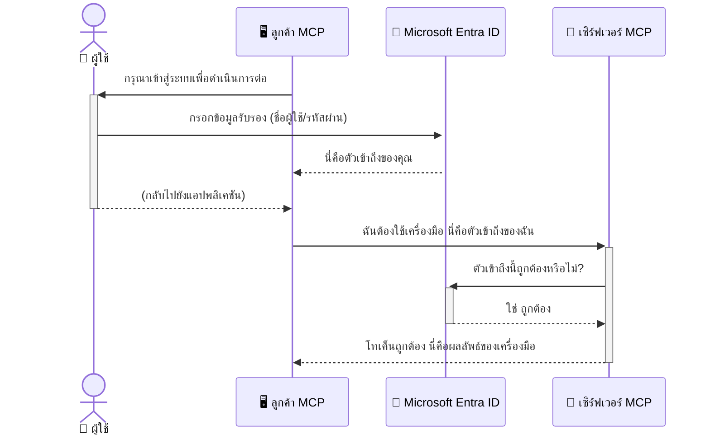

# การรักษาความปลอดภัยเวิร์กโฟลว์ AI: การตรวจสอบสิทธิ์ Entra ID สำหรับเซิร์ฟเวอร์ Model Context Protocol

> [!NOTE]
> โค้ดเซิร์ฟเวอร์ระยะไกลในบทเรียนนี้ปกป้องจุดสิ้นสุด `/sse` และ `/message` รุ่นเก่า
> และกำหนดเป้าหมาย MCP `2025-11-25` ให้ปฏิบัติการตามมาตรฐานการตรวจสอบตัวตนและการยืนยันโทเคน
> แต่ให้ใช้การขนส่ง HTTP แบบ Streamable ที่เข้ากันได้กับ `2026-07-28` สำหรับการใช้งานใหม่


## บทนำ
การรักษาความปลอดภัยเซิร์ฟเวอร์ Model Context Protocol (MCP) ของคุณสำคัญพอๆ กับการล็อกประตูหน้าบ้านของคุณ การปล่อยเซิร์ฟเวอร์ MCP ของคุณเปิดเผยช่องทางให้ผู้อื่นเข้าถึงเครื่องมือและข้อมูลโดยไม่ได้รับอนุญาต ซึ่งอาจนำไปสู่การละเมิดความปลอดภัย Microsoft Entra ID ให้บริการจัดการตัวตนและการเข้าถึงในระบบคลาวด์ที่แข็งแกร่ง ช่วยให้มั่นใจได้ว่ามีเพียงผู้ใช้และแอปพลิเคชันที่ได้รับอนุญาตเท่านั้นที่สามารถโต้ตอบกับเซิร์ฟเวอร์ MCP ของคุณ ในส่วนนี้ คุณจะได้เรียนรู้วิธีปกป้องเวิร์กโฟลว์ AI ของคุณโดยใช้การตรวจสอบสิทธิ์ Entra ID

## วัตถุประสงค์การเรียนรู้
ภายในสิ้นสุดส่วนนี้ คุณจะสามารถ:

- เข้าใจความสำคัญของการรักษาความปลอดภัยเซิร์ฟเวอร์ MCP
- อธิบายพื้นฐานของ Microsoft Entra ID และการตรวจสอบสิทธิ์ OAuth 2.0
- รับรู้ความแตกต่างระหว่างไคลเอนต์สาธารณะและไคลเอนต์ที่เป็นความลับ
- นำการตรวจสอบสิทธิ์ Entra ID ไปใช้ในสถานการณ์เซิร์ฟเวอร์ MCP ทั้งในเครื่อง (ไคลเอนต์สาธารณะ) และระยะไกล (ไคลเอนต์ที่เป็นความลับ)
- ใช้แนวทางปฏิบัติที่ดีที่สุดด้านความปลอดภัยเมื่อพัฒนาเวิร์กโฟลว์ AI

## ความปลอดภัยและ MCP

เช่นเดียวกับที่คุณจะไม่ปล่อยประตูหน้าบ้านของคุณทิ้งไว้โดยไม่ได้ล็อก คุณก็ไม่ควรปล่อยเซิร์ฟเวอร์ MCP ของคุณเปิดให้ใครก็ได้เข้าถึง การรักษาความปลอดภัยเวิร์กโฟลว์ AI ของคุณเป็นสิ่งจำเป็นสำหรับการสร้างแอปพลิเคชันที่แข็งแกร่ง น่าเชื่อถือ และปลอดภัย บทนี้จะแนะนำคุณเกี่ยวกับการใช้ Microsoft Entra ID เพื่อรักษาความปลอดภัยเซิร์ฟเวอร์ MCP ของคุณ เพื่อให้ผู้ใช้และแอปพลิเคชันที่ได้รับอนุญาตเท่านั้นที่สามารถใช้เครื่องมือและข้อมูลของคุณ

## ทำไมความปลอดภัยจึงสำคัญสำหรับเซิร์ฟเวอร์ MCP

ลองนึกภาพว่าเซิร์ฟเวอร์ MCP ของคุณมีเครื่องมือที่สามารถส่งอีเมลหรือเข้าถึงฐานข้อมูลลูกค้าได้ เซิร์ฟเวอร์ที่ไม่ได้รับการปกป้องหมายความว่าทุกคนสามารถใช้เครื่องมือนั้นได้ นำไปสู่การเข้าถึงข้อมูลโดยไม่ได้รับอนุญาต สแปมหรือกิจกรรมที่เป็นอันตรายอื่นๆ

โดยการนำการตรวจสอบสิทธิ์ไปใช้ คุณมั่นใจได้ว่าทุกคำขอไปยังเซิร์ฟเวอร์จะได้รับการยืนยัน ยืนยันตัวตนของผู้ใช้หรือแอปพลิเคชันที่ทำคำขอนั้น ซึ่งเป็นขั้นตอนแรกและสำคัญที่สุดในการรักษาความปลอดภัยเวิร์กโฟลว์ AI ของคุณ

## แนะนำ Microsoft Entra ID

[**Microsoft Entra ID**](https://adoption.microsoft.com/microsoft-security/entra/) เป็นบริการจัดการตัวตนและการเข้าถึงบนระบบคลาวด์ คิดว่าเป็นยามรักษาความปลอดภัยสากลสำหรับแอปพลิเคชันของคุณ มันจัดการกระบวนการที่ซับซ้อนของการยืนยันตัวตนผู้ใช้ (การตรวจสอบสิทธิ์) และการกำหนดสิทธิ์ที่ผู้ใช้ได้รับอนุญาตให้ทำได้ (การอนุญาต)

โดยการใช้ Entra ID คุณสามารถ:

- เปิดใช้งานการลงชื่อเข้าใช้ที่ปลอดภัยสำหรับผู้ใช้
- ปกป้อง API และบริการ
- จัดการนโยบายการเข้าถึงจากศูนย์กลาง

สำหรับเซิร์ฟเวอร์ MCP, Entra ID ให้โซลูชั่นที่แข็งแกร่งและได้รับความเชื่อถืออย่างกว้างขวางในการจัดการว่าใครสามารถเข้าถึงความสามารถของเซิร์ฟเวอร์ของคุณได้

---

## เข้าใจเวทมนตร์: การตรวจสอบสิทธิ์ Entra ID ทำงานอย่างไร

Entra ID ใช้มาตรฐานเปิดเช่น **OAuth 2.0** ในการจัดการการตรวจสอบสิทธิ์ แม้ว่ารายละเอียดอาจซับซ้อน แต่แนวคิดหลักนั้นง่ายและเข้าใจได้ด้วยการเปรียบเทียบ

### การแนะนำ OAuth 2.0 แบบง่ายๆ: กุญแจวาเล็ต

คิดว่า OAuth 2.0 เป็นเหมือนบริการวาเล็ตสำหรับรถของคุณ เมื่อคุณไปถึงร้านอาหาร คุณไม่ได้ให้กุญแจหลักกับวาเล็ต แต่ให้ **กุญแจวาเล็ต** ที่มีสิทธิจำกัด—มันสามารถสตาร์ทรถและล็อกประตูได้ แต่ไม่สามารถเปิดฝากระโปรงรถหรือช่องเก็บของบนรถได้

ในการเปรียบเทียบนี้:

- **คุณ** คือ **ผู้ใช้**
- **รถของคุณ** คือ **เซิร์ฟเวอร์ MCP** พร้อมเครื่องมือและข้อมูลที่มีค่า
- **วาเล็ต** คือ **Microsoft Entra ID**
- **พนักงานจอดรถ** คือ **ไคลเอนต์ MCP** (แอปพลิเคชันที่พยายามเข้าถึงเซิร์ฟเวอร์)
- **กุญแจวาเล็ต** คือ **โทเคนการเข้าถึง (Access Token)**

โทเคนการเข้าถึงคือสตริงข้อความที่ปลอดภัยซึ่งไคลเอนต์ MCP จะได้รับจาก Entra ID หลังจากที่คุณลงชื่อเข้าใช้ จากนั้นไคลเอนต์จะส่งโทเคนนี้ไปยังเซิร์ฟเวอร์ MCP กับทุกคำขอ เซิร์ฟเวอร์สามารถตรวจสอบโทเคนเพื่อยืนยันว่าคำขอนั้นถูกต้องและไคลเอนต์มีสิทธิ์ที่จำเป็น โดยไม่ต้องจัดการข้อมูลรับรองจริงของคุณ (เช่น รหัสผ่าน)

### กระบวนการตรวจสอบสิทธิ์

นี่คือวิธีการทำงานในทางปฏิบัติ:



### รู้จักกับ Microsoft Authentication Library (MSAL)

ก่อนที่เราจะเจาะลึกโค้ด สิ่งสำคัญคือต้องแนะนำส่วนสำคัญที่คุณจะเห็นในตัวอย่าง: **Microsoft Authentication Library (MSAL)**

MSAL คือไลบรารีที่พัฒนาโดย Microsoft ที่ช่วยให้นักพัฒนาสามารถจัดการการตรวจสอบสิทธิ์ได้ง่ายขึ้น แทนที่คุณจะต้องเขียนโค้ดที่ซับซ้อนในการจัดการโทเคนความปลอดภัย การลงชื่อเข้าใช้ และการต่ออายุเซสชัน MSAL จะจัดการส่วนนี้ให้

การใช้ไลบรารีเช่น MSAL เป็นสิ่งที่แนะนำอย่างยิ่งเพราะ:

- **ปลอดภัย:** มันใช้โปรโตคอลมาตรฐานอุตสาหกรรมและแนวทางปฏิบัติด้านความปลอดภัยที่ดีที่สุด ลดความเสี่ยงช่องโหว่ในโค้ดของคุณ
- **ช่วยให้ง่ายต่อการพัฒนา:** มันซ่อนความซับซ้อนของโปรโตคอล OAuth 2.0 และ OpenID Connect ช่วยให้คุณเพิ่มการตรวจสอบสิทธิ์ที่แข็งแกร่งลงในแอปพลิเคชันของคุณได้ด้วยบรรทัดโค้ดไม่กี่บรรทัด
- **ได้รับการดูแล:** Microsoft ดูแลและปรับปรุง MSAL อย่างต่อเนื่องเพื่อตอบสนองภัยคุมคามด้านความปลอดภัยและการเปลี่ยนแปลงแพลตฟอร์มใหม่ๆ

MSAL รองรับภาษาต่างๆ และกรอบงานแอปพลิเคชันหลายแบบ เช่น .NET, JavaScript/TypeScript, Python, Java, Go และแพลตฟอร์มมือถืออย่าง iOS และ Android ทำให้คุณสามารถใช้รูปแบบการตรวจสอบสิทธิ์ที่เหมือนกันทั่วเทคโนโลยีสแต็กของคุณ

หากต้องการเรียนรู้เพิ่มเติมเกี่ยวกับ MSAL คุณสามารถดูได้จาก [เอกสารภาพรวม MSAL อย่างเป็นทางการ](https://learn.microsoft.com/entra/identity-platform/msal-overview)

---

## การรักษาความปลอดภัยเซิร์ฟเวอร์ MCP ของคุณด้วย Entra ID: คู่มือทีละขั้นตอน

ตอนนี้ มาดูวิธีรักษาความปลอดภัยเซิร์ฟเวอร์ MCP ในเครื่อง (ที่สื่อสารผ่าน `stdio`) โดยใช้ Entra ID ตัวอย่างนี้ใช้ **ไคลเอนต์สาธารณะ** ซึ่งเหมาะสำหรับแอปพลิเคชันที่รันบนเครื่องของผู้ใช้ เช่น แอปเดสก์ท็อป หรือเซิร์ฟเวอร์พัฒนาในเครื่อง

### กรณีศึกษา 1: การรักษาความปลอดภัยเซิร์ฟเวอร์ MCP ในเครื่อง (ด้วยไคลเอนต์สาธารณะ)

ในกรณีศึกษานี้ เราจะดูเซิร์ฟเวอร์ MCP ที่รันในเครื่อง สื่อสารผ่าน `stdio` และใช้ Entra ID เพื่อตรวจสอบสิทธิ์ผู้ใช้ก่อนอนุญาตให้เข้าถึงเครื่องมือ เซิร์ฟเวอร์จะมีเครื่องมือเดียวที่ดึงข้อมูลโปรไฟล์ผู้ใช้จาก Microsoft Graph API

#### 1. การตั้งค่าแอปพลิเคชันใน Entra ID

ก่อนเขียนโค้ด คุณต้องลงทะเบียนแอปพลิเคชันของคุณใน Microsoft Entra ID ซึ่งจะบอก Entra ID ว่าแอปของคุณเป็นใครและให้สิทธิ์ในการใช้บริการตรวจสอบสิทธิ์

1. ไปที่ **[พอร์ทัล Microsoft Entra](https://entra.microsoft.com/)**
2. ไปที่ **App registrations** แล้วคลิก **New registration**
3. ตั้งชื่อแอปของคุณ (เช่น "เซิร์ฟเวอร์ MCP ในเครื่องของฉัน")
4. สำหรับ **Supported account types** เลือก **Accounts in this organizational directory only**
5. คุณสามารถปล่อยช่อง **Redirect URI** ว่างสำหรับตัวอย่างนี้ได้
6. คลิก **Register**

เมื่อได้ลงทะเบียนแล้ว ให้จด **Application (client) ID** และ **Directory (tenant) ID** ไว้ เพราะคุณจะต้องใช้ในโค้ดของคุณ

#### 2. โค้ด: การแยกส่วนประกอบ

มาดูส่วนหลักของโค้ดที่จัดการการตรวจสอบสิทธิ์ โค้ดตัวเต็มของตัวอย่างนี้หาได้ที่โฟลเดอร์ [Entra ID - Local - WAM](https://github.com/Azure-Samples/mcp-auth-servers/tree/main/src/entra-id-local-wam) ใน [แหล่งที่เก็บ GitHub mcp-auth-servers](https://github.com/Azure-Samples/mcp-auth-servers)

**`AuthenticationService.cs`**

คลาสนี้รับผิดชอบการติดต่อกับ Entra ID

- **`CreateAsync`**: เมทอดนี้จะสร้างอินสแตนซ์ `PublicClientApplication` จาก MSAL (Microsoft Authentication Library) โดยตั้งค่าด้วย `clientId` และ `tenantId` ของแอปของคุณ
- **`WithBroker`**: เปิดใช้งานการใช้โบรกเกอร์ (เช่น Windows Web Account Manager) ซึ่งให้ประสบการณ์การลงชื่อเข้าใช้แบบ single sign-on ที่ปลอดภัยและลื่นไหล
- **`AcquireTokenAsync`**: เมทอดหลักนี้จะพยายามรับโทเคนแบบเงียบๆ (ถ้าผู้ใช้มีเซสชันอยู่แล้วจะไม่ต้องลงชื่อเข้าใหม่) ถ้าไม่ได้โทเคนแบบเงียบ ระบบจะร้องขอให้ผู้ใช้ลงชื่อเข้าใช้แบบอินเทอร์แอคทีฟ

```csharp
// Simplified for clarity
public static async Task<AuthenticationService> CreateAsync(ILogger<AuthenticationService> logger)
{
    var msalClient = PublicClientApplicationBuilder
        .Create(_clientId) // Your Application (client) ID
        .WithAuthority(AadAuthorityAudience.AzureAdMyOrg)
        .WithTenantId(_tenantId) // Your Directory (tenant) ID
        .WithBroker(new BrokerOptions(BrokerOptions.OperatingSystems.Windows))
        .Build();

    // ... cache registration ...

    return new AuthenticationService(logger, msalClient);
}

public async Task<string> AcquireTokenAsync()
{
    try
    {
        // Try silent authentication first
        var accounts = await _msalClient.GetAccountsAsync();
        var account = accounts.FirstOrDefault();

        AuthenticationResult? result = null;

        if (account != null)
        {
            result = await _msalClient.AcquireTokenSilent(_scopes, account).ExecuteAsync();
        }
        else
        {
            // If no account, or silent fails, go interactive
            result = await _msalClient.AcquireTokenInteractive(_scopes).ExecuteAsync();
        }

        return result.AccessToken;
    }
    catch (Exception ex)
    {
        _logger.LogError(ex, "An error occurred while acquiring the token.");
        throw; // Optionally rethrow the exception for higher-level handling
    }
}
```

**`Program.cs`**

ส่วนนี้ตั้งค่าเซิร์ฟเวอร์ MCP และรวมบริการตรวจสอบสิทธิ์เข้าด้วยกัน

- **`AddSingleton<AuthenticationService>`**: ลงทะเบียน `AuthenticationService` กับคอนเทนเนอร์สำหรับการฉีดพึ่งพา ให้ส่วนอื่นของแอป (เช่น เครื่องมือของเรา) ใช้งานได้
- **`GetUserDetailsFromGraph` tool**: เครื่องมือนี้ต้องการอินสแตนซ์ของ `AuthenticationService` ก่อนทำงานใดๆ มันจะเรียกใช้ `authService.AcquireTokenAsync()` เพื่อรับโทเคนการเข้าถึง หากตรวจสอบสิทธิ์สำเร็จจะใช้โทเคนเรียก Microsoft Graph API เพื่อดึงข้อมูลผู้ใช้

```csharp
// Simplified for clarity
[McpServerTool(Name = "GetUserDetailsFromGraph")]
public static async Task<string> GetUserDetailsFromGraph(
    AuthenticationService authService)
{
    try
    {
        // This will trigger the authentication flow
        var accessToken = await authService.AcquireTokenAsync();

        // Use the token to create a GraphServiceClient
        var graphClient = new GraphServiceClient(
            new BaseBearerTokenAuthenticationProvider(new TokenProvider(authService)));

        var user = await graphClient.Me.GetAsync();

        return System.Text.Json.JsonSerializer.Serialize(user);
    }
    catch (Exception ex)
    {
        return $"Error: {ex.Message}";
    }
}
```

#### 3. การทำงานร่วมกันของระบบทั้งหมด

1. เมื่อไคลเอนต์ MCP พยายามใช้เครื่องมือ `GetUserDetailsFromGraph` เครื่องมือนี้จะเรียก `AcquireTokenAsync` ก่อน
2. `AcquireTokenAsync` จะสั่งให้ไลบรารี MSAL ตรวจสอบโทเคนที่ถูกต้อง
3. ถ้าไม่พบโทเคน MSAL ผ่านโบรกเกอร์จะร้องขอให้ผู้ใช้ลงชื่อเข้าใช้ด้วยบัญชี Entra ID ของตน
4. เมื่อผู้ใช้ลงชื่อเข้าใช้แล้ว Entra ID จะออกโทเคนการเข้าถึง
5. เครื่องมือได้รับโทเคนและใช้เพื่อเรียก Microsoft Graph API อย่างปลอดภัย
6. ข้อมูลผู้ใช้จะถูกส่งกลับไปยังไคลเอนต์ MCP

กระบวนการนี้ช่วยให้แน่ใจว่ามีเพียงผู้ใช้ที่ตรวจสอบสิทธิ์เท่านั้นที่สามารถใช้เครื่องมือได้ ปกป้องเซิร์ฟเวอร์ MCP ในเครื่องของคุณได้อย่างมีประสิทธิภาพ

### กรณีศึกษา 2: การรักษาความปลอดภัยเซิร์ฟเวอร์ MCP ระยะไกล (ด้วยไคลเอนต์ที่เป็นความลับ)

เมื่อเซิร์ฟเวอร์ MCP ของคุณรันบนเครื่องระยะไกล (เช่น เซิร์ฟเวอร์คลาวด์) และสื่อสารผ่านโปรโตคอลอย่าง HTTP Streaming ความต้องการด้านความปลอดภัยจะแตกต่างกัน ในกรณีนี้ควรใช้ **ไคลเอนต์ที่เป็นความลับ** และ **Authorization Code Flow** ซึ่งเป็นวิธีที่ปลอดภัยกว่าเพราะความลับของแอปพลิเคชันไม่ถูกเปิดเผยต่อเบราว์เซอร์

ตัวอย่างนี้ใช้เซิร์ฟเวอร์ MCP ที่เขียนด้วย TypeScript ใช้ Express.js สำหรับจัดการคำขอ HTTP

#### 1. การตั้งค่าแอปพลิเคชันใน Entra ID

การตั้งค่าใน Entra ID คล้ายกับไคลเอนต์สาธารณะ แต่ต่างที่สำคัญคือคุณต้องสร้าง **client secret**

1. ไปที่ **[พอร์ทัล Microsoft Entra](https://entra.microsoft.com/)**
2. ในการลงทะเบียนแอปของคุณ ไปที่แท็บ **Certificates & secrets**
3. คลิก **New client secret** ใส่คำอธิบายแล้วคลิก **Add**
4. **สำคัญ:** คัดลอกค่าความลับทันที คุณจะไม่สามารถเห็นมันอีกครั้ง
5. คุณต้องตั้งค่า **Redirect URI** ไปที่แท็บ **Authentication** คลิก **Add a platform** เลือก **Web** และใส่ Redirect URI สำหรับแอปของคุณ (เช่น `http://localhost:3001/auth/callback`)

> **⚠️ หมายเหตุด้านความปลอดภัยสำคัญ:** สำหรับแอปในสภาพแวดล้อมจริง Microsoft แนะนำอย่างยิ่งให้ใช้วิธีการตรวจสอบสิทธิ์แบบไม่ใช้ความลับ เช่น **Managed Identity** หรือ **Workload Identity Federation** แทนการใช้ client secret เพราะ client secret มีความเสี่ยงด้านความปลอดภัย หากถูกเปิดเผยหรือถูกโจมตี ตัวตนที่บริหารจัดการช่วยให้ปลอดภัยกว่าโดยไม่ต้องเก็บข้อมูลรับรองในโค้ดหรือการตั้งค่า
>
> สำหรับข้อมูลเพิ่มเติมเกี่ยวกับ managed identities และวิธีนำไปใช้ โปรดดูที่ [ภาพรวม Managed identities สำหรับทรัพยากร Azure](https://learn.microsoft.com/entra/identity/managed-identities-azure-resources/overview)

#### 2. โค้ด: การแยกส่วนประกอบ

ตัวอย่างนี้ใช้แนวทางแบบเซสชัน เมื่อผู้ใช้ตรวจสอบสิทธิ์ เซิร์ฟเวอร์จะเก็บ access token และ refresh token ในเซสชัน และมอบ token เซสชันให้ผู้ใช้ จากนั้นโทเคนเซสชันนี้จะใช้สำหรับคำขอต่อไป โค้ดตัวเต็มดูได้ที่โฟลเดอร์ [Entra ID - Confidential client](https://github.com/Azure-Samples/mcp-auth-servers/tree/main/src/entra-id-cca-session) ใน [แหล่งที่เก็บ GitHub mcp-auth-servers](https://github.com/Azure-Samples/mcp-auth-servers)

**`Server.ts`**

ไฟล์นี้ตั้งค่าเซิร์ฟเวอร์ Express และชั้นขนส่ง MCP

- **`requireBearerAuth`**: เป็น middleware ที่ปกป้องจุดสิ้นสุด `/sse` และ `/message` ตรวจสอบโทเคน bearer ที่ถูกต้องในส่วนหัว `Authorization` ของคำขอ
- **`EntraIdServerAuthProvider`**: คลาสที่กำหนดเองนี้ implements อินเทอร์เฟซ `McpServerAuthorizationProvider` มีหน้าที่จัดการโฟลว์ OAuth 2.0
- **`/auth/callback`**: จุดสิ้นสุดที่จัดการการเปลี่ยนเส้นทาง (redirect) จาก Entra ID หลังจากที่ผู้ใช้ตรวจสอบสิทธิ์แล้ว โดยจะแลก authorization code เป็น access token และ refresh token

```typescript
// ทำให้ง่ายขึ้นเพื่อความชัดเจน
const app = express();
const { server } = createServer();
const provider = new EntraIdServerAuthProvider();

// ปกป้องจุดสิ้นสุด SSE
app.get("/sse", requireBearerAuth({
  provider,
  requiredScopes: ["User.Read"]
}), async (req, res) => {
  // ... เชื่อมต่อกับการขนส่ง ...
});

// ปกป้องจุดสิ้นสุดข้อความ
app.post("/message", requireBearerAuth({
  provider,
  requiredScopes: ["User.Read"]
}), async (req, res) => {
  // ... จัดการข้อความ ...
});

// จัดการการตอบกลับ OAuth 2.0
app.get("/auth/callback", (req, res) => {
  provider.handleCallback(req.query.code, req.query.state)
    .then(result => {
      // ... จัดการความสำเร็จหรือความล้มเหลว ...
    });
});
```

**`Tools.ts`**

ไฟล์นี้กำหนดเครื่องมือที่เซิร์ฟเวอร์ MCP ให้บริการ เครื่องมือ `getUserDetails` คล้ายกับตัวอย่างก่อนหน้า แต่รับ access token จากเซสชัน

```typescript
// ทำให้ง่ายขึ้นเพื่อความชัดเจน
server.setRequestHandler(CallToolRequestSchema, async (request) => {
  const { name } = request.params;
  const context = request.params?.context as { token?: string } | undefined;
  const sessionToken = context?.token;

  if (name === ToolName.GET_USER_DETAILS) {
    if (!sessionToken) {
      throw new AuthenticationError("Authentication token is missing or invalid. Ensure the token is provided in the request context.");
    }

    // ดึงโทเค็น Entra ID จากที่เก็บเซสชัน
    const tokenData = tokenStore.getToken(sessionToken);
    const entraIdToken = tokenData.accessToken;

    const graphClient = Client.init({
      authProvider: (done) => {
        done(null, entraIdToken);
      }
    });

    const user = await graphClient.api('/me').get();

    // ... ส่งคืนรายละเอียดผู้ใช้ ...
  }
});
```

**`auth/EntraIdServerAuthProvider.ts`**

คลาสนี้จัดการตรรกะสำหรับ:

- เปลี่ยนเส้นทางผู้ใช้ไปยังหน้าลงชื่อเข้าใช้ของ Entra ID
- แลก authorization code เป็น access token
- เก็บโทเคนใน `tokenStore`
- ต่ออายุ access token เมื่อหมดอายุ


#### 3. ทุกอย่างทำงานร่วมกันอย่างไร

1. เมื่อลูกค้าพยายามเชื่อมต่อกับเซิร์ฟเวอร์ MCP เป็นครั้งแรก ตัว `requireBearerAuth` middleware จะเห็นว่าพวกเขาไม่มีเซสชันที่ถูกต้องและจะเปลี่ยนเส้นทางพวกเขาไปยังหน้าลงชื่อเข้าใช้ของ Entra ID
2. ผู้ใช้ลงชื่อเข้าใช้ด้วยบัญชี Entra ID ของพวกเขา
3. Entra ID จะเปลี่ยนเส้นทางผู้ใช้กลับไปยังจุดสิ้นสุด `/auth/callback` พร้อมกับรหัสอนุญาต
4. เซิร์ฟเวอร์แลกรหัสนั้นเป็นโทเค็นการเข้าถึงและโทเค็นรีเฟรช เก็บรักษา และสร้างโทเค็นเซสชันซึ่งส่งไปยังไคลเอนต์
5. ไคลเอนต์สามารถใช้โทเค็นเซสชันนี้ในส่วนหัว `Authorization` สำหรับคำขอทั้งหมดในอนาคตไปยังเซิร์ฟเวอร์ MCP
6. เมื่อเรียกใช้เครื่องมือ `getUserDetails` มันจะใช้โทเค็นเซสชันเพื่อค้นหาโทเค็นการเข้าถึง Entra ID แล้วใช้โทเค็นนั้นเรียก Microsoft Graph API

โฟลว์นี้ซับซ้อนกว่ากระบวนการของไคลเอนต์สาธารณะ แต่จำเป็นสำหรับจุดสิ้นสุดที่เผยแพร่สู่ภายนอก เนื่องจากเซิร์ฟเวอร์ MCP จากระยะไกลสามารถเข้าถึงผ่านอินเทอร์เน็ตสาธารณะ พวกมันจึงต้องการมาตรการรักษาความปลอดภัยที่เข้มงวดมากขึ้นเพื่อปกป้องจากการเข้าถึงโดยไม่ได้รับอนุญาตและการโจมตีที่อาจเกิดขึ้น


## แนวทางปฏิบัติที่ดีที่สุดด้านความปลอดภัย

- **ใช้ HTTPS เสมอ**: เข้ารหัสการสื่อสารระหว่างไคลเอนต์และเซิร์ฟเวอร์เพื่อปกป้องโทเค็นไม่ให้ถูกดักจับ
- **ใช้การควบคุมการเข้าถึงตามบทบาท (RBAC)**: ไม่ใช่แค่ตรวจสอบ *ว่าผู้ใช้ผ่านการยืนยันตัวตนหรือไม่* แต่ตรวจสอบ *สิ่งที่พวกเขาได้รับอนุญาตให้ทำ* คุณสามารถกำหนดบทบาทใน Entra ID และตรวจสอบบทบาทเหล่านั้นในเซิร์ฟเวอร์ MCP ของคุณ
- **ตรวจสอบและบันทึก**: บันทึกเหตุการณ์การตรวจสอบสิทธิ์ทั้งหมดเพื่อให้คุณสามารถตรวจจับและตอบสนองต่อกิจกรรมที่น่าสงสัยได้
- **จัดการอัตราการจำกัดและการควบคุมการใช้ทรัพยากร**: Microsoft Graph และ API อื่น ๆ ใช้การจำกัดอัตราเพื่อป้องกันการใช้งานเกิน ขึ้นระบบการหน่วงเวลาทวีคูณและตรรกะการลองใหม่ในเซิร์ฟเวอร์ MCP ของคุณเพื่อจัดการกับรหัสสถานะ HTTP 429 (คำขอมากเกินไป) อย่างเหมาะสม พิจารณาเก็บแคชข้อมูลที่ถูกเรียกใช้บ่อยเพื่อลดการเรียก API
- **จัดเก็บโทเค็นอย่างปลอดภัย**: เก็บโทเค็นการเข้าถึงและโทเค็นรีเฟรชอย่างปลอดภัย สำหรับแอปพลิเคชันบนเครื่อง ให้ใช้กลไกจัดเก็บที่ปลอดภัยของระบบ สำหรับแอปพลิเคชันเซิร์ฟเวอร์ ให้พิจารณาการจัดเก็บข้อมูลเข้ารหัสหรือใช้บริการจัดการคีย์ที่ปลอดภัยเช่น Azure Key Vault
- **จัดการการหมดอายุของโทเค็น**: โทเค็นการเข้าถึงมีอายุจำกัด ดำเนินการรีเฟรชโทเค็นอัตโนมัติด้วยโทเค็นรีเฟรชเพื่อรักษาประสบการณ์ผู้ใช้ที่ราบรื่นโดยไม่ต้องขอยืนยันตัวตนซ้ำ
- **พิจารณาใช้ Azure API Management**: การใช้งานความปลอดภัยโดยตรงในเซิร์ฟเวอร์ MCP ของคุณทำให้คุณควบคุมได้ละเอียด แต่เกตเวย์ API อย่าง Azure API Management สามารถจัดการปัญหาความปลอดภัยหลายอย่างได้โดยอัตโนมัติ รวมทั้งการตรวจสอบสิทธิ์ การอนุญาต การจำกัดอัตรา และการตรวจสอบ ให้ชั้นความปลอดภัยศูนย์กลางที่อยู่ระหว่างไคลเอนต์และเซิร์ฟเวอร์ MCP ของคุณ ดูข้อมูลเพิ่มเติมเกี่ยวกับการใช้เกตเวย์ API กับ MCP ได้ที่ [Azure API Management Your Auth Gateway For MCP Servers](https://techcommunity.microsoft.com/blog/integrationsonazureblog/azure-api-management-your-auth-gateway-for-mcp-servers/4402690)


## ข้อสรุปที่สำคัญ

- การรักษาความปลอดภัยเซิร์ฟเวอร์ MCP ของคุณเป็นเรื่องสำคัญในการปกป้องข้อมูลและเครื่องมือของคุณ
- Microsoft Entra ID ให้โซลูชันที่แข็งแกร่งและขยายได้สำหรับการตรวจสอบสิทธิ์และการอนุญาต
- ใช้ **ไคลเอนต์สาธารณะ** สำหรับแอปพลิเคชันภายในเครื่อง และ **ไคลเอนต์ที่เป็นความลับ** สำหรับเซิร์ฟเวอร์ระยะไกล
- **โฟลว์รหัสอนุญาต** เป็นตัวเลือกที่ปลอดภัยที่สุดสำหรับเว็บแอปพลิเคชัน


## แบบฝึกหัด

1. คิดถึงเซิร์ฟเวอร์ MCP ที่คุณอาจสร้าง มันจะเป็นเซิร์ฟเวอร์ภายในเครื่องหรือเซิร์ฟเวอร์ระยะไกล?
2. จากคำตอบของคุณ คุณจะใช้ไคลเอนต์สาธารณะหรือไคลเอนต์ที่เป็นความลับ?
3. สิทธิ์ใดที่เซิร์ฟเวอร์ MCP ของคุณจะร้องขอในการดำเนินการกับ Microsoft Graph?


## แบบฝึกหัดปฏิบัติ

### แบบฝึกหัด 1: ลงทะเบียนแอปพลิเคชันใน Entra ID
ไปที่ Microsoft Entra พอร์ทัล
ลงทะเบียนแอปพลิเคชันใหม่สำหรับเซิร์ฟเวอร์ MCP ของคุณ
จดบันทึก Application (client) ID และ Directory (tenant) ID

### แบบฝึกหัด 2: รักษาความปลอดภัยเซิร์ฟเวอร์ MCP ภายในเครื่อง (ไคลเอนต์สาธารณะ)
- ทำตามตัวอย่างโค้ดเพื่อรวม MSAL (Microsoft Authentication Library) สำหรับการตรวจสอบผู้ใช้
- ทดสอบโฟลว์การตรวจสอบสิทธิ์โดยการเรียกเครื่องมือ MCP ที่ดึงรายละเอียดผู้ใช้จาก Microsoft Graph

### แบบฝึกหัด 3: รักษาความปลอดภัยเซิร์ฟเวอร์ MCP ระยะไกล (ไคลเอนต์ที่เป็นความลับ)
- ลงทะเบียนไคลเอนต์ที่เป็นความลับใน Entra ID และสร้าง client secret
- กำหนดค่าเซิร์ฟเวอร์ MCP Express.js ของคุณให้ใช้โฟลว์รหัสอนุญาต
- ทดสอบจุดสิ้นสุดที่ป้องกันและยืนยันการเข้าถึงโดยใช้โทเค็น

### แบบฝึกหัด 4: นำแนวทางปฏิบัติที่ดีที่สุดด้านความปลอดภัยไปใช้
- เปิดใช้งาน HTTPS สำหรับเซิร์ฟเวอร์ท้องถิ่นหรือระยะไกลของคุณ
- ใช้การควบคุมการเข้าถึงตามบทบาท (RBAC) ในตรรกะเซิร์ฟเวอร์ของคุณ
- เพิ่มการจัดการการหมดอายุของโทเค็นและจัดเก็บโทเค็นอย่างปลอดภัย

## แหล่งข้อมูล

1. **เอกสารภาพรวม MSAL**  
   เรียนรู้ว่า Microsoft Authentication Library (MSAL) ช่วยให้ได้มาซึ่งโทเค็นอย่างปลอดภัยข้ามแพลตฟอร์มได้อย่างไร:  
   [MSAL Overview on Microsoft Learn](https://learn.microsoft.com/en-gb/entra/msal/overview)

2. **ที่เก็บ GitHub Azure-Samples/mcp-auth-servers**  
   ตัวอย่างอ้างอิงเซิร์ฟเวอร์ MCP ที่แสดงโฟลว์การตรวจสอบสิทธิ์:  
   [Azure-Samples/mcp-auth-servers on GitHub](https://github.com/Azure-Samples/mcp-auth-servers)

3. **ภาพรวม Managed Identities สำหรับ Azure Resources**  
   เข้าใจวิธีการกำจัดความลับโดยใช้ Managed Identities ที่มอบหมายโดยระบบหรือผู้ใช้:  
   [Managed Identities Overview on Microsoft Learn](https://learn.microsoft.com/en-us/entra/identity/managed-identities-azure-resources/)

4. **Azure API Management: Your Auth Gateway for MCP Servers**  
   เจาะลึกการใช้ APIM เป็นเกตเวย์ OAuth2 ที่ปลอดภัยสำหรับเซิร์ฟเวอร์ MCP:  
   [Azure API Management Your Auth Gateway For MCP Servers](https://techcommunity.microsoft.com/blog/integrationsonazureblog/azure-api-management-your-auth-gateway-for-mcp-servers/4402690)

5. **ข้อมูลอ้างอิงสิทธิ์ Microsoft Graph**  
   รายการสิทธิ์การใช้งานที่ได้รับอนุญาตและสิทธิ์แอปพลิเคชันที่ครอบคลุมสำหรับ Microsoft Graph:  
   [Microsoft Graph Permissions Reference](https://learn.microsoft.com/zh-tw/graph/permissions-reference)


## ผลลัพธ์การเรียนรู้
หลังจากทำส่วนนี้เสร็จแล้ว คุณจะสามารถ:

- อธิบายได้ว่าทำไมการตรวจสอบสิทธิ์จึงสำคัญสำหรับเซิร์ฟเวอร์ MCP และเวิร์กโฟลว์ AI
- ตั้งค่าและกำหนดค่าการตรวจสอบสิทธิ์ Entra ID สำหรับสถานการณ์เซิร์ฟเวอร์ MCP ภายในเครื่องและระยะไกล
- เลือกชนิดไคลเอนต์ที่เหมาะสม (สาธารณะหรือเป็นความลับ) ตามการปรับใช้เซิร์ฟเวอร์ของคุณ
- นำแนวปฏิบัติการเขียนโค้ดที่ปลอดภัยไปใช้ รวมทั้งการจัดเก็บโทเค็นและการอนุญาตตามบทบาท
- ปกป้องเซิร์ฟเวอร์ MCP และเครื่องมือจากการเข้าถึงโดยไม่ได้รับอนุญาตได้อย่างมั่นใจ

## ขั้นตอนต่อไป

- [5.13 โปรโตคอลบริบทโมเดล (MCP) การรวมกับ Microsoft Foundry](../mcp-foundry-agent-integration/README.md)

---

<!-- CO-OP TRANSLATOR DISCLAIMER START -->
**ปฏิเสธความรับผิดชอบ**:
เอกสารนี้ได้รับการแปลโดยใช้บริการแปลภาษา AI [Co-op Translator](https://github.com/Azure/co-op-translator) ขณะที่เราพยายามให้ความถูกต้อง โปรดทราบว่าการแปลโดยอัตโนมัติอาจมีข้อผิดพลาดหรือความไม่ถูกต้อง เอกสารต้นฉบับในภาษาต้นทางควรถูกพิจารณาเป็นแหล่งข้อมูลที่เชื่อถือได้ สำหรับข้อมูลที่สำคัญ แนะนำให้ใช้การแปลโดยมนุษย์มืออาชีพ เราไม่รับผิดชอบต่อความเข้าใจผิดหรือการตีความที่ผิดพลาดที่เกิดขึ้นจากการใช้การแปลนี้
<!-- CO-OP TRANSLATOR DISCLAIMER END -->