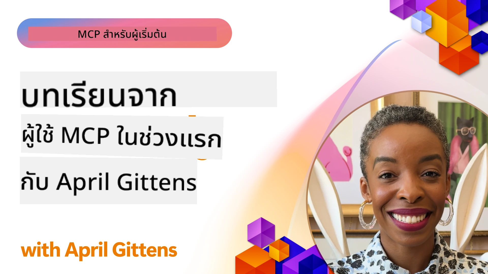

# 🌟 บทเรียนจากผู้เริ่มใช้งานแรก

[](https://youtu.be/jds7dSmNptE)

_(คลิกที่ภาพด้านบนเพื่อดูวิดีโอบทเรียนนี้)_

## 🎯 โมดูลนี้ครอบคลุมเรื่องอะไร

โมดูลนี้สำรวจว่าองค์กรและนักพัฒนาจริง ๆ ได้ใช้โปรโตคอลบริบทโมเดล (Model Context Protocol - MCP) อย่างไรในการแก้ไขปัญหาจริงและขับเคลื่อนนวัตกรรม ผ่านกรณีศึกษาละเอียด โครงการภาคปฏิบัติ และตัวอย่างใช้งานจริง คุณจะได้ค้นพบว่า MCP ช่วยให้สามารถรวม AI แบบปลอดภัยและขยายได้ที่เชื่อมโยงโมเดลภาษา เครื่องมือ และข้อมูลองค์กรเข้าด้วยกันอย่างไร

### 📚 ดู MCP ในการทำงาน

ต้องการดูหลักการเหล่านี้ถูกประยุกต์ใช้กับเครื่องมือพร้อมใช้งานจริงหรือไม่? เข้าไปดู [**10 เซิร์ฟเวอร์ Microsoft MCP ที่เปลี่ยนแปลงประสิทธิภาพนักพัฒนา**](microsoft-mcp-servers.md) ซึ่งแสดงเซิร์ฟเวอร์ Microsoft MCP จริงที่คุณใช้ได้วันนี้

## ภาพรวม

บทเรียนนี้สำรวจว่าผู้เริ่มต้นใช้งานได้ใช้โปรโตคอลบริบทโมเดล (MCP) อย่างไรในการแก้ไขปัญหาในโลกจริงและขับเคลื่อนนวัตกรรมในอุตสาหกรรมต่าง ๆ ผ่านกรณีศึกษาละเอียดและโครงการภาคปฏิบัติ คุณจะได้เห็นว่า MCP ช่วยให้การรวม AI ที่เป็นมาตรฐาน ปลอดภัย และขยายได้เชื่อมต่อโมเดลภาษาเครื่องมือและข้อมูลองค์กรเข้าด้วยกันภายใต้กรอบการทำงานเดียวอย่างไร คุณจะได้รับประสบการณ์จริงในการออกแบบและสร้างโซลูชันที่ใช้ MCP เรียนรู้รูปแบบการนำไปใช้ที่พิสูจน์แล้ว และค้นพบแนวทางปฏิบัติที่ดีที่สุดสำหรับการใช้งาน MCP ในสิ่งแวดล้อมการผลิต บทเรียนยังชี้ให้เห็นเทรนด์ที่เกิดขึ้น ทิศทางในอนาคต และทรัพยากรแบบโอเพ่นซอร์สที่จะช่วยให้คุณอยู่แถวหน้าของเทคโนโลยี MCP และระบบนิเวศที่พัฒนาอย่างต่อเนื่อง

## วัตถุประสงค์การเรียนรู้

- วิเคราะห์การใช้งาน MCP ที่เกิดขึ้นจริงในหลากหลายอุตสาหกรรม
- ออกแบบและสร้างแอปพลิเคชันที่ใช้ MCP อย่างครบถ้วน
- สำรวจเทรนด์ที่เกิดขึ้นและทิศทางในอนาคตของเทคโนโลยี MCP
- นำแนวทางปฏิบัติที่ดีที่สุดไปใช้ในสถานการณ์การพัฒนาจริง

## การใช้งาน MCP ในโลกจริง

### กรณีศึกษา 1: ระบบอัตโนมัติสนับสนุนลูกค้าองค์กร

บริษัทข้ามชาติได้ใช้โซลูชันที่ใช้ MCP เพื่อมาตรฐานการติดต่อกับ AI ในระบบสนับสนุนลูกค้าหลากหลายระบบ ทำให้พวกเขาสามารถ:

- สร้างอินเทอร์เฟซรวบยอดสำหรับผู้ให้บริการ LLM หลายราย
- รักษาการจัดการพรอมต์อย่างสม่ำเสมอทั่วทุกแผนก
- ใช้มาตรการรักษาความปลอดภัยและการปฏิบัติตามกฎระเบียบที่เข้มงวด
- สลับใช้โมเดล AI ต่าง ๆ ได้ตามความต้องการเฉพาะ

**การนำไปใช้ทางเทคนิค:**

```python
# การใช้งานเซิร์ฟเวอร์ MCP ด้วย Python สำหรับการสนับสนุนลูกค้า
import logging
import asyncio
from modelcontextprotocol import create_server, ServerConfig
from modelcontextprotocol.server import MCPServer
from modelcontextprotocol.transports import create_http_transport
from modelcontextprotocol.resources import ResourceDefinition
from modelcontextprotocol.prompts import PromptDefinition
from modelcontextprotocol.tool import ToolDefinition

# กำหนดค่าการบันทึกข้อมูล
logging.basicConfig(level=logging.INFO)

async def main():
    # สร้างการกำหนดค่าเซิร์ฟเวอร์
    config = ServerConfig(
        name="Enterprise Customer Support Server",
        version="1.0.0",
        description="MCP server for handling customer support inquiries"
    )
    
    # เริ่มต้นเซิร์ฟเวอร์ MCP
    server = create_server(config)
    
    # ลงทะเบียนแหล่งข้อมูลฐานความรู้
    server.resources.register(
        ResourceDefinition(
            name="customer_kb",
            description="Customer knowledge base documentation"
        ),
        lambda params: get_customer_documentation(params)
    )
    
    # ลงทะเบียนแม่แบบคำสั่ง
    server.prompts.register(
        PromptDefinition(
            name="support_template",
            description="Templates for customer support responses"
        ),
        lambda params: get_support_templates(params)
    )
    
    # ลงทะเบียนเครื่องมือสนับสนุน
    server.tools.register(
        ToolDefinition(
            name="ticketing",
            description="Create and update support tickets"
        ),
        handle_ticketing_operations
    )
    
    # เริ่มเซิร์ฟเวอร์ด้วยการส่งข้อมูลผ่าน HTTP
    transport = create_http_transport(port=8080)
    await server.run(transport)

if __name__ == "__main__":
    asyncio.run(main())
```

**ผลลัพธ์:** ลดต้นทุนโมเดลลง 30%, ปรับปรุงความสม่ำเสมอของการตอบสนองขึ้น 45%, และเพิ่มความปฏิบัติตามข้อกำหนดทั่วทั้งการดำเนินงานทั่วโลก

### กรณีศึกษา 2: ผู้ช่วยวินิจฉัยทางการแพทย์

ผู้ให้บริการด้านสุขภาพได้พัฒนาโครงสร้างพื้นฐาน MCP เพื่อรวมโมเดล AI ทางการแพทย์เฉพาะทางหลายตัวในขณะที่รักษาความปลอดภัยข้อมูลผู้ป่วยที่ละเอียดอ่อน:

- สลับใช้งานระหว่างโมเดลแพทย์ทั่วไปและเฉพาะทางอย่างราบรื่น
- ควบคุมความเป็นส่วนตัวอย่างเข้มงวดและมีบันทึกตรวจสอบ
- รวมเข้ากับระบบบันทึกสุขภาพอิเล็กทรอนิกส์ (EHR) ที่มีอยู่
- การจัดการพรอมต์ที่สม่ำเสมอสำหรับคำศัพท์ทางการแพทย์

**การนำไปใช้ทางเทคนิค:**

```csharp
// C# MCP host application implementation in healthcare application
using Microsoft.Extensions.DependencyInjection;
using ModelContextProtocol.SDK.Client;
using ModelContextProtocol.SDK.Security;
using ModelContextProtocol.SDK.Resources;

public class DiagnosticAssistant
{
    private readonly MCPHostClient _mcpClient;
    private readonly PatientContext _patientContext;
    
    public DiagnosticAssistant(PatientContext patientContext)
    {
        _patientContext = patientContext;
        
        // Configure MCP client with healthcare-specific settings
        var clientOptions = new ClientOptions
        {
            Name = "Healthcare Diagnostic Assistant",
            Version = "1.0.0",
            Security = new SecurityOptions
            {
                Encryption = EncryptionLevel.Medical,
                AuditEnabled = true
            }
        };
        
        _mcpClient = new MCPHostClientBuilder()
            .WithOptions(clientOptions)
            .WithTransport(new HttpTransport("https://healthcare-mcp.example.org"))
            .WithAuthentication(new HIPAACompliantAuthProvider())
            .Build();
    }
    
    public async Task<DiagnosticSuggestion> GetDiagnosticAssistance(
        string symptoms, string patientHistory)
    {
        // Create request with appropriate resources and tool access
        var resourceRequest = new ResourceRequest
        {
            Name = "patient_records",
            Parameters = new Dictionary<string, object>
            {
                ["patientId"] = _patientContext.PatientId,
                ["requestingProvider"] = _patientContext.ProviderId
            }
        };
        
        // Request diagnostic assistance using appropriate prompt
        var response = await _mcpClient.SendPromptRequestAsync(
            promptName: "diagnostic_assistance",
            parameters: new Dictionary<string, object>
            {
                ["symptoms"] = symptoms,
                patientHistory = patientHistory,
                relevantGuidelines = _patientContext.GetRelevantGuidelines()
            });
            
        return DiagnosticSuggestion.FromMCPResponse(response);
    }
}
```

**ผลลัพธ์:** แนะนำผลวินิจฉัยที่ดีขึ้นสำหรับแพทย์ในขณะที่รักษาความสอดคล้องกับ HIPAA และลดการสลับบริบทระหว่างระบบอย่างมีนัยสำคัญ

### กรณีศึกษา 3: การวิเคราะห์ความเสี่ยงบริการทางการเงิน

สถาบันการเงินได้นำ MCP มาใช้ในการมาตรฐานกระบวนการวิเคราะห์ความเสี่ยงข้ามแผนกต่าง ๆ:

- สร้างอินเทอร์เฟซรวบยอดสำหรับโมเดลความเสี่ยงเครดิต การตรวจจับการฉ้อโกง และความเสี่ยงการลงทุน
- นำมาตรการควบคุมการเข้าถึงและการจัดการเวอร์ชันโมเดลเข้มงวดมาใช้
- รับประกันความสามารถในการตรวจสอบการแนะนำของ AI ทั้งหมด
- รักษารูปแบบข้อมูลที่สม่ำเสมอในระบบที่หลากหลาย

**การนำไปใช้ทางเทคนิค:**

```java
// เซิร์ฟเวอร์ MCP ภาษา Java สำหรับการประเมินความเสี่ยงทางการเงิน
import org.mcp.server.*;
import org.mcp.security.*;

public class FinancialRiskMCPServer {
    public static void main(String[] args) {
        // สร้างเซิร์ฟเวอร์ MCP พร้อมฟีเจอร์การปฏิบัติตามข้อกำหนดทางการเงิน
        MCPServer server = new MCPServerBuilder()
            .withModelProviders(
                new ModelProvider("risk-assessment-primary", new AzureOpenAIProvider()),
                new ModelProvider("risk-assessment-audit", new LocalLlamaProvider())
            )
            .withPromptTemplateDirectory("./compliance/templates")
            .withAccessControls(new SOCCompliantAccessControl())
            .withDataEncryption(EncryptionStandard.FINANCIAL_GRADE)
            .withVersionControl(true)
            .withAuditLogging(new DatabaseAuditLogger())
            .build();
            
        server.addRequestValidator(new FinancialDataValidator());
        server.addResponseFilter(new PII_RedactionFilter());
        
        server.start(9000);
        
        System.out.println("Financial Risk MCP Server running on port 9000");
    }
}
```

**ผลลัพธ์:** ปรับปรุงการปฏิบัติตามกฎระเบียบ เร่งรอบการเปิดตัวโมเดลได้เร็วขึ้น 40% และเพิ่มความสม่ำเสมอในการประเมินความเสี่ยงทั่วทุกแผนก

### กรณีศึกษา 4: Microsoft Playwright MCP Server สำหรับการอัตโนมัติเบราว์เซอร์

Microsoft พัฒนา [Playwright MCP server](https://github.com/microsoft/playwright-mcp) เพื่อให้สามารถทำงานอัตโนมัติบนเบราว์เซอร์อย่างปลอดภัยและมีมาตรฐานผ่านโปรโตคอลบริบทโมเดล เซิร์ฟเวอร์พร้อมใช้งานผลิตภัณฑ์นี้ช่วยให้เอเยนต์ AI และ LLM โต้ตอบกับเว็บเบราว์เซอร์ภายใต้การควบคุม มีการตรวจสอบ และขยายได้—สนับสนุนกรณีการใช้งานเช่นการทดสอบเว็บอัตโนมัติ การดึงข้อมูล และเวิร์กโฟลว์แบบครบวงจร

> **🎯 เครื่องมือพร้อมใช้งานผลิตภัณฑ์**
> 
> กรณีศึกษานี้แสดงเซิร์ฟเวอร์ MCP จริงที่คุณใช้ได้วันนี้! เรียนรู้เพิ่มเติมเกี่ยวกับ Playwright MCP Server และเซิร์ฟเวอร์ Microsoft MCP อีก 9 รายการใน [**คู่มือเซิร์ฟเวอร์ Microsoft MCP**](microsoft-mcp-servers.md#8--playwright-mcp-server)

**คุณสมบัติหลัก:**
- เปิดเผยความสามารถอัตโนมัติบนเบราว์เซอร์ (การนำทาง การกรอกฟอร์ม การจับภาพหน้าจอ ฯลฯ) ในรูปแบบเครื่องมือ MCP
- ใช้มาตรการควบคุมการเข้าถึงและแซนด์บ็อกซ์อย่างเข้มงวดเพื่อป้องกันการกระทำที่ไม่ได้รับอนุญาต
- ให้บันทึกตรวจสอบรายละเอียดสำหรับการโต้ตอบกับเบราว์เซอร์ทั้งหมด
- สนับสนุนการรวมเข้ากับ Azure OpenAI และผู้ให้บริการ LLM อื่น ๆ สำหรับการอัตโนมัติด้วยเอเยนต์
- สนับสนุน GitHub Copilot’s Coding Agent ด้วยความสามารถในการเรียกดูเว็บ

**การนำไปใช้ทางเทคนิค:**

```typescript
// TypeScript: การลงทะเบียนเครื่องมืออัตโนมัติของเบราว์เซอร์ Playwright ในเซิร์ฟเวอร์ MCP
import { createServer, ToolDefinition } from 'modelcontextprotocol';
import { launch } from 'playwright';

const server = createServer({
  name: 'Playwright MCP Server',
  version: '1.0.0',
  description: 'MCP server for browser automation using Playwright'
});

// ลงทะเบียนเครื่องมือสำหรับนำทางไปยัง URL และจับภาพหน้าจอ
server.tools.register(
  new ToolDefinition({
    name: 'navigate_and_screenshot',
    description: 'Navigate to a URL and capture a screenshot',
    parameters: {
      url: { type: 'string', description: 'The URL to visit' }
    }
  }),
  async ({ url }) => {
    const browser = await launch();
    const page = await browser.newPage();
    await page.goto(url);
    const screenshot = await page.screenshot();
    await browser.close();
    return { screenshot };
  }
);

// เริ่มเซิร์ฟเวอร์ MCP
server.listen(8080);
```

**ผลลัพธ์:**

- เปิดใช้งานการทำงานอัตโนมัติบนเบราว์เซอร์อย่างปลอดภัยและเป็นโปรแกรมสำหรับเอเยนต์ AI และ LLM
- ลดความพยายามในการทดสอบด้วยมือและปรับปรุงความครอบคลุมในการทดสอบเว็บแอปพลิเคชัน
- ให้กรอบการทำงานที่นำกลับมาใช้ใหม่และขยายได้สำหรับการรวมเครื่องมือบนเบราว์เซอร์ในสภาพแวดล้อมองค์กร
- สนับสนุนความสามารถในการเรียกดูเว็บของ GitHub Copilot

**เอกสารอ้างอิง:**

- [Playwright MCP Server ที่เก็บ GitHub](https://github.com/microsoft/playwright-mcp)
- [โซลูชัน AI และอัตโนมัติของ Microsoft](https://azure.microsoft.com/en-us/products/ai-services/)

### กรณีศึกษา 5: Azure MCP – โปรโตคอลบริบทโมเดลระดับองค์กรในรูปแบบบริการ

Azure MCP Server ([https://aka.ms/azmcp](https://aka.ms/azmcp)) เป็นการนำโปรโตคอลบริบทโมเดลระดับองค์กรแบบพร้อมใช้งานที่ Microsoft จัดการเต็มรูปแบบ ถูกออกแบบมาเพื่อให้บริการเซิร์ฟเวอร์ MCP ที่ขยายได้ ปลอดภัย และสอดคล้องกับข้อกำหนดในรูปแบบบริการคลาวด์ Azure MCP ช่วยให้องค์กรสามารถเปิดตัว จัดการ และรวมเซิร์ฟเวอร์ MCP กับบริการ Azure AI ข้อมูล และความปลอดภัยได้รวดเร็ว ลดภาระการดำเนินงาน และเร่งการนำ AI มาใช้

> **🎯 เครื่องมือพร้อมใช้งานผลิตภัณฑ์**
> 
> นี่คือเซิร์ฟเวอร์ MCP จริงที่คุณสามารถใช้งานได้วันนี้! เรียนรู้เพิ่มเติมเกี่ยวกับ Microsoft Foundry MCP Server ใน [**คู่มือเซิร์ฟเวอร์ Microsoft MCP**](microsoft-mcp-servers.md)


- การโฮสต์เซิร์ฟเวอร์ MCP ที่จัดการเต็มรูปแบบพร้อมการปรับสเกล, การตรวจสอบ และความปลอดภัยในตัว
- การรวมในตัวกับ Azure OpenAI, Azure AI Search และบริการ Azure อื่น ๆ
- การตรวจสอบสิทธิ์และอนุญาตระดับองค์กรผ่าน Microsoft Entra ID
- รองรับเครื่องมือที่กำหนดเอง, แม่แบบพรอมต์, และตัวเชื่อมต่อทรัพยากร
- สอดคล้องกับมาตรฐานความปลอดภัยและข้อกำหนดด้านกฎระเบียบขององค์กร

**การนำไปใช้ทางเทคนิค:**

```yaml
# Example: Azure MCP server deployment configuration (YAML)
apiVersion: mcp.microsoft.com/v1
kind: McpServer
metadata:
  name: enterprise-mcp-server
spec:
  modelProviders:
    - name: azure-openai
      type: AzureOpenAI
      endpoint: https://<your-openai-resource>.openai.azure.com/
      apiKeySecret: <your-azure-keyvault-secret>
  tools:
    - name: document_search
      type: AzureAISearch
      endpoint: https://<your-search-resource>.search.windows.net/
      apiKeySecret: <your-azure-keyvault-secret>
  authentication:
    type: EntraID
    tenantId: <your-tenant-id>
  monitoring:
    enabled: true
    logAnalyticsWorkspace: <your-log-analytics-id>
```

**ผลลัพธ์:**  
- ลดเวลาสู่การใช้งานของโครงการ AI ระดับองค์กรด้วยแพลตฟอร์มเซิร์ฟเวอร์ MCP ที่พร้อมใช้และสอดคล้อง
- ทำให้การรวมโมเดล LLM เครื่องมือ และแหล่งข้อมูลองค์กรเป็นเรื่องง่ายขึ้น
- เพิ่มความปลอดภัย การสังเกตการณ์ และประสิทธิภาพการดำเนินงานของงาน MCP
- ปรับปรุงคุณภาพโค้ดด้วยแนวปฏิบัติ SDK ของ Azure ที่ดีที่สุดและรูปแบบการตรวจสอบสิทธิ์ล่าสุด

**เอกสารอ้างอิง:**  
- [เอกสาร Azure MCP](https://aka.ms/azmcp)
- [Azure MCP Server ที่เก็บ GitHub](https://github.com/Azure/azure-mcp)
- [บริการ AI ของ Azure](https://azure.microsoft.com/en-us/products/ai-services/)
- [ศูนย์ Microsoft MCP](https://mcp.azure.com)

## กรณีศึกษา 6: NLWeb 
MCP (โปรโตคอลบริบทโมเดล) เป็นโปรโตคอลเกิดใหม่สำหรับแชทบอทและผู้ช่วย AI ในการโต้ตอบกับเครื่องมือ ทุกอินสแตนซ์ NLWeb ยังเป็นเซิร์ฟเวอร์ MCP ซึ่งรองรับวิธีหลักหนึ่งวิธีคือ ask ซึ่งใช้ถามคำถามเว็บไซต์ด้วยภาษาธรรมชาติ คำตอบที่ส่งกลับใช้ schema.org ซึ่งเป็นคำศัพท์ที่ใช้กันอย่างแพร่หลายสำหรับการอธิบายข้อมูลบนเว็บ กล่าวอย่างคร่าว ๆ MCP คือ NLWeb เทียบเท่ากับ Http ต่อ HTML NLWeb รวมโปรโตคอล รูปแบบ Schema.org และตัวอย่างโค้ดเพื่อช่วยเว็บไซต์สร้างจุดเชื่อมต่อนี้อย่างรวดเร็ว เป็นประโยชน์ทั้งกับมนุษย์ผ่านอินเทอร์เฟซสนทนาและเครื่องจักรผ่านการโต้ตอบตัวแทนต่อตัวแทนอย่างเป็นธรรมชาติ

มีส่วนประกอบสองส่วนที่แตกต่างใน NLWeb
- โปรโตคอลที่ง่ายมากสำหรับเริ่มต้น สำหรับเชื่อมต่อกับไซต์ด้วยภาษาธรรมชาติและรูปแบบโดยใช้ json และ schema.org สำหรับคำตอบที่ส่งกลับ ดูเอกสาร REST API สำหรับรายละเอียดเพิ่มเติม
- การนำไปใช้ที่เข้าใจง่ายของ (1) ที่ใช้เครื่องหมายที่มีอยู่สำหรับไซต์ที่สามารถสรุปเป็นรายการของรายการ (สินค้า สูตรอาหาร สถานที่ท่องเที่ยว รีวิว ฯลฯ) ร่วมกับชุดวิดเจ็ตอินเทอร์เฟซผู้ใช้ ไซต์สามารถให้บริการอินเทอร์เฟซสนทนาแก่เนื้อหาได้อย่างง่ายดาย ดูเอกสาร Life of a chat query สำหรับรายละเอียดเพิ่มเติมเกี่ยวกับการทำงานนี้
 
**เอกสารอ้างอิง:**  
- [เอกสาร Azure MCP](https://aka.ms/azmcp)
- [NLWeb](https://github.com/microsoft/NlWeb)

### กรณีศึกษา 7: Microsoft Foundry MCP Server – การรวมเอเยนต์ AI ระดับองค์กร

เซิร์ฟเวอร์ Microsoft Foundry MCP แสดงให้เห็นว่า MCP สามารถใช้ในการจัดการและควบคุมเอเยนต์ AI และเวิร์กโฟลว์ในสภาพแวดล้อมองค์กรอย่างไร โดยการรวม MCP กับ Microsoft Foundry องค์กรสามารถมาตรฐานการโต้ตอบของเอเยนต์ ใช้การจัดการเวิร์กโฟลว์ของ Foundry และรับประกันการเปิดตัวที่ปลอดภัยและขยายได้

> **🎯 เครื่องมือพร้อมใช้งานผลิตภัณฑ์**
> 
> นี่คือเซิร์ฟเวอร์ MCP จริงที่คุณสามารถใช้งานได้วันนี้! เรียนรู้เพิ่มเติมเกี่ยวกับ Microsoft Foundry MCP Server ใน [**คู่มือเซิร์ฟเวอร์ Microsoft MCP**](microsoft-mcp-servers.md#9--microsoft-foundry-mcp-server)

**คุณสมบัติหลัก:**
- การเข้าถึงครบวงจรสู่ระบบนิเวศ AI ของ Azure รวมถึงแคตตาล็อกโมเดลและการจัดการการเปิดตัว
- การจัดทำดัชนีความรู้ด้วย Azure AI Search สำหรับแอปพลิเคชัน RAG
- เครื่องมือประเมินผลการทำงานของโมเดล AI และการประกันคุณภาพ
- การรวมกับ Microsoft Foundry Catalog และ Labs สำหรับโมเดลวิจัยล้ำสมัย
- ความสามารถในการจัดการและประเมินเอเยนต์สำหรับสถานการณ์การผลิต

**ผลลัพธ์:**
- การสร้างต้นแบบอย่างรวดเร็วและการตรวจตราเวิร์กโฟลว์เอเยนต์ AI อย่างเข้มงวด
- การรวมที่ราบรื่นกับบริการ Azure AI สำหรับสถานการณ์ขั้นสูง
- อินเทอร์เฟซรวมเดียวสำหรับการสร้าง เปิดตัว และตรวจตราท่อส่งข้อมูลเอเยนต์
- การปรับปรุงความปลอดภัย การปฏิบัติตามกฎระเบียบ และประสิทธิภาพการดำเนินงานสำหรับองค์กร
- เร่งการนำ AI มาใช้ในขณะที่ควบคุมกระบวนการที่ซับซ้อนโดยเอเยนต์

**เอกสารอ้างอิง:**
- [Microsoft Foundry MCP Server ที่เก็บ GitHub](https://github.com/azure-ai-foundry/mcp-foundry)
- [การรวมเอเยนต์ AI Azure กับ MCP (บล็อก Microsoft Foundry)](https://devblogs.microsoft.com/foundry/integrating-azure-ai-agents-mcp/)

### กรณีศึกษา 8: Foundry MCP Playground – การทดลองและต้นแบบ

Foundry MCP Playground มอบสภาพแวดล้อมพร้อมใช้สำหรับการทดลองกับเซิร์ฟเวอร์ MCP และการรวม Microsoft Foundry นักพัฒนาสามารถสร้างต้นแบบ ทดสอบ และประเมินโมเดล AI และเวิร์กโฟลว์เอเยนต์โดยใช้ทรัพยากรจาก Microsoft Foundry Catalog และ Labs สนามเด็กเล่นนี้ช่วยให้การตั้งค่าเป็นไปอย่างรวดเร็ว มอบโครงการตัวอย่าง และสนับสนุนการพัฒนาร่วม ทำให้ง่ายต่อการสำรวจแนวทางปฏิบัติที่ดีที่สุดและสถานการณ์ใหม่ ๆ ด้วยภาระงานขั้นต่ำ เหมาะสำหรับทีมที่ต้องการตรวจสอบแนวคิด แบ่งปันการทดลอง และเร่งการเรียนรู้โดยไม่ต้องมีโครงสร้างพื้นฐานที่ซับซ้อน การลดอุปสรรคในการเข้าถึงนี้ช่วยส่งเสริมนวัตกรรมและการมีส่วนร่วมของชุมชนในระบบนิเวศ MCP และ Microsoft Foundry

**เอกสารอ้างอิง:**

- [Foundry MCP Playground ที่เก็บ GitHub](https://github.com/azure-ai-foundry/foundry-mcp-playground)

### กรณีศึกษา 9: Microsoft Learn Docs MCP Server – การเข้าถึงเอกสารด้วย AI

Microsoft Learn Docs MCP Server เป็นบริการโฮสต์บนคลาวด์ที่ให้ผู้ช่วย AI เข้าถึงเอกสารทางการของ Microsoft แบบเรียลไทม์ผ่านโปรโตคอลบริบทโมเดล เซิร์ฟเวอร์พร้อมใช้งานนี้เชื่อมต่อกับระบบนิเวศ Microsoft Learn ที่ครอบคลุมและช่วยให้ค้นหาข้อมูลเชิงความหมายได้ทั่วแหล่งข้อมูลทางการทั้งหมดของ Microsoft

> **🎯 เครื่องมือพร้อมใช้งานผลิตภัณฑ์**
> 
> นี่คือเซิร์ฟเวอร์ MCP จริงที่คุณสามารถใช้งานได้วันนี้! เรียนรู้เพิ่มเติมเกี่ยวกับ Microsoft Learn Docs MCP Server ใน [**คู่มือเซิร์ฟเวอร์ Microsoft MCP**](microsoft-mcp-servers.md#1--microsoft-learn-docs-mcp-server)

**คุณสมบัติหลัก:**
- การเข้าถึงเอกสารทางการ Microsoft แบบเรียลไทม์ เอกสาร Azure และเอกสาร Microsoft 365
- ความสามารถค้นหาความหมายขั้นสูงที่เข้าใจบริบทและเจตนา
- ข้อมูลทันสมัยเสมอเนื่องจากเนื้อหา Microsoft Learn มีการเผยแพร่ต่อเนื่อง
- ครอบคลุมอย่างกว้างขวางใน Microsoft Learn, เอกสาร Azure และแหล่งข้อมูล Microsoft 365
- คืนผลเนื้อหาคุณภาพสูงสูงสุด 10 ชิ้นพร้อมชื่อบทความและ URL

**เหตุใดจึงสำคัญ:**
- แก้ปัญหาการ "มีความรู้ AI ล้าสมัย" สำหรับเทคโนโลยี Microsoft
- รับรองว่าผู้ช่วย AI เข้าถึงฟีเจอร์ .NET, C#, Azure และ Microsoft 365 ล่าสุด
- ให้ข้อมูลจากแหล่งที่เชื่อถือได้สำหรับการสร้างโค้ดที่แม่นยำ
- จำเป็นสำหรับนักพัฒนาที่ทำงานกับเทคโนโลยี Microsoft ที่พัฒนาอย่างรวดเร็ว

**ผลลัพธ์:**
- ปรับปรุงความแม่นยำของโค้ดที่สร้างโดย AI สำหรับเทคโนโลยี Microsoft อย่างมาก
- ลดเวลาค้นหาเอกสารปัจจุบันและแนวปฏิบัติที่ดีที่สุด
- เพิ่มประสิทธิภาพนักพัฒนาด้วยการดึงเอกสารที่เข้าใจบริบท
- การรวมเข้ากับเวิร์กโฟลว์การพัฒนาอย่างราบรื่นโดยไม่ต้องออกจาก IDE

**เอกสารอ้างอิง:**
- [Microsoft Learn Docs MCP Server ที่เก็บ GitHub](https://github.com/MicrosoftDocs/mcp)
- [เอกสาร Microsoft Learn](https://learn.microsoft.com/)

## โครงการภาคปฏิบัติ

### โครงการ 1: สร้างเซิร์ฟเวอร์ MCP หลายผู้ให้บริการ

**วัตถุประสงค์:** สร้างเซิร์ฟเวอร์ MCP ที่สามารถส่งคำขอไปยังผู้ให้บริการโมเดล AI หลายรายตามเกณฑ์เฉพาะ

**ข้อกำหนด:**

- รองรับผู้ให้บริการโมเดลอย่างน้อยสามรายที่แตกต่างกัน (เช่น OpenAI, Anthropic, โมเดลภายในองค์กร)
- นำกลไกการกำหนดเส้นทางตามข้อมูลคำขอมาใช้
- สร้างระบบกำหนดค่าจัดการข้อมูลรับรองผู้ให้บริการ
- เพิ่มการแคชเพื่อเพิ่มประสิทธิภาพและลดต้นทุน
- สร้างแดชบอร์ดเรียบง่ายสำหรับตรวจสอบการใช้งาน

**ขั้นตอนการดำเนินการ:**

1. ตั้งค่าโครงสร้างพื้นฐานเซิร์ฟเวอร์ MCP เบื้องต้น
2. พัฒนาตัวปรับผู้ให้บริการสำหรับแต่ละบริการโมเดล AI
3. สร้างตรรกะการกำหนดเส้นทางตามคุณลักษณะของคำขอ
4. เพิ่มกลไกแคชสำหรับคำขอบ่อย ๆ
5. พัฒนาแดชบอร์ดสำหรับตรวจสอบ
6. ทดสอบด้วยรูปแบบคำขอหลากหลาย

**เทคโนโลยี:** เลือก Python (.NET/Java/Python ตามที่คุณถนัด), Redis สำหรับแคช, และเว็บเฟรมเวิร์กเรียบง่ายสำหรับแดชบอร์ด

### โครงการ 2: ระบบจัดการพรอมต์องค์กร

**วัตถุประสงค์:** พัฒนาระบบที่ใช้ MCP สำหรับจัดการ การเวอร์ชัน และปรับใช้แม่แบบพรอมต์ทั่วทั้งองค์กร

**ข้อกำหนด:**


- สร้างคลังศูนย์กลางสำหรับแม่แบบพรอมต์
- ดำเนินการเวอร์ชันและเวิร์กโฟลว์การอนุมัติ
- สร้างความสามารถในการทดสอบแม่แบบด้วยอินพุตตัวอย่าง
- พัฒนาการควบคุมการเข้าถึงตามบทบาท
- สร้าง API สำหรับการดึงและการปรับใช้แม่แบบ

**ขั้นตอนการดำเนินการ:**

1. ออกแบบโครงร่างฐานข้อมูลสำหรับการจัดเก็บแม่แบบ
2. สร้าง API หลักสำหรับการดำเนินการ CRUD กับแม่แบบ
3. ดำเนินการระบบการเวอร์ชัน
4. สร้างเวิร์กโฟลว์การอนุมัติ
5. พัฒนากรอบการทดสอบ
6. สร้างอินเทอร์เฟซเว็บง่าย ๆ สำหรับการจัดการ
7. ผสานรวมกับเซิร์ฟเวอร์ MCP

**เทคโนโลยี:** เลือกใช้กรอบงานแบ็กเอนด์, ฐานข้อมูล SQL หรือ NoSQL, และกรอบงานฟรอนต์เอนด์สำหรับอินเทอร์เฟซการจัดการของคุณ

### โครงการที่ 3: แพลตฟอร์มการสร้างเนื้อหาบนพื้นฐาน MCP

**วัตถุประสงค์:** สร้างแพลตฟอร์มการสร้างเนื้อหาที่ใช้ MCP เพื่อให้ผลลัพธ์ที่สอดคล้องกันในประเภทเนื้อหาที่หลากหลาย

**ข้อกำหนด:**

- รองรับรูปแบบเนื้อหาหลายประเภท (บทความบล็อก, โซเชียลมีเดีย, ข้อความการตลาด)
- ดำเนินการสร้างตามแม่แบบพร้อมตัวเลือกการปรับแต่ง
- สร้างระบบตรวจทานและตอบรับเนื้อหา
- ติดตามตัวชี้วัดประสิทธิภาพเนื้อหา
- รองรับการเวอร์ชันและการปรับปรุงเนื้อหา

**ขั้นตอนการดำเนินการ:**

1. ตั้งค่าโครงสร้างพื้นฐานลูกค้า MCP
2. สร้างแม่แบบสำหรับประเภทเนื้อหาต่าง ๆ
3. สร้างสายงานการสร้างเนื้อหา
4. ดำเนินการระบบตรวจทาน
5. พัฒนาระบบติดตามตัวชี้วัด
6. สร้างอินเทอร์เฟซผู้ใช้สำหรับการจัดการแม่แบบและการสร้างเนื้อหา

**เทคโนโลยี:** ภาษาโปรแกรมที่คุณชื่นชอบ, กรอบงานเว็บ, และระบบฐานข้อมูล

## ทิศทางอนาคตสำหรับเทคโนโลยี MCP

### แนวโน้มที่เกิดขึ้น

1. **MCP แบบหลายโหมด**
   - ขยาย MCP เพื่อมาตรฐานการโต้ตอบกับแบบจำลองรูปภาพ, เสียง และวิดีโอ
   - พัฒนาความสามารถในการใช้เหตุผลข้ามโหมด
   - รูปแบบพรอมต์มาตรฐานสำหรับโหมดต่าง ๆ

2. **โครงสร้างพื้นฐาน MCP แบบกระจายศูนย์**
   - เครือข่าย MCP ที่กระจายซึ่งสามารถแบ่งปันทรัพยากรข้ามองค์กร
   - โปรโตคอลมาตรฐานสำหรับการแชร์แบบจำลองอย่างปลอดภัย
   - เทคนิคการประมวลผลที่ปกป้องความเป็นส่วนตัว

3. **ตลาด MCP**
   - ระบบนิเวศสำหรับการแบ่งปันและสร้างรายได้จากแม่แบบและปลั๊กอิน MCP
   - กระบวนการประกันคุณภาพและรับรองมาตรฐาน
   - การผสานรวมกับตลาดแบบจำลอง

4. **MCP สำหรับการประมวลผลที่ขอบเครือข่าย**
   - การปรับมาตรฐาน MCP สำหรับอุปกรณ์ที่มีทรัพยากรจำกัด
   - โปรโตคอลที่เหมาะสมสำหรับสภาพแวดล้อมแบนด์วิดท์ต่ำ
   - การใช้ MCP เฉพาะสำหรับระบบนิเวศ IoT

5. **กรอบกฎหมายและข้อบังคับ**
   - การพัฒนา MCP ส่วนขยายสำหรับการปฏิบัติตามกฎระเบียบ
   - ร่องรอยการตรวจสอบมาตรฐานและอินเทอร์เฟซอธิบายความสามารถ
   - การผสานรวมกับกรอบการกำกับดูแล AI ที่เกิดขึ้นใหม่

### โซลูชัน MCP จากไมโครซอฟท์

ไมโครซอฟท์และ Azure ได้พัฒนาคลังโค้ดแบบโอเพ่นซอร์สหลายแห่งเพื่อช่วยนักพัฒนาดำเนินการ MCP ในสถานการณ์ต่าง ๆ:

#### องค์กร Microsoft

1. [playwright-mcp](https://github.com/microsoft/playwright-mcp) - เซิร์ฟเวอร์ Playwright MCP สำหรับการทำงานอัตโนมัติและการทดสอบเบราว์เซอร์
2. [files-mcp-server](https://github.com/microsoft/files-mcp-server) - การดำเนินการเซิร์ฟเวอร์ MCP สำหรับ OneDrive สำหรับการทดสอบในเครื่องและการมีส่วนร่วมของชุมชน
3. [NLWeb](https://github.com/microsoft/NlWeb) - NLWeb เป็นชุดโปรโตคอลเปิดและเครื่องมือโอเพ่นซอร์สที่เกี่ยวข้อง เน้นการสร้างชั้นฐานสำหรับ AI Web

#### องค์กร Azure-Samples

1. [mcp](https://github.com/Azure-Samples/mcp) - ลิงก์ไปยังตัวอย่าง เครื่องมือ และทรัพยากรสำหรับการสร้างและรวมเซิร์ฟเวอร์ MCP บน Azure โดยใช้หลายภาษา
2. [mcp-auth-servers](https://github.com/Azure-Samples/mcp-auth-servers) - เซิร์ฟเวอร์ MCP อ้างอิงที่แสดงการพิสูจน์ตัวตนด้วยสเปค Model Context Protocol ปัจจุบัน
3. [remote-mcp-functions](https://github.com/Azure-Samples/remote-mcp-functions) - หน้าเริ่มต้นสำหรับการดำเนินการเซิร์ฟเวอร์ MCP ระยะไกลบน Azure Functions พร้อมลิงก์ไปยังที่เก็บภาษาเฉพาะ
4. [remote-mcp-functions-python](https://github.com/Azure-Samples/remote-mcp-functions-python) - แม่แบบเริ่มต้นอย่างรวดเร็วสำหรับการสร้างและปรับใช้เซิร์ฟเวอร์ MCP ระยะไกลแบบกำหนดเองโดยใช้ Azure Functions กับ Python
5. [remote-mcp-functions-dotnet](https://github.com/Azure-Samples/remote-mcp-functions-dotnet) - แม่แบบเริ่มต้นอย่างรวดเร็วสำหรับการสร้างและปรับใช้เซิร์ฟเวอร์ MCP ระยะไกลแบบกำหนดเองโดยใช้ Azure Functions กับ .NET/C#
6. [remote-mcp-functions-typescript](https://github.com/Azure-Samples/remote-mcp-functions-typescript) - แม่แบบเริ่มต้นอย่างรวดเร็วสำหรับการสร้างและปรับใช้เซิร์ฟเวอร์ MCP ระยะไกลแบบกำหนดเองโดยใช้ Azure Functions กับ TypeScript
7. [remote-mcp-apim-functions-python](https://github.com/Azure-Samples/remote-mcp-apim-functions-python) - การจัดการ API ของ Azure เป็นเกตเวย์ AI ไปยังเซิร์ฟเวอร์ MCP ระยะไกลโดยใช้ Python
8. [AI-Gateway](https://github.com/Azure-Samples/AI-Gateway) - การทดลอง APIM ❤️ AI รวมความสามารถ MCP, ผสานรวมกับ Azure OpenAI และ AI Foundry

ที่เก็บเหล่านี้ให้การดำเนินการต่าง ๆ แม่แบบ และทรัพยากรสำหรับการทำงานกับ Model Context Protocol ในหลายภาษาโปรแกรมและบริการ Azure ครอบคลุมกรณีการใช้งานตั้งแต่การดำเนินการเซิร์ฟเวอร์พื้นฐานถึงการพิสูจน์ตัวตน การปรับใช้บนคลาวด์ และการผสานรวมระดับองค์กร

#### ไดเรกทอรีทรัพยากร MCP

[ไดเรกทอรีทรัพยากร MCP](https://github.com/microsoft/mcp/tree/main/Resources) ในคลัง MCP อย่างเป็นทางการของไมโครซอฟท์ ให้ชุดตัวอย่างทรัพยากร แม่แบบพรอมต์ และคำนิยามเครื่องมือที่คัดสรรมาเพื่อใช้กับเซิร์ฟเวอร์ Model Context Protocol ไดเรกทอรีนี้ออกแบบมาเพื่อช่วยนักพัฒนาเริ่มต้นอย่างรวดเร็วกับ MCP โดยนำเสนอชิ้นส่วนที่นำกลับมาใช้ใหม่และตัวอย่างแนวปฏิบัติที่ดีที่สุดสำหรับ:

- **แม่แบบพรอมต์:** แม่แบบพรอมต์พร้อมใช้สำหรับงาน AI ทั่วไปและสถานการณ์ต่าง ๆ ซึ่งสามารถปรับใช้สำหรับการสร้างเซิร์ฟเวอร์ MCP ของคุณเอง
- **คำนิยามเครื่องมือ:** ตัวอย่างโครงร่างเครื่องมือและเมตาดาต้าเพื่อมาตรฐานการรวมเครื่องมือและการเรียกใช้งานข้ามเซิร์ฟเวอร์ MCP ต่าง ๆ
- **ตัวอย่างทรัพยากร:** นิยามทรัพยากรตัวอย่างสำหรับการเชื่อมต่อกับแหล่งข้อมูล, API และบริการภายนอกภายในกรอบ MCP
- **การดำเนินการอ้างอิง:** ตัวอย่างที่ใช้งานจริงที่แสดงวิธีจัดโครงสร้างและจัดระเบียบทรัพยากร, พรอมต์ และเครื่องมือในโครงการ MCP ในโลกจริง

ทรัพยากรเหล่านี้ช่วยเร่งการพัฒนา ส่งเสริมมาตรฐาน และช่วยให้มั่นใจแนวปฏิบัติที่ดีที่สุดเมื่อสร้างและปรับใช้โซลูชันที่ใช้ MCP

#### ไดเรกทอรีทรัพยากร MCP

- [ทรัพยากร MCP (ตัวอย่างพรอมต์, เครื่องมือ และคำนิยามทรัพยากร)](https://github.com/microsoft/mcp/tree/main/Resources)

### โอกาสในการวิจัย

- เทคนิคการปรับแต่งพรอมต์อย่างมีประสิทธิภาพภายในกรอบ MCP
- โมเดลความปลอดภัยสำหรับการปรับใช้ MCP แบบหลายผู้เช่า
- การวัดประสิทธิภาพข้ามการดำเนินการ MCP ต่าง ๆ
- วิธีการพิสูจน์ทางการสำหรับเซิร์ฟเวอร์ MCP

## สรุป

Model Context Protocol (MCP) กำลังปั้นอนาคตของการรวม AI ที่มีมาตรฐาน ปลอดภัย และทำงานร่วมกันได้อย่างรวดเร็วในอุตสาหกรรมต่าง ๆ ผ่านกรณีศึกษาและโครงการปฏิบัติในบทเรียนนี้ คุณได้เห็นการใช้ MCP ของผู้ใช้รายแรก รวมทั้งไมโครซอฟท์และ Azure เพื่อแก้ปัญหาในโลกจริง เร่งการนำ AI มาใช้ และรับรองความสอดคล้อง ปลอดภัย และการปรับขยาย แนวทางแบบโมดูลาร์ของ MCP ช่วยให้องค์กรเชื่อมต่อแบบจำลองภาษาใหญ่ เครื่องมือ และข้อมูลองค์กรในกรอบการตรวจสอบแบบรวมกัน เมื่อ MCP ยังคงพัฒนา การมีส่วนร่วมกับชุมชน สำรวจทรัพยากรโอเพ่นซอร์ส และประยุกต์ตามแนวปฏิบัติที่ดีที่สุดจะเป็นกุญแจสำคัญในการสร้างโซลูชัน AI ที่แข็งแกร่งและพร้อมสำหรับอนาคต

## แหล่งข้อมูลเพิ่มเติม

- [คลัง MCP Foundry บน GitHub](https://github.com/azure-ai-foundry/mcp-foundry)
- [Foundry MCP Playground](https://github.com/azure-ai-foundry/foundry-mcp-playground)
- [การผสานรวม Azure AI Agents กับ MCP (บล็อก Microsoft Foundry)](https://devblogs.microsoft.com/foundry/integrating-azure-ai-agents-mcp/)
- [คลัง MCP บน GitHub (Microsoft)](https://github.com/microsoft/mcp)
- [ไดเรกทอรีทรัพยากร MCP (ตัวอย่างพรอมต์, เครื่องมือ และคำนิยามทรัพยากร)](https://github.com/microsoft/mcp/tree/main/Resources)
- [ชุมชนและเอกสาร MCP](https://modelcontextprotocol.io/introduction)
- [สเปค MCP (2026-07-28)](https://modelcontextprotocol.io/specification/2026-07-28/)
- [เอกสาร Azure MCP](https://aka.ms/azmcp)
- [OWASP MCP Top 10](https://microsoft.github.io/mcp-azure-security-guide/mcp/) - แนวปฏิบัติด้านความปลอดภัยที่ดีที่สุด
- [คลัง Playwright MCP Server บน GitHub](https://github.com/microsoft/playwright-mcp)
- [Files MCP Server (OneDrive)](https://github.com/microsoft/files-mcp-server)
- [Azure-Samples MCP](https://github.com/Azure-Samples/mcp)
- [MCP Auth Servers (Azure-Samples)](https://github.com/Azure-Samples/mcp-auth-servers)
- [Remote MCP Functions (Azure-Samples)](https://github.com/Azure-Samples/remote-mcp-functions)
- [Remote MCP Functions Python (Azure-Samples)](https://github.com/Azure-Samples/remote-mcp-functions-python)
- [Remote MCP Functions .NET (Azure-Samples)](https://github.com/Azure-Samples/remote-mcp-functions-dotnet)
- [Remote MCP Functions TypeScript (Azure-Samples)](https://github.com/Azure-Samples/remote-mcp-functions-typescript)
- [Remote MCP APIM Functions Python (Azure-Samples)](https://github.com/Azure-Samples/remote-mcp-apim-functions-python)
- [AI-Gateway (Azure-Samples)](https://github.com/Azure-Samples/AI-Gateway)
- [โซลูชัน AI และอัตโนมัติของ Microsoft](https://azure.microsoft.com/en-us/products/ai-services/)

## แบบฝึกหัด

1. วิเคราะห์หนึ่งในกรณีศึกษาและเสนอแนวทางการดำเนินการทางเลือก
2. เลือกโครงการหนึ่งและสร้างข้อกำหนดทางเทคนิคโดยละเอียด
3. วิจัยอุตสาหกรรมที่ไม่ได้ถูกกล่าวถึงในกรณีศึกษาและสรุปว่า MCP จะช่วยแก้ปัญหาเฉพาะของอุตสาหกรรมนั้นได้อย่างไร
4. สำรวจหนึ่งในทิศทางอนาคตและสร้างแนวคิดสำหรับส่วนขยาย MCP ใหม่เพื่อรองรับมัน

## ต่อไปคืออะไร

สำรวจเพิ่มเติม: [Microsoft MCP Servers](./microsoft-mcp-servers.md)

ดำเนินการต่อไป: [โมดูล 8: แนวปฏิบัติที่ดีที่สุด](../08-BestPractices/README.md)

---

<!-- CO-OP TRANSLATOR DISCLAIMER START -->
**ปฏิเสธความรับผิดชอบ**:
เอกสารนี้ได้รับการแปลโดยใช้บริการแปลภาษา AI [Co-op Translator](https://github.com/Azure/co-op-translator) ขณะที่เราพยายามให้ความถูกต้อง โปรดทราบว่าการแปลโดยอัตโนมัติอาจมีข้อผิดพลาดหรือความไม่ถูกต้อง เอกสารต้นฉบับในภาษาต้นทางควรถูกพิจารณาเป็นแหล่งข้อมูลที่เชื่อถือได้ สำหรับข้อมูลที่สำคัญ แนะนำให้ใช้การแปลโดยมนุษย์มืออาชีพ เราไม่รับผิดชอบต่อความเข้าใจผิดหรือการตีความที่ผิดพลาดที่เกิดขึ้นจากการใช้การแปลนี้
<!-- CO-OP TRANSLATOR DISCLAIMER END -->