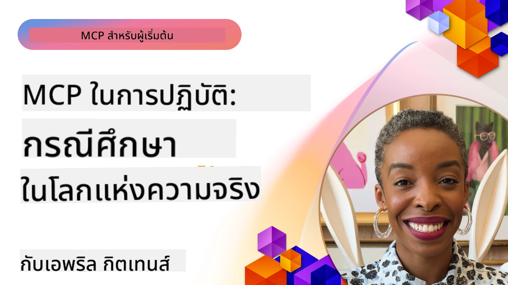

# MCP ในการปฏิบัติ: กรณีศึกษาจริงในโลกจริง

_(คลิกที่ภาพด้านบนเพื่อดูวิดีโอบทเรียนนี้)_

โปรโตคอลบริบทแบบจำลอง (Model Context Protocol – MCP) กำลังเปลี่ยนแปลงวิธีที่แอปพลิเคชัน AI โต้ตอบกับข้อมูล เครื่องมือ และบริการ ส่วนนี้นำเสนอกรณีศึกษาจริงในโลกแห่งความเป็นจริงที่แสดงให้เห็นการใช้งาน MCP อย่างเป็นประโยชน์ในสถานการณ์องค์กรต่าง ๆ

## ภาพรวม

ส่วนนี้แสดงตัวอย่างที่ชัดเจนของการใช้งาน MCP โดยเน้นให้เห็นว่าองค์กรต่าง ๆ ใช้โปรโตคอลนี้เพื่อแก้ปัญหาทางธุรกิจที่ซับซ้อนอย่างไร ผ่านการศึกษากรณีเหล่านี้ คุณจะได้รับข้อมูลเชิงลึกเกี่ยวกับความหลากหลาย ความสามารถในการขยาย และประโยชน์ที่เป็นรูปธรรมของ MCP ในสถานการณ์ใช้งานจริง

## วัตถุประสงค์การเรียนรู้หลัก

โดยการสำรวจกรณีศึกษาเหล่านี้ คุณจะได้:

- เข้าใจวิธีการนำ MCP ไปใช้แก้ไขปัญหาทางธุรกิจเฉพาะทาง
- เรียนรู้เกี่ยวกับรูปแบบการบูรณาการและแนวทางสถาปัตยกรรมที่หลากหลาย
- รับรู้แนวปฏิบัติที่ดีที่สุดในการนำ MCP ไปใช้ในสภาพแวดล้อมองค์กร
- ได้รับข้อมูลเชิงลึกเกี่ยวกับอุปสรรคและแนวทางแก้ไขที่พบในการใช้งานจริง
- ระบุโอกาสในการนำรูปแบบคล้ายกันไปใช้ในโครงการของคุณเอง

## กรณีศึกษาที่โดดเด่น

### 1. [ตัวแทนเดินทาง AI บน Azure – การใช้งานอ้างอิง](./travelagentsample.md)

กรณีศึกษานี้วิเคราะห์โซลูชันอ้างอิงครบวงจรของ Microsoft ที่แสดงวิธีการสร้างแอปพลิเคชันวางแผนการเดินทางแบบหลายตัวแทนขับเคลื่อนด้วย AI โดยใช้ MCP, Azure OpenAI และ Azure AI Search โครงการนี้แสดงให้เห็น:

- การประสานงานหลายตัวแทนผ่าน MCP
- การบูรณาการข้อมูลองค์กรด้วย Azure AI Search
- สถาปัตยกรรมที่ปลอดภัยและสามารถปรับขนาดด้วยบริการ Azure
- เครื่องมือที่ขยายได้โดยใช้ส่วนประกอบ MCP ที่นำกลับมาใช้ใหม่ได้
- ประสบการณ์ผู้ใช้ในการสนทนาโดยขับเคลื่อนด้วย Azure OpenAI

โครงสร้างและรายละเอียดการใช้งานนำเสนอข้อมูลสำคัญในการสร้างระบบหลายตัวแทนที่ซับซ้อน โดยใช้ MCP เป็นชั้นประสานงาน

### 2. [อัปเดตไอเท็ม Azure DevOps จากข้อมูล YouTube](./UpdateADOItemsFromYT.md)

กรณีศึกษานี้แสดงการใช้งาน MCP ในการทำงานอัตโนมัติของกระบวนการ ทำให้เห็นว่าเครื่องมือ MCP สามารถใช้เพื่อ:

- ดึงข้อมูลจากแพลตฟอร์มออนไลน์ (YouTube)
- อัปเดตงานในระบบ Azure DevOps
- สร้างเวิร์กโฟลว์อัตโนมัติที่ทำซ้ำได้
- บูรณาการข้อมูลจากระบบต่าง ๆ เข้าด้วยกัน

ตัวอย่างนี้แสดงให้เห็นว่าแม้การใช้งาน MCP ที่ค่อนข้างเรียบง่ายก็สามารถสร้างประสิทธิภาพได้อย่างมากโดยการทำงานอัตโนมัติในงานประจำและปรับปรุงความสอดคล้องของข้อมูลในระบบต่าง ๆ

### 3. [การดึงเอกสารแบบเรียลไทม์ด้วย MCP](./docs-mcp/README.md)

กรณีศึกษานี้แนะนำวิธีเชื่อมต่อไคลเอนต์คอนโซล Python กับเซิร์ฟเวอร์ Model Context Protocol (MCP) เพื่อดึงและบันทึกเอกสาร Microsoft แบบเรียลไทม์ที่มีบริบท คุณจะได้เรียนรู้วิธี:

- เชื่อมต่อกับเซิร์ฟเวอร์ MCP โดยใช้ไคลเอนต์ Python และ SDK อย่างเป็นทางการของ MCP
- ใช้ไคลเอนต์ HTTP แบบสตรีมเพื่อการดึงข้อมูลแบบเรียลไทม์ที่มีประสิทธิภาพ
- เรียกใช้เครื่องมือเอกสารบนเซิร์ฟเวอร์และบันทึกการตอบกลับโดยตรงไปยังคอนโซล
- รวมเอกสาร Microsoft ที่ทันสมัยเข้ากับเวิร์กโฟลว์ของคุณโดยไม่ต้องออกจากเทอร์มินัล

บทนี้รวมแบบฝึกหัดลงมือทำ ตัวอย่างโค้ดที่ใช้งานได้จริงอย่างน้อย และลิงก์ไปยังแหล่งข้อมูลเพิ่มเติมเพื่อการเรียนรู้เชิงลึก ดูขั้นตอนทั้งหมดและโค้ดในบทที่ลิงก์เพื่อเข้าใจว่า MCP สามารถเปลี่ยนแปลงการเข้าถึงเอกสารและประสิทธิภาพของนักพัฒนาในสภาพแวดล้อมคอนโซลได้อย่างไร

### 4. [เว็บแอปสร้างแผนการเรียนแบบอินเทอร์แอกทีฟด้วย MCP](./docs-mcp/README.md)

กรณีศึกษานี้แสดงการสร้างเว็บแอปแบบอินเทอร์แอกทีฟโดยใช้ Chainlit และ Model Context Protocol (MCP) เพื่อสร้างแผนการเรียนเฉพาะบุคคลสำหรับหัวข้อใดก็ได้ ผู้ใช้สามารถระบุหัวข้อ (เช่น "การรับรอง AI-900") และระยะเวลาการศึกษา (เช่น 8 สัปดาห์) แล้วแอปจะให้คำแนะนำเนื้อหาเป็นรายสัปดาห์ Chainlit ช่วยให้เกิดอินเทอร์เฟซแชทแบบสนทนา ทำให้ประสบการณ์น่าสนใจและปรับเปลี่ยนได้

- เว็บแอปสนทนาโดยใช้ Chainlit
- คำถามจากผู้ใช้สำหรับหัวข้อและระยะเวลา
- คำแนะนำเนื้อหาเป็นรายสัปดาห์โดยใช้ MCP
- การตอบสนองแบบเรียลไทม์และปรับเปลี่ยนได้ในอินเทอร์เฟซแชท

โครงการนี้แสดงให้เห็นว่าการรวม AI แบบสนทนาและ MCP สามารถสร้างเครื่องมือการศึกษาแบบอินเทอร์แอกทีฟที่ขับเคลื่อนโดยผู้ใช้ในสภาพแวดล้อมเว็บสมัยใหม่

### 5. [เอกสารในบรรณาธิการด้วย MCP Server ใน VS Code](./docs-mcp/README.md)

กรณีศึกษานี้สาธิตวิธีนำ Microsoft Learn Docs เข้ามาในสภาพแวดล้อม VS Code ของคุณโดยตรงโดยใช้เซิร์ฟเวอร์ MCP — ไม่ต้องสลับแท็บเบราว์เซอร์อีกต่อไป! คุณจะได้เห็นวิธี:

- ค้นหาและอ่านเอกสารทันทีภายใน VS Code โดยใช้แผง MCP หรือคอมมานด์พาเลต
- อ้างอิงเอกสารและแทรกลิงก์โดยตรงใน README หรือไฟล์มาร์กดาวน์ของหลักสูตร
- ใช้ GitHub Copilot และ MCP ร่วมกันเพื่อเวิร์กโฟลว์เอกสารและโค้ดที่ขับเคลื่อนด้วย AI อย่างราบรื่น
- ตรวจสอบและปรับปรุงเอกสารด้วยข้อเสนอแนะแบบเรียลไทม์และความถูกต้องจาก Microsoft
- บูรณาการ MCP กับเวิร์กโฟลว์ GitHub สำหรับการตรวจสอบเอกสารอย่างต่อเนื่อง

การนำไปใช้งานรวมถึง:

- ตัวอย่างการตั้งค่า `.vscode/mcp.json` เพื่อการติดตั้งง่าย
- ขั้นตอนผ่านภาพหน้าจอของประสบการณ์ในบรรณาธิการ
- เคล็ดลับในการรวม Copilot และ MCP เพื่อประสิทธิภาพสูงสุด

สถานการณ์นี้เหมาะสำหรับผู้เขียนหลักสูตร ผู้เขียนเอกสาร และนักพัฒนาที่ต้องการทำงานในบรรณาธิการโดยไม่เสียสมาธิระหว่างใช้เอกสาร, Copilot และเครื่องมือตรวจสอบ — ทั้งหมดนี้ขับเคลื่อนด้วย MCP

### 6. [การสร้างเซิร์ฟเวอร์ APIM MCP](./apimsample.md)

กรณีศึกษานี้นำเสนอคำแนะนำทีละขั้นตอนในการสร้างเซิร์ฟเวอร์ MCP โดยใช้ Azure API Management (APIM) โดยครอบคลุม:

- การตั้งค่าเซิร์ฟเวอร์ MCP ใน Azure API Management
- การเปิดเผยการดำเนินการ API เป็นเครื่องมือ MCP
- การกำหนดนโยบายสำหรับจำกัดอัตราและความปลอดภัย
- การทดสอบเซิร์ฟเวอร์ MCP โดยใช้ Visual Studio Code และ GitHub Copilot

ตัวอย่างนี้แสดงให้เห็นวิธีใช้ความสามารถของ Azure ในการสร้างเซิร์ฟเวอร์ MCP ที่มั่นคงและสามารถใช้ในแอปพลิเคชันต่าง ๆ เพื่อเพิ่มการบูรณาการระบบ AI กับ API องค์กร

### 7. [GitHub MCP Registry — เร่งการรวมตัวแทน](https://github.com/mcp)

กรณีศึกษานี้วิเคราะห์ว่า GitHub MCP Registry ซึ่งเปิดตัวในเดือนกันยายน 2025 แก้ไขปัญหาสำคัญในระบบนิเวศ AI อย่างไร: การค้นหาและการปรับใช้เซิร์ฟเวอร์ Model Context Protocol (MCP) ที่กระจัดกระจายกัน

#### ภาพรวม
**MCP Registry** แก้ปัญหาการมีเซิร์ฟเวอร์ MCP กระจายอยู่ตามที่เก็บและรีจิสทรีที่แตกต่าง กันซึ่งก่อนหน้านี้ทำให้การบูรณาการช้าและเกิดข้อผิดพลาด เซิร์ฟเวอร์เหล่านี้ช่วยให้ตัวแทน AI โต้ตอบกับระบบภายนอกเช่น API ฐานข้อมูล และแหล่งข้อมูลเอกสาร

#### ข้อปัญหา
นักพัฒนาที่สร้างเวิร์กโฟลว์แบบตัวแทนเผชิญกับความท้าทายหลายประการ:
- **การค้นหาที่ไม่ดีพอ** ของเซิร์ฟเวอร์ MCP บนแพลตฟอร์มต่าง ๆ
- **คำถามซ้ำซ้อนเกี่ยวกับการตั้งค่า** กระจายอยู่ในฟอรัมและเอกสาร
- **ความเสี่ยงด้านความปลอดภัย** จากแหล่งที่มาไม่ผ่านการยืนยันและไม่น่าเชื่อถือ
- **ขาดมาตรฐาน** ในคุณภาพและความเข้ากันได้ของเซิร์ฟเวอร์

#### สถาปัตยกรรมโซลูชัน
MCP Registry ของ GitHub รวมศูนย์เซิร์ฟเวอร์ MCP ที่เชื่อถือได้ด้วยคุณสมบัติหลัก:
- **ติดตั้งด้วยคลิกเดียว** ผ่าน VS Code เพื่อการตั้งค่าที่ราบรื่น
- **การกรองสัญญาณจากเสียงรบกวน** โดยดูจากดาว, กิจกรรม และการตรวจสอบจากชุมชน
- **การบูรณาการโดยตรง** กับ GitHub Copilot และเครื่องมือที่รองรับ MCP อื่น ๆ
- **โมเดลการมีส่วนร่วมแบบเปิด** ที่เปิดโอกาสให้ชุมชนและพันธมิตรองค์กรมีส่วนร่วม

#### ผลกระทบทางธุรกิจ
รีจิสทรีได้ส่งมอบการปรับปรุงที่วัดผลได้:
- **การเริ่มต้นใช้งานที่เร็วขึ้น** สำหรับนักพัฒนาด้วยเครื่องมืออย่าง Microsoft Learn MCP Server ที่สตรีมเอกสารอย่างเป็นทางการเข้าสู่ตัวแทนโดยตรง
- **เพิ่มผลผลิต** ผ่านเซิร์ฟเวอร์เฉพาะ เช่น `github-mcp-server` ที่ช่วยให้ทำงานอัตโนมัติ GitHub ด้วยภาษาธรรมชาติ (สร้าง PR, รัน CI ซ้ำ, สแกนโค้ด)
- **ความน่าเชื่อถือในระบบนิเวศที่แข็งแกร่งขึ้น** ผ่านรายการที่คัดสรรและมาตรฐานการกำหนดค่าที่โปร่งใส

#### คุณค่าทางยุทธศาสตร์
สำหรับผู้ปฏิบัติงานที่เชี่ยวชาญด้านการจัดการวงจรชีวิตตัวแทนและเวิร์กโฟลว์ที่ทำซ้ำได้ MCP Registry ให้:
- **ความสามารถในการปรับใช้ตัวแทนแบบโมดูลาร์** ด้วยส่วนประกอบที่ได้มาตรฐาน
- **สายการประเมินที่ได้รับการสนับสนุนจากรีจิสทรี** สำหรับการทดสอบและตรวจสอบอย่างสม่ำเสมอ
- **ความสามารถในการทำงานร่วมกันข้ามเครื่องมือ** ที่ทำให้บูรณาการอย่างไร้รอยต่อในแพลตฟอร์ม AI ต่าง ๆ

กรณีศึกษานี้แสดงว่า MCP Registry ไม่ใช่เพียงแค่ไดเรกทอรี แต่เป็นแพลตฟอร์มพื้นฐานสำหรับการบูรณาการโมเดลที่ขยายขนาดได้และการปรับใช้ระบบตัวแทนแบบตัวแทนในโลกจริง

### 8. [การเผยแพร่ไปยังโซเชียลเน็ตเวิร์กจากตัวแทน](./publora-social-publishing.md)

กรณีศึกษานี้เดินผ่านเซิร์ฟเวอร์ MCP ระยะไกลที่เขียนได้ — ซึ่งเครื่องมือของมันทำการกระทำที่ไม่สามารถย้อนกลับได้ในนามของผู้ใช้ — โดยใช้การเผยแพร่โซเชียลเป็นตัวอย่างที่ศึกษา ตัวแทนร่างโพสต์ คนตรวจสอบอนุมัติ และเซิร์ฟเวอร์กำหนดเวลาการโพสต์ไปยังเครือข่ายต่าง ๆ

ส่วนที่น่าสนใจคือข้อจำกัดในการออกแบบที่การเผยแพร่กำหนด ซึ่งใช้ได้กับเซิร์ฟเวอร์ที่เขียนข้อมูลแทนที่จะอ่าน:

- **การค้นหาที่เปิดกว้าง, การดำเนินการที่ตรวจสอบตัวตน** — `tools/list` ตอบกลับโดยไม่ต้องใช้ข้อมูลประจำตัวเพื่อให้รีจิสทรีและไคลเอนต์สามารถสำรวจได้ ในขณะที่ทุก `tools/call` ต้องใช้โทเค็นและจะคืนค่า `401` พร้อมหัวข้อ `WWW-Authenticate`
- **การลงทะเบียน OAuth โดยไม่ต้องผ่านขั้นตอนภายนอก** — การลงทะเบียนไคลเอนต์แบบไดนามิกในวันนี้ โดยมี Client ID Metadata Documents เป็นทิศทางที่ระบุในข้อกำหนด `2026-07-28`
- **คำอธิบายเครื่องมือ** (`readOnlyHint`, `destructiveHint`, `idempotentHint`) ที่ลูกค้าใช้ตัดสินใจว่าจะยืนยันหรือไม่ — เป็นคำแนะนำมากกว่าการบังคับ และเป็นสิ่งที่ไดเรกทอรีตัวเชื่อมต่อคาดหวังในขั้นตอนทบทวน
- **ตัวระบุที่ไม่สามารถถูกสร้างขึ้นใหม่ได้** เพื่อให้ค่าที่จินตนาการผิดพลาดแสดงข้อผิดพลาดแทนที่จะดำเนินการตามค่าที่ดูเหมือนถูกต้อง
- **คีย์ idempotency บนเครื่องมือสร้างโพสต์** เพื่อให้การลองใหม่ของรันไทม์ตัวแทนไม่กลายเป็นการเผยแพร่ซ้ำ
- **เป้าหมาย no-op ที่อธิบายในสคีมาเครื่องมือ** ที่ใช้ทดสอบเส้นทางการเขียนอย่างเต็มที่และไม่เผยแพร่ใด ๆ สำหรับผู้ตรวจสอบและ CI

บทสรุปปิดท้ายด้วยรายการตรวจสอบสั้น ๆ ที่คุณสามารถใช้กับเซิร์ฟเวอร์ที่คุณกำลังสร้าง

## บทสรุป

กรณีศึกษาทั้งแปดนี้แสดงให้เห็นถึงความหลากหลายที่โดดเด่นและการใช้งานที่เป็นรูปธรรมของ Model Context Protocol ในสถานการณ์จริงที่หลากหลาย ตั้งแต่ระบบวางแผนการเดินทางแบบหลายตัวแทนที่ซับซ้อนและการจัดการ API องค์กรจนถึงเวิร์กโฟลว์เอกสารที่ถูกทำให้เรียบง่ายและ GitHub MCP Registry อันปฏิวัติ ตัวอย่างเหล่านี้แสดงให้เห็นว่า MCP ให้วิธีการมาตรฐานและขยายขนาดได้ในการเชื่อมต่อระบบ AI กับเครื่องมือ ข้อมูล และบริการที่พวกเขาต้องการเพื่อส่งมอบคุณค่าอย่างยอดเยี่ยม

กรณีศึกษาเหล่านี้ครอบคลุมหลายมิติของการใช้งาน MCP:
- **การบูรณาการองค์กร**: Azure API Management และการทำงานอัตโนมัติ Azure DevOps
- **การประสานงานหลายตัวแทน**: วางแผนการเดินทางด้วยตัวแทน AI ที่ประสานงานกัน
- **ประสิทธิภาพนักพัฒนา**: การบูรณาการ VS Code และการเข้าถึงเอกสารแบบเรียลไทม์
- **การพัฒนาในระบบนิเวศ**: GitHub MCP Registry เป็นแพลตฟอร์มพื้นฐาน
- **แอปพลิเคชันการศึกษา**: เครื่องมือสร้างแผนการเรียนแบบอินเทอร์แอกทีฟและอินเทอร์เฟซแบบสนทนา

โดยการศึกษาการใช้งานเหล่านี้ คุณจะได้รับข้อมูลเชิงลึกสำคัญเกี่ยวกับ:
- **รูปแบบสถาปัตยกรรม** สำหรับขนาดและกรณีการใช้งานที่แตกต่างกัน
- **กลยุทธ์การใช้งาน** ที่สมดุลระหว่างฟังก์ชันและการดูแลรักษา
- **ข้อพิจารณาด้านความปลอดภัยและความสามารถในการขยาย** สำหรับการปรับใช้งานในสภาพแวดล้อมผลิตจริง
- **แนวปฏิบัติที่ดีที่สุด** สำหรับการพัฒนาเซิร์ฟเวอร์ MCP และการบูรณาการไคลเอนต์
- **แนวคิดระบบนิเวศ** สำหรับการสร้างโซลูชัน AI ที่เชื่อมโยงกันอย่างครบวงจร

ตัวอย่างเหล่านี้รวมกันแสดงให้เห็นว่า MCP ไม่ใช่เพียงกรอบทฤษฎีแต่นับเป็นโปรโตคอลที่เจริญวัยและพร้อมสำหรับการใช้งานจริงที่เปิดโอกาสโซลูชันที่เป็นรูปธรรมต่อความท้าทายทางธุรกิจที่ซับซ้อน ไม่ว่าคุณจะสร้างเครื่องมืออัตโนมัติที่เรียบง่ายหรือระบบหลายตัวแทนที่ซับซ้อน รูปแบบและแนวทางที่แสดงไว้ที่นี่จะเป็นรากฐานที่มั่นคงสำหรับโครงการ MCP ของคุณเอง

## แหล่งข้อมูลเพิ่มเติม

- [ที่เก็บ GitHub ของ Azure AI Travel Agents](https://github.com/Azure-Samples/azure-ai-travel-agents)
- [เครื่องมือ MCP สำหรับ Azure DevOps](https://github.com/microsoft/azure-devops-mcp)
- [เครื่องมือ MCP ของ Playwright](https://github.com/microsoft/playwright-mcp)
- [เซิร์ฟเวอร์ Microsoft Docs MCP](https://github.com/MicrosoftDocs/mcp)
- [GitHub MCP Registry — เร่งการรวมตัวแทน](https://github.com/mcp)
- [ตัวอย่างชุมชน MCP](https://github.com/microsoft/mcp)

## ต่อไปคืออะไร

- ก่อนหน้า: [โมดูล 8: แนวปฏิบัติที่ดีที่สุด](../08-BestPractices/README.md)
- ถัดไป: [โมดูล 10: การปรับเวิร์กโฟลว์ AI ให้ราบรื่น: การสร้างเซิร์ฟเวอร์ MCP ด้วย AI Toolkit](../10-StreamliningAIWorkflowsBuildingAnMCPServerWithAIToolkit/README.md)

---

<!-- CO-OP TRANSLATOR DISCLAIMER START -->
**ปฏิเสธความรับผิดชอบ**:
เอกสารนี้ได้รับการแปลโดยใช้บริการแปลภาษา AI [Co-op Translator](https://github.com/Azure/co-op-translator) ขณะที่เราพยายามให้ความถูกต้อง โปรดทราบว่าการแปลโดยอัตโนมัติอาจมีข้อผิดพลาดหรือความไม่ถูกต้อง เอกสารต้นฉบับในภาษาต้นทางควรถูกพิจารณาเป็นแหล่งข้อมูลที่เชื่อถือได้ สำหรับข้อมูลที่สำคัญ แนะนำให้ใช้การแปลโดยมนุษย์มืออาชีพ เราไม่รับผิดชอบต่อความเข้าใจผิดหรือการตีความที่ผิดพลาดที่เกิดขึ้นจากการใช้การแปลนี้
<!-- CO-OP TRANSLATOR DISCLAIMER END -->