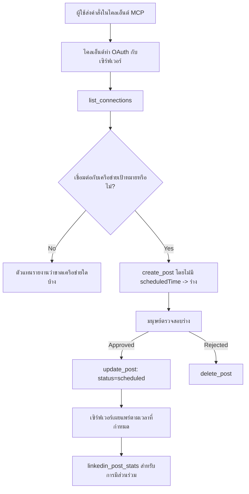

# กรณีศึกษา: การเผยแพร่ไปยังเครือข่ายสังคมจาก Agent กับเซิร์ฟเวอร์ MCP ระยะไกล

> **ข้อจำกัดความรับผิดชอบ:** บริการและโปรเจกต์โอเพนซอร์สหลายรายการสามารถเผยแพร่ไปยังเครือข่ายสังคมได้ และทีมงานยังสามารถผสานรวม API ของแต่ละเครือข่ายโดยตรงได้ สถานการณ์ด้านล่างนี้ถูกจัดเตรียมเป็นตัวอย่างหนึ่งของวิธีการออกแบบและใช้งาน **เซิร์ฟเวอร์ MCP ระยะไกลที่สามารถเขียนข้อมูลได้** Publora เป็นบริการเชิงพาณิชย์ที่มีชั้นฟรี แพตเทิร์นที่อธิบายไว้ที่นี่สามารถใช้กับเซิร์ฟเวอร์ MCP ใดๆ ที่ทำหน้าที่ที่ไม่สามารถย้อนกลับได้แทนผู้ใช้

## ภาพรวม

Agent ถนัดในการร่างเนื้อหาแต่ไม่ถนัดในการเผยแพร่ โมเดลสามารถเขียนประกาศปล่อยในเวลาไม่กี่วินาที แล้วงานก็หยุดที่นั่น: การเผยแพร่ต้องใช้ API ของแต่ละเครือข่าย, แอป OAuth ของแต่ละเครือข่าย และชุดกฎสื่อที่แตกต่างกันแต่ละเครือข่าย ทีมส่วนใหญ่แก้ปัญหานี้ด้วยการคัดลอกข้อความไปวางในเบราว์เซอร์ด้วยมือ

กรณีศึกษานี้จะดูว่าขั้นตอนสุดท้ายนี้ถูกปิดอย่างไรด้วยเซิร์ฟเวอร์ MCP ระยะไกลเดียว และ — ที่สำคัญกว่าสำหรับใครก็ตามที่กำลังสร้างเซิร์ฟเวอร์แบบนี้ — ในการตัดสินใจออกแบบที่เซิร์ฟเวอร์ **ที่เขียนข้อมูลได้** ต้องทำให้ถูกต้อง การอ่านข้อมูลนั้นให้อภัยได้แต่การเผยแพร่นั้นไม่ใช่: การเรียกเครื่องมือผิดพลาดจะปรากฏแก่ผู้ชมและไม่สามารถย้อนกลับได้

## สถานการณ์

ทีมพัฒนาความสัมพันธ์ขนาดเล็กร่างโพสต์ภายใน agent (Claude, VS Code, Cursor — ไม่สำคัญว่าเป็นไคลเอนต์อะไร) พวกเขาต้องการให้ agent เป็น:

- ดูว่าเชื่อมต่อบัญชีโซเชียลใดบ้างในทีม,
- ร่างโพสต์และเก็บไว้เป็นร่างเพื่อให้คนตรวจสอบ,
- แนบรูปภาพ,
- กำหนดเวลาส่งไปยังหลายเครือข่ายในเวลาที่เลือก,
- และรายงานผลในภายหลัง

ที่สำคัญ พวกเขาต้องการให้ agent *ไม่สามารถ* เผลอเผยแพร่ขณะกำลังทดลองอยู่

## เครื่องมือที่ใช้

- [Publora MCP Server](https://github.com/publora/mcp-server) — เซิร์ฟเวอร์ MCP ระยะไกล (`streamable-http`) ที่เปิดเผยเครื่องมือเผยแพร่ การกำหนดเวลา สื่อ และการวิเคราะห์ LinkedIn ลงทะเบียนในทะเบียน MCP อย่างเป็นทางการในชื่อ `com.publora/mcp-server`

## วิธีทำงานทีละขั้นตอน

1. **เชื่อมต่อเซิร์ฟเวอร์** ไคลเอนต์ที่รองรับ OAuth จะทำ flow การขออนุญาตแบบ authorization-code พร้อม PKCE กับหน้าจอการอนุญาตของเซิร์ฟเวอร์เอง; ไคลเอนต์ที่ไม่รองรับ เช่น CLI แบบไม่มีหัว ใช้คีย์ API ของ Publora ใน header ทั้งสองเส้นทางรองรับ และเส้นทางที่ได้ขึ้นอยู่กับไคลเอนต์ ไม่ใช่เซิร์ฟเวอร์
2. **แสดงรายการการเชื่อมต่อ** Agent เรียก `list_connections` และได้รับบัญชีที่เชื่อมต่อพร้อมตัวระบุของพวกเขา
3. **ร่างโพสต์** Agent เรียก `create_post` *โดยไม่มี* เวลากำหนดโพสต์ โพสต์จะถูกเก็บไว้ในฐานะร่าง — ไม่มีการเผยแพร่ใดๆ
4. **แนบสื่อ** URL รูปภาพสาธารณะถูกส่งมาในคำสั่งเดียวกัน; เซิร์ฟเวอร์จะดาวน์โหลดและตรวจสอบความถูกต้อง
5. **กำหนดเวลา** หลังจากคนตรวจสอบแล้ว `update_post` จะตั้งสถานะเป็นกำหนดเวลาโดยใช้เวลารูปแบบ ISO 8601
6. **วัดผล** สำหรับ LinkedIn, `linkedin_post_stats` จะส่งกลับข้อมูลการมีส่วนร่วมเมื่อโพสต์เริ่มเผยแพร่แล้ว

## ตัวอย่างพรอมต์

```text
Which social accounts do I have connected?
Draft a post announcing our new changelog page, attach the screenshot at
https://example.com/changelog.png, and keep it as a draft — do not publish it.
Once I approve, schedule it to LinkedIn and Bluesky for tomorrow at 09:00 UTC.
```

## Diagram Mermaid



## การนำไปใช้งานทางเทคนิค

บทเรียนด้านล่างนี้เป็นส่วนที่ถ่ายทอดได้จากกรณีศึกษานี้

### การค้นหาแบบเปิด, การดำเนินการที่ยืนยันตัวตนแล้ว

`tools/list` ให้บริการโดยไม่ต้องใช้ข้อมูลรับรอง; การเรียก `tools/call` ทุกครั้งต้องมีโทเคน มิฉะนั้นจะตอบกลับด้วย `401` พร้อม header `WWW-Authenticate` ที่ชี้ไปที่เมตาดาต้าของทรัพยากรที่ป้องกัน (เซิร์ฟเวอร์ยังตอบสนอง `initialize` แบบไม่ยืนยันตัวตน, ซึ่งสำคัญสำหรับไคลเอนต์บนเวอร์ชันโปรโตคอลก่อน `2026-07-28`; การแก้ไขนั้นตัด handshake ออกไปโดยสิ้นเชิง)

การแยกนี้มีความสำคัญในทางปฏิบัติ ลงทะเบียน รายการ และไคลเอนต์สามารถสำรวจหน้าตาเครื่องมือ — ชื่อ สคีมา คำอธิบาย — ได้โดยไม่ต้องถือความลับ ในขณะที่ไม่มีอะไรสามารถ *เรียกใช้งาน* โดยไม่ระบุชื่อได้ เซิร์ฟเวอร์ที่ต้องการโทเคนสำหรับ `initialize` เป็นการทำให้เครื่องมือมองไม่เห็นได้ ในขณะที่เซิร์ฟเวอร์ที่อนุญาต `tools/call` แบบไม่ระบุตัวตนอาจเป็นความเสี่ยง

### การลงทะเบียน: การลงทะเบียนไคลเอนต์แบบไดนามิก และสิ่งที่มาแทนที่

เซิร์ฟเวอร์ประกาศ `/.well-known/oauth-protected-resource` และ `/.well-known/oauth-authorization-server` และรองรับ authorization-code flow พร้อม PKCE (`S256`), รีเฟรชโทเคน และ **การลงทะเบียนไคลเอนต์แบบไดนามิก**

การลงทะเบียนแบบไดนามิกช่วยตัดขั้นตอนด้วยมือ: หากไม่มีมัน ไคลเอนต์แต่ละอันจะต้องมี `client_id` ที่ออกล่วงหน้า ซึ่งหมายถึงการขอจากผู้ขายแบบนอกวงจรสำหรับไคลเอนต์ใหม่แต่ละอัน

ให้พิจารณานี่เป็นพฤติกรรมที่เข้ากันได้ มากกว่าการออกแบบที่ควรคัดลอก การแก้ไขสเปค `2026-07-28` เลิกใช้การลงทะเบียนไคลเอนต์แบบไดนามิกเพื่อสนับสนุน Client ID Metadata Documents ที่ไคลเอนต์โฮสต์เอกสารเมตาดาต้าที่ URL HTTPS เสถียร และ URL นั้น *คือ* `client_id` DCR ยังใช้งานได้ในตอนนี้ แต่เซิร์ฟเวอร์ที่กำลังสร้างในวันนี้ควรวางแผนสำหรับ CIMD และเก็บ DCR ไว้สำหรับไคลเอนต์เก่า

### คำอธิบายเครื่องมือไม่ใช่แค่ประดับ

เครื่องมือแต่ละตัวมี `title` และคำแนะนำที่เกี่ยวข้องคือ: `readOnlyHint`, `destructiveHint`, `idempotentHint`, `openWorldHint`

มีเหตุผลสองประการที่ควรลงทุนในคำอธิบายเหล่านี้ ก่อนอื่น ไคลเอนต์ใช้คำแนะนำเพื่อตัดสินใจว่าจะยืนยันกับผู้ใช้หรือไม่ — ไคลเอนต์สามารถรันการค้นหาแบบอ่านอย่างเดียวและหยุดรออนุมัติก่อนลบได้ สเปคชัดเจนว่า คำอธิบายเป็นการบอกใบ้ที่ไม่ต้องเชื่อถือ ไม่ใช่กลไกการอนุญาต: มันกำหนดสิ่งที่ไคลเอนต์เสนอจะทำ ไม่ได้หยุดอะไรบนเซิร์ฟเวอร์ และเซิร์ฟเวอร์ยังต้องบังคับใช้กฎของตัวเอง ประการที่สอง รายการเชื่อมต่อหลักในปัจจุบัน *ต้องการ* คำอธิบายเหล่านี้เพื่อการตรวจสอบ เซิร์ฟเวอร์ที่ไม่มีชื่อเรื่องและคำอธิบายสำหรับเครื่องมือจะถูกส่งกลับอย่างไม่คำนึงถึงความสามารถทำงานดีแค่ไหน

### ทำให้ตัวระบุไม่สามารถตั้งสมมติได้

ตัวระบุแพลตฟอร์มเป็นสตริงที่ไม่สามารถอ่านได้ที่ส่งกลับโดย `list_connections` และคำอธิบายสคีมาอธิบายไว้อย่างชัดเจนว่าต้องคัดลอกตามตัวหนังสือและไม่ควรเดา เซิร์ฟเวอร์จะปฏิเสธสิ่งอื่นใด

โมเดลเป็นผู้ทายใจอย่างว่องไว เซิร์ฟเวอร์ที่เขียนข้อมูลได้ควรคาดหวังว่าตัวระบุจะถูกสร้างขึ้นในที่สุด และทำให้เส้นทางนั้นล้มเหลวอย่างชัดเจนและรวดเร็ว แทนที่จะทำตามค่าที่ดูเหมือนสมเหตุสมผล

### ล้มเหลวก่อนเผยแพร่ ด้วยข้อความที่แก้ไขได้

บางเครือข่ายปฏิเสธโพสต์ที่มีแต่ข้อความและต้องการรูปหรือวิดีโอ ซึ่งจะถูกตรวจสอบเมื่อกำหนดเวลาโพสต์ และข้อความผิดพลาดจะระบุชื่อแพลตฟอร์มและความต้องการที่ขาดหายไป

Agent สามารถแก้ไขปัญหา "Instagram ต้องการสื่อ — แนบรูปหรือวิดีโอ" โดยไม่ต้องกลับไปมาหลายรอบ แต่ไม่สามารถแก้ไขได้จาก `400` ทั่วไป

### ทำให้การลองใหม่ปลอดภัย

สองเครื่องมือที่สร้างเนื้อหา `create_post` และ `update_post` รับ idempotency key: ใช้ซ้ำกับคำขอเหมือนเดิมจะเล่นคำตอบเดิมแทนการสร้างโพสต์ที่สอง รันไทม์ของ agent จะลองใหม่เมื่อเกิด timeout หากไม่มี idempotency การตอบช้าจะกลายเป็นการเผยแพร่ซ้ำ เครื่องมือเขียนอื่น ๆ — การลบ, ขั้นตอนสื่อ, ปฏิกิริยาและความเห็นใน LinkedIn — ไม่รับ idempotency key ดังนั้นการลองใหม่ในนั้นอาจไม่ปลอดภัยโดยอัตโนมัติ ควรทราบว่าการเปลี่ยนแปลงใดของคุณถูกปกป้องและอันไหนไม่

### ให้วิธีทดสอบที่ไม่เผยแพร่จริง

เซิร์ฟเวอร์รับจุดหมายสำรอง `publora-playground` ซึ่งถูกตรวจสอบและตอบรับเหมือนจุดหมายจริง จากนั้นถูกทิ้งไป — ไม่มีอะไรไปถึงบัญชีจริง มันอธิบายในสคีมาของเครื่องมือซึ่งไคลเอนต์ใดก็ได้สามารถอ่านได้โดยไม่ต้องใช้ข้อมูลรับรอง: ฟิลด์ `platforms` ของ `create_post` อธิบายไว้ว่า "เป้าหมายทดสอบการเชื่อมต่อที่ไม่ต้องการการเชื่อมต่อจริง - โพสต์จะถูกตอบรับและทิ้งไป ไม่มีอะไรถูกเผยแพร่" เรียกใช้งานโดยส่งเป็นรายการเดียว: `platforms: ["publora-playground"]`

สิ่งนี้ถือเป็นรายละเอียดที่มีประโยชน์ที่สุดอย่างหนึ่งของพื้นผิวทั้งหมด ผู้ตรวจสอบในไดเรกทอรีเชื่อมต่อ, ผู้ร่วมงาน และ CI สามารถทดสอบเส้นทางเขียนเต็มรูปแบบได้โดยไม่มีความเสี่ยงกับกลุ่มผู้ชมจริง เซิร์ฟเวอร์ MCP ที่มีการกระทำที่ไม่สามารถย้อนกลับ ควรมีจุดหมาย no-op ที่มีเอกสาร

## ผลลัพธ์และผลกระทบ

- ขั้นตอนการเผยแพร่ถูกย้ายจากเบราว์เซอร์ไปยังการสนทนาเดียวกับที่เขียนเนื้อหา และนิสัยการเขียนร่างก่อนช่วยให้มีคนควบคุมอย่างต่อเนื่อง ระบุอย่างชัดเจนว่าสิ่งนั้นคืออะไร: ร่างคือข้อตกลง ไม่ใช่ขอบเขต ข้อมูลรับรองเดียวกันสามารถกำหนดเวลาหรือเผยแพร่ได้ ดังนั้นใครก็ตามที่ต้องการเกตอนุมัติจริงๆ ต้องบังคับใช้นอกพื้นผิวเครื่องมือ — ใช้ข้อมูลรับรองแยกต่างหาก หรือชั้นนโยบายหน้าตัวเซิร์ฟเวอร์
- ความแตกต่างต่อเครือข่าย — ความต้องการสื่อ, การเรียงลำดับ, การควบคุมตอบกลับ — ถูกจัดการครั้งเดียวในเซิร์ฟเวอร์แทนที่จะเป็นใน agent แต่ละตัวที่สื่อสารกับมัน
- เซิร์ฟเวอร์เดียวกันรองรับลูกค้า MCP หลายตัวโดยไม่ต้องทำงานแยกสำหรับแต่ละไคลเอนต์ เพราะการค้นหาเป็นแบบเปิดและการลงทะเบียนเป็นแบบไดนามิก
- ข้อจำกัดการออกแบบด้านบนถูกกำหนดโดยการตรวจสอบไดเรกทอรีเชื่อมต่อมากเท่ากับผู้ใช้: คำอธิบาย, OAuth, และเป้าหมายทดสอบที่ปลอดภัยเป็นแต่ละอย่างที่พวกเขาต้องการ

## แหล่งอ้างอิง

- [Publora MCP Server (ซอร์ส)](https://github.com/publora/mcp-server)
- [เอกสาร Publora API และ MCP](https://docs.publora.com)
- [MCP Registry รายการ: `com.publora/mcp-server`](https://registry.modelcontextprotocol.io/v0/servers?search=com.publora/mcp-server)
- [MCP specification — Authorization](https://modelcontextprotocol.io/specification/draft/basic/authorization)
- [MCP specification — Tool annotations](https://modelcontextprotocol.io/docs/concepts/tools)

## ขั้นตอนต่อไป

- นำเซิร์ฟเวอร์ MCP ที่คุณกำลังสร้างมาและตรวจสอบสามอย่างที่คุ้มค่าที่สุดที่นี่: คำอธิบายบนเครื่องมือทุกตัว, idempotency key ในทุกการเขียน, และเป้าหมาย no-op ที่มีเอกสาร
- ทดลองการแบ่งแยกการค้นหาแบบเปิด: เรียก `tools/list` กับเซิร์ฟเวอร์ระยะไกลสาธารณะที่ไม่มีข้อมูลรับรอง จากนั้นเรียกใช้เครื่องมือและตรวจสอบความท้าทาย `401`
- พิจารณาว่า "ย้อนกลับ" หมายถึงอะไรสำหรับโดเมนของคุณ การเผยแพร่มีร่างและการลบ หากการกระทำของคุณไม่มีเทียบเท่า การยืนยันควรอยู่ในดีไซน์เครื่องมือ ไม่ใช่ในพรอมต์

---

<!-- CO-OP TRANSLATOR DISCLAIMER START -->
**ปฏิเสธความรับผิดชอบ**:
เอกสารนี้ได้รับการแปลโดยใช้บริการแปลภาษา AI [Co-op Translator](https://github.com/Azure/co-op-translator) ขณะที่เราพยายามให้ความถูกต้อง โปรดทราบว่าการแปลโดยอัตโนมัติอาจมีข้อผิดพลาดหรือความไม่ถูกต้อง เอกสารต้นฉบับในภาษาต้นทางควรถูกพิจารณาเป็นแหล่งข้อมูลที่เชื่อถือได้ สำหรับข้อมูลที่สำคัญ แนะนำให้ใช้การแปลโดยมนุษย์มืออาชีพ เราไม่รับผิดชอบต่อความเข้าใจผิดหรือการตีความที่ผิดพลาดที่เกิดขึ้นจากการใช้การแปลนี้
<!-- CO-OP TRANSLATOR DISCLAIMER END -->