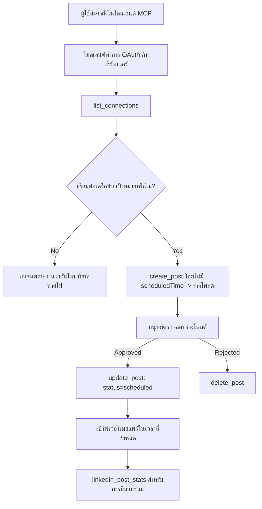

# กรณีศึกษา: การเผยแพร่ไปยังเครือข่ายสังคมออนไลน์จากเอเจนต์ที่มีเซิร์ฟเวอร์ MCP ระยะไกล

> **ข้อจำกัดความรับผิดชอบ:** หลายบริการและโครงการโอเพนซอร์สสามารถเผยแพร่ไปยังเครือข่ายสังคมออนไลน์ได้ และทีมงานยังสามารถรวม API ของแต่ละเครือข่ายเข้าด้วยกันโดยตรง สถานการณ์ด้านล่างนี้ถูกจัดเตรียมเป็นตัวอย่างหนึ่งที่ใช้งานจริงว่าการออกแบบและใช้เซิร์ฟเวอร์ MCP ระยะไกลที่สามารถเขียนข้อมูลได้อย่างไร Publora เป็นบริการเชิงพาณิชย์ที่มีชั้นฟรี; รูปแบบที่อธิบายที่นี่ใช้ได้กับเซิร์ฟเวอร์ MCP ใด ๆ ที่ดำเนินการที่ไม่สามารถย้อนกลับได้ในนามของผู้ใช้

## ภาพรวม

เอเจนต์มีความถนัดในการร่างเนื้อหาแต่ไม่ถนัดในการส่งมอบโมเดลสามารถเขียนประกาศปล่อยงานได้ในไม่กี่วินาทีแล้วงานก็หยุดลง: การเผยแพร่หมายถึง API สำหรับแต่ละเครือข่าย แอป OAuth สำหรับแต่ละเครือข่าย และชุดกฎสื่อที่แตกต่างกันสำหรับแต่ละเครือข่าย ทีมส่วนใหญ่แก้ปัญหานี้โดยการคัดลอกข้อความลงในเบราว์เซอร์ด้วยมือ

กรณีศึกษาในนี้พิจารณาว่าขั้นตอนสุดท้ายนั้นถูกปิดด้วยเซิร์ฟเวอร์ MCP ระยะไกลเพียงตัวเดียวอย่างไร และ — ซึ่งมีประโยชน์มากขึ้นสำหรับใครก็ตามที่กำลังสร้างเซิร์ฟเวอร์ตัวหนึ่ง — การตัดสินใจในการออกแบบที่เซิร์ฟเวอร์ที่สามารถเขียนข้อมูลได้ต้องทำให้ถูกต้อง การอ่านข้อมูลคือการให้อภัย การเผยแพร่ไม่ใช่: การเรียกเครื่องมือผิดพลาดจะมองเห็นได้โดยผู้ชมและไม่สามารถยกเลิกได้

## สถานการณ์

ทีมงานพัฒนาความสัมพันธ์ขนาดเล็กร่างโพสต์ภายในเอเจนต์ (Claude, VS Code, Cursor — ตัวไคลเอนต์ไม่สำคัญ) พวกเขาต้องการให้เอเจนต์:

- ดูบัญชีโซเชียลที่ทีมเชื่อมต่ออยู่,
- ร่างโพสต์และเก็บไว้เป็นร่างเพื่อให้มนุษย์อนุมัติ,
- แนบภาพ,
- กำหนดเวลาให้เผยแพร่ในหลายเครือข่ายตามเวลาที่เลือก,
- และรายงานผลการดำเนินการในภายหลัง

สำคัญคือ พวกเขาต้องการให้เอเจนต์ *ไม่สามารถ* เผลอเผยแพร่ขณะที่ยังคงทดลองอยู่

## เครื่องมือที่ใช้

- [Publora MCP Server](https://github.com/publora/mcp-server) — เซิร์ฟเวอร์ MCP ระยะไกล (`streamable-http`) ที่ให้บริการเครื่องมือเผยแพร่ กำหนดเวลา สื่อ และวิเคราะห์ LinkedIn ลงทะเบียนในทะเบียน MCP อย่างเป็นทางการในชื่อ `com.publora/mcp-server`

## กระบวนการทีละขั้นตอน

1. **เชื่อมต่อเซิร์ฟเวอร์.** ไคลเอนต์ที่รองรับ OAuth จะทำกระบวนการอนุมัติด้วย authorization-code พร้อม PKCE กับหน้าจอการยินยอมของเซิร์ฟเวอร์เอง; ไคลเอนต์ที่ไม่รองรับ เช่น CLI แบบไม่มีหัว ใช้คีย์ API ของ Publora ในส่วนหัว ทั้งสองวิธีได้รับการสนับสนุน และวิธีที่คุณได้รับขึ้นอยู่กับไคลเอนต์ ไม่ใช่เซิร์ฟเวอร์
2. **แสดงรายการการเชื่อมต่อ.** เอเจนต์เรียก `list_connections` และรับบัญชีที่เชื่อมต่อพร้อมรหัสประจำตัว
3. **ร่างเนื้อหา.** เอเจนต์เรียก `create_post` *โดยไม่ระบุ* เวลาที่จะกำหนดไว้ล่วงหน้า โพสต์จะถูกเก็บไว้เป็นร่าง — ไม่มีการเผยแพร่ใด ๆ
4. **แนบสื่อ.** URL ของภาพสาธารณะถูกส่งผ่านในการเรียกเดียวกัน เซิร์ฟเวอร์ดาวน์โหลดและตรวจสอบความถูกต้อง
5. **กำหนดเวลา.** หลังจากผู้ใช้อนุมัติแล้ว `update_post` จะตั้งสถานะเป็นกำหนดเวลา พร้อมเวลารูปแบบ ISO 8601
6. **วัดประสิทธิภาพ.** สำหรับ LinkedIn, `linkedin_post_stats` จะส่งกลับข้อมูลการมีส่วนร่วมเมื่อโพสต์ใช้งานจริง

## ตัวอย่างพรอมต์

```text
Which social accounts do I have connected?
Draft a post announcing our new changelog page, attach the screenshot at
https://example.com/changelog.png, and keep it as a draft — do not publish it.
Once I approve, schedule it to LinkedIn and Bluesky for tomorrow at 09:00 UTC.
```

## แผนผังกระแส Mermaid



## การดำเนินการทางเทคนิค

บทเรียนด้านล่างนี้คือส่วนที่ถ่ายโอนจากกรณีศึกษานี้

### การค้นพบแบบเปิด, การปฏิบัติที่มีการยืนยันตัวตน

`tools/list` ให้บริการโดยไม่ต้องใช้ข้อมูลประจำตัว; ทุกครั้งที่เรียก `tools/call` ต้องใช้โทเค็น
และหากไม่ใช้ จะส่งกลับ `401` พร้อมส่วนหัว `WWW-Authenticate` ที่ชี้ไปยัง

เมตาดาต้าทรัพยากรที่ได้รับการปกป้อง จุดสิ้นสุดแบบเก่าของเซิร์ฟเวอร์ยังตอบสนอง `initialize` ที่ไม่ต้องการการตรวจสอบสิทธิ์สำหรับไคลเอนต์ที่ใช้เวอร์ชันโปรโตคอลก่อน 
`2026-07-28`; ไคลเอนต์ปัจจุบันไม่ใช้การจับมือแบบนั้น


การแบ่งแยกเฉพาะเซิร์ฟเวอร์นี้ช่วยให้รีจิสทรีส์ แคตตาล็อก และไคลเอนต์ตรวจสอบชื่อเครื่องมือ สคีมา และคำอธิบายประกอบโดยไม่ต้องใช้ความลับ ในขณะที่ป้องกันการดำเนินการแบบนิรนาม
การเปิดเผยการค้นหาเป็นทางเลือกของการปรับใช้งาน ไม่ใช่ข้อกำหนด MCP; การปรับใช้ที่ถูกปกป้องอาจต้องการการอนุญาตสำหรับ `tools/list` ด้วย


ไคลเอนต์แต่ละรายต้องมี `client_id` ที่ออกล่วงหน้าจากผู้ขาย


ให้ถือว่านี่เป็นพฤติกรรมด้านความเข้ากันได้ แทนที่จะเป็นการออกแบบที่ควรเลียนแบบ ตอนแก้ไขสเปคในวันที่ `2026-07-28` ยกเลิกการลงทะเบียนไคลเอนต์แบบไดนามิกเพื่อสนับสนุนเอกสารเมตาดาต้า Client ID ซึ่งที่ไคลเอนต์โฮสต์เอกสารเมตาดาต้าที่ URL HTTPS ที่เสถียรและ URL นั้น *คือ* `client_id` DCR ยังใช้งานได้ในตอนนี้ แต่เซิร์ฟเวอร์ที่สร้างในปัจจุบันควรวางแผนสำหรับ CIMD และเก็บ DCR ไว้สำหรับไคลเอนต์รุ่นเก่า

### คำอธิบายประกอบเครื่องมือไม่ใช่การตกแต่ง

เครื่องมือแต่ละชิ้นมี `title` และอินดิเคเตอร์ที่ใช้ได้: `readOnlyHint`, `destructiveHint`, `idempotentHint`, `openWorldHint`

มีสองเหตุผลที่จะลงทุนในคำอธิบายประกอบเหล่านี้ อย่างแรก ไคลเอนต์ใช้คำใบ้เพื่อกำหนดสิ่งที่ต้องยืนยันกับผู้ใช้ — ไคลเอนต์สามารถรันการค้นหาแบบอ่านอย่างเดียวโดยอัตโนมัติและหยุดรอการอนุมัติก่อนลบ สเปคระบุชัดเจนว่าคำอธิบายประกอบเป็นคำใบ้ที่ไม่มีความน่าเชื่อถือ ไม่ใช่กลไกการอนุญาต: พวกมันกำหนดสิ่งที่ไคลเอนต์เสนอจะทำ แต่ไม่ป้องกันอะไรบนเซิร์ฟเวอร์ และเซิร์ฟเวอร์ต้องบังคับใช้กฎของตัวเองได้ อย่างที่สอง ไดเรกทอรีคอนเน็กเตอร์หลัก ๆ ตอนนี้ *ต้องการ* พวกมันสำหรับการตรวจสอบ; เซิร์ฟเวอร์ที่เครื่องมือไม่มีชื่อและคำใบ้จะถูกส่งกลับโดยไม่คำนึงถึงความสามารถในการทำงานอย่างไร

### ทำให้ตัวระบุไม่สามารถคาดเดาได้

ตัวระบุแพลตฟอร์มเป็นสตริงทึบที่ส่งกลับโดย `list_connections` และคำอธิบายสคีมาระบุชัดเจนว่าต้องถูกคัดลอกแบบตรง ๆ และไม่ควรคาดเดา เซิร์ฟเวอร์ปฏิเสธสิ่งอื่น ๆ

โมเดลเป็นผู้คาดเดาที่ชัดแจ้ง เซิร์ฟเวอร์ที่สามารถเขียนได้ควรสมมติว่าตัวระบุจะถูกจินตนาการขึ้นในที่สุดและต้องทำให้เส้นทางนั้นล้มเหลวอย่างชัดเจนและรวดเร็ว มากกว่าจะดำเนินการโดยใช้ค่าที่ดูสมเหตุสมผล

### ล้มเหลวก่อนเผยแพร่ พร้อมข้อความที่ดำเนินการได้

บางเครือข่ายปฏิเสธโพสต์ที่มีแต่ข้อความและต้องการรูปภาพหรือวิดีโอ สิ่งนี้ตรวจสอบเมื่อโพสต์กำหนดเวลา และข้อผิดพลาดระบุชื่อแพลตฟอร์มและความต้องการที่หายไป

ตัวแทนสามารถกู้คืนจาก "Instagram ต้องการสื่อ — แนบรูปภาพหรือวิดีโอ" ได้โดยไม่ต้องส่งคำขอซ้ำอีกครั้งหนึ่ง แต่มันไม่สามารถกู้คืนจาก `400` แบบทั่วไปได้

### ทำให้การลองใหม่ปลอดภัย

สองเครื่องมือที่สร้างเนื้อหา ได้แก่ `create_post` และ `update_post` รับกุญแจการทำซ้ำเพื่อป้องกันเหตุซ้ำซ้อน: การใช้ซ้ำด้วยคำขอเดียวกันจะทำการเล่นซ้ำผลลัพธ์เดิมแทนการสร้างโพสต์ที่สอง รันไทม์ของเอเจนต์จะลองใหม่เมื่อหมดเวลา; ถ้าไม่มีความสามารถทำซ้ำ การตอบสนองช้าอาจกลายเป็นการเผยแพร่ซ้ำ เครื่องมือเขียนอื่น ๆ — การลบ ขั้นตอนสื่อ การกระทบและคอมเมนต์บน LinkedIn — ไม่มีความสามารถนี้ ดังนั้นการลองใหม่ในจุดนั้นไม่ปลอดภัยโดยอัตโนมัติ ควรรู้ว่า มิวเทชันของคุณอันไหนได้รับการป้องกันและอันไหนไม่


### จัดเตรียมวิธีการทดสอบที่ไม่เผยแพร่ข้อมูลใด ๆ


เซิร์ฟเวอร์รับเป้าหมายที่สงวนไว้, `publora-playground`, ซึ่งได้รับการตรวจสอบและรับทราบเหมือนกับเป้าหมายจริงและจากนั้นจะถูกทิ้ง — ไม่มีอะไรไปถึงบัญชีที่ใช้งานจริง มันถูกอธิบายในสคีมาของเครื่องมือเอง ซึ่งไคลเอนต์ใดๆ ก็สามารถอ่านได้โดยไม่ต้องใช้ข้อมูลประจำตัว: ฟิลด์ `platforms` ของ `create_post` อธิบายว่าเป็น "เป้าหมายทดสอบการเชื่อมต่อที่ไม่ต้องการการเชื่อมต่อจริง — โพสต์จะได้รับการรับทราบและทิ้ง, ไม่มีอะไรถูกเผยแพร่" เรียกใช้โดยการส่งเป็นรายการเดียว: `platforms: ["publora-playground"]`.

สิ่งนี้กลายเป็นรายละเอียดที่มีประโยชน์ที่สุดอย่างหนึ่งของพื้นผิวทั้งหมด ผู้ตรวจสอบไดเรกทอรีคอนเนคเตอร์, ผู้ร่วมพัฒนา และ CI สามารถทดสอบเส้นทางการเขียนเต็มรูปแบบตั้งแต่ต้นจนจบโดยไม่มีความเสี่ยงกับผู้ชมจริง เซิร์ฟเวอร์ MCP ใดๆ ที่มีการดำเนินการที่ไม่สามารถย้อนกลับได้จะได้รับประโยชน์จากเป้าหมาย no-op ที่มีเอกสารกำกับ

## ผลลัพธ์และผลกระทบ

- ขั้นตอนการเผยแพร่ย้ายจากเบราว์เซอร์ไปยังบทสนทนาเดียวกันที่เนื้อหาถูกเขียน และนิสัยร่างแรกจะเก็บคนไว้ในวงจร ให้ระบุอย่างชัดเจนว่าอะไรคือสิ่งนั้น: ร่างคือข้อตกลง ไม่ใช่ขอบเขต ข้อมูลประจำตัวเดียวกันสามารถกำหนดเวลาหรือเผยแพร่ได้ ดังนั้นใครก็ตามที่ต้องการประตูอนุมัติจริงต้องบังคับใช้นอกพื้นผิวเครื่องมือ — ข้อมูลประจำตัวแยก หรือชั้นนโยบายหน้าซิร์ฟเวอร์
- ความแตกต่างตามเครือข่าย — ความต้องการสื่อ, การจัดลำดับเธรด, การควบคุมการตอบกลับ — จัดการครั้งเดียวในเซิร์ฟเวอร์แทนที่จะเป็นในตัวแทนทุกตัวที่ติดต่อกับมัน
- เซิร์ฟเวอร์เดียวกันรองรับไคลเอนต์ MCP หลายรายโดยไม่ต้องใช้ข้อมูลประจำตัวที่ออกมาก่อนหน้า
    ไคลเอนต์ปัจจุบันสามารถใช้ Client ID Metadata Documents; DCR ยังคงเป็นตัวเลือกสำรอง
    สำหรับไคลเอนต์รุ่นเก่า
- ข้อจำกัดด้านการออกแบบข้างต้นถูกกำหนดโดยการทบทวนไดเรกทอรีคอนเนคเตอร์เท่ากับผู้ใช้: การอธิบายประกอบ, OAuth และเป้าหมายทดสอบที่ปลอดภัยคือสิ่งที่แต่ละคนต้องการอย่างน้อยหนึ่งอย่าง

## เอกสารอ้างอิง

- [เซิร์ฟเวอร์ Publora MCP (ซอร์ส)](https://github.com/publora/mcp-server)
- [เอกสาร Publora API และ MCP](https://docs.publora.com)
- [รายการ MCP Registry: `com.publora/mcp-server`](https://registry.modelcontextprotocol.io/v0/servers?search=com.publora/mcp-server)
- [ข้อกำหนด MCP — การอนุญาต](https://modelcontextprotocol.io/specification/2026-07-28/basic/authorization)
- [ข้อกำหนด MCP — การอธิบายประกอบเครื่องมือ](https://modelcontextprotocol.io/docs/concepts/tools)

## สิ่งที่ต้องทำต่อไป

- นำเซิร์ฟเวอร์ MCP ที่คุณกำลังสร้างและตรวจสอบสามสิ่งที่ชนะราคาถูกที่สุดที่นี่: การอธิบายประกอบในทุกเครื่องมือ, idempotency key ในการเขียนทุกครั้ง และเป้าหมาย no-op ที่มีเอกสารกำกับ
- ทดลองแยกการค้นพบแบบเปิด: เรียก `tools/list` กับเซิร์ฟเวอร์ระยะไกลสาธารณะโดยไม่มีข้อมูลประจำตัว จากนั้นเรียกเครื่องมือและตรวจสอบความท้าทาย `401`
- พิจารณาว่า "undo" หมายถึงอะไรสำหรับโดเมนของคุณ การเผยแพร่มีร่างและการลบ; หากการดำเนินการของคุณไม่มีสิ่งเทียบเท่า การยืนยันควรอยู่ในการออกแบบเครื่องมือ ไม่ใช่ในคำร้องขอ

---

<!-- CO-OP TRANSLATOR DISCLAIMER START -->
**ปฏิเสธความรับผิดชอบ**:
เอกสารนี้ได้รับการแปลโดยใช้บริการแปลภาษา AI [Co-op Translator](https://github.com/Azure/co-op-translator) ขณะที่เราพยายามให้ความถูกต้อง โปรดทราบว่าการแปลโดยอัตโนมัติอาจมีข้อผิดพลาดหรือความไม่ถูกต้อง เอกสารต้นฉบับในภาษาต้นทางควรถูกพิจารณาเป็นแหล่งข้อมูลที่เชื่อถือได้ สำหรับข้อมูลที่สำคัญ แนะนำให้ใช้การแปลโดยมนุษย์มืออาชีพ เราไม่รับผิดชอบต่อความเข้าใจผิดหรือการตีความที่ผิดพลาดที่เกิดขึ้นจากการใช้การแปลนี้
<!-- CO-OP TRANSLATOR DISCLAIMER END -->