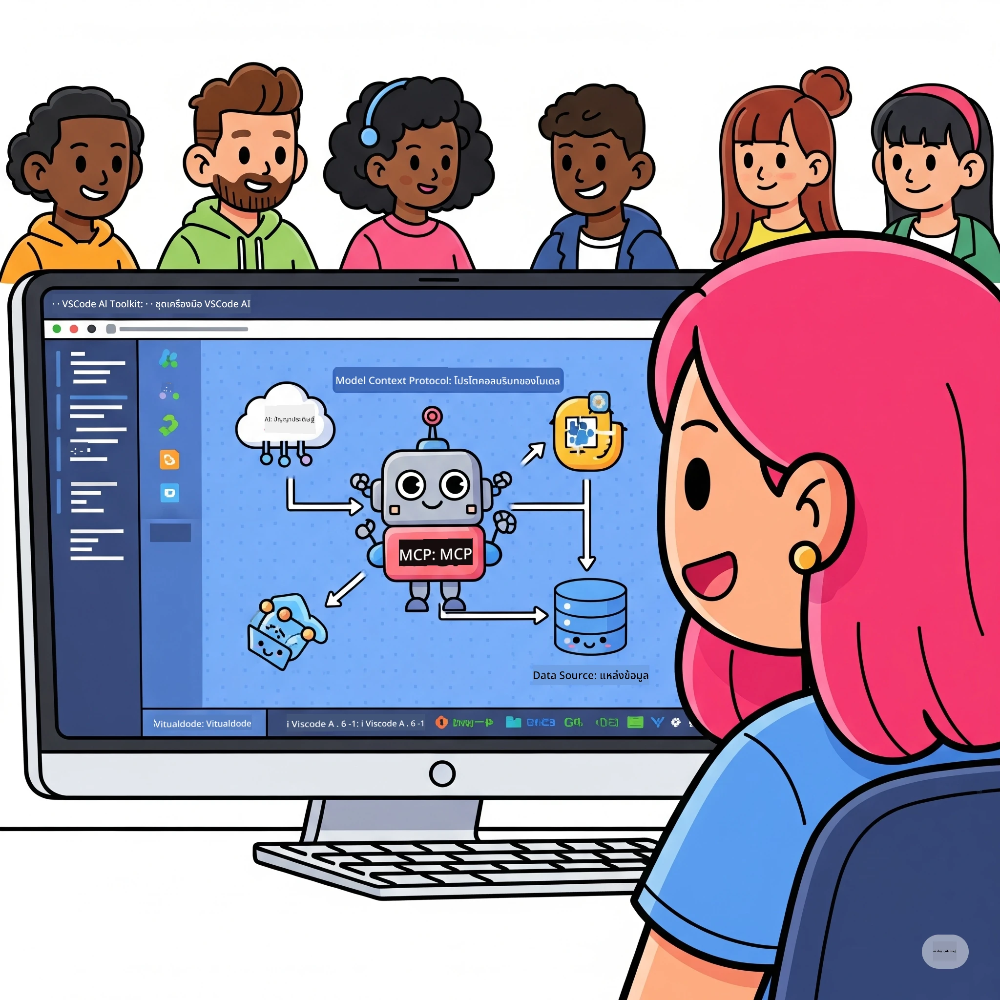
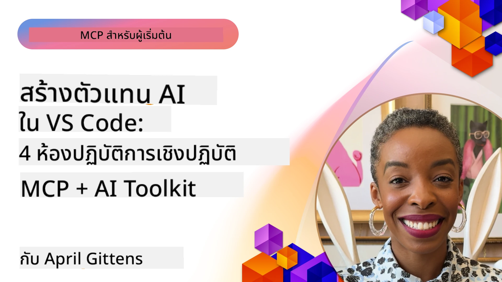

# การปรับปรุงขั้นตอนงาน AI: การสร้างเซิร์ฟเวอร์ MCP ด้วย Microsoft Foundry Toolkit

## 🎯 ภาพรวม

_(คลิกที่ภาพด้านบนเพื่อดูวิดีโอบทเรียนนี)_

ยินดีต้อนรับสู่ **Model Context Protocol (MCP) Workshop**! เวิร์กช็อปแบบลงมือปฏิบัตินี้รวมเทคโนโลยีสองอย่างทันสมัยเพื่อปฏิวัติการพัฒนาแอปพลิเคชัน AI:

> **หมายเหตุความเข้ากันได้:** โค้ดเวิร์กช็อปถูกสร้างและทดสอบด้วย MCP
> `2025-11-25` ตามที่แสดงในตราบนนี้ ใช้
> [สเปคปัจจุบัน `2026-07-28`](https://modelcontextprotocol.io/specification/2026-07-28/)
> สำหรับการใช้งานโปรโตคอลใหม่และตรวจสอบบันทึกการอัปเดต SDK ก่อน
> การย้ายห้องปฏิบัติการ

- **🔗 Model Context Protocol (MCP)**: มาตรฐานเปิดสำหรับการเชื่อมต่อเครื่องมือ AI อย่างไร้รอยต่อ
- **🛠️ ส่วนขยาย Microsoft Foundry Toolkit สำหรับ VS Code**: ส่วนขยายการพัฒนา AI อันทรงพลังของ Microsoft

### 🎓 สิ่งที่จะได้เรียนรู้

เมื่อจบเวิร์กช็อปนี้ คุณจะชำนาญในการสร้างแอปพลิเคชันอัจฉริยะที่เชื่อมต่อโมเดล AI กับเครื่องมือและบริการในโลกจริง ตั้งแต่การทดสอบอัตโนมัติไปจนถึงการผสานรวม API แบบกำหนดเอง คุณจะได้ทักษะที่ใช้แก้ปัญหาธุรกิจที่ซับซ้อน

## 🏗️ เทคโนโลยีที่ใช้

### 🔌 Model Context Protocol (MCP)

MCP คือ **"USB-C สำหรับ AI"** - มาตรฐานสากลที่เชื่อมโมเดล AI กับเครื่องมือและแหล่งข้อมูลภายนอก

**✨ ฟีเจอร์สำคัญ:**

- 🔄 **การผสานรวมแบบมาตรฐาน**: อินเทอร์เฟซสากลสำหรับการเชื่อมต่อเครื่องมือ AI
- 🏛️ **สถาปัตยกรรมยืดหยุ่น**: เซิร์ฟเวอร์ท้องถิ่นและระยะไกลผ่านการส่ง stdio/SSE
- 🧰 **ระบบนิเวศที่ครบครัน**: เครื่องมือ, ทริกเกอร์, และทรัพยากรในโปรโตคอลเดียว
- 🔒 **พร้อมสำหรับองค์กร**: ความปลอดภัยและความน่าเชื่อถือในตัว

**🎯 ทำไม MCP ถึงสำคัญ:**
เหมือนกับ USB-C ที่ขจัดความยุ่งเหยิงของสายไฟ MCP ขจัดความซับซ้อนของการเชื่อมต่อ AI โปรโตคอลเดียว ความเป็นไปได้ไม่จำกัด

### 🤖 ส่วนขยาย Microsoft Foundry Toolkit สำหรับ VS Code

ส่วนขยายการพัฒนา AI ชั้นนำของ Microsoft ที่เปลี่ยน VS Code ให้เป็นพลังงาน AI

**🚀 ความสามารถหลัก:**

- 📦 **แคตตาล็อกโมเดล**: เข้าถึงโมเดลจาก Azure AI, GitHub, Hugging Face, Ollama
- ⚡ **การอนุมานในเครื่อง**: การทำงาน ONNX บน CPU/GPU/NPU
- 🏗️ **Agent Builder**: การสร้าง AI agent แบบแสดงภาพที่ผสานกับ MCP
- 🎭 **มัลติ-โหมด**: รองรับข้อความ, ภาพ และข้อมูลโครงสร้าง

**💡 ประโยชน์ในการพัฒนา:**

- การเปิดใช้งานโมเดลแบบไม่ต้องตั้งค่า
- วิศวกรรมทริกเกอร์แบบแสดงภาพ
- สนามทดสอบแบบเรียลไทม์
- การผสานเซิร์ฟเวอร์ MCP อย่างไร้รอยต่อ

## 📚 เส้นทางการเรียนรู้

### [🚀 โมดูล 1: พื้นฐาน Microsoft Foundry Toolkit](./lab1/README.md)

**ระยะเวลา**: 15 นาที

- 🛠️ ติดตั้งและกำหนดค่า Microsoft Foundry Toolkit สำหรับ VS Code
- 🗂️ สำรวจแคตตาล็อกโมเดล (มากกว่า 100 โมเดลจาก GitHub, ONNX, OpenAI, Anthropic, Google)
- 🎮 เชี่ยวชาญสนามทดสอบแบบโต้ตอบสำหรับทดสอบโมเดลเรียลไทม์
- 🤖 สร้าง AI agent แรกของคุณด้วย Agent Builder
- 📊 ประเมินประสิทธิภาพโมเดลด้วยเมตริกในตัว (F1, ความเกี่ยวข้อง, ความคล้ายคลึง, ความสอดคล้อง)
- ⚡ เรียนรู้การประมวลผลแบบชุดและความสามารถมัลติ-โหมด

**🎯 ผลลัพธ์การเรียนรู้**: สร้าง AI agent ที่ทำงานได้จริงด้วยความเข้าใจครบถ้วนในความสามารถของ Microsoft Foundry Toolkit

### [🌐 โมดูล 2: MCP กับพื้นฐาน Microsoft Foundry Toolkit](./lab2/README.md)

**ระยะเวลา**: 20 นาที

- 🧠 เชี่ยวชาญสถาปัตยกรรมและแนวคิด Model Context Protocol (MCP)
- 🌐 สำรวจระบบนิเวศเซิร์ฟเวอร์ MCP ของ Microsoft
- 🤖 สร้าง AI agent สำหรับออโตเมชันเบราว์เซอร์โดยใช้ Playwright MCP server
- 🔧 ผสานเซิร์ฟเวอร์ MCP กับ Microsoft Foundry Toolkit Agent Builder
- 📊 กำหนดค่าและทดสอบเครื่องมือ MCP ภายในตัว agent ของคุณ
- 🚀 ส่งออกและปรับใช้ agent ที่ใช้พลังงาน MCP สำหรับการใช้งานจริง

**🎯 ผลลัพธ์การเรียนรู้**: ปรับใช้ AI agent ที่เสริมด้วยเครื่องมือภายนอกผ่าน MCP

### [🔧 โมดูล 3: การพัฒนา MCP ขั้นสูงด้วย Microsoft Foundry Toolkit](./lab3/README.md)

**ระยะเวลา**: 20 นาที

- 💻 สร้างเซิร์ฟเวอร์ MCP แบบกำหนดเองโดยใช้ Microsoft Foundry Toolkit
- 🐍 กำหนดค่าและใช้งาน MCP Python SDK ล่าสุด (v1.9.3)
- 🔍 ตั้งค่าและใช้ MCP Inspector สำหรับดีบัก
- 🛠️ สร้าง Weather MCP Server พร้อมเวิร์กโฟลว์ดีบักมืออาชีพ
- 🧪 ดีบักเซิร์ฟเวอร์ MCP ทั้งในสภาพแวดล้อม Agent Builder และ Inspector

**🎯 ผลลัพธ์การเรียนรู้**: พัฒนาและดีบักเซิร์ฟเวอร์ MCP แบบกำหนดเองด้วยเครื่องมือทันสมัย

### [🐙 โมดูล 4: การพัฒนา MCP แบบปฏิบัติ - เซิร์ฟเวอร์ GitHub Clone แบบกำหนดเอง](./lab4/README.md)

**ระยะเวลา**: 30 นาที

- 🏗️ สร้างเซิร์ฟเวอร์ GitHub Clone MCP สำหรับเวิร์กโฟลว์การพัฒนาจริง
- 🔄 นำการโคลนรีโพซิทอรีแบบชาญฉลาดมาพร้อมการตรวจสอบและจัดการข้อผิดพลาด
- 📁 สร้างการจัดการไดเรกทอรีอัจฉริยะและการผสาน VS Code
- 🤖 ใช้ GitHub Copilot Agent Mode กับเครื่องมือ MCP กำหนดเอง
- 🛡️ ใช้ความน่าเชื่อถือระดับผลิตจริงและความเข้ากันได้ข้ามแพลตฟอร์ม

**🎯 ผลลัพธ์การเรียนรู้**: ปรับใช้เซิร์ฟเวอร์ MCP ที่พร้อมสำหรับการผลิตเพื่อปรับปรุงเวิร์กโฟลว์การพัฒนาจริง

## 💡 การใช้งานและผลกระทบในโลกจริง

### 🏢 กรณีใช้งานองค์กร

#### 🔄 การอัตโนมัติ DevOps

ปรับเปลี่ยนเวิร์กโฟลว์การพัฒนาด้วยการอัตโนมัติอัจฉริยะ:

- **การจัดการรีโพซิทอรีอัจฉริยะ**: ทบทวนโค้ดและตัดสินใจรวมโดย AI
- **CI/CD อัจฉริยะ**: ปรับแต่งสายงานอัตโนมัติตามการเปลี่ยนแปลงโค้ด
- **การจัดลำดับปัญหา**: การจำแนกและมอบหมายบั๊กอัตโนมัติ

#### 🧪 การปฏิวัติประกันคุณภาพ

ยกระดับการทดสอบด้วยการอัตโนมัติที่ใช้ AI:

- **การสร้างชุดทดสอบอัจฉริยะ**: สร้างชุดทดสอบครบถ้วนโดยอัตโนมัติ
- **การทดสอบภาพแบบถดถอย**: ตรวจจับการเปลี่ยนแปลง UI โดยใช้ AI
- **การตรวจสอบประสิทธิภาพ**: ตรวจจับและแก้ไขปัญหาเชิงรุก

#### 📊 ความชาญฉลาดในสายงานข้อมูล

สร้างเวิร์กโฟลว์การประมวลผลข้อมูลที่ชาญฉลาดขึ้น:

- **กระบวนการ ETL ปรับตัวได้**: การแปลงข้อมูลที่ปรับแต่งตัวเอง
- **การตรวจจับความผิดปกติ**: การตรวจสอบคุณภาพข้อมูลแบบเรียลไทม์
- **การเดินทางข้อมูลอัจฉริยะ**: การจัดการการไหลของข้อมูลแบบชาญฉลาด

#### 🎧 การปรับปรุงประสบการณ์ลูกค้า

สร้างการติดต่อกับลูกค้าที่โดดเด่น:

- **การสนับสนุนที่รู้บริบท**: AI agent ที่เข้าถึงประวัติลูกค้า
- **การแก้ไขปัญหาเชิงรุก**: บริการลูกค้าที่ทำนายล่วงหน้าได้
- **การผสานหลายช่องทาง**: ประสบการณ์ AI เดียวกันบนหลายแพลตฟอร์ม

## 🛠️ ข้อกำหนดล่วงหน้าและการตั้งค่า

### 💻 ความต้องการระบบ

| ส่วนประกอบ | ความต้องการ | หมายเหตุ |
|-----------|-------------|-------|
| **ระบบปฏิบัติการ** | Windows 10+, macOS 10.15+, Linux | ระบบปฏิบัติการที่ทันสมัยใดก็ได้ |
| **Visual Studio Code** | เวอร์ชันเสถียรล่าสุด | จำเป็นสำหรับ Microsoft Foundry Toolkit |
| **Node.js** | v18.0+ และ npm | สำหรับการพัฒนาเซิร์ฟเวอร์ MCP |
| **Python** | 3.10+ | ตัวเลือกสำหรับเซิร์ฟเวอร์ MCP แบบ Python |
| **หน่วยความจำ** | RAM 8GB ขั้นต่ำ | แนะนำ 16GB สำหรับโมเดลท้องถิ่น |

### 🔧 สภาพแวดล้อมการพัฒนา

#### ส่วนขยาย VS Code ที่แนะนำ

- **Microsoft Foundry Toolkit** (ms-windows-ai-studio.windows-ai-studio)
- **Python** (ms-python.python)
- **Python Debugger** (ms-python.debugpy)
- **GitHub Copilot** (GitHub.copilot) - ตัวเลือกแต่ช่วยได้

#### เครื่องมือเสริมตัวเลือก

- **uv**: ตัวจัดการแพ็กเกจ Python ยุคใหม่
- **MCP Inspector**: เครื่องมือดีบักแบบแสดงภาพสำหรับเซิร์ฟเวอร์ MCP
- **Playwright**: สำหรับตัวอย่างการออโตเมชันเว็บ

## 🎖️ ผลลัพธ์การเรียนรู้และเส้นทางการรับรอง

### 🏆 รายการตรวจสอบความชำนาญทักษะ

โดยการทำเวิร์กช็อปนี้เสร็จ คุณจะมีความชำนาญใน:

#### 🎯 ทักษะหลัก

- [ ] **ความชำนาญโปรโตคอล MCP**: ความเข้าใจลึกซึ้งสถาปัตยกรรมและรูปแบบการใช้งาน
- [ ] **ความชำนาญ Microsoft Foundry Toolkit**: การใช้ Microsoft Foundry Toolkit ขั้นสูงสำหรับการพัฒนาอย่างรวดเร็ว
- [ ] **การพัฒนาเซิร์ฟเวอร์แบบกำหนดเอง**: สร้าง ปรับใช้ และดูแลเซิร์ฟเวอร์ MCP สำหรับการผลิต
- [ ] **การเชื่อมต่อเครื่องมืออย่างยอดเยี่ยม**: เชื่อม AI กับเวิร์กโฟลว์การพัฒนาที่มีอยู่ได้อย่างไร้รอยต่อ
- [ ] **การประยุกต์ใช้แก้ปัญหา**: นำทักษะที่เรียนรู้ไปใช้แก้ปัญหาธุรกิจจริง

#### 🔧 ทักษะทางเทคนิค

- [ ] ตั้งค่าและกำหนดค่า Microsoft Foundry Toolkit ใน VS Code
- [ ] ออกแบบและพัฒนาเซิร์ฟเวอร์ MCP แบบกำหนดเอง
- [ ] ผสานโมเดล GitHub กับสถาปัตยกรรม MCP
- [ ] สร้างเวิร์กโฟลว์ทดสอบอัตโนมัติด้วย Playwright
- [ ] ปรับใช้ AI agent สำหรับการใช้งานจริง
- [ ] ดีบักและเพิ่มประสิทธิภาพเซิร์ฟเวอร์ MCP

#### 🚀 ความสามารถขั้นสูง

- [ ] ออกแบบสถาปัตยกรรมการรวม AI ระดับองค์กร
- [ ] ใช้มาตรฐานความปลอดภัยที่ดีที่สุดสำหรับแอปพลิเคชัน AI
- [ ] ออกแบบสถาปัตยกรรมเซิร์ฟเวอร์ MCP ที่ปรับขนาดได้
- [ ] สร้างชุดเครื่องมือกำหนดเองสำหรับโดเมนเฉพาะ
- [ ] เป็นที่ปรึกษาสำหรับการพัฒนา AI ลูกผสม

## 📖 แหล่งข้อมูลเพิ่มเติม

- [MCP Specification (2026-07-28)](https://modelcontextprotocol.io/specification/2026-07-28/)
- [Microsoft Foundry Toolkit GitHub Repository](https://github.com/microsoft/vscode-ai-toolkit)
- [Sample MCP Servers Collection](https://github.com/modelcontextprotocol/servers)
- [Best Practices Guide](https://modelcontextprotocol.io/docs/best-practices)
- [OWASP MCP Top 10](https://microsoft.github.io/mcp-azure-security-guide/mcp/) - แนวทางการรักษาความปลอดภัยที่ดีที่สุด

---

**🚀 พร้อมที่จะปฏิวัติขั้นตอนการพัฒนา AI ของคุณหรือยัง?**

มาร่วมกันสร้างอนาคตของแอปพลิเคชันอัจฉริยะด้วย MCP และ Microsoft Foundry Toolkit!

## ต่อไปคืออะไร

ไปที่: [โมดูล 11: ห้องปฏิบัติการ MCP Server Hands-On](../11-MCPServerHandsOnLabs/README.md)

---

<!-- CO-OP TRANSLATOR DISCLAIMER START -->
**ปฏิเสธความรับผิดชอบ**:
เอกสารนี้ได้รับการแปลโดยใช้บริการแปลภาษา AI [Co-op Translator](https://github.com/Azure/co-op-translator) ขณะที่เราพยายามให้ความถูกต้อง โปรดทราบว่าการแปลโดยอัตโนมัติอาจมีข้อผิดพลาดหรือความไม่ถูกต้อง เอกสารต้นฉบับในภาษาต้นทางควรถูกพิจารณาเป็นแหล่งข้อมูลที่เชื่อถือได้ สำหรับข้อมูลที่สำคัญ แนะนำให้ใช้การแปลโดยมนุษย์มืออาชีพ เราไม่รับผิดชอบต่อความเข้าใจผิดหรือการตีความที่ผิดพลาดที่เกิดขึ้นจากการใช้การแปลนี้
<!-- CO-OP TRANSLATOR DISCLAIMER END -->