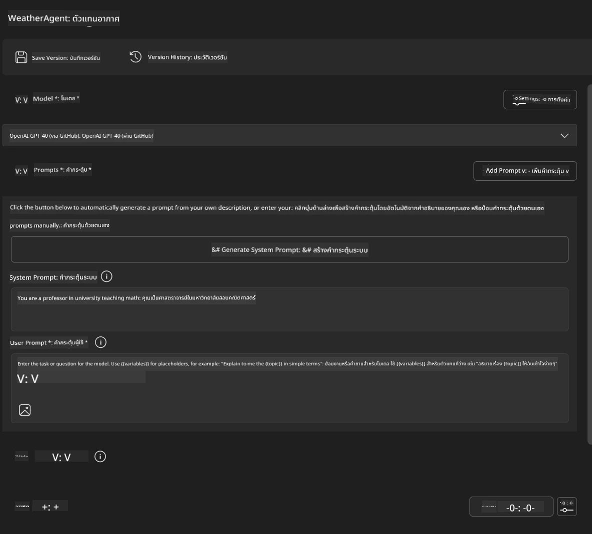
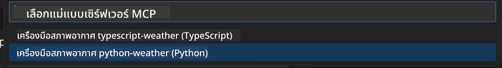
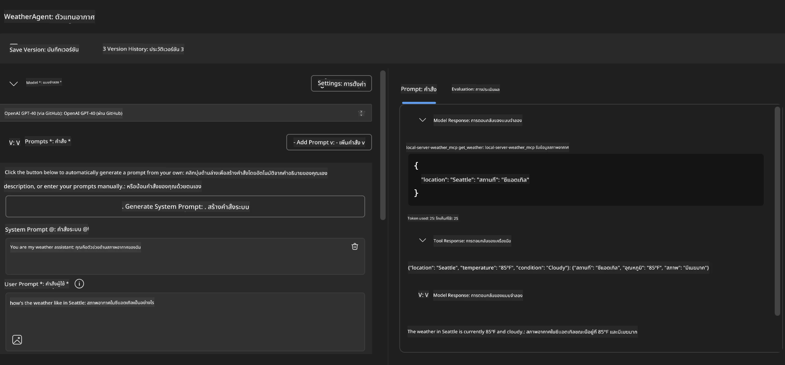
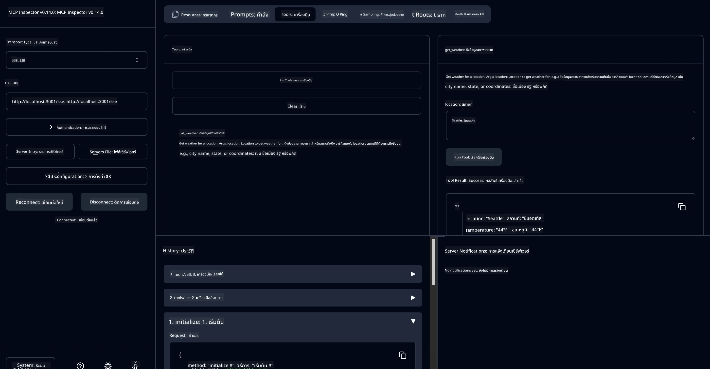

# 🔧 โมดูล 3: การพัฒนา MCP ขั้นสูงด้วย Microsoft Foundry Toolkit

> [!NOTE]
> URL ของ Inspector ในห้องทดลองนี้ใช้จุดสิ้นสุดแบบเก่า `/sse` และกำหนดเป้าหมายไปที่
> การพึ่งพา MCP SDK `1.9.3` และ Inspector `0.14.0` ที่ตรึงไว้ พวกนี้ไม่ใช่
> ตัวอย่าง Streamable HTTP เวอร์ชันล่าสุด `2026-07-28`


## 🎯 วัตถุประสงค์การเรียนรู้

เมื่อจบห้องทดลองนี้ คุณจะสามารถ:

- ✅ สร้างเซิร์ฟเวอร์ MCP แบบกำหนดเองโดยใช้ Microsoft Foundry Toolkit
- ✅ กำหนดค่าและใช้งาน MCP Python SDK เวอร์ชันล่าสุด (v1.9.3)
- ✅ ตั้งค่าและใช้งาน MCP Inspector เพื่อการดีบัก
- ✅ ดีบักเซิร์ฟเวอร์ MCP ในสภาพแวดล้อมทั้ง Agent Builder และ Inspector
- ✅ เข้าใจกระบวนการพัฒนาเซิร์ฟเวอร์ MCP ขั้นสูง

## 📋 ข้อกำหนดเบื้องต้น

- การทำห้องทดลอง 2 (พื้นฐาน MCP) ให้เสร็จสมบูรณ์
- VS Code ที่ติดตั้งส่วนขยาย Microsoft Foundry Toolkit
- สภาพแวดล้อม Python 3.10 ขึ้นไป
- Node.js และ npm สำหรับการตั้งค่า Inspector

## 🏗️ สิ่งที่คุณจะสร้าง

ในห้องทดลองนี้คุณจะสร้าง **Weather MCP Server** ที่แสดง:
- การพัฒนาเซิร์ฟเวอร์ MCP แบบกำหนดเอง
- การบูรณาการกับ Microsoft Foundry Toolkit Agent Builder
- กระบวนการดีบักระดับมืออาชีพ
- รูปแบบการใช้งาน MCP SDK ที่ทันสมัย

---

## 🔧 ภาพรวมส่วนประกอบหลัก

### 🐍 MCP Python SDK
Model Context Protocol Python SDK เป็นพื้นฐานสำหรับการสร้างเซิร์ฟเวอร์ MCP แบบกำหนดเอง คุณจะใช้เวอร์ชัน 1.9.3 ที่มีความสามารถดีบักที่เพิ่มขึ้น

### 🔍 MCP Inspector
เครื่องมือดีบักทรงพลังที่ให้:
- การตรวจสอบเซิร์ฟเวอร์แบบเรียลไทม์
- การแสดงภาพการทำงานของเครื่องมือ
- การตรวจสอบคำขอและการตอบสนองเครือข่าย
- สภาพแวดล้อมทดสอบแบบโต้ตอบ

---

## 📖 การดำเนินการทีละขั้นตอน

### ขั้นตอนที่ 1: สร้าง WeatherAgent ใน Agent Builder

1. **เปิด Agent Builder** ใน VS Code ผ่านส่วนขยาย Microsoft Foundry Toolkit
2. **สร้าง agent ใหม่** ด้วยการตั้งค่าดังนี้:
   - ชื่อ Agent: `WeatherAgent`



### ขั้นตอนที่ 2: เริ่มโครงการ MCP Server

1. **ไปที่ Tools** → **Add Tool** ใน Agent Builder
2. **เลือก "MCP Server"** จากตัวเลือกที่มี
3. **เลือก "Create A new MCP Server"**
4. **เลือกเทมเพลต `python-weather`**
5. **ตั้งชื่อเซิร์ฟเวอร์ของคุณ:** `weather_mcp`



### ขั้นตอนที่ 3: เปิดและตรวจสอบโครงการ

1. **เปิดโครงการที่สร้างขึ้น** ใน VS Code
2. **ตรวจสอบโครงสร้างของโครงการ:**
   ```
   weather_mcp/
   ├── src/
   │   ├── __init__.py
   │   └── server.py
   ├── inspector/
   │   ├── package.json
   │   └── package-lock.json
   ├── .vscode/
   │   ├── launch.json
   │   └── tasks.json
   ├── pyproject.toml
   └── README.md
   ```

### ขั้นตอนที่ 4: อัปเกรดเป็น MCP SDK เวอร์ชันล่าสุด

> **🔍 ทำไมต้องอัปเกรด?** เราต้องการใช้ MCP SDK เวอร์ชันล่าสุด (v1.9.3) และบริการ Inspector (0.14.0) เพื่อฟีเจอร์ที่เหนือกว่าและความสามารถในการดีบักที่ดียิ่งขึ้น

#### 4a. อัปเดต Dependencies ของ Python

**แก้ไขไฟล์ `pyproject.toml`:** อัปเดต [./code/weather_mcp/pyproject.toml](../../../../10-StreamliningAIWorkflowsBuildingAnMCPServerWithAIToolkit/lab3/code/weather_mcp/pyproject.toml)


#### 4b. อัปเดตการกำหนดค่าของ Inspector

**แก้ไขไฟล์ `inspector/package.json`:** อัปเดต [./code/weather_mcp/inspector/package.json](../../../../10-StreamliningAIWorkflowsBuildingAnMCPServerWithAIToolkit/lab3/code/weather_mcp/inspector/package.json)

#### 4c. อัปเดต Dependencies ของ Inspector

**แก้ไขไฟล์ `inspector/package-lock.json`:** อัปเดต [./code/weather_mcp/inspector/package-lock.json](../../../../10-StreamliningAIWorkflowsBuildingAnMCPServerWithAIToolkit/lab3/code/weather_mcp/inspector/package-lock.json)

> **📝 หมายเหตุ:** ไฟล์นี้มีการกำหนด dependencies อย่างละเอียด ด้านล่างนี้เป็นโครงสร้างสำคัญ - เนื้อหาทั้งหมดเพื่อให้การแก้ปัญหา dependencies ถูกต้อง


> **⚡ แพ็คเกจล็อกเต็มรูปแบบ:** ไฟล์ package-lock.json ทั้งหมดมีประมาณ 3000 บรรทัดของการกำหนด dependencies ด้านบนแสดงโครงสร้างหลัก - ใช้ไฟล์ที่ให้มาเพื่อการแก้ปัญหาที่ครบถ้วน

### ขั้นตอนที่ 5: กำหนดค่าการดีบักใน VS Code

*หมายเหตุ: กรุณาคัดลอกไฟล์ในเส้นทางที่ระบุเพื่อแทนที่ไฟล์ในเครื่องที่เกี่ยวข้อง*

#### 5a. อัปเดตการกำหนดค่า Launch

**แก้ไข `.vscode/launch.json`:**

```json
{
  "version": "0.2.0",
  "configurations": [
    {
      "name": "Attach to Local MCP",
      "type": "debugpy",
      "request": "attach",
      "connect": {
        "host": "localhost",
        "port": 5678
      },
      "presentation": {
        "hidden": true
      },
      "internalConsoleOptions": "neverOpen",
      "postDebugTask": "Terminate All Tasks"
    },
    {
      "name": "Launch Inspector (Edge)",
      "type": "msedge",
      "request": "launch",
      "url": "http://localhost:6274?timeout=60000&serverUrl=http://localhost:3001/sse#tools",
      "cascadeTerminateToConfigurations": [
        "Attach to Local MCP"
      ],
      "presentation": {
        "hidden": true
      },
      "internalConsoleOptions": "neverOpen"
    },
    {
      "name": "Launch Inspector (Chrome)",
      "type": "chrome",
      "request": "launch",
      "url": "http://localhost:6274?timeout=60000&serverUrl=http://localhost:3001/sse#tools",
      "cascadeTerminateToConfigurations": [
        "Attach to Local MCP"
      ],
      "presentation": {
        "hidden": true
      },
      "internalConsoleOptions": "neverOpen"
    }
  ],
  "compounds": [
    {
      "name": "Debug in Agent Builder",
      "configurations": [
        "Attach to Local MCP"
      ],
      "preLaunchTask": "Open Agent Builder",
    },
    {
      "name": "Debug in Inspector (Edge)",
      "configurations": [
        "Launch Inspector (Edge)",
        "Attach to Local MCP"
      ],
      "preLaunchTask": "Start MCP Inspector",
      "stopAll": true
    },
    {
      "name": "Debug in Inspector (Chrome)",
      "configurations": [
        "Launch Inspector (Chrome)",
        "Attach to Local MCP"
      ],
      "preLaunchTask": "Start MCP Inspector",
      "stopAll": true
    }
  ]
}
```

**แก้ไข `.vscode/tasks.json`:**

```
{
  "version": "2.0.0",
  "tasks": [
    {
      "label": "Start MCP Server",
      "type": "shell",
      "command": "python -m debugpy --listen 127.0.0.1:5678 src/__init__.py sse",
      "isBackground": true,
      "options": {
        "cwd": "${workspaceFolder}",
        "env": {
          "PORT": "3001"
        }
      },
      "problemMatcher": {
        "pattern": [
          {
            "regexp": "^.*$",
            "file": 0,
            "location": 1,
            "message": 2
          }
        ],
        "background": {
          "activeOnStart": true,
          "beginsPattern": ".*",
          "endsPattern": "Application startup complete|running"
        }
      }
    },
    {
      "label": "Start MCP Inspector",
      "type": "shell",
      "command": "npm run dev:inspector",
      "isBackground": true,
      "options": {
        "cwd": "${workspaceFolder}/inspector",
        "env": {
          "CLIENT_PORT": "6274",
          "SERVER_PORT": "6277",
        }
      },
      "problemMatcher": {
        "pattern": [
          {
            "regexp": "^.*$",
            "file": 0,
            "location": 1,
            "message": 2
          }
        ],
        "background": {
          "activeOnStart": true,
          "beginsPattern": "Starting MCP inspector",
          "endsPattern": "Proxy server listening on port"
        }
      },
      "dependsOn": [
        "Start MCP Server"
      ]
    },
    {
      "label": "Open Agent Builder",
      "type": "shell",
      "command": "echo ${input:openAgentBuilder}",
      "presentation": {
        "reveal": "never"
      },
      "dependsOn": [
        "Start MCP Server"
      ],
    },
    {
      "label": "Terminate All Tasks",
      "command": "echo ${input:terminate}",
      "type": "shell",
      "problemMatcher": []
    }
  ],
  "inputs": [
    {
      "id": "openAgentBuilder",
      "type": "command",
      "command": "ai-mlstudio.agentBuilder",
      "args": {
        "initialMCPs": [ "local-server-weather_mcp" ],
        "triggeredFrom": "vsc-tasks"
      }
    },
    {
      "id": "terminate",
      "type": "command",
      "command": "workbench.action.tasks.terminate",
      "args": "terminateAll"
    }
  ]
}
```


---

## 🚀 การรันและทดสอบเซิร์ฟเวอร์ MCP ของคุณ

### ขั้นตอนที่ 6: ติดตั้ง Dependencies

หลังจากทำการเปลี่ยนแปลงการกำหนดค่าแล้ว ให้รันคำสั่งต่อไปนี้:

**ติดตั้ง Dependencies ของ Python:**
```bash
uv sync
```

**ติดตั้ง Dependencies ของ Inspector:**
```bash
cd inspector
npm install
```

### ขั้นตอนที่ 7: ดีบักด้วย Agent Builder

1. **กด F5** หรือใช้การกำหนดค่า **"Debug in Agent Builder"**
2. **เลือกการกำหนดค่ารวม** จากแผงดีบัก
3. **รอเซิร์ฟเวอร์เริ่มทำงาน** และ Agent Builder เปิดขึ้น
4. **ทดสอบเซิร์ฟเวอร์ weather MCP ของคุณ** ด้วยคำถามภาษาธรรมชาติ

ตัวอย่างช่องใส่ข้อความ

SYSTEM_PROMPT

```
You are my weather assistant
```

USER_PROMPT

```
How's the weather like in Seattle
```



### ขั้นตอนที่ 8: ดีบักด้วย MCP Inspector

1. **ใช้การกำหนดค่า "Debug in Inspector"** (บน Edge หรือ Chrome)
2. **เปิดอินเทอร์เฟซ Inspector** ที่ `http://localhost:6274`
3. **สำรวจสภาพแวดล้อมทดสอบแบบโต้ตอบ:**
   - ดูเครื่องมือที่มีอยู่
   - ทดสอบการทำงานของเครื่องมือ
   - ตรวจสอบคำขอเครือข่าย
   - ดีบักการตอบสนองจากเซิร์ฟเวอร์



---

## 🎯 ผลการเรียนรู้หลัก

เมื่อทำห้องทดลองนี้เสร็จ คุณได้:

- [x] **สร้างเซิร์ฟเวอร์ MCP แบบกำหนดเอง** โดยใช้เทมเพลต Microsoft Foundry Toolkit
- [x] **อัปเกรดเป็น MCP SDK รุ่นล่าสุด** (v1.9.3) เพื่อฟังก์ชันที่เหนือกว่า
- [x] **กำหนดค่ากระบวนการดีบักระดับมืออาชีพ** ทั้งใน Agent Builder และ Inspector
- [x] **ตั้งค่า MCP Inspector** เพื่อการทดสอบเซิร์ฟเวอร์แบบโต้ตอบ
- [x] **เชี่ยวชาญการกำหนดค่าการดีบักใน VS Code** สำหรับการพัฒนา MCP

## 🔧 ฟีเจอร์ขั้นสูงที่ได้สำรวจ

| ฟีเจอร์ | คำอธิบาย | กรณีการใช้งาน |
|---------|-------------|----------|
| **MCP Python SDK v1.9.3** | การใช้งานโปรโตคอลล่าสุด | การพัฒนาเซิร์ฟเวอร์สมัยใหม่ |
| **MCP Inspector 0.14.0** | เครื่องมือดีบักแบบโต้ตอบ | การทดสอบเซิร์ฟเวอร์แบบเรียลไทม์ |
| **VS Code Debugging** | สภาพแวดล้อมการพัฒนาแบบรวม | กระบวนการดีบักระดับมืออาชีพ |
| **Agent Builder Integration** | การเชื่อมต่อโดยตรงกับ Microsoft Foundry Toolkit | การทดสอบ agent ครบวงจร |

## 📚 แหล่งข้อมูลเพิ่มเติม

- [เอกสาร MCP Python SDK](https://modelcontextprotocol.io/docs/sdk/python)
- [คู่มือส่วนขยาย Microsoft Foundry Toolkit](https://code.visualstudio.com/docs/ai/ai-toolkit)
- [เอกสารการดีบัก VS Code](https://code.visualstudio.com/docs/editor/debugging)
- [ข้อกำหนด Model Context Protocol](https://modelcontextprotocol.io/docs/concepts/architecture)

---

**🎉 ยินดีด้วย!** คุณได้ทำห้องทดลอง 3 เสร็จสมบูรณ์แล้ว และสามารถสร้าง ดีบัก และปรับใช้เซิร์ฟเวอร์ MCP แบบกำหนดเองโดยใช้กระบวนการพัฒนาระดับมืออาชีพ

### 🔜 ดำเนินการต่อไปยังโมดูลถัดไป

พร้อมที่จะประยุกต์ใช้ทักษะ MCP ของคุณกับกระบวนการพัฒนาจริงหรือยัง? ดำเนินไปที่ **[โมดูล 4: การพัฒนา MCP ในทางปฏิบัติ - เซิร์ฟเวอร์โคลน GitHub แบบกำหนดเอง](../lab4/README.md)** ที่คุณจะได้:
- สร้างเซิร์ฟเวอร์ MCP พร้อมใช้งานจริงที่ช่วยอัตโนมัติการจัดการ repository ใน GitHub
- พัฒนาฟังก์ชันการโคลน repository GitHub ผ่าน MCP
- รวมเซิร์ฟเวอร์ MCP แบบกำหนดเองกับ VS Code และโหมด GitHub Copilot Agent
- ทดสอบและปรับใช้เซิร์ฟเวอร์ MCP แบบกำหนดเองในสภาพแวดล้อมจริง
- เรียนรู้การทำงานอัตโนมัติที่ใช้งานได้จริงสำหรับนักพัฒนา

---

<!-- CO-OP TRANSLATOR DISCLAIMER START -->
**ปฏิเสธความรับผิดชอบ**:
เอกสารนี้ได้รับการแปลโดยใช้บริการแปลภาษา AI [Co-op Translator](https://github.com/Azure/co-op-translator) ขณะที่เราพยายามให้ความถูกต้อง โปรดทราบว่าการแปลโดยอัตโนมัติอาจมีข้อผิดพลาดหรือความไม่ถูกต้อง เอกสารต้นฉบับในภาษาต้นทางควรถูกพิจารณาเป็นแหล่งข้อมูลที่เชื่อถือได้ สำหรับข้อมูลที่สำคัญ แนะนำให้ใช้การแปลโดยมนุษย์มืออาชีพ เราไม่รับผิดชอบต่อความเข้าใจผิดหรือการตีความที่ผิดพลาดที่เกิดขึ้นจากการใช้การแปลนี้
<!-- CO-OP TRANSLATOR DISCLAIMER END -->