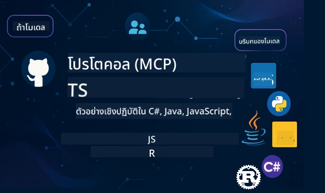

 

[](https://GitHub.com/microsoft/mcp-for-beginners/graphs/contributors)
[](https://GitHub.com/microsoft/mcp-for-beginners/issues)
[](https://GitHub.com/microsoft/mcp-for-beginners/pulls)
[](http://makeapullrequest.com)

[](https://GitHub.com/microsoft/mcp-for-beginners/watchers)
[](https://GitHub.com/microsoft/mcp-for-beginners/fork)
[](https://GitHub.com/microsoft/mcp-for-beginners/stargazers)


[](https://discord.gg/nTYy5BXMWG)

ทำตามขั้นตอนเหล่านี้เพื่อเริ่มต้นใช้ทรัพยากรเหล่านี้:
1. **แยกที่เก็บข้อมูล (Fork the Repository)**: คลิก [](https://GitHub.com/microsoft/mcp-for-beginners/fork)
2. **โคลนที่เก็บข้อมูล (Clone the Repository)**:   `git clone https://github.com/microsoft/mcp-for-beginners.git`
3. **เข้าร่วม** [](https://discord.gg/nTYy5BXMWG)


### 🌐 การสนับสนุนหลายภาษา

#### รองรับผ่าน GitHub Action (อัตโนมัติ & อัปเดตเสมอ)

<!-- CO-OP TRANSLATOR LANGUAGES TABLE START -->
[Arabic](../ar/README.md) | [Bengali](../bn/README.md) | [Bulgarian](../bg/README.md) | [Burmese (Myanmar)](../my/README.md) | [Chinese (Simplified)](../zh-CN/README.md) | [Chinese (Traditional, Hong Kong)](../zh-HK/README.md) | [Chinese (Traditional, Macau)](../zh-MO/README.md) | [Chinese (Traditional, Taiwan)](../zh-TW/README.md) | [Croatian](../hr/README.md) | [Czech](../cs/README.md) | [Danish](../da/README.md) | [Dutch](../nl/README.md) | [Estonian](../et/README.md) | [Finnish](../fi/README.md) | [French](../fr/README.md) | [German](../de/README.md) | [Greek](../el/README.md) | [Hebrew](../he/README.md) | [Hindi](../hi/README.md) | [Hungarian](../hu/README.md) | [Indonesian](../id/README.md) | [Italian](../it/README.md) | [Japanese](../ja/README.md) | [Kannada](../kn/README.md) | [Korean](../ko/README.md) | [Lithuanian](../lt/README.md) | [Malay](../ms/README.md) | [Malayalam](../ml/README.md) | [Marathi](../mr/README.md) | [Nepali](../ne/README.md) | [Nigerian Pidgin](../pcm/README.md) | [Norwegian](../no/README.md) | [Persian (Farsi)](../fa/README.md) | [Polish](../pl/README.md) | [Portuguese (Brazil)](../pt-BR/README.md) | [Portuguese (Portugal)](../pt-PT/README.md) | [Punjabi (Gurmukhi)](../pa/README.md) | [Romanian](../ro/README.md) | [Russian](../ru/README.md) | [Serbian (Cyrillic)](../sr/README.md) | [Slovak](../sk/README.md) | [Slovenian](../sl/README.md) | [Spanish](../es/README.md) | [Swahili](../sw/README.md) | [Swedish](../sv/README.md) | [Tagalog (Filipino)](../tl/README.md) | [Tamil](../ta/README.md) | [Telugu](../te/README.md) | [Thai](./README.md) | [Turkish](../tr/README.md) | [Ukrainian](../uk/README.md) | [Urdu](../ur/README.md) | [Vietnamese](../vi/README.md)

> **ชอบโคลนแบบโลคัล?**

> ที่เก็บข้อมูลนี้มีการแปลภาษา 50+ ภาษา ซึ่งจะเพิ่มขนาดการดาวน์โหลดอย่างมาก หากต้องการโคลนโดยไม่รวมการแปล ให้ใช้ sparse checkout:
> ```bash
> git clone --filter=blob:none --sparse https://github.com/microsoft/mcp-for-beginners.git
> cd mcp-for-beginners
> git sparse-checkout set --no-cone '/*' '!translations' '!translated_images'
> ```
> วิธีนี้จะให้ทุกอย่างที่คุณต้องการเพื่อทำคอร์สเสร็จด้วยการดาวน์โหลดที่เร็วขึ้นมาก
<!-- CO-OP TRANSLATOR LANGUAGES TABLE END -->

# 🚀 หลักสูตร Model Context Protocol (MCP) สำหรับผู้เริ่มต้น

## **เรียนรู้ MCP พร้อมตัวอย่างโค้ดจริงใน C#, Java, JavaScript, Rust, Python, และ TypeScript**

## 🧠 ภาพรวมของหลักสูตร Model Context Protocol
ยินดีต้อนรับสู่การเดินทางของคุณใน Model Context Protocol! หากคุณสงสัยว่าทำไมแอป AI จึงสื่อสารกับเครื่องมือและบริการต่าง ๆ ได้อย่างไร ตอนนี้คุณกำลังจะได้ค้นพบโซลูชันอันสวยงามที่กำลังเปลี่ยนแปลงวิธีที่นักพัฒนาสร้างระบบอัจฉริยะ

ให้คิดว่า MCP เป็นตัวแปลสากลสำหรับแอป AI — เหมือนกับพอร์ต USB ที่ช่วยให้คุณเชื่อมต่ออุปกรณ์ใด ๆ กับคอมพิวเตอร์ได้ MCP ช่วยให้โมเดล AI เชื่อมต่อกับเครื่องมือหรือบริการใด ๆ ได้อย่างเป็นมาตรฐาน ไม่ว่าคุณจะสร้างแชทบอทตัวแรกของคุณหรือทำงานกับเวิร์กโฟลว์ AI ที่ซับซ้อน การเข้าใจ MCP จะทำให้คุณสามารถสร้างแอปที่ทรงพลังและยืดหยุ่นมากขึ้น

หลักสูตรนี้ถูกออกแบบด้วยความอดทนและเอาใจใส่ต่อการเรียนรู้ของคุณ เราจะเริ่มจากแนวคิดง่าย ๆ ที่คุณเข้าใจอยู่แล้ว และค่อย ๆ เพิ่มพูนความชำนาญผ่านการฝึกปฏิบัติในภาษาที่คุณชื่นชอบ ทุกขั้นตอนมีคำอธิบายชัดเจน ตัวอย่างใช้งานจริง และกำลังใจมากมายระหว่างทาง

เมื่อเสร็จสิ้นการเดินทางนี้ คุณจะมีความมั่นใจในการสร้างเซิร์ฟเวอร์ MCP ของคุณเอง รวมถึงผสานรวมกับแพลตฟอร์ม AI ยอดนิยม และเข้าใจเทคโนโลยีนี้ที่กำลังเปลี่ยนแปลงอนาคตของการพัฒนา AI มาเริ่มผจญภัยที่น่าตื่นเต้นนี้ไปด้วยกัน!

### เอกสารและข้อกำหนดทางการ

ทรัพยากรเหล่านี้จะมีคุณค่าเพิ่มขึ้นตามความเข้าใจของคุณ แต่ไม่ต้องรู้สึกกดดันที่จะอ่านทั้งหมดทันที เริ่มต้นด้วยส่วนที่คุณสนใจมากที่สุด!
- 📘 [เอกสาร MCP](https://modelcontextprotocol.io/) – นี่คือแหล่งข้อมูลอ้างอิงสำหรับบทแนะนำทีละขั้นตอนและคู่มือผู้ใช้ เอกสารถูกเขียนโดยคำนึงถึงผู้เริ่มต้น พร้อมตัวอย่างชัดเจนที่คุณสามารถติดตามด้วยตัวเองได้อย่างสบาย ๆ
- 📜 [ข้อกำหนด MCP](https://modelcontextprotocol.io/docs/) – คิดว่านี่เป็นคู่มืออ้างอิงที่ครอบคลุม เมื่อคุณเรียนหลักสูตรนี้ คุณจะกลับมาดูรายละเอียดเฉพาะเจาะจงและสำรวจฟีเจอร์ขั้นสูง
- 📜 [ข้อกำหนด MCP ดั้งเดิม](https://modelcontextprotocol.io/specification/versioning) – มีรายละเอียดทางเทคนิคเพิ่มเติมที่เป็นประโยชน์สำหรับการใช้งานขั้นสูง มีไว้เมื่อคุณต้องการ แต่ไม่ต้องกังวลในช่วงเริ่มต้น
- 🧑‍💻 [ที่เก็บ MCP บน GitHub](https://github.com/modelcontextprotocol) – คุณจะพบ SDKs เครื่องมือ และตัวอย่างโค้ดในหลายภาษาโปรแกรม มันเป็นเหมือนคลังสมบัติของตัวอย่างใช้งานจริงและส่วนประกอบพร้อมใช้
- 🌐 [ชุมชน MCP](https://github.com/orgs/modelcontextprotocol/discussions) – เข้าร่วมกับผู้เรียนและนักพัฒนาที่มีประสบการณ์ในการอภิปรายเกี่ยวกับ MCP เป็นชุมชนที่ให้การสนับสนุน พร้อมต้อนรับคำถามและแลกเปลี่ยนความรู้กันอย่างอิสระ
  
## วัตถุประสงค์การเรียนรู้

เมื่อคุณเรียนจบหลักสูตรนี้ คุณจะรู้สึกมั่นใจและตื่นเต้นกับความสามารถใหม่ ๆ ของคุณ ดังนี้คือสิ่งที่คุณจะบรรลุ:

• **เข้าใจพื้นฐาน MCP**: คุณจะเข้าใจว่า Model Context Protocol คืออะไรและทำไมมันถึงปฏิวัติวิธีที่แอป AI ทำงานร่วมกัน โดยใช้การเปรียบเทียบและตัวอย่างที่เข้าใจง่าย

• **สร้างเซิร์ฟเวอร์ MCP ตัวแรกของคุณ**: คุณจะสร้างเซิร์ฟเวอร์ MCP ที่ใช้งานได้จริงในภาษาที่คุณชื่นชอบ เริ่มจากตัวอย่างง่าย ๆ และเพิ่มทักษะทีละขั้น

• **เชื่อมต่อโมเดล AI กับเครื่องมือจริง**: คุณจะเรียนรู้วิธีเชื่อมการทำงานระหว่างโมเดล AI กับบริการจริง ช่วยให้แอปของคุณมีความสามารถใหม่ที่ทรงพลัง

• **ดำเนินการตามแนวปฏิบัติด้านความปลอดภัย**: คุณจะเข้าใจวิธีปกป้องการใช้งาน MCP ของคุณให้ปลอดภัย ปกป้องแอปและผู้ใช้ของคุณ

• **ปรับใช้อย่างมั่นใจ**: คุณจะรู้วิธีนำโปรเจกต์ MCP จากการพัฒนาเข้าสู่ระบบจริง พร้อมกลยุทธ์การดาวน์โหลดที่ทำงานได้จริง

• **เข้าร่วมชุมชน MCP**: คุณจะเป็นส่วนหนึ่งของชุมชนนักพัฒนาที่กำลังเติบโต ที่ร่วมกันสร้างอนาคตการพัฒนาแอป AI

## ความรู้พื้นฐานที่จำเป็น

ก่อนที่เราจะเจาะลึก MCP มาทำความเข้าใจกับพื้นฐานบางอย่างกันก่อน ไม่ต้องกังวลหากคุณไม่เชี่ยวชาญด้านนี้ — เราจะอธิบายทุกอย่างที่คุณต้องรู้ไปพร้อมกัน!

### การเข้าใจโปรโตคอล (รากฐาน)

คิดว่าโปรโตคอลเหมือนกฎกติกาสำหรับการสนทนา เมื่อคุณโทรหาคุณเพื่อน คุณทั้งคู่รู้ว่าต้องพูดว่า "สวัสดี" เมื่อรับสาย ผลัดกันพูด และพูดว่า "ลาก่อน" เมื่อจบ โปรแกรมคอมพิวเตอร์ก็ต้องมีกฎเหล่านี้เช่นกันเพื่อสื่อสารอย่างมีประสิทธิภาพ

MCP เป็นโปรโตคอล — ชุดของกฎที่ตกลงร่วมกัน ช่วยให้โมเดล AI และแอปพลิเคชันมี "การสนทนา" ผลิตผลกับเครื่องมือและบริการ เหมือนกับที่มีกฎการสนทนาทำให้คนพูดคุยกันได้ราบรื่น MCP ช่วยให้การสื่อสารของแอป AI มีความน่าเชื่อถือและทรงพลังมากขึ้น

### ความสัมพันธ์ระหว่างลูกค้าและเซิร์ฟเวอร์ (โปรแกรมทำงานร่วมกันอย่างไร)

คุณใช้ความสัมพันธ์ลูกค้า-เซิร์ฟเวอร์ทุกวัน! เมื่อคุณใช้เว็บเบราว์เซอร์ (ลูกค้า) เข้าชมเว็บไซต์ คุณกำลังเชื่อมต่อกับเว็บเซิร์ฟเวอร์ที่ส่งเนื้อหาหน้าเว็บให้ ตัวเบราว์เซอร์รู้วิธีร้องขอข้อมูล และเซิร์ฟเวอร์รู้วิธีตอบกลับ

ใน MCP เราก็มีความสัมพันธ์แบบเดียวกัน: โมเดล AI ทำหน้าที่เป็นลูกค้าที่ร้องขอข้อมูลหรือการกระทำ ในขณะที่เซิร์ฟเวอร์ MCP ให้ความสามารถเหล่านั้นแก่ลูกค้า เหมือนมีผู้ช่วย (เซิร์ฟเวอร์) ที่ AI สามารถถามให้งานอย่างเฉพาะเจาะจงทำได้

### ทำไมการมาตรฐานจึงสำคัญ (ทำให้สิ่งต่าง ๆ ทำงานร่วมกันได้)

ลองนึกภาพถ้าผู้ผลิตรถยนต์แต่ละรายใช้หัวเติมน้ำมันรูปแบบต่างกัน — คุณจะต้องมีอะแดปเตอร์แตกต่างกันสำหรับแต่ละรถ! การมาตรฐานหมายถึงการตกลงกันในแนวทางที่เป็นสากลเพื่อให้สิ่งต่าง ๆ ทำงานร่วมกันอย่างราบรื่น

MCP เป็นมาตรฐานสำหรับแอป AI แทนที่จะต้องเขียนโค้ดเฉพาะสำหรับแต่ละโมเดล AI เพื่อใช้งานกับทุกเครื่องมือ MCP สร้างวิธีสากลในการสื่อสารนี้ หมายความว่านักพัฒนาสามารถสร้างเครื่องมือเพียงครั้งเดียว แล้วใช้งานได้กับ AI หลายระบบ

## 🧭 ภาพรวมเส้นทางการเรียนรู้ของคุณ

การเดินทางด้วย MCP ของคุณถูกออกแบบอย่างพิถีพิถันเพื่อสร้างความมั่นใจและทักษะทีละขั้นตอน แต่ละช่วงเปิดตัวแนวคิดใหม่พร้อมกับเสริมความรู้เดิมที่เรียนมา

### 🌱 ช่วงรากฐาน: ทำความเข้าใจพื้นฐาน (โมดูล 0-2)

นี่คือจุดเริ่มต้นการผจญภัยของคุณ! เราจะแนะนำแนวคิด MCP ด้วยการเปรียบเทียบที่คุ้นเคยและตัวอย่างง่าย ๆ คุณจะเข้าใจว่า MCP คืออะไร ทำไมต้องมี และมันเข้ากับโลกการพัฒนา AI อย่างไร

• **โมดูล 0 - บทนำสู่ MCP**: เราจะเริ่มโดยการสำรวจว่า MCP คืออะไร และทำไมถึงสำคัญสำหรับแอป AI สมัยใหม่ คุณจะได้เห็นตัวอย่างจริงของ MCP ในการใช้งาน และเข้าใจว่ามันแก้ปัญหาธรรมดาที่นักพัฒนาพบได้อย่างไร

• **โมดูล 1 - อธิบายแนวคิดหลัก**: ที่นี่คุณจะเรียนรู้บล็อกพื้นฐานสำคัญของ MCP เราจะใช้การเปรียบเทียบและตัวอย่างภาพมากมายเพื่อให้แนวคิดเหล่านี้ดูเป็นธรรมชาติและเข้าใจง่าย

• **โมดูล 2 - ความปลอดภัยใน MCP**: ความปลอดภัยอาจฟังดูน่ากลัว แต่เราจะแสดงให้เห็นว่า MCP มีฟีเจอร์ความปลอดภัยในตัว พร้อมสอนแนวทางปฏิบัติที่ดีที่สุดเพื่อปกป้องแอปของคุณตั้งแต่ต้น

### 🔨 ช่วงการสร้าง: สร้างการใช้งานของคุณครั้งแรก (โมดูล 3)

ตอนนี้ถึงเวลาสนุกจริง! คุณจะได้ฝึกสร้างเซิร์ฟเวอร์และไคลเอนต์ MCP ด้วยตัวเอง ไม่ต้องกังวล — เราจะเริ่มจากง่าย ๆ และแนะนำทุกขั้นตอน

โมดูลนี้มีไกด์ฝึกปฏิบัติมากมายที่ให้คุณฝึกในภาษาที่คุณชอบ คุณจะสร้างเซิร์ฟเวอร์ตัวแรก สร้างไคลเอนต์เชื่อมต่อ และแม้แต่ผสานรวมกับเครื่องมือพัฒนาอย่าง VS Code.
แต่ละคำแนะนำประกอบด้วยตัวอย่างโค้ดสมบูรณ์ เคล็ดลับการแก้ไขปัญหา และคำอธิบายเหตุผลที่เราเลือกออกแบบในลักษณะเฉพาะ โดยสิ้นสุดขั้นตอนนี้ คุณจะมีการใช้งาน MCP ที่ใช้งานได้จริงซึ่งคุณภูมิใจได้!

### 🚀 ช่วงการเติบโต: แนวคิดขั้นสูงและการใช้งานจริง (โมดูล 4-5)

เมื่อคุณเข้าใจพื้นฐานแล้ว คุณก็พร้อมที่จะสำรวจฟีเจอร์ MCP ที่ซับซ้อนมากขึ้น เราจะครอบคลุมกลยุทธ์การใช้งานจริง เทคนิคการดีบัก และหัวข้อขั้นสูงเช่นการรวม AI แบบหลายมิติ

คุณจะได้เรียนรู้วิธีขยายการใช้งาน MCP ของคุณสำหรับการใช้ในโปรดักชั่น และการรวมกับแพลตฟอร์มคลาวด์อย่าง Azure โมดูลเหล่านี้จะเตรียมความพร้อมให้คุณสร้างโซลูชัน MCP ที่สามารถรองรับความต้องการในโลกจริง

### 🌟 ช่วงความชำนาญ: ชุมชนและความเชี่ยวชาญเฉพาะด้าน (โมดูล 6-11)

ช่วงสุดท้ายเน้นการเข้าร่วมชุมชน MCP และการเชี่ยวชาญในด้านที่สนใจที่สุด คุณจะได้เรียนรู้วิธีมีส่วนร่วมในโครงการ MCP แบบโอเพนซอร์ส การใช้งานรูปแบบการตรวจสอบสิทธิ์ขั้นสูง และการสร้างโซลูชันครบวงจรรวมฐานข้อมูล

โมดูล 11 มีความสำคัญเป็นพิเศษ - เป็นเส้นทางเรียนเชิงปฏิบัติ 13 ห้องเรียนเต็มรูปแบบ ที่สอนคุณสร้างเซิร์ฟเวอร์ MCP พร้อมการรวมกับ PostgreSQL เหมือนกับโปรเจกต์ปิดหลักสูตรที่รวบรวมทุกสิ่งที่คุณได้เรียนรู้!

### 📚 โครงสร้างหลักสูตรครบถ้วน

| Module | Topic | Description | Link |
|--------|-------|-------------|------|
| **Module 1-3: Fundamentals** | | | |
| 00 | บทนำสู่ MCP | ภาพรวมของ Model Context Protocol และความสำคัญในเส้นทาง AI | [Read more](./00-Introduction/README.md) |
| 01 | อธิบายแนวคิดหลัก | การสำรวจอย่างลึกซึ้งของแนวคิดหลัก MCP | [Read more](./01-CoreConcepts/README.md) |
| 02 | ความปลอดภัยใน MCP | ภัยคุกคามด้านความปลอดภัยและแนวปฏิบัติที่ดี | [Read more](./02-Security/README.md) |
| 03 | เริ่มต้นกับ MCP | การตั้งค่าสิ่งแวดล้อม เซิร์ฟเวอร์/ไคลเอนต์พื้นฐาน การรวมระบบ | [Read more](./03-GettingStarted/README.md) |
| **Module 3: การสร้างเซิร์ฟเวอร์ & ไคลเอนต์แรกของคุณ** | | | |
| 3.1 | เซิร์ฟเวอร์แรก | สร้างเซิร์ฟเวอร์ MCP เครื่องแรกของคุณ | [Guide](./03-GettingStarted/01-first-server/README.md) |
| 3.2 | ไคลเอนต์แรก | พัฒนาไคลเอนต์ MCP เบื้องต้น | [Guide](./03-GettingStarted/02-client/README.md) |
| 3.3 | ไคลเอนต์กับ LLM | รวมโมเดลภาษาขนาดใหญ่ | [Guide](./03-GettingStarted/03-llm-client/README.md) |
| 3.4 | การรวม VS Code | ใช้งานเซิร์ฟเวอร์ MCP ใน VS Code | [Guide](./03-GettingStarted/04-vscode/README.md) |
| 3.5 | เซิร์ฟเวอร์ stdio | สร้างเซิร์ฟเวอร์โดยใช้ stdio transport | [Guide](./03-GettingStarted/05-stdio-server/README.md) |
| 3.6 | การสตรีม HTTP | ใช้การสตรีม HTTP ใน MCP | [Guide](./03-GettingStarted/06-http-streaming/README.md) |
| 3.7 | ชุดเครื่องมือ AI | ใช้ AI Toolkit กับ MCP | [Guide](./03-GettingStarted/07-aitk/README.md) |
| 3.8 | การทดสอบ | ทดสอบการใช้งานเซิร์ฟเวอร์ MCP ของคุณ | [Guide](./03-GettingStarted/08-testing/README.md) |
| 3.9 | การปรับใช้ | ปรับใช้เซิร์ฟเวอร์ MCP ในโปรดักชั่น | [Guide](./03-GettingStarted/09-deployment/README.md) |
| 3.10 | การใช้งานเซิร์ฟเวอร์ขั้นสูง | ใช้เซิร์ฟเวอร์ขั้นสูงสำหรับฟีเจอร์พิเศษและสถาปัตยกรรมที่ดีขึ้น | [Guide](./03-GettingStarted/10-advanced/README.md) |
| 3.11 | การยืนยันตัวตนง่ายๆ | บทที่แสดงการยืนยันตัวตนตั้งแต่เริ่มต้นและ RBAC | [Guide](./03-GettingStarted/11-simple-auth/README.md) |
| **Module 4-5: การใช้งานจริง & ขั้นสูง** | | | |
| 04 | การใช้งานจริง | SDKs, ดีบัก, ทดสอบ, แม่แบบพร้อมท์นำกลับมาใช้ใหม่ได้ | [Read more](./04-PracticalImplementation/README.md) |
| 05 | หัวข้อขั้นสูงใน MCP | AI แบบหลายมิติ, การสเกล, การใช้งานองค์กร | [Read more](./05-AdvancedTopics/README.md) |
| 5.1 | การรวม Azure | การรวม MCP กับ Azure | [Guide](./05-AdvancedTopics/mcp-integration/README.md) |
| 5.2 | ความหลากหลายของโหมด | การทำงานกับหลายโหมด | [Guide](./05-AdvancedTopics/mcp-multi-modality/README.md) |
| 5.3 | ตัวอย่าง OAuth2 | การใช้งานการตรวจสอบสิทธิ์ OAuth2 | [Guide](./05-AdvancedTopics/mcp-oauth2-demo/README.md) |
| 5.4 | บริบทรากฐาน | ทำความเข้าใจและใช้งานบริบทรากฐาน | [Guide](./05-AdvancedTopics/mcp-root-contexts/README.md) |
| 5.5 | การจัดเส้นทาง | กลยุทธ์การจัดเส้นทาง MCP | [Guide](./05-AdvancedTopics/mcp-routing/README.md) |
| 5.6 | การสุ่มตัวอย่าง | เทคนิคการสุ่มตัวอย่างใน MCP | [Guide](./05-AdvancedTopics/mcp-sampling/README.md) |
| 5.7 | การสเกล | ขยายการใช้งาน MCP | [Guide](./05-AdvancedTopics/mcp-scaling/README.md) |
| 5.8 | ความปลอดภัย | ข้อควรพิจารณาด้านความปลอดภัยขั้นสูง | [Guide](./05-AdvancedTopics/mcp-security/README.md) |
| 5.9 | การค้นหาเว็บ | การใช้งานความสามารถในการค้นหาเว็บ | [Guide](./05-AdvancedTopics/web-search-mcp/README.md) |
| 5.10 | การสตรีมแบบเรียลไทม์ | สร้างฟังก์ชันการสตรีมแบบเรียลไทม์ | [Guide](./05-AdvancedTopics/mcp-realtimestreaming/README.md) |
| 5.11 | การค้นหาแบบเรียลไทม์ | การใช้งานการค้นหาแบบเรียลไทม์ | [Guide](./05-AdvancedTopics/mcp-realtimesearch/README.md) |
| 5.12 | การยืนยันตัวตน Entra ID | การยืนยันตัวตนกับ Microsoft Entra ID | [Guide](./05-AdvancedTopics/mcp-security-entra/README.md) |
| 5.13 | การรวม Foundry | การรวมกับ Azure AI Foundry | [Guide](./05-AdvancedTopics/mcp-foundry-agent-integration/README.md) |
| 5.14 | วิศวกรรมบริบท | เทคนิคสำหรับวิศวกรรมบริบทอย่างมีประสิทธิภาพ | [Guide](./05-AdvancedTopics/mcp-contextengineering/README.md) |
| 5.15 | การขนส่งที่กำหนดเอง MCP | การใช้งานแบบขนส่งที่กำหนดเอง | [Guide](./05-AdvancedTopics/mcp-transport/README.md) |
| **Module 6-10: ชุมชน & แนวปฏิบัติที่ดีที่สุด** | | | |
| 06 | การมีส่วนร่วมชุมชน | วิธีมีส่วนร่วมกับระบบนิเวศ MCP | [Guide](./06-CommunityContributions/README.md) |
| 07 | บทเรียนจากการนำไปใช้ครั้งแรก | เรื่องราวการใช้งานจริง | [Guide](./07-LessonsFromEarlyAdoption/README.md) |
| 08 | แนวปฏิบัติที่ดีที่สุดสำหรับ MCP | ประสิทธิภาพ, ความทนทานต่อความผิดพลาด, ความยืดหยุ่น | [Guide](./08-BestPractices/README.md) |
| 09 | กรณีศึกษา MCP | ตัวอย่างการใช้งานจริง | [Guide](./09-CaseStudy/README.md) |
| 10 | เวิร์กช็อปเชิงปฏิบัติ | การสร้างเซิร์ฟเวอร์ MCP ด้วย AI Toolkit | [Lab](./10-StreamliningAIWorkflowsBuildingAnMCPServerWithAIToolkit/README.md) |
| **Module 11: ห้องเรียนเชิงปฏิบัติ MCP Server** | | | |
| 11 | การรวมฐานข้อมูลกับ MCP Server | เส้นทางเรียน 13 ห้องเรียนการรวม PostgreSQL แบบครบถ้วน | [Labs](./11-MCPServerHandsOnLabs/README.md) |
| 11.1 | บทนำ | ภาพรวม MCP กับการรวมฐานข้อมูลและกรณีการวิเคราะห์ค้าปลีก | [Lab 00](./11-MCPServerHandsOnLabs/00-Introduction/README.md) |
| 11.2 | สถาปัตยกรรมหลัก | ทำความเข้าใจสถาปัตยกรรมเซิร์ฟเวอร์ MCP ชั้นฐานข้อมูลและรูปแบบความปลอดภัย | [Lab 01](./11-MCPServerHandsOnLabs/01-Architecture/README.md) |
| 11.3 | ความปลอดภัย & การใช้งานหลายผู้เช่า | ความปลอดภัยระดับแถว การยืนยันตัวตน และการเข้าถึงข้อมูลแบบหลายผู้เช่า | [Lab 02](./11-MCPServerHandsOnLabs/02-Security/README.md) |
| 11.4 | การตั้งค่าสิ่งแวดล้อม | การตั้งค่าสภาพแวดล้อมการพัฒนา Docker และทรัพยากร Azure | [Lab 03](./11-MCPServerHandsOnLabs/03-Setup/README.md) |
| 11.5 | การออกแบบฐานข้อมูล | การตั้งค่า PostgreSQL การออกแบบสแกมาและข้อมูลตัวอย่างค้าปลีก | [Lab 04](./11-MCPServerHandsOnLabs/04-Database/README.md) |
| 11.6 | การใช้งาน MCP Server | การสร้างเซิร์ฟเวอร์ FastMCP พร้อมการรวมฐานข้อมูล | [Lab 05](./11-MCPServerHandsOnLabs/05-MCP-Server/README.md) |
| 11.7 | การพัฒนาเครื่องมือ | การสร้างเครื่องมือคิวรีข้อมูลและการสำรวจสแกมา | [Lab 06](./11-MCPServerHandsOnLabs/06-Tools/README.md) |
| 11.8 | การค้นหาความหมาย | ใช้งานเวกเตอร์ embeddings กับ Azure OpenAI และ pgvector | [Lab 07](./11-MCPServerHandsOnLabs/07-Semantic-Search/README.md) |
| 11.9 | การทดสอบ & ดีบัก | กลยุทธ์การทดสอบ เครื่องมือดีบัก และแนวทางการตรวจสอบ | [Lab 08](./11-MCPServerHandsOnLabs/08-Testing/README.md) |
| 11.10 | การรวม VS Code | การตั้งค่าการรวม MCP กับ VS Code และการใช้งาน AI Chat | [Lab 09](./11-MCPServerHandsOnLabs/09-VS-Code/README.md) |
| 11.11 | กลยุทธ์การปรับใช้ | การปรับใช้ด้วย Docker, Azure Container Apps และข้อพิจารณาการสเกล | [Lab 10](./11-MCPServerHandsOnLabs/10-Deployment/README.md) |
| 11.12 | การตรวจสอบ | Application Insights, การบันทึก, การเฝ้าติดตามประสิทธิภาพ | [Lab 11](./11-MCPServerHandsOnLabs/11-Monitoring/README.md) |
| 11.13 | แนวปฏิบัติที่ดีที่สุด | การปรับแต่งประสิทธิภาพ การเพิ่มความแข็งแกร่งด้านความปลอดภัย และเคล็ดลับโปรดักชั่น | [Lab 12](./11-MCPServerHandsOnLabs/12-Best-Practices/README.md) |

### 💻 ตัวอย่างโปรเจกต์โค้ด

หนึ่งในส่วนที่น่าตื่นเต้นที่สุดของการเรียนรู้ MCP คือการได้เห็นทักษะโค้ดของคุณพัฒนาขึ้นอย่างต่อเนื่อง เราออกแบบตัวอย่างโค้ดให้เริ่มต้นง่ายและซับซ้อนขึ้นตามความเข้าใจของคุณ นี่คือวิธีที่เราแนะนำแนวคิด – ด้วยโค้ดที่เข้าใจง่ายแต่แสดงหลักการของ MCP จริงๆ คุณจะเข้าใจไม่เพียงแต่สิ่งที่โค้ดนี้ทำ แต่ยังเหตุผลที่โค้ดถูกจัดโครงสร้างเช่นนี้ และวิธีที่มันเชื่อมโยงกับแอปพลิเคชัน MCP ขนาดใหญ่

#### ตัวอย่างเครื่องคิดเลข MCP เบื้องต้น

| Language | Description | Link |
|----------|-------------|------|
| C# | ตัวอย่าง MCP Server | [View Code](./03-GettingStarted/samples/csharp/README.md) |
| Java | เครื่องคิดเลข MCP | [View Code](./03-GettingStarted/samples/java/calculator/README.md) |
| JavaScript | MCP Demo | [View Code](./03-GettingStarted/samples/javascript/README.md) |
| Python | MCP Server | [View Code](../../03-GettingStarted/samples/python/mcp_calculator_server.py) |
| TypeScript | ตัวอย่าง MCP | [View Code](./03-GettingStarted/samples/typescript/README.md) |
| Rust | ตัวอย่าง MCP | [View Code](./03-GettingStarted/samples/rust/README.md) |

#### การใช้งาน MCP ขั้นสูง

| Language | Description | Link |
|----------|-------------|------|
| C# | ตัวอย่างขั้นสูง | [View Code](./04-PracticalImplementation/samples/csharp/README.md) |
| Java with Spring | ตัวอย่าง Container App | [View Code](./04-PracticalImplementation/samples/java/containerapp/README.md) |
| JavaScript | ตัวอย่างขั้นสูง | [View Code](./04-PracticalImplementation/samples/javascript/README.md) |
| Python | การใช้งานซับซ้อน | [View Code](../../04-PracticalImplementation/samples/python/READMEmd) |
| TypeScript | ตัวอย่าง Container | [View Code](./04-PracticalImplementation/samples/typescript/README.md) |


## 🎯 ข้อกำหนดพื้นฐานสำหรับการเรียน MCP

เพื่อให้ได้รับประโยชน์สูงสุดจากหลักสูตรนี้ คุณควรมี:

- ความรู้พื้นฐานการเขียนโปรแกรมอย่างน้อยหนึ่งภาษาต่อไปนี้: C#, Java, JavaScript, Python หรือ TypeScript
- ความเข้าใจโมเดลไคลเอนต์-เซิร์ฟเวอร์และ API
- คุ้นเคยกับแนวคิด REST และ HTTP
- (ไม่บังคับ) พื้นฐานแนวคิด AI/ML

- การเข้าร่วมอภิปรายชุมชนของเราเพื่อรับการสนับสนุน

## 📚 คู่มือการศึกษา & แหล่งข้อมูล

ที่เก็บนี้ประกอบด้วยแหล่งข้อมูลหลายอย่างเพื่อช่วยให้คุณนำทางและเรียนรู้อย่างมีประสิทธิภาพ:

### คู่มือการศึกษา

มี [คู่มือการศึกษา](./study_guide.md) ที่ครอบคลุมเพื่อช่วยคุณนำทางที่เก็บนี้อย่างมีประสิทธิภาพ แผนที่หลักสูตรเชิงภาพนี้แสดงให้เห็นว่าวิชาทั้งหมดเชื่อมต่อกันอย่างไร และให้คำแนะนำในการใช้โปรเจกต์ตัวอย่างอย่างเหมาะสม เหมาะอย่างยิ่งสำหรับผู้เรียนที่ชอบเห็นภาพรวม

คู่มือประกอบด้วย:
- แผนที่หลักสูตรเชิงภาพที่แสดงหัวข้อทั้งหมด
- การแบ่งแยกอย่างละเอียดของแต่ละส่วนในที่เก็บ
- คำแนะนำการใช้โปรเจกต์ตัวอย่าง
- เส้นทางการเรียนที่แนะนำสำหรับระดับทักษะต่างๆ
- แหล่งข้อมูลเพิ่มเติมเพื่อสนับสนุนการเดินทางเรียนรู้ของคุณ

### บันทึกการเปลี่ยนแปลง

เรารักษา [บันทึกการเปลี่ยนแปลง](./changelog.md) ที่ละเอียดเพื่อบันทึกการปรับปรุงสำคัญทั้งหมดในวัสดุหลักสูตร เพื่อให้คุณติดตามความคืบหน้าและการอัปเดตล่าสุดได้อย่างทันที
- การเพิ่มเนื้อหาใหม่
- การเปลี่ยนแปลงโครงสร้าง
- การปรับปรุงฟีเจอร์
- การอัปเดตเอกสาร

## 🛠️ วิธีใช้หลักสูตรนี้อย่างมีประสิทธิภาพ

แต่ละบทเรียนในคำแนะนำนี้ประกอบด้วย:
1. คำอธิบายชัดเจนเกี่ยวกับแนวคิดของ MCP  
2. ตัวอย่างโค้ดสดในหลายภาษา  
3. แบบฝึกหัดสำหรับสร้างแอปพลิเคชัน MCP จริง  
4. แหล่งข้อมูลเพิ่มเติมสำหรับผู้เรียนขั้นสูง

## เนื้อหาตามคำขอ

### [MCP Dev Days กรกฎาคม 2025](https://developer.microsoft.com/en-us/reactor/series/S-1563/)
#### [➡️ดูตามคำขอ - MCP Dev Days](https://developer.microsoft.com/en-us/reactor/series/S-1563/)
เตรียมตัวให้พร้อมสำหรับสองวันที่เต็มไปด้วยข้อมูลเชิงลึกทางเทคนิค การเชื่อมต่อชุมชน และการเรียนรู้แบบลงมือปฏิบัติในงาน MCP Dev Days งานเสมือนจริงที่อุทิศให้กับ Model Context Protocol (MCP) — มาตรฐานใหม่ที่เชื่อมโยงโมเดล AI กับเครื่องมือที่พวกเขาใช้  
คุณสามารถดู MCP Dev Days โดยการลงทะเบียนที่หน้ากิจกรรมของเรา: https://aka.ms/mcpdevdays  

#### [วันแรก: ประสิทธิภาพ MCP, เครื่องมือสำหรับนักพัฒนา, และชุมชน:](https://developer.microsoft.com/en-us/reactor/series/S-1563/)

เน้นการสร้างพลังให้นักพัฒนาใช้ MCP ในขั้นตอนการทำงานของพวกเขา และเฉลิมฉลองชุมชน MCP ที่ยอดเยี่ยม เราจะร่วมกับสมาชิกชุมชนและพันธมิตรเช่น Arcade, Block, Okta และ Neon เพื่อดูว่าพวกเขาทำงานร่วมกับ Microsoft เพื่อสร้างระบบนิเวศ MCP ที่เปิดกว้างและขยายตัวได้อย่างไร  
สาธิตจากโลกจริงใน VS Code, Visual Studio, GitHub Copilot และเครื่องมือชุมชนยอดนิยม  
ขั้นตอนการพัฒนาที่เน้นบริบทและปฏิบัติได้จริง  
เซสชันและข้อมูลเชิงลึกที่นำโดยชุมชน  
ไม่ว่าคุณจะเพิ่งเริ่มต้นกับ MCP หรือกำลังพัฒนาด้วย MCP อยู่แล้ว วันแรกนี้จะเป็นจุดเริ่มต้นด้วยแรงบันดาลใจและสิ่งที่คุณสามารถนำไปใช้ได้จริง

#### [วันที่สอง: สร้าง MCP Servers อย่างมั่นใจ](https://developer.microsoft.com/en-us/reactor/series/S-1563/)

สำหรับผู้สร้าง MCP เราจะเจาะลึกกลยุทธ์การใช้งานและแนวทางปฏิบัติที่ดีที่สุดสำหรับการสร้าง MCP servers และการรวม MCP เข้ากับขั้นตอนการทำงานของ AI ของคุณ

#### หัวข้อประกอบด้วย:

- การสร้าง MCP Servers และการผสานเข้ากับประสบการณ์ของเอเจนต์  
- การพัฒนาด้วย prompt  
- แนวทางปฏิบัติด้านความปลอดภัยที่ดีที่สุด  
- การใช้บล็อกอาคารเช่น Functions, ACA, และ API Management  
- การปรับแต่ง registry และเครื่องมือ (1P + 3P)

หากคุณเป็นนักพัฒนา ผู้สร้างเครื่องมือ หรือกลยุทธ์ผลิตภัณฑ์ AI วันที่นี้เต็มไปด้วยข้อมูลเชิงลึกที่คุณต้องการเพื่อสร้างโซลูชัน MCP ที่ปรับขนาดได้ ปลอดภัย และพร้อมสำหรับอนาคต

### MCP Boot Camp สิงหาคม 2025  
เรียนรู้ผ่านวิดีโอเข้มข้นเกี่ยวกับวิธีสร้าง MCP servers การรวมกับ VS Code และการปรับใช้แบบมืออาชีพบน Azure ตามเนื้อหาจากหลักสูตร MCP สำหรับผู้เริ่มต้น รับทักษะปฏิบัติจริงในเทคโนโลยีที่บริษัทใหญ่ๆ ใช้อยู่แล้ว

#### [➡️ดูตามคำขอ MCP Bootcamp | ภาษาอังกฤษ](https://developer.microsoft.com/en-us/reactor/series/s-1568/)
#### [➡️ดูตามคำขอ MCP Bootcamp | บราซิล](https://developer.microsoft.com/en-us/reactor/series/S-1566/)
#### [➡️ดูตามคำขอ MCP Bootcamp | ภาษาสเปน](https://developer.microsoft.com/en-us/reactor/series/S-1567/)

### มาเรียนรู้ MCP กับ C# - ชุดบทเรียน  
มาเรียนรู้เกี่ยวกับ Model Context Protocol (MCP) ซึ่งเป็นกรอบงานล้ำสมัยที่ออกแบบมาเพื่อมาตรฐานการโต้ตอบระหว่างโมเดล AI กับแอปพลิเคชันลูกค้า ในเซสชันที่เหมาะสำหรับผู้เริ่มต้นนี้ เราจะแนะนำ MCP และแนะนำวิธีสร้าง MCP server แรกของคุณ  
#### C#: [https://aka.ms/letslearnmcp-csharp](https://aka.ms/letslearnmcp-csharp)  
#### Java: [https://aka.ms/letslearnmcp-java](https://aka.ms/letslearnmcp-java)  
#### JavaScript: [https://aka.ms/letslearnmcp-javascript](https://aka.ms/letslearnmcp-javascript)  
#### Python: [https://aka.ms/letslearnmcp-python](https://aka.ms/letslearnmcp-python)

## 🎓 การเดินทางสู่ MCP ของคุณได้เริ่มขึ้นแล้ว

ขอแสดงความยินดี! คุณเพิ่งก้าวแรกสู่การเดินทางที่น่าตื่นเต้นซึ่งจะขยายขีดความสามารถในการเขียนโปรแกรมและเชื่อมต่อคุณกับจุดสูงสุดของการพัฒนา AI

### สิ่งที่คุณได้ทำสำเร็จไปแล้ว

โดยการอ่านบทนำนี้ คุณได้เริ่มสร้างฐานความรู้ MCP ของคุณแล้ว คุณเข้าใจว่า MCP คืออะไร ทำไมมันจึงสำคัญ และหลักสูตรนี้จะสนับสนุนการเรียนรู้ของคุณอย่างไร นี่คือความสำเร็จอย่างมากและเป็นจุดเริ่มต้นของความเชี่ยวชาญในเทคโนโลยีที่สำคัญนี้

### การผจญภัยที่รออยู่ข้างหน้า

เมื่อคุณก้าวหน้าผ่านโมดูลต่างๆ จำไว้ว่าผู้เชี่ยวชาญทุกคนเคยเป็นผู้เริ่มต้น แนวคิดที่ดูซับซ้อนในตอนนี้จะกลายเป็นเรื่องธรรมชาติเมื่อคุณฝึกฝนและประยุกต์ใช้ ทุกก้าวเล็กๆ เป็นการสร้างความสามารถที่ทรงพลังที่จะช่วยสนับสนุนเส้นทางการพัฒนาของคุณตลอดไป

### เครือข่ายสนับสนุนของคุณ

คุณกำลังเข้าร่วมชุมชนของผู้เรียนและผู้เชี่ยวชาญที่หลงใหลใน MCP และกระตือรือร้นที่จะช่วยเหลือผู้อื่นประสบความสำเร็จ ไม่ว่าคุณจะติดขัดกับความท้าทายด้านโค้ดหรือกระตือรือร้นที่จะแบ่งปันความก้าวหน้า ชุมชนนี้พร้อมสนับสนุนการเดินทางของคุณ

หากคุณติดขัดหรือมีคำถามเกี่ยวกับการสร้างแอป AI เข้าร่วมสนทนากับผู้เรียนและนักพัฒนาที่มีประสบการณ์เกี่ยวกับ MCP นี่คือชุมชนที่ยินดีต้อนรับคำถามและแบ่งปันความรู้กันอย่างเสรี

[](https://discord.gg/nTYy5BXMWG)

หากคุณมีข้อเสนอแนะเกี่ยวกับผลิตภัณฑ์หรือพบข้อผิดพลาดขณะพัฒนา โปรดไปที่:

[](https://aka.ms/foundry/forum)

### พร้อมเริ่มต้นหรือยัง?

การผจญภัย MCP ของคุณเริ่มต้นแล้ว! เริ่มต้นกับ Module 0 เพื่อดำดิ่งสู่ประสบการณ์ MCP แบบลงมือทำครั้งแรก หรือสำรวจโครงการตัวอย่างเพื่อดูสิ่งที่คุณจะสร้าง จำไว้ว่าผู้เชี่ยวชาญทุกคนเคยเริ่มต้นจากจุดเดียวกับคุณ และด้วยความอดทนและการฝึกฝน คุณจะประหลาดใจกับสิ่งที่คุณสามารถทำได้

ยินดีต้อนรับสู่โลกของการพัฒนา Model Context Protocol มาสร้างสิ่งที่น่าทึ่งด้วยกัน!

## 🤝 การร่วมมือกับชุมชนการเรียนรู้

หลักสูตรนี้จะเข้มแข็งขึ้นด้วยการมีส่วนร่วมจากผู้เรียนอย่างคุณ! ไม่ว่าคุณจะแก้ไขคำผิด เสนอคำอธิบายที่ชัดเจนขึ้น หรือเพิ่มตัวอย่างใหม่ การมีส่วนร่วมของคุณจะช่วยให้ผู้เริ่มต้นคนอื่นประสบความสำเร็จ

ขอขอบคุณ Microsoft Valued Professional [Shivam Goyal](https://www.linkedin.com/in/shivam2003/) ที่มีส่วนร่วมในการให้ตัวอย่างโค้ด

กระบวนการมีส่วนร่วมได้รับการออกแบบให้เป็นมิตรและสนับสนุน ส่วนใหญ่จะต้องมี Contributor License Agreement (CLA) แต่เครื่องมืออัตโนมัติจะนำทางคุณผ่านขั้นตอนนี้อย่างราบรื่น

## 📜 การเรียนรู้แบบโอเพนซอร์ส

หลักสูตรทั้งหมดนี้พร้อมใช้งานภายใต้ MIT [LICENSE](../../LICENSE) ซึ่งหมายความว่าคุณสามารถใช้งาน ดัดแปลง และแบ่งปันได้อย่างอิสระ สนับสนุนพันธกิจของเราในการทำให้ความรู้เกี่ยวกับ MCP เข้าถึงได้สำหรับนักพัฒนาทั่วโลก  
## 🤝 ข้อกำหนดการร่วมมือ

โครงการนี้ต้อนรับการมีส่วนร่วมและข้อเสนอแนะ ส่วนใหญ่แล้วการมีส่วนร่วมต้องการให้คุณยอมรับ Contributor License Agreement (CLA) ซึ่งประกาศว่าคุณมีสิทธิ์และให้สิทธิ์แก่เราในการใช้ส่วนที่คุณมีส่วนร่วมสำหรับรายละเอียดโปรดเยี่ยมชม <https://cla.opensource.microsoft.com>

เมื่อคุณส่ง pull request บอท CLA จะตรวจสอบโดยอัตโนมัติว่าคุณต้องจัดเตรียม CLA หรือไม่ และประดับประดา PR อย่างเหมาะสม (เช่น ตรวจสอบสถานะ แสดงความคิดเห็น) เพียงปฏิบัติตามคำแนะนำที่บอทให้ไว้ คุณจะต้องทำสิ่งนี้เพียงครั้งเดียวในทุกรีโปที่ใช้ CLA ของเรา

โครงการนี้ได้นำ [Microsoft Open Source Code of Conduct](https://opensource.microsoft.com/codeofconduct/) มาใช้  
สำหรับข้อมูลเพิ่มเติม ดูที่ [คำถามที่พบบ่อยเกี่ยวกับจรรยาบรรณ](https://opensource.microsoft.com/codeofconduct/faq/) หรือ ติดต่อ [opencode@microsoft.com](mailto:opencode@microsoft.com) หากมีคำถามหรือข้อคิดเห็นเพิ่มเติม

---

*พร้อมเริ่มเดินทางสู่ MCP ของคุณหรือยัง? เริ่มที่ [Module 00 - แนะนำ MCP](./00-Introduction/README.md) และก้าวแรกเข้าสู่โลกของการพัฒนา Model Context Protocol!*

## 🎒 หลักสูตรอื่นๆ  
ทีมงานของเราผลิตหลักสูตรอื่นๆ ด้วย! ลองดู:

<!-- CO-OP TRANSLATOR OTHER COURSES START -->
### LangChain  
[](https://aka.ms/langchain4j-for-beginners)  
[](https://aka.ms/langchainjs-for-beginners?WT.mc_id=m365-94501-dwahlin)

---

### Azure / Edge / MCP / Agents  
[](https://github.com/microsoft/AZD-for-beginners?WT.mc_id=academic-105485-koreyst)  
[](https://github.com/microsoft/edgeai-for-beginners?WT.mc_id=academic-105485-koreyst)  
[](https://github.com/microsoft/mcp-for-beginners?WT.mc_id=academic-105485-koreyst)  
[](https://github.com/microsoft/ai-agents-for-beginners?WT.mc_id=academic-105485-koreyst)

---

### ชุดการเรียนรู้ Generative AI  
[](https://github.com/microsoft/generative-ai-for-beginners?WT.mc_id=academic-105485-koreyst)  
[-9333EA?style=for-the-badge&labelColor=E5E7EB&color=9333EA)](https://github.com/microsoft/Generative-AI-for-beginners-dotnet?WT.mc_id=academic-105485-koreyst)  
[-C084FC?style=for-the-badge&labelColor=E5E7EB&color=C084FC)](https://github.com/microsoft/generative-ai-for-beginners-java?WT.mc_id=academic-105485-koreyst)  
[-E879F9?style=for-the-badge&labelColor=E5E7EB&color=E879F9)](https://github.com/microsoft/generative-ai-with-javascript?WT.mc_id=academic-105485-koreyst)

---

### การเรียนรู้พื้นฐาน  
[](https://aka.ms/ml-beginners?WT.mc_id=academic-105485-koreyst)  
[](https://aka.ms/datascience-beginners?WT.mc_id=academic-105485-koreyst)  
[](https://aka.ms/ai-beginners?WT.mc_id=academic-105485-koreyst)  
[](https://github.com/microsoft/Security-101?WT.mc_id=academic-96948-sayoung)
[](https://aka.ms/webdev-beginners?WT.mc_id=academic-105485-koreyst)
[](https://aka.ms/iot-beginners?WT.mc_id=academic-105485-koreyst)
[](https://github.com/microsoft/xr-development-for-beginners?WT.mc_id=academic-105485-koreyst)

---
 
### ชุดซีรีส์ Copilot
[](https://aka.ms/GitHubCopilotAI?WT.mc_id=academic-105485-koreyst)
[](https://github.com/microsoft/mastering-github-copilot-for-dotnet-csharp-developers?WT.mc_id=academic-105485-koreyst)
[](https://github.com/microsoft/CopilotAdventures?WT.mc_id=academic-105485-koreyst)
<!-- CO-OP TRANSLATOR OTHER COURSES END -->

---

<!-- CO-OP TRANSLATOR DISCLAIMER START -->
**ข้อจำกัดความรับผิดชอบ**:  
เอกสารฉบับนี้ได้รับการแปลโดยใช้บริการแปลภาษาด้วย AI [Co-op Translator](https://github.com/Azure/co-op-translator) แม้ว่าเราจะพยายามรักษาความถูกต้องไว้ แต่โปรดทราบว่าการแปลโดยอัตโนมัติอาจมีความผิดพลาดหรือความไม่แม่นยำ เอกสารต้นฉบับในภาษาต้นทางควรถูกพิจารณาเป็นแหล่งข้อมูลที่ถูกต้อง สำหรับข้อมูลที่สำคัญแนะนำให้ใช้การแปลโดยผู้เชี่ยวชาญมืออาชีพ เราไม่รับผิดชอบต่อความเข้าใจผิดหรือการตีความผิดใด ๆ ที่เกิดจากการใช้การแปลฉบับนี้
<!-- CO-OP TRANSLATOR DISCLAIMER END -->