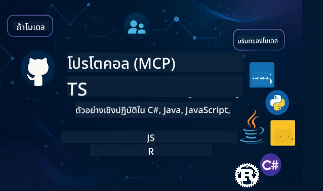

 

[](https://GitHub.com/microsoft/mcp-for-beginners/graphs/contributors)
[](https://GitHub.com/microsoft/mcp-for-beginners/issues)
[](https://GitHub.com/microsoft/mcp-for-beginners/pulls)
[](http://makeapullrequest.com)

[](https://GitHub.com/microsoft/mcp-for-beginners/watchers)
[](https://GitHub.com/microsoft/mcp-for-beginners/fork)
[](https://GitHub.com/microsoft/mcp-for-beginners/stargazers)


[](https://discord.gg/nTYy5BXMWG)

ทำตามขั้นตอนเหล่านี้เพื่อเริ่มต้นใช้ทรัพยากรเหล่านี้:
1. **Fork the Repository**: คลิก [](https://GitHub.com/microsoft/mcp-for-beginners/fork)
2. **โคลน Repository**: `git clone https://github.com/microsoft/mcp-for-beginners.git`
3. **เข้าร่วม** [](https://discord.gg/nTYy5BXMWG)


### 🌐 การรองรับหลายภาษา

#### รองรับผ่าน GitHub Action (อัตโนมัติและอัปเดตตลอดเวลา)

<!-- CO-OP TRANSLATOR LANGUAGES TABLE START -->
[Arabic](../ar/README.md) | [Bengali](../bn/README.md) | [Bulgarian](../bg/README.md) | [Burmese (Myanmar)](../my/README.md) | [Chinese (Simplified)](../zh-CN/README.md) | [Chinese (Traditional, Hong Kong)](../zh-HK/README.md) | [Chinese (Traditional, Macau)](../zh-MO/README.md) | [Chinese (Traditional, Taiwan)](../zh-TW/README.md) | [Croatian](../hr/README.md) | [Czech](../cs/README.md) | [Danish](../da/README.md) | [Dutch](../nl/README.md) | [Estonian](../et/README.md) | [Finnish](../fi/README.md) | [French](../fr/README.md) | [German](../de/README.md) | [Greek](../el/README.md) | [Hebrew](../he/README.md) | [Hindi](../hi/README.md) | [Hungarian](../hu/README.md) | [Indonesian](../id/README.md) | [Italian](../it/README.md) | [Japanese](../ja/README.md) | [Kannada](../kn/README.md) | [Korean](../ko/README.md) | [Lithuanian](../lt/README.md) | [Malay](../ms/README.md) | [Malayalam](../ml/README.md) | [Marathi](../mr/README.md) | [Nepali](../ne/README.md) | [Nigerian Pidgin](../pcm/README.md) | [Norwegian](../no/README.md) | [Persian (Farsi)](../fa/README.md) | [Polish](../pl/README.md) | [Portuguese (Brazil)](../pt-BR/README.md) | [Portuguese (Portugal)](../pt-PT/README.md) | [Punjabi (Gurmukhi)](../pa/README.md) | [Romanian](../ro/README.md) | [Russian](../ru/README.md) | [Serbian (Cyrillic)](../sr/README.md) | [Slovak](../sk/README.md) | [Slovenian](../sl/README.md) | [Spanish](../es/README.md) | [Swahili](../sw/README.md) | [Swedish](../sv/README.md) | [Tagalog (Filipino)](../tl/README.md) | [Tamil](../ta/README.md) | [Telugu](../te/README.md) | [Thai](./README.md) | [Turkish](../tr/README.md) | [Ukrainian](../uk/README.md) | [Urdu](../ur/README.md) | [Vietnamese](../vi/README.md)

> **ต้องการโคลนแบบโลคอล?**
>
> repository นี้รวมการแปลภาษากว่า 50 ภาษา ซึ่งจะเพิ่มขนาดไฟล์ดาวน์โหลดอย่างมาก เพื่อโคลนโดยไม่รวมการแปล ให้ใช้ sparse checkout:
>
> **Bash / macOS / Linux:**
> ```bash
> git clone --filter=blob:none --sparse https://github.com/microsoft/mcp-for-beginners.git
> cd mcp-for-beginners
> git sparse-checkout set --no-cone '/*' '!translations' '!translated_images'
> ```
>
> **CMD (Windows):**
> ```cmd
> git clone --filter=blob:none --sparse https://github.com/microsoft/mcp-for-beginners.git
> cd mcp-for-beginners
> git sparse-checkout set --no-cone "/*" "!translations" "!translated_images"
> ```
>
> นี่จะมอบทุกอย่างที่คุณต้องการเพื่อทำคอร์สให้เสร็จด้วยความเร็วในการดาวน์โหลดที่รวดเร็วขึ้นมาก
<!-- CO-OP TRANSLATOR LANGUAGES TABLE END -->

# 🚀 หลักสูตร Model Context Protocol (MCP) สำหรับผู้เริ่มต้น

## **เรียนรู้ MCP ด้วยตัวอย่างโค้ดจริงใน C#, Java, JavaScript, Rust, Python และ TypeScript**

## 🧠 ภาพรวมของหลักสูตร Model Context Protocol
ยินดีต้อนรับสู่การเดินทางในโลกของ Model Context Protocol! หากคุณเคยสงสัยว่าแอป AI สื่อสารกับเครื่องมือและบริการต่าง ๆ อย่างไร คุณกำลังจะได้ค้นพบทางออกที่เรียบง่ายซึ่งกำลังเปลี่ยนแปลงวิธีที่นักพัฒนาสร้างระบบอัจฉริยะ

คิดว่า MCP เป็นเหมือนล่ามสากลสำหรับแอป AI - เช่นเดียวกับที่พอร์ต USB ให้คุณเชื่อมต่ออุปกรณ์ใด ๆ กับคอมพิวเตอร์ของคุณ MCP ช่วยให้โมเดล AI เชื่อมต่อกับเครื่องมือหรือบริการใด ๆ ได้ในรูปแบบมาตรฐาน ไม่ว่าคุณจะสร้างแชทบอทตัวแรกของคุณ หรือทำงานกับเวิร์กโฟลว์ AI ที่ซับซ้อน การเข้าใจ MCP จะมอบพลังให้คุณสร้างแอปที่มีความสามารถและยืดหยุ่นมากขึ้น

หลักสูตรนี้ถูกออกแบบอย่างใส่ใจและอดทนต่อการเรียนรู้ของคุณ เราจะเริ่มจากแนวคิดง่าย ๆ ที่คุณคุ้นเคย และค่อย ๆ สร้างทักษะผ่านการปฏิบัติในภาษาการเขียนโปรแกรมที่คุณชื่นชอบ ทุกขั้นตอนประกอบด้วยคำอธิบายที่ชัดเจน ตัวอย่างปฏิบัติ และแรงสนับสนุนมากมายตลอดทาง

เมื่อคุณผ่านการเดินทางนี้จนจบ คุณจะมั่นใจในการสร้างเซิร์ฟเวอร์ MCP ของตัวเอง รวมระบบเข้ากับแพลตฟอร์ม AI ยอดนิยม และเข้าใจว่าทักษะนี้กำลังเปลี่ยนแปลงอนาคตของการพัฒนา AI อย่างไร มาเริ่มผจญภัยที่น่าตื่นเต้นนี้ด้วยกัน!

### เอกสารทางการและสเปค

หลักสูตรนี้สอดคล้องกับ **MCP Specification 2025-11-25** (เวอร์ชันเสถียรล่าสุด) สเปค MCP ใช้การเวอร์ชันด้วยวันที่ (รูปแบบ YYYY-MM-DD) เพื่อให้การติดตามเวอร์ชันโปรโตคอลชัดเจน

ทรัพยากรเหล่านี้จะมีคุณค่ามากขึ้นตามความเข้าใจของคุณ แต่ไม่ต้องกดดันให้ต้องอ่านทั้งหมดทันที เริ่มจากส่วนที่คุณสนใจมากที่สุด!
- 📘 [MCP Documentation](https://modelcontextprotocol.io/) – เป็นแหล่งข้อมูลสำหรับเรียนรู้ทีละขั้นตอนและคู่มือผู้ใช้ เอกสารถูกเขียนสำหรับผู้เริ่มต้น โดยมีตัวอย่างที่ชัดเจนให้คุณปฏิบัติตามได้ด้วยตัวเอง
- 📜 [MCP Specification](https://modelcontextprotocol.io/specification/2025-11-25) – เหมือนคู่มืออ้างอิงที่ครบถ้วน เมื่อคุณเรียนหลักสูตรนี้ คุณจะกลับมาดูรายละเอียดเฉพาะและสำรวจฟีเจอร์ขั้นสูง
- 📜 [MCP Specification Versioning](https://modelcontextprotocol.io/specification/versioning) – ข้อมูลเกี่ยวกับประวัติการเวอร์ชันโปรโตคอลและวิธีการใช้การเวอร์ชันด้วยวันที่
- 🧑‍💻 [MCP GitHub Repository](https://github.com/modelcontextprotocol) – พบ SDK, เครื่องมือ และตัวอย่างโค้ดในหลายภาษา คุณจะพบสมบัติใช้งานจริงและส่วนประกอบพร้อมใช้มากมาย
- 🌐 [MCP Community](https://github.com/orgs/modelcontextprotocol/discussions) – เข้าร่วมกับผู้เรียนและนักพัฒนามืออาชีพเพื่อแลกเปลี่ยนความรู้เกี่ยวกับ MCP เป็นชุมชนที่สนับสนุนและเปิดรับคำถามอย่างเสรี
  
## วัตถุประสงค์การเรียนรู้

เมื่อจบหลักสูตรนี้ คุณจะรู้สึกมั่นใจและตื่นเต้นกับความสามารถใหม่ที่ได้ นี่คือสิ่งที่คุณจะบรรลุ:
 
• **เข้าใจพื้นฐาน MCP**: คุณจะเข้าใจว่า Model Context Protocol คืออะไร และทำไมมันจึงปฏิวัติวิธีที่แอป AI ทำงานร่วมกัน โดยใช้การเปรียบเทียบและตัวอย่างที่เข้าใจง่าย

• **สร้างเซิร์ฟเวอร์ MCP ตัวแรกของคุณ**: คุณจะสร้างเซิร์ฟเวอร์ MCP ที่ใช้งานได้จริงในภาษาการเขียนโปรแกรมที่คุณเลือก เริ่มจากตัวอย่างง่าย ๆ และขยายทักษะทีละก้าว

• **เชื่อมต่อโมเดล AI กับเครื่องมือจริง**: คุณจะเรียนรู้วิธีเชื่อมช่องว่างระหว่างโมเดล AI กับบริการจริง มอบพลังให้แอปของคุณมีความสามารถใหม่ ๆ

• **นำแนวทางรักษาความปลอดภัยที่ดีที่สุดมาใช้**: คุณจะเข้าใจวิธีปกป้องการใช้งาน MCP ของคุณให้ปลอดภัย ปกป้องทั้งแอปและผู้ใช้ของคุณ

• **นำไปใช้งานได้อย่างมั่นใจ**: คุณจะรู้วิธีนำโครงการ MCP จากการพัฒนาสู่การใช้งานจริง พร้อมกลยุทธ์การเปิดตัวที่ใช้ได้จริง

• **เข้าร่วมชุมชน MCP**: คุณจะได้เป็นส่วนหนึ่งของชุมชนนักพัฒนาที่ขยายตัว ซึ่งกำลังสร้างอนาคตของการพัฒนาแอป AI

## ความรู้พื้นฐานที่จำเป็น

ก่อนเจาะลึกเรื่อง MCP มาดูแนวคิดพื้นฐานบางประการที่คุณควรรู้เพื่อความมั่นใจ ไม่ต้องกังวลถ้าคุณไม่เชี่ยวชาญ เราจะอธิบายสิ่งที่คุณจำเป็นต้องรู้ไปพร้อมกัน!

### การเข้าใจโปรโตคอล (ฐานราก)

คิดว่าโปรโตคอลเหมือนกฎสำหรับการสนทนา เมื่อคุณโทรหาเพื่อน คุณทั้งสองรู้ว่าต้องทักทาย "สวัสดี" เมื่อรับสาย ผลัดกันพูด และบอก "ลาก่อน" เมื่อจบ โปรแกรมคอมพิวเตอร์ก็ต้องมีกฎลักษณะเดียวกันเพื่อสื่อสารได้อย่างมีประสิทธิภาพ

MCP คือโปรโตคอล - ชุดกฎที่ตกลงร่วมกันช่วยให้โมเดล AI และแอปสื่อสารกันแบบ "มีบทสนทนา" กับเครื่องมือและบริการ แม้ว่าการมีกฎกลุ่มสนทนาช่วยให้คนคุยกันง่ายขึ้น MCP ก็ช่วยให้การสื่อสารระหว่างแอป AI มีความน่าเชื่อถือและทรงพลังมากขึ้น

### ความสัมพันธ์ระหว่าง Client-Server (วิธีที่โปรแกรมทำงานร่วมกัน)

คุณใช้รูปแบบ client-server ทุกวัน! เมื่อใช้เว็บเบราว์เซอร์ (client) เข้าเว็บ คุณจะเชื่อมต่อกับเว็บเซิร์ฟเวอร์ที่ส่งเนื้อหาหน้าเว็บให้ คุณรู้วิธีร้องขอข้อมูล และเซิร์ฟเวอร์รู้วิธีตอบกลับ

ใน MCP ก็มีความสัมพันธ์แบบเดียวกัน: โมเดล AI ทำหน้าที่เป็น client ร้องขอข้อมูลหรือคำสั่ง ในขณะที่เซิร์ฟเวอร์ MCP ให้บริการนั้น เหมือนมีผู้ช่วย (server) ที่ AI สามารถขอให้ทำงานเฉพาะเจาะจง

### ทำไมการมาตรฐานจึงสำคัญ (ทำให้ทุกอย่างทำงานร่วมกันได้)

ลองนึกภาพถ้าผู้ผลิตรถยนต์ใช้หัวปั๊มน้ำมันแตกต่างกันหมด คุณต้องใช้หัวแปลงสำหรับแต่ละคัน! การมาตรฐานหมายถึงการตกลงใช้วิธีร่วมกันเพื่อให้ทุกอย่างทำงานด้วยกันได้อย่างไร้รอยต่อ

MCP ให้การมาตรฐานสำหรับแอป AI แทนที่โมเดล AI ทุกตัวจะต้องมีโค้ดเฉพาะเพื่อทำงานกับเครื่องมือทุกตัว MCP สร้างวิธีสากลให้สื่อสารกัน นั่นหมายความว่านักพัฒนาสามารถสร้างเครื่องมือแค่ครั้งเดียว และให้ทำงานกับระบบ AI หลากหลายได้

## 🧭 ภาพรวมเส้นทางการเรียนรู้ของคุณ

การเดินทางกับ MCP ของคุณถูกวางโครงสร้างอย่างพิถีพิถันเพื่อสร้างความมั่นใจและพัฒนาทักษะอย่างเป็นขั้นตอน ทุกช่วงเรียนรู้แนวคิดใหม่พร้อมเสริมสิ่งที่คุณเข้าใจแล้ว

### 🌱 ช่วงพื้นฐาน: เข้าใจสิ่งสำคัญ (โมดูล 0-2)

นี่คือจุดเริ่มต้นของการผจญภัย! เราจะแนะนำแนวคิด MCP ด้วยการเปรียบเทียบที่คุณคุ้นเคยและตัวอย่างง่าย ๆ คุณจะรู้ว่า MCP คืออะไร ทำไมมันถึงมี และมันอยู่ในโลกการพัฒนา AI อย่างไร

• **โมดูล 0 - บทนำสู่ MCP**: เริ่มต้นด้วยการสำรวจว่า MCP คืออะไร และทำไมจึงสำคัญสำหรับแอป AI สมัยใหม่ คุณจะเห็นตัวอย่างจริงของ MCP ที่ใช้งานและเข้าใจว่ามันแก้ปัญหาทั่วไปของนักพัฒนาอย่างไร

• **โมดูล 1 - อธิบายแนวคิดหลัก**: เรียนรู้ก้อนอิฐสำคัญของ MCP เราจะใช้การเปรียบเทียบและตัวอย่างภาพจำนวนมากเพื่อให้แนวคิดเหล่านี้เป็นธรรมชาติและเข้าใจง่าย

• **โมดูล 2 - ความปลอดภัยใน MCP**: ความปลอดภัยอาจดูน่ากลัว แต่เราจะแสดงให้เห็นว่า MCP มีฟีเจอร์ความปลอดภัยในตัวอย่างไรและสอนแนวทางที่ดีที่สุดเพื่อปกป้องแอปของคุณตั้งแต่แรก

### 🔨 ช่วงสร้าง: สร้างการใช้งานครั้งแรกของคุณ (โมดูล 3)

ตอนนี้เริ่มสนุกจริงแล้ว! คุณจะได้ลงมือสร้างเซิร์ฟเวอร์และไคลเอนต์ MCP จริง อย่ากังวล - เราจะเริ่มจากง่าย ๆ และแนะนำคุณทุกขั้นตอน  

โมดูลนี้ประกอบด้วยคู่มือการปฏิบัติหลายฉบับที่ช่วยให้คุณได้ฝึกฝนในภาษาการเขียนโปรแกรมที่คุณชื่นชอบ คุณจะได้สร้างเซิร์ฟเวอร์แรกของคุณ สร้างไคลเอนต์เชื่อมต่อกับมัน และแม้แต่รวมเข้ากับเครื่องมือการพัฒนายอดนิยมอย่าง VS Code

คู่มือแต่ละฉบับมีตัวอย่างโค้ดครบถ้วน คำแนะนำแก้ไขปัญหา และคำอธิบายถึงเหตุผลของการตัดสินใจออกแบบเฉพาะทาง ในตอนท้ายของเฟสนี้ คุณจะมีการใช้งาน MCP ที่ใช้งานได้จริงซึ่งคุณสามารถภูมิใจได้!

### 🚀 ระยะการเติบโต: แนวคิดขั้นสูงและการใช้งานจริง (โมดูล 4-5)

เมื่อคุณเชี่ยวชาญพื้นฐานแล้ว คุณพร้อมที่จะสำรวจฟีเจอร์ MCP ที่ซับซ้อนมากขึ้น เราจะครอบคลุมกลยุทธ์การใช้งานจริง เทคนิคการดีบัก และหัวข้อขั้นสูง เช่น การรวม AI แบบหลายโหมด

คุณจะได้เรียนรู้วิธีการขยายการใช้งาน MCP สำหรับการใช้งานในสภาพแวดล้อมจริง และการรวมเข้ากับแพลตฟอร์มคลาวด์อย่าง Azure โมดูลเหล่านี้เตรียมคุณให้พร้อมสร้างโซลูชัน MCP ที่รองรับความต้องการในโลกจริงได้

### 🌟 ระยะเชี่ยวชาญ: ชุมชนและความเชี่ยวชาญเฉพาะด้าน (โมดูล 6-11)

เฟสสุดท้ายมุ่งเน้นที่การเข้าร่วมชุมชน MCP และการเชี่ยวชาญในด้านที่คุณสนใจมากที่สุด คุณจะได้เรียนรู้วิธีการมีส่วนร่วมในโปรเจกต์ MCP แบบโอเพ่นซอร์ส การใช้งานรูปแบบการพิสูจน์ตัวตนขั้นสูง และการสร้างโซลูชันครบวงจรรวมฐานข้อมูล

โมดูล 11 ควรได้รับการกล่าวถึงเป็นพิเศษ - เป็นเส้นทางการเรียนรู้ปฏิบัติ 13 แลปที่สมบูรณ์ซึ่งสอนให้คุณสร้างเซิร์ฟเวอร์ MCP พร้อมการรวมกับ PostgreSQL เหมือนกับโปรเจกต์จับงานสุดท้ายที่รวมทุกอย่างที่คุณได้เรียนรู้!

### 📚 โครงสร้างหลักสูตรครบถ้วน

| โมดูล | หัวข้อ | คำอธิบาย | ลิงก์ |
|--------|-------|-------------|------|
| **โมดูล 0-3: พื้นฐาน** | | | |
| 00 | บทนำสู่ MCP | ภาพรวมของโปรโตคอล Model Context และความสำคัญในสายงาน AI | [อ่านเพิ่มเติม](./00-Introduction/README.md) |
| 01 | อธิบายแนวคิดหลัก | การสำรวจเชิงลึกของแนวคิดหลักของ MCP | [อ่านเพิ่มเติม](./01-CoreConcepts/README.md) |
| 02 | ความปลอดภัยใน MCP | ภัยคุกคามด้านความปลอดภัยและแนวปฏิบัติที่ดีที่สุด | [อ่านเพิ่มเติม](./02-Security/README.md) |
| 03 | เริ่มต้นใช้งาน MCP | การตั้งค่าสภาพแวดล้อม เซิร์ฟเวอร์/ไคลเอนต์พื้นฐาน การรวมระบบ | [อ่านเพิ่มเติม](./03-GettingStarted/README.md) |
| **โมดูล 3: สร้างเซิร์ฟเวอร์และไคลเอนต์แรกของคุณ** | | | |
| 3.1 | เซิร์ฟเวอร์แรก | สร้างเซิร์ฟเวอร์ MCP แรกของคุณ | [คู่มือ](./03-GettingStarted/01-first-server/README.md) |
| 3.2 | ไคลเอนต์แรก | พัฒนาไคลเอนต์ MCP พื้นฐาน | [คู่มือ](./03-GettingStarted/02-client/README.md) |
| 3.3 | ไคลเอนต์กับ LLM | รวมโมเดลภาษาใหญ่ | [คู่มือ](./03-GettingStarted/03-llm-client/README.md) |
| 3.4 | การรวม VS Code | ใช้งานเซิร์ฟเวอร์ MCP ใน VS Code | [คู่มือ](./03-GettingStarted/04-vscode/README.md) |
| 3.5 | เซิร์ฟเวอร์ stdio | สร้างเซิร์ฟเวอร์โดยใช้การขนส่ง stdio | [คู่มือ](./03-GettingStarted/05-stdio-server/README.md) |
| 3.6 | HTTP Streaming | ทำ HTTP streaming ใน MCP | [คู่มือ](./03-GettingStarted/06-http-streaming/README.md) |
| 3.7 | ชุดเครื่องมือ AI | ใช้ AI Toolkit กับ MCP | [คู่มือ](./03-GettingStarted/07-aitk/README.md) |
| 3.8 | การทดสอบ | ทดสอบการใช้งานเซิร์ฟเวอร์ MCP ของคุณ | [คู่มือ](./03-GettingStarted/08-testing/README.md) |
| 3.9 | การ deploy | นำเซิร์ฟเวอร์ MCP สู่การใช้งานจริง | [คู่มือ](./03-GettingStarted/09-deployment/README.md) |
| 3.10 | การใช้งานเซิร์ฟเวอร์ขั้นสูง | ใช้เซิร์ฟเวอร์ขั้นสูงสำหรับฟีเจอร์ขั้นสูงและสถาปัตยกรรมที่ดีขึ้น | [คู่มือ](./03-GettingStarted/10-advanced/README.md) |
| 3.11 | การพิสูจน์ตัวตนง่ายๆ | บทที่แสดงให้เห็นการพิสูจน์ตัวตนตั้งแต่ต้นและ RBAC | [คู่มือ](./03-GettingStarted/11-simple-auth/README.md) |
| 3.12 | โฮสต์ MCP | ตั้งค่า Claude Desktop, Cursor, Cline และโฮสต์ MCP อื่น ๆ | [คู่มือ](./03-GettingStarted/12-mcp-hosts/README.md) |
| 3.13 | MCP Inspector | ดีบักและทดสอบเซิร์ฟเวอร์ MCP ด้วยเครื่องมือ Inspector | [คู่มือ](./03-GettingStarted/13-mcp-inspector/README.md) |
| 3.14 | การสุ่มตัวอย่าง | ใช้เทคนิคการสุ่มตัวอย่างเพื่อร่วมมือกับไคลเอนต์ | [คู่มือ](./03-GettingStarted/14-sampling/README.md) |
| 3.15 | แอป MCP | สร้างแอป MCP | [คู่มือ](./03-GettingStarted/15-mcp-apps/README.md) |

| **โมดูล 4-5: การใช้งานจริง & ขั้นสูง** | | | |
| 04 | การใช้งานจริง | SDKs, การดีบัก, การทดสอบ, แบบฟอร์ม prompt ที่นำกลับมาใช้ได้ | [อ่านเพิ่มเติม](./04-PracticalImplementation/README.md) |
| 4.1 | การแบ่งหน้า | จัดการชุดผลลัพธ์ขนาดใหญ่ด้วยการแบ่งหน้าด้วย cursor | [คู่มือ](./04-PracticalImplementation/pagination/README.md) |
| 05 | หัวข้อขั้นสูงใน MCP | AI หลายโหมด การขยายขนาด การใช้งานในองค์กร | [อ่านเพิ่มเติม](./05-AdvancedTopics/README.md) |
| 5.1 | การรวม Azure | การรวม MCP กับ Azure | [คู่มือ](./05-AdvancedTopics/mcp-integration/README.md) |
| 5.2 | หลายโหมด | การทำงานกับหลายโหมด | [คู่มือ](./05-AdvancedTopics/mcp-multi-modality/README.md) |
| 5.3 | ตัวอย่าง OAuth2 | การใช้งานการพิสูจน์ตัวตน OAuth2 | [คู่มือ](./05-AdvancedTopics/mcp-oauth2-demo/README.md) |
| 5.4 | บริบทหลัก | ทำความเข้าใจและใช้งานบริบทหลัก | [คู่มือ](./05-AdvancedTopics/mcp-root-contexts/README.md) |
| 5.5 | การกำหนดเส้นทาง | กลยุทธ์การกำหนดเส้นทางใน MCP | [คู่มือ](./05-AdvancedTopics/mcp-routing/README.md) |
| 5.6 | การสุ่มตัวอย่าง | เทคนิคการสุ่มตัวอย่างใน MCP | [คู่มือ](./05-AdvancedTopics/mcp-sampling/README.md) |
| 5.7 | การขยายขนาด | ขยายการใช้งาน MCP | [คู่มือ](./05-AdvancedTopics/mcp-scaling/README.md) |
| 5.8 | ความปลอดภัย | การพิจารณาความปลอดภัยขั้นสูง | [คู่มือ](./05-AdvancedTopics/mcp-security/README.md) |
| 5.9 | การค้นหาเว็บ | นำความสามารถค้นหาเว็บเข้ามาใช้ | [คู่มือ](./05-AdvancedTopics/web-search-mcp/README.md) |
| 5.10 | การสตรีมแบบเรียลไทม์ | สร้างฟังก์ชันการสตรีมแบบเรียลไทม์ | [คู่มือ](./05-AdvancedTopics/mcp-realtimestreaming/README.md) |
| 5.11 | การค้นหาแบบเรียลไทม์ | ทำการค้นหาแบบเรียลไทม์ | [คู่มือ](./05-AdvancedTopics/mcp-realtimesearch/README.md) |
| 5.12 | การพิสูจน์ตัวตน Entra ID | การพิสูจน์ตัวตนกับ Microsoft Entra ID | [คู่มือ](./05-AdvancedTopics/mcp-security-entra/README.md) |
| 5.13 | การรวม Foundry | การรวมกับ Azure AI Foundry | [คู่มือ](./05-AdvancedTopics/mcp-foundry-agent-integration/README.md) |
| 5.14 | วิศวกรรมบริบท | เทคนิคสำหรับการวิศวกรรมบริบทที่มีประสิทธิภาพ | [คู่มือ](./05-AdvancedTopics/mcp-contextengineering/README.md) |
| 5.15 | การขนส่งแบบกำหนดเองของ MCP | การใช้งานขนส่งแบบกำหนดเอง | [คู่มือ](./05-AdvancedTopics/mcp-transport/README.md) |
| 5.16 | ฟีเจอร์โปรโตคอล | การแจ้งความคืบหน้า การยกเลิก แบบฟอร์มทรัพยากร | [คู่มือ](./05-AdvancedTopics/mcp-protocol-features/README.md) |
| **โมดูล 6-10: ชุมชน & แนวปฏิบัติที่ดีที่สุด** | | | |
| 06 | การมีส่วนร่วมของชุมชน | วิธีการมีส่วนร่วมในระบบนิเวศ MCP | [คู่มือ](./06-CommunityContributions/README.md) |
| 07 | บทเรียนจากการรับมาใช้ในช่วงแรก | เรื่องราวการใช้งานจริง | [คู่มือ](./07-LessonsfromEarlyAdoption/README.md) |
| 08 | แนวปฏิบัติที่ดีที่สุดสำหรับ MCP | ประสิทธิภาพ ความทนทานต่อความผิดพลาด ความยืดหยุ่น | [คู่มือ](./08-BestPractices/README.md) |
| 09 | กรณีศึกษา MCP | ตัวอย่างการใช้งานจริง | [คู่มือ](./09-CaseStudy/README.md) |
| 10 | เวิร์กช็อปปฏิบัติ | การสร้างเซิร์ฟเวอร์ MCP ด้วย AI Toolkit | [แลป](./10-StreamliningAIWorkflowsBuildingAnMCPServerWithAIToolkit/README.md) |
| **โมดูล 11: MCP Server Hands On Lab** | | | |
| 11 | การรวมฐานข้อมูลของเซิร์ฟเวอร์ MCP | เส้นทางการเรียนรู้ปฏิบัติ 13 แลปสำหรับการรวม PostgreSQL | [แลป](./11-MCPServerHandsOnLabs/README.md) |
| 11.1 | บทนำ | ภาพรวม MCP กับการรวมฐานข้อมูลและกรณีใช้ด้านการวิเคราะห์ค้าปลีก | [แลป 00](./11-MCPServerHandsOnLabs/00-Introduction/README.md) |
| 11.2 | สถาปัตยกรรมหลัก | การทำความเข้าใจสถาปัตยกรรมเซิร์ฟเวอร์ MCP ชั้นฐานข้อมูล และรูปแบบความปลอดภัย | [แลป 01](./11-MCPServerHandsOnLabs/01-Architecture/README.md) |
| 11.3 | ความปลอดภัย & ผู้ใช้หลายราย | การรักษาความปลอดภัยระดับแถว การพิสูจน์ตัวตน และการเข้าถึงข้อมูลแบบหลายผู้ใช้ | [แลป 02](./11-MCPServerHandsOnLabs/02-Security/README.md) |
| 11.4 | การตั้งค่าสภาพแวดล้อม | ตั้งค่าสภาพแวดล้อมการพัฒนา Docker และทรัพยากร Azure | [แลป 03](./11-MCPServerHandsOnLabs/03-Setup/README.md) |
| 11.5 | การออกแบบฐานข้อมูล | การตั้งค่า PostgreSQL การออกแบบสคีมาค้าปลีก และข้อมูลตัวอย่าง | [แลป 04](./11-MCPServerHandsOnLabs/04-Database/README.md) |
| 11.6 | การใช้งานเซิร์ฟเวอร์ MCP | สร้างเซิร์ฟเวอร์ FastMCP พร้อมการรวมฐานข้อมูล | [แลป 05](./11-MCPServerHandsOnLabs/05-MCP-Server/README.md) |
| 11.7 | การพัฒนาเครื่องมือ | สร้างเครื่องมือค้นหาฐานข้อมูลและการตรวจสอบสคีมา | [แลป 06](./11-MCPServerHandsOnLabs/06-Tools/README.md) |
| 11.8 | การค้นหาความหมาย | การใช้งาน vector embeddings กับ Azure OpenAI และ pgvector | [แลป 07](./11-MCPServerHandsOnLabs/07-Semantic-Search/README.md) |
| 11.9 | การทดสอบ & ดีบัก | กลยุทธ์การทดสอบ เครื่องมือดีบัก และการตรวจสอบ | [แลป 08](./11-MCPServerHandsOnLabs/08-Testing/README.md) |
| 11.10 | การรวม VS Code | การตั้งค่าการรวม VS Code MCP และการใช้งาน AI Chat | [แลป 09](./11-MCPServerHandsOnLabs/09-VS-Code/README.md) |
| 11.11 | กลยุทธ์การ deploy | การ deploy ด้วย Docker, Azure Container Apps และการพิจารณาการขยาย | [แลป 10](./11-MCPServerHandsOnLabs/10-Deployment/README.md) |
| 11.12 | การตรวจสอบ | Application Insights, การบันทึก, การตรวจสอบประสิทธิภาพ | [แลป 11](./11-MCPServerHandsOnLabs/11-Monitoring/README.md) |
| 11.13 | แนวปฏิบัติที่ดีที่สุด | การเพิ่มประสิทธิภาพ, การเสริมความปลอดภัย และคำแนะนำสำหรับการผลิต | [แลป 12](./11-MCPServerHandsOnLabs/12-Best-Practices/README.md) |

### 💻 ตัวอย่างโปรเจกต์โค้ด

ส่วนที่น่าตื่นเต้นที่สุดของการเรียนรู้ MCP คือการเห็นทักษะโค้ดของคุณพัฒนาขึ้นอย่างต่อเนื่อง เราออกแบบตัวอย่างโค้ดให้เริ่มจากง่ายและซับซ้อนขึ้นเมื่อคุณเข้าใจมากขึ้น นี่คือวิธีที่เราแนะนำแนวคิด — ด้วยโค้ดที่เข้าใจง่ายแต่แสดงหลักการ MCP จริง คุณจะเข้าใจไม่เพียงแค่ว่าโค้ดนี้ทำอะไร แต่ทำไมจึงโครงสร้างแบบนี้ และการรวมโค้ดนี้เข้ากับแอป MCP ขนาดใหญ่ได้อย่างไร

#### ตัวอย่างเครื่องคิดเลข MCP พื้นฐาน

| ภาษา | คำอธิบาย | ลิงก์ |
|----------|-------------|------|
| C# | ตัวอย่างเซิร์ฟเวอร์ MCP | [ดูโค้ด](./03-GettingStarted/samples/csharp/README.md) |
| Java | เครื่องคิดเลข MCP | [ดูโค้ด](./03-GettingStarted/samples/java/calculator/README.md) |
| JavaScript | ตัวอย่าง MCP | [ดูโค้ด](./03-GettingStarted/samples/javascript/README.md) |
| Python | เซิร์ฟเวอร์ MCP | [ดูโค้ด](../../03-GettingStarted/samples/python/mcp_calculator_server.py) |
| TypeScript | ตัวอย่าง MCP | [ดูโค้ด](./03-GettingStarted/samples/typescript/README.md) |
| Rust | ตัวอย่าง MCP | [ดูโค้ด](./03-GettingStarted/samples/rust/README.md) |

#### การใช้งาน MCP ขั้นสูง

| ภาษา | คำอธิบาย | ลิงก์ |
|----------|-------------|------|
| C# | ตัวอย่างขั้นสูง | [ดูโค้ด](./04-PracticalImplementation/samples/csharp/README.md) |
| Java กับ Spring | ตัวอย่าง Container App | [ดูโค้ด](./04-PracticalImplementation/samples/java/containerapp/README.md) |
| JavaScript | ตัวอย่างขั้นสูง | [ดูโค้ด](./04-PracticalImplementation/samples/javascript/README.md) |
| Python | การใช้งานซับซ้อน | [ดูโค้ด](./04-PracticalImplementation/samples/python/README.md) |
| TypeScript | ตัวอย่าง Container | [ดูโค้ด](./04-PracticalImplementation/samples/typescript/README.md) |


## 🎯 สิ่งที่ควรรู้ก่อนเรียน MCP

เพื่อให้ได้รับประโยชน์สูงสุดจากหลักสูตรนี้ คุณควรมี:
- ความรู้พื้นฐานการเขียนโปรแกรมในอย่างน้อยหนึ่งภาษาต่อไปนี้: C#, Java, JavaScript, Python หรือ TypeScript  
- ความเข้าใจในรูปแบบ client-server และ APIs  
- คุ้นเคยกับแนวคิด REST และ HTTP  
- (ไม่บังคับ) พื้นฐานด้านแนวคิด AI/ML  

- การเข้าร่วมสนทนาในชุมชนของเราเพื่อขอรับการสนับสนุน  

## 📚 คู่มือการศึกษาและแหล่งข้อมูล

ที่เก็บนี้มีแหล่งข้อมูลหลายอย่างเพื่อช่วยให้คุณนำทางและเรียนรู้อย่างมีประสิทธิภาพ:  

### คู่มือการศึกษา

มี [คู่มือการศึกษา](./study_guide.md) แบบครบถ้วนเพื่อช่วยให้คุณนำทางในที่เก็บนี้อย่างมีประสิทธิภาพ แผนผังหลักสูตรที่เป็นภาพนี้แสดงให้เห็นว่าทุกหัวข้อเชื่อมโยงกันอย่างไรและให้คำแนะนำในการใช้โปรเจ็กต์ตัวอย่างอย่างมีประสิทธิผล เหมาะมากสำหรับผู้เรียนที่ชอบเห็นภาพรวมใหญ่  

คู่มือประกอบด้วย:  
- แผนผังหลักสูตรแบบภาพแสดงหัวข้อทั้งหมดที่ครอบคลุม  
- การแยกย่อยรายละเอียดของแต่ละส่วนของที่เก็บ  
- คำแนะนำในการใช้โปรเจ็กต์ตัวอย่าง  
- เส้นทางการเรียนรู้ที่แนะนำสำหรับระดับทักษะต่างๆ  
- แหล่งข้อมูลเพิ่มเติมเพื่อเสริมเส้นทางการเรียนรู้ของคุณ  

### บันทึกการเปลี่ยนแปลง

เรารักษา [บันทึกการเปลี่ยนแปลง](./changelog.md) อย่างละเอียดเพื่อติดตามการอัปเดตสำคัญทั้งหมดในวัสดุหลักสูตร เพื่อให้คุณติดตามความเปลี่ยนแปลงและสิ่งเพิ่มเติมล่าสุดได้อย่างต่อเนื่อง  
- เนื้อหาใหม่ที่เพิ่มเข้ามา  
- การเปลี่ยนแปลงโครงสร้าง  
- การปรับปรุงฟีเจอร์  
- การอัปเดตเอกสาร  

## 🛠️ วิธีใช้หลักสูตรนี้อย่างมีประสิทธิภาพ

แต่ละบทเรียนในคู่มือนี้ประกอบด้วย:  

1. คำอธิบายที่ชัดเจนของแนวคิด MCP  
2. ตัวอย่างโค้ดสดในหลายภาษา  
3. แบบฝึกหัดเพื่อสร้างแอปพลิเคชัน MCP จริง  
4. แหล่งข้อมูลเพิ่มเติมสำหรับผู้เรียนขั้นสูง  

### มาเรียนรู้ MCP กับ C# - ซีรีส์สอนใช้งาน  
มาทำความรู้จักกับ Model Context Protocol (MCP) กรอบงานล้ำสมัยที่ออกแบบมาเพื่อทำให้การโต้ตอบระหว่างโมเดล AI กับแอปพลิเคชันลูกค้าเป็นมาตรฐาน ผ่านบทเรียนสำหรับผู้เริ่มต้นนี้ เราจะแนะนำคุณกับ MCP และแนะนำการสร้างเซิร์ฟเวอร์ MCP ตัวแรกของคุณ  
#### C#: [https://aka.ms/letslearnmcp-csharp](https://aka.ms/letslearnmcp-csharp)  
#### Java: [https://aka.ms/letslearnmcp-java](https://aka.ms/letslearnmcp-java)  
#### JavaScript: [https://aka.ms/letslearnmcp-javascript](https://aka.ms/letslearnmcp-javascript)  
#### Python: [https://aka.ms/letslearnmcp-python](https://aka.ms/letslearnmcp-python)  

## 🎓 การเดินทาง MCP ของคุณเริ่มต้นแล้ว

ขอแสดงความยินดี! คุณเพิ่งก้าวแรกในการเดินทางที่น่าตื่นเต้นซึ่งจะขยายขีดความสามารถการเขียนโปรแกรมของคุณและเชื่อมต่อคุณกับขอบเขตที่ล้ำหน้าของการพัฒนา AI  

### สิ่งที่คุณทำได้แล้ว

ด้วยการอ่านบทนำนี้ คุณได้เริ่มสร้างฐานความรู้ MCP ของคุณแล้ว คุณเข้าใจว่า MCP คืออะไร ทำไมจึงสำคัญ และหลักสูตรนี้จะช่วยสนับสนุนเส้นทางการเรียนรู้ของคุณอย่างไร นั่นคือความสำเร็จอย่างยิ่งใหญ่และจุดเริ่มต้นของความเชี่ยวชาญในเทคโนโลยีสำคัญนี้  

### การผจญภัยข้างหน้า

เมื่อคุณก้าวผ่านโมดูลต่างๆ จำไว้ว่าผู้เชี่ยวชาญทุกคนเคยเป็นผู้เริ่มต้น แนวคิดที่อาจดูซับซ้อนในตอนนี้จะกลายเป็นเรื่องธรรมชาติเมื่อคุณฝึกฝนและนำไปใช้ ทีละขั้นตอนเล็กๆ จะนำไปสู่ความสามารถอันทรงพลังที่จะช่วยสนับสนุนคุณตลอดเส้นทางอาชีพพัฒนาโปรแกรมของคุณ  

### เครือข่ายสนับสนุนของคุณ

คุณกำลังเข้าร่วมชุมชนของผู้เรียนและผู้เชี่ยวชาญที่ใส่ใจ MCP และพร้อมช่วยเหลือผู้อื่นให้ประสบความสำเร็จ ไม่ว่าคุณจะติดขัดในความท้าทายการเขียนโค้ดหรือรู้สึกตื่นเต้นที่จะแชร์ความก้าวหน้า ชุมชนนี้พร้อมสนับสนุนเส้นทางของคุณ  

หากคุณติดขัดหรือต้องการคำถามใดๆ เกี่ยวกับการสร้างแอป AI ร่วมสนทนากับผู้เรียนและนักพัฒนาที่มีประสบการณ์ในการพูดคุยเกี่ยวกับ MCP นี่คือชุมชนที่ให้การสนับสนุน มีคำถามยินดีต้อนรับและแบ่งปันความรู้กันอย่างเสรี  

[](https://discord.gg/nTYy5BXMWG)  

หากคุณมีคำติชมเกี่ยวกับผลิตภัณฑ์หรือพบข้อผิดพลาดระหว่างการพัฒนา เยี่ยมชม:  

[](https://aka.ms/foundry/forum)  

### พร้อมเริ่มต้นหรือยัง?

การผจญภัยกับ MCP ของคุณเริ่มต้นตอนนี้เลย! เริ่มด้วยโมดูล 0 เพื่อเริ่มประสบการณ์ MCP ด้วยมือของคุณเอง หรือสำรวจโปรเจ็กต์ตัวอย่างเพื่อดูสิ่งที่จะได้สร้าง จำไว้ว่า - ผู้เชี่ยวชาญทุกคนเริ่มต้นที่จุดเดียวกับคุณ และด้วยความอดทนและการฝึกฝน คุณจะประหลาดใจในสิ่งที่คุณสามารถทำได้  

ยินดีต้อนรับสู่โลกของการพัฒนา Model Context Protocol มาสร้างสิ่งที่ยอดเยี่ยมไปด้วยกัน!  

## 🤝 การมีส่วนร่วมในชุมชนการเรียนรู้

หลักสูตรนี้จะแข็งแกร่งขึ้นด้วยการมีส่วนร่วมจากผู้เรียนเหมือนคุณ! ไม่ว่าคุณจะแก้ไขพิมพ์ผิด แนะนำคำอธิบายที่ชัดเจนขึ้น หรือเพิ่มตัวอย่างใหม่ การมีส่วนร่วมของคุณช่วยให้ผู้เริ่มต้นคนอื่นๆ ประสบความสำเร็จ  

ขอบคุณ Microsoft Valued Professional [Shivam Goyal](https://www.linkedin.com/in/shivam2003/) สำหรับการมีส่วนร่วมตัวอย่างโค้ด  

กระบวนการมีส่วนร่วมถูกออกแบบมาให้อบอุ่นและสนับสนุน ส่วนใหญ่ต้องมี Contributor License Agreement (CLA) แต่เครื่องมืออัตโนมัติจะช่วยแนะนำคุณไปทีละขั้นตอนอย่างราบรื่น  

## 📜 การเรียนรู้แบบโอเพ่นซอร์ส

หลักสูตรนี้ทั้งหมดเผยแพร่ภายใต้ใบอนุญาต MIT [LICENSE](../../LICENSE) ซึ่งหมายความว่าคุณสามารถใช้ ปรับแต่ง และแบ่งปันได้อย่างเสรี สนับสนุนพันธกิจของเราในการทำให้ความรู้ MCP เข้าถึงได้สำหรับนักพัฒนาทุกที่  
## 🤝 แนวทางการมีส่วนร่วม

โปรเจ็กต์นี้ยินดีรับการมีส่วนร่วมและข้อเสนอแนะ ส่วนใหญ่ต้องการให้คุณยอมรับ Contributor License Agreement (CLA) เพื่อยืนยันว่าคุณมีสิทธิ์และได้มอบสิทธิ์ให้เราใช้ส่วนร่วมของคุณ สำหรับรายละเอียดเพิ่มเติม เยี่ยมชม <https://cla.opensource.microsoft.com>  

เมื่อคุณส่งคำขอ pull request บอท CLA จะตรวจสอบโดยอัตโนมัติว่าคุณต้องส่ง CLA หรือไม่และจัดเครื่องหมายให้ PR อย่างเหมาะสม (เช่น การตรวจสอบสถานะ แสดงความคิดเห็น) เพียงติดตามคำแนะนำของบอท คุณจะต้องทำเพียงครั้งเดียวสำหรับทุก repo ที่ใช้ CLA ของเรา  

โปรเจ็กต์นี้ได้นำแนวทางปฏิบัติ [Microsoft Open Source Code of Conduct](https://opensource.microsoft.com/codeofconduct/) มาใช้  
สำหรับข้อมูลเพิ่มเติมดู [คำถามที่พบบ่อยเกี่ยวกับแนวทางปฏิบัติ](https://opensource.microsoft.com/codeofconduct/faq/) หรือติดต่อ [opencode@microsoft.com](mailto:opencode@microsoft.com) หากมีคำถามหรือข้อคิดเห็นเพิ่มเติม  

---  

*พร้อมที่จะเริ่มต้นการเดินทาง MCP ของคุณหรือยัง? เริ่มด้วย [โมดูล 00 - แนะนำ MCP](./00-Introduction/README.md) และก้าวครั้งแรกเข้าสู่โลกของการพัฒนา Model Context Protocol!*  

## 🎒 หลักสูตรอื่นๆ  
ทีมงานของเรามีหลักสูตรอื่นๆ ด้วย! ดูได้ที่:  

<!-- CO-OP TRANSLATOR OTHER COURSES START -->  
### LangChain  
[](https://aka.ms/langchain4j-for-beginners)  
[](https://aka.ms/langchainjs-for-beginners?WT.mc_id=m365-94501-dwahlin)  
[](https://github.com/microsoft/langchain-for-beginners?WT.mc_id=m365-94501-dwahlin)  
---  

### Azure / Edge / MCP / Agents  
[](https://github.com/microsoft/AZD-for-beginners?WT.mc_id=academic-105485-koreyst)  
[](https://github.com/microsoft/edgeai-for-beginners?WT.mc_id=academic-105485-koreyst)  
[](https://github.com/microsoft/mcp-for-beginners?WT.mc_id=academic-105485-koreyst)  
[](https://github.com/microsoft/ai-agents-for-beginners?WT.mc_id=academic-105485-koreyst)  

---  

### Generative AI Series  
[](https://github.com/microsoft/generative-ai-for-beginners?WT.mc_id=academic-105485-koreyst)  
[-9333EA?style=for-the-badge&labelColor=E5E7EB&color=9333EA)](https://github.com/microsoft/Generative-AI-for-beginners-dotnet?WT.mc_id=academic-105485-koreyst)  
[-C084FC?style=for-the-badge&labelColor=E5E7EB&color=C084FC)](https://github.com/microsoft/generative-ai-for-beginners-java?WT.mc_id=academic-105485-koreyst)  
[-E879F9?style=for-the-badge&labelColor=E5E7EB&color=E879F9)](https://github.com/microsoft/generative-ai-with-javascript?WT.mc_id=academic-105485-koreyst)  

---  

### การเรียนรู้หลัก  
[](https://aka.ms/ml-beginners?WT.mc_id=academic-105485-koreyst)  
[](https://aka.ms/datascience-beginners?WT.mc_id=academic-105485-koreyst)  
[](https://aka.ms/ai-beginners?WT.mc_id=academic-105485-koreyst)  
[](https://github.com/microsoft/Security-101?WT.mc_id=academic-96948-sayoung)  
[](https://aka.ms/webdev-beginners?WT.mc_id=academic-105485-koreyst)  
[](https://aka.ms/iot-beginners?WT.mc_id=academic-105485-koreyst)  
[](https://github.com/microsoft/xr-development-for-beginners?WT.mc_id=academic-105485-koreyst)  

---  

### ซีรีส์ Copilot  

[](https://aka.ms/GitHubCopilotAI?WT.mc_id=academic-105485-koreyst)
[](https://github.com/microsoft/mastering-github-copilot-for-dotnet-csharp-developers?WT.mc_id=academic-105485-koreyst)
[](https://github.com/microsoft/CopilotAdventures?WT.mc_id=academic-105485-koreyst)
<!-- CO-OP TRANSLATOR OTHER COURSES END -->

---

<!-- CO-OP TRANSLATOR DISCLAIMER START -->
**ข้อจำกัดความรับผิดชอบ**:
เอกสารนี้ได้รับการแปลโดยใช้บริการแปลภาษาด้วย AI [Co-op Translator](https://github.com/Azure/co-op-translator) แม้ว่าเราจะพยายามให้ความถูกต้องสูงสุด โปรดทราบว่าการแปลอัตโนมัติอาจมีข้อผิดพลาดหรือความไม่ถูกต้อง เอกสารต้นฉบับในภาษาต้นทางถือเป็นแหล่งข้อมูลที่มีอำนาจสูงสุด สำหรับข้อมูลที่มีความสำคัญ แนะนำให้ใช้บริการแปลโดยมนุษย์มืออาชีพ เราไม่รับผิดชอบต่อความเข้าใจผิดหรือการตีความที่คลาดเคลื่อนที่เกิดจากการใช้การแปลนี้
<!-- CO-OP TRANSLATOR DISCLAIMER END -->