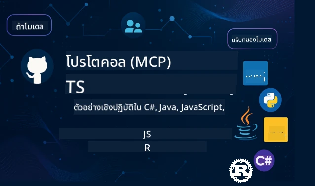

 

[](https://GitHub.com/microsoft/mcp-for-beginners/graphs/contributors)
[](https://GitHub.com/microsoft/mcp-for-beginners/issues)
[](https://GitHub.com/microsoft/mcp-for-beginners/pulls)
[](http://makeapullrequest.com)
[](https://mcptoplist.com/server/mcp.so%2Fmcp-for-beginners%2Fmicrosoft)

[](https://GitHub.com/microsoft/mcp-for-beginners/watchers)
[](https://GitHub.com/microsoft/mcp-for-beginners/fork)
[](https://GitHub.com/microsoft/mcp-for-beginners/stargazers)


[](https://discord.gg/nTYy5BXMWG)

ทำตามขั้นตอนเหล่านี้เพื่อเริ่มต้นใช้งานทรัพยากรเหล่านี้:
1. **Fork the Repository**: คลิก [](https://GitHub.com/microsoft/mcp-for-beginners/fork)
2. **Clone the Repository**:   `git clone https://github.com/microsoft/mcp-for-beginners.git`
3. **Join The** [](https://discord.gg/nTYy5BXMWG)


### 🌐 การสนับสนุนหลายภาษา

#### รองรับผ่าน GitHub Action (อัตโนมัติ & อัปเดตเสมอ)

<!-- CO-OP TRANSLATOR LANGUAGES TABLE START -->
[Arabic](../ar/README.md) | [Bengali](../bn/README.md) | [Bulgarian](../bg/README.md) | [Burmese (Myanmar)](../my/README.md) | [Chinese (Simplified)](../zh-CN/README.md) | [Chinese (Traditional, Hong Kong)](../zh-HK/README.md) | [Chinese (Traditional, Macau)](../zh-MO/README.md) | [Chinese (Traditional, Taiwan)](../zh-TW/README.md) | [Croatian](../hr/README.md) | [Czech](../cs/README.md) | [Danish](../da/README.md) | [Dutch](../nl/README.md) | [Estonian](../et/README.md) | [Finnish](../fi/README.md) | [French](../fr/README.md) | [German](../de/README.md) | [Greek](../el/README.md) | [Hebrew](../he/README.md) | [Hindi](../hi/README.md) | [Hungarian](../hu/README.md) | [Indonesian](../id/README.md) | [Italian](../it/README.md) | [Japanese](../ja/README.md) | [Kannada](../kn/README.md) | [Khmer](../km/README.md) | [Korean](../ko/README.md) | [Lithuanian](../lt/README.md) | [Malay](../ms/README.md) | [Malayalam](../ml/README.md) | [Marathi](../mr/README.md) | [Nepali](../ne/README.md) | [Nigerian Pidgin](../pcm/README.md) | [Norwegian](../no/README.md) | [Persian (Farsi)](../fa/README.md) | [Polish](../pl/README.md) | [Portuguese (Brazil)](../pt-BR/README.md) | [Portuguese (Portugal)](../pt-PT/README.md) | [Punjabi (Gurmukhi)](../pa/README.md) | [Romanian](../ro/README.md) | [Russian](../ru/README.md) | [Serbian (Cyrillic)](../sr/README.md) | [Slovak](../sk/README.md) | [Slovenian](../sl/README.md) | [Spanish](../es/README.md) | [Swahili](../sw/README.md) | [Swedish](../sv/README.md) | [Tagalog (Filipino)](../tl/README.md) | [Tamil](../ta/README.md) | [Telugu](../te/README.md) | [Thai](./README.md) | [Turkish](../tr/README.md) | [Ukrainian](../uk/README.md) | [Urdu](../ur/README.md) | [Vietnamese](../vi/README.md)

> **ต้องการโคลนแบบโลคอล?**
>
> ที่เก็บนี้มีการแปลมากกว่า 50 ภาษา ซึ่งจะเพิ่มขนาดการดาวน์โหลดอย่างมาก หากต้องการโคลนโดยไม่รวมการแปล ให้ใช้ sparse checkout:
>
> **Bash / macOS / Linux:**
> ```bash
> git clone --filter=blob:none --sparse https://github.com/microsoft/mcp-for-beginners.git
> cd mcp-for-beginners
> git sparse-checkout set --no-cone '/*' '!translations' '!translated_images'
> ```
>
> **CMD (Windows):**
> ```cmd
> git clone --filter=blob:none --sparse https://github.com/microsoft/mcp-for-beginners.git
> cd mcp-for-beginners
> git sparse-checkout set --no-cone "/*" "!translations" "!translated_images"
> ```
>
> วิธีนี้จะให้ทุกอย่างที่คุณต้องการเพื่อทำคอร์สให้เสร็จสมบูรณ์โดยดาวน์โหลดได้เร็วขึ้นมาก
<!-- CO-OP TRANSLATOR LANGUAGES TABLE END -->

# 🚀 หลักสูตร Model Context Protocol (MCP) สำหรับผู้เริ่มต้น

## **เรียนรู้ MCP ด้วยตัวอย่างโค้ดแบบลงมือทำในภาษา C#, Java, JavaScript, Rust, Python และ TypeScript**

## 🧠 ภาพรวมของหลักสูตร Model Context Protocol
ยินดีต้อนรับสู่การเดินทางของคุณกับ Model Context Protocol! หากคุณเคยสงสัยว่าแอปพลิเคชัน AI ติดต่อกับเครื่องมือและบริการต่าง ๆ อย่างไร คุณกำลังจะได้ค้นพบวิธีแก้ปัญหาอันสวยงามที่เปลี่ยนวิธีที่นักพัฒนาสร้างระบบอัจฉริยะ

ลองคิดว่า MCP เป็นล่ามสากลสำหรับแอป AI - เช่นเดียวกับพอร์ต USB ที่ช่วยให้คุณเชื่อมต่ออุปกรณ์ใด ๆ กับคอมพิวเตอร์ได้ MCP ช่วยให้โมเดล AI เชื่อมต่อกับเครื่องมือหรือบริการใด ๆ ได้ในรูปแบบมาตรฐาน ไม่ว่าคุณจะสร้างแชทบอทตัวแรกหรือทำงานกับเวิร์กโฟลว์ AI ที่ซับซ้อน การเข้าใจ MCP จะให้พลังในการสร้างแอปที่ทรงพลังและยืดหยุ่นมากขึ้น

หลักสูตรนี้ออกแบบด้วยความอดทนและเอาใจใส่ต่อการเรียนรู้ของคุณ เราจะเริ่มจากแนวคิดง่าย ๆ ที่คุณเข้าใจอยู่แล้ว และค่อย ๆ สร้างทักษะของคุณผ่านการฝึกปฏิบัติในภาษาการเขียนโปรแกรมที่คุณชอบ ทุกขั้นตอนมีคำอธิบายที่ชัดเจน ตัวอย่างใช้งานจริง และกำลังใจมากมายตลอดทาง

เมื่อคุณจบการเดินทางนี้ คุณจะมีความมั่นใจในการสร้างเซิร์ฟเวอร์ MCP ของตัวเอง รวมถึงผสานรวมกับแพลตฟอร์ม AI ที่นิยม และเข้าใจว่าเทคโนโลยีนี้กำลังเปลี่ยนวิวัฒนาการของการพัฒนา AI อย่างไร มาเริ่มการผจญภัยที่น่าตื่นเต้นนี้ไปด้วยกัน!

### เอกสารและข้อกำหนดอย่างเป็นทางการ

หลักสูตรนี้สอดคล้องกับ **ข้อกำหนด MCP 2025-11-25** (รุ่นเสถียรล่าสุด) ข้อกำหนด MCP ใช้การเวอร์ชันตามวันที่ (รูปแบบ YYYY-MM-DD) เพื่อให้การติดตามเวอร์ชันโปรโตคอลชัดเจน

> **มองไปข้างหน้า:** ตัวอย่างการปล่อยสำหรับเวอร์ชันข้อกำหนดถัดไป, **2026-07-28**, มีกำหนดปล่อยวันที่ 28 กรกฎาคม 2026 ซึ่งจะทำให้โปรโตคอลเป็นแบบ stateless ที่เลเยอร์ขนส่ง, กำหนดกรอบ Extensions อย่างเป็นทางการ (MCP Apps, Tasks), เสริมความเข้มงวดของการอนุญาต และเลิกใช้ Roots, Sampling, และ Logging ดู [อะไรเปลี่ยนใน MCP: ตัวอย่างการปล่อย 2026-07-28](./01-CoreConcepts/mcp-2026-07-28-release-candidate.md) สำหรับรายละเอียดทั้งหมด

แหล่งข้อมูลเหล่านี้จะมีคุณค่ามากขึ้นเมื่อความเข้าใจของคุณเพิ่มขึ้น แต่ไม่ต้องรู้สึกกดดันที่จะอ่านทั้งหมดทันที เริ่มจากส่วนที่คุณสนใจมากที่สุด!
- 📘 [เอกสาร MCP](https://modelcontextprotocol.io/) – นี่คือแหล่งข้อมูลที่คุณใช้สำหรับบทเรียนทีละขั้นตอนและคู่มือผู้ใช้ เอกสารเขียนสำหรับผู้เริ่มต้นโดยเฉพาะ มีตัวอย่างชัดเจนที่คุณสามารถติดตามได้ตามจังหวะของตัวเอง
- 📜 [ข้อกำหนด MCP](https://modelcontextprotocol.io/specification/2025-11-25) – คิดว่านี่คือคู่มืออ้างอิงที่ครอบคลุม เมื่อคุณทำงานผ่านหลักสูตรนี้ คุณจะกลับมาที่นี่เพื่อดูรายละเอียดเฉพาะและสำรวจฟีเจอร์ขั้นสูง
- 📜 [การเวอร์ชันข้อกำหนด MCP](https://modelcontextprotocol.io/specification/versioning) – มีข้อมูลเกี่ยวกับประวัติการเวอร์ชันโปรโตคอลและวิธีที่ MCP ใช้การเวอร์ชันตามวันที่ (รูปแบบ YYYY-MM-DD)
- 🧑‍💻 [ที่เก็บ MCP บน GitHub](https://github.com/modelcontextprotocol) – ที่นี่คุณจะพบ SDK, เครื่องมือ และตัวอย่างโค้ดในหลายภาษาโปรแกรม เหมือนสมบัติเต็มไปด้วยตัวอย่างใช้งานจริงและส่วนประกอบพร้อมใช้งาน
- 🌐 [ชุมชน MCP](https://github.com/orgs/modelcontextprotocol/discussions) – เข้าร่วมผู้เรียนและนักพัฒนาที่มีประสบการณ์ในการอภิปรายเกี่ยวกับ MCP ที่นี่คือชุมชนที่สนับสนุนซึ่งยินดีต้อนรับคำถามและแบ่งปันความรู้กันอย่างอิสระ
  
## วัตถุประสงค์การเรียนรู้

เมื่อคุณจบหลักสูตรนี้ คุณจะรู้สึกมั่นใจและตื่นเต้นกับทักษะใหม่ของคุณ นี่คือสิ่งที่คุณจะบรรลุ:

• **เข้าใจพื้นฐาน MCP**: คุณจะเข้าใจว่า Model Context Protocol คืออะไรและทำไมมันถึงปฏิวัติวิธีการทำงานร่วมกันของแอป AI โดยใช้คำอุปมาและตัวอย่างที่เข้าใจง่าย

• **สร้างเซิร์ฟเวอร์ MCP ตัวแรกของคุณ**: คุณจะสร้างเซิร์ฟเวอร์ MCP ที่ใช้งานได้ในภาษาการเขียนโปรแกรมที่คุณชอบ โดยเริ่มจากตัวอย่างง่ายและเพิ่มทักษะทีละขั้น

• **เชื่อมต่อโมเดล AI กับเครื่องมือจริง**: คุณจะเรียนรู้วิธีเติมช่องว่างระหว่างโมเดล AI กับบริการจริง ให้แอปของคุณมีความสามารถใหม่ ๆ ที่ทรงพลัง

• **นำแนวปฏิบัติด้านความปลอดภัยมาใช้**: คุณจะเข้าใจวิธีรักษาการใช้งาน MCP ของคุณให้ปลอดภัย ปกป้องทั้งแอปและผู้ใช้ของคุณ

• **นำไปปรับใช้ด้วยความมั่นใจ**: คุณจะรู้วิธีพาโปรเจ็กต์ MCP จากการพัฒนาไปสู่การใช้งานจริง ด้วยกลยุทธ์การปรับใช้ที่ใช้ได้จริงในโลกจริง

• **เข้าร่วมชุมชน MCP**: คุณจะกลายเป็นส่วนหนึ่งของชุมชนนักพัฒนาที่กำลังสร้างอนาคตของการพัฒนาแอป AI

## พื้นฐานที่จำเป็น

ก่อนที่เราจะเจาะลึกเรื่อง MCP ลองมั่นใจว่าคุณรู้สึกสบายใจกับแนวคิดพื้นฐานบางอย่าง หากคุณไม่ใช่ผู้เชี่ยวชาญด้านนี้ก็ไม่ต้องกังวล – เราจะอธิบายทุกอย่างที่คุณต้องรู้ไปพร้อม ๆ กัน!

### ทำความเข้าใจโปรโตคอล (รากฐาน)

ลองนึกว่าโปรโตคอลเหมือนกฎของการสนทนา เมื่อคุณโทรหาเพื่อน ทั้งสองฝ่ายจะรู้ว่าต้องพูด "สวัสดี" ตอนรับสาย สลับกันพูด และพูด "ลาก่อน" เมื่อจบ โปรแกรมคอมพิวเตอร์ก็ต้องมีกฎคล้ายกันเพื่อสื่อสารได้อย่างมีประสิทธิภาพ

MCP คือโปรโตคอล - ชุดของกฎที่ตกลงร่วมกันซึ่งช่วยให้โมเดลและแอป AI มี "การสนทนา" ที่สร้างสรรค์กับเครื่องมือและบริการ ได้เหมือนว่าเมื่อมีข้อกำหนดการสนทนา การสื่อสารของมนุษย์จะราบรื่นขึ้น MCP ก็ทำให้การสื่อสารของแอป AI น่าเชื่อถือและทรงพลังมากขึ้นเช่นกัน

### ความสัมพันธ์ลูกค้ากับเซิร์ฟเวอร์ (โปรแกรมทำงานร่วมกันอย่างไร)

คุณใช้ความสัมพันธ์ลูกค้ากับเซิร์ฟเวอร์ทุกวัน! เมื่อคุณใช้เว็บเบราว์เซอร์ (ลูกค้า) เข้าเว็บไซต์ คุณกำลังเชื่อมต่อกับเว็บเซิร์ฟเวอร์ที่ส่งเนื้อหาเว็บมาให้ เบราว์เซอร์รู้วิธีร้องขอข้อมูล และเซิร์ฟเวอร์รู้วิธีตอบกลับ

ใน MCP เรามีความสัมพันธ์แบบเดียวกัน: โมเดล AI ทำหน้าที่เป็นลูกค้าที่ร้องขอข้อมูลหรือการกระทำ ขณะที่เซิร์ฟเวอร์ MCP ให้ความสามารถเหล่านั้น เหมือนมีผู้ช่วยที่คอยช่วย (เซิร์ฟเวอร์) ซึ่ง AI สามารถขอให้ทำงานเฉพาะได้

### ทำไมการมาตรฐานจึงสำคัญ (ทำให้ทุกอย่างทำงานร่วมกันได้)

ลองนึกภาพถ้าผู้ผลิตรถยนต์แต่ละรายใช้หัวจ่ายน้ำมันต่างรูปทรง - คุณจะต้องมีอะแดปเตอร์ต่างกันสำหรับแต่ละคัน! การมาตรฐานหมายถึงการตกลงกันเรื่องวิธีการทั่วไป เพื่อให้ทุกอย่างทำงานร่วมกันได้อย่างราบรื่น

MCP ให้การมาตรฐานนี้สำหรับแอป AI แทนที่โมเดล AI ทุกตัวจะต้องมีโค้ดเฉพาะเพื่อทำงานกับเครื่องมือทุกตัว MCP สร้างวิธีสากลในการสื่อสาร ซึ่งหมายความว่านักพัฒนาสามารถสร้างเครื่องมือเพียงครั้งเดียวและใช้งานกับระบบ AI หลายระบบได้

## 🧭 ภาพรวมเส้นทางการเรียนรู้ของคุณ

การเดินทางของคุณกับ MCP ได้รับการจัดโครงสร้างอย่างรอบคอบเพื่อสร้างความมั่นใจและทักษะของคุณอย่างค่อยเป็นค่อยไป ทุกช่วงเวลาจะนำเสนอแนวคิดใหม่ ๆ พร้อมกับเสริมสิ่งที่คุณเรียนไปแล้ว

### 🌱 ช่วงพื้นฐาน: ทำความเข้าใจเบื้องต้น (โมดูล 0-2)

นี่คือจุดเริ่มต้นของการผจญภัยของคุณ! เราจะแนะนำแนวคิด MCP ด้วยคำอุปมาที่คุ้นเคยและตัวอย่างง่าย ๆ คุณจะเข้าใจว่า MCP คืออะไร ทำไมถึงมี และมันเข้ากับโลกการพัฒนา AI ได้อย่างไร


• **โมดูล 0 - บทนำสู่ MCP**: เราจะเริ่มต้นด้วยการสำรวจว่า MCP คืออะไรและทำไมถึงสำคัญมากสำหรับแอปพลิเคชัน AI สมัยใหม่ คุณจะได้เห็นตัวอย่าง MCP ในการใช้งานจริงและเข้าใจว่ามันแก้ปัญหาที่นักพัฒนามักเจออย่างไร

• **โมดูล 1 - อธิบายแนวคิดหลัก**: ที่นี่คุณจะได้เรียนรู้พื้นฐานสำคัญของ MCP เราจะใช้การเปรียบเทียบและตัวอย่างภาพเพื่อให้แนวคิดเหล่านี้ดูเป็นธรรมชาติและเข้าใจง่าย

• **โมดูล 2 - ความปลอดภัยใน MCP**: ความปลอดภัยอาจฟังดูน่ากลัว แต่เราจะแสดงให้คุณเห็นว่า MCP มีฟีเจอร์ความปลอดภัยในตัวอย่างไรและสอนแนวทางปฏิบัติที่ดีที่สุดเพื่อปกป้องแอปของคุณตั้งแต่เริ่มต้น

### 🔨 ขั้นตอนการสร้าง: การสร้างการนำไปใช้ครั้งแรกของคุณ (โมดูล 3)

ตอนนี้สนุกจริง ๆ เริ่มขึ้นแล้ว! คุณจะได้ฝึกปฏิบัติด้วยตัวเองในการสร้างเซิร์ฟเวอร์และไคลเอนต์ MCP จริง ๆ ไม่ต้องกังวล - เราจะเริ่มง่ายและนำทางคุณในทุกขั้นตอน

โมดูลนี้รวมคำแนะนำแบบลงมือทำหลายชุด ซึ่งให้คุณฝึกในภาษาการเขียนโปรแกรมที่คุณชอบ และคุณจะสร้างเซิร์ฟเวอร์แรกของคุณ พัฒนาไคลเอนต์เพื่อเชื่อมต่อกับมัน รวมถึงการผสานรวมกับเครื่องมือพัฒนาชื่อดังเช่น VS Code

แต่ละคำแนะนำมีตัวอย่างโค้ดสมบูรณ์ คำแนะนำแก้ไขปัญหา และคำอธิบายว่าทำไมเราถึงเลือกออกแบบในลักษณะนั้น ๆ เมื่อลุยจบขั้นตอนนี้คุณจะมีการนำ MCP ไปใช้ที่ทำงานได้และคุณภูมิใจได้!

### 🚀 ขั้นตอนการเติบโต: แนวคิดขั้นสูงและการใช้จริงในโลกจริง (โมดูล 4-5)

เมื่อคุณเข้าใจพื้นฐานแล้ว ก็พร้อมที่จะสำรวจฟีเจอร์ MCP ที่ซับซ้อนมากขึ้น เราจะครอบคลุมกลยุทธ์การใช้งานจริง เทคนิคการดีบัก และหัวข้อขั้นสูงเช่น การรวม AI หลายโหมด

คุณยังจะได้เรียนรู้วิธีขยายการนำ MCP ไปใช้สำหรับการใช้งานจริง และการผสานรวมกับแพลตฟอร์มคลาวด์อย่าง Azure โมดูลเหล่านี้เตรียมคุณให้สร้างโซลูชัน MCP ที่ตอบสนองความต้องการโลกจริงได้

### 🌟 ขั้นตอนการชำนาญ: ชุมชนและความเชี่ยวชาญเฉพาะด้าน (โมดูล 6-11)

ขั้นตอนสุดท้ายเน้นที่การเข้าร่วมชุมชน MCP และความเชี่ยวชาญในด้านที่คุณสนใจมากที่สุด คุณจะได้เรียนรู้วิธีมีส่วนร่วมในโปรเจกต์ MCP แบบโอเพนซอร์ส การใช้งานรูปแบบการรับรองขั้นสูง และสร้างโซลูชันที่ผสานฐานข้อมูลอย่างครบถ้วน

โมดูล 11 ควรได้รับการกล่าวถึงเป็นพิเศษ – มันเป็นเส้นทางการเรียนรู้ลงมือทำ 13 ห้องปฏิบัติการ ที่สอนให้คุณสร้างเซิร์ฟเวอร์ MCP พร้อมการผสาน PostgreSQL เหมือนเป็นโปรเจกต์จบหลักสูตรที่รวมทุกอย่างที่คุณเรียนรู้มา!

### 📚 โครงสร้างหลักสูตรครบถ้วน

| โมดูล | หัวข้อ | คำอธิบาย | ลิงก์ |
|--------|-------|-------------|------|
| **โมดูล 0-3: พื้นฐาน** | | | |
| 00 | บทนำสู่ MCP | ภาพรวมของ Model Context Protocol และความสำคัญในสายงาน AI | [อ่านเพิ่มเติม](./00-Introduction/README.md) |
| 01 | อธิบายแนวคิดหลัก | การสำรวจแนวคิดหลักของ MCP อย่างลึกซึ้ง | [อ่านเพิ่มเติม](./01-CoreConcepts/README.md) |
| 1.1 | การเปลี่ยนแปลงใน MCP (2026-07-28 RC) | โปรโตคอลแบบไม่มีสถานะ กรอบการขยาย และการเลิกใช้คุณสมบัติตามเวอร์ชันถัดไป | [คำแนะนำ](./01-CoreConcepts/mcp-2026-07-28-release-candidate.md) |
| 02 | ความปลอดภัยใน MCP | ภัยคุกคามความปลอดภัยและแนวปฏิบัติที่ดีที่สุด | [อ่านเพิ่มเติม](./02-Security/README.md) |
| 03 | เริ่มต้นกับ MCP | การตั้งค่าสภาพแวดล้อม เซิร์ฟเวอร์/ไคลเอนต์ขั้นพื้นฐาน การผสานรวม | [อ่านเพิ่มเติม](./03-GettingStarted/README.md) |
| **โมดูล 3: สร้างเซิร์ฟเวอร์ & ไคลเอนต์ครั้งแรกของคุณ** | | | |
| 3.1 | เซิร์ฟเวอร์แรก | สร้างเซิร์ฟเวอร์ MCP ตัวแรกของคุณ | [คำแนะนำ](./03-GettingStarted/01-first-server/README.md) |
| 3.2 | ไคลเอนต์แรก | พัฒนาไคลเอนต์ MCP ขั้นพื้นฐาน | [คำแนะนำ](./03-GettingStarted/02-client/README.md) |
| 3.3 | ไคลเอนต์กับ LLM | ผสานรวมโมเดลภาษาขนาดใหญ่ | [คำแนะนำ](./03-GettingStarted/03-llm-client/README.md) |
| 3.4 | การผสานกับ VS Code | ใช้เซิร์ฟเวอร์ MCP ใน VS Code | [คำแนะนำ](./03-GettingStarted/04-vscode/README.md) |
| 3.5 | เซิร์ฟเวอร์ stdio | สร้างเซิร์ฟเวอร์โดยใช้การส่งข้อมูลแบบ stdio | [คำแนะนำ](./03-GettingStarted/05-stdio-server/README.md) |
| 3.6 | สตรีมมิ่ง HTTP | นำสตรีมมิ่ง HTTP ไปใช้ใน MCP | [คำแนะนำ](./03-GettingStarted/06-http-streaming/README.md) |
| 3.7 | ชุดเครื่องมือ Microsoft Foundry | ใช้ชุดเครื่องมือ Microsoft Foundry กับ MCP | [คำแนะนำ](./03-GettingStarted/07-aitk/README.md) |
| 3.8 | การทดสอบ | ทดสอบการนำ MCP ไปใช้ของคุณ | [คำแนะนำ](./03-GettingStarted/08-testing/README.md) |
| 3.9 | การปรับใช้ | ปรับใช้เซิร์ฟเวอร์ MCP สู่การผลิต | [คำแนะนำ](./03-GettingStarted/09-deployment/README.md) |
| 3.10 | การใช้เซิร์ฟเวอร์ขั้นสูง | ใช้เซิร์ฟเวอร์ขั้นสูงสำหรับการใช้งานฟีเจอร์ขั้นสูงและสถาปัตยกรรมที่ปรับปรุง | [คำแนะนำ](./03-GettingStarted/10-advanced/README.md) |
| 3.11 | การยืนยันตัวตนขั้นพื้นฐาน | บทที่แสดงการยืนยันตัวตนตั้งแต่ต้น รวมถึง RBAC | [คำแนะนำ](./03-GettingStarted/11-simple-auth/README.md) |
| 3.12 | โฮสต์ MCP | กำหนดค่า Claude Desktop, Cursor, Cline และโฮสต์ MCP อื่น ๆ | [คำแนะนำ](./03-GettingStarted/12-mcp-hosts/README.md) |
| 3.13 | MCP Inspector | ดีบักและทดสอบเซิร์ฟเวอร์ MCP ด้วยเครื่องมือ Inspector | [คำแนะนำ](./03-GettingStarted/13-mcp-inspector/README.md) |
| 3.14 | ตัวอย่าง | ใช้ตัวอย่างเพื่อทำงานร่วมกับไคลเอนต์ | [คำแนะนำ](./03-GettingStarted/14-sampling/README.md) |
| 3.15 | แอป MCP | สร้างแอป MCP | [คำแนะนำ](./03-GettingStarted/15-mcp-apps/README.md) |
| **โมดูล 4-5: การใช้งานจริงและขั้นสูง** | | | |
| 04 | การใช้งานจริง | SDKs, การดีบัก, การทดสอบ, แม่แบบพร้อมท์ที่ใช้ซ้ำได้ | [อ่านเพิ่มเติม](./04-PracticalImplementation/README.md) |
| 4.1 | การแบ่งหน้า | จัดการชุดผลลัพธ์ขนาดใหญ่ด้วยการแบ่งหน้าด้วยเคอร์เซอร์ | [คำแนะนำ](./04-PracticalImplementation/pagination/README.md) |
| 05 | หัวข้อขั้นสูงใน MCP | AI หลายโหมด, การปรับขนาด, การใช้งานในองค์กร | [อ่านเพิ่มเติม](./05-AdvancedTopics/README.md) |
| 5.1 | การผสานกับ Azure | การผสาน MCP กับ Azure | [คำแนะนำ](./05-AdvancedTopics/mcp-integration/README.md) |
| 5.2 | การทำงานร่วมหลายโหมด | การทำงานกับหลายโหมด | [คำแนะนำ](./05-AdvancedTopics/mcp-multi-modality/README.md) |
| 5.3 | ตัวอย่าง OAuth2 | การใช้งานการยืนยันตัวตน OAuth2 | [คำแนะนำ](./05-AdvancedTopics/mcp-oauth2-demo/README.md) |
| 5.4 | บริบทหลัก | เข้าใจและใช้งานบริบทหลัก | [คำแนะนำ](./05-AdvancedTopics/mcp-root-contexts/README.md) |
| 5.5 | การทำเราท์ติ้ง | กลยุทธ์การทำเราท์ติ้งใน MCP | [คำแนะนำ](./05-AdvancedTopics/mcp-routing/README.md) |
| 5.6 | การสุ่มตัวอย่าง | เทคนิคการสุ่มตัวอย่างใน MCP | [คำแนะนำ](./05-AdvancedTopics/mcp-sampling/README.md) |
| 5.7 | การปรับขนาด | การปรับขนาดการใช้งาน MCP | [คำแนะนำ](./05-AdvancedTopics/mcp-scaling/README.md) |
| 5.8 | ความปลอดภัย | การพิจารณาความปลอดภัยขั้นสูง | [คำแนะนำ](./05-AdvancedTopics/mcp-security/README.md) |
| 5.9 | การค้นหาเว็บ | การนำความสามารถค้นหาเว็บไปใช้ | [คำแนะนำ](./05-AdvancedTopics/web-search-mcp/README.md) |
| 5.10 | สตรีมมิ่งเรียลไทม์ | สร้างฟีเจอร์สตรีมมิ่งเรียลไทม์ | [คำแนะนำ](./05-AdvancedTopics/mcp-realtimestreaming/README.md) |
| 5.11 | การค้นหาเรียลไทม์ | การนำการค้นหาเรียลไทม์ไปใช้ | [คำแนะนำ](./05-AdvancedTopics/mcp-realtimesearch/README.md) |
| 5.12 | การยืนยันตัวตน Entra ID | การยืนยันตัวตนด้วย Microsoft Entra ID | [คำแนะนำ](./05-AdvancedTopics/mcp-security-entra/README.md) |
| 5.13 | การผสาน Foundry | การผสานกับ Microsoft Foundry | [คำแนะนำ](./05-AdvancedTopics/mcp-foundry-agent-integration/README.md) |
| 5.14 | วิศวกรรมบริบท | เทคนิคสำหรับการวิศวกรรมบริบทอย่างมีประสิทธิภาพ | [คำแนะนำ](./05-AdvancedTopics/mcp-contextengineering/README.md) |
| 5.15 | การขนส่งแบบกำหนดเองของ MCP | การนำการขนส่งแบบกำหนดเองไปใช้ | [คำแนะนำ](./05-AdvancedTopics/mcp-transport/README.md) |
| 5.16 | ฟีเจอร์โปรโตคอล | การแจ้งเตือนความคืบหน้า การยกเลิก แม่แบบทรัพยากร | [คำแนะนำ](./05-AdvancedTopics/mcp-protocol-features/README.md) |
| 5.17 | การให้เหตุผลแบบตัวแทนหลายฝ่ายแบบโต้แย้ง | ตัวแทนสองฝ่ายโต้แย้งในมุมตรงข้ามโดยใช้เครื่องมือ MCP ร่วมกัน พร้อมหัวหน้าตัดสิน | [คำแนะนำ](./05-AdvancedTopics/mcp-adversarial-agents/README.md) |
| **โมดูล 6-10: ชุมชน & แนวปฏิบัติที่ดีที่สุด** | | | |
| 06 | การมีส่วนร่วมของชุมชน | วิธีมีส่วนร่วมในระบบนิเวศ MCP | [คำแนะนำ](./06-CommunityContributions/README.md) |
| 07 | บทเรียนจากการนำไปใช้งานแรก | เรื่องราวการใช้งานจริง | [คำแนะนำ](./07-LessonsfromEarlyAdoption/README.md) |
| 08 | แนวปฏิบัติที่ดีที่สุดของ MCP | ประสิทธิภาพ ความทนทาน ความยืดหยุ่น | [คำแนะนำ](./08-BestPractices/README.md) |
| 09 | กรณีศึกษาของ MCP | ตัวอย่างการใช้งานจริง | [คำแนะนำ](./09-CaseStudy/README.md) |
| 10 | เวิร์กช็อปลมือทำ | การสร้างเซิร์ฟเวอร์ MCP ด้วยชุดเครื่องมือ Microsoft Foundry | [ห้องปฏิบัติการ](./10-StreamliningAIWorkflowsBuildingAnMCPServerWithAIToolkit/README.md) |
| **โมดูล 11: ห้องปฏิบัติการเซิร์ฟเวอร์ MCP ลงมือทำ** | | | |
| 11 | การผสานฐานข้อมูลเซิร์ฟเวอร์ MCP | เส้นทางการเรียนรู้ลงมือทำ 13 ห้องปฏิบัติการสำหรับผสาน PostgreSQL | [ห้องปฏิบัติการ](./11-MCPServerHandsOnLabs/README.md) |
| 11.1 | บทนำ | ภาพรวม MCP กับการผสานฐานข้อมูลและกรณีวิเคราะห์ค้าปลีก | [ห้องปฏิบัติการ 00](./11-MCPServerHandsOnLabs/00-Introduction/README.md) |
| 11.2 | สถาปัตยกรรมหลัก | การเข้าใจสถาปัตยกรรมเซิร์ฟเวอร์ MCP ชั้นฐานข้อมูล และรูปแบบความปลอดภัย | [ห้องปฏิบัติการ 01](./11-MCPServerHandsOnLabs/01-Architecture/README.md) |
| 11.3 | ความปลอดภัย & หลายผู้เช่า | ความปลอดภัยระดับแถว การยืนยันตัวตน และการเข้าถึงข้อมูลหลายผู้เช่า | [ห้องปฏิบัติการ 02](./11-MCPServerHandsOnLabs/02-Security/README.md) |
| 11.4 | การตั้งค่าสภาพแวดล้อม | การตั้งค่าสภาพแวดล้อมพัฒนา Docker ทรัพยากร Azure | [ห้องปฏิบัติการ 03](./11-MCPServerHandsOnLabs/03-Setup/README.md) |
| 11.5 | การออกแบบฐานข้อมูล | การตั้งค่า PostgreSQL ออกแบบสคีมาค้าปลีกและข้อมูลตัวอย่าง | [ห้องปฏิบัติการ 04](./11-MCPServerHandsOnLabs/04-Database/README.md) |
| 11.6 | การใช้งานเซิร์ฟเวอร์ MCP | สร้างเซิร์ฟเวอร์ FastMCP พร้อมผสานฐานข้อมูล | [ห้องปฏิบัติการ 05](./11-MCPServerHandsOnLabs/05-MCP-Server/README.md) |
| 11.7 | การพัฒนาเครื่องมือ | สร้างเครื่องมือค้นหาฐานข้อมูลและการตรวจสอบสคีมา | [ห้องปฏิบัติการ 06](./11-MCPServerHandsOnLabs/06-Tools/README.md) |
| 11.8 | การค้นหาเชิงความหมาย | นำการฝังเวกเตอร์กับ Azure OpenAI และ pgvector ไปใช้ | [ห้องปฏิบัติการ 07](./11-MCPServerHandsOnLabs/07-Semantic-Search/README.md) |
| 11.9 | การทดสอบ & ดีบัก | กลยุทธ์การทดสอบ เครื่องมือดีบัก และวิธีการยืนยัน | [ห้องปฏิบัติการ 08](./11-MCPServerHandsOnLabs/08-Testing/README.md) |
| 11.10 | การผสาน VS Code | กำหนดค่าการผสาน MCP ใน VS Code และใช้งาน AI Chat | [ห้องปฏิบัติการ 09](./11-MCPServerHandsOnLabs/09-VS-Code/README.md) |
| 11.11 | กลยุทธ์การปรับใช้ | การปรับใช้ด้วย Docker แอปคอนเทนเนอร์ Azure และการพิจารณาการปรับขนาด | [ห้องปฏิบัติการ 10](./11-MCPServerHandsOnLabs/10-Deployment/README.md) |
| 11.12 | การมอนิเตอร์ | Application Insights, การบันทึก, การติดตามประสิทธิภาพ | [ห้องปฏิบัติการ 11](./11-MCPServerHandsOnLabs/11-Monitoring/README.md) |
| 11.13 | แนวปฏิบัติที่ดีที่สุด | การเพิ่มประสิทธิภาพความปลอดภัยและคำแนะนำสำหรับงานผลิต | [ห้องปฏิบัติการ 12](./11-MCPServerHandsOnLabs/12-Best-Practices/README.md) |
| **โมดูล 12: เครื่องมือ MCP** | | | |
| 12.1 | เครื่องมือ | การใช้งาน MCP ในแอป Copilot | [ คำแนะนำ ](./12-tooling/README.md) |

### 💻 ตัวอย่างโค้ดโปรเจกต์

หนึ่งในส่วนที่น่าตื่นเต้นที่สุดของการเรียนรู้ MCP คือการได้เห็นทักษะการเขียนโค้ดของคุณพัฒนาขึ้นอย่างต่อเนื่อง เราออกแบบตัวอย่างโค้ดให้เริ่มจากง่าย ๆ และค่อย ๆ ซับซ้อนขึ้นตามความเข้าใจของคุณ นี่คือวิธีที่เราแนะนำแนวคิดต่าง ๆ ด้วยโค้ดที่เข้าใจง่ายแต่แสดงหลักการจริงของ MCP คุณจะเข้าใจไม่เพียงแต่โค้ดนี้ทำงานอย่างไร แต่ทำไมมันถึงถูกสร้างในลักษณะนี้ และมันเข้ากันอย่างไรกับแอป MCP ขนาดใหญ่มากขึ้น

#### ตัวอย่างเครื่องคิดเลข MCP ขั้นพื้นฐาน

| ภาษา | คำอธิบาย | ลิงก์ |
|----------|-------------|------|

| C# | ตัวอย่างเซิร์ฟเวอร์ MCP | [ดูโค้ด](./03-GettingStarted/samples/csharp/README.md) |
| Java | เครื่องคิดเลข MCP | [ดูโค้ด](./03-GettingStarted/samples/java/calculator/README.md) |
| JavaScript | ตัวอย่าง MCP | [ดูโค้ด](./03-GettingStarted/samples/javascript/README.md) |
| Python | เซิร์ฟเวอร์ MCP | [ดูโค้ด](../../03-GettingStarted/samples/python/mcp_calculator_server.py) |
| TypeScript | ตัวอย่าง MCP | [ดูโค้ด](./03-GettingStarted/samples/typescript/README.md) |
| Rust | ตัวอย่าง MCP | [ดูโค้ด](./03-GettingStarted/samples/rust/README.md) |

#### การใช้งาน MCP ขั้นสูง

| ภาษา | คำอธิบาย | ลิงก์ |
|----------|-------------|------|
| C# | ตัวอย่างขั้นสูง | [ดูโค้ด](./04-PracticalImplementation/samples/csharp/README.md) |
| Java with Spring | ตัวอย่างแอปพลิเคชันคอนเทนเนอร์ | [ดูโค้ด](./04-PracticalImplementation/samples/java/containerapp/README.md) |
| JavaScript | ตัวอย่างขั้นสูง | [ดูโค้ด](./04-PracticalImplementation/samples/javascript/README.md) |
| Python | การใช้งานซับซ้อน | [ดูโค้ด](./04-PracticalImplementation/samples/python/README.md) |
| TypeScript | ตัวอย่างคอนเทนเนอร์ | [ดูโค้ด](./04-PracticalImplementation/samples/typescript/README.md) |


## 🎯 ข้อกำหนดเบื้องต้นสำหรับการเรียนรู้ MCP

เพื่อให้ได้ประโยชน์สูงสุดจากหลักสูตรนี้ คุณควรมี:

- ความรู้พื้นฐานการเขียนโปรแกรมในอย่างน้อยหนึ่งภาษาจากภาษาเหล่านี้: C#, Java, JavaScript, Python หรือ TypeScript
- ความเข้าใจเกี่ยวกับโมเดลไคลเอนต์-เซิร์ฟเวอร์และ API
- ความคุ้นเคยกับแนวคิด REST และ HTTP
- (ไม่บังคับ) พื้นฐานแนวคิด AI/ML

- เข้าร่วมการสนทนาในชุมชนของเราเพื่อขอคำแนะนำและความช่วยเหลือ

## 📚 คู่มือการศึกษาและแหล่งข้อมูล

ที่เก็บนี้มีแหล่งข้อมูลหลายอย่างเพื่อช่วยให้คุณนำทางและเรียนรู้ได้อย่างมีประสิทธิภาพ:

### คู่มือการศึกษา

มี [คู่มือการศึกษา](./study_guide.md) ครอบคลุมอย่างละเอียดเพื่อช่วยให้คุณเรียนรู้และใช้งานที่เก็บนี้ได้อย่างมีประสิทธิภาพ แผนภูมิคอร์สนี้แสดงให้เห็นการเชื่อมโยงของหัวข้อต่างๆ และแนะนำวิธีใช้โปรเจ็กต์ตัวอย่างอย่างเหมาะสม เหมาะอย่างยิ่งสำหรับผู้เรียนที่ชอบเห็นภาพรวมทั้งหมด

คู่มือประกอบด้วย:
- แผนที่หลักสูตรในรูปแบบภาพที่แสดงหัวข้อทั้งหมดที่ครอบคลุม
- การแยกแยะเนื้อหาแต่ละส่วนของที่เก็บ
- คำแนะนำการใช้โปรเจ็กต์ตัวอย่าง
- เส้นทางการเรียนรู้ที่แนะนำสำหรับระดับทักษะต่างๆ
- แหล่งข้อมูลเพิ่มเติมเพื่อเสริมการเรียนรู้ของคุณ

### ประวัติการเปลี่ยนแปลง

เราดูแล [ประวัติการเปลี่ยนแปลง](./changelog.md) อย่างละเอียดเพื่อติดตามการอัปเดตสำคัญในเนื้อหาหลักสูตร เพื่อให้คุณทันเหตุการณ์กับการปรับปรุงและเนื้อหาเพิ่มเติมล่าสุด
- การเพิ่มเนื้อหาใหม่
- การเปลี่ยนแปลงโครงสร้าง
- การปรับปรุงฟีเจอร์
- การอัปเดตเอกสาร

## 🛠️ วิธีการใช้หลักสูตรนี้ให้มีประสิทธิภาพ

แต่ละบทเรียนในคู่มือนี้ประกอบด้วย:

1. คำอธิบายที่ชัดเจนของแนวคิด MCP  
2. ตัวอย่างโค้ดที่ใช้งานได้ในหลายภาษา  
3. แบบฝึกหัดสร้างแอปพลิเคชัน MCP จริง  
4. แหล่งข้อมูลเพิ่มเติมสำหรับผู้เรียนขั้นสูง

### เรียนรู้ MCP กับ C# - ชุดบทเรียน
มาทำความรู้จักกับโปรโตคอลบริบทของโมเดล (MCP) เฟรมเวิร์กล้ำสมัยที่ออกแบบมาเพื่อให้การโต้ตอบระหว่างโมเดล AI และแอปพลิเคชันไคลเอนต์เป็นมาตรฐาน ผ่านเซสชันสำหรับผู้เริ่มต้นนี้ เราจะแนะนำ MCP และแนะนำการสร้างเซิร์ฟเวอร์ MCP แรกของคุณ
#### C#: [https://aka.ms/letslearnmcp-csharp](https://aka.ms/letslearnmcp-csharp)
#### Java: [https://aka.ms/letslearnmcp-java](https://aka.ms/letslearnmcp-java)
#### JavaScript: [https://aka.ms/letslearnmcp-javascript](https://aka.ms/letslearnmcp-javascript)
#### Python: [https://aka.ms/letslearnmcp-python](https://aka.ms/letslearnmcp-python)

## 🎓 การเดินทางกับ MCP ของคุณเริ่มต้นแล้ว

ขอแสดงความยินดี! คุณเพิ่งก้าวแรกเข้าสู่การเดินทางที่น่าตื่นเต้นที่จะขยายความสามารถในการเขียนโปรแกรมของคุณและเชื่อมต่อคุณกับเทคโนโลยี AI ที่ทันสมัยที่สุด

### สิ่งที่คุณทำสำเร็จแล้ว

โดยการอ่านบทนำนี้ คุณได้เริ่มต้นสร้างพื้นฐานความรู้เกี่ยวกับ MCP แล้ว คุณเข้าใจว่า MCP คืออะไร ทำไมถึงสำคัญ และหลักสูตรนี้จะสนับสนุนการเรียนรู้ของคุณอย่างไร นั่นเป็นความสำเร็จที่สำคัญและเป็นจุดเริ่มต้นของความเชี่ยวชาญในเทคโนโลยีสำคัญนี้

### การผจญภัยข้างหน้า

เมื่อคุณก้าวหน้าผ่านโมดูลต่างๆ จำไว้ว่าผู้เชี่ยวชาญทุกคนเคยเป็นผู้เริ่มต้น แนวคิดที่อาจดูซับซ้อนตอนนี้จะกลายเป็นเรื่องง่ายตามที่คุณฝึกฝนและใช้งาน ก้าวเล็กๆ ทุกก้าวจะสร้างความสามารถที่ทรงพลังซึ่งจะช่วยคุณตลอดอาชีพการพัฒนา

### เครือข่ายสนับสนุนของคุณ

คุณกำลังเข้าร่วมชุมชนของผู้เรียนและผู้เชี่ยวชาญที่มีความกระตือรือร้นกับ MCP และปรารถนาช่วยให้ผู้อื่นประสบความสำเร็จ ไม่ว่าคุณจะติดปัญหาการเขียนโค้ดหรือมีความสุขที่จะแบ่งปันความสำเร็จ ชุมชนนี้พร้อมสนับสนุนคุณเสมอ

หากคุณติดขัดหรือต้องการคำถามเกี่ยวกับการสร้างแอป AI เข้าร่วมผู้เรียนและนักพัฒนาที่มีประสบการณ์ในการหารือเกี่ยวกับ MCP นี่คือชุมชนที่สนับสนุนซึ่งยินดีต้อนรับคำถามและแบ่งปันความรู้กันอย่างอิสระ

[](https://discord.gg/nTYy5BXMWG)

หากคุณมีข้อเสนอแนะหรือพบข้อผิดพลาดขณะสร้างโปรดเยี่ยมชม:

[](https://aka.ms/foundry/forum)

### พร้อมเริ่มต้นหรือยัง?

การผจญภัยกับ MCP ของคุณเริ่มต้นแล้ว! เริ่มด้วยโมดูล 0 เพื่อสัมผัสประสบการณ์ใช้งาน MCP ครั้งแรก หรือสำรวจโปรเจ็กต์ตัวอย่างเพื่อดูสิ่งที่คุณจะสร้าง จำไว้ - ผู้เชี่ยวชาญทุกคนเริ่มต้นจากจุดเดียวกับคุณ และด้วยความอดทนและการฝึกฝน คุณจะประหลาดใจกับสิ่งที่คุณทำได้

ยินดีต้อนรับสู่โลกของการพัฒนา Model Context Protocol มาสร้างสิ่งที่ยอดเยี่ยมด้วยกัน!

## 🤝 การมีส่วนร่วมในชุมชนการเรียนรู้

หลักสูตรนี้จะแข็งแกร่งขึ้นด้วยการมีส่วนร่วมจากผู้เรียนอย่างคุณ! ไม่ว่าคุณจะแก้ไขคำผิด แนะนำคำอธิบายที่ชัดเจนขึ้น หรือเพิ่มตัวอย่างใหม่ การมีส่วนร่วมของคุณจะช่วยให้ผู้เริ่มต้นคนอื่นประสบความสำเร็จ

ขอบคุณผู้เชี่ยวชาญ Microsoft Valued Professional [Shivam Goyal](https://www.linkedin.com/in/shivam2003/) สำหรับการบริจาคตัวอย่างโค้ด

กระบวนการมีส่วนร่วมถูกออกแบบให้เป็นมิตรและสนับสนุน การมีส่วนร่วมส่วนใหญ่ต้องการ Contributor License Agreement (CLA) แต่เครื่องมืออัตโนมัติจะนำทางคุณผ่านขั้นตอนได้อย่างราบรื่น

## 📜 การเรียนรู้แบบเปิด

หลักสูตรนี้ทั้งหมดวางจำหน่ายภายใต้ใบอนุญาต MIT [LICENSE](../../LICENSE) ซึ่งหมายความว่าคุณสามารถใช้งาน แก้ไข และแชร์โดยเสรี สนับสนุนภารกิจของเราในการทำความรู้ MCP ให้เข้าถึงได้สำหรับนักพัฒนาทั่วโลก
## 🤝 แนวทางการมีส่วนร่วม

โปรเจ็กต์นี้ยินดีต้อนรับการมีส่วนร่วมและข้อเสนอแนะ ส่วนใหญ่จะต้องให้คุณตกลงใน
Contributor License Agreement (CLA) ที่ระบุว่าคุณมีสิทธิ์ และได้ให้สิทธิ์กับเรา
ในการใช้การมีส่วนร่วมของคุณ รายละเอียดเพิ่มเติมดูได้ที่ <https://cla.opensource.microsoft.com>

เมื่อคุณส่ง pull request ตัว bot CLA จะตรวจสอบโดยอัตโนมัติว่าคุณต้องส่ง
CLA หรือไม่ และประดับ PR ตามความเหมาะสม (เช่น การตรวจสถานะ คอมเมนต์) เพียงทำตามคำแนะนำ
ที่ bot ให้มา คุณจะต้องทำเพียงครั้งเดียวสำหรับทุก repo ที่ใช้ CLA ของเรา

โปรเจ็กต์นี้ได้นำแนวทาง [Microsoft Open Source Code of Conduct](https://opensource.microsoft.com/codeofconduct/) มาใช้
สำหรับข้อมูลเพิ่มเติมดูที่ [คำถามที่พบบ่อยเกี่ยวกับแนวทางปฏิบัติ](https://opensource.microsoft.com/codeofconduct/faq/) หรือ
ติดต่อ [opencode@microsoft.com](mailto:opencode@microsoft.com) หากมีคำถามหรือข้อเสนอแนะเพิ่มเติม

---

*พร้อมเริ่มต้นการเดินทาง MCP ของคุณหรือยัง? เริ่มต้นด้วย [Module 00 - บทนำสู่ MCP](./00-Introduction/README.md) และก้าวแรกของคุณเข้าสู่โลกของการพัฒนา Model Context Protocol!*


## 🎒 หลักสูตรอื่นๆ
ทีมงานของเรายังมีหลักสูตรอื่นๆ! ลองดูได้ที่:

<!-- CO-OP TRANSLATOR OTHER COURSES START -->
### LangChain
[](https://aka.ms/langchain4j-for-beginners)
[](https://aka.ms/langchainjs-for-beginners?WT.mc_id=m365-94501-dwahlin)
[](https://github.com/microsoft/langchain-for-beginners?WT.mc_id=m365-94501-dwahlin)
---

### Azure / Edge / MCP / Agents
[](https://github.com/microsoft/AZD-for-beginners?WT.mc_id=academic-105485-koreyst)
[](https://github.com/microsoft/edgeai-for-beginners?WT.mc_id=academic-105485-koreyst)
[](https://github.com/microsoft/mcp-for-beginners?WT.mc_id=academic-105485-koreyst)
[](https://github.com/microsoft/ai-agents-for-beginners?WT.mc_id=academic-105485-koreyst)

---
 
### ชุดบทเรียนปัญญาประดิษฐ์สร้างสรรค์
[](https://github.com/microsoft/generative-ai-for-beginners?WT.mc_id=academic-105485-koreyst)
[-9333EA?style=for-the-badge&labelColor=E5E7EB&color=9333EA)](https://github.com/microsoft/Generative-AI-for-beginners-dotnet?WT.mc_id=academic-105485-koreyst)
[-C084FC?style=for-the-badge&labelColor=E5E7EB&color=C084FC)](https://github.com/microsoft/generative-ai-for-beginners-java?WT.mc_id=academic-105485-koreyst)
[-E879F9?style=for-the-badge&labelColor=E5E7EB&color=E879F9)](https://github.com/microsoft/generative-ai-with-javascript?WT.mc_id=academic-105485-koreyst)

---
 
### การเรียนรู้พื้นฐาน
[](https://aka.ms/ml-beginners?WT.mc_id=academic-105485-koreyst)
[](https://aka.ms/datascience-beginners?WT.mc_id=academic-105485-koreyst)
[](https://aka.ms/ai-beginners?WT.mc_id=academic-105485-koreyst)

[](https://github.com/microsoft/Security-101?WT.mc_id=academic-96948-sayoung)
[](https://aka.ms/webdev-beginners?WT.mc_id=academic-105485-koreyst)
[](https://aka.ms/iot-beginners?WT.mc_id=academic-105485-koreyst)
[](https://github.com/microsoft/xr-development-for-beginners?WT.mc_id=academic-105485-koreyst)

---
 
### ชุด Copilot
[](https://aka.ms/GitHubCopilotAI?WT.mc_id=academic-105485-koreyst)
[](https://github.com/microsoft/mastering-github-copilot-for-dotnet-csharp-developers?WT.mc_id=academic-105485-koreyst)
[](https://github.com/microsoft/CopilotAdventures?WT.mc_id=academic-105485-koreyst)
<!-- CO-OP TRANSLATOR OTHER COURSES END -->

---

<!-- CO-OP TRANSLATOR DISCLAIMER START -->
**ปฏิเสธความรับผิดชอบ**:
เอกสารนี้ได้รับการแปลโดยใช้บริการแปลภาษา AI [Co-op Translator](https://github.com/Azure/co-op-translator) ขณะที่เราพยายามให้ความถูกต้อง โปรดทราบว่าการแปลโดยอัตโนมัติอาจมีข้อผิดพลาดหรือความไม่ถูกต้อง เอกสารต้นฉบับในภาษาต้นทางควรถูกพิจารณาเป็นแหล่งข้อมูลที่เชื่อถือได้ สำหรับข้อมูลที่สำคัญ แนะนำให้ใช้การแปลโดยมนุษย์มืออาชีพ เราไม่รับผิดชอบต่อความเข้าใจผิดหรือการตีความที่ผิดพลาดที่เกิดขึ้นจากการใช้การแปลนี้
<!-- CO-OP TRANSLATOR DISCLAIMER END -->