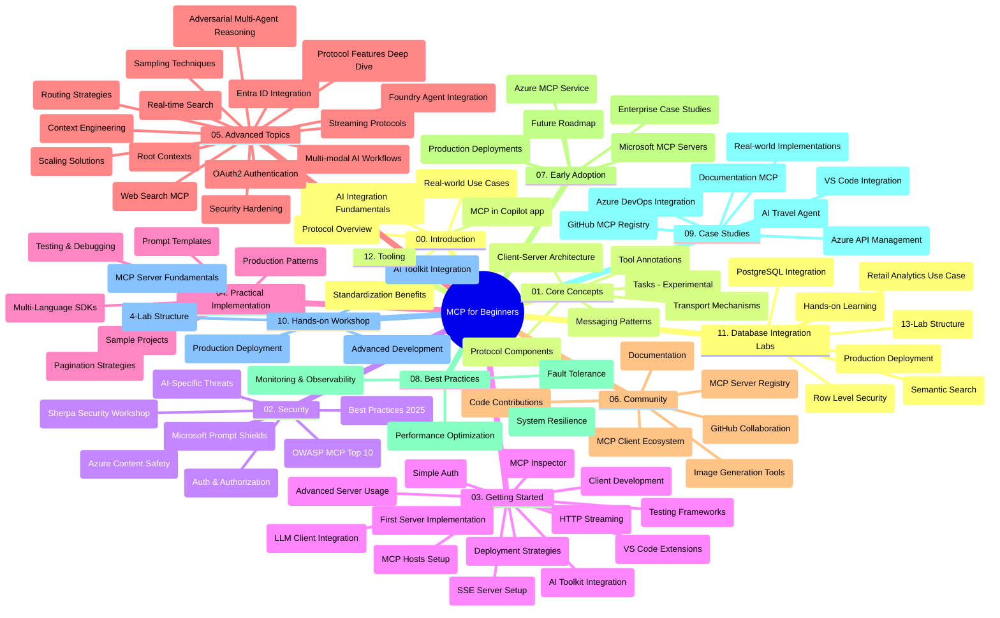

# โปรโตคอลบริบทของโมเดล (MCP) สำหรับผู้เริ่มต้น - คู่มือการศึกษา

คู่มือการศึกษานี้ให้ภาพรวมของโครงสร้างและเนื้อหาในที่เก็บข้อมูลสำหรับหลักสูตร "โปรโตคอลบริบทของโมเดล (MCP) สำหรับผู้เริ่มต้น" ใช้คู่มือนี้เพื่อสำรวจที่เก็บข้อมูลอย่างมีประสิทธิภาพและใช้ประโยชน์สูงสุดจากทรัพยากรที่มีอยู่

## ภาพรวมที่เก็บข้อมูล

โปรโตคอลบริบทของโมเดล (MCP) เป็นกรอบงานมาตรฐานสำหรับการโต้ตอบระหว่างโมเดล AI และแอปพลิเคชันลูกค้า ซึ่งเดิมสร้างโดย Anthropic และตอนนี้ถูกดูแลโดยชุมชน MCP ผ่านองค์กร GitHub อย่างเป็นทางการ ที่เก็บข้อมูลนี้ให้หลักสูตรที่ครอบคลุม พร้อมตัวอย่างโค้ดแบบลงมือทำใน C#, Java, JavaScript, Python และ TypeScript ออกแบบมาสำหรับนักพัฒนา AI สถาปนิกระบบ และวิศวกรซอฟต์แวร์

## แผนที่หลักสูตรภาพรวม

## โครงสร้างที่เก็บข้อมูล

ที่เก็บข้อมูลถูกจัดเป็นสิบสองส่วนหลัก ซึ่งแต่ละส่วนเน้นไปที่แง่มุมต่าง ๆ ของ MCP:

1. **บทนำ (00-Introduction/)**
   - ภาพรวมของโปรโตคอลบริบทของโมเดล
   - เหตุผลว่าทำไมการมาตรฐานจึงสำคัญในเส้นทาง AI
   - กรณีการใช้งานและประโยชน์เชิงปฏิบัติ

2. **แนวคิดหลัก (01-CoreConcepts/)**
   - สถาปัตยกรรมไคลเอนต์-เซิร์ฟเวอร์
   - ส่วนประกอบสำคัญของโปรโตคอล
   - รูปแบบการส่งข้อความใน MCP
   - ข้อกำหนดปัจจุบัน: [อะไรที่เปลี่ยนแปลงใน MCP: ข้อกำหนดวันที่ 2026-07-28](./01-CoreConcepts/mcp-2026-07-28.md) — โปรโตคอลหลักที่ไม่มีรัฐ, กรอบงานขยาย, และการเลิกใช้งาน Roots/Sampling/Logging

3. **ความปลอดภัย (02-Security/)**
   - ภัยคุกคามความปลอดภัยในระบบที่ใช้ MCP
   - แนวทางปฏิบัติที่ดีที่สุดสำหรับการรักษาความปลอดภัย
   - กลยุทธ์การรับรองตัวตนและการอนุญาต
   - ตัวอย่างการอนุญาต CIMD และ DCR แบบลงมือทำ [CIMD and DCR authorization sample](./02-Security/samples/cimd-dcr-auth/README.md)
   - **เอกสารความปลอดภัยครบถ้วน**:
     - แนวทางปฏิบัติที่ดีที่สุดด้านความปลอดภัย MCP
     - คู่มือการใช้งาน Azure Content Safety
     - การควบคุมและเทคนิคความปลอดภัย MCP
     - อ้างอิงด่วนแนวทางปฏิบัติที่ดีที่สุด MCP
   - **หัวข้อสำคัญด้านความปลอดภัย**:
     - การโจมตีด้วยการฉีดข้อความและการปนเปื้อนเครื่องมือ
     - การแอบแฝงเซสชันและปัญหา confused deputy
     - ช่องโหว่การส่งผ่านโทเค็น
     - สิทธิ์เกินควรและการควบคุมการเข้าถึง
     - ความปลอดภัยในห่วงโซ่อุปทานสำหรับส่วนประกอบ AI
     - การรวม Microsoft Prompt Shields

4. **เริ่มต้นใช้งาน (03-GettingStarted/)**
   - การตั้งค่าและกำหนดสภาพแวดล้อม
   - การสร้างเซิร์ฟเวอร์และไคลเอนต์ MCP เบื้องต้น
   - การบูรณาการกับแอปพลิเคชันที่มีอยู่
   - ประกอบด้วยส่วนสำหรับ:
     - การสร้างเซิร์ฟเวอร์ครั้งแรก
     - การพัฒนาไคลเอนต์
     - การรวมไคลเอนต์ LLM
     - การรวมกับ VS Code
     - เซิร์ฟเวอร์ Server-Sent Events (SSE)
     - การใช้งานเซิร์ฟเวอร์ขั้นสูง
     - การสตรีม HTTP
     - การรวม AI Toolkit
     - แนวทางการทดสอบ
     - แนวทางการนำไปใช้งาน

5. **การนำไปใช้งานเชิงปฏิบัติ (04-PracticalImplementation/)**
   - การใช้ SDK ในหลายภาษาโปรแกรม
   - เทคนิคการดีบั๊ก ทดสอบ และการยืนยัน
   - การสร้างเทมเพลตและเวิร์กโฟลว์คำสั่งล่วงหน้าที่นำกลับมาใช้ใหม่ได้
   - ตัวอย่างโครงการพร้อมตัวอย่างการนำไปใช้งาน

6. **หัวข้อขั้นสูง (05-AdvancedTopics/)**
   - เทคนิควิศวกรรมบริบท
   - การรวมตัวแทน Foundry
   - เวิร์กโฟลว์ AI แบบมัลติโมดัล
   - ตัวอย่างการรับรองตัวตน OAuth2
   - ความสามารถในการค้นหาแบบเรียลไทม์
   - การสตรีมแบบเรียลไทม์
   - การนำบริบท Root ไปใช้
   - กลยุทธ์การกำหนดเส้นทาง
   - เทคนิคการสุ่มตัวอย่าง
   - วิธีการสเกลระบบ
   - ข้อควรพิจารณาด้านความปลอดภัย
   - การรวมความปลอดภัย Entra ID
   - การรวมการค้นหาบนเว็บ
   - การให้เหตุผลแบบหลายตัวแทนที่เป็นการโต้แย้ง (รูปแบบดีเบต)

7. **การมีส่วนร่วมของชุมชน (06-CommunityContributions/)**
   - วิธีการมีส่วนร่วมในโค้ดและเอกสาร
   - การร่วมมือผ่าน GitHub
   - การพัฒนาที่ขับเคลื่อนโดยชุมชนและการแสดงความคิดเห็น
   - การใช้ไคลเอนต์ MCP ต่าง ๆ (Claude Desktop, Cline, VSCode)
   - การทำงานกับเซิร์ฟเวอร์ MCP ยอดนิยม รวมถึงการสร้างภาพ

8. **บทเรียนจากการนำไปใช้ในช่วงแรก (07-LessonsfromEarlyAdoption/)**
   - การนำไปใช้จริงและเรื่องราวความสำเร็จ
   - การสร้างและนำโซลูชัน MCP ไปใช้งาน
   - แนวโน้มและโร้ดแมปในอนาคต
   - **คู่มือเซิร์ฟเวอร์ MCP ของ Microsoft**: คู่มือครบถ้วนสำหรับเซิร์ฟเวอร์ MCP ที่พร้อมใช้งานจริง 10 ตัวรวมถึง:
     - Microsoft Learn Docs MCP Server
     - Azure MCP Server (ตัวเชื่อมต่อเฉพาะกว่า 15 ตัว)
     - GitHub MCP Server
     - Azure DevOps MCP Server
     - MarkItDown MCP Server
     - SQL Server MCP Server
     - Playwright MCP Server
     - Dev Box MCP Server
     - Microsoft Foundry MCP Server
     - Microsoft 365 Agents Toolkit MCP Server

9. **แนวทางปฏิบัติที่ดีที่สุด (08-BestPractices/)**
   - การปรับแต่งประสิทธิภาพและการเพิ่มประสิทธิผล
   - การออกแบบระบบ MCP ที่ทนทานต่อความผิดพลาด
   - แนวทางการทดสอบและความทนทาน

10. **กรณีศึกษา (09-CaseStudy/)**
    - **เจ็ดกรณีศึกษาครบถ้วน** แสดงความยืดหยุ่นของ MCP ในหลายสถานการณ์:
    - **ตัวแทนท่องเที่ยว AI บน Azure**: การประสานตัวแทนหลายตัวด้วย Azure OpenAI และ AI Search
    - **การรวม Azure DevOps**: การทำงานอัตโนมัติในเวิร์กโฟลว์ด้วยการอัปเดตข้อมูล YouTube
    - **การดึงข้อมูลเอกสารแบบเรียลไทม์**: ไคลเอนต์คอนโซล Python พร้อมการสตรีม HTTP
    - **ตัวสร้างแผนการศึกษาแบบโต้ตอบ**: เว็บแอป Chainlit พร้อม AI สนทนา
    - **เอกสารในตัวแก้ไข**: การรวม VS Code กับเวิร์กโฟลว์ GitHub Copilot
    - **การจัดการ API ด้วย Azure**: การรวม API โรงงานพร้อมการสร้างเซิร์ฟเวอร์ MCP
    - **ทะเบียน MCP บน GitHub**: การพัฒนาระบบนิเวศและแพลตฟอร์มการรวมตัวแทน
    - ตัวอย่างการนำไปใช้ครอบคลุมการผสานรวมองค์กร การเพิ่มผลผลิตนักพัฒนา และการพัฒนาระบบนิเวศ

11. **เวิร์กช็อปแบบลงมือทำ (10-StreamliningAIWorkflowsBuildingAnMCPServerWithAIToolkit/)**
    - เวิร์กช็อปแบบลงมือทำที่ครอบคลุมร่วมกับ MCP และ AI Toolkit
    - การสร้างแอปพลิเคชันอัจฉริยะที่เชื่อมโมเดล AI กับเครื่องมือโลกจริง
    - โมดูลปฏิบัติที่ครอบคลุมพื้นฐาน การพัฒนาเซิร์ฟเวอร์แบบกำหนดเอง และแนวทางการใช้งานในระบบจริง
    - **โครงสร้างห้องปฏิบัติการ**:
      - ห้องปฏิบัติการ 1: พื้นฐานเซิร์ฟเวอร์ MCP
      - ห้องปฏิบัติการ 2: การพัฒนาเซิร์ฟเวอร์ MCP ขั้นสูง
      - ห้องปฏิบัติการ 3: การรวม AI Toolkit
      - ห้องปฏิบัติการ 4: การนำไปใช้งานจริงและการสเกล
    - วิธีการเรียนรู้ผ่านห้องปฏิบัติการแบบทีละขั้นตอน

12. **ห้องปฏิบัติการรวมฐานข้อมูลเซิร์ฟเวอร์ MCP (11-MCPServerHandsOnLabs/)**
    - **เส้นทางการเรียนรู้ 13 ห้องปฏิบัติการครบถ้วน** สำหรับการสร้างเซิร์ฟเวอร์ MCP ที่พร้อมใช้งานจริงพร้อมการรวม PostgreSQL
    - **การนำไปใช้เชิงวิเคราะห์ค้าปลีกจริง** โดยใช้กรณีใช้งาน Zava Retail
    - **รูปแบบระดับองค์กร** รวมถึง Row Level Security (RLS), การค้นหาเชิงความหมาย และการเข้าถึงข้อมูลแบบผู้เช่าเดียวกันหลายราย
    - **โครงสร้างห้องปฏิบัติการครบถ้วน**:
      - **ห้องปฏิบัติการ 00-03: พื้นฐาน** - บทนำ, สถาปัตยกรรม, ความปลอดภัย, การตั้งค่าสภาพแวดล้อม
      - **ห้องปฏิบัติการ 04-06: การสร้างเซิร์ฟเวอร์ MCP** - การออกแบบฐานข้อมูล, การใช้งานเซิร์ฟเวอร์ MCP, การพัฒนาเครื่องมือ

      - **แลป 07-09: ฟีเจอร์ขั้นสูง** - การค้นหาเชิงความหมาย, การทดสอบ & การดีบัก, การรวมกับ VS Code
      - **แลป 10-12: การผลิต & แนวปฏิบัติที่ดีที่สุด** - การปรับใช้, การตรวจสอบ, การเพิ่มประสิทธิภาพ
    - **เทคโนโลยีที่ครอบคลุม**: FastMCP framework, PostgreSQL, Azure OpenAI, Azure Container Apps, Application Insights
    - **ผลลัพธ์การเรียนรู้**: เซิร์ฟเวอร์ MCP พร้อมใช้งานจริง, รูปแบบการผสานฐานข้อมูล, การวิเคราะห์ด้วย AI, ความปลอดภัยระดับองค์กร

13. **เครื่องมือ (12-tooling/)**
    - เรียนรู้วิธีใช้งาน MCP ในแอป Copilot และเครื่องมืออื่น ๆ

## แหล่งข้อมูลเพิ่มเติม

ที่เก็บนี้มีแหล่งข้อมูลสนับสนุนดังนี้:

- **โฟลเดอร์รูปภาพ**: มีแผนภาพและภาพประกอบที่ใช้ตลอดหลักสูตร
- **การแปลภาษา**: รองรับหลายภาษาโดยมีการแปลเอกสารอัตโนมัติ
- **แหล่งข้อมูล MCP อย่างเป็นทางการ**:
  - [เอกสาร MCP](https://modelcontextprotocol.io/)
  - [ข้อกำหนด MCP](https://modelcontextprotocol.io/specification/2026-07-28/)
  - [ที่เก็บ GitHub ของ MCP](https://github.com/modelcontextprotocol)

## วิธีใช้ที่เก็บนี้

1. **การเรียนรู้อย่างลำดับ**: ทำตามบทเรียนตามลำดับ (00 ถึง 11) เพื่อประสบการณ์การเรียนรู้ที่มีโครงสร้าง
2. **เน้นภาษาการเขียนโปรแกรมเฉพาะ**: หากสนใจภาษาการเขียนโปรแกรมใด ให้สำรวจไดเรกทอรีตัวอย่างสำหรับการใช้งานในภาษาที่คุณชอบ
3. **การใช้งานจริง**: เริ่มจากส่วน "เริ่มต้นใช้งาน" เพื่อตั้งค่าสภาพแวดล้อมและสร้างเซิร์ฟเวอร์ MCP และไคลเอนต์ตัวแรกของคุณ
4. **การสำรวจขั้นสูง**: เมื่อเข้าใจพื้นฐานแล้ว ให้เจาะลึกหัวข้อขั้นสูงเพื่อขยายความรู้ของคุณ
5. **การมีส่วนร่วมกับชุมชน**: เข้าร่วมชุมชน MCP ผ่านการสนทนาใน GitHub และช่อง Discord เพื่อเชื่อมต่อกับผู้เชี่ยวชาญและนักพัฒนาร่วมกัน

## ไคลเอนต์และเครื่องมือ MCP

หลักสูตรครอบคลุมไคลเอนต์และเครื่องมือ MCP ต่าง ๆ:

1. **ไคลเอนต์ทางการ**:
   - Visual Studio Code 
   - MCP ใน Visual Studio Code
   - Claude Desktop
   - Claude ใน VSCode 
   - Claude API

2. **ไคลเอนต์จากชุมชน**:
   - Cline (บนเทอร์มินัล)
   - Cursor (โปรแกรมแก้ไขโค้ด)
   - ChatMCP
   - Windsurf

3. **เครื่องมือจัดการ MCP**:
   - MCP CLI
   - MCP Manager
   - MCP Linker
   - MCP Router

## เซิร์ฟเวอร์ MCP ที่นิยม

ที่เก็บนี้แนะนำเซิร์ฟเวอร์ MCP หลากหลาย รวมถึง:

1. **เซิร์ฟเวอร์ MCP ของ Microsoft อย่างเป็นทางการ**:
   - Microsoft Learn Docs MCP Server
   - Azure MCP Server (เชื่อมต่อเฉพาะทางมากกว่า 15 รายการ)
   - GitHub MCP Server
   - Azure DevOps MCP Server
   - MarkItDown MCP Server
   - SQL Server MCP Server
   - Playwright MCP Server
   - Dev Box MCP Server
   - Microsoft Foundry MCP Server
   - Microsoft 365 Agents Toolkit MCP Server

2. **เซิร์ฟเวอร์อ้างอิงอย่างเป็นทางการ**:
   - Filesystem
   - Fetch
   - Memory
   - Sequential Thinking

3. **การสร้างภาพ**:
   - Azure OpenAI DALL-E 3
   - Stable Diffusion WebUI
   - Replicate

4. **เครื่องมือพัฒนา**:
   - Git MCP
   - Terminal Control
   - Code Assistant

5. **เซิร์ฟเวอร์เฉพาะทาง**:
   - Salesforce
   - Microsoft Teams
   - Jira & Confluence

## การมีส่วนร่วม

ที่เก็บนี้ยินดีต้อนรับการมีส่วนร่วมจากชุมชน ดูส่วนการมีส่วนร่วมของชุมชนเพื่อคำแนะนำเกี่ยวกับวิธีการมีส่วนร่วมอย่างมีประสิทธิภาพในระบบนิเวศ MCP

----

*คู่มือการศึกษานี้ได้รับการปรับปรุงล่าสุดเมื่อวันที่ 9 กันยายน 2026 สะท้อนถึง MCP
Specification `2026-07-28` ซึ่งเป็นการแก้ไขโปรโตคอลปัจจุบัน ตัวอย่างบางรายการที่ทำเองยังคงระบุเวอร์ชันชัดเจนเป็น `2025-11-25` ในขณะที่ SDK และเครื่องมือของพวกเขา
ใช้ API โปรโตคอลแบบไม่มีสถานะ*

---

<!-- CO-OP TRANSLATOR DISCLAIMER START -->
**ปฏิเสธความรับผิดชอบ**:
เอกสารนี้ได้รับการแปลโดยใช้บริการแปลภาษา AI [Co-op Translator](https://github.com/Azure/co-op-translator) ขณะที่เราพยายามให้ความถูกต้อง โปรดทราบว่าการแปลโดยอัตโนมัติอาจมีข้อผิดพลาดหรือความไม่ถูกต้อง เอกสารต้นฉบับในภาษาต้นทางควรถูกพิจารณาเป็นแหล่งข้อมูลที่เชื่อถือได้ สำหรับข้อมูลที่สำคัญ แนะนำให้ใช้การแปลโดยมนุษย์มืออาชีพ เราไม่รับผิดชอบต่อความเข้าใจผิดหรือการตีความที่ผิดพลาดที่เกิดขึ้นจากการใช้การแปลนี้
<!-- CO-OP TRANSLATOR DISCLAIMER END -->