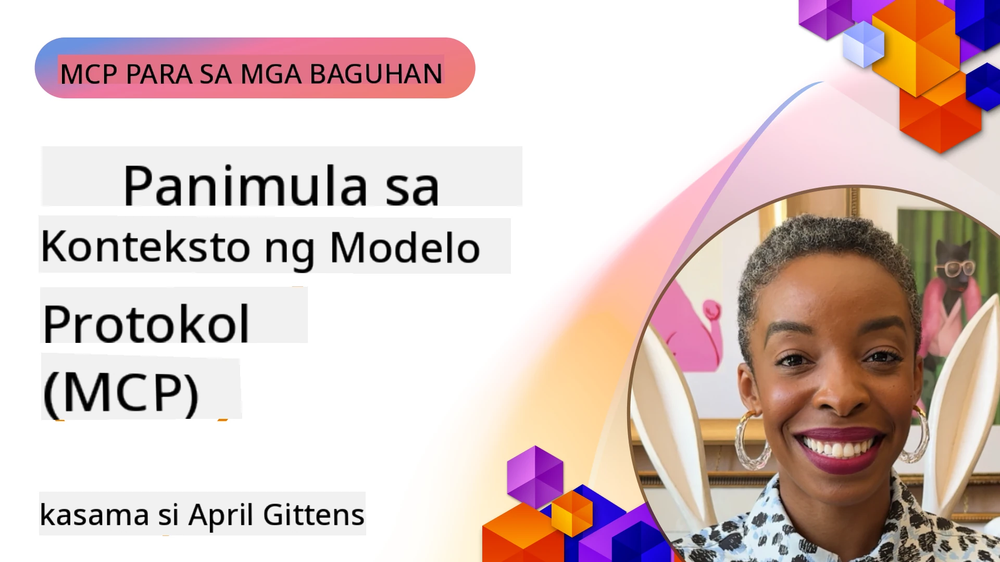
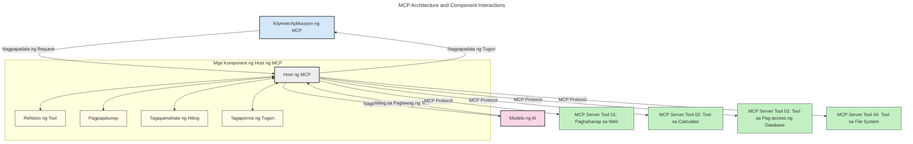
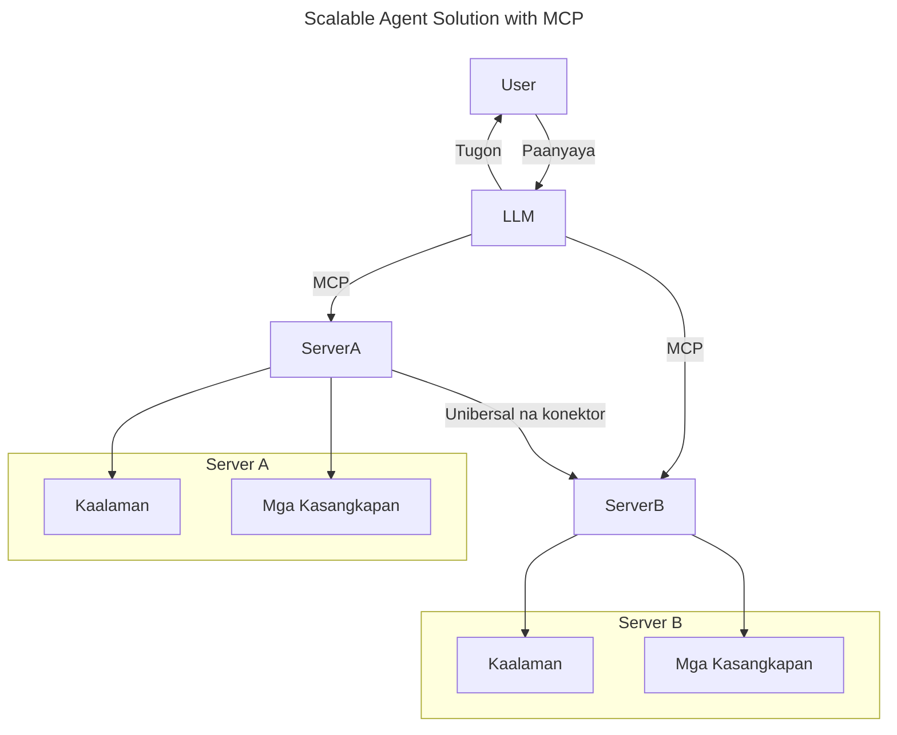
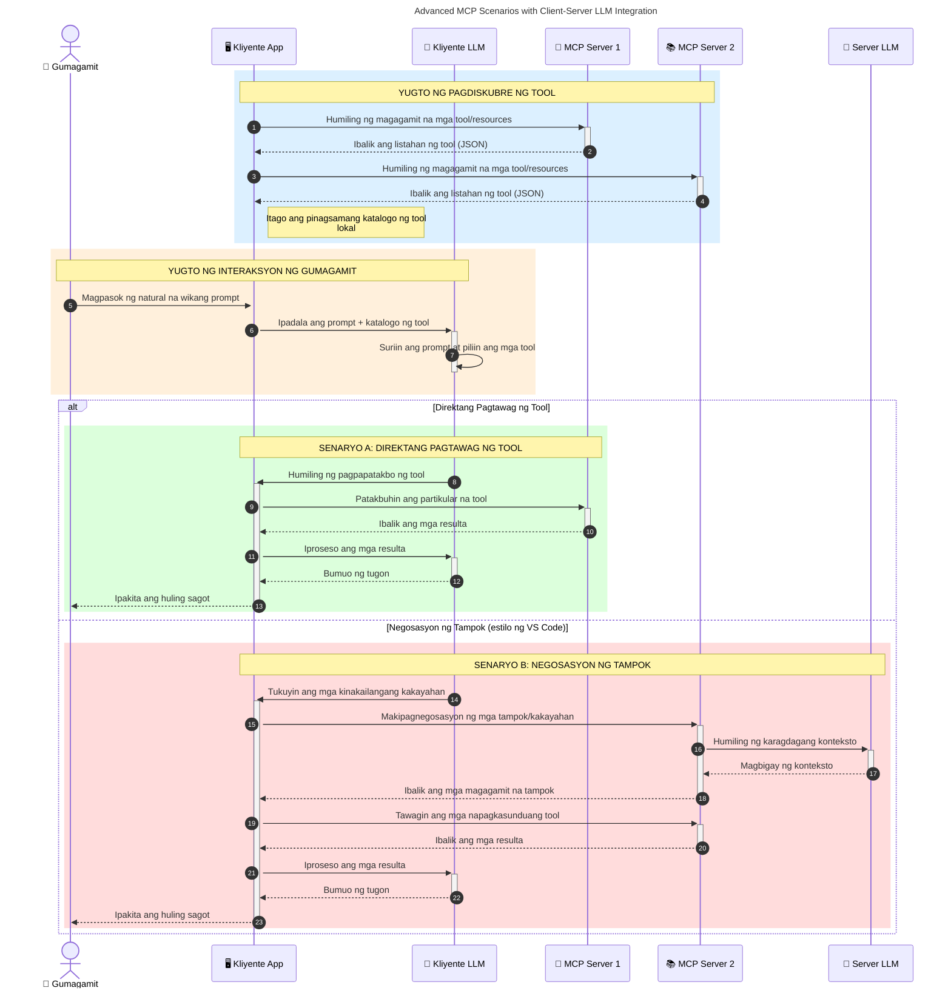

# Panimula sa Model Context Protocol (MCP): Bakit Mahalaga Ito para sa Mga Scalable na AI Application

_(I-click ang larawan sa itaas upang panoorin ang video ng araling ito)_

Ang mga generative AI application ay isang malaking hakbang pasulong dahil madalas nilang pinapayagan ang gumagamit na makipag-ugnayan sa app gamit ang natural na mga prompt ng wika. Gayunpaman, habang mas maraming oras at mga mapagkukunan ang inilalagak sa ganitong mga app, nais mong matiyak na madali mong maisasama ang mga functionality at mga mapagkukunan sa paraang madali itong mapalawak, na kaya ng iyong app na tugunan ang higit sa isang modelo na ginagamit, at mai-handle ang iba't ibang mga intricacy ng modelo. Sa madaling salita, madali ang paggawa ng Gen AI app sa simula, ngunit habang lumalaki at nagiging mas kumplikado ito, kailangan mong simulan ang pagdedeklara ng isang arkitektura at malamang na kakailanganin mong umasa sa isang pamantayan upang matiyak na ang iyong mga app ay ginawa sa isang pare-parehong paraan. Dito pumapasok ang MCP upang ayusin ang mga bagay at magbigay ng isang pamantayan.

---

## **🔍 Ano ang Model Context Protocol (MCP)?**

Ang **Model Context Protocol (MCP)** ay isang **bukas, standardisadong interface** na nagpapahintulot sa Large Language Models (LLMs) na makipag-ugnayan nang maayos sa mga panlabas na tool, API, at mapagkukunan ng datos. Nagbibigay ito ng isang pare-parehong arkitektura upang mapahusay ang functionality ng AI model lampas sa kanilang training data, na nagpapagana ng mas matalino, scalable, at mas tumutugong mga sistema ng AI.

---

## **🎯 Bakit Mahalaga ang Standardisasyon sa AI**

Habang ang mga generative AI application ay nagiging mas kumplikado, mahalaga na magpatibay ng mga pamantayan na nagsisiguro ng **scalability, extensibility, maintainability,** at **pag-iwas sa vendor lock-in**. Tinutugunan ng MCP ang mga pangangailangang ito sa pamamagitan ng:

- Pagsasama-sama ng mga integrasyon ng modelo at tool
- Pagbabawas ng mga marupok, isang beses lang na mga custom na solusyon
- Pagbibigay-daan sa maraming modelo mula sa iba't ibang vendor na mag-coexist sa isang ecosystem

**Tandaan:** Bagaman ipinapahayag ng MCP na ito ay isang bukas na pamantayan, wala pang mga plano na gawing standardize ang MCP sa pamamagitan ng anumang umiiral na mga katawan ng pamantayan tulad ng IEEE, IETF, W3C, ISO, o anumang iba pang katawan ng pamantayan.

---

## **📚 Mga Layunin sa Pagkatuto**

Sa pagtatapos ng artikulong ito, magagawa mong:

- I-defina ang **Model Context Protocol (MCP)** at ang mga gamit nito
- Maunawaan kung paano standardisado ng MCP ang komunikasyon ng modelo-to-tool
- Tukuyin ang mga pangunahing bahagi ng arkitektura ng MCP
- Suriin ang mga totoong aplikasyon ng MCP sa mga konteksto ng enterprise at development

---

## **💡 Bakit Isang Game-Changer ang Model Context Protocol (MCP)**

### **🔗 Nilulutas ng MCP ang Fragmentation sa AI Interactions**

Bago ang MCP, ang pagsasama ng mga modelo sa mga tool ay nangangailangan ng:

- Custom na code para sa bawat tool-model na pares
- Mga non-standard na API para sa bawat vendor
- Madalas na pagkakabasag dahil sa mga update
- Mahinang scalability habang dumadami ang mga tool

### **✅ Mga Benepisyo ng Standardisasyon ng MCP**

| **Benepisyo**                 | **Deskripsyon**                                                                  |
|-----------------------------|---------------------------------------------------------------------------------|
| Interoperability             | Ang mga LLM ay gumagana nang maayos kasama ang mga tool mula sa iba't ibang vendor |
| Consistency                  | Pare-parehong pag-uugali sa iba't ibang platform at mga tool                     |
| Reusability                  | Mga tool na nagawa isang beses ay pwedeng gamitin sa iba't ibang proyekto at sistema |
| Pinabilis na Development     | Binabawasan ang oras sa pag-develop gamit ang standardisadong, plug-and-play na mga interface |

---

## **🧱 Mataas na Antas ng MCP Arkitektura**

Sinusundan ng MCP ang isang **client-server model**, kung saan:

- **MCP Hosts** ang nagpapatakbo ng mga AI modelo
- **MCP Clients** ang nagsisimula ng mga request
- **MCP Servers** ang naghahatid ng konteksto, mga tool, at mga kakayahan

### **Pangunahing Bahagi:**

- **Mga Resources** – Static o dynamic na datos para sa mga modelo  
- **Mga Prompts** – Predefined na mga workflow para sa guided na pagbuo  
- **Mga Tool** – Mga executable na function tulad ng paghahanap, kalkulasyon  
- **Sampling** – Agentic na pag-uugali sa pamamagitan ng recursive na interaksyon (deprecated sa
    MCP `2026-07-28`; ang mga bagong implementasyon ay dapat direktang makipag-integrate sa provider ng LLM)

- **Elicitation** – Mga hiling na inisyal ng server para sa input ng user
- **Mga Roots** – Mga lokasyon ng filesystem na impormasyon na may kaugnayan sa isang server
    (deprecated sa MCP `2026-07-28`; mas prefer ang mga parameter ng tool, mga URI ng resource, o
    configuration ng server)

### **Arkitektura ng Protocol:**

Gumagamit ang MCP ng dalawang-layer na arkitektura:
- **Data Layer**: Mga mensaheng JSON-RPC 2.0, metadata sa bawat request, discovery, at mga primitive sa protocol
- **Transport Layer**: stdio para sa mga lokal na subprocess at Streamable HTTP para sa malalayong server. Maaaring gamitin ng Streamable HTTP ang SSE framing para sa streamed na mga tugon, ngunit ang mas luma HTTP+SSE transport ay deprecated.

---

## Paano Gumagana ang MCP Servers

Ang mga MCP server ay gumagana sa sumusunod na paraan:

- **Daloy ng Request**:
    1. Isang request ang iniinitiate ng isang end user o software na kumakatawan sa kanila.
    2. Ang **MCP Client** ay nagpapadala ng request sa isang **MCP Host**, na nagma-manage ng AI Model runtime.
    3. Tinatanggap ng **AI Model** ang user prompt at maaaring humiling ng access sa panlabas na mga tool o datos sa pamamagitan ng isa o higit pang mga tool calls.
    4. Ang **MCP Host**, hindi ang modelo mismo, ang nakikipagkomunikasyon sa angkop na **MCP Server(s)** gamit ang standardisadong protocol.
- **Pagganap ng MCP Host**:
    - **Tool Registry**: Nagpapanatili ng katalogo ng mga available na tool at kanilang mga kakayahan.
    - **Authentication**: Nagve-verify ng mga permiso para sa access sa mga tool.
    - **Request Handler**: Nagpoproseso ng mga papasok na request ng tool mula sa modelo.
    - **Response Formatter**: Inaayos ang output ng tool sa format na maiintindihan ng modelo.
- **Pagpapatakbo ng MCP Server**:
    - Iniruruta ng **MCP Host** ang mga tool calls sa isa o higit pang mga **MCP Servers**, bawat isa ay nagpapakita ng espesyal na mga function (hal. paghahanap, kalkulasyon, query sa database).
    - Isinasagawa ng **MCP Servers** ang kani-kanilang mga operasyon at ibinabalik ang mga resulta sa **MCP Host** sa isang pare-parehong format.
    - Inaayos at ipinapadala ng **MCP Host** ang mga resulta na ito sa **AI Model**.
- **Pagtatapos ng Tugon**:
    - Isinasama ng **AI Model** ang mga output ng tool sa isang pangwakas na tugon.
    - Ipinapadala ng **MCP Host** ang tugon pabalik sa **MCP Client**, na naghahatid nito sa end user o tumatawag na software.
    

## 👨‍💻 Paano Gumawa ng MCP Server (May mga Halimbawa)

Pinapayagan ng mga MCP server na palawakin ang mga kakayahan ng LLM sa pamamagitan ng pagbibigay ng datos at functionality. 

Handa ka na bang subukan? Narito ang mga SDK na tukoy sa wika at/o stack kasama ang mga halimbawa ng paggawa ng simpleng MCP servers sa iba't ibang wika/stack:

- **Python SDK**: https://github.com/modelcontextprotocol/python-sdk

- **TypeScript SDK**: https://github.com/modelcontextprotocol/typescript-sdk

- **Java SDK**: https://github.com/modelcontextprotocol/java-sdk

- **C#/.NET SDK**: https://github.com/modelcontextprotocol/csharp-sdk

## 🌍 Mga Totoong Gamit ng MCP

Pinapagana ng MCP ang malawak na hanay ng aplikasyon sa pamamagitan ng pagpapalawak ng mga kakayahan ng AI:

| **Aplikasyon**               | **Deskripsyon**                                                                |
|------------------------------|--------------------------------------------------------------------------------|
| Enterprise Data Integration  | Ikonekta ang mga LLM sa mga database, CRM, o panloob na mga tool                |
| Agentic AI Systems           | Pahintulutan ang mga autonomous na agent na may access sa tool at workflows sa paggawa ng desisyon |
| Multi-modal Applications     | Pagsamahin ang text, larawan, at audio na mga tool sa iisang pinagsama-samang AI app |
| Real-time Data Integration   | Dalhin ang live na datos sa AI interaction para sa mas tumpak at napapanahong mga output |

### 🧠 MCP = Universal Standard para sa AI Interactions

Ang Model Context Protocol (MCP) ay gumaganap bilang isang universal standard para sa AI interactions, katulad ng kung paano na-standardize ng USB-C ang mga pisikal na koneksyon para sa mga device. Sa mundo ng AI, nagbibigay ang MCP ng isang pare-parehong interface, na nagpapahintulot sa mga modelo (clients) na madaling maisama sa mga panlabas na tool at mga tagapagbigay ng datos (servers). Nililimitahan nito ang pangangailangan para sa iba-ibang, custom na mga protocol para sa bawat API o mapagkukunan ng datos.

Sa ilalim ng MCP, ang isang MCP-compatible na tool (tinatawag na MCP server) ay sumusunod sa isang pinag-isang pamantayan. Maaaring ilista ng mga server na ito ang mga tool o aksyon na kanilang inaalok at isagawa ang mga aksyong iyon kapag hiniling ng AI agent. Ang mga platform ng AI agent na sumusuporta sa MCP ay may kakayahang tuklasin ang mga available na tool mula sa mga server at i-invoke ang mga ito sa pamamagitan ng standard na protocol na ito.

### 💡 Nagpapadali ng access sa kaalaman

Higit pa sa pag-aalok ng mga tool, pinapadali rin ng MCP ang access sa kaalaman. Pinapahintulutan nito ang mga aplikasyon na magbigay ng konteksto sa malalaking language model (LLM) sa pamamagitan ng pagkonekta sa kanila sa iba't ibang mga pinagmumulan ng datos. Halimbawa, maaaring kumatawan ang isang MCP server bilang repositoryo ng dokumento ng isang kumpanya, na nagpapahintulot sa mga agent na makakuha ng kaugnay na impormasyon ayon sa demand. Ang isa pang server ay maaaring humawak ng mga partikular na aksyon tulad ng pagpapadala ng email o pag-update ng mga rekord. Mula sa pananaw ng agent, ito ay mga tool lamang na maaaring gamitin—ang ilan ay nagbabalik ng datos (context ng kaalaman), habang ang iba ay gumaganap ng mga aksyon. Epektibong pinamamahalaan ng MCP ang pareho.

Ang isang agent na kumokonekta sa isang MCP server ay awtomatikong natututuhan ang mga available na kakayahan ng server at ang mga datos na maa-access sa pamamagitan ng isang standard na format. Pinapagana ng standardisasyong ito ang dynamic na availability ng tool. Halimbawa, ang pagdagdag ng bagong MCP server sa sistema ng isang agent ay ginagawa ang mga function nito kaagad na magagamit nang hindi nangangailangan ng karagdagang customisasyon sa mga utos ng agent.

Ang pinadaling pagsasama na ito ay naaayon sa daloy na ipinapakita sa sumusunod na diagram, kung saan ang mga server ay nagbibigay ng parehong tool at kaalaman, na nagsisiguro ng maayos na pagtutulungan sa pagitan ng mga sistema. 

### 👉 Halimbawa: Scalable Agent Solution

Ang Universal Connector ay nagpapahintulot sa MCP servers na makipag-ugnayan at magbahagi ng kakayahan sa isa't isa, na nagpapahintulot sa ServerA na ipagkatiwala ang mga gawain sa ServerB o ma-access ang mga tool at kaalaman nito. Ito ay nagfederate ng mga tool at datos sa pagitan ng mga server, na sumusuporta sa scalable at modular na arkitektura ng agent. Dahil na-standardize ng MCP ang pag-expose ng tool, maaaring dynamic na matuklasan ng mga agent at maire-route ang mga request sa pagitan ng mga server nang hindi kailangang hardcoded na pagsasama.

Federation ng tool at kaalaman: Maaaring ma-access ang mga tool at datos sa iba't ibang server, na nagpapahintulot sa mas scalable at modular na arkitektura ng agentic.

### 🔄 Advanced na MCP Scenarios kasama ang Client-Side LLM Integration

Higit pa sa simpleng arkitektura ng MCP, may mga advanced na scenario kung saan parehong ang client at server ay may LLM, na nagpapahintulot ng mas sopistikadong mga interaksyon. Sa sumusunod na diagram, ang **Client App** ay maaaring isang IDE na may ilang MCP tool na magagamit ng LLM:

## 🔐 Praktikal na Mga Benepisyo ng MCP

Narito ang mga praktikal na benepisyo ng paggamit ng MCP:

- **Kabaguhan**: Maaaring ma-access ng mga modelo ang mga napapanahong impormasyon lampas sa kanilang training data
- **Pagpapalawak ng Kakayahan**: Maaaring gamitin ng mga modelo ang mga espesyal na tool para sa mga gawain na hindi nila na-train para sa
- **Pagbawas ng Hallucinations**: Ang mga panlabas na mapagkukunan ng datos ay nagbibigay ng factual grounding
- **Pribasiya**: Ang sensitibong datos ay maaaring manatili sa loob ng mga secure na kapaligiran sa halip na maisama sa mga prompt

## 📌 Mga Pangunahing Punto

Narito ang mga pangunahing punto para sa paggamit ng MCP:

- **Ang MCP** ay standardisado kung paano nakikipag-ugnayan ng mga AI model sa mga tool at datos
- Nagpapalaganap ng **extensibility, consistency, at interoperability**
- Tinutulungan ng MCP na **bawasan ang oras ng pag-develop, pagbutihin ang pagiging maaasahan, at palawakin ang kakayahan ng modelo**
- Ang client-server arkitektura **ay nagpapahintulot sa mga flexible, extensible na AI application**

## 🧠 Ehersisyo

Isipin ang isang AI application na interesado kang gawin.

- Anong mga **panlabas na tool o datos** ang maaaring magpalawak ng mga kakayahan nito?
- Paano mapapadali at mapagkakatiwalaan ang integrasyon gamit ang MCP?

## Karagdagang Mga Mapagkukunan

- [MCP GitHub Repository](https://github.com/modelcontextprotocol)

## Ano ang susunod

Susunod: [Kabanata 1: Mga Pangunahing Konsepto](../01-CoreConcepts/README.md)

---

<!-- CO-OP TRANSLATOR DISCLAIMER START -->
**Pagtatanggi**:
Ang dokumentong ito ay isinalin gamit ang serbisyo ng AI translation na [Co-op Translator](https://github.com/Azure/co-op-translator). Bagama't nagsusumikap kami para sa katumpakan, pakatandaan na ang awtomatikong pagsasalin ay maaaring maglaman ng mga pagkakamali o hindi pagkakatugma. Ang orihinal na dokumento sa orihinal nitong wika ang dapat ituring na pangunahing sanggunian. Para sa mahahalagang impormasyon, inirerekomenda ang propesyonal na pagsasalin ng tao. Hindi kami mananagot sa anumang maling pagkakaintindi o maling interpretasyon na nagmula sa paggamit ng pagsasaling ito.
<!-- CO-OP TRANSLATOR DISCLAIMER END -->