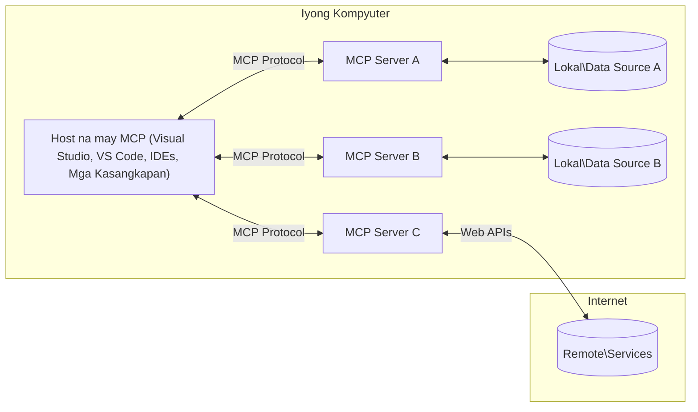

# MCP Core Concepts: Mastering the Model Context Protocol for AI Integration

[](https://youtu.be/earDzWGtE84)

_(I-click ang larawan sa itaas upang panoorin ang video ng araling ito)_

Ang [Model Context Protocol (MCP)](https://github.com/modelcontextprotocol) ay isang makapangyarihan, standardized na balangkas na nag-o-optimize ng komunikasyon sa pagitan ng Large Language Models (LLMs) at mga panlabas na kasangkapan, aplikasyon, at mga pinagkukunan ng datos.  
Ang gabay na ito ay maglalakad sa iyo sa mga pangunahing konsepto ng MCP. Matututuhan mo ang tungkol sa client-server architecture nito, mahahalagang bahagi, mekanismo ng komunikasyon, at mga pinakamahusay na kasanayan sa pagpapatupad.

- **Tiyak na Pahintulot ng Gumagamit**: Lahat ng pag-access sa datos at mga operasyon ay nangangailangan ng tiyak na pahintulot ng gumagamit bago isagawa. Dapat malinaw na maunawaan ng mga gumagamit kung anong datos ang maa-access at anong mga aksyon ang isasagawa, na may detalyadong kontrol sa mga pahintulot at awtorisasyon.

- **Proteksyon sa Privacy ng Datos**: Ang datos ng gumagamit ay inilalantad lamang sa may tiyak na pahintulot at dapat protektahan ng matibay na mga kontrol sa pag-access sa buong lifecycle ng interaksyon. Dapat pigilan ng mga pagpapatupad ang hindi awtorisadong pagpapadala ng datos at panatilihin ang mahigpit na mga hangganan ng privacy.

- **Kaligtasan sa Pagsasagawa ng Kasangkapan**: Bawat pagtawag sa kasangkapan ay nangangailangan ng tiyak na pahintulot ng gumagamit na may malinaw na pag-unawa sa functionality, mga parameter, at posibleng epekto ng kasangkapan. Dapat pigilan ng matibay na mga hangganan sa seguridad ang hindi sinasadyang, hindi ligtas, o malisyosong pagsasagawa ng kasangkapan.

- **Seguridad ng Transport Layer**: Lahat ng mga channel ng komunikasyon ay dapat gumamit ng angkop na encryption at mga mekanismo ng pagpapatunay. Ang mga remote na koneksyon ay dapat magpatupad ng mga secure na transport protocol at wastong pamamahala ng kredensyal.

#### Mga Patnubay sa Pagpapatupad:

- **Pamamahala ng Pahintulot**: Magpatupad ng mga sistemang may detalyadong pahintulot na nagpapahintulot sa mga gumagamit na kontrolin kung aling mga server, kasangkapan, at mga pinagkukunan ang maa-access  
- **Pagpapatunay at Awtorisasyon**: Gumamit ng mga secure na paraan ng pagpapatunay (OAuth, API keys) na may wastong pamamahala ng token at expiration  
- **Pagpapatunay ng Input**: Patunayan ang lahat ng mga parameter at input ng datos ayon sa mga tinukoy na schema upang maiwasan ang injection attacks  
- **Audit Logging**: Panatilihin ang komprehensibong mga log ng lahat ng operasyon para sa seguridad at pagsunod

## Pangkalahatang-ideya

Tinutuklas ng araling ito ang pundamental na arkitektura at mga bahagi na bumubuo sa Model Context Protocol (MCP) ecosystem. Matututuhan mo ang tungkol sa client-server architecture, mga pangunahing bahagi, at mga mekanismo ng komunikasyon na nagpapagana sa mga interaksyon ng MCP.

## Mga Pangunahing Layunin sa Pagkatuto

Sa pagtatapos ng araling ito, ikaw ay:

- Mauunawaan ang MCP client-server architecture.  
- Makikilala ang mga tungkulin at responsibilidad ng Hosts, Clients, at Servers.  
- Masusuri ang mga pangunahing tampok na nagpapaluwag sa MCP bilang isang layer ng integrasyon.  
- Matututuhan kung paano dumadaloy ang impormasyon sa loob ng MCP ecosystem.  
- Makakakuha ng praktikal na kaalaman sa pamamagitan ng mga halimbawa ng code sa .NET, Java, Python, at JavaScript.

## MCP Architecture: Mas Malalim na Pagsilip

Ang MCP ecosystem ay nakabatay sa isang client-server model. Ang modular na estrukturang ito ay nagpapahintulot sa mga AI application na makipag-ugnayan sa mga kasangkapan, database, API, at mga contextual na pinagkukunan nang mahusay. Hatiin natin ang arkitekturang ito sa mga pangunahing bahagi nito.

Sa pinakapuso nito, sumusunod ang MCP sa isang client-server architecture kung saan ang isang host application ay maaaring kumonekta sa maraming mga server:


- **MCP Hosts**: Mga programa tulad ng VSCode, Claude Desktop, IDEs, o mga AI tool na nais mag-access ng datos sa pamamagitan ng MCP  
- **MCP Clients**: Mga protocol client na nagpapanatili ng 1:1 na koneksyon sa mga server  
- **MCP Servers**: Mga magagaan na programa na bawat isa ay naglalantad ng mga partikular na kakayahan sa pamamagitan ng standardized na Model Context Protocol  
- **Local Data Sources**: Mga file, database, at serbisyo ng iyong computer na maaaring ma-access nang ligtas ng mga MCP server  
- **Remote Services**: Mga panlabas na sistema na available sa internet na maaaring konektahan ng mga MCP server sa pamamagitan ng mga API.

Ang MCP Protocol ay isang umuusbong na standard na gumagamit ng date-based versioning (format na YYYY-MM-DD). Ang kasalukuyang bersyon ng protocol ay **2025-11-25**. Maaari mong makita ang mga pinakabagong update sa [protocol specification](https://modelcontextprotocol.io/specification/2025-11-25/)

### 1. Hosts

Sa Model Context Protocol (MCP), ang **Hosts** ay mga AI application na nagsisilbing pangunahing interface kung saan nakikipag-ugnayan ang mga gumagamit sa protocol. Pinamumunuan at pinamamahalaan ng mga Hosts ang mga koneksyon sa maraming MCP server sa pamamagitan ng paglikha ng dedikadong MCP client para sa bawat koneksyon ng server. Mga halimbawa ng Hosts ay:

- **AI Applications**: Claude Desktop, Visual Studio Code, Claude Code  
- **Development Environments**: IDEs at mga code editor na may integrasyon ng MCP  
- **Custom Applications**: Mga purpose-built na AI agent at mga kasangkapan

Ang **Hosts** ay mga aplikasyon na nag-oorganisa ng mga interaksyon ng AI model. Sila ay:

- **Nag-oorganisa ng AI Models**: Nagpapatupad o nakikipag-ugnayan sa LLMs upang makabuo ng mga tugon at mag-coordinate ng mga AI workflow  
- **Namamahala ng Client Connections**: Lumilikha at nagpapanatili ng isang MCP client para sa bawat koneksyon ng MCP server  
- **Kinokontrol ang User Interface**: Pinangangasiwaan ang daloy ng pag-uusap, interaksyon ng gumagamit, at presentasyon ng tugon  
- **Nagpapatupad ng Seguridad**: Kinokontrol ang mga pahintulot, mga limitasyon sa seguridad, at pagpapatunay  
- **Humahawak ng Pahintulot ng Gumagamit**: Pinamamahalaan ang pag-apruba ng gumagamit para sa pagbabahagi ng datos at pagsasagawa ng kasangkapan

### 2. Clients

Ang **Clients** ay mahahalagang bahagi na nagpapanatili ng dedikadong one-to-one na koneksyon sa pagitan ng Hosts at MCP server. Bawat MCP client ay nililikha ng Host upang kumonekta sa isang partikular na MCP server, na nagsisiguro ng organisado at ligtas na mga channel ng komunikasyon. Pinapayagan ng maraming client ang Hosts na kumonekta sa maraming server nang sabay-sabay.

Ang **Clients** ay mga connector na bahagi sa loob ng host application. Sila ay:

- **Protocol Communication**: Nagpapadala ng JSON-RPC 2.0 na mga kahilingan sa mga server na may mga prompt at mga tagubilin  
- **Capability Negotiation**: Nakikipag-negosasyon ng mga suportadong tampok at bersyon ng protocol sa mga server sa panahon ng initialization  
- **Tool Execution**: Pinamamahalaan ang mga kahilingan sa pagsasagawa ng kasangkapan mula sa mga modelo at pinoproseso ang mga tugon  
- **Real-time Updates**: Humahawak ng mga notification at real-time na update mula sa mga server  
- **Response Processing**: Pinoproseso at inaayos ang mga tugon ng server para ipakita sa mga gumagamit

### 3. Servers

Ang **Servers** ay mga programa na nagbibigay ng konteksto, mga kasangkapan, at kakayahan sa mga MCP client. Maaari silang tumakbo nang lokal (sa parehong makina ng Host) o remote (sa mga panlabas na platform), at responsable sa paghawak ng mga kahilingan ng client at pagbibigay ng mga istrukturadong tugon. Naglalantad ang mga server ng partikular na functionality sa pamamagitan ng standardized na Model Context Protocol.

Ang **Servers** ay mga serbisyo na nagbibigay ng konteksto at kakayahan. Sila ay:

- **Feature Registration**: Nagpaparehistro at naglalantad ng mga available na primitives (mga pinagkukunan, prompt, kasangkapan) sa mga client  
- **Request Processing**: Tumanggap at nagpapatupad ng mga tawag sa kasangkapan, mga kahilingan sa pinagkukunan, at mga kahilingan sa prompt mula sa mga client  
- **Context Provision**: Nagbibigay ng kontekstwal na impormasyon at datos upang mapahusay ang mga tugon ng modelo  
- **State Management**: Pinapanatili ang estado ng session at humahawak ng mga stateful na interaksyon kung kinakailangan  
- **Real-time Notifications**: Nagpapadala ng mga notification tungkol sa mga pagbabago sa kakayahan at mga update sa mga nakakonektang client

Maaaring idevelop ng sinuman ang mga server upang palawakin ang kakayahan ng modelo gamit ang espesyal na functionality, at sinusuportahan nila ang parehong lokal at remote na deployment scenarios.

### 4. Server Primitives

Nagbibigay ang mga server sa Model Context Protocol (MCP) ng tatlong pangunahing **primitives** na naglalarawan ng mga pundamental na bloke para sa mayamang interaksyon sa pagitan ng mga client, host, at mga language model. Itong mga primitives ay tumutukoy sa mga uri ng kontekstwal na impormasyon at mga aksyon na available sa pamamagitan ng protocol.

Maaaring ilantad ng mga MCP server ang anumang kumbinasyon ng sumusunod na tatlong pangunahing primitives:

#### Resources

Ang **Resources** ay mga pinagkukunan ng datos na nagbibigay ng kontekstwal na impormasyon sa mga AI application. Kinakatawan nila ang static o dynamic na nilalaman na maaaring magpahusay sa pag-unawa at paggawa ng desisyon ng modelo:

- **Contextual Data**: Istrakturadong impormasyon at konteksto para sa paggamit ng AI model  
- **Knowledge Bases**: Mga repositoryo ng dokumento, artikulo, manwal, at mga research paper  
- **Local Data Sources**: Mga file, database, at lokal na impormasyon ng sistema  
- **External Data**: Mga tugon ng API, web services, at datos mula sa mga remote na sistema  
- **Dynamic Content**: Real-time na datos na nag-a-update batay sa mga panlabas na kondisyon

Ang mga Resources ay kinikilala sa pamamagitan ng mga URI at sinusuportahan ang pagtuklas sa pamamagitan ng `resources/list` at pagkuha gamit ang `resources/read` na mga pamamaraan:

```text
file://documents/project-spec.md
database://production/users/schema
api://weather/current
```

#### Prompts

Ang **Prompts** ay mga reusable na template na tumutulong sa pag-istruktura ng mga interaksyon sa mga language model. Nagbibigay sila ng standardized na mga pattern ng interaksyon at mga templated na workflow:

- **Template-based Interactions**: Mga pre-istrukturadong mensahe at panimulang usapan  
- **Workflow Templates**: Standardized na mga sunod-sunod para sa mga karaniwang gawain at interaksyon  
- **Few-shot Examples**: Mga template na batay sa mga halimbawa para sa pagtuturo sa modelo  
- **System Prompts**: Mga pundamental na prompt na nagtatakda ng pag-uugali at konteksto ng modelo  
- **Dynamic Templates**: Mga parameterized na prompt na umaangkop sa partikular na mga konteksto

Sinusuportahan ng mga Prompts ang variable substitution at maaaring matuklasan sa pamamagitan ng `prompts/list` at makuha gamit ang `prompts/get`:

```markdown
Generate a {{task_type}} for {{product}} targeting {{audience}} with the following requirements: {{requirements}}
```

#### Tools

Ang **Tools** ay mga executable na function na maaaring tawagin ng mga AI model upang magsagawa ng partikular na mga aksyon. Kinakatawan nila ang mga "pandiwa" ng MCP ecosystem, na nagpapahintulot sa mga modelo na makipag-ugnayan sa mga panlabas na sistema:

- **Executable Functions**: Mga discrete na operasyon na maaaring tawagin ng mga modelo na may partikular na mga parameter  
- **External System Integration**: Mga tawag sa API, query sa database, operasyon sa file, kalkulasyon  
- **Unique Identity**: Bawat kasangkapan ay may natatanging pangalan, paglalarawan, at schema ng parameter  
- **Structured I/O**: Tumatanggap ang mga kasangkapan ng validated na mga parameter at nagbabalik ng istrukturado, typed na mga tugon  
- **Action Capabilities**: Pinapayagan ang mga modelo na magsagawa ng mga totoong aksyon at kumuha ng live na datos

Ang mga Tools ay tinutukoy gamit ang JSON Schema para sa pagpapatunay ng parameter at natutuklasan sa pamamagitan ng `tools/list` at isinasagawa gamit ang `tools/call`:

```typescript
server.tool(
  "search_products", 
  {
    query: z.string().describe("Search query for products"),
    category: z.string().optional().describe("Product category filter"),
    max_results: z.number().default(10).describe("Maximum results to return")
  }, 
  async (params) => {
    // Isagawa ang paghahanap at ibalik ang nakaayos na mga resulta
    return await productService.search(params);
  }
);
```

## Client Primitives

Sa Model Context Protocol (MCP), ang **clients** ay maaaring maglantad ng mga primitives na nagpapahintulot sa mga server na humiling ng karagdagang kakayahan mula sa host application. Ang mga client-side primitives na ito ay nagpapahintulot sa mas mayamang, mas interactive na mga implementasyon ng server na maaaring ma-access ang mga kakayahan ng AI model at mga interaksyon ng gumagamit.

### Sampling

Pinapayagan ng **Sampling** ang mga server na humiling ng mga completion mula sa language model ng AI application ng client. Pinapahintulutan ng primitive na ito ang mga server na ma-access ang mga kakayahan ng LLM nang hindi kinakailangang isama ang kanilang sariling mga dependency ng modelo:

- **Model-Independent Access**: Maaaring humiling ang mga server ng mga completion nang hindi kasama ang LLM SDKs o pinamamahalaan ang pag-access sa modelo  
- **Server-Initiated AI**: Pinapahintulutan ang mga server na autonomously na bumuo ng nilalaman gamit ang AI model ng client  
- **Recursive LLM Interactions**: Sinusuportahan ang mga komplikadong senaryo kung saan kailangan ng mga server ang tulong ng AI para sa pagproseso  
- **Dynamic Content Generation**: Pinapayagan ang mga server na lumikha ng mga kontekstwal na tugon gamit ang modelo ng host

Ang Sampling ay sinisimulan sa pamamagitan ng `sampling/complete` na pamamaraan, kung saan nagpapadala ang mga server ng mga kahilingan sa completion sa mga client.

### Elicitation

Pinapayagan ng **Elicitation** ang mga server na humiling ng karagdagang impormasyon o kumpirmasyon mula sa mga gumagamit sa pamamagitan ng interface ng client:

- **User Input Requests**: Maaaring humiling ang mga server ng karagdagang impormasyon kapag kinakailangan para sa pagsasagawa ng kasangkapan  
- **Confirmation Dialogs**: Humiling ng pag-apruba ng gumagamit para sa sensitibo o may malaking epekto na mga operasyon  
- **Interactive Workflows**: Pinapayagan ang mga server na lumikha ng step-by-step na mga interaksyon ng gumagamit  
- **Dynamic Parameter Collection**: Nangongolekta ng nawawala o opsyonal na mga parameter habang isinasagawa ang kasangkapan

Ang mga kahilingan sa elicitation ay ginagawa gamit ang `elicitation/request` na pamamaraan upang mangolekta ng input ng gumagamit sa pamamagitan ng interface ng client.

### Logging

Pinapayagan ng **Logging** ang mga server na magpadala ng istrukturadong mga log message sa mga client para sa debugging, monitoring, at operational visibility:

- **Debugging Support**: Pinapayagan ang mga server na magbigay ng detalyadong mga log ng pagsasagawa para sa troubleshooting  
- **Operational Monitoring**: Nagpapadala ng mga update sa status at mga performance metric sa mga client  
- **Error Reporting**: Nagbibigay ng detalyadong konteksto ng error at impormasyon sa diagnostic  
- **Audit Trails**: Lumilikha ng komprehensibong mga log ng mga operasyon at desisyon ng server

Ang mga log message ay ipinapadala sa mga client upang magbigay ng transparency sa mga operasyon ng server at mapadali ang debugging.

## Daloy ng Impormasyon sa MCP

Itinakda ng Model Context Protocol (MCP) ang isang istrukturadong daloy ng impormasyon sa pagitan ng mga host, client, server, at mga modelo. Ang pag-unawa sa daloy na ito ay tumutulong upang linawin kung paano pinoproseso ang mga kahilingan ng gumagamit at kung paano isinasama ang mga panlabas na kasangkapan at datos sa mga tugon ng modelo.

- **Host Initiates Connection**  
  Ang host application (tulad ng isang IDE o chat interface) ay nagtatatag ng koneksyon sa isang MCP server, karaniwang sa pamamagitan ng STDIO, WebSocket, o iba pang suportadong transport.

- **Capability Negotiation**  
  Nagpapalitan ng impormasyon ang client (na naka-embed sa host) at ang server tungkol sa kanilang mga suportadong tampok, kasangkapan, pinagkukunan, at mga bersyon ng protocol. Tinitiyak nito na parehong panig ay nauunawaan kung anong mga kakayahan ang available para sa session.

- **User Request**  
  Nakikipag-ugnayan ang gumagamit sa host (hal., naglalagay ng prompt o command). Kinokolekta ng host ang input na ito at ipinapasa ito sa client para sa pagproseso.

- **Resource or Tool Use**  
  - Maaaring humiling ang client ng karagdagang konteksto o mga pinagkukunan mula sa server (tulad ng mga file, entry sa database, o mga artikulo sa knowledge base) upang pagyamanin ang pag-unawa ng modelo.  
  - Kung natukoy ng modelo na kailangan ang isang kasangkapan (hal., upang kumuha ng datos, magsagawa ng kalkulasyon, o tumawag ng API), nagpapadala ang client ng kahilingan sa pagsasagawa ng kasangkapan sa server, na tinutukoy ang pangalan ng kasangkapan at mga parameter.

- **Server Execution**  
  Tinatanggap ng server ang kahilingan sa pinagkukunan o kasangkapan, isinasagawa ang kinakailangang mga operasyon (tulad ng pagpapatakbo ng function, pag-query sa database, o pagkuha ng file), at ibinabalik ang mga resulta sa client sa isang istrukturadong format.

- **Response Generation**  
  Isinasama ng client ang mga tugon ng server (datos ng pinagkukunan, output ng kasangkapan, atbp.) sa kasalukuyang interaksyon ng modelo. Ginagamit ng modelo ang impormasyong ito upang makabuo ng komprehensibo at kontekstwal na tugon.

- **Result Presentation**  
  Tinatanggap ng host ang panghuling output mula sa client at ipinapakita ito sa gumagamit, kadalasan ay kasama ang parehong teksto na nilikha ng modelo at anumang resulta mula sa pagsasagawa ng kasangkapan o pagtingin sa pinagkukunan.

Pinapahintulutan ng daloy na ito ang MCP na suportahan ang mga advanced, interactive, at context-aware na AI application sa pamamagitan ng seamless na pagkonekta ng mga modelo sa mga panlabas na kasangkapan at pinagkukunan ng datos.

## Protocol Architecture & Layers

Binubuo ang MCP ng dalawang natatanging architectural layer na nagtutulungan upang magbigay ng kumpletong balangkas ng komunikasyon:

### Data Layer

Ang **Data Layer** ay nagpapatupad ng core MCP protocol gamit ang **JSON-RPC 2.0** bilang pundasyon nito. Itong layer ay nagtatakda ng istruktura ng mensahe, semantika, at mga pattern ng interaksyon:

#### Core Components:

- **JSON-RPC 2.0 Protocol**: Lahat ng komunikasyon ay gumagamit ng standardized na JSON-RPC 2.0 na format ng mensahe para sa mga tawag sa pamamaraan, mga tugon, at mga notification
- **Pamamahala ng Lifecycle**: Humahawak sa pagsisimula ng koneksyon, negosasyon ng kakayahan, at pagtatapos ng sesyon sa pagitan ng mga kliyente at server  
- **Mga Primitibo ng Server**: Pinapagana ang mga server na magbigay ng pangunahing functionality sa pamamagitan ng mga tool, resources, at prompts  
- **Mga Primitibo ng Kliyente**: Pinapagana ang mga server na humiling ng sampling mula sa LLMs, humingi ng input mula sa user, at magpadala ng mga log message  
- **Real-time na Mga Notification**: Sumusuporta sa asynchronous na mga notification para sa mga dynamic na update nang walang polling  

#### Mga Pangunahing Tampok:

- **Negosasyon ng Bersyon ng Protocol**: Gumagamit ng date-based na versioning (YYYY-MM-DD) upang matiyak ang compatibility  
- **Pagdiskubre ng Kakayahan**: Nagpapalitan ang mga kliyente at server ng impormasyon tungkol sa mga suportadong feature sa panahon ng pagsisimula  
- **Stateful na Mga Sesyon**: Pinananatili ang estado ng koneksyon sa maraming interaksyon para sa tuloy-tuloy na konteksto  

### Transport Layer

Pinamamahalaan ng **Transport Layer** ang mga channel ng komunikasyon, framing ng mensahe, at authentication sa pagitan ng mga kalahok ng MCP:

#### Mga Sinusuportahang Mekanismo ng Transport:

1. **STDIO Transport**:  
   - Gumagamit ng standard input/output streams para sa direktang komunikasyon ng proseso  
   - Pinakamainam para sa mga lokal na proseso sa parehong makina na walang overhead ng network  
   - Karaniwang ginagamit para sa mga lokal na implementasyon ng MCP server  

2. **Streamable HTTP Transport**:  
   - Gumagamit ng HTTP POST para sa mga mensahe mula kliyente papuntang server  
   - Opsyonal na Server-Sent Events (SSE) para sa streaming mula server papuntang kliyente  
   - Pinapagana ang remote na komunikasyon ng server sa mga network  
   - Sumusuporta sa standard HTTP authentication (bearer tokens, API keys, custom headers)  
   - Inirerekomenda ng MCP ang OAuth para sa secure na token-based authentication  

#### Abstraksyon ng Transport:

Iniaalis ng transport layer ang mga detalye ng komunikasyon mula sa data layer, na nagpapahintulot sa parehong JSON-RPC 2.0 na format ng mensahe sa lahat ng mekanismo ng transport. Pinapahintulutan ng abstraksyong ito ang mga aplikasyon na magpalit-palit nang walang putol sa pagitan ng lokal at remote na mga server.

### Mga Pagsasaalang-alang sa Seguridad

Dapat sumunod ang mga implementasyon ng MCP sa ilang mahahalagang prinsipyo ng seguridad upang matiyak ang ligtas, mapagkakatiwalaan, at secure na mga interaksyon sa lahat ng operasyon ng protocol:

- **Pahintulot at Kontrol ng User**: Dapat magbigay ang mga user ng malinaw na pahintulot bago ma-access ang anumang data o maisagawa ang mga operasyon. Dapat may malinaw silang kontrol sa kung anong data ang ibabahagi at kung aling mga aksyon ang pinahihintulutan, na sinusuportahan ng mga madaling gamitin na interface para sa pagsusuri at pag-apruba ng mga aktibidad.

- **Pribasiya ng Data**: Ang data ng user ay dapat ilantad lamang sa malinaw na pahintulot at dapat protektahan ng angkop na mga kontrol sa access. Dapat pangalagaan ng mga implementasyon ng MCP laban sa hindi awtorisadong pagpapadala ng data at tiyakin na nananatili ang pribasiya sa lahat ng interaksyon.

- **Kaligtasan ng Tool**: Bago tawagin ang anumang tool, kinakailangan ang malinaw na pahintulot ng user. Dapat may malinaw na pag-unawa ang mga user sa functionality ng bawat tool, at dapat ipatupad ang matibay na mga hangganan sa seguridad upang maiwasan ang hindi sinasadyang o hindi ligtas na pagpapatakbo ng tool.

Sa pagsunod sa mga prinsipyong ito sa seguridad, tinitiyak ng MCP ang tiwala, pribasiya, at kaligtasan ng user sa lahat ng interaksyon ng protocol habang pinapagana ang makapangyarihang integrasyon ng AI.

## Mga Halimbawa ng Code: Pangunahing Mga Komponent

Narito ang mga halimbawa ng code sa ilang popular na programming languages na nagpapakita kung paano ipatupad ang mga pangunahing komponent ng MCP server at mga tool.

### Halimbawa sa .NET: Paglikha ng Simpleng MCP Server na may Mga Tool

Narito ang praktikal na halimbawa ng .NET code na nagpapakita kung paano ipatupad ang isang simpleng MCP server na may custom na mga tool. Ipinapakita ng halimbawang ito kung paano magdeklara at magrehistro ng mga tool, humawak ng mga kahilingan, at ikonekta ang server gamit ang Model Context Protocol.

```csharp
using System;
using System.Threading.Tasks;
using ModelContextProtocol.Server;
using ModelContextProtocol.Server.Transport;
using ModelContextProtocol.Server.Tools;

public class WeatherServer
{
    public static async Task Main(string[] args)
    {
        // Create an MCP server
        var server = new McpServer(
            name: "Weather MCP Server",
            version: "1.0.0"
        );
        
        // Register our custom weather tool
        server.AddTool<string, WeatherData>("weatherTool", 
            description: "Gets current weather for a location",
            execute: async (location) => {
                // Call weather API (simplified)
                var weatherData = await GetWeatherDataAsync(location);
                return weatherData;
            });
        
        // Connect the server using stdio transport
        var transport = new StdioServerTransport();
        await server.ConnectAsync(transport);
        
        Console.WriteLine("Weather MCP Server started");
        
        // Keep the server running until process is terminated
        await Task.Delay(-1);
    }
    
    private static async Task<WeatherData> GetWeatherDataAsync(string location)
    {
        // This would normally call a weather API
        // Simplified for demonstration
        await Task.Delay(100); // Simulate API call
        return new WeatherData { 
            Temperature = 72.5,
            Conditions = "Sunny",
            Location = location
        };
    }
}

public class WeatherData
{
    public double Temperature { get; set; }
    public string Conditions { get; set; }
    public string Location { get; set; }
}
```

### Halimbawa sa Java: Mga Komponent ng MCP Server

Ipinapakita ng halimbawang ito ang parehong MCP server at pagrehistro ng tool tulad ng halimbawa sa .NET sa itaas, ngunit ipinatupad sa Java.

```java
import io.modelcontextprotocol.server.McpServer;
import io.modelcontextprotocol.server.McpToolDefinition;
import io.modelcontextprotocol.server.transport.StdioServerTransport;
import io.modelcontextprotocol.server.tool.ToolExecutionContext;
import io.modelcontextprotocol.server.tool.ToolResponse;

public class WeatherMcpServer {
    public static void main(String[] args) throws Exception {
        // Gumawa ng isang MCP server
        McpServer server = McpServer.builder()
            .name("Weather MCP Server")
            .version("1.0.0")
            .build();
            
        // Magrehistro ng isang tool sa panahon
        server.registerTool(McpToolDefinition.builder("weatherTool")
            .description("Gets current weather for a location")
            .parameter("location", String.class)
            .execute((ToolExecutionContext ctx) -> {
                String location = ctx.getParameter("location", String.class);
                
                // Kumuha ng datos ng panahon (pinasimple)
                WeatherData data = getWeatherData(location);
                
                // Ibalik ang naka-format na tugon
                return ToolResponse.content(
                    String.format("Temperature: %.1f°F, Conditions: %s, Location: %s", 
                    data.getTemperature(), 
                    data.getConditions(), 
                    data.getLocation())
                );
            })
            .build());
        
        // Ikonekta ang server gamit ang stdio transport
        try (StdioServerTransport transport = new StdioServerTransport()) {
            server.connect(transport);
            System.out.println("Weather MCP Server started");
            // Panatilihing tumatakbo ang server hanggang sa matapos ang proseso
            Thread.currentThread().join();
        }
    }
    
    private static WeatherData getWeatherData(String location) {
        // Ang implementasyon ay tatawag ng isang weather API
        // Pinasimple para sa mga layunin ng halimbawa
        return new WeatherData(72.5, "Sunny", location);
    }
}

class WeatherData {
    private double temperature;
    private String conditions;
    private String location;
    
    public WeatherData(double temperature, String conditions, String location) {
        this.temperature = temperature;
        this.conditions = conditions;
        this.location = location;
    }
    
    public double getTemperature() {
        return temperature;
    }
    
    public String getConditions() {
        return conditions;
    }
    
    public String getLocation() {
        return location;
    }
}
```

### Halimbawa sa Python: Paggawa ng MCP Server

Gumagamit ang halimbawang ito ng fastmcp, kaya siguraduhing mai-install mo muna ito:

```python
pip install fastmcp
```
Code Sample:

```python
#!/usr/bin/env python3
import asyncio
from fastmcp import FastMCP
from fastmcp.transports.stdio import serve_stdio

# Gumawa ng isang FastMCP server
mcp = FastMCP(
    name="Weather MCP Server",
    version="1.0.0"
)

@mcp.tool()
def get_weather(location: str) -> dict:
    """Gets current weather for a location."""
    return {
        "temperature": 72.5,
        "conditions": "Sunny",
        "location": location
    }

# Alternatibong paraan gamit ang isang klase
class WeatherTools:
    @mcp.tool()
    def forecast(self, location: str, days: int = 1) -> dict:
        """Gets weather forecast for a location for the specified number of days."""
        return {
            "location": location,
            "forecast": [
                {"day": i+1, "temperature": 70 + i, "conditions": "Partly Cloudy"}
                for i in range(days)
            ]
        }

# Irehistro ang mga kasangkapan ng klase
weather_tools = WeatherTools()

# Simulan ang server
if __name__ == "__main__":
    asyncio.run(serve_stdio(mcp))
```

### Halimbawa sa JavaScript: Paglikha ng MCP Server

Ipinapakita ng halimbawang ito ang paglikha ng MCP server sa JavaScript at kung paano magrehistro ng dalawang tool na may kaugnayan sa panahon.

```javascript
// Paggamit ng opisyal na Model Context Protocol SDK
import { McpServer } from "@modelcontextprotocol/sdk/server/mcp.js";
import { StdioServerTransport } from "@modelcontextprotocol/sdk/server/stdio.js";
import { z } from "zod"; // Para sa pag-validate ng parameter

// Gumawa ng MCP server
const server = new McpServer({
  name: "Weather MCP Server",
  version: "1.0.0"
});

// Tukuyin ang isang weather tool
server.tool(
  "weatherTool",
  {
    location: z.string().describe("The location to get weather for")
  },
  async ({ location }) => {
    // Karaniwang tatawag ito ng weather API
    // Pinasimple para sa demonstrasyon
    const weatherData = await getWeatherData(location);
    
    return {
      content: [
        { 
          type: "text", 
          text: `Temperature: ${weatherData.temperature}°F, Conditions: ${weatherData.conditions}, Location: ${weatherData.location}` 
        }
      ]
    };
  }
);

// Tukuyin ang isang forecast tool
server.tool(
  "forecastTool",
  {
    location: z.string(),
    days: z.number().default(3).describe("Number of days for forecast")
  },
  async ({ location, days }) => {
    // Karaniwang tatawag ito ng weather API
    // Pinasimple para sa demonstrasyon
    const forecast = await getForecastData(location, days);
    
    return {
      content: [
        { 
          type: "text", 
          text: `${days}-day forecast for ${location}: ${JSON.stringify(forecast)}` 
        }
      ]
    };
  }
);

// Mga helper function
async function getWeatherData(location) {
  // I-simulate ang tawag sa API
  return {
    temperature: 72.5,
    conditions: "Sunny",
    location: location
  };
}

async function getForecastData(location, days) {
  // I-simulate ang tawag sa API
  return Array.from({ length: days }, (_, i) => ({
    day: i + 1,
    temperature: 70 + Math.floor(Math.random() * 10),
    conditions: i % 2 === 0 ? "Sunny" : "Partly Cloudy"
  }));
}

// Ikonekta ang server gamit ang stdio transport
const transport = new StdioServerTransport();
server.connect(transport).catch(console.error);

console.log("Weather MCP Server started");
```

Ipinapakita ng halimbawang JavaScript na ito kung paano gumawa ng MCP client na kumokonekta sa server, nagpapadala ng prompt, at pinoproseso ang tugon kabilang ang anumang tawag sa tool na ginawa.

## Seguridad at Awtorisasyon

Kasama sa MCP ang ilang built-in na konsepto at mekanismo para sa pamamahala ng seguridad at awtorisasyon sa buong protocol:

1. **Kontrol sa Pahintulot ng Tool**:  
  Maaaring tukuyin ng mga kliyente kung aling mga tool ang pinapayagan ng isang modelo na gamitin sa panahon ng sesyon. Tinitiyak nito na tanging mga tool na malinaw na pinahintulutan lamang ang maa-access, na nagpapababa ng panganib ng hindi sinasadyang o hindi ligtas na mga operasyon. Maaaring i-configure ang mga pahintulot nang dinamiko batay sa mga kagustuhan ng user, mga patakaran ng organisasyon, o konteksto ng interaksyon.

2. **Authentication**:  
  Maaaring hingin ng mga server ang authentication bago payagan ang access sa mga tool, resources, o sensitibong operasyon. Maaaring kabilang dito ang API keys, OAuth tokens, o iba pang mga scheme ng authentication. Tinitiyak ng wastong authentication na tanging mga pinagkakatiwalaang kliyente at user lamang ang maaaring tumawag sa mga kakayahan ng server.

3. **Validation**:  
  Ipinapatupad ang validation ng mga parameter para sa lahat ng tawag sa tool. Bawat tool ay nagtatakda ng inaasahang mga uri, format, at mga limitasyon para sa mga parameter nito, at sinusuri ng server ang mga papasok na kahilingan nang naaayon. Pinipigilan nito ang mga maling anyo o malisyosong input na makarating sa mga implementasyon ng tool at tumutulong na mapanatili ang integridad ng mga operasyon.

4. **Rate Limiting**:  
  Upang maiwasan ang pang-aabuso at matiyak ang patas na paggamit ng mga resource ng server, maaaring magpatupad ang mga MCP server ng rate limiting para sa mga tawag sa tool at access sa resource. Maaaring ilapat ang mga limitasyon sa rate kada user, kada sesyon, o globally, at tumutulong na protektahan laban sa denial-of-service attacks o labis na paggamit ng resource.

Sa pamamagitan ng pagsasama-sama ng mga mekanismong ito, nagbibigay ang MCP ng secure na pundasyon para sa integrasyon ng mga language model sa mga panlabas na tool at pinagmumulan ng data, habang binibigyan ang mga user at developer ng masusing kontrol sa access at paggamit.

## Mga Mensahe ng Protocol at Daloy ng Komunikasyon

Gumagamit ang komunikasyon ng MCP ng istrukturadong **JSON-RPC 2.0** na mga mensahe upang mapadali ang malinaw at maaasahang mga interaksyon sa pagitan ng mga host, kliyente, at server. Itinakda ng protocol ang mga partikular na pattern ng mensahe para sa iba't ibang uri ng mga operasyon:

### Pangunahing Uri ng Mensahe:

#### **Mga Mensahe ng Initialization**
- **`initialize` Request**: Nagpapatatag ng koneksyon at nakikipagnegosasyon ng bersyon ng protocol at mga kakayahan  
- **`initialize` Response**: Kinukumpirma ang mga suportadong feature at impormasyon ng server  
- **`notifications/initialized`**: Nagpapahiwatig na kumpleto na ang initialization at handa na ang sesyon  

#### **Mga Mensahe ng Discovery**
- **`tools/list` Request**: Naghahanap ng mga magagamit na tool mula sa server  
- **`resources/list` Request**: Naglilista ng mga magagamit na resource (pinagmumulan ng data)  
- **`prompts/list` Request**: Kumukuha ng mga magagamit na template ng prompt  

#### **Mga Mensahe ng Execution**  
- **`tools/call` Request**: Nagpapatupad ng partikular na tool gamit ang mga ibinigay na parameter  
- **`resources/read` Request**: Kumukuha ng nilalaman mula sa partikular na resource  
- **`prompts/get` Request**: Kumukuha ng template ng prompt na may opsyonal na mga parameter  

#### **Mga Mensahe sa Panig ng Kliyente**
- **`sampling/complete` Request**: Humihiling ang server ng LLM completion mula sa kliyente  
- **`elicitation/request`**: Humihiling ang server ng input mula sa user sa pamamagitan ng interface ng kliyente  
- **Mga Mensahe ng Logging**: Nagpapadala ang server ng istrukturadong mga log message sa kliyente  

#### **Mga Mensahe ng Notification**
- **`notifications/tools/list_changed`**: Nagbibigay-alam ang server sa kliyente tungkol sa mga pagbabago sa tool  
- **`notifications/resources/list_changed`**: Nagbibigay-alam ang server sa kliyente tungkol sa mga pagbabago sa resource  
- **`notifications/prompts/list_changed`**: Nagbibigay-alam ang server sa kliyente tungkol sa mga pagbabago sa prompt  

### Istruktura ng Mensahe:

Lahat ng mensahe ng MCP ay sumusunod sa format ng JSON-RPC 2.0 na may:  
- **Request Messages**: Kasama ang `id`, `method`, at opsyonal na `params`  
- **Response Messages**: Kasama ang `id` at alinman sa `result` o `error`  
- **Notification Messages**: Kasama ang `method` at opsyonal na `params` (walang `id` o inaasahang tugon)  

Tinitiyak ng istrukturadong komunikasyong ito ang maaasahan, masusubaybayan, at mapapalawak na mga interaksyon na sumusuporta sa mga advanced na senaryo tulad ng real-time na mga update, chaining ng tool, at matibay na paghawak ng error.

## Mga Pangunahing Punto

- **Arkitektura**: Gumagamit ang MCP ng client-server na arkitektura kung saan ang mga host ang namamahala ng maraming koneksyon ng kliyente sa mga server  
- **Mga Kalahok**: Kasama sa ecosystem ang mga host (AI applications), kliyente (protocol connectors), at server (mga tagapagbigay ng kakayahan)  
- **Mga Mekanismo ng Transport**: Sinusuportahan ang komunikasyon sa STDIO (lokal) at Streamable HTTP na may opsyonal na SSE (remote)  
- **Pangunahing Primitibo**: Nagpapakita ang mga server ng mga tool (mga executable na function), resources (pinagmumulan ng data), at prompts (mga template)  
- **Mga Primitibo ng Kliyente**: Maaaring humiling ang mga server ng sampling (LLM completions), elicitation (input ng user), at logging mula sa mga kliyente  
- **Pundasyon ng Protocol**: Nakabatay sa JSON-RPC 2.0 na may date-based na versioning (kasalukuyan: 2025-11-25)  
- **Mga Kakayahan sa Real-time**: Sumusuporta sa mga notification para sa mga dynamic na update at real-time na pagsi-synchronize  
- **Seguridad ang Unang Prayoridad**: Malinaw na pahintulot ng user, proteksyon sa pribasiya ng data, at secure na transport ang mga pangunahing kinakailangan  

## Ehersisyo

Disenyo ng isang simpleng MCP tool na magiging kapaki-pakinabang sa iyong larangan. Tukuyin:  
1. Ano ang magiging pangalan ng tool  
2. Anong mga parameter ang tatanggapin nito  
3. Anong output ang ibabalik nito  
4. Paano maaaring gamitin ng isang modelo ang tool na ito upang lutasin ang mga problema ng user  

---

## Ano ang susunod

Susunod: [Kabanata 2: Seguridad](../02-Security/README.md)

---

<!-- CO-OP TRANSLATOR DISCLAIMER START -->
**Paalala**:
Ang dokumentong ito ay isinalin gamit ang AI translation service na [Co-op Translator](https://github.com/Azure/co-op-translator). Bagamat nagsusumikap kami para sa katumpakan, pakatandaan na ang mga awtomatikong pagsasalin ay maaaring maglaman ng mga pagkakamali o di-tumpak na impormasyon. Ang orihinal na dokumento sa orihinal nitong wika ang dapat ituring na pangunahing sanggunian. Para sa mahahalagang impormasyon, inirerekomenda ang propesyonal na pagsasalin ng tao. Hindi kami mananagot sa anumang hindi pagkakaunawaan o maling interpretasyon na maaaring magmula sa paggamit ng pagsasaling ito.
<!-- CO-OP TRANSLATOR DISCLAIMER END -->