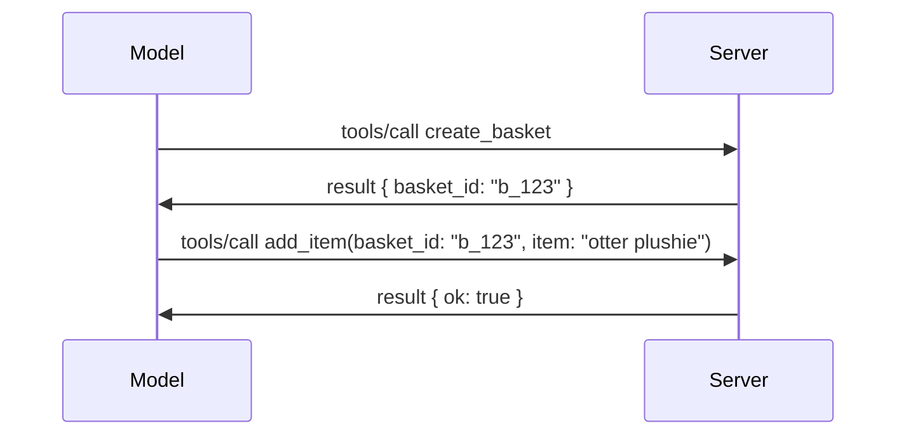

# Anong mga Nagbago sa MCP: Ang 2026-07-28 Spesipikasyon

> **Katayuan:** Pinal. Ang MCP Specification `2026-07-28` ay inilabas noong Hulyo 28, 2026
> at ito ang kasalukuyang bersyon ng protocol. Inilalarawan ng araling ito ang pinal
> na spesipikasyon. Ang ilang halimbawa ng kurikulum ay nananatiling may espesipikong bersyon na
> `2025-11-25` dahil ang kanilang mga SDK ay hindi pa gumagamit ng bagong stateless API;
> ituring ang mga halimbawang iyon bilang gabay para sa legacy compatibility.

## Pangkalahatang Pagsusuri

Ang `2026-07-28` ang pinakamalaking rebisyon ng MCP mula nang ito ay inilunsad. Anim na
Specification Enhancement Proposals (SEPs) ang nagtanggal ng protocol-level sessions at
ginawang stateless ang MCP sa transport layer, naging pangunahing mekanismo ang mga extension,
na may sariling bersyon, at ilang mga tampok na natalakay na sa kurikulum na ito
(Roots, Sampling, Logging) ay tinigil sa ilalim ng bagong lifecycle policy. Ang
araling ito ay nagbubuod kung ano ang mga nagbago, bakit ito mahalaga, at ano ang ibig sabihin nito para sa code
na isinulat para sa `2025-11-25`.

Pinagmulan: [The 2026-07-28 MCP Specification Release Candidate](https://blog.modelcontextprotocol.io/posts/2026-07-28-release-candidate/) (Model Context Protocol Blog, David Soria Parra at Den Delimarsky).

## Mga Layunin ng Pagkatuto

Sa pagtatapos ng araling ito, magagawa mong:

- Ipaliwanag kung bakit lumilipat ang MCP sa stateless protocol core at anong problema ang nilulutas nito para sa horizontally scaled deployments.
- Ilahad kung paano pinalitan ang `initialize`/`initialized` handshake at `Mcp-Session-Id` header.
- Tukuyin ang mga bagong `Mcp-Method` at `Mcp-Name` headers pati na rin ang `ttlMs`/`cacheScope` caching metadata.
- Kilalanin ang Extensions framework at ang dalawang extension na kasama sa paglabas na ito: MCP Apps at Tasks.
- Ibuod ang authorization hardening at Dynamic Client Registration
  deprecation.
- Tukuyin kung aling mga pangunahing tampok (Roots, Sampling, Logging) ang ngayon ay deprecated, at kung ano ang ibig sabihin nito sa praktika.
- Ipaliwanag ang pagbabago ng Full JSON Schema 2020-12 para sa tool `inputSchema`/`outputSchema`.

## Isang Stateless Protocol

Pangunahing pagbabago: Naging stateless ang MCP sa protocol layer.

### Bago (2025-11-25): session ay nakakabit sa isang server instance

Ang pagtawag sa isang tool gamit ang Streamable HTTP ay nagsisimula sa `initialize` handshake. Sasagot ang server gamit ang `Mcp-Session-Id` header na kailangang dala ng bawat kasunod na kahilingan:

```http
POST /mcp HTTP/1.1
Mcp-Session-Id: 1868a90c-3a3f-4f5b
Content-Type: application/json

{"jsonrpc":"2.0","id":2,"method":"tools/call",
 "params":{"name":"search","arguments":{"q":"otters"}}}
```

Dahil ang session ay nakakabit sa server instance na nagbigay nito, nangangailangan ang horizontally scaled deployments ng **sticky routing** sa load balancer at isang **shared session store** sa mga instance.

### Pagkatapos (2026-07-28): bawat kahilingan ay self-contained

```http
POST /mcp HTTP/1.1
MCP-Protocol-Version: 2026-07-28
Mcp-Method: tools/call
Mcp-Name: search
Content-Type: application/json

{"jsonrpc":"2.0","id":1,"method":"tools/call",
 "params":{"name":"search","arguments":{"q":"otters"},
           "_meta":{"io.modelcontextprotocol/protocolVersion":"2026-07-28",
                    "io.modelcontextprotocol/clientInfo":{"name":"my-app","version":"1.0"},
                    "io.modelcontextprotocol/clientCapabilities":{}}}}
```

Kahit anong server instance ang pwedeng humawak ng kahilingang ito. Mga mahahalagang pagbabago:

- **Tinanggal ang `initialize`/`initialized` handshake** ([SEP-2575](https://github.com/modelcontextprotocol/modelcontextprotocol/pull/2575)). Ang bersyon ng protocol, impormasyon ng kliyente, at kakayahan ng kliyente ay inililipat sa `_meta` sa bawat kahilingan. Isang bagong `server/discover` method ang nagpapahintulot sa kliyente na i-fetch ang kakayahan ng server nang maaga kung kinakailangan.
- **Tinanggal ang `Mcp-Session-Id` header at protocol-level session** ([SEP-2567](https://github.com/modelcontextprotocol/modelcontextprotocol/pull/2567)). Hindi na kailangan ang sticky routing at shared session stores sa protocol layer.

### Stateless protocol, stateful na mga aplikasyon

Ang pagtanggal ng protocol-level session ay hindi nangangahulugan na hindi pwede maging stateful ang iyong server. Ang inirerekomendang pattern ay pareho pa rin sa ginagamit ng HTTP APIs: gumawa ng isang malinaw na handle (tulad ng `basket_id`, `browser_id`) mula sa isang tawag sa tool, at ipasa ito pabalik sa modelo bilang karaniwang argumento sa mga sumunod na tawag.



Ginagawa nitong makita at maunawaan ang estado ng modelo sa halip na itago ito sa transport metadata, at nagbibigay daan sa kahit anong server instance na humawak sa kahit anong tawag.

### Mga kahilingang mula server papuntang kliyente, na inayos ulit

Kailangan pa rin ng stateless protocol ng paraan para hilingin ng server sa kliyente ang isang bagay habang nagpapatuloy ang tawag (halimbawa, isang elicitation prompt):

- **Ang mga kahilingang inisyu ng server ay maaari lang isagawa habang ang server ay aktibong nagpoproseso ng kahilingan mula sa kliyente** ([SEP-2260](https://github.com/modelcontextprotocol/modelcontextprotocol/pull/2260)) — dati ay rekomendasyon lamang, ngayon ay kinakailangan na. Hindi bigla pinoprompt ang user.
- **Multi Round-Trip Requests** ([SEP-2322](https://github.com/modelcontextprotocol/modelcontextprotocol/pull/2322)) ang pumalit sa pagpapatagal ng SSE stream. Sa halip, nagbabalik ang server ng `InputRequiredResult`:

  ```json
  {
    "resultType": "input_required",
    "inputRequests": {
      "confirm": {
        "type": "elicitation",
        "message": "Delete 3 files?",
        "schema": { "type": "boolean" }
      }
    },
    "requestState": "eyJzdGVwIjoxLCJmaWxlcyI6WyJhIiwiYiIsImMiXX0="
  }
  ```

  Kinokolekta ng kliyente ang mga sagot at muling ipinapadala ang orihinal na tawag kasama ang `inputResponses` at ang na-echo na `requestState`. Kayang harapin ito ng kahit anong server instance dahil lahat ng kailangan ay nasa payload.

### Magagawa ng routing, caching, tracing

May tatlong mas maliit na pagbabago na nagpapadali sa pagpapatakbo ng stateless traffic:

- **Kinakailangan ang `Mcp-Method` at `Mcp-Name` headers sa Streamable HTTP** ([SEP-2243](https://github.com/modelcontextprotocol/modelcontextprotocol/pull/2243)), upang makapag-route ang load balancers, gateways, at rate limiters nang hindi sinusuri ang JSON body. Ipinagbabawal ng mga server ang mga kahilingan kung salungat ang headers at body.
- **Ang `tools/list` at mga resulta ng pagbabasa ng resource ay may `ttlMs` at `cacheScope` metadata** ([SEP-2549](https://github.com/modelcontextprotocol/modelcontextprotocol/pull/2549)), na ginaya mula sa HTTP `Cache-Control`. Alam ng mga kliyente kung gaano katagal sariwa ang resulta ng listahan at kung ligtas itong ibahagi sa ibang gumagamit, nang hindi nangangailangan ng matagal na SSE stream upang malaman ang mga pagbabago.
- **Naidokumento ang W3C Trace Context propagation sa `_meta`** ([SEP-414](https://github.com/modelcontextprotocol/modelcontextprotocol/pull/414)), na inaayos ang mga susi ng `traceparent`, `tracestate`, at `baggage` upang makasubaybay ang isang distributed trace mula sa client SDK, MCP server, at mga downstream system nang tugma sa [OpenTelemetry](https://opentelemetry.io/) na backend.

## Mga Extension na Naging Pangunahing Bahagi

Ang mga extension ay informal noong `2025-11-25`. Pinormalisa ito sa [SEP-2133](https://github.com/modelcontextprotocol/modelcontextprotocol/pull/2133):

- Natutukoy ang mga extension gamit ang reverse-DNS IDs.
- Napag-uusapan sa pamamagitan ng `extensions` map sa client at server capabilities.
- Nakatira ito sa sariling `ext-*` repositories na may kalidad na mga tagapangasiwa at may sariling bersyon malaya sa core specification.
- May bagong Extensions Track sa proseso ng SEP na nagbibigay daan mula eksperimento hanggang opisyal.

Ilalabas ng release na ito ang dalawang opisyal na extension.

### MCP Apps: mga server-rendered na user interface

[MCP Apps](https://blog.modelcontextprotocol.io/posts/2026-01-26-mcp-apps/) ([SEP-1865](https://github.com/modelcontextprotocol/modelcontextprotocol/pull/1865)) ay nagpapahintulot sa mga server na magpadala ng interactive HTML interfaces na nirerepresenta ng mga host sa sandboxed iframe. Ide-deklara ng mga tool ang kanilang mga UI template nang maaga para makaprepetch, makapag-cache, at ma-review ng seguridad ng mga host bago tumakbo ang kahit ano. Natalakay mo na ang mga pundasyon nito sa [Lesson 15: MCP Apps](../03-GettingStarted/15-mcp-apps/README.md) — sa ilalim ng Extensions framework, opisyal nang extension ang MCP Apps sa halip na isang eksperimento sa core.

### Ang Tasks ay nagsisipagtapos bilang extension

Ang Tasks ay inilabas bilang isang eksperimento sa core feature noong `2025-11-25`. Ang paggamit sa produksyon ay nagpakita ng sapat na redesign kaya ang tamang lugar nito ay bilang extension: binago ng [Tasks extension](https://github.com/modelcontextprotocol/modelcontextprotocol/pull/2663) ang lifecycle na naaayon sa stateless na modelo — pwede ng sagutin ng server ang `tools/call` gamit ang task handle, at pinapalakad ito ng client gamit ang `tasks/get`, `tasks/update`, at `tasks/cancel`. Ang paglikha ng task ay pinapangasiwaan ng server: ina-advertise ng client ang extension at dinidikta ng server kung kailan tatakbo ang tawag bilang task. Tinanggal ang `tasks/list` dahil hindi ito maaaring ligtas na ma-scope nang walang sessions.

> **Paalala sa migration:** kung ginamit mo ang eksperimento ng `2025-11-25` Tasks API, kailangang lumipat ka sa bagong lifecycle ng extension — hindi ito backward compatible.

## Pagpapalakas ng Authorization

Ilang SEPs ang nagpapalakas ng
[authorization specification](https://modelcontextprotocol.io/specification/2026-07-28/basic/authorization)
upang mas tumugma sa mga totoong OAuth 2.0 / OpenID Connect deployments:

| SEP | Pagbabago |
|---|---|
| [SEP-2468](https://github.com/modelcontextprotocol/modelcontextprotocol/pull/2468) | Dapat suriin ng mga kliyente ang `iss` parameter sa authorization responses ayon sa [RFC 9207](https://www.rfc-editor.org/rfc/rfc9207), upang maiwasan ang mix-up attacks na karaniwan sa MCP na may ilang kliyente, maraming server. Ang susunod na bersyon ay magrerequire ng pagtanggi sa mga response na walang `iss`. |
| [SEP-837](https://github.com/modelcontextprotocol/modelcontextprotocol/pull/837) | Para lang sa compatibility: ang mga Dynamic Client Registration clients ay nagde-deklara ng OpenID Connect `application_type`, upang maiwasan ang maling default na `"web"` para sa desktop at CLI clients. |
| [SEP-2352](https://github.com/modelcontextprotocol/modelcontextprotocol/pull/2352) | Para lang sa compatibility: ang narehistrong kredensyal ay nakakabit sa `issuer` ng authorization server na nagisyu; kailangang mag-re-register ang mga client kapag lumipat ang resource. |
| [SEP-2207](https://github.com/modelcontextprotocol/modelcontextprotocol/pull/2207) | Naka-dokumento kung paano humiling ng refresh tokens mula sa OpenID Connect-style authorization servers. |
| [SEP-2350](https://github.com/modelcontextprotocol/modelcontextprotocol/pull/2350) | Nilinaw ang scope accumulation sa step-up authorization. |
| [SEP-2351](https://github.com/modelcontextprotocol/modelcontextprotocol/pull/2351) | Nilinaw ang suffix na `.well-known` discovery. |

Kung ikaw ay gumagawa ng authorization server para sa MCP, magbigay ng `iss` sa
authorization responses at sundin ang pinal na authorization specification. Tingnan
ang [02-Security](../02-Security/README.md) para sa mga gabay sa implementasyon.

Nanatili ang Dynamic Client Registration para sa compatibility ngunit deprecated na
sa `2026-07-28`. Dapat gumamit ang mga bagong implementasyon ng Client ID Metadata
Documents.

## Mga Deprecated na Tampok

Sa ilalim ng bagong
[feature lifecycle policy](https://github.com/modelcontextprotocol/modelcontextprotocol/pull/2577),
ang Roots, Sampling, Logging, at Dynamic Client Registration ay **Deprecated**:

| Tampok | Inirerekomendang kapalit |
|---|---|
| Roots | Mga parameter ng tool, URI ng resource, o server configuration |
| Sampling | Direktang integrasyon sa LLM provider APIs |
| Logging | `stderr` para sa stdio transports; OpenTelemetry para sa structured observability |
| Dynamic Client Registration | Client ID Metadata Documents |

Nanatili ang mga tampok na ito sa `2026-07-28` para sa compatibility. Posibleng alisin sa unang rebisyon ng spesipikasyon na inilabas sa o pagkatapos ng Hulyo 28, 2027;
maaari pa ring magkaroon ng mas huling aktwal na pagtanggal. Ang mga bagong implementasyon ay dapat gumamit ng mga kapalit na pattern sa itaas.


## Buong JSON Schema 2020-12 para sa Mga Tool

Ang `inputSchema` at `outputSchema` ng tool ay iniaangat sa buong [JSON Schema 2020-12](https://json-schema.org/draft/2020-12) ([SEP-2106](https://github.com/modelcontextprotocol/modelcontextprotocol/pull/2106)):

- Pinananatili ang `type: "object"` root constraint sa input schema ngunit pinapayagan na ang composition (`oneOf`, `anyOf`, `allOf`), conditionals, at references (`$ref`, `$defs`).
- Hindi na limitado ang output schemas, at ang `structuredContent` ay maaari nang maging anumang JSON value at hindi lamang object.
- Hindi dapat awtomatikong i-dereference ng mga implementasyon ang external `$ref` URIs at dapat limitahan ang schema depth at validation time (isang konsiderasyon para maiwasang denial-of-service kapag nag-validate ng schemas server-side).

Bukod pa rito, ang error code para sa nawawalang resource ay nagbago mula sa MCP-custom `-32002` patungong JSON-RPC standard `-32602` (Invalid Params) ([SEP-2164](https://github.com/modelcontextprotocol/modelcontextprotocol/pull/2164)). Kung nagmamatch ang iyong kliyente sa literal na `-32002`, kailangang i-update ito.

## Paano Magpapatuloy ang Protocol Mula Dito

Ang release na ito ay may mga breaking changes, na hindi inaasahang maging karaniwan ng MCP maintainers sa hinaharap. Tatlong governance SEPs ang naglalayong maiwasan ang pag-uulit nito:

- Ang **feature lifecycle policy** ay nagbibigay ng landas para sa bawat feature mula sa Active → Deprecated → Removed na may hindi bababa sa labindalawang buwan sa pagitan ng deprecation at posibleng paglilinis.
- Ang **Extensions framework** ay nagpapahintulot sa mga bagong kakayahan na maipadala bilang mga opt-in na extension at magkaroon ng katatagan doon bago (kung kailanman) ilipat sa core specification.
- Ang isang Standards Track SEP ay hindi na maaaring maging Final hangga't walang katugmang senaryo na naidagdag sa [conformance suite](https://github.com/modelcontextprotocol/conformance) ([SEP-2484](https://github.com/modelcontextprotocol/modelcontextprotocol/pull/2484)) — pareho itong suite na ginagamit ng [SDK tier system](https://github.com/modelcontextprotocol/modelcontextprotocol/pull/1777) upang i-score ang opisyal na SDKs.

## Timeline ng Release at Pag-validate

- Na-lock ang release candidate noong Mayo 21, 2026.
- Naipadala ang final specification noong Hulyo 28, 2026.

- Maaaring mahuli ang suporta ng SDK kumpara sa espesipikasyon. Suriin ang
  [dokumentasyon ng SDK](https://modelcontextprotocol.io/docs/sdk) at ang mga tala ng pagpapalabas ng SDK
  bago ilipat ang isang halimbawa.
- Subaybayan ang mga huling pagbabago sa
  [2026-07-28 espesipikasyon](https://modelcontextprotocol.io/specification/2026-07-28/)
  at ang
  [changelog](https://modelcontextprotocol.io/specification/2026-07-28/changelog).

## Ano ang Ibig Sabihin Nito para sa Kurikulum na Ito

Ang kurikulum ay lumilipat mula sa mga halimbawang `2025-11-25` patungo sa kasalukuyang
`2026-07-28` espesipikasyon. Konkretong bagay:

- **Mga Session at ang `initialize` handshake** sa mga halimbawang malinaw na nakatuon sa
  `2025-11-25` ay mga lumang gawi. Pinalitan sila ng `2026-07-28` protocol
  ng modelong stateless request na nasa itaas.
- **Sampling at Roots** ay nananatiling magagamit para sa pagiging tugma ngunit deprecated na.
  Ang mga bagong disenyo ay dapat gumamit ng mga pamalit na pattern na nakalistang nasa itaas.
- **Ang experimental na tampok na Tasks**, kung nagamit mo ito, ay kailangang ilipat sa bagong lifecycle ng Tasks extension.
- **Mga MCP Apps** ([Lesson 15](../03-GettingStarted/15-mcp-apps/README.md)) ay hindi naapektuhan sa praktis; ito ay simpleng inililipat lamang sa ilalim ng pormal na Extensions framework.

## Karagdagang Mga Mapagkukunan

- [MCP Specification 2026-07-28](https://modelcontextprotocol.io/specification/2026-07-28/)
- [2026-07-28 Changelog](https://modelcontextprotocol.io/specification/2026-07-28/changelog)
- [The 2026-07-28 MCP Specification Release Candidate (historical blog post)](https://blog.modelcontextprotocol.io/posts/2026-07-28-release-candidate/)
- [The Future of MCP Transports](https://blog.modelcontextprotocol.io/posts/2025-12-19-mcp-transport-future/)
- [SEP Guidelines](https://modelcontextprotocol.io/community/sep-guidelines)
- [MCP SDK Tier System](https://modelcontextprotocol.io/docs/sdk)

## Mga Susunod na Hakbang

Bumalik sa [Core Concepts](./README.md) o magpatuloy sa
[Security](../02-Security/README.md) upang ilapat ang kasalukuyang patnubay na `2026-07-28`.

---

<!-- CO-OP TRANSLATOR DISCLAIMER START -->
**Pagtatanggi**:
Ang dokumentong ito ay isinalin gamit ang serbisyo ng AI translation na [Co-op Translator](https://github.com/Azure/co-op-translator). Bagama't nagsusumikap kami para sa katumpakan, pakatandaan na ang awtomatikong pagsasalin ay maaaring maglaman ng mga pagkakamali o hindi pagkakatugma. Ang orihinal na dokumento sa orihinal nitong wika ang dapat ituring na pangunahing sanggunian. Para sa mahahalagang impormasyon, inirerekomenda ang propesyonal na pagsasalin ng tao. Hindi kami mananagot sa anumang maling pagkakaintindi o maling interpretasyon na nagmula sa paggamit ng pagsasaling ito.
<!-- CO-OP TRANSLATOR DISCLAIMER END -->