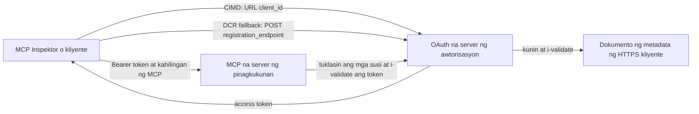

# Halimbawa ng Awtorisasyon gamit ang CIMD at DCR

Ang halimbawang TypeScript na ito ay naghahambing ng dalawang paraan kung paano makakakuha ang isang OAuth client ng pagkakakilanlan
bago maka-access sa isang protektadong MCP server:

- **Client ID Metadata Documents (CIMD)** ay gumagamit ng matatag na HTTPS URL bilang
  `client_id`. Ito ang mas ginustong mekanismo para sa mga kliyente at mga authorization
  server na walang pre-existing na ugnayan.
- **Dynamic Client Registration (DCR)** ay humihiling sa authorization server na gumawa ng
  opaque na client ID sa oras ng pagpapatakbo. Pinapanatili ng MCP `2026-07-28` ang DCR
  para sa backward compatibility lamang.

Ginagamit ng halimbawa ang matatag na MCP TypeScript SDK v2 at ang stateless
MCP `2026-07-28` na modelo ng kahilingan. Gumagana ito sa isang panlabas na OAuth 2.1/OpenID
Connect authorization server tulad ng Auth0. Ang MCP server ay isang resource
server: sinusuri nito ang access tokens ngunit hindi nag-authenticate ng mga gumagamit o naglalabas ng
mga token.

## Mga Layunin sa Pagkatuto

Sa pagtatapos ng halimbawang ito, magagawa mong:

- Ipaliwanag kung bakit mas pinipili ang CIMD kaysa sa DCR para sa mga bagong MCP client.
- Maglathala ng isang valid na dokumento ng CIMD para sa isang pampublikong native na client.
- I-configure ang isang MCP resource server para sa OAuth discovery at JWT validation.
- Subukan ang CIMD at DCR gamit ang parehong MCP server at authorization server.
- Ipataw ang isang OAuth scope sa loob ng isang MCP tool.
- Tukuyin kung alin sa mga responsibilidad ang para sa client, resource server, at
  authorization server.

## Arkitektura



Pinipili at sinisiguro ng authorization server ang mekanismo ng pagrerehistro.
Nakikita lang ng MCP server ang napatunayan na `client_id` claim. Isang HTTPS URL na
may path ang tumutukoy sa CIMD. Ang opaque na ID ay hindi sapat upang patunayan ang DCR dahil ang isang
pre-registered client ay maaari ring gumamit ng opaque na ID; ang opsyonal na
`DCR_CLIENT_ID_PREFIX` setting ay nagbibigay ng demo hint ayon sa provider.

## Prayoridad sa Pagpaparehistro

Dapat gamitin ng mga MCP client na sumusuporta sa lahat ng mekanismo ang ganitong ayos:

1. Gamitin ang pre-registered client information kapag ito ay mayroon na.
2. Gamitin ang CIMD kapag ang authorization server ay nag-aanunsyo ng
   `client_id_metadata_document_supported: true`.
3. Gamitin ang DCR bilang fallback lamang kapag ang server ay nag-aanunsyo ng
   `registration_endpoint`.
4. Tanungin ang gumagamit para sa pre-registered client information kapag wala sa mga nasa itaas ang
   magagamit.

## Layout ng Proyekto

```text
src/
  config.ts          Environment validation
  dcr.ts             DCR compatibility request
  mcp.ts             MCP tools and scope checks
  oauth.ts           Authorization metadata and JWT verification
  register-dcr.ts    DCR command-line helper
  registration.ts    CIMD document and mechanism classification
  server.ts          Express, OAuth discovery, and MCP endpoint
test/
  dcr.test.ts
  oauth.test.ts
  registration.test.ts
  server.test.ts
```

## Mga Kinakailangan

- Node.js 20.6 o mas bago. Ginagamit ng mga script ang `--env-file` at `--import`.
- Isang OAuth 2.1/OpenID Connect authorization server na sumusuporta sa:
  - Authorization code flow gamit ang S256 PKCE.
  - OAuth Protected Resource Metadata at Resource Indicators.
  - JWT access tokens at isang JWKS endpoint.
  - CIMD, kasama ang DCR kung nais mong ihambing ang legacy fallback.
- MCP Inspector o ibang MCP `2026-07-28` client.
- Isang pampublikong HTTPS URL para sa CIMD dokumento. Ang isang development tunnel ay angkop
  para sa lab; gumamit ng matatag na domain sa produksyon.

## I-install at Subukan

```bash
npm install
npm run build
npm test
```

Ang labing-dalawang pagsubok ay gumagamit ng lokal na mga susi at mock HTTP endpoints. Hindi nila kailangan ang
account sa authorization server. Sinusuri nila ang:

- Hugis at mga kinakailangan sa URL ng dokumento ng CIMD.
- Tapat na klasipikasyon ng URL at opaque na client IDs.
- Pamamahala ng DCR kahilingan at tugon.
- Pagtatanggi sa mga insecure na non-loopback DCR endpoints.
- Pagsusuri ng JWT signature, issuer, audience, expiry, client ID, at scope.
- Isang in-process MCP `2026-07-28` na tawag sa `registration-info`.

## I-configure ang Authorization Server

Nag-iiba ang eksaktong mga pangalan ng kontrol ayon sa provider. I-configure ang mga kakayahan na ito:

1. Gumawa ng API o resource server na ang identifier ay eksaktong tumutugma sa iyong MCP
   URL, kabilang ang `/mcp`, halimbawa `http://127.0.0.1:3001/mcp`.
2. Gumamit ng RS256 access tokens at isama ang isang `client_id` o `azp` claim.
3. Idagdag ang `tool:greet` na permiso o scope.
4. Paganahin ang authorization code flow gamit ang S256 PKCE para sa mga pampublikong native na client.
5. Paganahin ang Client ID Metadata Documents.
6. Para sa paghahambing lamang, paganahin ang Dynamic Client Registration.
7. Siguraduhing ang metadata ng authorization server ay nag-aanunsyo ng:
   - `issuer`
   - `authorization_endpoint`
   - `token_endpoint`
   - `jwks_uri`
   - `client_id_metadata_document_supported: true`
   - `registration_endpoint` kapag naka-enable ang DCR

### Halimbawa mula sa Auth0

Para sa Auth0, paganahin ang Client ID Metadata Document Registration, OIDC Dynamic
Application Registration, at Resource Parameter compatibility. Gumawa ng API
na may identifier na eksaktong MCP URL at idagdag ang `tool:greet` permiso.
Pahintulutan ang test user at third-party clients na humiling ng permisong iyon.

Nagbabago ang mga dashboard ng provider at availability ng feature sa paglipas ng panahon. Suriin ang
dokumentasyon ng provider bago gamitin ang mga setting na ito sa labas ng lab na ito.

## I-configure ang Halimbawa

Gumawa ng `.env` mula sa halimbawa:

```powershell
Copy-Item .env.example .env
```

Sa mga bash-compatible na shell:

```bash
cp .env.example .env
```

Itakda ang mga halagang ito:

```dotenv
MCP_SERVER_URL=http://127.0.0.1:3001/mcp
AUTHORIZATION_SERVER_ISSUER=https://your-tenant.example.com/
AUTHORIZATION_SERVER_METADATA_URL=https://your-tenant.example.com/.well-known/openid-configuration
CLIENT_METADATA_URL=https://your-public-host.example.com/client-metadata.json
OAUTH_REDIRECT_URIS=http://127.0.0.1:6274/oauth/callback
DCR_CLIENT_ID_PREFIX=tpc_
```

Mahahalagang detalye:

- `AUTHORIZATION_SERVER_ISSUER` ay dapat eksaktong tumugma sa `issuer` sa natuklasang
  metadata ng authorization server, kabilang ang anumang trailing slash.
- `MCP_SERVER_URL` ay dapat tumugma sa audience ng access token.
- `CLIENT_METADATA_URL` ay dapat gumamit ng HTTPS, maglaman ng non-root na path, at maging ang
  pampublikong URL na naghahain ng metadata route. Tinanggihan ang query strings at fragments
  upang manatiling pareho ang ruta at `client_id`.
- `OAUTH_REDIRECT_URIS` ay isang comma-separated na allowlist. Ang default ay ang MCP
  Inspector loopback callback.
- Ang `DCR_CLIENT_ID_PREFIX` ay opsyonal at naka-specify sa provider. Iwan itong blangko kapag
  ang iyong provider ay walang maaasahang DCR prefix.

## Ilathala ang Dokumento ng CIMD

Simulan ang isang tunnel na nagtutulak ng pampublikong HTTPS origin nito sa `127.0.0.1:3001`.
Itakda ang `CLIENT_METADATA_URL` sa origin na iyon kasama ang `/client-metadata.json`, pagkatapos patakbuhin:

```bash
npm run build
npm start
```

Suriin ang parehong discovery documents:

```bash
curl http://127.0.0.1:3001/health
curl http://127.0.0.1:3001/client-metadata.json
curl http://127.0.0.1:3001/.well-known/oauth-protected-resource/mcp
```

Ang `client_id` na ibinalik ng pampublikong HTTPS metadata URL ay dapat byte-for-byte
kapareho ng URL na iyon. Dapat suriin ng authorization server ang dokumento at
ang redirect URI bago mag-isyu ng token.

> [!NOTE]
> Naghahost ang halimbawa ng client document at MCP resource server sa isang proseso
> upang panatilihing maliit ang lab. Sa produksyon, ang MCP client ang may-ari at naghahost ng sarili nitong CIMD
> dokumento nang hiwalay mula sa resource server.

## Ihambing ang CIMD at DCR

Simulan ang MCP Inspector:

```bash
npx @modelcontextprotocol/inspector
```

Gamitin ang Streamable HTTP at kumonekta sa `http://127.0.0.1:3001/mcp`.

### CIMD (Pinipili)


1. Ipasok ang pampublikong `CLIENT_METADATA_URL` bilang OAuth Client ID.
2. Hilingin ang `tool:greet` pati ang anumang identity scopes na kinakailangan ng iyong provider.
3. Kumpletuhin ang pag-sign-in at pahintulot.
4. Tawagan ang `registration-info`. Iniulat nito ang `mechanism: "cimd"`.
5. Tawagan ang `greet` upang beripikahin ang pagpapatupad ng saklaw.

### DCR (Compatibility Fallback)

1. I-clear ang na-save na estado ng OAuth ng Inspector.
2. Iwanang walang laman ang OAuth Client ID upang magamit ng Inspector ang inihayag na
   `registration_endpoint`.
3. Kumpletuhin ang pag-sign-in at pahintulot.
4. Tawagan ang `registration-info`.
5. Kung tumutugma ang `DCR_CLIENT_ID_PREFIX` sa mga ID na ginawa ng provider, iniulat ng tool
   ang `mechanism: "dcr"`; kung hindi, tama nitong iniulat ang
   `opaque-client-id`.

Maaari mo ring ipakita nang direkta ang kahilingan sa pagpaparehistro:

```bash
npm run build
npm run register:dcr
```

Ipinapakita ng helper ang ibinalik na client ID ngunit hindi kailanman nagpi-print ng client secret.
Tratuhin ang anumang ibinalik na secret bilang sensitibo at itago ito sa tamang secret store.

## Mga Tool

| Tool | Kinakailangang saklaw | Layunin |
| --- | --- | --- |
| `registration-info` | Pinatunayan na client | Iulat ang uri ng client ID |
| `greet` | `tool:greet` | Ipakita ang per-tool na awtorisasyon |

## Mga Tala sa Seguridad

- Beripikahin ang mga lagda ng JWT sa pamamagitan ng JWKS endpoint ng authorization server.
- Kailangan eksaktong tugma ang issuer at audience.
- Kailangan ang expiration at client ID claims.
- Huwag tanggapin ang token na inilabas para sa ibang resource.
- Huwag ipasa ang MCP token sa downstream API.
- Panatilihing nakatali ang mga kredensyal ng DCR sa issuer na gumawa ng mga ito.
- Beripikahin ang CIMD redirect URIs nang eksaktong tumutugma.
- Magpatupad ng SSRF controls kapag kumukuha ang authorization server ng mga CIMD URL.
- Gumamit ng HTTPS para sa authorization at metadata endpoints sa labas ng loopback
  na development.
- Huwag hulaan ang DCR mula sa opaque client ID maliban kung idinedokumento ng provider ang
  maaasahang identifier convention.

## Mga Sanggunian

- [MCP authorization specification](https://modelcontextprotocol.io/specification/2026-07-28/basic/authorization)
- [MCP client registration](https://modelcontextprotocol.io/specification/2026-07-28/basic/authorization/client-registration)
- [MCP security best practices](https://modelcontextprotocol.io/specification/2026-07-28/basic/security_best_practices)
- [MCP TypeScript SDK v2 authorization guide](https://ts.sdk.modelcontextprotocol.io/v2/serving/authorization)
- [OAuth Dynamic Client Registration (RFC 7591)](https://datatracker.ietf.org/doc/html/rfc7591)
- [OAuth Client ID Metadata Document draft](https://datatracker.ietf.org/doc/html/draft-ietf-oauth-client-id-metadata-document-00)

## Pasasalamat

Ang magkatabing paraan ng pagtuturo ay hango sa
[Sambego/auth0-xmcp-cimd](https://github.com/Sambego/auth0-xmcp-cimd). Ang
sample na ito ay isang orihinal, neutral sa provider na implementasyon na ginawa gamit ang opisyal na
MCP TypeScript SDK v2 para sa kurikulum na ito.

---

<!-- CO-OP TRANSLATOR DISCLAIMER START -->
**Pagtatanggi**:
Ang dokumentong ito ay isinalin gamit ang serbisyo ng AI translation na [Co-op Translator](https://github.com/Azure/co-op-translator). Bagama't nagsusumikap kami para sa katumpakan, pakatandaan na ang awtomatikong pagsasalin ay maaaring maglaman ng mga pagkakamali o hindi pagkakatugma. Ang orihinal na dokumento sa orihinal nitong wika ang dapat ituring na pangunahing sanggunian. Para sa mahahalagang impormasyon, inirerekomenda ang propesyonal na pagsasalin ng tao. Hindi kami mananagot sa anumang maling pagkakaintindi o maling interpretasyon na nagmula sa paggamit ng pagsasaling ito.
<!-- CO-OP TRANSLATOR DISCLAIMER END -->