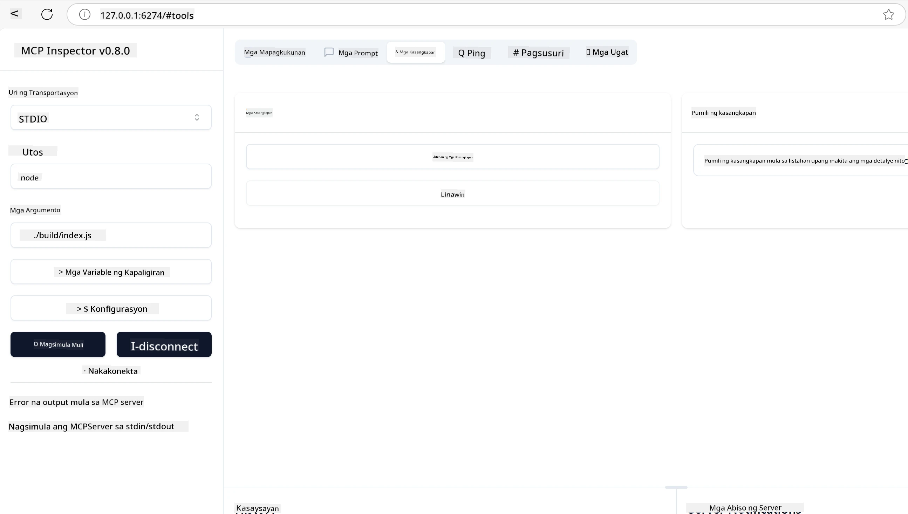
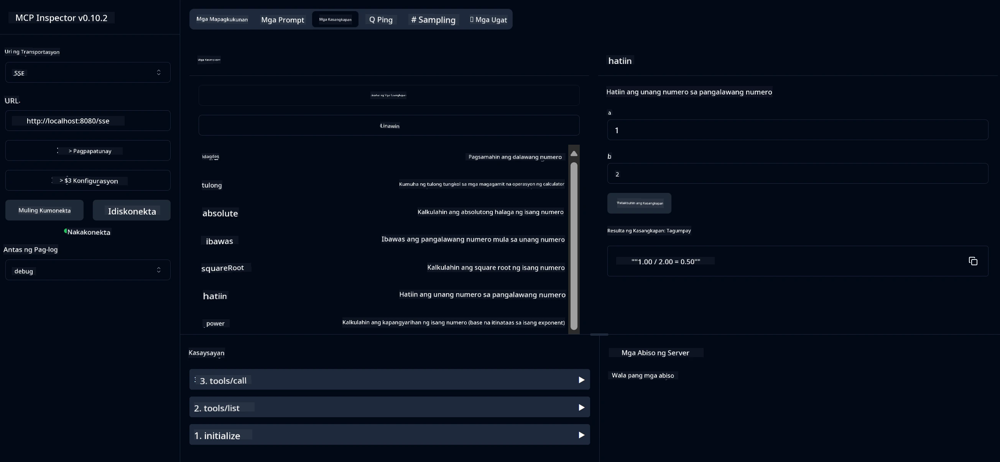
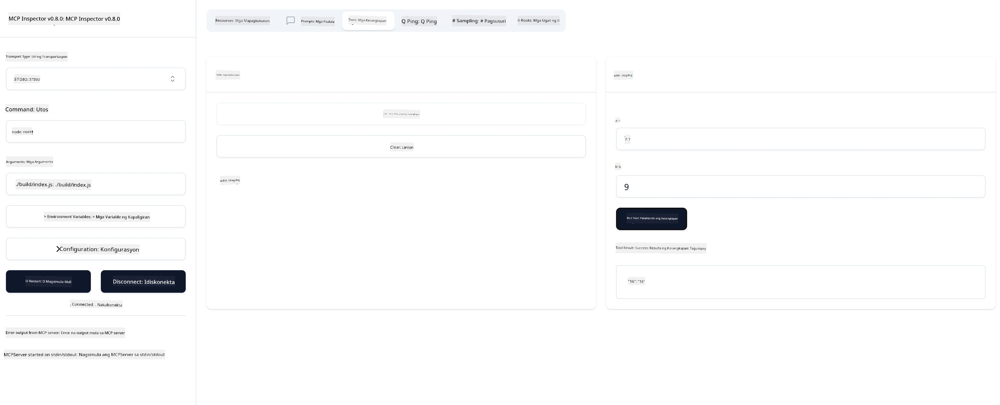

# Pagsisimula sa MCP

> [!NOTE]
> Ang Java HTTP na halimbawa sa leksyong ito ay gumagamit ng legacy HTTP+SSE transport at
> naka-target sa isang SDK na compatible sa MCP `2025-11-25`. Para sa mga bagong remote server, gamitin
> ang `2026-07-28` Streamable HTTP transport at tiyaking sinusuportahan ito ng iyong SDK.

Maligayang pagdating sa iyong unang hakbang sa Model Context Protocol (MCP)! Kung bago ka man sa MCP o nais mong palalimin ang iyong pag-unawa, gagabayan ka ng gabay na ito sa mga pangunahing pagsasaayos at proseso ng pag-develop. Malalaman mo kung paano pinapagana ng MCP ang walang putol na integrasyon sa pagitan ng mga AI model at mga aplikasyon, at matututunan mo kung paano mabilis na ihanda ang iyong kapaligiran para sa paggawa at pagsusuri ng mga solusyon na pinapagana ng MCP.

> TLDR; Kung gumagawa ka ng mga AI na app, alam mo na maaari kang magdagdag ng mga tool at iba pang mga resources sa iyong LLM (malaking modelong wika), upang maging mas maalam ang LLM. Gayunpaman kung ilalagay mo ang mga tool at resources na iyon sa isang server, ang kakayahan ng app at server ay maaaring gamitin ng sinumang kliyente kahit may LLM o wala.

## Pangkalahatang-ideya

Ang leksyong ito ay nagbibigay ng praktikal na gabay sa pag-set up ng mga MCP na kapaligiran at paggawa ng iyong unang mga MCP na aplikasyon. Matututunan mo kung paano mag-set up ng mga kinakailangang tool at framework, gumawa ng mga pangunahing MCP server, lumikha ng mga host na aplikasyon, at subukan ang iyong mga implementasyon.

Ang Model Context Protocol (MCP) ay isang bukas na protocol na nag-standarda kung paano nagbibigay ang mga aplikasyon ng konteksto sa LLMs. Isipin ang MCP bilang isang USB-C port para sa mga AI na aplikasyon - nagbibigay ito ng standardized na paraan upang ikonekta ang mga AI model sa iba't ibang mga pinagmumulan ng data at mga tool.

## Mga Layunin ng Pagkatuto

Sa pagtatapos ng leksyong ito, magagawa mong:

- Mag-set up ng mga development environment para sa MCP sa C#, Java, Python, TypeScript, at Rust
- Gumawa at mag-deploy ng mga pangunahing MCP server na may custom na mga tampok (resources, prompts, at mga tool)
- Lumikha ng mga host na aplikasyon na kumokonekta sa mga MCP server
- Subukan at i-debug ang mga MCP na implementasyon

## Pagsasaayos ng Iyong MCP na Kapaligiran

Bago ka magsimulang trabaho sa MCP, mahalagang ihanda ang iyong development environment at maunawaan ang pangunahing workflow. Gabay ka ng seksyong ito sa mga paunang hakbang upang masigurong maayos ang iyong pagsisimula sa MCP.

### Mga Kinakailangan

Bago sumabak sa pag-develop gamit ang MCP, siguraduhing mayroon ka:

- **Development Environment**: Para sa napili mong wika (C#, Java, Python, TypeScript, o Rust)
- **IDE/Editor**: Visual Studio, Visual Studio Code, IntelliJ, Eclipse, PyCharm, o anumang modernong code editor
- **Package Managers**: NuGet, Maven/Gradle, pip, npm/yarn, o Cargo
- **API Keys**: Para sa anumang AI services na balak mong gamitin sa iyong mga host na aplikasyon

## Pangunahing Estraktura ng MCP Server

Karaniwang kinabibilangan ang isang MCP server ng mga sumusunod:

- **Server Configuration**: Pagsasaayos ng port, authentication, at iba pang mga settings
- **Resources**: Mga datos at konteksto na inilalagay sa LLMs
- **Tools**: Mga functionality na maaaring tawagin ng mga model
- **Prompts**: Mga template para sa paggawa o pag-istruktura ng teksto

Narito ang isang pinasimpleng halimbawa sa TypeScript:

```typescript
import { McpServer, ResourceTemplate } from "@modelcontextprotocol/sdk/server/mcp.js";
import { StdioServerTransport } from "@modelcontextprotocol/sdk/server/stdio.js";
import { z } from "zod";

// Gumawa ng isang MCP server
const server = new McpServer({
  name: "Demo",
  version: "1.0.0"
});

// Magdagdag ng isang tool para sa dagdag
server.tool("add",
  { a: z.number(), b: z.number() },
  async ({ a, b }) => ({
    content: [{ type: "text", text: String(a + b) }]
  })
);

// Magdagdag ng isang dynamic na mapagkukunan ng pagbati
server.resource(
  "file",
  // Kinokontrol ng parameter na 'list' kung paano inililista ng mapagkukunan ang mga magagamit na file. Ang pag-set nito sa undefined ay nagpapatigil sa paglista para sa mapagkukunang ito.
  new ResourceTemplate("file://{path}", { list: undefined }),
  async (uri, { path }) => ({
    contents: [{
      uri: uri.href,
      text: `File, ${path}!`
    }]
  })
);

// Magdagdag ng isang mapagkukunan ng file na nagbabasa ng nilalaman ng file
server.resource(
  "file",
  new ResourceTemplate("file://{path}", { list: undefined }),
  async (uri, { path }) => {
    let text;
    try {
      text = await fs.readFile(path, "utf8");
    } catch (err) {
      text = `Error reading file: ${err.message}`;
    }
    return {
      contents: [{
        uri: uri.href,
        text
      }]
    };
  }
);

server.prompt(
  "review-code",
  { code: z.string() },
  ({ code }) => ({
    messages: [{
      role: "user",
      content: {
        type: "text",
        text: `Please review this code:\n\n${code}`
      }
    }]
  })
);

// Simulang tumanggap ng mga mensahe sa stdin at magpadala ng mga mensahe sa stdout
const transport = new StdioServerTransport();
await server.connect(transport);
```

Sa code na ito ay:

- Inimport ang mga kinakailangang klase mula sa MCP TypeScript SDK.
- Gumawa at nag-configure ng bagong MCP server instance.
- Nagrehistro ng custom tool (`calculator`) na may handler function.
- Sinimulan ang server upang pakinggan ang mga papasok na MCP request.

## Pagsubok at Pag-debug

Bago ka magsimula sa pagsusuri ng iyong MCP server, mahalagang maunawaan ang mga magagamit na tool at pinakamahusay na mga kasanayan sa pag-debug. Ang efektibong pagsusuri ay nagsisiguro na ang iyong server ay gumagana ayon sa inaasahan at tumutulong upang mabilis mong matukoy at malutas ang mga isyu. Inilalahad ng sumusunod na seksyon ang mga inirekomendang paraan upang beripikahin ang iyong MCP na implementasyon.

Nagbibigay ang MCP ng mga tool upang matulungan kang subukan at i-debug ang iyong mga server:

- **Inspector tool**, ang grapikong interface na ito ay nagbibigay-daan sa iyo upang kumonekta sa iyong server at subukan ang iyong mga tool, prompt, at resources.
- **curl**, maaari ka ring kumonekta sa iyong server gamit ang command line tool na tulad ng curl o iba pang mga kliyenteng maaaring gumawa at magpatakbo ng mga HTTP na utos.

### Paggamit ng MCP Inspector

Ang [MCP Inspector](https://github.com/modelcontextprotocol/inspector) ay isang visual na testing tool na tumutulong sa iyo upang:

1. **Tuklasin ang mga Kakayahan ng Server**: Awtomatikong matukoy ang mga available na resources, tool, at prompt
2. **Subukan ang Pagsasagawa ng Tool**: Subukan ang iba't ibang mga parametro at tingnan ang tugon nang real-time
3. **Tingnan ang Metadata ng Server**: Suriin ang impormasyon ng server, mga schema, at mga configuration

```bash
# halimbawa TypeScript, pag-install at pagpapatakbo ng MCP Inspector
npx @modelcontextprotocol/inspector node build/index.js
```

Kapag pinatakbo mo ang mga utos sa itaas, magsisimula ang MCP Inspector ng lokal na web interface sa iyong browser. Maaari mong makita ang isang dashboard na nagpapakita ng iyong mga naka-rehistrong MCP server, ang kanilang mga available na tool, resources, at prompts. Pinapayagan ka ng interface na interaktibong subukan ang pagsasagawa ng tool, suriin ang metadata ng server, at tingnan ang mga tugon nang real-time, na nagpapadali upang i-validate at i-debug ang iyong MCP server na mga implementasyon.

Narito ang isang screenshot kung paano ito maaaring tingnan:



## Karaniwang Mga Isyu sa Pagsasaayos at Mga Solusyon

| Isyu | Posibleng Solusyon |
|-------|-------------------|
| Hindi nakokonekta ang server | Suriin kung tumatakbo ang server at tamang port ang ginagamit |
| Mga error sa pagsasagawa ng tool | Balikan ang pag-validate ng parameter at pag-handle ng error |
| Mga pagkabigo sa authentication | Tiyaking tama ang API keys at pahintulot |
| Mga error sa pag-validate ng schema | Siguraduhing tugma ang mga parametro sa itinakdang schema |
| Hindi nagsisimula ang server | Suriin kung may conflict sa port o may nawawalang dependencies |
| Mga error sa CORS | I-configure nang tama ang mga CORS header para sa cross-origin requests |
| Mga isyu sa authentication | Siguraduhing balido ang token at may tamang pahintulot |

## Lokal na Pag-develop

Para sa lokal na pag-develop at pagsusuri, maaari mong patakbuhin direkta ang mga MCP server sa iyong makina:

1. **Simulan ang proseso ng server**: Patakbuhin ang iyong MCP server application
2. **I-configure ang networking**: Siguraduhing naa-access ang server sa inaasahang port
3. **Kumonekta ang mga kliyente**: Gamitin ang lokal na connection URL tulad ng `http://localhost:3000`

```bash
# Halimbawa: Pagpapatakbo ng isang TypeScript MCP server nang lokal
npm run start
# Server na tumatakbo sa http://localhost:3000
```

## Paggawa ng iyong unang MCP Server

Napag-usapan na natin ang [Core concepts](../../01-CoreConcepts/README.md) sa isang nakaraang leksyon, ngayon ay oras na para gamitin ang kaalamang iyon.

### Ano ang kaya ng isang server

Bago tayo magsulat ng code, paalalahanan muna natin ang ating mga sarili kung ano ang kayang gawin ng isang server:

Halimbawa, ang MCP server ay maaaring:

- Ma-access ang mga lokal na file at database
- Kumonekta sa mga remote na API
- Magsagawa ng mga komputasyon
- Makipag-integrate sa iba pang mga tool at serbisyo
- Magbigay ng user interface para sa interaksyon

Mahusay, ngayon na alam natin kung ano ang kaya nitong gawin, simulan na natin ang pag-cocode.

## Ehersisyo: Paggawa ng server

Para gumawa ng server, sundin ang mga hakbang na ito:

- I-install ang MCP SDK.
- Gumawa ng proyekto at isaayos ang estruktura ng proyekto.
- Isulat ang code ng server.
- Subukan ang server.

### -1- Gumawa ng proyekto

#### TypeScript

```sh
# Gumawa ng direktoryo ng proyekto at i-initialize ang npm na proyekto
mkdir calculator-server
cd calculator-server
npm init -y
```

#### Python

```sh
# Gumawa ng direktoryo ng proyekto
mkdir calculator-server
cd calculator-server
# Buksan ang folder sa Visual Studio Code - Laktawan ito kung gumagamit ka ng ibang IDE
code .
```

#### .NET

```sh
dotnet new console -n McpCalculatorServer
cd McpCalculatorServer
```

#### Java

Para sa Java, gumawa ng Spring Boot na proyekto:

```bash
curl https://start.spring.io/starter.zip \
  -d dependencies=web \
  -d javaVersion=21 \
  -d type=maven-project \
  -d groupId=com.example \
  -d artifactId=calculator-server \
  -d name=McpServer \
  -d packageName=com.microsoft.mcp.sample.server \
  -o calculator-server.zip
```

I-extract ang zip file:

```bash
unzip calculator-server.zip -d calculator-server
cd calculator-server
# opsyonal alisin ang hindi nagamit na test
rm -rf src/test/java
```

Idagdag ang sumusunod na kumpletong configuration sa iyong *pom.xml* file:

```xml
<?xml version="1.0" encoding="UTF-8"?>
<project xmlns="http://maven.apache.org/POM/4.0.0"
    xmlns:xsi="http://www.w3.org/2001/XMLSchema-instance"
    xsi:schemaLocation="http://maven.apache.org/POM/4.0.0 http://maven.apache.org/xsd/maven-4.0.0.xsd">
    <modelVersion>4.0.0</modelVersion>
    
    <!-- Spring Boot parent for dependency management -->
    <parent>
        <groupId>org.springframework.boot</groupId>
        <artifactId>spring-boot-starter-parent</artifactId>
        <version>3.5.0</version>
        <relativePath />
    </parent>

    <!-- Project coordinates -->
    <groupId>com.example</groupId>
    <artifactId>calculator-server</artifactId>
    <version>0.0.1-SNAPSHOT</version>
    <name>Calculator Server</name>
    <description>Basic calculator MCP service for beginners</description>

    <!-- Properties -->
    <properties>
        <java.version>21</java.version>
        <maven.compiler.source>21</maven.compiler.source>
        <maven.compiler.target>21</maven.compiler.target>
    </properties>

    <!-- Spring AI BOM for version management -->
    <dependencyManagement>
        <dependencies>
            <dependency>
                <groupId>org.springframework.ai</groupId>
                <artifactId>spring-ai-bom</artifactId>
                <version>1.0.0-SNAPSHOT</version>
                <type>pom</type>
                <scope>import</scope>
            </dependency>
        </dependencies>
    </dependencyManagement>

    <!-- Dependencies -->
    <dependencies>
        <dependency>
            <groupId>org.springframework.ai</groupId>
            <artifactId>spring-ai-starter-mcp-server-webflux</artifactId>
        </dependency>
        <dependency>
            <groupId>org.springframework.boot</groupId>
            <artifactId>spring-boot-starter-actuator</artifactId>
        </dependency>
        <dependency>
         <groupId>org.springframework.boot</groupId>
         <artifactId>spring-boot-starter-test</artifactId>
         <scope>test</scope>
      </dependency>
    </dependencies>

    <!-- Build configuration -->
    <build>
        <plugins>
            <plugin>
                <groupId>org.springframework.boot</groupId>
                <artifactId>spring-boot-maven-plugin</artifactId>
            </plugin>
            <plugin>
                <groupId>org.apache.maven.plugins</groupId>
                <artifactId>maven-compiler-plugin</artifactId>
                <configuration>
                    <release>21</release>
                </configuration>
            </plugin>
        </plugins>
    </build>

    <!-- Repositories for Spring AI snapshots -->
    <repositories>
        <repository>
            <id>spring-milestones</id>
            <name>Spring Milestones</name>
            <url>https://repo.spring.io/milestone</url>
            <snapshots>
                <enabled>false</enabled>
            </snapshots>
        </repository>
        <repository>
            <id>spring-snapshots</id>
            <name>Spring Snapshots</name>
            <url>https://repo.spring.io/snapshot</url>
            <releases>
                <enabled>false</enabled>
            </releases>
        </repository>
    </repositories>
</project>
```

#### Rust

```sh
mkdir calculator-server
cd calculator-server
cargo init
```

### -2- Magdagdag ng dependencies

Ngayon na nagawa mo na ang proyekto, magdagdag naman tayo ng mga dependencies:

#### TypeScript

```sh
# Kung hindi pa naka-install, i-install ang TypeScript nang globally
npm install typescript -g

# I-install ang MCP SDK at Zod para sa schema validation
npm install @modelcontextprotocol/sdk zod
npm install -D @types/node typescript
```

#### Python

```sh
# Gumawa ng virtual na kapaligiran at i-install ang mga kinakailangang pakete
python -m venv venv
venv\Scripts\activate
pip install "mcp[cli]"
```

#### Java

```bash
cd calculator-server
./mvnw clean install -DskipTests
```

#### Rust

```sh
cargo add rmcp --features server,transport-io
cargo add serde
cargo add tokio --features rt-multi-thread
```

### -3- Gumawa ng mga project files

#### TypeScript

Buksan ang *package.json* file at palitan ang nilalaman nito ng sumusunod upang matiyak na maaari mong i-build at patakbuhin ang server:

```json
{
  "name": "calculator-server",
  "version": "1.0.0",
  "main": "index.js",
  "type": "module",
  "scripts": {
    "build": "tsc",
    "start": "npm run build && node ./build/index.js",
  },
  "keywords": [],
  "author": "",
  "license": "ISC",
  "description": "A simple calculator server using Model Context Protocol",
  "dependencies": {
    "@modelcontextprotocol/sdk": "^1.16.0",
    "zod": "^3.25.76"
  },
  "devDependencies": {
    "@types/node": "^24.0.14",
    "typescript": "^5.8.3"
  }
}
```

Gumawa ng *tsconfig.json* na may sumusunod na nilalaman:

```json
{
  "compilerOptions": {
    "target": "ES2022",
    "module": "Node16",
    "moduleResolution": "Node16",
    "outDir": "./build",
    "rootDir": "./src",
    "strict": true,
    "esModuleInterop": true,
    "skipLibCheck": true,
    "forceConsistentCasingInFileNames": true
  },
  "include": ["src/**/*"],
  "exclude": ["node_modules"]
}
```

Gumawa ng directory para sa iyong source code:

```sh
mkdir src
touch src/index.ts
```

#### Python

Gumawa ng file *server.py*

```sh
touch server.py
```

#### .NET

I-install ang kinakailangang NuGet packages:

```sh
dotnet add package ModelContextProtocol --prerelease
dotnet add package Microsoft.Extensions.Hosting
```

#### Java

Para sa mga Java Spring Boot proyekto, ang estruktura ng proyekto ay awtomatikong nalilikha.

#### Rust

Para sa Rust, ang isang *src/main.rs* file ay awtomatikong nalilikha kapag pinatakbo mo ang `cargo init`. Buksan ang file at tanggalin ang default na code.

### -4- Gumawa ng server code

#### TypeScript

Gumawa ng file *index.ts* at idagdag ang sumusunod na code:

```typescript
import { McpServer, ResourceTemplate } from "@modelcontextprotocol/sdk/server/mcp.js";
import { StdioServerTransport } from "@modelcontextprotocol/sdk/server/stdio.js";
import { z } from "zod";
 
// Gumawa ng isang MCP server
const server = new McpServer({
  name: "Calculator MCP Server",
  version: "1.0.0"
});
```

Ngayon ay may server ka na, ngunit hindi ito gumagawa ng gaano, ayusin natin iyon.

#### Python

```python
# server.py
from mcp.server.fastmcp import FastMCP

# Gumawa ng MCP server
mcp = FastMCP("Demo")
```

#### .NET

```csharp
using Microsoft.Extensions.DependencyInjection;
using Microsoft.Extensions.Hosting;
using Microsoft.Extensions.Logging;
using ModelContextProtocol.Server;
using System.ComponentModel;

var builder = Host.CreateApplicationBuilder(args);
builder.Logging.AddConsole(consoleLogOptions =>
{
    // Configure all logs to go to stderr
    consoleLogOptions.LogToStandardErrorThreshold = LogLevel.Trace;
});

builder.Services
    .AddMcpServer()
    .WithStdioServerTransport()
    .WithToolsFromAssembly();
await builder.Build().RunAsync();

// add features
```

#### Java

Para sa Java, gumawa ng mga pangunahing bahagi ng server. Una, baguhin ang pangunahing klase ng application:

*src/main/java/com/microsoft/mcp/sample/server/McpServerApplication.java*:

```java
package com.microsoft.mcp.sample.server;

import org.springframework.ai.tool.ToolCallbackProvider;
import org.springframework.ai.tool.method.MethodToolCallbackProvider;
import org.springframework.boot.SpringApplication;
import org.springframework.boot.autoconfigure.SpringBootApplication;
import org.springframework.context.annotation.Bean;
import com.microsoft.mcp.sample.server.service.CalculatorService;

@SpringBootApplication
public class McpServerApplication {

    public static void main(String[] args) {
        SpringApplication.run(McpServerApplication.class, args);
    }
    
    @Bean
    public ToolCallbackProvider calculatorTools(CalculatorService calculator) {
        return MethodToolCallbackProvider.builder().toolObjects(calculator).build();
    }
}
```

Gumawa ng calculator service *src/main/java/com/microsoft/mcp/sample/server/service/CalculatorService.java*:

```java
package com.microsoft.mcp.sample.server.service;

import org.springframework.ai.tool.annotation.Tool;
import org.springframework.stereotype.Service;

/**
 * Service for basic calculator operations.
 * This service provides simple calculator functionality through MCP.
 */
@Service
public class CalculatorService {

    /**
     * Add two numbers
     * @param a The first number
     * @param b The second number
     * @return The sum of the two numbers
     */
    @Tool(description = "Add two numbers together")
    public String add(double a, double b) {
        double result = a + b;
        return formatResult(a, "+", b, result);
    }

    /**
     * Subtract one number from another
     * @param a The number to subtract from
     * @param b The number to subtract
     * @return The result of the subtraction
     */
    @Tool(description = "Subtract the second number from the first number")
    public String subtract(double a, double b) {
        double result = a - b;
        return formatResult(a, "-", b, result);
    }

    /**
     * Multiply two numbers
     * @param a The first number
     * @param b The second number
     * @return The product of the two numbers
     */
    @Tool(description = "Multiply two numbers together")
    public String multiply(double a, double b) {
        double result = a * b;
        return formatResult(a, "*", b, result);
    }

    /**
     * Divide one number by another
     * @param a The numerator
     * @param b The denominator
     * @return The result of the division
     */
    @Tool(description = "Divide the first number by the second number")
    public String divide(double a, double b) {
        if (b == 0) {
            return "Error: Cannot divide by zero";
        }
        double result = a / b;
        return formatResult(a, "/", b, result);
    }

    /**
     * Calculate the power of a number
     * @param base The base number
     * @param exponent The exponent
     * @return The result of raising the base to the exponent
     */
    @Tool(description = "Calculate the power of a number (base raised to an exponent)")
    public String power(double base, double exponent) {
        double result = Math.pow(base, exponent);
        return formatResult(base, "^", exponent, result);
    }

    /**
     * Calculate the square root of a number
     * @param number The number to find the square root of
     * @return The square root of the number
     */
    @Tool(description = "Calculate the square root of a number")
    public String squareRoot(double number) {
        if (number < 0) {
            return "Error: Cannot calculate square root of a negative number";
        }
        double result = Math.sqrt(number);
        return String.format("√%.2f = %.2f", number, result);
    }

    /**
     * Calculate the modulus (remainder) of division
     * @param a The dividend
     * @param b The divisor
     * @return The remainder of the division
     */
    @Tool(description = "Calculate the remainder when one number is divided by another")
    public String modulus(double a, double b) {
        if (b == 0) {
            return "Error: Cannot divide by zero";
        }
        double result = a % b;
        return formatResult(a, "%", b, result);
    }

    /**
     * Calculate the absolute value of a number
     * @param number The number to find the absolute value of
     * @return The absolute value of the number
     */
    @Tool(description = "Calculate the absolute value of a number")
    public String absolute(double number) {
        double result = Math.abs(number);
        return String.format("|%.2f| = %.2f", number, result);
    }

    /**
     * Get help about available calculator operations
     * @return Information about available operations
     */
    @Tool(description = "Get help about available calculator operations")
    public String help() {
        return "Basic Calculator MCP Service\n\n" +
               "Available operations:\n" +
               "1. add(a, b) - Adds two numbers\n" +
               "2. subtract(a, b) - Subtracts the second number from the first\n" +
               "3. multiply(a, b) - Multiplies two numbers\n" +
               "4. divide(a, b) - Divides the first number by the second\n" +
               "5. power(base, exponent) - Raises a number to a power\n" +
               "6. squareRoot(number) - Calculates the square root\n" + 
               "7. modulus(a, b) - Calculates the remainder of division\n" +
               "8. absolute(number) - Calculates the absolute value\n\n" +
               "Example usage: add(5, 3) will return 5 + 3 = 8";
    }

    /**
     * Format the result of a calculation
     */
    private String formatResult(double a, String operator, double b, double result) {
        return String.format("%.2f %s %.2f = %.2f", a, operator, b, result);
    }
}
```

**Opsyonal na mga bahagi para sa production-ready na serbisyo:**

Gumawa ng startup configuration *src/main/java/com/microsoft/mcp/sample/server/config/StartupConfig.java*:

```java
package com.microsoft.mcp.sample.server.config;

import org.springframework.boot.CommandLineRunner;
import org.springframework.context.annotation.Bean;
import org.springframework.context.annotation.Configuration;

@Configuration
public class StartupConfig {
    
    @Bean
    public CommandLineRunner startupInfo() {
        return args -> {
            System.out.println("\n" + "=".repeat(60));
            System.out.println("Calculator MCP Server is starting...");
            System.out.println("SSE endpoint: http://localhost:8080/sse");
            System.out.println("Health check: http://localhost:8080/actuator/health");
            System.out.println("=".repeat(60) + "\n");
        };
    }
}
```

Gumawa ng health controller *src/main/java/com/microsoft/mcp/sample/server/controller/HealthController.java*:

```java
package com.microsoft.mcp.sample.server.controller;

import org.springframework.http.ResponseEntity;
import org.springframework.web.bind.annotation.GetMapping;
import org.springframework.web.bind.annotation.RestController;
import java.time.LocalDateTime;
import java.util.HashMap;
import java.util.Map;

@RestController
public class HealthController {
    
    @GetMapping("/health")
    public ResponseEntity<Map<String, Object>> healthCheck() {
        Map<String, Object> response = new HashMap<>();
        response.put("status", "UP");
        response.put("timestamp", LocalDateTime.now().toString());
        response.put("service", "Calculator MCP Server");
        return ResponseEntity.ok(response);
    }
}
```

Gumawa ng exception handler *src/main/java/com/microsoft/mcp/sample/server/exception/GlobalExceptionHandler.java*:

```java
package com.microsoft.mcp.sample.server.exception;

import org.springframework.http.HttpStatus;
import org.springframework.http.ResponseEntity;
import org.springframework.web.bind.annotation.ExceptionHandler;
import org.springframework.web.bind.annotation.RestControllerAdvice;

@RestControllerAdvice
public class GlobalExceptionHandler {

    @ExceptionHandler(IllegalArgumentException.class)
    public ResponseEntity<ErrorResponse> handleIllegalArgumentException(IllegalArgumentException ex) {
        ErrorResponse error = new ErrorResponse(
            "Invalid_Input", 
            "Invalid input parameter: " + ex.getMessage());
        return new ResponseEntity<>(error, HttpStatus.BAD_REQUEST);
    }

    public static class ErrorResponse {
        private String code;
        private String message;

        public ErrorResponse(String code, String message) {
            this.code = code;
            this.message = message;
        }

        // Mga getter
        public String getCode() { return code; }
        public String getMessage() { return message; }
    }
}
```

Gumawa ng custom banner *src/main/resources/banner.txt*:

```text
_____      _            _       _             
 / ____|    | |          | |     | |            
| |     __ _| | ___ _   _| | __ _| |_ ___  _ __ 
| |    / _` | |/ __| | | | |/ _` | __/ _ \| '__|
| |___| (_| | | (__| |_| | | (_| | || (_) | |   
 \_____\__,_|_|\___|\__,_|_|\__,_|\__\___/|_|   
                                                
Calculator MCP Server v1.0
Spring Boot MCP Application
```

</details>

#### Rust

Idagdag ang sumusunod na code sa itaas ng *src/main.rs* file. Ito ay nag-iimport ng mga kinakailangang library at modules para sa iyong MCP server.

```rust
use rmcp::{
    handler::server::{router::tool::ToolRouter, tool::Parameters},
    model::{ServerCapabilities, ServerInfo},
    schemars, tool, tool_handler, tool_router,
    transport::stdio,
    ServerHandler, ServiceExt,
};
use std::error::Error;
```

Ang calculator server ay magiging simple lamang na maaaring magdagdag ng dalawang numero. Gumawa tayo ng struct para kumatawan sa calculator request.

```rust
#[derive(Debug, serde::Deserialize, schemars::JsonSchema)]
pub struct CalculatorRequest {
    pub a: f64,
    pub b: f64,
}
```

Susunod, gumawa ng struct upang kumatawan sa calculator server. Ang struct na ito ang siyang magtataglay ng tool router, na ginagamit upang magrehistro ng mga tool.

```rust
#[derive(Debug, Clone)]
pub struct Calculator {
    tool_router: ToolRouter<Self>,
}
```

Ngayon, maaari nating ipatupad ang `Calculator` struct upang gumawa ng bagong instance ng server at ipatupad ang server handler para magbigay ng impormasyon tungkol sa server.

```rust
#[tool_router]
impl Calculator {
    pub fn new() -> Self {
        Self {
            tool_router: Self::tool_router(),
        }
    }
}

#[tool_handler]
impl ServerHandler for Calculator {
    fn get_info(&self) -> ServerInfo {
        ServerInfo {
            instructions: Some("A simple calculator tool".into()),
            capabilities: ServerCapabilities::builder().enable_tools().build(),
            ..Default::default()
        }
    }
}
```

Sa wakas, kailangan nating ipatupad ang pangunahing function upang simulan ang server. Ang function na ito ay gagawa ng isang instance ng `Calculator` struct at pagseserbiin ito gamit ang standard input/output.

```rust
#[tokio::main]
async fn main() -> Result<(), Box<dyn Error>> {
    let service = Calculator::new().serve(stdio()).await?;
    service.waiting().await?;
    Ok(())
}
```

Ang server ay nakahanda na ngayon upang magbigay ng pangunahing impormasyon tungkol sa sarili nito. Susunod, magdadagdag tayo ng tool para magsagawa ng addition.

### -5- Pagdaragdag ng tool at resource

Magdagdag ng tool at resource sa pamamagitan ng pagdagdag ng sumusunod na code:

#### TypeScript

```typescript
server.tool(
  "add",
  { a: z.number(), b: z.number() },
  async ({ a, b }) => ({
    content: [{ type: "text", text: String(a + b) }]
  })
);

server.resource(
  "greeting",
  new ResourceTemplate("greeting://{name}", { list: undefined }),
  async (uri, { name }) => ({
    contents: [{
      uri: uri.href,
      text: `Hello, ${name}!`
    }]
  })
);
```

Kinukuha ng iyong tool ang mga parametro na `a` at `b` at nagpapatakbo ng isang function na nagbubunga ng tugon sa anyo na ito:

```typescript
{
  contents: [{
    type: "text", content: "some content"
  }]
}
```

Ang iyong resource ay naa-access sa pamamagitan ng string na "greeting" at tumatanggap ng parametro na `name` at nagbubunga ng katulad na tugon tulad ng tool:

```typescript
{
  uri: "<href>",
  text: "a text"
}
```

#### Python

```python
# Magdagdag ng tool para sa pagdaragdag
@mcp.tool()
def add(a: int, b: int) -> int:
    """Add two numbers"""
    return a + b


# Magdagdag ng dynamic na mapagkukunan ng pagbati
@mcp.resource("greeting://{name}")
def get_greeting(name: str) -> str:
    """Get a personalized greeting"""
    return f"Hello, {name}!"
```

Sa code sa itaas ay:

- Tinukoy ang isang tool na `add` na tumatanggap ng mga parametro `a` at `b`, pareho ay integers.
- Gumawa ng resource na `greeting` na tumatanggap ng parametro na `name`.

#### .NET

Idagdag ito sa iyong Program.cs file:

```csharp
[McpServerToolType]
public static class CalculatorTool
{
    [McpServerTool, Description("Adds two numbers")]
    public static string Add(int a, int b) => $"Sum {a + b}";
}
```

#### Java

Nagawa na ang mga tool sa nakaraang hakbang.

#### Rust

Magdagdag ng bagong tool sa loob ng `impl Calculator` block:

```rust
#[tool(description = "Adds a and b")]
async fn add(
    &self,
    Parameters(CalculatorRequest { a, b }): Parameters<CalculatorRequest>,
) -> String {
    (a + b).to_string()
}
```

### -6- Pangwakas na code

Idagdag natin ang huling code na kailangan upang masimulan ang server:

#### TypeScript

```typescript
// Magsimulang tumanggap ng mga mensahe sa stdin at magpadala ng mga mensahe sa stdout
const transport = new StdioServerTransport();
await server.connect(transport);
```

Narito ang buong code:

```typescript
// index.ts
import { McpServer, ResourceTemplate } from "@modelcontextprotocol/sdk/server/mcp.js";
import { StdioServerTransport } from "@modelcontextprotocol/sdk/server/stdio.js";
import { z } from "zod";

// Gumawa ng MCP server
const server = new McpServer({
  name: "Calculator MCP Server",
  version: "1.0.0"
});

// Magdagdag ng tool para sa pagdaragdag
server.tool(
  "add",
  { a: z.number(), b: z.number() },
  async ({ a, b }) => ({
    content: [{ type: "text", text: String(a + b) }]
  })
);

// Magdagdag ng dynamic na resource para sa pagbati
server.resource(
  "greeting",
  new ResourceTemplate("greeting://{name}", { list: undefined }),
  async (uri, { name }) => ({
    contents: [{
      uri: uri.href,
      text: `Hello, ${name}!`
    }]
  })
);

// Simulan ang pagtanggap ng mga mensahe sa stdin at pagpapadala ng mga mensahe sa stdout
const transport = new StdioServerTransport();
server.connect(transport);
```

#### Python

```python
# server.py
from mcp.server.fastmcp import FastMCP

# Gumawa ng isang MCP server
mcp = FastMCP("Demo")


# Magdagdag ng isang karagdagang kasangkapan
@mcp.tool()
def add(a: int, b: int) -> int:
    """Add two numbers"""
    return a + b


# Magdagdag ng isang dinamiko na resource ng pagbati
@mcp.resource("greeting://{name}")
def get_greeting(name: str) -> str:
    """Get a personalized greeting"""
    return f"Hello, {name}!"

# Pangunahing bloke ng pagpapatupad - ito ay kinakailangan upang patakbuhin ang server
if __name__ == "__main__":
    mcp.run()
```

#### .NET

Gumawa ng Program.cs file na may ganitong nilalaman:

```csharp
using Microsoft.Extensions.DependencyInjection;
using Microsoft.Extensions.Hosting;
using Microsoft.Extensions.Logging;
using ModelContextProtocol.Server;
using System.ComponentModel;

var builder = Host.CreateApplicationBuilder(args);
builder.Logging.AddConsole(consoleLogOptions =>
{
    // Configure all logs to go to stderr
    consoleLogOptions.LogToStandardErrorThreshold = LogLevel.Trace;
});

builder.Services
    .AddMcpServer()
    .WithStdioServerTransport()
    .WithToolsFromAssembly();
await builder.Build().RunAsync();

[McpServerToolType]
public static class CalculatorTool
{
    [McpServerTool, Description("Adds two numbers")]
    public static string Add(int a, int b) => $"Sum {a + b}";
}
```

#### Java

Dapat ganito ang itsura ng kumpletong main application class mo:

```java
// McpServerApplication.java
package com.microsoft.mcp.sample.server;

import org.springframework.ai.tool.ToolCallbackProvider;
import org.springframework.ai.tool.method.MethodToolCallbackProvider;
import org.springframework.boot.SpringApplication;
import org.springframework.boot.autoconfigure.SpringBootApplication;
import org.springframework.context.annotation.Bean;
import com.microsoft.mcp.sample.server.service.CalculatorService;

@SpringBootApplication
public class McpServerApplication {

    public static void main(String[] args) {
        SpringApplication.run(McpServerApplication.class, args);
    }
    
    @Bean
    public ToolCallbackProvider calculatorTools(CalculatorService calculator) {
        return MethodToolCallbackProvider.builder().toolObjects(calculator).build();
    }
}
```

#### Rust

Ganito dapat ang panghuling code para sa Rust server:

```rust
use rmcp::{
    ServerHandler, ServiceExt,
    handler::server::{router::tool::ToolRouter, tool::Parameters},
    model::{ServerCapabilities, ServerInfo},
    schemars, tool, tool_handler, tool_router,
    transport::stdio,
};
use std::error::Error;

#[derive(Debug, serde::Deserialize, schemars::JsonSchema)]
pub struct CalculatorRequest {
    pub a: f64,
    pub b: f64,
}

#[derive(Debug, Clone)]
pub struct Calculator {
    tool_router: ToolRouter<Self>,
}

#[tool_router]
impl Calculator {
    pub fn new() -> Self {
        Self {
            tool_router: Self::tool_router(),
        }
    }
    
    #[tool(description = "Adds a and b")]
    async fn add(
        &self,
        Parameters(CalculatorRequest { a, b }): Parameters<CalculatorRequest>,
    ) -> String {
        (a + b).to_string()
    }
}

#[tool_handler]
impl ServerHandler for Calculator {
    fn get_info(&self) -> ServerInfo {
        ServerInfo {
            instructions: Some("A simple calculator tool".into()),
            capabilities: ServerCapabilities::builder().enable_tools().build(),
            ..Default::default()
        }
    }
}

#[tokio::main]
async fn main() -> Result<(), Box<dyn Error>> {
    let service = Calculator::new().serve(stdio()).await?;
    service.waiting().await?;
    Ok(())
}
```

### -7- Subukan ang server

Simulan ang server gamit ang sumusunod na utos:

#### TypeScript

```sh
npm run build
```

#### Python

```sh
mcp run server.py
```

> Para gamitin ang MCP Inspector, gamitin ang `mcp dev server.py` na awtomatikong nagpapasimula ng Inspector at nagbibigay ng kinakailangang proxy session token. Kung gumagamit ng `mcp run server.py`, kailangan mong manwal na simulan ang Inspector at i-configure ang koneksyon.

#### .NET

Siguraduhin na nasa proyekto kang directory:

```sh
cd McpCalculatorServer
dotnet run
```

#### Java

```bash
./mvnw clean install -DskipTests
java -jar target/calculator-server-0.0.1-SNAPSHOT.jar
```

#### Rust

Patakbuhin ang mga sumusunod na utos upang i-format at patakbuhin ang server:

```sh
cargo fmt
cargo run
```

### -8- Patakbuhin gamit ang inspector

Ang inspector ay isang mahusay na kasangkapan na maaaring magsimula ng iyong server at payagan kang makipag-ugnayan dito upang masubukan kung ito ay gumagana. Simulan natin ito:

> [!NOTE]
> maaaring magkaiba ang hitsura sa "command" field dahil ito ay naglalaman ng command para patakbuhin ang server gamit ang iyong partikular na runtime/

#### TypeScript

```sh
npx @modelcontextprotocol/inspector node build/index.js
```

o idagdag ito sa iyong *package.json* ng ganito: `"inspector": "npx @modelcontextprotocol/inspector node build/index.js"` at pagkatapos ay patakbuhin ang `npm run inspector`

#### Python

Pinepwrap ng Python ang isang Node.js na tool na tinatawag na inspector. Posibleng tawagin ang tool na iyon ng ganito:

```sh
mcp dev server.py
```


Gayunpaman, hindi nito ipinatutupad ang lahat ng mga method na available sa tool kaya inirerekomenda na patakbuhin mo ang Node.js tool nang direkta tulad ng nasa ibaba:

```sh
npx @modelcontextprotocol/inspector mcp run server.py
```

Kung gumagamit ka ng tool o IDE na nagpapahintulot sa iyo na mag-configure ng mga command at argumento para sa pagpapatakbo ng mga script, 
tiyaking itakda ang `python` sa `Command` field at ang `server.py` bilang `Arguments`. Tinitiyak nito na tumakbo nang maayos ang script.

#### .NET

Tiyaking nasa iyong project directory ka:

```sh
cd McpCalculatorServer
npx @modelcontextprotocol/inspector dotnet run
```

#### Java

Siguraduhin na tumatakbo ang iyong calculator server
Pagkatapos patakbuhin ang inspector:

```cmd
npx @modelcontextprotocol/inspector
```

Sa inspector web interface:

1. Piliin ang "SSE" bilang transport type
2. Itakda ang URL sa: `http://localhost:8080/sse`
3. I-click ang "Connect"



**Konektado ka na ngayon sa server**
**Natapos na ang seksyon ng pagsubok sa Java server**

Ang susunod na seksyon ay tungkol sa pakikipag-ugnayan sa server.

Makikita mo ang sumusunod na interface ng user:


1. Kumonekta sa server sa pamamagitan ng pagpili sa button na Connect
  Kapag nakakonekta ka na sa server, dapat mong makita ang sumusunod:

  

1. Piliin ang "Tools" at "listTools", makikita mo ang "Add" na lilitaw, piliin ang "Add" at punan ang mga parameter na halaga.

  Makikita mo ang sumusunod na tugon, ibig sabihin ay resulta mula sa tool na "add":

  

Congrats, nagawa mong gumawa at patakbuhin ang iyong unang server!

#### Rust

Para patakbuhin ang Rust server gamit ang MCP Inspector CLI, gamitin ang sumusunod na command:

```sh
npx @modelcontextprotocol/inspector cargo run --cli --method tools/call --tool-name add --tool-arg a=1 b=2
```

### Official SDKs

Nagbibigay ang MCP ng mga opisyal na SDK para sa iba't ibang wika:

- [C# SDK](https://github.com/modelcontextprotocol/csharp-sdk) - Pinananatili sa pakikipagtulungan sa Microsoft
- [Java SDK](https://github.com/modelcontextprotocol/java-sdk) - Pinananatili sa pakikipagtulungan sa Spring AI
- [TypeScript SDK](https://github.com/modelcontextprotocol/typescript-sdk) - Ang opisyal na implementasyon ng TypeScript
- [Python SDK](https://github.com/modelcontextprotocol/python-sdk) - Ang opisyal na implementasyon ng Python
- [Kotlin SDK](https://github.com/modelcontextprotocol/kotlin-sdk) - Ang opisyal na implementasyon ng Kotlin
- [Swift SDK](https://github.com/modelcontextprotocol/swift-sdk) - Pinananatili sa pakikipagtulungan sa Loopwork AI
- [Rust SDK](https://github.com/modelcontextprotocol/rust-sdk) - Ang opisyal na implementasyon ng Rust

## Mga Pangunahing Punto

- Ang pag-setup ng MCP development environment ay diretso lang gamit ang mga SDK na nakatuon sa wika
- Ang paggawa ng MCP servers ay kinapapalooban ng paglikha at pagrerehistro ng mga tool na may malinaw na mga schema
- Mahalaga ang pagsusuri at debugging para sa maasahang MCP implementations

## Mga Halimbawa

- [Java Calculator](../samples/java/calculator/README.md)
- [.NET Calculator](../../../../03-GettingStarted/samples/csharp)
- [JavaScript Calculator](../samples/javascript/README.md)
- [TypeScript Calculator](../samples/typescript/README.md)
- [Python Calculator](../../../../03-GettingStarted/samples/python)
- [Rust Calculator](../../../../03-GettingStarted/samples/rust)

## Asaynment

Gumawa ng isang simpleng MCP server gamit ang tool na iyong pipiliin:

1. Ipatupad ang tool sa iyong paboritong wika (.NET, Java, Python, TypeScript, o Rust).
2. Tukuyin ang mga input parameter at mga return value.
3. Patakbuhin ang inspector tool upang masiguradong gumagana ang server ayon sa nilaan.
4. Subukan ang implementasyon sa iba't ibang mga input.

## Solusyon

[Solution](./solution/README.md)

## Karagdagang Mga Mapagkukunan

- [Build Agents using Model Context Protocol on Azure](https://learn.microsoft.com/azure/developer/ai/intro-agents-mcp)
- [Remote MCP with Azure Container Apps (Node.js/TypeScript/JavaScript)](https://learn.microsoft.com/samples/azure-samples/mcp-container-ts/mcp-container-ts/)
- [.NET OpenAI MCP Agent](https://learn.microsoft.com/samples/azure-samples/openai-mcp-agent-dotnet/openai-mcp-agent-dotnet/)

## Ano ang susunod

Susunod: [Getting Started with MCP Clients](../02-client/README.md)

---

<!-- CO-OP TRANSLATOR DISCLAIMER START -->
**Pagtatanggi**:
Ang dokumentong ito ay isinalin gamit ang serbisyo ng AI translation na [Co-op Translator](https://github.com/Azure/co-op-translator). Bagama't nagsusumikap kami para sa katumpakan, pakatandaan na ang awtomatikong pagsasalin ay maaaring maglaman ng mga pagkakamali o hindi pagkakatugma. Ang orihinal na dokumento sa orihinal nitong wika ang dapat ituring na pangunahing sanggunian. Para sa mahahalagang impormasyon, inirerekomenda ang propesyonal na pagsasalin ng tao. Hindi kami mananagot sa anumang maling pagkakaintindi o maling interpretasyon na nagmula sa paggamit ng pagsasaling ito.
<!-- CO-OP TRANSLATOR DISCLAIMER END -->