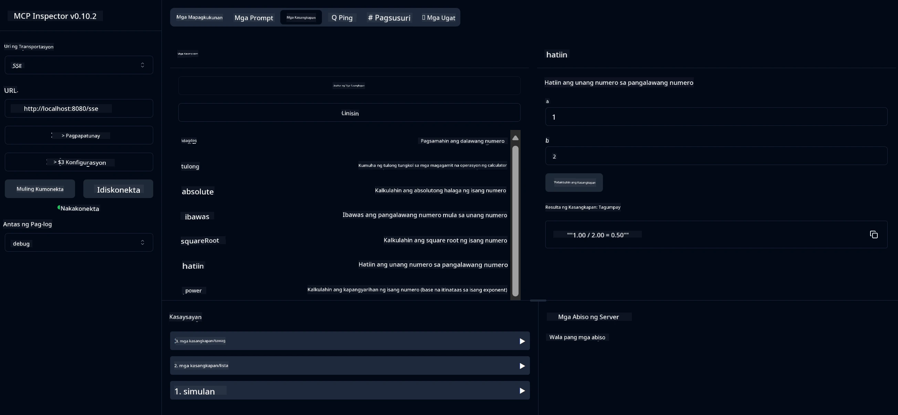

# Basic Calculator MCP Service

> [!NOTE]
> Ang solusyon na ito sa Java ay gumagamit ng legacy HTTP+SSE transport at target ang isang SDK
> na compatible sa MCP `2025-11-25`. Ito ay pinananatili para sa pagtugma ng code sa kurso;
> ang mga bagong remote server ay dapat gumamit ng `2026-07-28` Streamable HTTP support.

Ang serbisyong ito ay nagbibigay ng mga pangunahing operasyon ng calculator sa pamamagitan ng Model Context Protocol (MCP) gamit ang Spring Boot na may WebFlux transport. Dinisenyo ito bilang isang simpleng halimbawa para sa mga nagsisimula na nag-aaral tungkol sa mga implementasyon ng MCP.

Para sa karagdagang impormasyon, tingnan ang [MCP Server Boot Starter](https://docs.spring.io/spring-ai/reference/api/mcp/mcp-server-boot-starter-docs.html) na dokumentasyon ng sanggunian.


## Paggamit ng Serbisyo

Ipinapakita ng serbisyo ang mga sumusunod na API endpoints sa pamamagitan ng MCP protocol:

- `add(a, b)`: Magdagdag ng dalawang numero
- `subtract(a, b)`: Ibawas ang pangalawang numero mula sa una
- `multiply(a, b)`: Imultiply ang dalawang numero
- `divide(a, b)`: Hatiin ang unang numero sa pangalawa (may check sa zero)
- `power(base, exponent)`: Kalkulahin ang kapangyarihan ng isang numero
- `squareRoot(number)`: Kalkulahin ang square root (may check sa negatibong numero)
- `modulus(a, b)`: Kalkulahin ang natitirang bahagi sa paghahati
- `absolute(number)`: Kalkulahin ang absolute na halaga

## Mga Dependencies

Kinakailangan ng proyekto ang mga sumusunod na pangunahing dependencies:

```xml
<dependency>
    <groupId>org.springframework.ai</groupId>
    <artifactId>spring-ai-starter-mcp-server-webflux</artifactId>
</dependency>
```

## Pagbuo ng Proyekto

I-build ang proyekto gamit ang Maven:
```bash
./mvnw clean install -DskipTests
```

## Pagpapatakbo ng Server

### Paggamit ng Java

```bash
java -jar target/calculator-server-0.0.1-SNAPSHOT.jar
```

### Paggamit ng MCP Inspector

Ang MCP Inspector ay isang kapaki-pakinabang na tool para sa pakikipag-ugnayan sa mga serbisyo ng MCP. Para gamitin ito sa serbisyong calculator na ito:

1. **I-install at patakbuhin ang MCP Inspector** sa bagong terminal window:
   ```bash
   npx @modelcontextprotocol/inspector
   ```

2. **I-access ang web UI** sa pamamagitan ng pag-click sa URL na ipinakita ng app (karaniwang http://localhost:6274)

3. **I-configure ang koneksyon**:
   - Itakda ang uri ng transport sa "SSE"
   - Itakda ang URL sa SSE endpoint ng iyong tumatakbong server: `http://localhost:8080/sse`
   - I-click ang "Connect"

4. **Gamitin ang mga tool**:
   - I-click ang "List Tools" upang makita ang mga magagamit na operasyon ng calculator
   - Piliin ang isang tool at i-click ang "Run Tool" upang maisagawa ang operasyon



---

<!-- CO-OP TRANSLATOR DISCLAIMER START -->
**Pagtatanggi**:
Ang dokumentong ito ay isinalin gamit ang serbisyo ng AI translation na [Co-op Translator](https://github.com/Azure/co-op-translator). Bagama't nagsusumikap kami para sa katumpakan, pakatandaan na ang awtomatikong pagsasalin ay maaaring maglaman ng mga pagkakamali o hindi pagkakatugma. Ang orihinal na dokumento sa orihinal nitong wika ang dapat ituring na pangunahing sanggunian. Para sa mahahalagang impormasyon, inirerekomenda ang propesyonal na pagsasalin ng tao. Hindi kami mananagot sa anumang maling pagkakaintindi o maling interpretasyon na nagmula sa paggamit ng pagsasaling ito.
<!-- CO-OP TRANSLATOR DISCLAIMER END -->