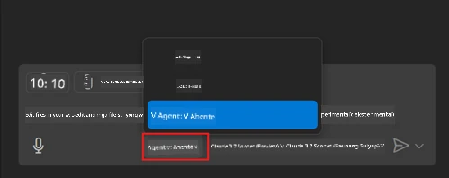
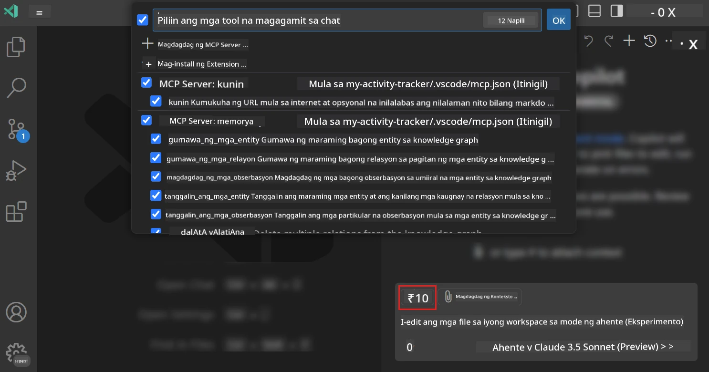
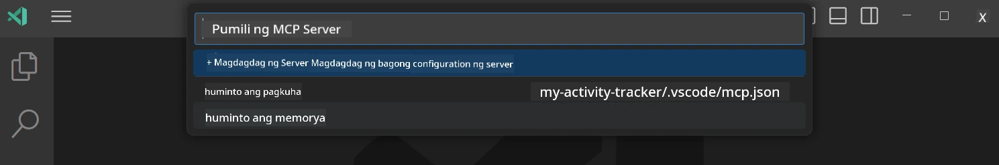
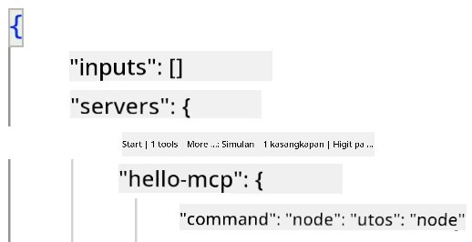
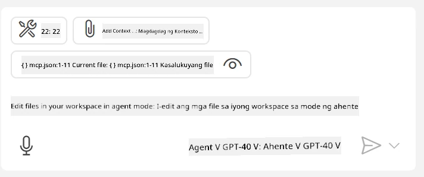
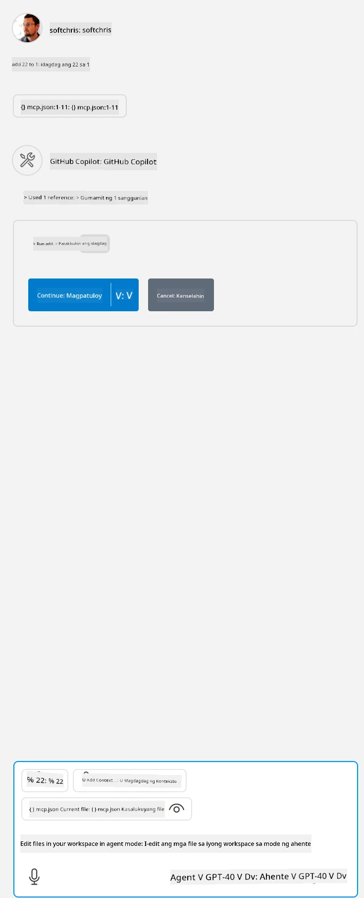

# Paggamit ng isang server mula sa GitHub Copilot Agent mode

Maaaring kumilos ang Visual Studio Code at GitHub Copilot bilang client at gamitin ang isang MCP Server. Bakit natin gusto gawin iyon, maaaring itanong mo? Well, ibig sabihin nito ay kahit anong feature na mayroon ang MCP Server ay maaari nang gamitin mula sa loob ng iyong IDE. Isipin mong idagdag mo halimbawa ang MCP server ng GitHub, ito ay magpapahintulot na makontrol ang GitHub gamit ang mga prompt kumpara sa pagsulat ng partikular na mga utos sa terminal. O isipin ang kahit ano pang maaaring mapabuti ang iyong karanasan bilang developer na nakokontrol ng natural na wika. Ngayon ay naiisip mo na ang benepisyo di ba?

## Pangkalahatang-ideya

Tinutukoy ng araling ito kung paano gamitin ang Visual Studio Code at GitHub Copilot Agent mode bilang client para sa iyong MCP Server.

## Mga Layunin sa Pagkatuto

Sa katapusan ng araling ito, magagawa mong:

- Gumamit ng MCP Server sa pamamagitan ng Visual Studio Code.
- Patakbuhin ang mga kakayahan tulad ng mga tool gamit ang GitHub Copilot.
- I-configure ang Visual Studio Code upang mahanap at mapamahalaan ang iyong MCP Server.

## Paggamit

Maaari mong kontrolin ang iyong MCP server sa dalawang magkakaibang paraan:

- Interface ng user, makikita mo kung paano ito gagawin sa mga susunod na bahagi ng kabanatang ito.
- Terminal, posible na kontrolin ang mga bagay mula sa terminal gamit ang `code` executable:

  Para idagdag ang isang MCP server sa iyong user profile, gamitin ang --add-mcp command line option, at ibigay ang JSON server configuration sa anyo na {\"name\":\"server-name\",\"command\":...}.

  ```
  code --add-mcp "{\"name\":\"my-server\",\"command\": \"uvx\",\"args\": [\"mcp-server-fetch\"]}"
  ```

### Mga Screenshot





Pag-usapan natin nang higit pa kung paano gamitin ang visual interface sa mga susunod na bahagi.

## Pamamaraan

Ganito ang pangkalahatang paraan ng paggawa nito:

- Mag-configure ng isang file upang mahanap ang aming MCP Server.
- Simulan/Kumonekta sa nasabing server upang magkaroon ng listahan ng mga kakayahan nito.
- Gamitin ang mga nasabing kakayahan sa pamamagitan ng GitHub Copilot Chat interface.

Magaling, ngayong nauunawaan na natin ang daloy, subukan nating gamitin ang MCP Server sa pamamagitan ng Visual Studio Code sa isang ehersisyo.

## Ehersisyo: Paggamit ng isang server

Sa ehersisyong ito, iko-configure natin ang Visual Studio Code upang mahanap ang iyong MCP server para magamit ito mula sa GitHub Copilot Chat interface.

### -0- Paunang hakbang, paganahin ang pagtuklas ng MCP Server

Maaaring kailanganin mong paganahin ang pagtuklas ng MCP Servers.

1. Pumunta sa `File -> Preferences -> Settings` sa Visual Studio Code.

1. Hanapin ang "MCP" at paganahin ang `chat.mcp.discovery.enabled` sa settings.json file.

### -1- Gumawa ng config file

Magsimula sa paggawa ng config file sa pinakapuno ng iyong proyekto, kailangan mo ng file na tinatawag na MCP.json at ilagay ito sa folder na tinatawag na .vscode. Dapat itong ganito ang anyo:

```text
.vscode
|-- mcp.json
```

Sunod, tingnan natin kung paano magdadagdag ng entry ng server.

### -2- I-configure ang isang server

Idagdag ang sumusunod na nilalaman sa *mcp.json*:

```json
{
    "inputs": [],
    "servers": {
       "hello-mcp": {
           "command": "node",
           "args": [
               "build/index.js"
           ]
       }
    }
}
```

Heto ang isang simpleng halimbawa kung paano simulan ang isang server na nakasulat sa Node.js, para sa ibang runtimes tukuyin ang tamang utos para simulan ang server gamit ang `command` at `args`.

### -3- Simulan ang server

Ngayong nadagdag mo na ang entry, simulan natin ang server:

1. Hanapin ang iyong entry sa *mcp.json* at siguruhing makita mo ang icon na "play":

    

1. I-click ang "play" icon, dapat makita mong dumami ang mga tools icon sa GitHub Copilot Chat bilang tanda na nadagdagan ang bilang ng mga available na tools. Kapag kinlick mo ang mga tools icon, makikita mo ang listahan ng mga rehistradong tools. Maaari mong i-check/uncheck ang bawat tool depende kung gusto mong gamitin ito ng GitHub Copilot bilang konteksto:

  

1. Para patakbuhin ang isang tool, mag-type ng prompt na alam mong tutugma sa paglalarawan ng isa sa iyong mga tools, halimbawa isang prompt na ganito "add 22 to 1":

  

  Dapat makita mo ang tugon na nagsasabing 23.

## Takdang-Aralin

Subukang magdagdag ng entry ng server sa iyong *mcp.json* file at siguraduhin na kaya mong simulan/patigilin ang server. Siguraduhin din na kaya mong makipag-usap sa mga tools sa iyong server gamit ang GitHub Copilot Chat interface.

## Solusyon

[Solution](./solution/README.md)

## Mahahalagang Punto

Ang mga mahahalagang puntos mula sa kabanatang ito ay ang sumusunod:

- Ang Visual Studio Code ay isang mahusay na client na nagbibigay-daan sa iyong gamitin ang iba't ibang MCP Servers at mga tools nila.
- Ang GitHub Copilot Chat interface ang paraan ng iyong pakikipag-ugnayan sa mga servers.
- Maaari kang mag-prompt sa user para sa mga input tulad ng API keys na maaaring ipasa sa MCP Server kapag kino-configure ang server entry sa *mcp.json* file.

## Mga Halimbawa

- [Java Calculator](../samples/java/calculator/README.md)
- [.Net Calculator](../../../../03-GettingStarted/samples/csharp)
- [JavaScript Calculator](../samples/javascript/README.md)
- [TypeScript Calculator](../samples/typescript/README.md)
- [Python Calculator](../../../../03-GettingStarted/samples/python)

## Karagdagang Mga Sanggunian

- [Visual Studio docs](https://code.visualstudio.com/docs/copilot/chat/mcp-servers)

## Ano ang Sunod

- Sunod: [Paglikha ng stdio Server](../05-stdio-server/README.md)

---

<!-- CO-OP TRANSLATOR DISCLAIMER START -->
**Pagtatanggi**:
Ang dokumentong ito ay isinalin gamit ang serbisyo ng AI translation na [Co-op Translator](https://github.com/Azure/co-op-translator). Bagama't nagsusumikap kami para sa katumpakan, pakatandaan na ang awtomatikong pagsasalin ay maaaring maglaman ng mga pagkakamali o hindi pagkakatugma. Ang orihinal na dokumento sa orihinal nitong wika ang dapat ituring na pangunahing sanggunian. Para sa mahahalagang impormasyon, inirerekomenda ang propesyonal na pagsasalin ng tao. Hindi kami mananagot sa anumang maling pagkakaintindi o maling interpretasyon na nagmula sa paggamit ng pagsasaling ito.
<!-- CO-OP TRANSLATOR DISCLAIMER END -->