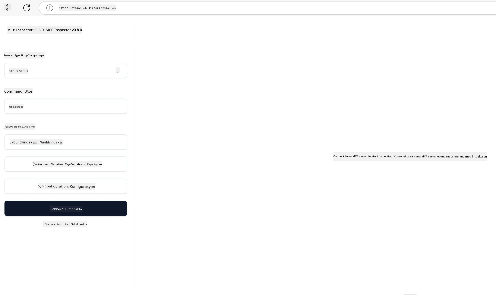

## Pagsusuri at Pag-debug

Bago ka magsimulang subukan ang iyong MCP server, mahalagang maunawaan ang mga magagamit na kasangkapan at pinakamahuhusay na pamamaraan para sa pag-debug. Ang epektibong pagsusuri ay nagsisiguro na ang iyong server ay kumikilos ayon sa inaasahan at tumutulong sa mabilis na pagtukoy at paglutas ng mga isyu. Ang sumusunod na seksyon ay naglalahad ng mga inirerekomendang pamamaraan para sa pag-validate ng iyong implementasyon ng MCP.

## Pangkalahatang-ideya

Tinutukoy ng araling ito kung paano pumili ng tamang pamamaraan ng pagsusuri at ang pinakaepektibong kasangkapan sa pagsusuri.

## Mga Layunin sa Pagkatuto

Sa pagtatapos ng araling ito, magagawa mong:

- Ilahad ang iba't ibang pamamaraan para sa pagsusuri.
- Gumamit ng iba't ibang kasangkapan upang epektibong subukan ang iyong kodigo.


## Pagsusuri ng mga MCP Server

Nagbibigay ang MCP ng mga kasangkapan upang tulungan kang subukan at i-debug ang iyong mga server:

- **MCP Inspector**: Isang command line tool na maaaring patakbuhin bilang isang CLI tool at bilang isang visual tool.
- **Manwal na pagsusuri**: Maaari kang gumamit ng kasangkapan tulad ng curl upang magpatakbo ng mga web request, ngunit anumang kasangkapan na kayang magpatakbo ng HTTP ay pwede.
- **Unit testing**: Posibleng gamitin ang iyong paboritong testing framework upang subukan ang mga tampok ng parehong server at client.

### Paggamit ng MCP Inspector

Nailarawan na namin ang paggamit ng kasangkapang ito sa mga nakaraang aralin ngunit pag-usapan natin ito nang kaunti sa mataas na antas. Ito ay isang kasangkapan na binuo sa Node.js at magagamit mo ito sa pamamagitan ng pagtawag sa executable na `npx` na magda-download at mag-i-install ng kasangkapan nang pansamantala at lilinisin ang sarili kapag natapos na nitong patakbuhin ang iyong kahilingan.

Ang [MCP Inspector](https://github.com/modelcontextprotocol/inspector) ay tumutulong sa iyo:

- **Tuklasin ang Mga Kakayahan ng Server**: Awtomatikong tuklasin ang magagamit na mga mapagkukunan, mga kasangkapan, at mga prompt
- **Subukan ang Pagpapatakbo ng Kasangkapan**: Subukan ang iba't ibang mga parametro at tingnan ang mga tugon nang real-time
- **Tingnan ang Metadata ng Server**: Suriin ang impormasyong server, mga schema, at mga konfigurasyon

Ang karaniwang pagpapatakbo ng tool ay ganito:

```bash
npx @modelcontextprotocol/inspector node build/index.js
```

Ang utos sa itaas ay nagpapasimula ng MCP at ang visual interface nito at naglulunsad ng lokal na web interface sa iyong browser. Maaari mong asahan na makakita ng dashboard na nagpapakita ng iyong mga nakarehistrong MCP server, ang kanilang magagamit na kasangkapan, mga mapagkukunan, at mga prompt. Pinapayagan ka ng interface na ito na subukan nang interaktibo ang pagpapatakbo ng kasangkapan, inspeksyunin ang metadata ng server, at tingnan ang mga tugon nang real-time, na nagpapadali sa pag-validate at pag-debug ng iyong mga implementasyon ng MCP server.

Ganito ang maaaring itsura nito: 

Maaari mo ring patakbuhin ang kasangkapang ito sa CLI mode kung saan idaragdag mo ang `--cli` na katangian. Narito ang isang halimbawa ng pagpapatakbo ng kasangkapan sa mode na "CLI" na naglilista ng lahat ng mga kasangkapan sa server:

```sh
npx @modelcontextprotocol/inspector --cli node build/index.js --method tools/list
```

### Manwal na Pagsusuri

Bukod sa pagpapatakbo ng inspector tool para subukan ang mga kakayahan ng server, isang kahalintulad na pamamaraan ay ang pagpapatakbo ng isang client na kayang gumamit ng HTTP gaya ng curl, halimbawa.

Sa curl, maaari mong subukan nang direktang ang mga MCP server gamit ang mga HTTP request:

```bash
# Halimbawa: Metadata ng test server
curl http://localhost:3000/v1/metadata

# Halimbawa: Patakbuhin ang isang tool
curl -X POST http://localhost:3000/v1/tools/execute \
  -H "Content-Type: application/json" \
  -d '{"name": "calculator", "parameters": {"expression": "2+2"}}'
```

Tulad ng nakikita mo mula sa paggamit ng curl sa itaas, gumagamit ka ng POST request para tawagin ang isang kasangkapan gamit ang payload na binubuo ng pangalan ng kasangkapan at ang mga parametro nito. Pumili ng pamamaraan na pinakabagay sa iyo. Karaniwang mas mabilis gamitin ang mga CLI tool at maaari silang gawing script na kapaki-pakinabang sa isang CI/CD na kapaligiran.

### Unit Testing

Gumawa ng unit tests para sa iyong mga kasangkapan at mga mapagkukunan upang matiyak na gumagana ang mga ito ayon sa inaasahan. Narito ang ilang halimbawa ng testing code.

```python
import pytest

from mcp.server.fastmcp import FastMCP
from mcp.shared.memory import (
    create_connected_server_and_client_session as create_session,
)

# I-mark ang buong module para sa async na mga test
pytestmark = pytest.mark.anyio


async def test_list_tools_cursor_parameter():
    """Test that the cursor parameter is accepted for list_tools.

    Note: FastMCP doesn't currently implement pagination, so this test
    only verifies that the cursor parameter is accepted by the client.
    """

 server = FastMCP("test")

    # Gumawa ng ilang mga kasangkapan sa pagsubok
    @server.tool(name="test_tool_1")
    async def test_tool_1() -> str:
        """First test tool"""
        return "Result 1"

    @server.tool(name="test_tool_2")
    async def test_tool_2() -> str:
        """Second test tool"""
        return "Result 2"

    async with create_session(server._mcp_server) as client_session:
        # Subukan nang walang cursor na parameter (inalis)
        result1 = await client_session.list_tools()
        assert len(result1.tools) == 2

        # Subukan gamit ang cursor=None
        result2 = await client_session.list_tools(cursor=None)
        assert len(result2.tools) == 2

        # Subukan gamit ang cursor bilang string
        result3 = await client_session.list_tools(cursor="some_cursor_value")
        assert len(result3.tools) == 2

        # Subukan gamit ang walang laman na string na cursor
        result4 = await client_session.list_tools(cursor="")
        assert len(result4.tools) == 2
    
```

Ang naunang kodigo ay gumagawa ng mga sumusunod:

- Gumagamit ng pytest framework na nagpapahintulot sa iyo na gumawa ng mga tests bilang mga function at gumamit ng assert statements.
- Lumilikha ng MCP Server na may dalawang magkakaibang kasangkapan.
- Gumagamit ng `assert` statement upang suriin na natutupad ang ilang mga kondisyon.

Tingnan ang [buong file dito](https://github.com/modelcontextprotocol/python-sdk/blob/main/tests/client/test_list_methods_cursor.py)

Batay sa itaas na file, maaari mong subukan ang iyong sariling server upang matiyak na ang mga kakayahan ay nilikha ayon sa nararapat.

Lahat ng pangunahing SDK ay may katulad na mga seksyon sa pagsusuri kaya maaari mong i-adjust sa napili mong runtime.

## Mga Halimbawa

- [Java Calculator](../samples/java/calculator/README.md)
- [.Net Calculator](../../../../03-GettingStarted/samples/csharp)
- [JavaScript Calculator](../samples/javascript/README.md)
- [TypeScript Calculator](../samples/typescript/README.md)
- [Python Calculator](../../../../03-GettingStarted/samples/python)

## Karagdagang Mga Mapagkukunan

- [Python SDK](https://github.com/modelcontextprotocol/python-sdk)

## Ano ang Susunod

- Susunod: [Deployment](../09-deployment/README.md)

---

<!-- CO-OP TRANSLATOR DISCLAIMER START -->
**Pagtatanggi**:
Ang dokumentong ito ay isinalin gamit ang serbisyo ng AI translation na [Co-op Translator](https://github.com/Azure/co-op-translator). Bagama't nagsusumikap kami para sa katumpakan, pakatandaan na ang awtomatikong pagsasalin ay maaaring maglaman ng mga pagkakamali o hindi pagkakatugma. Ang orihinal na dokumento sa orihinal nitong wika ang dapat ituring na pangunahing sanggunian. Para sa mahahalagang impormasyon, inirerekomenda ang propesyonal na pagsasalin ng tao. Hindi kami mananagot sa anumang maling pagkakaintindi o maling interpretasyon na nagmula sa paggamit ng pagsasaling ito.
<!-- CO-OP TRANSLATOR DISCLAIMER END -->