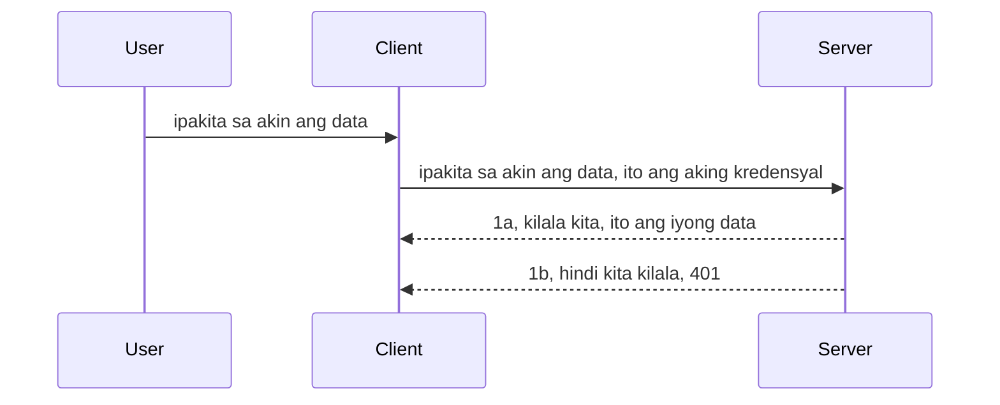

# Simple auth

Sinusuportahan ng MCP SDKs ang paggamit ng OAuth 2.1 na sa totoo lang ay isang medyo masalimuot na proseso na may kasamang mga konsepto tulad ng auth server, resource server, pag-post ng credentials, pagkuha ng code, pagpapalitan ng code para sa bearer token hanggang sa sa wakas ay makuha mo ang iyong resource data. Kung hindi ka pamilyar sa OAuth na magandang ipatupad, magandang ideya na magsimula sa ilang basic level ng auth at magtayo patungo sa mas mabuti at mas ligtas na seguridad. Kaya nandito ang kabanatang ito, upang ituro sa iyo patungo sa mas advanced na auth.

## Auth, ano ang ibig sabihin natin?

Ang Auth ay pinaikling authentication at authorization. Ang ideya ay kailangan nating gawin ang dalawang bagay:

- **Authentication**, na proseso ng pagtukoy kung papayagan ba natin ang isang tao na pumasok sa ating bahay, na meron silang karapatang "nandito" ibig sabihin ay may access sa ating resource server kung saan naroroon ang mga feature ng ating MCP Server.
- **Authorization**, ay proseso ng pagtukoy kung dapat bang magkaroon ng access ang isang user sa mga partikular na resources na hinihingi nila, halimbawa mga order na ito o mga produktong ito o kung pinapayagang basahin nila ang nilalaman ngunit hindi burahin bilang isa pang halimbawa.

## Mga Credential: paano natin sasabihin sa sistema kung sino tayo

Kadalasan, ang karamihan sa web developers ay nag-iisip sa pagbibigay ng credential sa server, karaniwan ay isang secret na nagsasabing kung pinapayagan silang narito "Authentication". Ang credential na ito ay karaniwang base64 encoded na bersyon ng username at password o isang API key na tiyak na kumikilala sa isang partikular na user. 

Ito ay ipinapadala sa pamamagitan ng header na tinatawag na "Authorization" ganito:

```json
{ "Authorization": "secret123" }
```

Ito ay karaniwang tinatawag na basic authentication. Ang pangkalahatang daloy ay gumagana sa ganitong paraan:


Ngayon na naintindihan natin kung paano ito gumagana mula sa daloy, paano natin ito ipatutupad? Karamihan sa mga web server ay may konsepto ng middleware, isang bahagi ng code na tumatakbo bilang bahagi ng request na maaaring mag-verify ng credentials, at kung tama ang credentials hayaan ang request na dumaan. Kung wala o mali ang credentials, magkakaroon ng error sa auth. Tingnan natin kung paano ito ipatutupad:

**Python**

```python
class AuthMiddleware(BaseHTTPMiddleware):
    async def dispatch(self, request, call_next):

        has_header = request.headers.get("Authorization")
        if not has_header:
            print("-> Missing Authorization header!")
            return Response(status_code=401, content="Unauthorized")

        if not valid_token(has_header):
            print("-> Invalid token!")
            return Response(status_code=403, content="Forbidden")

        print("Valid token, proceeding...")
       
        response = await call_next(request)
        # magdagdag ng anumang header ng customer o baguhin ang tugon sa ilang paraan
        return response


starlette_app.add_middleware(CustomHeaderMiddleware)
```

Narito ang mga ginawa:

- Nilikha ang middleware na tinatawag na `AuthMiddleware` kung saan ang `dispatch` method nito ay tinatawag ng web server.
- Inilagay ang middleware sa web server:

    ```python
    starlette_app.add_middleware(AuthMiddleware)
    ```

- Nagsulat ng validation logic na nagsisiyasat kung nandiyan ang Authorization header at kung tama ang secret na ipinapadala:

    ```python
    has_header = request.headers.get("Authorization")
    if not has_header:
        print("-> Missing Authorization header!")
        return Response(status_code=401, content="Unauthorized")

    if not valid_token(has_header):
        print("-> Invalid token!")
        return Response(status_code=403, content="Forbidden")
    ```

    kung ang secret ay nandiyan at tama papayagan ang request na dumaan sa pamamagitan ng pagtawag sa `call_next` at ibalik ang response.

    ```python
    response = await call_next(request)
    # magdagdag ng anumang header ng customer o baguhin ang tugon sa anumang paraan
    return response
    ```

Gumagana ito na kapag may ginawa na web request papunta sa server ay tatawagin ang middleware at base sa implementasyon nito ay papayagan nito ang request na dumaan o magbabalik ng error na nagsasabing hindi payagan ang client na magpatuloy.

**TypeScript**

Dito tayo gagawa ng middleware gamit ang kilalang framework na Express at mahuhuli ang request bago makarating sa MCP Server. Narito ang code para dito:

```typescript
function isValid(secret) {
    return secret === "secret123";
}

app.use((req, res, next) => {
    // 1. Nasa header ba ang awtorisasyon?
    if(!req.headers["Authorization"]) {
        res.status(401).send('Unauthorized');
    }
    
    let token = req.headers["Authorization"];

    // 2. Suriin ang bisa.
    if(!isValid(token)) {
        res.status(403).send('Forbidden');
    }

   
    console.log('Middleware executed');
    // 3. Ipapasa ang kahilingan sa susunod na hakbang sa pipeline ng kahilingan.
    next();
});
```

Sa code na ito:

1. Sinusuri namin kung nandiyan ba ang Authorization header, kung wala nagpapadala kami ng 401 error.
2. Tinitiyak naming valid ang credential/token, kung hindi nagpapadala kami ng 403 error.
3. Sa huli, pinapasa ang request sa request pipeline at ibinabalik ang hiniling na resource.

## Ehersisyo: Ipatupad ang authentication

Gamitin natin ang ating kaalaman at subukang ipatupad ito. Narito ang plano:

Server

- Gumawa ng web server at MCP instance.
- Ipatupad ang middleware para sa server.

Client 

- Magpadala ng web request gamit ang credential sa header.

### -1- Gumawa ng web server at MCP instance

Sa unang hakbang, kailangang gawin natin ang web server instance at ang MCP Server.

**Python**

Dito tayo gagawa ng MCP server instance, gumawa ng starlette web app at ihahost ito gamit ang uvicorn.

```python
# gumagawa ng MCP Server

app = FastMCP(
    name="MCP Resource Server",
    instructions="Resource Server that validates tokens via Authorization Server introspection",
    host=settings["host"],
    port=settings["port"],
    debug=True
)

# gumagawa ng starlette web app
starlette_app = app.streamable_http_app()

# nagseserbisyo ng app gamit ang uvicorn
async def run(starlette_app):
    import uvicorn
    config = uvicorn.Config(
            starlette_app,
            host=app.settings.host,
            port=app.settings.port,
            log_level=app.settings.log_level.lower(),
        )
    server = uvicorn.Server(config)
    await server.serve()

run(starlette_app)
```

Sa code na ito:

- Gumawa ng MCP Server.
- Ginawa ang starlette web app mula sa MCP Server gamit ang `app.streamable_http_app()`.
- Inihost at sinilbihan ang web app gamit ang uvicorn `server.serve()`.

**TypeScript**

Dito gagawa tayo ng MCP Server instance.

```typescript
const server = new McpServer({
      name: "example-server",
      version: "1.0.0"
    });

    // ... maghanda ng mga yaman ng server, mga kagamitan, at mga prompt ...
```

Kailangang gawin ang MCP Server na ito sa loob ng POST /mcp route definition, kaya ililipat natin ang code sa ganito:

```typescript
import express from "express";
import { randomUUID } from "node:crypto";
import { McpServer } from "@modelcontextprotocol/sdk/server/mcp.js";
import { StreamableHTTPServerTransport } from "@modelcontextprotocol/sdk/server/streamableHttp.js";
import { isInitializeRequest } from "@modelcontextprotocol/sdk/types.js"

const app = express();
app.use(express.json());

// Mapa para itago ang mga transport ayon sa session ID
const transports: { [sessionId: string]: StreamableHTTPServerTransport } = {};

// Pangasiwaan ang mga POST na kahilingan para sa komunikasyon ng kliyente-papunta sa server
app.post('/mcp', async (req, res) => {
  // Suriin kung may existing na session ID
  const sessionId = req.headers['mcp-session-id'] as string | undefined;
  let transport: StreamableHTTPServerTransport;

  if (sessionId && transports[sessionId]) {
    // Gamitin muli ang umiiral na transport
    transport = transports[sessionId];
  } else if (!sessionId && isInitializeRequest(req.body)) {
    // Bagong kahilingan para sa inisyal na pag-set up
    transport = new StreamableHTTPServerTransport({
      sessionIdGenerator: () => randomUUID(),
      onsessioninitialized: (sessionId) => {
        // Itago ang transport ayon sa session ID
        transports[sessionId] = transport;
      },
      // Ang proteksyon laban sa DNS rebinding ay naka-disable bilang default para sa backwards compatibility. Kung pinapatakbo mo ang server na ito
      // nang lokal, siguraduhing itakda ang:
      // enableDnsRebindingProtection: true,
      // allowedHosts: ['127.0.0.1'],
    });

    // Linisin ang transport kapag isinara
    transport.onclose = () => {
      if (transport.sessionId) {
        delete transports[transport.sessionId];
      }
    };
    const server = new McpServer({
      name: "example-server",
      version: "1.0.0"
    });

    // ... i-set up ang mga resources, tools, at prompts ng server ...

    // Kumonekta sa MCP server
    await server.connect(transport);
  } else {
    // Di-wastong kahilingan
    res.status(400).json({
      jsonrpc: '2.0',
      error: {
        code: -32000,
        message: 'Bad Request: No valid session ID provided',
      },
      id: null,
    });
    return;
  }

  // Pangasiwaan ang kahilingan
  await transport.handleRequest(req, res, req.body);
});

// Muling magagamit na handler para sa GET at DELETE na mga kahilingan
const handleSessionRequest = async (req: express.Request, res: express.Response) => {
  const sessionId = req.headers['mcp-session-id'] as string | undefined;
  if (!sessionId || !transports[sessionId]) {
    res.status(400).send('Invalid or missing session ID');
    return;
  }
  
  const transport = transports[sessionId];
  await transport.handleRequest(req, res);
};

// Pangasiwaan ang mga GET na kahilingan para sa abiso mula server-papunta sa kliyente gamit ang SSE
app.get('/mcp', handleSessionRequest);

// Pangasiwaan ang mga DELETE na kahilingan para sa pagtatapos ng session
app.delete('/mcp', handleSessionRequest);

app.listen(3000);
```

Makikita mo na ang paglikha ng MCP Server ay inilipat sa loob ng `app.post("/mcp")`.

Tuloy tayo sa susunod na hakbang na paggawa ng middleware para ma-validate ang papasok na credential.

### -2- Ipatupad ang middleware para sa server

Ngayon ay gagawa tayo ng middleware na hahanapin ang credential sa `Authorization` header at ivavalidate ito. Kapag tanggap ay magpapatuloy ang request para gawin ang kinakailangan (halimbawa, listahan ng tools, pagbabasa ng isang resource, o anuman MCP functionality na hinihingi ng client).

**Python**

Para gumawa ng middleware, kailangan nating gumawa ng class na minana mula sa `BaseHTTPMiddleware`. May dalawang interesanteng bahagi:

- Ang request `request`, kung saan babasahin natin ang header info.
- `call_next` ang callback na tatawagin kapag may dalang tanggap na credential ang client.

Una, hawakan natin ang kaso kung wala ang `Authorization` header:

```python
has_header = request.headers.get("Authorization")

# walang header na naroroon, mag-fail sa 401, kung hindi ay magpatuloy.
if not has_header:
    print("-> Missing Authorization header!")
    return Response(status_code=401, content="Unauthorized")
```

Nagpapadala dito ng 401 unauthorized message dahil pumalya ang client sa authentication.

Sunod, kung may isinubmit na credential, kailangang suriin ang bisa nito ganito:

```python
 if not valid_token(has_header):
    print("-> Invalid token!")
    return Response(status_code=403, content="Forbidden")
```

Mapapansin kung paano nagpapadala ng 403 forbidden message. Tingnan ang buong middleware code sa ibaba na ipinatutupad ang lahat ng nabanggit:

```python
class AuthMiddleware(BaseHTTPMiddleware):
    async def dispatch(self, request, call_next):

        has_header = request.headers.get("Authorization")
        if not has_header:
            print("-> Missing Authorization header!")
            return Response(status_code=401, content="Unauthorized")

        if not valid_token(has_header):
            print("-> Invalid token!")
            return Response(status_code=403, content="Forbidden")

        print("Valid token, proceeding...")
        print(f"-> Received {request.method} {request.url}")
        response = await call_next(request)
        response.headers['Custom'] = 'Example'
        return response

```

Magaling, pero paano ang `valid_token` function? Narito ito sa ibaba:

```python
# HUWAG gamitin para sa produksyon - pagandahin ito !!
def valid_token(token: str) -> bool:
    # alisin ang prefix na "Bearer "
    if token.startswith("Bearer "):
        token = token[7:]
        return token == "secret-token"
    return False
```

Dapat itong pagandahin pa.

MAHALAGA: Huwag kailanman ilagay ang mga secret na ganito sa code. Dapat kunin ang value mula sa data source o mula sa IDP (identity service provider) o mas mabuting hayaan ang IDP ang mag-validate.

**TypeScript**

Para ipatupad ito gamit ang Express, kailangan natin tawagin ang `use` method na tumatanggap ng middleware functions.

Kailangan nating:

- Makipag-interact sa request variable para suriin ang credential na pumasa sa `Authorization` property.
- Ivalidate ang credential, at kung tama, hayaan ang request na magpatuloy para gawin ng client ang kanyang MCP request (halimbawa, list tools, read resource, o anumang MCP-related).

Dito, sinisiyasat natin kung nandiyan ang `Authorization` header at kung wala, pinipigilan ang request:

```typescript
if(!req.headers["authorization"]) {
    res.status(401).send('Unauthorized');
    return;
}
```

Kung walang header, makakatanggap ng 401.

Sunod, sinisiyasat kung valid ang credential, kung hindi, hihinto uli ang request pero ibang message ang isusulat:

```typescript
if(!isValid(token)) {
    res.status(403).send('Forbidden');
    return;
} 
```

Makakakuha ka ng 403 error.

Narito ang buong code:

```typescript
app.use((req, res, next) => {
    console.log('Request received:', req.method, req.url, req.headers);
    console.log('Headers:', req.headers["authorization"]);
    if(!req.headers["authorization"]) {
        res.status(401).send('Unauthorized');
        return;
    }
    
    let token = req.headers["authorization"];

    if(!isValid(token)) {
        res.status(403).send('Forbidden');
        return;
    }  

    console.log('Middleware executed');
    next();
});
```

Naka-set up ang web server para tumanggap ng middleware para suriin ang credential na sana ipapadala ng client. Paano naman ang client mismo?

### -3- Magpadala ng web request gamit ang credential sa header

Kailangan nating tiyakin na ipinapasa ng client ang credential sa header. Gagamit tayo ng MCP client kaya kailangang malaman kung paano ito gawin.

**Python**

Para sa client, kailangan nating maglagay ng header na may credential ganito:

```python
# HUWAG i-hardcode ang halaga, ilagay ito kahit man lang sa isang environment variable o mas ligtas na imbakan
token = "secret-token"

async with streamablehttp_client(
        url = f"http://localhost:{port}/mcp",
        headers = {"Authorization": f"Bearer {token}"}
    ) as (
        read_stream,
        write_stream,
        session_callback,
    ):
        async with ClientSession(
            read_stream,
            write_stream
        ) as session:
            await session.initialize()
      
            # TODO, kung ano ang gusto mong gawin sa client, hal. listahan ng mga tool, tawagan ang mga tool atbp.
```

Mapapansin kung paano pinupuno ang `headers` property ng ganito ` headers = {"Authorization": f"Bearer {token}"}`.

**TypeScript**

Maisasaayos ito sa dalawang hakbang:

1. Punan ang configuration object gamit ang credential.
2. Ibigay ang configuration object sa transport.

```typescript

// HUWAG i-hardcode ang halaga tulad ng ipinakita dito. Sa pinakamababa, gawin itong isang environment variable at gumamit ng tulad ng dotenv (sa dev mode).
let token = "secret123"

// tukuyin ang isang client transport option object
let options: StreamableHTTPClientTransportOptions = {
  sessionId: sessionId,
  requestInit: {
    headers: {
      "Authorization": "secret123"
    }
  }
};

// ipasa ang options object sa transport
async function main() {
   const transport = new StreamableHTTPClientTransport(
      new URL(serverUrl),
      options
   );
```

Makikita mo kung paano gumawa ng `options` object at inilagay ang mga headers sa `requestInit` property.

MAHALAGA: Paano pa ito pagbutihin? Ang kasalukuyang implementasyon ay may mga isyu. Una ay risky ang pagpapasa ng credential na ito maliban kung may HTTPS. Kahit may HTTPS, pwedeng makuha ang credential kaya kailangan ng sistema kung saan madaling ma-revoke ang token at magdagdag ng dagdag na tseke tulad ng lokasyon ng request, madalas ba itong nangyayari (bot-like behavior), at iba pa, maraming bagay na kailangang isaalang-alang.

Gayunpaman, para sa napakasimpleng APIs kung saan ayaw mong tawagan ito ng sinuman nang hindi authenticated ay magandang panimulang punto ito.

Ngayon, subukan nating higpitan ang seguridad gamit ang standardized format tulad ng JSON Web Token, kilala rin bilang JWT o "JOT" tokens.

## JSON Web Tokens, JWT

Kaya, sinusubukan nating pagbutihin ang pagpapadala ng napakasimpleng credentials. Ano ang mga pangunahing benepisyo ng pag-adopt ng JWT?

- **Pagbuti sa Seguridad**. Sa basic auth, paulit-ulit mong ipinapadala ang username at password bilang base64 encoded token (o API key) na nagpapataas ng panganib. Sa JWT, ipinapadala mo ang username at password at nakakakuha ng token bilang kapalit na time bound at mag-e-expire. Pinapadali ng JWT ang fine-grained access control gamit ang roles, scopes, at permissions.
- **Statelessness at scalability**. Self-contained ang JWTs, dala ang lahat ng impormasyon ng user kaya hindi na kailangan mag-imbak ng session server-side. Pwede ring i-validate ang token locally.
- **Interoperability at federation**. Sentro ang JWTs sa Open ID Connect at ginagamit ng kilalang identity providers tulad ng Entra ID, Google Identity, at Auth0. Pinapagana nito ang single sign on at marami pang iba kaya angkop sa enterprise.
- **Modularity at flexibility**. Pwede rin gamitin ang JWTs sa API Gateways tulad ng Azure API Management, NGINX, at iba pa. Sinusuportahan nito ang mga authentication scenarios pati na server-to-service communication kasama na ang impersonation at delegation scenarios.
- **Performance at caching**. Pwedeng i-cache ang JWTs pagkatapos i-decode para mabawasan ang parsing. Nakakatulong ito sa high-traffic apps dahil pinabubuti ang throughput at pinapababa ang load sa infrastructure.
- **Advanced features**. Sinusuportahan din nito ang introspection (pagsusuri ng validity sa server) at revocation (paggawing invalid ng token).

Dahil sa lahat ng benepisyo, tingnan natin kung paano natin mapapalakas pa ang ating implementasyon.

## Pagtalikod mula sa basic auth patungo sa JWT

Ang mga pagbabago sa mataas na antas ay:

- **Matutong bumuo ng JWT token** at ihanda para ipadala mula client papunta server.
- **Ivalidate ang JWT token**, at kung tama, bigyan ang client ng access sa resources.
- **Ligtas na imbakan ng token**. Paano natin i-iimbak ang token.
- **Protektahan ang mga ruta**. Kailangang protektahan ang mga ruta, sa ating kaso, mga ruta at partikular na MCP features.
- **Magdagdag ng refresh tokens**. Gumawa ng mga token na panandalian pero may refresh tokens na pangmatagalan na pwede gamitin para kumuha ng bagong token kapag expired na. Siguruhing may refresh endpoint at rotation strategy.

### -1- Bumuo ng JWT token

Una, ang JWT token ay may mga sumusunod na bahagi:

- **header**, algorithm na gamit at uri ng token.
- **payload**, claims tulad ng sub (ang user o entity na kinakatawan ng token, karaniwan ay userid sa auth scenario), exp (kung kailan mag-e-expire) role (ang papel niya)
- **signature**, pinirmahan gamit ang secret o private key.

Para dito, kailangan nating buuin ang header, payload at ang encoded token.

**Python**

```python

import jwt
import jwt
from jwt.exceptions import ExpiredSignatureError, InvalidTokenError
import datetime

# Lihim na susi na ginagamit upang pirmahan ang JWT
secret_key = 'your-secret-key'

header = {
    "alg": "HS256",
    "typ": "JWT"
}

# ang impormasyon ng user at ang mga claim nito at oras ng pag-expire
payload = {
    "sub": "1234567890",               # Paksa (ID ng user)
    "name": "User Userson",                # Pasadyang claim
    "admin": True,                     # Pasadyang claim
    "iat": datetime.datetime.utcnow(),# Inilabas noong
    "exp": datetime.datetime.utcnow() + datetime.timedelta(hours=1)  # Pag-expire
}

# i-encode ito
encoded_jwt = jwt.encode(payload, secret_key, algorithm="HS256", headers=header)
```

Sa code sa itaas:

- Nagdefine ng header na gumagamit ng HS256 bilang algorithm at JWT bilang uri.
- Bumuo ng payload na may subject o user id, username, role, kung kailan inisyu, at expiry na nag-iimplementa ng time bound na aspetong nabanggit.

**TypeScript**

Kailangan natin ng ilang dependencies para makatulong sa paggawa ng JWT token.

Dependencies

```sh

npm install jsonwebtoken
npm install --save-dev @types/jsonwebtoken
```

Ngayon na nandiyan na, ginawa natin ang header, payload at ginawang encoded token.

```typescript
import jwt from 'jsonwebtoken';

const secretKey = 'your-secret-key'; // Gamitin ang mga env vars sa produksyon

// Tukuyin ang payload
const payload = {
  sub: '1234567890',
  name: 'User usersson',
  admin: true,
  iat: Math.floor(Date.now() / 1000), // Nilabas noong
  exp: Math.floor(Date.now() / 1000) + 60 * 60 // Mag-e-expire sa loob ng 1 oras
};

// Tukuyin ang header (opsyonal, nagse-set ang jsonwebtoken ng mga default)
const header = {
  alg: 'HS256',
  typ: 'JWT'
};

// Lumikha ng token
const token = jwt.sign(payload, secretKey, {
  algorithm: 'HS256',
  header: header
});

console.log('JWT:', token);
```

Ang token na ito ay:

Pinirmahan gamit ang HS256
Valid ng 1 oras
May kasamang claims tulad ng sub, name, admin, iat, at exp.

### -2- Ivalidate ang token

Kailangan din nating i-validate ang token, ito ay dapat gawin sa server para masiguro na ang ipinapadala ng client ay valid talaga. Maraming tseke ang dapat gawin mula sa pagsuri ng istruktura hanggang sa validity. Mas mainam din na magdagdag ng ibang tseke para tiyakin kung ang user ay nandito sa ating sistema at kung may karapatan ba siya.

Para i-validate, kailangang i-decode ang token para mabasa at simulan ang pagsusuri ng validity:

**Python**

```python

# I-decode at i-verify ang JWT
try:
    decoded = jwt.decode(token, secret_key, algorithms=["HS256"])
    print("✅ Token is valid.")
    print("Decoded claims:")
    for key, value in decoded.items():
        print(f"  {key}: {value}")
except ExpiredSignatureError:
    print("❌ Token has expired.")
except InvalidTokenError as e:
    print(f"❌ Invalid token: {e}")

```

Sa code na ito, tinawag natin ang `jwt.decode` gamit ang token, secret key, at algorithm na pinili bilang input. Napapansin ang try-catch construct dahil kapag nabigo ang validation ay magtataas ng error.

**TypeScript**

Dito kailangan nating tawagin ang `jwt.verify` para makakuha ng decoded na token na maaari nating susuriin nang mas detalyado. Kung mabigo ito, ibig sabihin mali ang istruktura ng token o hindi na ito valid.

```typescript

try {
  const decoded = jwt.verify(token, secretKey);
  console.log('Decoded Payload:', decoded);
} catch (err) {
  console.error('Token verification failed:', err);
}
```

TANDAAN: gaya ng sinabi dati, dapat magdagdag ng iba pang tseke para siguraduhin na ang token ay kumakatawan sa user sa ating sistema at may karapatan ang user na iyon.

Sunod, tingnan natin ang role based access control, na kilala rin bilang RBAC.
## Pagdaragdag ng role based access control

Ang ideya ay nais nating ipahayag na ang iba't ibang mga role ay may iba't ibang mga pahintulot. Halimbawa, inaasahan natin na ang isang admin ay maaaring gawin ang lahat at ang isang normal na user ay maaaring magbasa/sulat at ang isang guest ay maaari lamang magbasa. Kaya, narito ang ilang posibleng antas ng pahintulot:

- Admin.Write 
- User.Read
- Guest.Read

Tingnan natin kung paano natin maipapatupad ang ganitong kontrol gamit ang middleware. Ang mga middleware ay maaaring idagdag kada ruta pati na rin para sa lahat ng mga ruta.

**Python**

```python
from starlette.middleware.base import BaseHTTPMiddleware
from starlette.responses import JSONResponse
import jwt

# HUWAG ilagay ang sikreto sa code tulad nito, para lamang ito sa layunin ng demonstrasyon. Basahin ito mula sa ligtas na lugar.
SECRET_KEY = "your-secret-key" # ilagay ito sa env variable
REQUIRED_PERMISSION = "User.Read"

class JWTPermissionMiddleware(BaseHTTPMiddleware):
    async def dispatch(self, request, call_next):
        auth_header = request.headers.get("Authorization")
        if not auth_header or not auth_header.startswith("Bearer "):
            return JSONResponse({"error": "Missing or invalid Authorization header"}, status_code=401)

        token = auth_header.split(" ")[1]
        try:
            decoded = jwt.decode(token, SECRET_KEY, algorithms=["HS256"])
        except jwt.ExpiredSignatureError:
            return JSONResponse({"error": "Token expired"}, status_code=401)
        except jwt.InvalidTokenError:
            return JSONResponse({"error": "Invalid token"}, status_code=401)

        permissions = decoded.get("permissions", [])
        if REQUIRED_PERMISSION not in permissions:
            return JSONResponse({"error": "Permission denied"}, status_code=403)

        request.state.user = decoded
        return await call_next(request)


```

May ilang iba't ibang mga paraan para idagdag ang middleware gaya ng nasa ibaba:

```python

# Alt 1: magdagdag ng middleware habang binubuo ang starlette app
middleware = [
    Middleware(JWTPermissionMiddleware)
]

app = Starlette(routes=routes, middleware=middleware)

# Alt 2: magdagdag ng middleware pagkatapos mabuo ang starlette app
starlette_app.add_middleware(JWTPermissionMiddleware)

# Alt 3: magdagdag ng middleware bawat ruta
routes = [
    Route(
        "/mcp",
        endpoint=..., # handler
        middleware=[Middleware(JWTPermissionMiddleware)]
    )
]
```

**TypeScript**

Maaari nating gamitin ang `app.use` at isang middleware na tatakbo para sa lahat ng mga request. 

```typescript
app.use((req, res, next) => {
    console.log('Request received:', req.method, req.url, req.headers);
    console.log('Headers:', req.headers["authorization"]);

    // 1. Suriin kung naipadala na ang authorization header

    if(!req.headers["authorization"]) {
        res.status(401).send('Unauthorized');
        return;
    }
    
    let token = req.headers["authorization"];

    // 2. Suriin kung ang token ay balido
    if(!isValid(token)) {
        res.status(403).send('Forbidden');
        return;
    }  

    // 3. Suriin kung ang gumagamit ng token ay umiiral sa ating sistema
    if(!isExistingUser(token)) {
        res.status(403).send('Forbidden');
        console.log("User does not exist");
        return;
    }
    console.log("User exists");

    // 4. Patunayan na ang token ay may tamang pahintulot
    if(!hasScopes(token, ["User.Read"])){
        res.status(403).send('Forbidden - insufficient scopes');
    }

    console.log("User has required scopes");

    console.log('Middleware executed');
    next();
});

```

May ilang mga bagay na pwede nating ipagawa sa ating middleware at ang middleware AY DAPAT gawin, katulad ng:

1. Tingnan kung present ang authorization header
2. Tingnan kung valid ang token, tinatawag natin ang `isValid` na isang method na isinulat natin na sumusuri sa integridad at bisa ng JWT token.
3. Patunayan na umiiral ang user sa ating sistema, dapat nating suriin ito.

   ```typescript
    // mga gumagamit sa DB
   const users = [
     "user1",
     "User usersson",
   ]

   function isExistingUser(token) {
     let decodedToken = verifyToken(token);

     // TODO, suriin kung umiiral ang gumagamit sa DB
     return users.includes(decodedToken?.name || "");
   }
   ```

   Sa itaas, gumawa tayo ng napakasimpleng listahan ng `users`, na dapat ay nasa database naman talaga.

4. Bukod dito, dapat ding suriin kung ang token ay may tamang mga pahintulot.

   ```typescript
   if(!hasScopes(token, ["User.Read"])){
        res.status(403).send('Forbidden - insufficient scopes');
   }
   ```

   Sa code sa itaas mula sa middleware, sinusuri natin na ang token ay may User.Read na pahintulot, kung wala ay magpapadala tayo ng 403 error. Nasa ibaba ang `hasScopes` na helper method.

   ```typescript
   function hasScopes(scope: string, requiredScopes: string[]) {
     let decodedToken = verifyToken(scope);
    return requiredScopes.every(scope => decodedToken?.scopes.includes(scope));
  }
   ```

Have a think which additional checks you should be doing, but these are the absolute minimum of checks you should be doing.

Using Express as a web framework is a common choice. There are helpers library when you use JWT so you can write less code.

- `express-jwt`, helper library that provides a middleware that helps decode your token.
- `express-jwt-permissions`, this provides a middleware `guard` that helps check if a certain permission is on the token.

Here's what these libraries can look like when used:

```typescript
const express = require('express');
const jwt = require('express-jwt');
const guard = require('express-jwt-permissions')();

const app = express();
const secretKey = 'your-secret-key'; // put this in env variable

// Decode JWT and attach to req.user
app.use(jwt({ secret: secretKey, algorithms: ['HS256'] }));

// Check for User.Read permission
app.use(guard.check('User.Read'));

// multiple permissions
// app.use(guard.check(['User.Read', 'Admin.Access']));

app.get('/protected', (req, res) => {
  res.json({ message: `Welcome ${req.user.name}` });
});

// Error handler
app.use((err, req, res, next) => {
  if (err.code === 'permission_denied') {
    return res.status(403).send('Forbidden');
  }
  next(err);
});

```

Ngayon ay nakita mo na kung paano magagamit ang middleware para sa parehong authentication at authorization, paano naman ang MCP, binabago ba nito ang paraan natin ng auth? Alamin natin sa susunod na seksyon.

### -3- Magdagdag ng RBAC sa MCP

Nakita mo na kung paano magdagdag ng RBAC gamit ang middleware, subalit para sa MCP ay walang madaling paraan para magdagdag ng RBAC kada MCP feature, ano ang gagawin natin? Kailangan lang nating magdagdag ng code tulad nito na sinusuri sa kasong ito kung ang client ay may karapatan na tawagan ang isang partikular na tool:

May ilang iba't ibang pagpipilian kung paano gawin ang per feature RBAC, ilan dito ay:

- Magdagdag ng tseke para sa bawat tool, resource, prompt kung saan kailangan mong suriin ang antas ng pahintulot.

   **python**

   ```python
   @tool()
   def delete_product(id: int):
      try:
          check_permissions(role="Admin.Write", request)
      catch:
        pass # nabigo ang kliyente sa awtorisasyon, magtaas ng error sa awtorisasyon
   ```

   **typescript**

   ```typescript
   server.registerTool(
    "delete-product",
    {
      title: Delete a product",
      description: "Deletes a product",
      inputSchema: { id: z.number() }
    },
    async ({ id }) => {
      
      try {
        checkPermissions("Admin.Write", request);
        // todo, ipadala ang id sa productService at remote entry
      } catch(Exception e) {
        console.log("Authorization error, you're not allowed");  
      }

      return {
        content: [{ type: "text", text: `Deletected product with id ${id}` }]
      };
    }
   );
   ```


- Gumamit ng advanced server approach at mga request handlers para mapaliit ang dami ng lugar kung saan kailangang gawin ang tseke.

   **Python**

   ```python
   
   tool_permission = {
      "create_product": ["User.Write", "Admin.Write"],
      "delete_product": ["Admin.Write"]
   }

   def has_permission(user_permissions, required_permissions) -> bool:
      # user_permissions: listahan ng mga pahintulot na hawak ng gumagamit
      # required_permissions: listahan ng mga pahintulot na kailangan para sa tool
      return any(perm in user_permissions for perm in required_permissions)

   @server.call_tool()
   async def handle_call_tool(
     name: str, arguments: dict[str, str] | None
   ) -> list[types.TextContent]:
    # Ipagpalagay na ang request.user.permissions ay listahan ng mga pahintulot para sa gumagamit
     user_permissions = request.user.permissions
     required_permissions = tool_permission.get(name, [])
     if not has_permission(user_permissions, required_permissions):
        # Magtaas ng error na "Wala kang pahintulot na tawagan ang tool na {name}"
        raise Exception(f"You don't have permission to call tool {name}")
     # ipagpatuloy at tawagan ang tool
     # ...
   ```   
   

   **TypeScript**

   ```typescript
   function hasPermission(userPermissions: string[], requiredPermissions: string[]): boolean {
       if (!Array.isArray(userPermissions) || !Array.isArray(requiredPermissions)) return false;
       // Ibalik ang true kung ang gumagamit ay may hindi bababa sa isang kinakailangang pahintulot
       
       return requiredPermissions.some(perm => userPermissions.includes(perm));
   }
  
   server.setRequestHandler(CallToolRequestSchema, async (request) => {
      const { params: { name } } = request;
  
      let permissions = request.user.permissions;
  
      if (!hasPermission(permissions, toolPermissions[name])) {
         return new Error(`You don't have permission to call ${name}`);
      }
  
      // magpatuloy..
   });
   ```

   Tandaan, kailangan mong siguraduhin na ang iyong middleware ay nag-a-assign ng decoded token sa user property ng request para maging simple ang kodigo sa itaas.

### Pagbubuod

Ngayon na napag-usapan natin kung paano magdagdag ng suporta para sa RBAC sa pangkalahatan at para sa MCP partikular, panahon na para subukan mong ipatupad ang seguridad nang mag-isa upang masiguro mong naintindihan mo ang mga konseptong ipinakita sa iyo.

## Assignment 1: Gumawa ng mcp server at mcp client gamit ang basic authentication

Dito, gagamitin mo ang natutunan mo tungkol sa pagpapadala ng credentials sa headers.

## Solution 1

[Solution 1](./code/basic/README.md)

## Assignment 2: I-upgrade ang solusyon mula sa Assignment 1 upang gumamit ng JWT

Gamitin ang unang solusyon ngunit sa pagkakataong ito, pagandahin pa natin ito.

Sa halip na Basic Auth, gagamit tayo ng JWT.

## Solution 2

[Solution 2](./solution/jwt-solution/README.md)

## Hamon

Magdagdag ng RBAC kada tool tulad ng inilalarawan sa seksyon na "Add RBAC to MCP".

## Buod

Sana ay marami kang natutunan sa kabanatang ito, mula sa kawalan ng seguridad, hanggang sa basic na seguridad, hanggang sa JWT at kung paano ito maidaragdag sa MCP.

Nakabuo tayo ng matibay na pundasyon gamit ang custom JWTs, ngunit habang lumalago tayo, lumalapit tayo sa isang standards-based identity model. Ang pagtanggap ng isang IdP tulad ng Entra o Keycloak ay nagbibigay-daan sa atin na i-offload ang pag-isyu, pag-validate, at lifecycle management ng token sa isang pinagkakatiwalaang platform — na nagpapalaya sa atin upang magpokus sa app logic at karanasan ng gumagamit.

Para doon, mayroon tayong mas [advanced na kabanata tungkol sa Entra](../../05-AdvancedTopics/mcp-security-entra/README.md)

## Ano ang Susunod

- Susunod: [Pagsasaayos ng mga MCP Hosts](../12-mcp-hosts/README.md)

---

<!-- CO-OP TRANSLATOR DISCLAIMER START -->
**Paunawa**:
Ang dokumentong ito ay isinalin gamit ang serbisyong AI na pagsasalin na [Co-op Translator](https://github.com/Azure/co-op-translator). Bagamat aming pinagsisikapang maging tumpak ang pagsasalin, pakatandaan na ang awtomatikong pagsasalin ay maaaring maglaman ng mga pagkakamali o hindi pagkakatugma. Ang orihinal na dokumento sa orihinal nitong wika ang dapat ituring na pinagkakatiwalaang pinagmulan. Para sa mahahalagang impormasyon, inirerekomenda ang propesyonal na pagsasalin ng tao. Hindi kami mananagot sa anumang hindi pagkakaintindihan o maling interpretasyon na maaaring mauwi mula sa paggamit ng pagsasaling ito.
<!-- CO-OP TRANSLATOR DISCLAIMER END -->