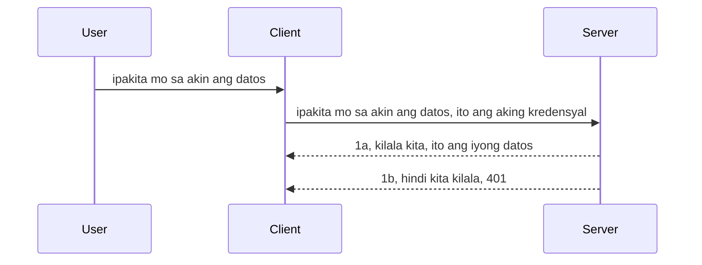

# Simpleng auth

Sinusuportahan ng MCP SDKs ang paggamit ng OAuth 2.1 na sa totoo lang ay isang medyo kumplikadong proseso na kinasasangkutan ng mga konsepto tulad ng auth server, resource server, pagpapasa ng mga kredensyal, pagkuha ng code, pagpapalit ng code para sa isang bearer token hanggang sa makuha mo na ang data ng iyong resource. Kung hindi ka pamilyar sa OAuth na isang magandang bagay na ipatupad, maganda na magsimula sa ilang basic na antas ng auth at unti-unting paunlarin ito patungo sa mas mahusay na seguridad. Ito ang dahilan kung bakit umiiral ang kabanatang ito, upang itaas ka patungo sa mas advanced na auth.

## Auth, ano ang ibig sabihin namin?

Ang Auth ay pinaikling salita para sa authentication at authorization. Ang ibig sabihin nito ay kailangan nating gawin ang dalawang bagay:

- **Authentication**, na proseso ng pagtukoy kung papayagan ba nating pumasok ang isang tao sa ating bahay, na may karapatan silang "narito" o magkaroon ng access sa ating resource server kung saan naka-host ang mga tampok ng MCP Server.
- **Authorization**, ay proseso ng pagtukoy kung dapat bang magkaroon ng access ang isang user sa mga tiyak na resources na hinihiling nila, halimbawa mga orders o mga produkto o kung pinapayagan silang basahin ang nilalaman ngunit hindi mag-delete bilang isa pang halimbawa.

## Mga Kredensyal: paano natin sinasabi sa sistema kung sino tayo

Karamihan sa mga web developer ay nagsisimulang mag-isip sa pagbibigay ng kredensyal sa server, kadalasan ay isang sikreto na nagsasabi kung pinapayagan silang narito "Authentication". Karaniwang ang kredensyal na ito ay naka-base64 encoded na bersyon ng username at password o isang API key na nagpapakilala ng isang tiyak na user.

Kasama dito ang pagpapadala nito sa pamamagitan ng isang header na tinatawag na "Authorization" ganito:

```json
{ "Authorization": "secret123" }
```

Ito ay karaniwang tinatawag na basic authentication. Ganito ang takbo ng kabuuang proseso:


```mermaid
sequenceDiagram
   participant User
   participant Client
   participant Server

   User->>Client: ipakita mo sa akin ang datos
   Client->>Server: ipakita mo sa akin ang datos, ito ang aking kredensyal
   Server-->>Client: 1a, kilala kita, ito ang iyong datos
   Server-->>Client: 1b, hindi kita kilala, 401 
```

Ngayong naiintindihan natin kung paano ito gumagana mula sa flow standpoint, paano natin ito ipinatutupad? Karamihan sa mga web server ay mayroong konsepto na tinatawag na middleware, isang piraso ng code na tumatakbo bilang bahagi ng request na maaaring mag-verify ng mga kredensyal, at kung ang mga kredensyal ay wasto ay pinapayagang makalusot ang request. Kung ang request ay walang wastong kredensyal, makakatanggap ka ng auth error. Tingnan natin kung paano ito ipinatutupad:

**Python**

```python
class AuthMiddleware(BaseHTTPMiddleware):
    async def dispatch(self, request, call_next):

        has_header = request.headers.get("Authorization")
        if not has_header:
            print("-> Missing Authorization header!")
            return Response(status_code=401, content="Unauthorized")

        if not valid_token(has_header):
            print("-> Invalid token!")
            return Response(status_code=403, content="Forbidden")

        print("Valid token, proceeding...")
       
        response = await call_next(request)
        # magdagdag ng anumang header ng customer o baguhin ang tugon sa ilang paraan
        return response


starlette_app.add_middleware(CustomHeaderMiddleware)
```

Narito ang ginawa natin:

- Lumikha ng middleware na tinawag na `AuthMiddleware` kung saan ang `dispatch` method nito ay tinatawag ng web server.
- Idinagdag ang middleware sa web server:

    ```python
    starlette_app.add_middleware(AuthMiddleware)
    ```

- Nagsulat ng validation logic na sinusuri kung ang Authorization header ay naroroon at kung ang padalang sikreto ay wasto:

    ```python
    has_header = request.headers.get("Authorization")
    if not has_header:
        print("-> Missing Authorization header!")
        return Response(status_code=401, content="Unauthorized")

    if not valid_token(has_header):
        print("-> Invalid token!")
        return Response(status_code=403, content="Forbidden")
    ```

    kung ang sikreto ay naroroon at wasto, pinapayagan natin ang request na makalusot sa pamamagitan ng pagtawag sa `call_next` at ibinabalik ang tugon.

    ```python
    response = await call_next(request)
    # magdagdag ng anumang customer headers o magbago sa tugon sa anumang paraan
    return response
    ```

Gumagana ito sa paraang kapag may ginawa na web request papunta sa server, tatawagin ang middleware at ayon sa implementasyon nito ay papayagan ang request na makalusot o magbibigay ng error na nagpapahiwatig na hindi pinapayagan ang client na magpatuloy.

**TypeScript**

Dito tayo gumagawa ng middleware gamit ang tanyag na framework na Express at sinasalubong ang request bago ito makarating sa MCP Server. Narito ang code para dito:

```typescript
function isValid(secret) {
    return secret === "secret123";
}

app.use((req, res, next) => {
    // 1. Nandoon ba ang authorization header?
    if(!req.headers["Authorization"]) {
        res.status(401).send('Unauthorized');
    }
    
    let token = req.headers["Authorization"];

    // 2. Suriin ang bisa.
    if(!isValid(token)) {
        res.status(403).send('Forbidden');
    }

   
    console.log('Middleware executed');
    // 3. Iipasa ang request sa susunod na hakbang sa pipeline ng request.
    next();
});
```

Sa code na ito:

1. Sini-sigurado kung ang Authorization header ay naroroon, kung wala, nagpapadala tayo ng 401 error.
2. Sinusuri kung ang credential/token ay valid, kung hindi, nagpapadala tayo ng 403 error.
3. Sa huli, ipinapasa ang request sa request pipeline at ibinabalik ang hinihinging resource.

## Ehersisyo: Ipatupad ang authentication

Gamitin natin ang ating kaalaman at subukang ipatupad ito. Narito ang plano:

Server

- Gumawa ng web server at MCP instance.
- Ipatupad ang middleware para sa server.

Client

- Magpadala ng web request na may kredensyal, gamit ang header.

### -1- Gumawa ng web server at MCP instance

> [!WARNING]
> Ang halimbawa ng TypeScript sa ibaba ay para sa MCP `2025-11-25`. Nagsusubaybay ito ng mga transport
> gamit ang `mcp-session-id` at hindi ito ang kasalukuyang `2026-07-28` na halimbawa ng transport. Ang MCP
> `2026-07-28` ay nag-aalis ng `initialize` handshake at protocol session ID; ang mga bagong
> implementasyon ay gumagamit ng self-contained na mga request. Tingnan
> [Ano ang Nagbago sa MCP: Ang 2026-07-28 Specification](../../01-CoreConcepts/mcp-2026-07-28.md).

Sa unang hakbang, kailangan nating gumawa ng instance ng web server at MCP Server.

**Python**

Dito tayo gumagawa ng MCP server instance, pinag-uugnay ang starlette web app at ini-host ito gamit ang uvicorn.

```python
# lumilikha ng MCP Server

app = FastMCP(
    name="MCP Resource Server",
    instructions="Resource Server that validates tokens via Authorization Server introspection",
    host=settings["host"],
    port=settings["port"],
    debug=True
)

# lumilikha ng starlette web app
starlette_app = app.streamable_http_app()

# nagseserbisyo ng app gamit ang uvicorn
async def run(starlette_app):
    import uvicorn
    config = uvicorn.Config(
            starlette_app,
            host=app.settings.host,
            port=app.settings.port,
            log_level=app.settings.log_level.lower(),
        )
    server = uvicorn.Server(config)
    await server.serve()

run(starlette_app)
```

Sa code na ito:

- Ginawa ang MCP Server.
- Bumuo ng starlette web app mula sa MCP Server, `app.streamable_http_app()`.
- Ini-host at pinaandar ang web app gamit ang uvicorn `server.serve()`.

**TypeScript**

Dito tayo gumagawa ng MCP Server instance.

```typescript
const server = new McpServer({
      name: "example-server",
      version: "1.0.0"
    });

    // ... i-set up ang mga server na resources, mga gamit, at mga prompt ...
```

Kailangang mangyari ang paglikha ng MCP Server sa loob ng post route definition na POST /mcp, kaya ilipat natin ang code sa itaas ng ganito:

```typescript
import express from "express";
import { randomUUID } from "node:crypto";
import { McpServer } from "@modelcontextprotocol/sdk/server/mcp.js";
import { StreamableHTTPServerTransport } from "@modelcontextprotocol/sdk/server/streamableHttp.js";
import { isInitializeRequest } from "@modelcontextprotocol/sdk/types.js"

const app = express();
app.use(express.json());

// Mapa upang itago ang mga transport ayon sa session ID
const transports: { [sessionId: string]: StreamableHTTPServerTransport } = {};

// Asikasuhin ang POST na mga kahilingan para sa komunikasyon ng kliyente-sa-server
app.post('/mcp', async (req, res) => {
  // Suriin kung may umiiral na session ID
  const sessionId = req.headers['mcp-session-id'] as string | undefined;
  let transport: StreamableHTTPServerTransport;

  if (sessionId && transports[sessionId]) {
    // Gamitin muli ang umiiral na transport
    transport = transports[sessionId];
  } else if (!sessionId && isInitializeRequest(req.body)) {
    // Bagong kahilingang inisyal
    transport = new StreamableHTTPServerTransport({
      sessionIdGenerator: () => randomUUID(),
      onsessioninitialized: (sessionId) => {
        // Itago ang transport ayon sa session ID
        transports[sessionId] = transport;
      },
      // Ang proteksyon laban sa DNS rebinding ay naka-disable bilang default para sa backward compatibility. Kung pinapatakbo mo ang server na ito
      // nang lokal, siguraduhing itakda:
      // enableDnsRebindingProtection: true,
      // allowedHosts: ['127.0.0.1'],
    });

    // Linisin ang transport kapag ito ay isinara
    transport.onclose = () => {
      if (transport.sessionId) {
        delete transports[transport.sessionId];
      }
    };
    const server = new McpServer({
      name: "example-server",
      version: "1.0.0"
    });

    // ... i-setup ang mga resources ng server, mga tools, at mga prompt ...

    // Kumonekta sa MCP server
    await server.connect(transport);
  } else {
    // Hindi wastong kahilingan
    res.status(400).json({
      jsonrpc: '2.0',
      error: {
        code: -32000,
        message: 'Bad Request: No valid session ID provided',
      },
      id: null,
    });
    return;
  }

  // Asikasuhin ang kahilingan
  await transport.handleRequest(req, res, req.body);
});

// Muling magagamit na tagapamahala para sa GET at DELETE na mga kahilingan
const handleSessionRequest = async (req: express.Request, res: express.Response) => {
  const sessionId = req.headers['mcp-session-id'] as string | undefined;
  if (!sessionId || !transports[sessionId]) {
    res.status(400).send('Invalid or missing session ID');
    return;
  }
  
  const transport = transports[sessionId];
  await transport.handleRequest(req, res);
};

// Asikasuhin ang GET na mga kahilingan para sa mga notipikasyon mula server papuntang kliyente gamit ang SSE
app.get('/mcp', handleSessionRequest);

// Asikasuhin ang DELETE na mga kahilingan para sa pagtatapos ng session
app.delete('/mcp', handleSessionRequest);

app.listen(3000);
```

Ngayon makikita mo kung paano inilipat ang MCP Server creation sa loob ng `app.post("/mcp")`.

Lumipat tayo sa susunod na hakbang ng paggawa ng middleware upang mapatunayan natin ang papasok na kredensyal.

### -2- Ipatupad ang middleware para sa server

Talakayin natin ang bahagi ng middleware. Gagawa tayo ng middleware na hahanapin ang kredensyal sa `Authorization` header at isa-validate ito. Kung ito ay tinatanggap, lalakad ang request upang gawin ang kailangan nito (e.g listahan ng mga tool, basahin ang resource o ano pa man ang MCP functionality na hinihingi ng client).

**Python**

Para gumawa ng middleware, kailangan nating gumawa ng klase na namamana mula sa `BaseHTTPMiddleware`. May dalawang mahalagang bahagi:

- Ang request `request` , kung saan binabasa natin ang header info.
- `call_next` na callback na tatawagin kung tinanggap natin ang kredensyal ng kliyente.

Una, kailangan nating i-handle ang kaso kung wala ang `Authorization` header:

```python
has_header = request.headers.get("Authorization")

# walang header na naroroon, mabigo gamit ang 401, kung hindi ay magpatuloy.
if not has_header:
    print("-> Missing Authorization header!")
    return Response(status_code=401, content="Unauthorized")
```

Dito nagpapadala tayo ng 401 unauthorized message dahil pumalya ang client sa authentication.

Susunod, kung mayroong isinubmit na kredensyal, susuriin natin kung ito ay wasto ganito:

```python
 if not valid_token(has_header):
    print("-> Invalid token!")
    return Response(status_code=403, content="Forbidden")
```

Pansinin kung paano tayo nagpapadala ng 403 forbidden message sa itaas. Tingnan natin ang buong middleware implementation sa ibaba:

```python
class AuthMiddleware(BaseHTTPMiddleware):
    async def dispatch(self, request, call_next):

        has_header = request.headers.get("Authorization")
        if not has_header:
            print("-> Missing Authorization header!")
            return Response(status_code=401, content="Unauthorized")

        if not valid_token(has_header):
            print("-> Invalid token!")
            return Response(status_code=403, content="Forbidden")

        print("Valid token, proceeding...")
        print(f"-> Received {request.method} {request.url}")
        response = await call_next(request)
        response.headers['Custom'] = 'Example'
        return response

```

Mahusay, pero paano naman ang `valid_token` function? Narito ito sa ibaba:

```python
# HUWAG gamitin para sa produksyon - pagandahin ito !!
def valid_token(token: str) -> bool:
    # alisin ang "Bearer " na prefix
    if token.startswith("Bearer "):
        token = token[7:]
        return token == "secret-token"
    return False
```

Dapat itong pinapabuti pa.

MAHALAGA: Hindi ka dapat maglagay ng mga lihim na ganito sa code. Ideal na kunin mo ang value na dapat ihambing mula sa data source o mula sa isang IDP (identity service provider) o mas mabuti, hayaan mo at ang IDP ang gumawa ng validation.

**TypeScript**

Para ipatupad ito gamit ang Express, kailangan nating tawagin ang `use` method na tumatanggap ng mga middleware functions.

Kailangan nating:

- Makipag-ugnayan sa request variable upang suriin ang ipinasa na kredensyal sa `Authorization` property.
- I-validate ang kredensyal, at kung tinanggap, hayaan ang request na magpatuloy at gawin ng client's MCP request ang nararapat (halimbawa listahan ng mga tool, basahin ang resource o ano man ang kaugnay sa MCP).

Dito, tinitingnan natin kung ang `Authorization` header ay naroroon at kung wala, pinipigilan nating lumusot ang request:

```typescript
if(!req.headers["authorization"]) {
    res.status(401).send('Unauthorized');
    return;
}
```

Kung wala ang header, makakakuha ka ng 401.

Susunod, susuriin natin kung ang kredensyal ay wasto, kung hindi, pinipigilan nating muling dumaan ang request ngunit may ibang mensahe:

```typescript
if(!isValid(token)) {
    res.status(403).send('Forbidden');
    return;
} 
```

Pansinin kung paano ka nakakatanggap ng 403 error ngayon.

Narito ang buong code:

```typescript
app.use((req, res, next) => {
    console.log('Request received:', req.method, req.url, req.headers);
    console.log('Headers:', req.headers["authorization"]);
    if(!req.headers["authorization"]) {
        res.status(401).send('Unauthorized');
        return;
    }
    
    let token = req.headers["authorization"];

    if(!isValid(token)) {
        res.status(403).send('Forbidden');
        return;
    }  

    console.log('Middleware executed');
    next();
});
```

Inayos natin ang web server upang tumanggap ng middleware na magsusuri ng kredensyal na inaasahan nating ipapadala ng client. Paano naman ang client?

### -3- Magpadala ng web request na may kredensyal sa header

Kailangan nating siguraduhin na ipinapasa ng client ang kredensyal sa header. Dahil gagamit tayo ng MCP client para dito, kailangan nating alamin kung paano ito gawin.

**Python**

Para sa client, kailangan nating magpasa ng header na may kredensyal ganito:

```python
# HUWAG i-hardcode ang halaga, ilagay ito bilang minimum sa isang environment variable o mas ligtas na imbakan
token = "secret-token"

async with streamablehttp_client(
        url = f"http://localhost:{port}/mcp",
        headers = {"Authorization": f"Bearer {token}"}
    ) as (
        read_stream,
        write_stream,
        session_callback,
    ):
        async with ClientSession(
            read_stream,
            write_stream
        ) as session:
            await session.initialize()
      
            # TODO, kung ano ang gusto mong gawin sa client, halimbawa listahin ang mga tools, tawagan ang mga tools, atbp.
```

Pansinin kung paano natin pinupuno ang `headers` property ng ` headers = {"Authorization": f"Bearer {token}"}`.

**TypeScript**

Maaari natin itong ayusin sa dalawang hakbang:

1. Punan ang configuration object ng ating kredensyal.
2. Ipasa ang configuration object sa transport.

```typescript

// HUWAG i-hardcode ang halaga tulad ng ipinakita dito. Sa pinakamababa, ilagay ito bilang isang env variable at gumamit ng tulad ng dotenv (sa dev mode).
let token = "secret123"

// magdeklara ng isang client transport option object
let options: StreamableHTTPClientTransportOptions = {
  sessionId: sessionId,
  requestInit: {
    headers: {
      "Authorization": "secret123"
    }
  }
};

// ipasa ang options object sa transport
async function main() {
   const transport = new StreamableHTTPClientTransport(
      new URL(serverUrl),
      options
   );
```

Makikita mo sa itaas kung paano natin nilikha ang `options` object at inilagay ang headers sa ilalim ng `requestInit` property.

MAHALAGA: Paano pa natin ito mapapabuti? Ang kasalukuyang implementasyon ay may ilang isyu. Una, ang pagpasa ng kredensyal ng ganito ay delikado maliban na lang kung mayroon kang HTTPS bilang minimum. Kahit ganoon, maaaring manakaw ang kredensyal kaya kailangan mo ng sistema kung saan madali mong ma-revoke ang token at magdagdag pa ng mga check tulad ng kung saan ito nanggaling sa mundo, kung madalas masyadong nagpapadala ng request (parang bot behavior), sa madaling salita, napakaraming mga alalahanin.

Ngunit dapat sabihin, para sa napakasimpleng mga API kung saan ayaw mo na may tumawag sa iyong API nang hindi authenticated, ang nasa atin ay isang magandang panimulang punto.

Sa gayon, subukan nating palakasin ang seguridad ng kaunti gamit ang isang standardized na format tulad ng JSON Web Token, kilala rin bilang JWT o "JOT" tokens.

## JSON Web Tokens, JWT

Kaya nais nating pagandahin ang pagpapadala ng mga simpleng kredensyal. Ano ang mga agarang benepisyo ng paggamit ng JWT?

- **Pagpapabuti ng Seguridad**. Sa basic auth, paulit-ulit mong ipinapadala ang username at password bilang base64 encoded token (o API key) na nagdaragdag ng panganib. Sa JWT, ipinapadala mo ang username at password at nakakakuha ka ng token bilang kapalit, at ito ay time-bound kaya magkakaroon ng expiration. Pinapayagan ng JWT ang fine-grained access control gamit ang mga roles, scopes, at permissions.
- **Statelessness at Scalability**. Ang mga JWT ay self-contained, dala ang lahat ng user info kaya hindi na kailangan ng server-side na session storage. Maaari ding ma-validate ang token nang lokal.
- **Interoperability at Federation**. Ang JWT ay sentro ng Open ID Connect at ginagamit kasama ng kilalang mga identity providers tulad ng Entra ID, Google Identity, at Auth0. Pinapayagan din nito ang single sign on at marami pang iba na enterprise-grade ang kalidad.
- **Modularity at Flexibility**. Ang JWT ay maaari ding gamitin sa API Gateways tulad ng Azure API Management, NGINX, at iba pa. Sinusuportahan nito ang authentication scenarios at communication mula server-to-service, kasama na ang impersonation at delegation scenarios.
- **Performance at Caching**. Maaaring i-cache ang JWT pagkatapos ma-decode na nagpapababa ng pangangailangan sa parsing. Nakakatulong ito lalo na sa apps na maraming traffic dahil nagpapabuti ng throughput at nagpapagaan ng load sa infrastructure.
- **Mga Advanced na Tampok**. Sinusuportahan din nito ang introspection (pagsuri ng validity sa server) at revocation (pagpawalang-bisa ng token).

Sa lahat ng mga benepisyong ito, tingnan natin kung paano pa natin mapapalago ang ating implementasyon.

## Mula sa basic auth patungong JWT

Kaya, ang mga pangunahing pagbabago na kailangang gawin ay:

- **Matutong bumuo ng JWT token** at ihanda ito upang maipadala mula client papunta server.
- **I-validate ang JWT token**, at kung ito ay wasto, hayaan ang client na ma-access ang mga resources.
- **Tweet secure na pag-iimbak ng token.** Paano natin itatago ang token na ito.
- **Protektahan ang mga ruta**. Kailangan nating protektahan ang mga ruta, sa ating kaso, protektahan ang mga ruta at tiyak na MCP features.
- **Magdagdag ng refresh tokens**. Siguraduhing gumawa ng mga token na short-lived pero may kasama ring refresh tokens na long-lived upang makakuha ng mga bagong token kapag nag-expire. Siguraduhing mayroon ding refresh endpoint at rotation strategy.

### -1- Bumuo ng JWT token

Una, ang JWT token ay may mga bahagi:

- **header**, algorithm na ginamit at uri ng token.
- **payload**, mga claim tulad ng sub (ang user o entity na kinakatawan ng token. Sa auth scenario, ito ay karaniwang userid), exp (kung kailan nag-eexpire) role (ang role)
- **signature**, nilagdaan gamit ang sikreto o private key.

Para dito, kailangan nating buuin ang header, payload at ang encoded na token.

**Python**

```python

import jwt
import jwt
from jwt.exceptions import ExpiredSignatureError, InvalidTokenError
import datetime

# Lihim na susi na ginamit upang lagdaan ang JWT
secret_key = 'your-secret-key'

header = {
    "alg": "HS256",
    "typ": "JWT"
}

# ang impormasyon ng user at ang mga claim nito pati na ang oras ng pag-expire
payload = {
    "sub": "1234567890",               # Paksa (ID ng user)
    "name": "User Userson",                # Pasadyang claim
    "admin": True,                     # Pasadyang claim
    "iat": datetime.datetime.utcnow(),# Inilabas sa
    "exp": datetime.datetime.utcnow() + datetime.timedelta(hours=1)  # Pag-expire
}

# i-encode ito
encoded_jwt = jwt.encode(payload, secret_key, algorithm="HS256", headers=header)
```

Sa code sa itaas:

- Nagdefine ng header gamit ang HS256 bilang algorithm at type na JWT.
- Bumuo ng payload na naglalaman ng subject o user id, isang username, isang role, kailan ito inilabas at kailan ito mag-eexpire kaya naipatupad ang time bound aspect na nabanggit natin.

**TypeScript**

Dito kailangan natin ang ilang dependencies upang matulungan tayong bumuo ng JWT token.

Dependencies

```sh

npm install jsonwebtoken
npm install --save-dev @types/jsonwebtoken
```

Ngayong nariyan na ito, gumawa tayo ng header, payload at sa pamamagitan nito ang encoded token.

```typescript
import jwt from 'jsonwebtoken';

const secretKey = 'your-secret-key'; // Gamitin ang mga env vars sa produksyon

// Tukuyin ang payload
const payload = {
  sub: '1234567890',
  name: 'User usersson',
  admin: true,
  iat: Math.floor(Date.now() / 1000), // Inilabas sa
  exp: Math.floor(Date.now() / 1000) + 60 * 60 // Mag-e-expire sa loob ng 1 oras
};

// Tukuyin ang header (opsyonal, awtomatikong sinese-set ng jsonwebtoken ang defaults)
const header = {
  alg: 'HS256',
  typ: 'JWT'
};

// Gumawa ng token
const token = jwt.sign(payload, secretKey, {
  algorithm: 'HS256',
  header: header
});

console.log('JWT:', token);
```

Ang token na ito ay:

Nilagdaan gamit ang HS256
Wasto para sa 1 oras
May kasamang mga claim tulad ng sub, name, admin, iat, at exp.

### -2- I-validate ang isang token

Kailangan din nating i-validate ang token, isang bagay na dapat gawin sa server para masigurong ang ipinapadala ng client ay talagang wasto. Maraming mga pagsusuri na gagawin dito mula sa pag-validate ng istruktura nito hanggang sa pagiging wasto. Hinihikayat ka rin na magdagdag ng iba pang mga pagsusuri upang makita kung ang user ay nasa iyong sistema at iba pa.

Para i-validate ang token, kailangan nating i-decode ito upang mabasa natin at simulan ang pagsusuri ng validity:

**Python**

```python

# I-decode at beripikahin ang JWT
try:
    decoded = jwt.decode(token, secret_key, algorithms=["HS256"])
    print("✅ Token is valid.")
    print("Decoded claims:")
    for key, value in decoded.items():
        print(f"  {key}: {value}")
except ExpiredSignatureError:
    print("❌ Token has expired.")
except InvalidTokenError as e:
    print(f"❌ Invalid token: {e}")

```


Sa code na ito, tinatawag natin ang `jwt.decode` gamit ang token, ang secret key at ang napiling algorithm bilang input. Pansinin kung paano tayo gumagamit ng try-catch na konstruksiyon dahil ang nabigong pag-validate ay nagdudulot ng error.

**TypeScript**

Dito kailangan nating tawagin ang `jwt.verify` upang makakuha ng decoded na bersyon ng token na maaari nating suriin pa. Kung mabigo ang tawag na ito, ibig sabihin maling istraktura ang token o hindi na ito balido.

```typescript

try {
  const decoded = jwt.verify(token, secretKey);
  console.log('Decoded Payload:', decoded);
} catch (err) {
  console.error('Token verification failed:', err);
}
```

PAALALA: tulad ng nabanggit dati, dapat tayong magsagawa ng karagdagang pagsusuri upang matiyak na ang token na ito ay tumutukoy sa isang user sa ating sistema at tiyakin na ang user ay may mga karapatang sinasabi nito.

Sunod, tingnan natin ang role based access control, kilala rin bilang RBAC.

## Pagdaragdag ng role based access control

Ang ideya ay nais nating ipahayag na ang iba't ibang mga role ay may iba't ibang permiso. Halimbawa, inaakala natin na ang admin ay maaaring gawin ang lahat, at ang normal na user ay maaaring magbasa/sulat at ang guest ay maaari lamang magbasa. Kaya, narito ang ilang posibleng antas ng permiso:

- Admin.Write 
- User.Read
- Guest.Read

Tingnan natin kung paano natin maipapatupad ang ganitong kontrol gamit ang middleware. Maaaring idagdag ang mga middleware sa bawat ruta pati na rin para sa lahat ng mga ruta.

**Python**

```python
from starlette.middleware.base import BaseHTTPMiddleware
from starlette.responses import JSONResponse
import jwt

# HUWAG ilagay ang sikreto sa code tulad nito, ito ay para lamang sa layunin ng demonstrasyon. Basahin ito mula sa isang ligtas na lugar.
SECRET_KEY = "your-secret-key" # ilagay ito sa env variable
REQUIRED_PERMISSION = "User.Read"

class JWTPermissionMiddleware(BaseHTTPMiddleware):
    async def dispatch(self, request, call_next):
        auth_header = request.headers.get("Authorization")
        if not auth_header or not auth_header.startswith("Bearer "):
            return JSONResponse({"error": "Missing or invalid Authorization header"}, status_code=401)

        token = auth_header.split(" ")[1]
        try:
            decoded = jwt.decode(token, SECRET_KEY, algorithms=["HS256"])
        except jwt.ExpiredSignatureError:
            return JSONResponse({"error": "Token expired"}, status_code=401)
        except jwt.InvalidTokenError:
            return JSONResponse({"error": "Invalid token"}, status_code=401)

        permissions = decoded.get("permissions", [])
        if REQUIRED_PERMISSION not in permissions:
            return JSONResponse({"error": "Permission denied"}, status_code=403)

        request.state.user = decoded
        return await call_next(request)


```

May ilang iba't ibang paraan upang magdagdag ng middleware tulad ng nasa ibaba:

```python

# Alt 1: magdagdag ng middleware habang binubuo ang starlette app
middleware = [
    Middleware(JWTPermissionMiddleware)
]

app = Starlette(routes=routes, middleware=middleware)

# Alt 2: magdagdag ng middleware pagkatapos mabuo ang starlette app
starlette_app.add_middleware(JWTPermissionMiddleware)

# Alt 3: magdagdag ng middleware kada ruta
routes = [
    Route(
        "/mcp",
        endpoint=..., # tagapangasiwa
        middleware=[Middleware(JWTPermissionMiddleware)]
    )
]
```

**TypeScript**

Maaari nating gamitin ang `app.use` at isang middleware na tatakbo sa lahat ng mga request.

```typescript
app.use((req, res, next) => {
    console.log('Request received:', req.method, req.url, req.headers);
    console.log('Headers:', req.headers["authorization"]);

    // 1. Suriin kung naipadala na ang authorization header

    if(!req.headers["authorization"]) {
        res.status(401).send('Unauthorized');
        return;
    }
    
    let token = req.headers["authorization"];

    // 2. Suriin kung ang token ay wasto
    if(!isValid(token)) {
        res.status(403).send('Forbidden');
        return;
    }  

    // 3. Suriin kung ang gumagamit ng token ay umiiral sa aming sistema
    if(!isExistingUser(token)) {
        res.status(403).send('Forbidden');
        console.log("User does not exist");
        return;
    }
    console.log("User exists");

    // 4. Patunayan na ang token ay may tamang mga pahintulot
    if(!hasScopes(token, ["User.Read"])){
        res.status(403).send('Forbidden - insufficient scopes');
    }

    console.log("User has required scopes");

    console.log('Middleware executed');
    next();
});

```

Maraming bagay na maaari nating ipagawa sa ating middleware at iyong mga dapat gawin ng middleware, tulad ng:

1. Suriin kung naroroon ang authorization header
2. Suriin kung balido ang token, tinatawag natin ang `isValid` na isang method na isinulat natin para suriin ang integridad at balidasyon ng JWT token.
3. Patunayan na umiiral ang user sa ating sistema, dapat natin itong suriin.

   ```typescript
    // mga gumagamit sa DB
   const users = [
     "user1",
     "User usersson",
   ]

   function isExistingUser(token) {
     let decodedToken = verifyToken(token);

     // TODO, suriin kung umiiral ang gumagamit sa DB
     return users.includes(decodedToken?.name || "");
   }
   ```

   Sa itaas, gumawa tayo ng isang napakasimpleng listahan ng `users`, na dapat ay nasa database naman talaga.

4. Bukod dito, dapat din nating suriin kung ang token ay may tamang mga permiso.

   ```typescript
   if(!hasScopes(token, ["User.Read"])){
        res.status(403).send('Forbidden - insufficient scopes');
   }
   ```

   Sa code na ito mula sa middleware, sinisigurado natin na ang token ay may User.Read na permiso, kung wala ay nagpapadala tayo ng 403 error. Nasa ibaba ang `hasScopes` na helper method.

   ```typescript
   function hasScopes(scope: string, requiredScopes: string[]) {
     let decodedToken = verifyToken(scope);
    return requiredScopes.every(scope => decodedToken?.scopes.includes(scope));
  }
   ```

Have a think which additional checks you should be doing, but these are the absolute minimum of checks you should be doing.

Using Express as a web framework is a common choice. There are helpers library when you use JWT so you can write less code.

- `express-jwt`, helper library that provides a middleware that helps decode your token.
- `express-jwt-permissions`, this provides a middleware `guard` that helps check if a certain permission is on the token.

Here's what these libraries can look like when used:

```typescript
const express = require('express');
const jwt = require('express-jwt');
const guard = require('express-jwt-permissions')();

const app = express();
const secretKey = 'your-secret-key'; // put this in env variable

// Decode JWT and attach to req.user
app.use(jwt({ secret: secretKey, algorithms: ['HS256'] }));

// Check for User.Read permission
app.use(guard.check('User.Read'));

// multiple permissions
// app.use(guard.check(['User.Read', 'Admin.Access']));

app.get('/protected', (req, res) => {
  res.json({ message: `Welcome ${req.user.name}` });
});

// Error handler
app.use((err, req, res, next) => {
  if (err.code === 'permission_denied') {
    return res.status(403).send('Forbidden');
  }
  next(err);
});

```

Ngayon ay nakita mo na kung paano ginagamit ang middleware para sa authentication at authorization, paano naman sa MCP, nagbabago ba nito ang paraan ng ating auth? Alamin natin sa susunod na seksyon.

### -3- Magdagdag ng RBAC sa MCP

Nakita mo na kung paano magdagdag ng RBAC gamit ang middleware, ngunit para sa MCP walang madaling paraan para magdagdag ng per MCP feature RBAC, kaya ano ang gagawin natin? Kailangan lang natin magdagdag ng ganoong code na tinitingnan sa kasong ito kung may karapatan ang client na tumawag sa isang tukoy na tool:

May ilang pagpipilian ka kung paano maisasagawa ang per feature RBAC, narito ang ilan:

- Magdagdag ng tseke para sa bawat tool, resource, prompt kung saan kailangan mong suriin ang antas ng permiso.

   **python**

   ```python
   @tool()
   def delete_product(id: int):
      try:
          check_permissions(role="Admin.Write", request)
      catch:
        pass # nabigong makuha ang pahintulot ng kliyente, itaas ang error sa pahintulot
   ```

   **typescript**

   ```typescript
   server.registerTool(
    "delete-product",
    {
      title: Delete a product",
      description: "Deletes a product",
      inputSchema: { id: z.number() }
    },
    async ({ id }) => {
      
      try {
        checkPermissions("Admin.Write", request);
        // todo, ipadala ang id sa productService at remote entry
      } catch(Exception e) {
        console.log("Authorization error, you're not allowed");  
      }

      return {
        content: [{ type: "text", text: `Deletected product with id ${id}` }]
      };
    }
   );
   ```


- Gumamit ng advanced na diskarte sa server at mga request handler para mabawasan kung ilan ang kailangang suriin.

   **Python**

   ```python
   
   tool_permission = {
      "create_product": ["User.Write", "Admin.Write"],
      "delete_product": ["Admin.Write"]
   }

   def has_permission(user_permissions, required_permissions) -> bool:
      # user_permissions: listahan ng mga pahintulot na hawak ng gumagamit
      # required_permissions: listahan ng mga pahintulot na kinakailangan para sa tool
      return any(perm in user_permissions for perm in required_permissions)

   @server.call_tool()
   async def handle_call_tool(
     name: str, arguments: dict[str, str] | None
   ) -> list[types.TextContent]:
    # Ipagpalagay na ang request.user.permissions ay isang listahan ng mga pahintulot para sa gumagamit
     user_permissions = request.user.permissions
     required_permissions = tool_permission.get(name, [])
     if not has_permission(user_permissions, required_permissions):
        # Itaas ang error na "Wala kang pahintulot na tawagan ang tool {name}"
        raise Exception(f"You don't have permission to call tool {name}")
     # magpatuloy at tawagan ang tool
     # ...
   ```   
   

   **TypeScript**

   ```typescript
   function hasPermission(userPermissions: string[], requiredPermissions: string[]): boolean {
       if (!Array.isArray(userPermissions) || !Array.isArray(requiredPermissions)) return false;
       // Ibalik ang true kung ang user ay may kahit isang kinakailangang pahintulot
       
       return requiredPermissions.some(perm => userPermissions.includes(perm));
   }
  
   server.setRequestHandler(CallToolRequestSchema, async (request) => {
      const { params: { name } } = request;
  
      let permissions = request.user.permissions;
  
      if (!hasPermission(permissions, toolPermissions[name])) {
         return new Error(`You don't have permission to call ${name}`);
      }
  
      // magpatuloy..
   });
   ```

   Tandaan, kailangang siguruhin mong inia-assign ng middleware ang decoded token sa user property ng request upang maging simple ang code na nasa itaas.

### Buod

Ngayon na tinalakay natin kung paano magdagdag ng suporta para sa RBAC sa pangkalahatan at para sa MCP sa partikular, panahon na upang subukang ipatupad ang seguridad sa sarili mo upang matiyak na naunawaan mo ang mga konseptong ipinakita sa iyo.

## Asaynment 1: Gumawa ng mcp server at mcp client gamit ang basic authentication

Dito mo gagamitin ang iyong natutunan tungkol sa pagpapadala ng kredensyal sa pamamagitan ng headers.

## Solusyon 1

[Solution 1](./code/basic/README.md)

## Asaynment 2: I-upgrade ang solusyon mula sa Asaynment 1 gamit ang JWT

Kunin ang unang solusyon ngunit sa pagkakataong ito, pagbutihin pa natin.

Sa halip na gamitin ang Basic Auth, gamitin natin ang JWT.

## Solusyon 2

[Solution 2](./solution/jwt-solution/README.md)

## Hamon

Idagdag ang RBAC per tool na inilarawan natin sa seksyong "Add RBAC to MCP".

## Buod

Sana marami kang natutunan sa kabanatang ito, mula sa kawalan ng seguridad, hanggang sa basic na seguridad, hanggang sa JWT at kung paano ito maidagdag sa MCP.

Nakabuo tayo ng matibay na pundasyon gamit ang custom JWT, ngunit habang tayo ay lumalaki, lumilipat tayo sa isang standards-based identity model. Ang pag-adopt ng isang IdP tulad ng Entra o Keycloak ay nagpapahintulot sa atin na i-offload ang token issuance, validation, at lifecycle management sa isang pinagkakatiwalaang platform — nagbibigay daan upang magpokus tayo sa app logic at karanasan ng user.

Para dito, mayroon tayong mas [advanced na kabanata tungkol sa Entra](../../05-AdvancedTopics/mcp-security-entra/README.md)

## Ano Ang Susunod

- Susunod: [Setting Up MCP Hosts](../12-mcp-hosts/README.md)

---

<!-- CO-OP TRANSLATOR DISCLAIMER START -->
**Pagtatanggi**:
Ang dokumentong ito ay isinalin gamit ang serbisyo ng AI translation na [Co-op Translator](https://github.com/Azure/co-op-translator). Bagama't nagsusumikap kami para sa katumpakan, pakatandaan na ang awtomatikong pagsasalin ay maaaring maglaman ng mga pagkakamali o hindi pagkakatugma. Ang orihinal na dokumento sa orihinal nitong wika ang dapat ituring na pangunahing sanggunian. Para sa mahahalagang impormasyon, inirerekomenda ang propesyonal na pagsasalin ng tao. Hindi kami mananagot sa anumang maling pagkakaintindi o maling interpretasyon na nagmula sa paggamit ng pagsasaling ito.
<!-- CO-OP TRANSLATOR DISCLAIMER END -->