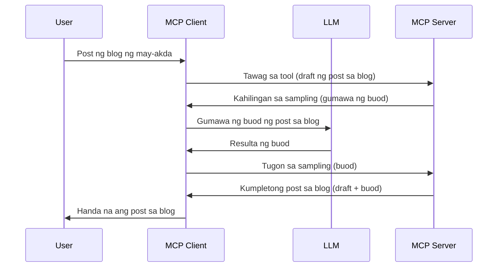

> [!WARNING]
> Ang Sampling ay deprecated sa MCP `2026-07-28`. Ang lesson na ito ay pinananatili para sa
> mga legacy na implementasyon. Ang mga bagong server ay dapat direktang mag-integrate sa isang LLM
> provider API.

# Sampling - i-delegate ang mga features sa Client

> Ang Sampling ay nananatili sa `2026-07-28` na spesipikasyon para sa compatibility at maaaring
> alisin sa unang rebisyon na ilalabas sa o pagkatapos ng Hulyo 28,
> 2027. Ang mga halimbawa sa leksyon na ito ay maaaring gumamit ng SDK APIs na nag-implement ng `2025-11-25`.
> Tingnan ang [What's Changed in MCP: The 2026-07-28 Specification](../../01-CoreConcepts/mcp-2026-07-28.md).

Sa mga legacy na implementasyon, pinapayagan ng Sampling ang isang MCP server na humingi ng tulong mula sa isang LLM
na pinamamahalaan ng client. Para sa mga bagong implementasyon, tawagan nang direkta ang napiling LLM provider
sa halip.

Tuklasin natin ang ilang mga use case at kung paano bumuo ng solusyon na may kasamang sampling.

## Pangkalahatang-ideya

Sa leksyon na ito, tututok tayo sa pagpapaliwanag kung kailan at saan gagamitin ang Sampling at kung paano ito i-configure.

## Mga Layunin sa Pagkatuto

Sa kabanatang ito, gagawin natin ang mga sumusunod:

- Ipaliwanag kung ano ang Sampling at kailan ito gagamitin.
- Ipakita kung paano i-configure ang Sampling sa MCP.
- Magbigay ng mga halimbawa ng Sampling sa aksyon.

## Ano ang Sampling at bakit ito gamitin?

Ang Sampling ay isang advanced na tampok na gumagana sa sumusunod na paraan:



### Request ng Sampling

Ok, ngayon na mayroon tayong malawak na pananaw ng isang kapani-paniwalang senaryo, pag-usapan natin ang sampling request na ipinapadala ng server pabalik sa client. Ganito ang hitsura ng request na ito sa format na JSON-RPC:

```json
{
  "jsonrpc": "2.0",
  "id": 1,
  "method": "sampling/createMessage",
  "params": {
    "messages": [
      {
        "role": "user",
        "content": {
          "type": "text",
          "text": "Create a blog post summary of the following blog post: <BLOG POST>"
        }
      }
    ],
    "modelPreferences": {
      "hints": [
        {
          "name": "claude-3-sonnet"
        }
      ],
      "intelligencePriority": 0.8,
      "speedPriority": 0.5
    },
    "systemPrompt": "You are a helpful assistant.",
    "maxTokens": 100
  }
}
```

May ilang bagay dito na karapat-dapat banggitin:

- Ang Prompt, sa ilalim ng content -> text, ay ang ating prompt na isang instruksyon para sa LLM upang ibuod ang nilalaman ng blog post.

- **modelPreferences**. Ang seksyong ito ay isang preference, isang rekomendasyon ng kung anong konfigurasyon ang gagamitin sa LLM. Maaaring piliin ng user kung susundin ang mga rekomendasyong ito o babaguhin ang mga ito. Sa kasong ito, may mga rekomendasyon sa modelong gagamitin pati na rin sa prayoridad ng bilis at katalinuhan.
- **systemPrompt**, ito ang iyong normal na system prompt na nagbibigay ng personalidad sa iyong LLM at naglalaman ng mga tagubilin.
- **maxTokens**, ito ay isa pang property na nagsasaad kung gaano karaming tokens ang nirekomenda para sa gampanin na ito.

### Tugon ng Sampling

Ang tugon na ito ang ipinapadala ng MCP Client pabalik sa MCP Server at resulta ng pagtawag ng client sa LLM, paghihintay sa sagot, at pagkatapos ay pagbuo ng mensaheng ito. Ganito ang maaaring hitsura nito sa JSON-RPC:

```json
{
  "jsonrpc": "2.0",
  "id": 1,
  "result": {
    "role": "assistant",
    "content": {
      "type": "text",
      "text": "Here's your abstract <ABSTRACT>"
    },
    "model": "gpt-5",
    "stopReason": "endTurn"
  }
}
```

Pansinin kung paano ang tugon ay isang abstrak mula sa blog post tulad ng hiniling natin. Pansinin din na ang ginamit na `model` ay hindi ang hiniling natin kundi "gpt-5" sa halip na "claude-3-sonnet". Ito ay nagpapakita na maaaring magbago ang isip ng user sa kung ano ang gagamitin at ang iyong sampling request ay isang rekomendasyon.

Ok, ngayong nauunawaan na natin ang pangunahing daloy, at kapaki-pakinabang itong gamitin sa "paglikha ng blog post + abstrak", tingnan natin kung ano ang kailangan nating gawin para mapagana ito.

### Mga uri ng mensahe

Ang mga sampling message ay hindi limitado sa teksto lang kundi maaari ring magpadala ng mga larawan at audio. Ganito ang pagkakaiba ng hitsura ng JSON-RPC:

**Teksto**

```json
{
  "type": "text",
  "text": "The message content"
}
```

**Nilalaman ng larawan**

```json
{
  "type": "image",
  "data": "base64-encoded-image-data",
  "mimeType": "image/jpeg"
}
```

**Nilalaman ng audio**

```json
{
  "type": "audio",
  "data": "base64-encoded-audio-data",
  "mimeType": "audio/wav"
}
```

> NOTE: Para sa kasalukuyang status at patnubay sa migrasyon, tingnan ang
> [deprecated Sampling documentation](https://modelcontextprotocol.io/specification/2026-07-28/client/sampling).

## Paano I-configure ang Sampling sa Client

> Tandaan: kung server lang ang binubuo mo, hindi mo kailangang gawin ang marami dito.

Sa isang client, kailangan mong tukuyin ang sumusunod na feature ganito:

```json
{
  "capabilities": {
    "sampling": {}
  }
}
```

Ito ay mapipili kapag ang piniling client ay nag-initialize sa server.

## Halimbawa ng Sampling sa Aksyon - Gumawa ng Blog Post

Gawin natin ang isang sampling server nang magkakasama, kakailanganin nating gawin ang mga sumusunod:

1. Gumawa ng tool sa Server.
1. Ang tool na iyon ay dapat gumawa ng isang sampling request
1. Dapat maghintay ang tool sa sagot ng client sa sampling request.
1. Pagkatapos ay dapat na maiproduce ang resulta ng tool.

Tingnan natin ang code nang hakbang-hakbang:

### -1- Gumawa ng tool

**python**

```python
@mcp.tool()
async def create_blog(title: str, content: str, ctx: Context[ServerSession, None]) -> str:
    """Create a blog post and generate a summary"""

```

### -2- Gumawa ng sampling request

Palawakin ang iyong tool gamit ang sumusunod na code:

**python**

```python
post = BlogPost(
        id=len(posts) + 1,
        title=title,
        content=content,
        abstract=""
    )

prompt = f"Create an abstract of the following blog post: title: {title} and draft: {content} "

result = await ctx.session.create_message(
        messages=[
            SamplingMessage(
                role="user",
                content=TextContent(type="text", text=prompt),
            )
        ],
        max_tokens=100,
)

```

### -3- Maghintay sa tugon at ibalik ang tugon

**python**

```python
post.abstract = result.content.text

posts.append(post)

# ibalik ang buong produkto
return json.dumps({
    "id": post.title,
    "abstract": post.abstract
})
```

### -4- Buong code

**python**

```python
from starlette.applications import Starlette
from starlette.routing import Mount, Host

from mcp.server.fastmcp import Context, FastMCP

from mcp.server.session import ServerSession
from mcp.types import SamplingMessage, TextContent

import json


from uuid import uuid4
from typing import List
from pydantic import BaseModel


mcp = FastMCP("Blog post generator")

# app = FastAPI()

posts = []

class BlogPost(BaseModel):
    id: int
    title: str
    content: str
    abstract: str

posts: List[BlogPost] = []

@mcp.tool()
async def create_blog(title: str, content: str, ctx: Context[ServerSession, None]) -> str:
    """Create a blog post and generate a summary"""

    post = BlogPost(
        id=len(posts) + 1,
        title=title,
        content=content,
        abstract=""
    )

    prompt = f"Create an abstract of the following blog post: title: {title} and draft: {content} "

    result = await ctx.session.create_message(
        messages=[
            SamplingMessage(
                role="user",
                content=TextContent(type="text", text=prompt),
            )
        ],
        max_tokens=100,
    )

    post.abstract = result.content.text

    posts.append(post)

    # ibalik ang kumpletong blog post
    return json.dumps({
        "id": post.title,
        "abstract": post.abstract
    })

if __name__ == "__main__":
    print("Starting server...")
    # mcp.run()
    mcp.run(transport="streamable-http")

# patakbuhin ang app gamit ang: python server.py
```

### -5- Testing sa Visual Studio Code

Para matesting ito sa Visual Studio Code, gawin ang mga sumusunod:

1. Simulan ang server sa terminal
1. Idagdag ito sa *mcp.json* (at siguraduhing ito ay naka-start) hal. ganito:

   ```json
   "servers": {
      "blog-server": {
        "type": "http",
        "url": "http://localhost:8000/mcp"
      }
   }
   ```

1. Mag-type ng prompt:

   ```text
   create a blog post named "Where Python comes from", the content is "Python is actually named after Monty Python Flying Circus"
   ```

1. Hayaan ang sampling na mangyari. Sa unang pagsubok mo nito, ipapakita sa iyo ang isang karagdagang dialog na kailangan mong tanggapin, pagkatapos ay makikita mo ang normal na dialog na nagtatanong kung gusto mong magpatakbo ng isang tool

1. Suriin ang mga resulta. Makikita mo ang mga resulta na maganda ang pagkaka-render sa GitHub Copilot Chat ngunit maaari mo ring suriin ang raw JSON na tugon.

**Bonus**. Ang tooling ng Visual Studio Code ay may mahusay na suporta para sa sampling. Maaari mong i-configure ang Sampling access sa iyong naka-install na server sa pamamagitan ng pag-navigate dito nang ganito:

1. Pumunta sa seksyon ng extension.
1. Piliin ang icon ng cog para sa iyong naka-install na server sa seksyong "MCP SERVERS - INSTALLED".
1 Piliin ang "Configure Model Access", dito maaari mong piliin kung aling mga Modelo ang pinapayagan ng GitHub Copilot na gamitin kapag nagsasagawa ng sampling. Maaari mo ring makita ang lahat ng sampling requests na nangyari kamakailan sa pagpili ng "Show Sampling requests".

## Takdang-Aralin

Sa takdang-aralin na ito, gagawa ka ng bahagyang ibang Sampling, isang sampling integration na sumusuporta sa pagbuo ng isang paglalarawan ng produkto. Narito ang iyong senaryo:

**Senaryo**: Ang back office worker sa isang e-commerce ay nangangailangan ng tulong, masyadong matagal ang paggawa ng mga paglalarawan ng produkto. Kaya, kailangan mong gumawa ng solusyon kung saan tatawagin mo ang isang tool na "create_product" na may mga argumento na "title" at "keywords" at ito ay dapat makabuo ng kompletong produkto kabilang ang isang "description" field na pinupuno ng LLM ng client.

TIP: gamitin ang mga natutunan mo kanina upang bumuo ng server at ang tool nito gamit ang isang sampling request.

## Solusyon

[Solusyon](./solution/README.md)

## Mga Pangunahing Aral

Ang Sampling ay isang makapangyarihang feature na nagpapahintulot sa server na i-delegate ang mga gawain sa client kapag kailangan nito ng tulong mula sa LLM.

## Ano ang Susunod

- [Kabanata 4 - Praktikal na implementasyon](../../04-PracticalImplementation/README.md)

---

<!-- CO-OP TRANSLATOR DISCLAIMER START -->
**Pagtatanggi**:
Ang dokumentong ito ay isinalin gamit ang serbisyo ng AI translation na [Co-op Translator](https://github.com/Azure/co-op-translator). Bagama't nagsusumikap kami para sa katumpakan, pakatandaan na ang awtomatikong pagsasalin ay maaaring maglaman ng mga pagkakamali o hindi pagkakatugma. Ang orihinal na dokumento sa orihinal nitong wika ang dapat ituring na pangunahing sanggunian. Para sa mahahalagang impormasyon, inirerekomenda ang propesyonal na pagsasalin ng tao. Hindi kami mananagot sa anumang maling pagkakaintindi o maling interpretasyon na nagmula sa paggamit ng pagsasaling ito.
<!-- CO-OP TRANSLATOR DISCLAIMER END -->