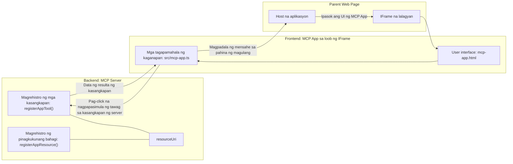
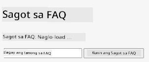
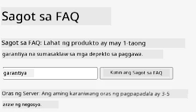
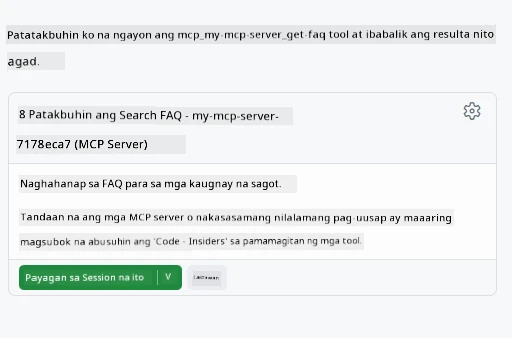
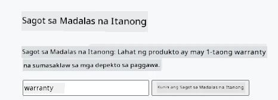

# MCP Apps

Ang MCP Apps ay isang bagong paradigma sa MCP. Ang ideya ay hindi lang ikaw ay nagreresponde ng data mula sa tawag ng tool, nagbibigay ka rin ng impormasyon kung paano dapat interaksyonan ang impormasyong ito. Ibig sabihin, ang resulta ng tool ay maaari nang maglaman ng impormasyon ng UI. Pero bakit natin ito gusto? Isipin mo kung paano ka gumagawa ngayon. Malamang na kinokonsumo mo ang resulta ng MCP Server sa pamamagitan ng paglalagay ng uri ng frontend sa harap nito, iyon ay code na kailangan mong isulat at panatilihin. Minsan iyon ang gusto mo, pero minsan ay maganda kung makakapasok ka lang ng isang snippet ng impormasyong self-contained na may lahat mula sa data hanggang sa user interface.

## Overview

Nagbibigay ang araling ito ng praktikal na gabay tungkol sa MCP Apps, kung paano magsimula dito at paano i-integrate ito sa iyong kasalukuyang Web Apps. Ang MCP Apps ay isang napakabagong karagdagan sa MCP Standard.

## Learning Objectives

Sa pagtatapos ng araling ito, magagawa mo:

- Ipaliwanag kung ano ang MCP Apps.
- Kailan gagamitin ang MCP Apps.
- Gumawa at mag-integrate ng sarili mong MCP Apps.

## MCP Apps - paano ito gumagana

Ang ideya sa MCP Apps ay magbigay ng tugon na karaniwang isang component na irerender. Ang ganitong component ay maaaring magkaroon ng visuals at interactivity, gaya ng pag-click ng button, input ng user, at iba pa. Magsimula tayo sa server side at sa ating MCP Server. Para gumawa ng MCP App component, kailangan mong gumawa ng tool at pati na rin ang application resource. Ang dalawang bahaging ito ay nakakonektang sa pamamagitan ng resourceUri.

Narito ang isang halimbawa. Subukan nating i-visualize kung ano ang mga sangkot at ano ang ginagawa ng bawat bahagi:

```text
server.ts -- responsible for registering tools and the component as a UI component
src/
  mcp-app.ts -- wiring up event handlers
mcp-app.html -- the user interface
```
  
Ang visual na ito ay naglalarawan ng arkitektura para gumawa ng component at ang lohika nito.


Subukan nating ilarawan naman ang mga responsibilidad para sa backend at frontend nang magkahiwalay.

### Ang backend

May dalawang bagay na kailangan nating makamit dito:

- Irehistro ang mga tools na gusto nating gamitin.
- Idefine ang component.

**Pagrehistro sa tool**

```typescript
registerAppTool(
    server,
    "get-time",
    {
      title: "Get Time",
      description: "Returns the current server time.",
      inputSchema: {},
      _meta: { ui: { resourceUri } }, // Iniuugnay ang tool na ito sa pinagkukunan ng UI nito
    },
    async () => {
      const time = new Date().toISOString();
      return { content: [{ type: "text", text: time }] };
    },
  );

```
  
Ini-explain ng code sa itaas ang behavior, kung saan nag-eexpose ito ng tool na tinatawag na `get-time`. Walang input na tinatanggap ngunit nagpo-produce ng kasalukuyang oras. May kakayahan tayong mag-define ng `inputSchema` para sa mga tools kung saan kailangan nating tanggapin ang input ng user.

**Pagrehistro ng component**

Sa parehong file, kailangan din nating irehistro ang component:

```typescript
const resourceUri = "ui://get-time/mcp-app.html";

// Irehistro ang resource, na nagbabalik ng pinagsamang HTML/JavaScript para sa UI.
registerAppResource(
  server,
  resourceUri,
  resourceUri,
  { mimeType: RESOURCE_MIME_TYPE },
  async () => {
    const html = await fs.readFile(path.join(DIST_DIR, "mcp-app.html"), "utf-8");

    return {
    contents: [
        { uri: resourceUri, mimeType: RESOURCE_MIME_TYPE, text: html },
    ],
    };
  },
);
```
  
Pansinin kung paano namin binanggit ang `resourceUri` upang ikonekta ang component sa mga tool nito. Kapansin-pansin din ang callback kung saan niloload namin ang UI file at ibinabalik ang component.

### Ang component frontend

Katulad ng backend, may dalawang bahagi dito:

- Isang frontend na nakasulat sa purong HTML.
- Code na humahandle ng mga event at kung ano ang gagawin, gaya ng pagtawag sa mga tools o pagpapadala ng mensahe sa parent window.

**User interface**

Tingnan natin ang user interface.

```html
<!-- mcp-app.html -->
<!DOCTYPE html>
<html lang="en">
  <head>
    <meta charset="UTF-8" />
    <title>Get Time App</title>
  </head>
  <body>
    <p>
      <strong>Server Time:</strong> <code id="server-time">Loading...</code>
    </p>
    <button id="get-time-btn">Get Server Time</button>
    <script type="module" src="/src/mcp-app.ts"></script>
  </body>
</html>
```
  
**Event wireup**

Ang huling bahagi ay ang event wireup. Ibig sabihin, tinutukoy natin kung aling bahagi sa UI ang nangangailangan ng event handlers at kung ano ang gagawin kapag na-trigger ang mga event:

```typescript
// mcp-app.ts

import { App } from "@modelcontextprotocol/ext-apps";

// Kunin ang mga reperensya ng elemento
const serverTimeEl = document.getElementById("server-time")!;
const getTimeBtn = document.getElementById("get-time-btn")!;

// Gumawa ng instance ng app
const app = new App({ name: "Get Time App", version: "1.0.0" });

// Pangasiwaan ang mga resulta ng tool mula sa server. Itakda bago ang `app.connect()` upang maiwasan
// ang pagkawala ng unang resulta ng tool.
app.ontoolresult = (result) => {
  const time = result.content?.find((c) => c.type === "text")?.text;
  serverTimeEl.textContent = time ?? "[ERROR]";
};

// Ikabit ang click ng button
getTimeBtn.addEventListener("click", async () => {
  // Pinahihintulutan ng `app.callServerTool()` ang UI na humiling ng bagong datos mula sa server
  const result = await app.callServerTool({ name: "get-time", arguments: {} });
  const time = result.content?.find((c) => c.type === "text")?.text;
  serverTimeEl.textContent = time ?? "[ERROR]";
});

// Kumonekta sa host
app.connect();
```
  
Tulad ng makikita mo sa itaas, ito ay karaniwang code para i-hook ang mga DOM elements sa mga event. Karapat-dapat ring banggitin ang tawag sa `callServerTool` na nagriresulta sa pagtawag ng tool sa backend.

## Pag-handle ng user input

Hanggang ngayon, nakita natin ang isang component na may button na kapag na-click ay tumatawag ng tool. Tingnan natin kung maaari tayong magdagdag pa ng UI elements tulad ng input field at subukan kung maaari tayong magpadala ng argumento sa isang tool. Gagawa tayo ng FAQ functionality. Ganito dapat ang takbo nito:

- Dapat may button at input element kung saan magta-type ang user ng keyword na hahanapin, halimbawa "Shipping". Ito ay tatawag ng tool sa backend na gagawa ng paghahanap sa FAQ data.
- Isang tool na sumusuporta sa nabanggit na FAQ search.

Idagdag muna natin ang kinakailangang suporta sa backend:

```typescript
const faq: { [key: string]: string } = {
    "shipping": "Our standard shipping time is 3-5 business days.",
    "return policy": "You can return any item within 30 days of purchase.",
    "warranty": "All products come with a 1-year warranty covering manufacturing defects.",
  }

registerAppTool(
    server,
    "get-faq",
    {
      title: "Search FAQ",
      description: "Searches the FAQ for relevant answers.",
      inputSchema: zod.object({
        query: zod.string().default("shipping"),
      }),
      _meta: { ui: { resourceUri: faqResourceUri } }, // Iniuugnay ang tool na ito sa kanyang UI resource
    },
    async ({ query }) => {
      const answer: string = faq[query.toLowerCase()] || "Sorry, I don't have an answer for that.";
      return { content: [{ type: "text", text: answer }] };
    },
  );
```
  
Makikita dito kung paano natin pinupuno ang `inputSchema` at binibigyan ito ng `zod` schema tulad nito:

```typescript
inputSchema: zod.object({
  query: zod.string().default("shipping"),
})
```
  
Sa schema sa itaas, dineklara natin na may input parameter na tinatawag na `query` at ito ay optional na may default na value na "shipping".

Sige, puntahan natin ang *mcp-app.html* para makita kung anong UI ang kailangan nating gawin para dito:

```html
<div class="faq">
    <h1>FAQ response</h1>
    <p>FAQ Response: <code id="faq-response">Loading...</code></p>
    <input type="text" id="faq-query" placeholder="Enter FAQ query" />
    <button id="get-faq-btn">Get FAQ Response</button>
  </div>
```
  
Maganda, may input element at button tayo. Pumunta tayo sa *mcp-app.ts* naman para i-wire up ang mga event na ito:

```typescript
const getFaqBtn = document.getElementById("get-faq-btn")!;
const faqQueryInput = document.getElementById("faq-query") as HTMLInputElement;

getFaqBtn.addEventListener("click", async () => {
  const query = faqQueryInput.value;
  const result = await app.callServerTool({ name: "get-faq", arguments: { query } });
  const faq = result.content?.find((c) => c.type === "text")?.text;
  faqResponseEl.textContent = faq ?? "[ERROR]";
});
```
  
Sa code sa itaas ay:

- Gumawa ng references sa mga mahalagang UI elements.
- Hinawakan ang pag-click ng button upang kunin ang value mula sa input element at tinawag din namin ang `app.callServerTool()` na may `name` at `arguments` kung saan ang huli ay nagpapasa ng `query` bilang value.

Ang nangyayari kapag tinawag mo ang `callServerTool` ay nagpapadala ito ng mensahe sa parent window at ang window na iyon ang tumatawag sa MCP Server.

### Subukan ito

Kapag sinubukan ito, dapat nating makita ang mga sumusunod:



At ganito naman kapag sinubukan gamit ang input tulad ng "warranty"



Para patakbuhin ang code na ito, pumunta sa [Code section](./code/README.md)

## Pagsubok sa Visual Studio Code

May magandang suporta ang Visual Studio Code para sa MVP Apps at marahil isa ito sa pinakamadaling paraan para subukan ang iyong MCP Apps. Para gamitin ang Visual Studio Code, magdagdag ng entry sa *mcp.json* tulad nito:

```json
"my-mcp-server-7178eca7": {
    "url": "http://localhost:3001/mcp",
    "type": "http"
  }
```
  
Pagkatapos simulan ang server, dapat mong makausap ang iyong MVP App sa pamamagitan ng Chat Window kung naka-install ang GitHub Copilot.

Sa pamamagitan ng pag-trigger gamit ang prompt, halimbawa "#get-faq":



At tulad ng kapag pinaandar mo ito sa browser, pareho ang rendering nito:



## Assignment

Gumawa ng laro ng bato papel gunting. Dapat ito ay may mga sumusunod:

UI:

- isang drop down list na may mga pagpipilian
- isang button para isumite ang pagpili
- isang label na nagpapakita kung sino ang pumili ng ano at sino ang nanalo

Server:

- dapat may tool na rock paper scissor na tumatanggap ng "choice" bilang input. Dapat itong mag-render ng computer choice at tukuyin ang nanalo.

## Solution

[Solution](./assignment/README.md)

## Summary

Natuto tayo tungkol sa bagong paradigm na ito na MCP Apps. Isa itong bagong paradigma na nagpapahintulot sa MCP Servers na magkaroon ng opinyon hindi lang sa data kundi pati na rin kung paano ito dapat ipakita.

Dagdag pa rito, natutunan natin na ang mga MCP Apps ay hosted sa isang IFrame at para makipag-ugnayan sa MCP Servers, kailangan nilang magpadala ng mga mensahe sa parent web app. Mayroong ilang libraries para sa plain JavaScript at React at iba pa na nagpapadali sa komunikasyong ito.

## Key Takeaways

Narito ang iyong natutunan:

- Ang MCP Apps ay isang bagong standard na kapaki-pakinabang kapag gusto mong magpadala ng parehong data at UI features.
- Ang ganitong klase ng apps ay tumatakbo sa loob ng isang IFrame para sa mga dahilan ng seguridad.

## Ano ang Susunod

- [Chapter 4](../../04-PracticalImplementation/README.md)

---

<!-- CO-OP TRANSLATOR DISCLAIMER START -->
**Pagsisiyasat**:
Ang dokumentong ito ay isinalin gamit ang AI na serbisyo sa pagsasalin [Co-op Translator](https://github.com/Azure/co-op-translator). Bagama't nagsisikap kaming maging tumpak, mangyaring tandaan na ang awtomatikong pagsasalin ay maaaring maglaman ng mga error o hindi pagkakatugma. Ang orihinal na dokumento sa sariling wika nito ang dapat ituring na opisyal na sanggunian. Para sa mahahalagang impormasyon, inirerekomenda ang propesyonal na pagsasaling-tao. Hindi kami mananagot sa anumang hindi pagkakaunawaan o maling interpretasyon na maaaring lumitaw mula sa paggamit ng pagsasaling ito.
<!-- CO-OP TRANSLATOR DISCLAIMER END -->