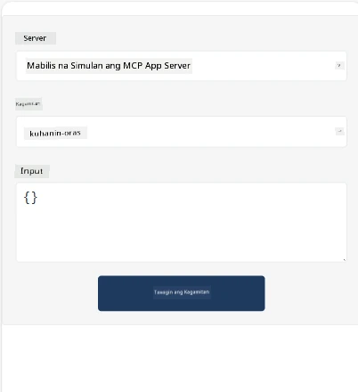
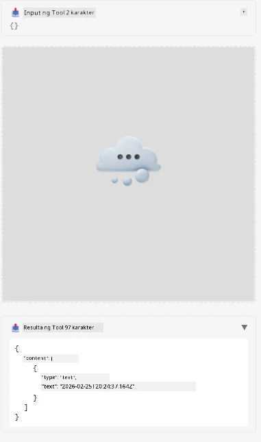

Narito ang isang halimbawa na nagpapakita ng MCP App

## Install 

1. Punta sa *mcp-app* folder
1. Patakbuhin ang `npm install`, ito ay mag-iinstall ng frontend at backend dependencies

Suriin kung nagko-compile ang backend sa pamamagitan ng pagpapatakbo:

```sh
npx tsc --noEmit
```

Walang output kung maayos ang lahat.

## Patakbuhin ang backend

> Kailangan ng dagdag na hakbang kung ikaw ay nasa Windows machine dahil gumagamit ang MCP Apps solution ng `concurrently` library na kailangan mong humanap ng kapalit. Narito ang linya na may problema sa *package.json* ng MCP App:

    ```json
    "start": "concurrently \"cross-env NODE_ENV=development INPUT=mcp-app.html vite build --watch\" \"tsx watch main.ts\""
    ```

Ang app na ito ay may dalawang bahagi, isang backend at isang host.

Simulan ang backend sa pamamagitan ng pagtawag ng:

```sh
npm start
```

Dapat nitong simulan ang backend sa `http://localhost:3001/mcp`.

> Tandaan, kung ikaw ay nasa Codespace, maaaring kailangan mong itakda ang port visibility sa public. Suriin na maaabot mo ang endpoint sa browser sa pamamagitan ng https://<name of Codespace>.app.github.dev/mcp

## Pagpipilian -1 Subukan ang app sa Visual Studio Code

Para subukan ang solusyon sa Visual Studio Code, gawin ang mga sumusunod:

- Magdagdag ng server entry sa `mcp.json` tulad nito:

    ```json
    {
        "servers": {
            "my-mcp-server-7178eca7": {
                "url": "http://localhost:3001/mcp",
                "type": "http"
            }
        },
        "inputs": []
    }
    ```

1. I-click ang "start" button sa *mcp.json*
1. Siguraduhing bukas ang chat window at i-type ang `get-faq`, dapat kang makakita ng resulta tulad nito:

    

## Pagpipilian -2- Subukan ang app gamit ang host

Naglalaman ang repo <https://github.com/modelcontextprotocol/ext-apps> ng ilang iba't ibang hosts na pwede mong gamitin para subukan ang iyong MVP Apps.

Ipapakita namin sa iyo ang dalawang iba't ibang opsyon dito:

### Local machine

- Punta sa *ext-apps* matapos mong i-clone ang repo.

- Mag-install ng dependencies

   ```sh
   npm install
   ```

- Sa hiwalay na terminal window, punta sa *ext-apps/examples/basic-host*

    > kung ikaw ay nasa Codespace, kailangan mong puntahan ang serve.ts sa linya 27 at palitan ang http://localhost:3001/mcp ng iyong Codespace URL para sa backend, halimbawa https://psychic-xylophone-657rpjgvxpc5g64-3001.app.github.dev/mcp

- Patakbuhin ang host:

    ```sh
    npm start
    ```

    Ito ay dapat kumonekta ang host sa backend at makikita mo ang app na tumatakbo tulad nito:

    

### Codespace

Kailangan ng dagdag na hakbang para gumana ang Codespace environment. Para gamitin ang host sa Codespace:

- Tingnan ang *ext-apps* directory at punta sa *examples/basic-host*. 
- Patakbuhin ang `npm install` para mag-install ng dependencies
- Patakbuhin ang `npm start` para simulan ang host.

## Subukan ang app

Subukan ang app sa sumusunod na paraan:

- Piliin ang "Call Tool" button at makikita mo ang resulta tulad nito:

    

Magaling, lahat ay gumagana na.

---

<!-- CO-OP TRANSLATOR DISCLAIMER START -->
**Pagtatanggi**:
Ang dokumentong ito ay isinalin gamit ang AI translation service na [Co-op Translator](https://github.com/Azure/co-op-translator). Bagamat nagsusumikap kaming maging tumpak, pakatandaan na ang mga awtomatikong salin ay maaaring magkaroon ng mga mali o hindi pagkakatugma. Ang orihinal na dokumento sa wikang pinagmulan nito ang dapat ituring na opisyal na sanggunian. Para sa mahahalagang impormasyon, inirerekomenda ang propesyonal na pagsasaling-tao. Hindi kami mananagot sa anumang pagkakaintindihan o maling interpretasyon na maaaring magmula sa paggamit ng salin na ito.
<!-- CO-OP TRANSLATOR DISCLAIMER END -->