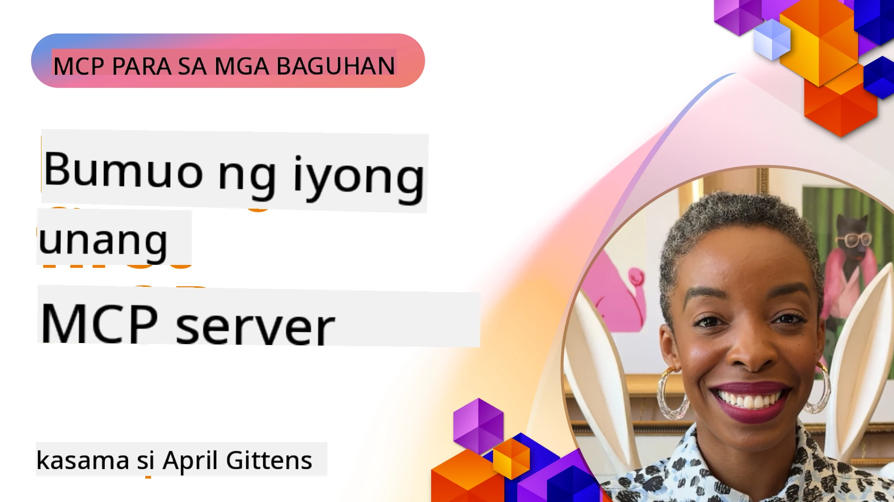

## Pagsisimula  

_(I-click ang larawan sa itaas upang panoorin ang video ng araling ito)_

Ang seksyong ito ay binubuo ng ilang mga aralin:

- **1 Iyong unang server**, sa unang araling ito, matututuhan mo kung paano gumawa ng iyong unang server at suriin ito gamit ang tool na inspector, isang mahalagang paraan upang subukan at i-debug ang iyong server, [sa aralin](01-first-server/README.md)

- **2 Kliyente**, sa araling ito, matututuhan mo kung paano magsulat ng isang kliyente na maaaring kumonekta sa iyong server, [sa aralin](02-client/README.md)

- **3 Kliyente na may LLM**, isang mas mahusay na paraan ng pagsulat ng kliyente ay sa pamamagitan ng pagdagdag ng LLM dito upang makapag-"negotiate" ito sa iyong server kung ano ang gagawin, [sa aralin](03-llm-client/README.md)

- **4 Paggamit ng server sa mode ng GitHub Copilot Agent sa Visual Studio Code**. Dito, tinitingnan namin ang pagpapatakbo ng aming MCP Server mula sa loob ng Visual Studio Code, [sa aralin](04-vscode/README.md)

- **5 stdio Transport Server** ang stdio transport ay ang inirerekomendang standard para sa lokal na komunikasyon ng MCP server-to-client, na nagbibigay ng secure na komunikasyon na batay sa subprocess na may built-in na isolation ng proseso [sa aralin](05-stdio-server/README.md)

- **6 HTTP Streaming gamit ang MCP (Streamable HTTP)**. Matututuhan ang tungkol sa makabagong HTTP streaming transport (ang inirerekomendang paraan para sa remote MCP servers alinsunod sa [MCP Specification 2025-11-25](https://spec.modelcontextprotocol.io/specification/2025-11-25/basic/transports/#streamable-http)), mga notification ng progreso, at kung paano magpatupad ng scalable, real-time MCP servers at kliyente gamit ang Streamable HTTP. [sa aralin](06-http-streaming/README.md)

- **7 Paggamit ng AI Toolkit para sa VSCode** upang gamitin at subukan ang iyong mga MCP Clients at Servers [sa aralin](07-aitk/README.md)

- **8 Pagsusuri**. Dito ay tututukan natin kung paano natin masusubukan ang aming server at kliyente sa iba't ibang paraan, [sa aralin](08-testing/README.md)

- **9 Deployment**. Tatalakayin ng kabanatang ito ang iba't ibang paraan ng pagde-deploy ng iyong MCP solutions, [sa aralin](09-deployment/README.md)

- **10 Advanced na paggamit ng server**. Tinatalakay ng kabanatang ito ang advanced na paggamit ng server, [sa aralin](./10-advanced/README.md)

- **11 Auth**. Tinatalakay ng kabanatang ito kung paano magdagdag ng simple auth, mula sa Basic Auth hanggang sa paggamit ng JWT at RBAC. Pinapayuhan kang magsimula dito at pagkatapos ay tingnan ang Advanced Topics sa Kabanata 5 at magsagawa ng karagdagang pag-hardening ng seguridad sa pamamagitan ng mga rekomendasyon sa Kabanata 2, [sa aralin](./11-simple-auth/README.md)

- **12 MCP Hosts**. I-configure at gamitin ang mga kilalang MCP host clients kabilang ang Claude Desktop, Cursor, Cline, at Windsurf. Matututuhan ang mga uri ng transport at troubleshooting, [sa aralin](./12-mcp-hosts/README.md)

- **13 MCP Inspector**. I-debug at subukan ang iyong mga MCP servers nang interactive gamit ang MCP Inspector tool. Matututuhan ang mga troubleshooting tools, resources, at mga protocol message, [sa aralin](./13-mcp-inspector/README.md)

- **14 Sampling**. Gumawa ng MCP Servers na nakikipagtulungan sa MCP clients sa mga gawain na may kinalaman sa LLM. [sa aralin](./14-sampling/README.md)

- **15 MCP Apps**. Bumuo ng MCP Servers na nagbibigay rin ng mga UI na tagubilin bilang tugon, [sa aralin](./15-mcp-apps/README.md)

Ang Model Context Protocol (MCP) ay isang bukas na protocol na nagtutukoy ng standard kung paano nagbibigay ng konteksto ang mga aplikasyon sa LLMs. Isipin ang MCP bilang isang USB-C port para sa mga AI application - nagbibigay ito ng isang standard na paraan upang ikonekta ang mga AI model sa iba't ibang mga pinagmumulan ng data at mga tool.

## Mga Layunin sa Pagkatuto

Sa pagtatapos ng araling ito, magagawa mong:

- Mag-setup ng mga development environment para sa MCP sa C#, Java, Python, TypeScript, at JavaScript
- Gumawa at mag-deploy ng mga batayang MCP servers na may mga custom na tampok (mga resources, prompts, at mga tool)
- Lumikha ng host applications na kumokonekta sa MCP servers
- Subukan at i-debug ang mga implementasyon ng MCP
- Maunawaan ang mga karaniwang hamon sa setup at mga solusyon nito
- Ikonekta ang iyong mga implementasyon ng MCP sa mga kilalang serbisyo ng LLM

## Pagsasaayos ng Iyong MCP Environment

Bago ka magsimulang magtrabaho sa MCP, mahalagang ihanda ang iyong development environment at maunawaan ang pangunahing workflow. Ituturo ka ng seksyong ito sa mga unang hakbang ng setup upang matiyak ang maayos na pagsisimula sa MCP.

### Mga Kinakailangan

Bago sumabak sa MCP development, tiyakin na mayroon kang:

- **Development Environment**: Para sa iyong napiling wika (C#, Java, Python, TypeScript, o JavaScript)
- **IDE/Editor**: Visual Studio, Visual Studio Code, IntelliJ, Eclipse, PyCharm, o anumang modernong code editor
- **Package Managers**: NuGet, Maven/Gradle, pip, o npm/yarn
- **API Keys**: Para sa mga AI service na balak mong gamitin sa iyong host applications

### Opisyal na mga SDK

Sa mga susunod na kabanata makikita mo ang mga solusyong ginawa gamit ang Python, TypeScript, Java at .NET. Narito ang lahat ng opisyal na suportadong SDK.

Nagbibigay ang MCP ng mga opisyal na SDK para sa maraming wika (ayon sa [MCP Specification 2025-11-25](https://spec.modelcontextprotocol.io/specification/2025-11-25/)):
- [C# SDK](https://github.com/modelcontextprotocol/csharp-sdk) - Pinananatili sa pakikipagtulungan sa Microsoft
- [Java SDK](https://github.com/modelcontextprotocol/java-sdk) - Pinananatili sa pakikipagtulungan sa Spring AI
- [TypeScript SDK](https://github.com/modelcontextprotocol/typescript-sdk) - Ang opisyal na implementasyon ng TypeScript
- [Python SDK](https://github.com/modelcontextprotocol/python-sdk) - Ang opisyal na implementasyon ng Python (FastMCP)
- [Kotlin SDK](https://github.com/modelcontextprotocol/kotlin-sdk) - Ang opisyal na implementasyon ng Kotlin
- [Swift SDK](https://github.com/modelcontextprotocol/swift-sdk) - Pinananatili sa pakikipagtulungan sa Loopwork AI
- [Rust SDK](https://github.com/modelcontextprotocol/rust-sdk) - Ang opisyal na implementasyon ng Rust
- [Go SDK](https://github.com/modelcontextprotocol/go-sdk) - Ang opisyal na implementasyon ng Go

## Mga Mahahalagang Punto

- Madaling mag-setup ng MCP development environment gamit ang mga language-specific SDKs
- Ang paggawa ng MCP servers ay nangangailangan ng paglikha at pagrerehistro ng mga tool na may malinaw na mga schema
- Ang mga MCP clients ay kumokonekta sa mga server at modelo upang magamit ang mga pinalawak na kakayahan
- Mahalaga ang pagsusuri at pag-debug para sa maaasahang mga implementasyon ng MCP
- Ang mga opsyon sa deployment ay mula sa lokal na development hanggang sa mga cloud-based na solusyon

## Pagsasanay

Mayroon kaming set ng mga halimbawa na sumusuporta sa mga ehersisyo na makikita mo sa lahat ng kabanata sa seksyong ito. Bukod dito, bawat kabanata ay may sariling mga ehersisyo at takdang-aralin.

- [Java Calculator](./samples/java/calculator/README.md)
- [.Net Calculator](../../../03-GettingStarted/samples/csharp)
- [JavaScript Calculator](./samples/javascript/README.md)
- [TypeScript Calculator](./samples/typescript/README.md)
- [Python Calculator](../../../03-GettingStarted/samples/python)

## Karagdagang Mga Mapagkukunan

- [Gumawa ng Agents gamit ang Model Context Protocol sa Azure](https://learn.microsoft.com/azure/developer/ai/intro-agents-mcp)
- [Remote MCP gamit ang Azure Container Apps (Node.js/TypeScript/JavaScript)](https://learn.microsoft.com/samples/azure-samples/mcp-container-ts/mcp-container-ts/)
- [.NET OpenAI MCP Agent](https://learn.microsoft.com/samples/azure-samples/openai-mcp-agent-dotnet/openai-mcp-agent-dotnet/)

## Ano ang susunod

Magsimula sa unang aralin: [Paglikha ng iyong unang MCP Server](01-first-server/README.md)

Kapag natapos mo na ang module na ito, magpatuloy sa: [Module 4: Praktikal na Implementasyon](../04-PracticalImplementation/README.md)

---

<!-- CO-OP TRANSLATOR DISCLAIMER START -->
**Paunawa**:  
Ang dokumentong ito ay isinalin gamit ang serbisyong AI na pagsasalin [Co-op Translator](https://github.com/Azure/co-op-translator). Bagamat nagsusumikap kami para sa katumpakan, pakatandaan na ang awtomatikong pagsasalin ay maaaring maglaman ng mga pagkakamali o kamalian. Ang orihinal na dokumento sa sariling wika nito ang dapat ituring na opisyal na sanggunian. Para sa mahahalagang impormasyon, inirerekomenda ang propesyonal na pagsasaling-tao. Hindi kami mananagot sa anumang hindi pagkakaunawaan o maling pagpapakahulugan na nagmula sa paggamit ng pagsasaling ito.
<!-- CO-OP TRANSLATOR DISCLAIMER END -->