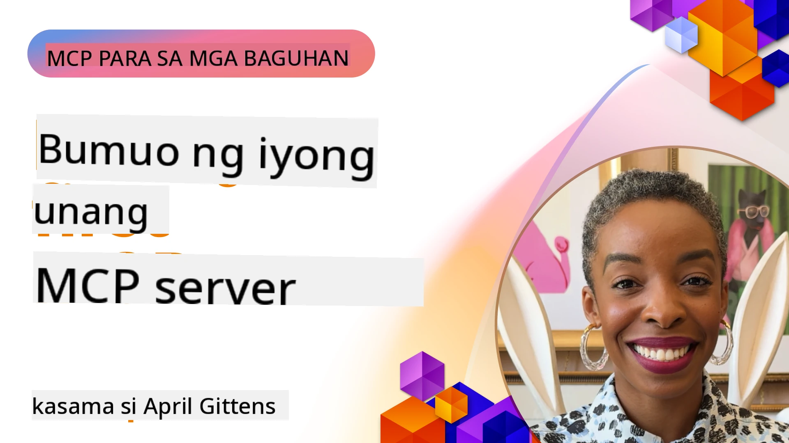

## Pagsisimula  

_(I-click ang larawan sa itaas upang mapanood ang video ng araling ito)_

Binubuo ang seksyong ito ng ilang mga aralin:

- **1 Ang iyong unang server**, sa unang araling ito, matututunan mo kung paano gumawa ng iyong unang server at iinspeksyon ito gamit ang inspector tool, isang mahalagang paraan upang subukan at i-debug ang iyong server, [sa aralin](01-first-server/README.md)

- **2 Kliyente**, sa araling ito, matututunan mo kung paano sumulat ng isang kliyente na maaaring kumonekta sa iyong server, [sa aralin](02-client/README.md)

- **3 Kliyente na may LLM**, isang mas mahusay na paraan ng pagsulat ng kliyente ay ang pagdaragdag ng LLM dito upang makapagsagawa ng "negoasyon" sa iyong server kung ano ang gagawin, [sa aralin](03-llm-client/README.md)

- **4 Paggamit ng server GitHub Copilot Agent mode sa Visual Studio Code**. Dito, tinitingnan natin ang pagpapatakbo ng ating MCP Server mula sa loob ng Visual Studio Code, [sa aralin](04-vscode/README.md)

- **5 stdio Transport Server** ang stdio transport ay ang inirerekomendang pamantayan para sa lokal na komunikasyon ng MCP server-sa-kliyente, na nagbibigay ng secure na subprocess-based na komunikasyon na may built-in na isolation ng proseso [sa aralin](05-stdio-server/README.md)

- **6 HTTP Streaming gamit ang MCP (Streamable HTTP)**. Alamin ang pamantayan
	remote transport sa [MCP Specification 2026-07-28](https://modelcontextprotocol.io/specification/2026-07-28/basic/transports/streamable-http),
	kasama ang legacy na session-based na implementasyon na nananatili sa aralin.
	[sa aralin](06-http-streaming/README.md)

- **7 Paggamit ng AI Toolkit para sa VSCode** upang gamitin at subukan ang iyong MCP Clients at Servers [sa aralin](07-aitk/README.md)

- **8 Pagsusuri**. Dito tututok tayo lalo na kung paano natin masusubukan ang ating server at client sa iba't ibang paraan, [sa aralin](08-testing/README.md)

- **9 Deployment**. Tatalakayin ng kabanatang ito ang iba't ibang paraan ng pag-deploy ng iyong mga solusyon sa MCP, [sa aralin](09-deployment/README.md)

- **10 Advanced na paggamit ng server**. Tinatalakay ng kabanatang ito ang advanced na paggamit ng server, [sa aralin](./10-advanced/README.md)

- **11 Auth**. Tinatalakay ng kabanatang ito kung paano magdagdag ng simpleng auth, mula Basic Auth hanggang sa paggamit ng JWT at RBAC. Hinihikayat kang magsimula dito at pagkatapos ay tingnan ang Advanced na mga Paksa sa Kabanata 5 at magsagawa ng karagdagang pagpapalakas ng seguridad sa pamamagitan ng mga rekomendasyon sa Kabanata 2, [sa aralin](./11-simple-auth/README.md)

- **12 MCP Hosts**. I-configure at gamitin ang mga popular na MCP host clients kabilang ang Claude Desktop, Cursor, Cline, at Windsurf. Alamin ang mga uri ng transport at troubleshooting, [sa aralin](./12-mcp-hosts/README.md)

- **13 MCP Inspector**. I-debug at subukan ang iyong MCP servers nang interaktibo gamit ang MCP Inspector tool. Matutunan ang troubleshooting ng mga tools, resources, at protocol messages, [sa aralin](./13-mcp-inspector/README.md)

- **14 Sampling**. Alamin ang legacy Sampling primitive para sa `2025-11-25` at
	paano mag-migrate ng bagong mga disenyo sa direktang integrasyon ng LLM provider. Ang Sampling ay
	itinakwil sa MCP `2026-07-28`. [sa aralin](./14-sampling/README.md)

- **15 MCP Apps**. Gumawa ng MCP Servers na tumutugon rin gamit ang mga UI na instruksyon, [sa aralin](./15-mcp-apps/README.md)

Ang Model Context Protocol (MCP) ay isang bukas na protocol na nag-standardize kung paano nagbibigay ng konteksto ang mga aplikasyon sa LLMs. Isipin ang MCP tulad ng USB-C port para sa mga AI na aplikasyon - nagbibigay ito ng standardized na paraan upang ikonekta ang mga AI modelo sa iba't ibang pinagmumulan ng data at mga kasangkapan.

## Mga Layunin sa Pagkatuto

Sa pagtatapos ng araling ito, magagawa mong:

- Mag-setup ng mga development environment para sa MCP gamit ang C#, Java, Python, TypeScript, at JavaScript
- Gumawa at mag-deploy ng mga pangunahing MCP server na may custom na mga feature (resources, prompts, at mga tool)
- Gumawa ng mga host application na kumokonekta sa MCP servers
- Subukan at i-debug ang mga implementasyon ng MCP
- Unawain ang mga karaniwang hamon sa setup at ang kanilang mga solusyon
- Ikonekta ang iyong mga implementasyon ng MCP sa mga popular na LLM services

## Pagsasaayos ng Iyong Kapaligiran para sa MCP

Bago ka magsimulang magtrabaho gamit ang MCP, mahalagang ihanda ang iyong development environment at unawain ang pangunahing workflow. Gabay ka ng seksyong ito sa mga unang hakbang ng setup upang matiyak ang maayos na pagsisimula sa MCP.

### Mga Kinakailangan

Bago sumabak sa pag-develop gamit ang MCP, siguraduhing mayroon kang:

- **Development Environment**: Para sa iyong napiling wika (C#, Java, Python, TypeScript, o JavaScript)
- **IDE/Editor**: Visual Studio, Visual Studio Code, IntelliJ, Eclipse, PyCharm, o anumang modernong code editor
- **Package Managers**: NuGet, Maven/Gradle, pip, o npm/yarn
- **API Keys**: Para sa anumang AI services na balak mong gamitin sa iyong mga host application

### Official SDKs

Sa mga susunod na kabanata makikita mo ang mga solusyong binuo gamit ang Python, TypeScript,
Java at .NET. Narito ang mga opisyal na SDK.

Ang suportang SDK para sa MCP `2026-07-28` ay inilalabas nang paisa-isa ayon sa wika.
Bago patakbuhin ang isang halimbawa, tingnan ang bersyon ng package nito at ang mga release notes ng SDK
para sa mga suportadong pagbabago sa protocol. Tingnan ang
[opisyal na listahan ng SDK](https://modelcontextprotocol.io/docs/sdk):
- [C# SDK](https://github.com/modelcontextprotocol/csharp-sdk) - Pinapanatili kasabay ng Microsoft
- [Java SDK](https://github.com/modelcontextprotocol/java-sdk) - Pinapanatili kasabay ng Spring AI
- [TypeScript SDK](https://github.com/modelcontextprotocol/typescript-sdk) - Ang opisyal na implementasyon ng TypeScript
- [Python SDK](https://github.com/modelcontextprotocol/python-sdk) - Ang opisyal na implementasyon ng Python (FastMCP)
- [Kotlin SDK](https://github.com/modelcontextprotocol/kotlin-sdk) - Ang opisyal na implementasyon ng Kotlin
- [Swift SDK](https://github.com/modelcontextprotocol/swift-sdk) - Pinapanatili kasabay ng Loopwork AI
- [Rust SDK](https://github.com/modelcontextprotocol/rust-sdk) - Ang opisyal na implementasyon ng Rust
- [Go SDK](https://github.com/modelcontextprotocol/go-sdk) - Ang opisyal na implementasyon ng Go

## Mahahalagang Puntos

- Ang pagsasaayos ng isang MCP development environment ay diretso gamit ang mga SDK na tukoy sa wika
- Ang paggawa ng MCP servers ay kinapapalooban ng paglikha at pagrerehistro ng mga tool na may malinaw na mga schema
- Kumokonekta ang MCP clients sa mga server at modelo upang magamit ang mga pinalawak na kakayahan
- Mahalagang bahagi ang pagsusuri at pag-debug para sa maaasahang implementasyon ng MCP
- Ang mga pagpipilian sa deployment ay mula lokal na development hanggang cloud-based na mga solusyon

## Praktis

Meron kaming set ng mga sample na sumusuporta sa mga ehersisyo na makikita mo sa lahat ng kabanata ng seksyong ito. Bukod dito, ang bawat kabanata ay may kanya-kanyang mga ehersisyo at asignatura

- [Java Calculator](./samples/java/calculator/README.md)
- [.NET Calculator](../../../03-GettingStarted/samples/csharp)
- [JavaScript Calculator](./samples/javascript/README.md)
- [TypeScript Calculator](./samples/typescript/README.md)
- [Python Calculator](../../../03-GettingStarted/samples/python)

## Karagdagang Mga Mapagkukunan

- [Gumawa ng mga Ahente gamit ang Model Context Protocol sa Azure](https://learn.microsoft.com/azure/developer/ai/intro-agents-mcp)
- [Remote MCP gamit ang Azure Container Apps (Node.js/TypeScript/JavaScript)](https://learn.microsoft.com/samples/azure-samples/mcp-container-ts/mcp-container-ts/)
- [.NET OpenAI MCP Agent](https://learn.microsoft.com/samples/azure-samples/openai-mcp-agent-dotnet/openai-mcp-agent-dotnet/)

## Ano ang susunod

Magsimula sa unang aralin: [Paglikha ng iyong unang MCP Server](01-first-server/README.md)

Kapag natapos mo ang modulong ito, magpatuloy sa: [Module 4: Praktikal na Implementasyon](../04-PracticalImplementation/README.md)

---

<!-- CO-OP TRANSLATOR DISCLAIMER START -->
**Pagtatanggi**:
Ang dokumentong ito ay isinalin gamit ang serbisyo ng AI translation na [Co-op Translator](https://github.com/Azure/co-op-translator). Bagama't nagsusumikap kami para sa katumpakan, pakatandaan na ang awtomatikong pagsasalin ay maaaring maglaman ng mga pagkakamali o hindi pagkakatugma. Ang orihinal na dokumento sa orihinal nitong wika ang dapat ituring na pangunahing sanggunian. Para sa mahahalagang impormasyon, inirerekomenda ang propesyonal na pagsasalin ng tao. Hindi kami mananagot sa anumang maling pagkakaintindi o maling interpretasyon na nagmula sa paggamit ng pagsasaling ito.
<!-- CO-OP TRANSLATOR DISCLAIMER END -->