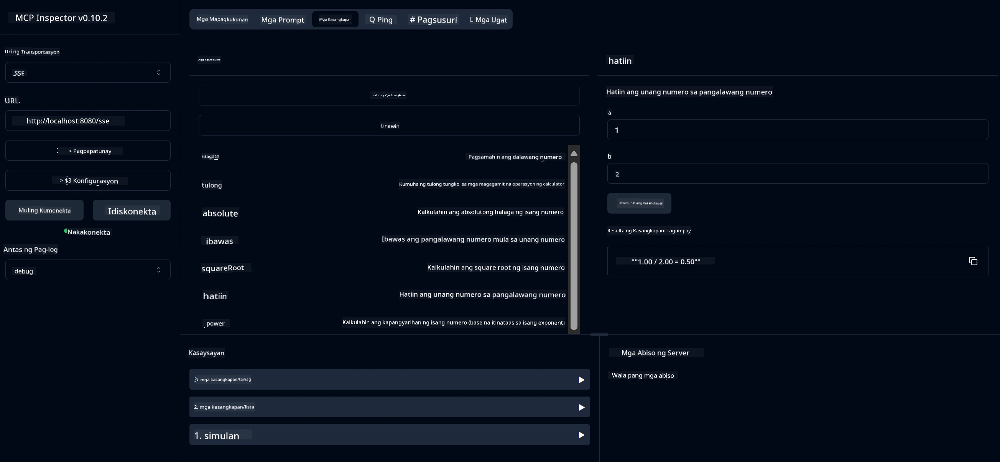

# Basic Calculator MCP Service

> [!NOTE]
> Ang sample na ito ay gumagamit ng legacy HTTP+SSE transport at nakatuon sa isang SDK na compatible
> sa MCP `2025-11-25`. Ang mga bagong remote server ay dapat gumamit ng `2026-07-28` Streamable
> HTTP support.

Ang serbisyong ito ay nagbibigay ng mga pangunahing kalkulasyon sa pamamagitan ng Model Context Protocol (MCP) gamit ang Spring Boot na may WebFlux transport. Ito ay idinisenyo bilang isang simpleng halimbawa para sa mga baguhang nag-aaral tungkol sa mga implementasyon ng MCP.

Para sa karagdagang impormasyon, tingnan ang [MCP Server Boot Starter](https://docs.spring.io/spring-ai/reference/api/mcp/mcp-server-boot-starter-docs.html) na dokumentasyong sanggunian.

## Pangkalahatang-ideya

Ipinapakita ng serbisyo ang mga sumusunod:
- Suporta para sa SSE (Server-Sent Events)
- Awtomatikong pagpaparehistro ng mga tool gamit ang `@Tool` annotation ng Spring AI
- Mga pangunahing function ng calculator:
  - Pagdaragdag, pagbabawas, pagpaparami, paghahati
  - Pagkalkula ng kapangyarihan at square root
  - Modulus (natitirang bahagi) at absolute value
  - Function ng tulong para sa mga paglalarawan ng operasyon

## Mga Tampok

Ang serbisyong calculator na ito ay nag-aalok ng mga sumusunod na kakayahan:

1. **Mga Pangunahing Operasyong Aritmetika**:
   - Pagdaragdag ng dalawang numero
   - Pagbabawas ng isang numero mula sa isa pa
   - Pagpaparami ng dalawang numero
   - Paghahati ng isang numero sa isa pa (na may pagsusuri sa paghahati sa zero)

2. **Mga Advanced na Operasyon**:
   - Kalkulasyon ng kapangyarihan (pagtaas ng base sa isang exponent)
   - Kalkulasyon ng square root (na may pagsusuri sa negatibong numero)
   - Kalkulasyon ng modulus (natitirang bahagi)
   - Kalkulasyon ng absolute value

3. **Sistema ng Tulong**:
   - Naka-built-in na function ng tulong na nagpapaliwanag ng lahat ng magagamit na operasyon

## Paggamit ng Serbisyo

Ang serbisyo ay nagpapakita ng sumusunod na mga endpoint ng API sa pamamagitan ng MCP protocol:

- `add(a, b)`: Magdagdag ng dalawang numero
- `subtract(a, b)`: Ibawas ang pangalawang numero mula sa una
- `multiply(a, b)`: Imultiply ang dalawang numero
- `divide(a, b)`: Hatiin ang unang numero sa pangalawa (na may pagsusuri sa zero)
- `power(base, exponent)`: Kalkulahin ang kapangyarihan ng isang numero
- `squareRoot(number)`: Kalkulahin ang square root (na may pagsusuri sa negatibong numero)
- `modulus(a, b)`: Kalkulahin ang natitirang bahagi sa paghahati
- `absolute(number)`: Kalkulahin ang absolute value
- `help()`: Kumuha ng impormasyon tungkol sa magagamit na mga operasyon

## Test Client

Isang simpleng test client ay kasama sa `com.microsoft.mcp.sample.client` package. Ipinapakita ng `SampleCalculatorClient` class ang magagamit na mga operasyon ng calculator service.

## Paggamit ng LangChain4j Client

Kasama sa proyekto ang isang LangChain4j example client sa `com.microsoft.mcp.sample.client.LangChain4jClient` na nagpapakita kung paano i-integrate ang calculator service sa LangChain4j at mga modelo ng GitHub:

### Mga Kinakailangan

1. **GitHub Token Setup**:
   
   Upang gamitin ang mga AI model ng GitHub (tulad ng phi-4), kailangan mo ng GitHub personal access token:

   a. Pumunta sa iyong GitHub account settings: https://github.com/settings/tokens
   
   b. I-click ang "Generate new token" → "Generate new token (classic)"
   
   c. Bigyan ang iyong token ng isang madetalye at malinaw na pangalan
   
   d. Piliin ang mga sumusunod na scopes:
      - `repo` (Buong kontrol sa mga pribadong repository)
      - `read:org` (Basahin ang org at team membership, basahin ang mga proyekto ng org)
      - `gist` (Gumawa ng mga gist)
      - `user:email` (Access sa mga email address ng user (read-only))
   
   e. I-click ang "Generate token" at kopyahin ang iyong bagong token
   
   f. Itakda ito bilang isang environment variable:
      
      Sa Windows:
      ```
      set GITHUB_TOKEN=your-github-token
      ```
      
      Sa macOS/Linux:
      ```bash
      export GITHUB_TOKEN=your-github-token
      ```

   g. Para sa permanenteng setup, idagdag ito sa iyong environment variables sa pamamagitan ng system settings

2. Idagdag ang LangChain4j GitHub dependency sa iyong proyekto (kasama na sa pom.xml):
   ```xml
   <dependency>
       <groupId>dev.langchain4j</groupId>
       <artifactId>langchain4j-github</artifactId>
       <version>${langchain4j.version}</version>
   </dependency>
   ```

3. Tiyaking ang calculator server ay tumatakbo sa `localhost:8080`

### Pagpapatakbo ng LangChain4j Client

Ipinapakita ng halimbawa na ito:
- Pagsasama sa calculator MCP server gamit ang SSE transport
- Paggamit ng LangChain4j upang gumawa ng chat bot na gumagamit ng mga operasyon ng calculator
- Integrasyon sa mga GitHub AI models (kasalukuyang gamit ang phi-4 model)

Ang client ay nagpapadala ng mga sumusunod na halimbawa ng tanong upang ipakita ang functionality:
1. Pagkuwenta ng kabuuan ng dalawang numero
2. Paghahanap ng square root ng isang numero
3. Pagkuha ng impormasyon tungkol sa mga magagamit na operasyon ng calculator

Patakbuhin ang halimbawa at tingnan ang output sa console upang makita kung paano ginagamit ng AI model ang mga tool ng calculator upang sagutin ang mga tanong.

### Pag-configure ng GitHub Model

Nakapag-configure ang LangChain4j client upang gamitin ang phi-4 model ng GitHub gamit ang mga sumusunod na setting:

```java
ChatLanguageModel model = GitHubChatModel.builder()
    .apiKey(System.getenv("GITHUB_TOKEN"))
    .timeout(Duration.ofSeconds(60))
    .modelName("phi-4")
    .logRequests(true)
    .logResponses(true)
    .build();
```

Para gumamit ng iba pang mga GitHub models, palitan lamang ang `modelName` parameter sa isa pang suportadong model (hal. "claude-3-haiku-20240307", "llama-3-70b-8192", atbp.).

## Mga Dependencies

Kinakailangan ng proyekto ang mga sumusunod na pangunahing dependencies:

```xml
<!-- For MCP Server -->
<dependency>
    <groupId>org.springframework.ai</groupId>
    <artifactId>spring-ai-starter-mcp-server-webflux</artifactId>
</dependency>

<!-- For LangChain4j integration -->
<dependency>
    <groupId>dev.langchain4j</groupId>
    <artifactId>langchain4j-mcp</artifactId>
    <version>${langchain4j.version}</version>
</dependency>

<!-- For GitHub models support -->
<dependency>
    <groupId>dev.langchain4j</groupId>
    <artifactId>langchain4j-github</artifactId>
    <version>${langchain4j.version}</version>
</dependency>
```

## Pagbuo ng Proyekto

Buuhin ang proyekto gamit ang Maven:
```bash
./mvnw clean install -DskipTests
```

## Pagpapatakbo ng Server

### Paggamit ng Java

```bash
java -jar target/calculator-server-0.0.1-SNAPSHOT.jar
```

### Paggamit ng MCP Inspector

Ang MCP Inspector ay isang kapaki-pakinabang na kasangkapan para sa pakikipag-ugnayan sa mga MCP services. Para gamitin ito sa calculator service na ito:

1. **I-install at patakbuhin ang MCP Inspector** sa isang bagong terminal window:
   ```bash
   npx @modelcontextprotocol/inspector
   ```

2. **I-access ang web UI** sa pamamagitan ng pag-click sa URL na ipinapakita ng app (karaniwang http://localhost:6274)

3. **I-configure ang koneksyon**:
   - Itakda ang transport type sa "SSE"
   - Itakda ang URL sa SSE endpoint ng iyong server na tumatakbo: `http://localhost:8080/sse`
   - I-click ang "Connect"

4. **Gamitin ang mga tool**:
   - I-click ang "List Tools" upang makita ang magagamit na mga operasyon ng calculator
   - Piliin ang isang tool at i-click ang "Run Tool" upang isagawa ang isang operasyon



### Paggamit ng Docker

Kasama sa proyekto ang isang Dockerfile para sa containerized deployment:

1. **Buuhin ang Docker image**:
   ```bash
   docker build -t calculator-mcp-service .
   ```

2. **Patakbuhin ang Docker container**:
   ```bash
   docker run -p 8080:8080 calculator-mcp-service
   ```

Ito ay:
- Magbuo ng multi-stage Docker image gamit ang Maven 3.9.9 at Eclipse Temurin 24 JDK
- Gumawa ng isang optimized na container image
- I-expose ang serbisyo sa port 8080
- Simulan ang MCP calculator service sa loob ng container

Maaari mong i-access ang serbisyo sa `http://localhost:8080` kapag tumatakbo na ang container.

## Pag-troubleshoot

### Mga Karaniwang Isyu sa GitHub Token

1. **Mga Isyu sa Pahintulot ng Token**: Kung makakatanggap ka ng 403 Forbidden error, siguraduhing ang iyong token ay may tamang permissions tulad ng nakasaad sa mga kinakailangan.

2. **Token Hindi Nahanap**: Kung makakatanggap ka ng "No API key found" error, tiyakin na ang GITHUB_TOKEN environment variable ay tama ang pagkaka-set.

3. **Rate Limiting**: May mga rate limit ang GitHub API. Kung makakaranas ng rate limit error (status code 429), maghintay ng ilang minuto bago ulitin ang pagtatangka.

4. **Pag-expire ng Token**: Ang mga GitHub token ay maaaring mag-expire. Kung makakatanggap ka ng mga authentication error pagkatapos ng ilang panahon, gumawa ng bagong token at i-update ang iyong environment variable.

Kung kailangan mo pa ng karagdagang tulong, tingnan ang [LangChain4j documentation](https://github.com/langchain4j/langchain4j) o [GitHub API documentation](https://docs.github.com/en/rest).

---

<!-- CO-OP TRANSLATOR DISCLAIMER START -->
**Pagtatanggi**:
Ang dokumentong ito ay isinalin gamit ang serbisyo ng AI translation na [Co-op Translator](https://github.com/Azure/co-op-translator). Bagama't nagsusumikap kami para sa katumpakan, pakatandaan na ang awtomatikong pagsasalin ay maaaring maglaman ng mga pagkakamali o hindi pagkakatugma. Ang orihinal na dokumento sa orihinal nitong wika ang dapat ituring na pangunahing sanggunian. Para sa mahahalagang impormasyon, inirerekomenda ang propesyonal na pagsasalin ng tao. Hindi kami mananagot sa anumang maling pagkakaintindi o maling interpretasyon na nagmula sa paggamit ng pagsasaling ito.
<!-- CO-OP TRANSLATOR DISCLAIMER END -->