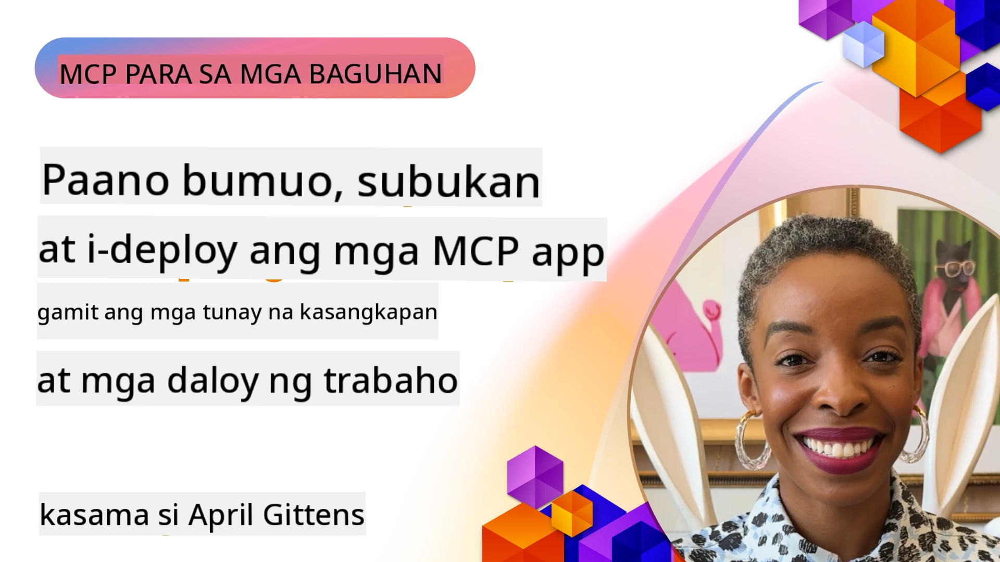
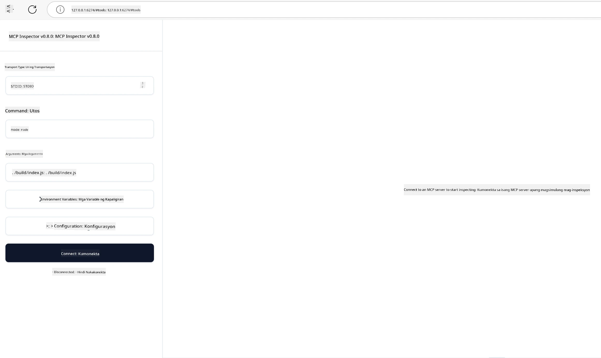

# Praktikal na Pagpapatupad

[](https://youtu.be/vCN9-mKBDfQ)

_(I-click ang larawan sa itaas upang mapanood ang video ng leksyon na ito)_

Ang praktikal na pagpapatupad ay kung saan nagiging konkreto ang kapangyarihan ng Model Context Protocol (MCP). Bagamat mahalaga ang pag-unawa sa teorya at arkitektura sa likod ng MCP, lumilitaw ang tunay na halaga kapag inilapat mo ang mga konseptong ito upang bumuo, subukan, at i-deploy ang mga solusyon na tumutugon sa mga totoong suliranin. Ang kabanatang ito ay nag-uugnay sa pagitan ng konseptuwal na kaalaman at aktwal na pagbuo, ginagabayan ka sa proseso ng pagbibigay-buhay sa mga aplikasyon batay sa MCP.

Kung ikaw ay nagde-develop ng mga intelligent assistants, nag-iintegrate ng AI sa mga business workflows, o gumagawa ng custom na mga tools para sa pagproseso ng data, nagbibigay ang MCP ng isang fleksibleng pundasyon. Ang disenyo nitong malaya sa wika at ang mga opisyal na SDK para sa mga sikat na programming languages ay ginagawang naaabot ito ng malawak na hanay ng mga developer. Sa pamamagitan ng paggamit ng mga SDK na ito, maaari kang mabilis na makabuo ng prototype, mag-iterate, at mag-scale ng iyong mga solusyon sa iba't ibang platform at kapaligiran.

Sa mga sumusunod na seksyon, makikita mo ang mga praktikal na halimbawa, sample code, at mga estratehiya sa deployment na nagpapakita kung paano ipatupad ang MCP sa C#, Java gamit ang Spring, TypeScript, JavaScript, at Python. Malalaman mo rin kung paano i-debug at subukan ang iyong MCP servers, pamahalaan ang mga API, at i-deploy ang mga solusyon sa cloud gamit ang Azure. Dinisenyo ang mga hands-on na mapagkukunang ito upang pabilisin ang iyong pag-aaral at tulungan kang may kumpiyansang bumuo ng matibay at handang produksyon na MCP applications.

## Pangkalahatang-ideya

Nakatuon ang leksyon na ito sa praktikal na mga aspeto ng pagpapatupad ng MCP sa iba't ibang programming languages. Tatalakayin natin kung paano gamitin ang MCP SDKs sa C#, Java gamit ang Spring, TypeScript, JavaScript, at Python upang bumuo ng matibay na mga aplikasyon, i-debug at subukan ang MCP servers, at gumawa ng mga reusable na resources, prompts, at tools.

## Mga Layunin ng Pagkatuto

Sa pagtatapos ng leksyon na ito, magagawa mong:

- Ipatupad ang mga solusyon ng MCP gamit ang mga opisyal na SDK sa iba't ibang programming languages
- Sistematikong i-debug at subukan ang MCP servers
- Gumawa at gumamit ng mga tampok ng server (Mga Resources, Prompts, at Tools)
- Disenyuhin ang epektibong MCP workflows para sa mga kumplikadong gawain
- I-optimize ang mga pagpapatupad ng MCP para sa performance at pagiging maaasahan

## Mga Opisyal na SDK Resources

Nagbibigay ang Model Context Protocol ng mga opisyal na SDK para sa maraming wika (ayon sa [MCP Specification 2025-11-25](https://spec.modelcontextprotocol.io/specification/2025-11-25/)):

- [C# SDK](https://github.com/modelcontextprotocol/csharp-sdk)
- [Java gamit ang Spring SDK](https://github.com/modelcontextprotocol/java-sdk) **Tandaan:** kailangan ng dependency sa [Project Reactor](https://projectreactor.io). (Tingnan ang [discussion issue 246](https://github.com/orgs/modelcontextprotocol/discussions/246).)
- [TypeScript SDK](https://github.com/modelcontextprotocol/typescript-sdk)
- [Python SDK](https://github.com/modelcontextprotocol/python-sdk)
- [Kotlin SDK](https://github.com/modelcontextprotocol/kotlin-sdk)
- [Go SDK](https://github.com/modelcontextprotocol/go-sdk)

## Paggamit ng MCP SDKs

Nagbibigay ang seksyong ito ng mga praktikal na halimbawa ng pagpapatupad ng MCP sa iba't ibang programming languages. Makikita mo ang mga sample code sa direktoryo na `samples` na inayos ayon sa wika.

### Mga Magagamit na Sample

Kasama sa repository ang [mga sample implementation](../../../04-PracticalImplementation/samples) sa mga sumusunod na wika:

- [C#](./samples/csharp/README.md)
- [Java gamit ang Spring](./samples/java/containerapp/README.md)
- [TypeScript](./samples/typescript/README.md)
- [JavaScript](./samples/javascript/README.md)
- [Python](./samples/python/README.md)

Ang bawat halimbawa ay nagpapakita ng mga pangunahing konsepto ng MCP at mga pattern ng pagpapatupad para sa partikular na wika at ecosystem.

### Mga Praktikal na Patnubay

Karagdagang mga patnubay para sa praktikal na pagpapatupad ng MCP:

- [Pagination at Malalaking Resulta ng Set](./pagination/README.md) - Pangasiwaan ang cursor-based pagination para sa mga tools, resources, at malalaking datasets

## Mga Pangunahing Tampok ng Server

Maaaring ipatupad ng mga MCP server ang anumang kumbinasyon ng mga tampok na ito:

### Resources

Nagbibigay ang Resources ng konteksto at datos para magamit ng user o AI model:

- Mga repositoryo ng dokumento
- Mga knowledge base
- Mga naka-istrukturang pinagkukunan ng data
- Mga file system

### Prompts

Ang Prompts ay mga templated na mensahe at workflows para sa mga user:

- Paunang-defined na mga template ng usapan
- Mga ginabayang pattern ng interaksyon
- Mga espesyal na estruktura ng dayalogo

### Tools

Ang Tools ay mga function para patakbuhin ng AI model:

- Mga utility sa pagproseso ng data
- Integrasyon sa mga external API
- Mga kakayahan sa komputasyon
- Functionality sa paghahanap

## Mga Sample na Pagpapatupad: C# na Pagpapatupad

Ang opisyal na C# SDK repository ay naglalaman ng ilang sample implementations na nagpapakita ng iba't ibang aspeto ng MCP:

- **Basic MCP Client**: Simpleng halimbawa na nagpapakita kung paano gumawa ng MCP client at tumawag ng mga tools
- **Basic MCP Server**: Minimal na pagpapatupad ng server na may pangunahing rehistrasyon ng tools
- **Advanced MCP Server**: Full-featured na server na may tool registration, authentication, at error handling
- **ASP.NET Integration**: Mga halimbawa ng integrasyon sa ASP.NET Core
- **Mga Pattern ng Pagpapatupad ng Tool**: Iba't ibang pattern para sa pagpapatupad ng mga tools na may iba't ibang antas ng komplikasyon

Ang MCP C# SDK ay nasa preview pa at maaaring magbago ang API. Patuloy naming ia-update ang blog na ito habang umuunlad ang SDK.

### Mga Pangunahing Tampok

- [C# MCP Nuget ModelContextProtocol](https://www.nuget.org/packages/ModelContextProtocol)
- Pagtatayo ng iyong [unang MCP Server](https://devblogs.microsoft.com/dotnet/build-a-model-context-protocol-mcp-server-in-csharp/).

Para sa kumpletong mga sample ng pagpapatupad ng C#, bisitahin ang [opisyal na C# SDK samples repository](https://github.com/modelcontextprotocol/csharp-sdk)

## Sample na pagpapatupad: Java gamit ang Spring na Pagpapatupad

Nag-aalok ang Java gamit ang Spring SDK ng matibay na mga pagpipilian para sa MCP na pagpapatupad na may enterprise-grade na mga tampok.

### Mga Pangunahing Tampok

- Integrasyon sa Spring Framework
- Malakas na type safety
- Suporta sa reactive programming
- Komprehensibong error handling

Para sa kumpletong sample ng Java gamit ang Spring na pagpapatupad, tingnan ang [Java with Spring sample](samples/java/containerapp/README.md) sa samples na direktoryo.

## Sample na pagpapatupad: JavaScript na Pagpapatupad

Nagbibigay ang JavaScript SDK ng magaan at fleksibleng paraan ng pagpapatupad ng MCP.

### Mga Pangunahing Tampok

- Suporta para sa Node.js at browser
- Promise-based API
- Madaling integrasyon sa Express at iba pang frameworks
- Suporta sa WebSocket para sa streaming

Para sa kumpletong sample ng JavaScript na pagpapatupad, tingnan ang [JavaScript sample](samples/javascript/README.md) sa samples na direktoryo.

## Sample na pagpapatupad: Python na Pagpapatupad

Nag-aalok ang Python SDK ng isang Pythonic na paraan para sa pagpapatupad ng MCP na may mahusay na integrasyon sa mga ML framework.

### Mga Pangunahing Tampok

- Suporta sa async/await gamit ang asyncio
- Integrasyon sa FastAPI``
- Simpleng tool registration
- Lokal na integrasyon sa mga sikat na ML libraries

Para sa kumpletong sample ng Python na pagpapatupad, tingnan ang [Python sample](samples/python/README.md) sa samples na direktoryo.

## Pamamahala ng API

Ang Azure API Management ay isang mahusay na sagot kung paano natin mapoprotektahan ang mga MCP Servers. Ang ideya ay ilagay ang isang Azure API Management instance sa harap ng iyong MCP Server at hayaang ito ang humawak ng mga tampok na madalas mong kailanganin tulad ng:

- rate limiting
- pamamahala ng token
- monitoring
- load balancing
- seguridad

### Sample sa Azure

Narito ang isang Azure Sample na gumagawa ng ganoon, i.e. [gumagawa ng MCP Server at pinoprotektahan ito gamit ang Azure API Management](https://github.com/Azure-Samples/remote-mcp-apim-functions-python).

Tingnan kung paano nangyayari ang authorization flow sa larawan sa ibaba:


Sa larawan sa itaas, nangyayari ang sumusunod:

- Nangyayari ang Authentication/Authorization gamit ang Microsoft Entra.
- Gumaganap ang Azure API Management bilang gateway at gumagamit ng mga polisiya para idirekta at pamahalaan ang trapiko.
- Nilo-log ng Azure Monitor ang lahat ng request para sa karagdagang pagsusuri.

#### Authorization flow

Tingnan natin nang mas detalyado ang authorization flow:


#### MCP authorization specification

Alamin pa ang tungkol sa [MCP Authorization specification](https://spec.modelcontextprotocol.io/specification/2025-11-25/basic/authorization/)

## I-deploy ang Remote MCP Server sa Azure

Tingnan natin kung kaya nating i-deploy ang sample na binanggit natin kanina:

1. I-clone ang repo

    ```bash
    git clone https://github.com/Azure-Samples/remote-mcp-apim-functions-python.git
    cd remote-mcp-apim-functions-python
    ```

1. Irehistro ang `Microsoft.App` resource provider.

   - Kung gumagamit ka ng Azure CLI, patakbuhin ang `az provider register --namespace Microsoft.App --wait`.
   - Kung gumagamit ka ng Azure PowerShell, patakbuhin ang `Register-AzResourceProvider -ProviderNamespace Microsoft.App`. Pagkatapos ay patakbuhin ang `(Get-AzResourceProvider -ProviderNamespace Microsoft.App).RegistrationState` pagkatapos ng ilang sandali upang suriin kung tapos na ang registration.

1. Patakbuhin ang [azd](https://aka.ms/azd) na command na ito para mag-provision ng api management service, function app (kasama ang code) at lahat ng iba pang kinakailangang Azure resources

    ```shell
    azd up
    ```

    Ang mga command na ito ay dapat mag-deploy ng lahat ng cloud resources sa Azure

### Pagsubok ng iyong server gamit ang MCP Inspector

1. Sa isang **bagong terminal window**, i-install at patakbuhin ang MCP Inspector

    ```shell
    npx @modelcontextprotocol/inspector
    ```

    Makikita mo ang interface na katulad ng:

    

1. CTRL click para i-load ang MCP Inspector web app mula sa URL na ipinapakita ng app (hal. [http://127.0.0.1:6274/#resources](http://127.0.0.1:6274/#resources))
1. Itakda ang uri ng transport sa `SSE`
1. Itakda ang URL sa iyong tumatakbong API Management SSE endpoint na ipinakita pagkatapos ng `azd up` at **Connect**:

    ```shell
    https://<apim-servicename-from-azd-output>.azure-api.net/mcp/sse
    ```

1. **Mag-lista ng Tools**. I-click ang isang tool at **Run Tool**.  

Kung nagtagumpay ang lahat ng hakbang, dapat ay nakakonekta ka na sa MCP server at nagawa mo nang tawagan ang isang tool.

## Mga MCP server para sa Azure

[Remote-mcp-functions](https://github.com/Azure-Samples/remote-mcp-functions-dotnet): Ang set ng mga repository na ito ay mga mabilisang template para sa pagbuo at deployment ng mga custom remote MCP (Model Context Protocol) servers gamit ang Azure Functions na may Python, C# .NET o Node/TypeScript.

Nagbibigay ang Samples ng kumpletong solusyon na nagpapahintulot sa mga developer na:

- Bumuo at magpatakbo nang lokal: Mag-develop at mag-debug ng MCP server sa lokal na makina
- Mag-deploy sa Azure: Madaling mag-deploy sa cloud gamit ang simpleng utos na azd up
- Kumonekta mula sa mga client: Kumonekta sa MCP server mula sa iba't ibang mga client kabilang na ang VS Code's Copilot agent mode at ang MCP Inspector tool

### Mga Pangunahing Tampok

- Seguridad ayon sa disenyo: Ang MCP server ay protektado gamit ang mga susi at HTTPS
- Mga opsyon sa authentication: Sinusuportahan ang OAuth gamit ang built-in na auth at/o API Management
- Network isolation: Pinapayagan ang network isolation gamit ang Azure Virtual Networks (VNET)
- Serverless architecture: Ginagamit ang Azure Functions para sa scalable, event-driven na pagpapatupad
- Lokal na pag-develop: Komprehensibong suporta sa lokal na pag-develop at pag-debug
- Simpleng deployment: Pinadaling proseso ng deployment sa Azure

Kasama sa repository ang lahat ng kinakailangang configuration files, source code, at mga infrastructure definitions para mabilis kang makapagsimula sa production-ready na MCP server implementation.

- [Azure Remote MCP Functions Python](https://github.com/Azure-Samples/remote-mcp-functions-python) - Sample ng pagpapatupad ng MCP gamit ang Azure Functions na may Python

- [Azure Remote MCP Functions .NET](https://github.com/Azure-Samples/remote-mcp-functions-dotnet) - Sample ng pagpapatupad ng MCP gamit ang Azure Functions na may C# .NET

- [Azure Remote MCP Functions Node/Typescript](https://github.com/Azure-Samples/remote-mcp-functions-typescript) - Sample ng pagpapatupad ng MCP gamit ang Azure Functions na may Node/TypeScript.

## Mga Pangunahing Punto

- Nagbibigay ang MCP SDKs ng mga language-specific tools para sa pagpapatupad ng matibay na MCP solutions
- Kritikal ang debugging at testing process para sa maaasahang MCP applications
- Pinapahintulutan ng mga reusable prompt templates ang konsistent na AI interactions
- Maaaring pag-orchestrate ng mahusay na disenyo ng workflows ang mga kumplikadong gawain gamit ang maraming tools
- Nangangailangan ang pagpapatupad ng MCP solutions ng pagsasaalang-alang sa seguridad, performance, at error handling

## Ehersisyo

Disenyuhin ang isang praktikal na MCP workflow na tumutugon sa isang totoong problema sa iyong larangan:

1. Tukuyin ang 3-4 na mga tools na magiging kapaki-pakinabang para malutas ang problemang ito
2. Gumawa ng workflow diagram na nagpapakita kung paano nagsasama-sama ang mga tools na ito
3. Ipatupad ang isang basic na bersyon ng isa sa mga tools gamit ang iyong preferidong wika
4. Gumawa ng prompt template na makakatulong sa modelong epektibong gamitin ang iyong tool

## Karagdagang Mga Resources

---

## Ano ang Susunod

Susunod: [Mga Advanced na Paksa](../05-AdvancedTopics/README.md)

---

<!-- CO-OP TRANSLATOR DISCLAIMER START -->
**Pahayag ng Pagsusuri**:  
Ang dokumentong ito ay isinalin gamit ang AI translation service na [Co-op Translator](https://github.com/Azure/co-op-translator). Bagamat aming pinagsisikapang maging tumpak ang pagsasalin, pakatandaan na ang mga awtomatikong pagsasalin ay maaaring maglaman ng mga pagkakamali o di-tuwirang pagsasalin. Ang orihinal na dokumento sa orihinal nitong wika ang dapat ituring na pangunahing sanggunian. Para sa mahahalagang impormasyon, inirerekomenda ang pagsasalin ng isang propesyonal na tao. Hindi kami mananagot sa anumang hindi pagkakaunawaan o maling interpretasyon na maaaring magmula sa paggamit ng pagsasaling ito.
<!-- CO-OP TRANSLATOR DISCLAIMER END -->