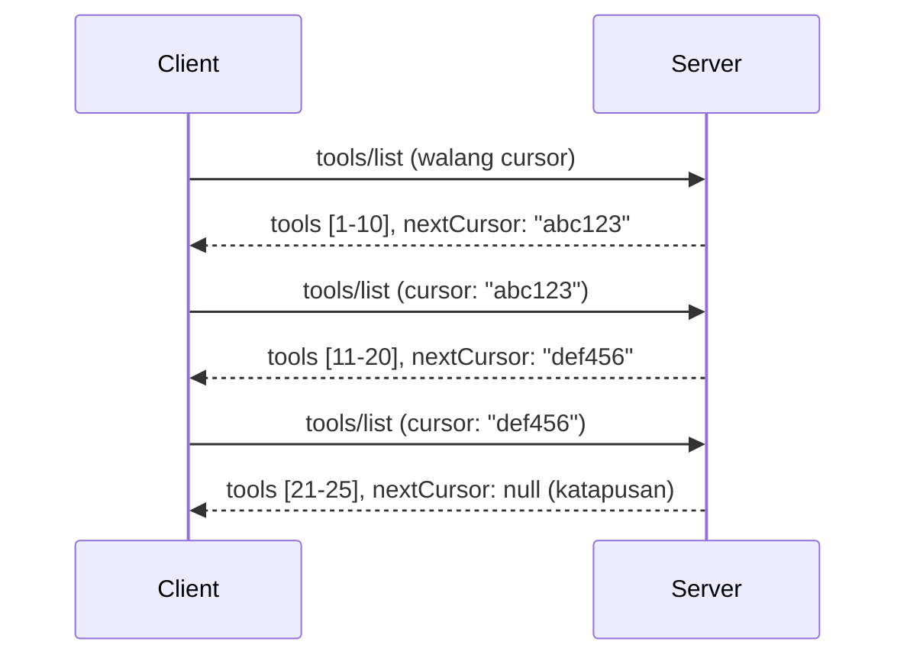

# Pagination at Malalaking Resulta ng Set sa MCP

Kapag ang iyong MCP server ay humahawak ng malalaking dataset - maging ito man ay paglista ng libu-libong file, tala ng database, o resulta ng paghahanap - kailangan mo ng pagination upang mahusay na pamahalaan ang memorya at magbigay ng mabilis na karanasan sa gumagamit. Saklaw ng gabay na ito kung paano ipatupad at gamitin ang pagination sa MCP.

## Bakit Mahalaga ang Pagination

Kung walang pagination, ang malalaking sagot ay maaaring magdulot ng:

- **Pagkaubos ng memorya** - Pag-load ng milyong tala nang sabay-sabay
- **Bagal ng tugon** - Naghihintay ang mga gumagamit habang niloload lahat ng data
- **Mga timeout error** - Lumalampas ang mga kahilingan sa mga limitasyon ng timeout
- **Mahinang performance ng AI** - Nahihirapan ang LLM sa napakalaking konteksto

Gumagamit ang MCP ng **cursor-based pagination** para sa maaasahan at pare-parehong pag-paging sa mga set ng resulta.

---

## Paano Gumagana ang Pagination sa MCP

### Ang Konsepto ng Cursor

Ang **cursor** ay isang hindi malinaw na string na nagmamarka ng iyong posisyon sa isang set ng resulta. Isipin ito bilang bookmark sa isang mahaba na aklat.



### Pagination sa Mga Paraan ng MCP

Sinusuportahan ng mga paraang MCP na ito ang pagination:

| Paraan | Ibinabalik | Suporta sa Cursor |
|--------|---------|----------------|
| `tools/list` | Mga depinisyon ng tool | ✅ |
| `resources/list` | Mga depinisyon ng resource | ✅ |
| `prompts/list` | Mga depinisyon ng prompt | ✅ |
| `resources/templates/list` | Mga template ng resource | ✅ |

---

## Implementasyon ng Server

### Python (FastMCP)

```python
from mcp.server import Server
from mcp.types import Tool, ListToolsResult
import math

app = Server("paginated-server")

# Pinakakalakal na malaking dataset
ALL_TOOLS = [
    Tool(name=f"tool_{i}", description=f"Tool number {i}", inputSchema={})
    for i in range(100)
]

PAGE_SIZE = 10

@app.list_tools()
async def list_tools(cursor: str | None = None) -> ListToolsResult:
    """List tools with pagination support."""
    
    # I-decode ang cursor para makuha ang panimulang index
    start_index = 0
    if cursor:
        try:
            start_index = int(cursor)
        except ValueError:
            start_index = 0
    
    # Kumuha ng pahina ng mga resulta
    end_index = min(start_index + PAGE_SIZE, len(ALL_TOOLS))
    page_tools = ALL_TOOLS[start_index:end_index]
    
    # Kalkulahin ang susunod na cursor
    next_cursor = None
    if end_index < len(ALL_TOOLS):
        next_cursor = str(end_index)
    
    return ListToolsResult(
        tools=page_tools,
        nextCursor=next_cursor
    )
```

### TypeScript

```typescript
import { Server } from "@modelcontextprotocol/sdk/server/index.js";
import { ListToolsResultSchema } from "@modelcontextprotocol/sdk/types.js";

const server = new Server({
  name: "paginated-server",
  version: "1.0.0"
});

// Ginawang halimbawa ng malaking dataset
const ALL_TOOLS = Array.from({ length: 100 }, (_, i) => ({
  name: `tool_${i}`,
  description: `Tool number ${i}`,
  inputSchema: { type: "object", properties: {} }
}));

const PAGE_SIZE = 10;

server.setRequestHandler(ListToolsResultSchema, async (request) => {
  // I-decode ang cursor
  let startIndex = 0;
  if (request.params?.cursor) {
    startIndex = parseInt(request.params.cursor, 10) || 0;
  }
  
  // Kunin ang pahina ng mga resulta
  const endIndex = Math.min(startIndex + PAGE_SIZE, ALL_TOOLS.length);
  const pageTools = ALL_TOOLS.slice(startIndex, endIndex);
  
  // Kalkulahin ang susunod na cursor
  const nextCursor = endIndex < ALL_TOOLS.length ? String(endIndex) : undefined;
  
  return {
    tools: pageTools,
    nextCursor
  };
});
```

### Java (Spring MCP)

```java
@Service
public class PaginatedToolService {
    
    private static final int PAGE_SIZE = 10;
    private final List<Tool> allTools;
    
    public PaginatedToolService() {
        // I-initialize ang malaking dataset
        this.allTools = IntStream.range(0, 100)
            .mapToObj(i -> new Tool("tool_" + i, "Tool number " + i, Map.of()))
            .collect(Collectors.toList());
    }
    
    @McpMethod("tools/list")
    public ListToolsResult listTools(@Param("cursor") String cursor) {
        // I-decode ang cursor
        int startIndex = 0;
        if (cursor != null && !cursor.isEmpty()) {
            try {
                startIndex = Integer.parseInt(cursor);
            } catch (NumberFormatException e) {
                startIndex = 0;
            }
        }
        
        // Kumuha ng pahina ng mga resulta
        int endIndex = Math.min(startIndex + PAGE_SIZE, allTools.size());
        List<Tool> pageTools = allTools.subList(startIndex, endIndex);
        
        // Kalkulahin ang susunod na cursor
        String nextCursor = endIndex < allTools.size() ? String.valueOf(endIndex) : null;
        
        return new ListToolsResult(pageTools, nextCursor);
    }
}
```

---

## Implementasyon ng Kliyente

### Python Client

```python
from mcp import ClientSession

async def get_all_tools(session: ClientSession) -> list:
    """Fetch all tools using pagination."""
    all_tools = []
    cursor = None
    
    while True:
        result = await session.list_tools(cursor=cursor)
        all_tools.extend(result.tools)
        
        if result.nextCursor is None:
            break
        cursor = result.nextCursor
    
    return all_tools

# Paggamit
async with client_session as session:
    tools = await get_all_tools(session)
    print(f"Found {len(tools)} tools")
```

### TypeScript Client

```typescript
import { Client } from "@modelcontextprotocol/sdk/client/index.js";

async function getAllTools(client: Client): Promise<Tool[]> {
  const allTools: Tool[] = [];
  let cursor: string | undefined = undefined;
  
  do {
    const result = await client.listTools({ cursor });
    allTools.push(...result.tools);
    cursor = result.nextCursor;
  } while (cursor);
  
  return allTools;
}

// Paggamit
const tools = await getAllTools(client);
console.log(`Found ${tools.length} tools`);
```

### Lazy Loading Pattern

Para sa napakalalaking dataset, i-load ang mga pahina ayon sa pangangailangan:

```python
class PaginatedToolIterator:
    """Lazily iterate through paginated tools."""
    
    def __init__(self, session: ClientSession):
        self.session = session
        self.cursor = None
        self.buffer = []
        self.exhausted = False
    
    async def __anext__(self):
        # Bumalik mula sa buffer kung available
        if self.buffer:
            return self.buffer.pop(0)
        
        # Suriin kung naubos na ang lahat ng pahina
        if self.exhausted:
            raise StopAsyncIteration
        
        # Kunin ang susunod na pahina
        result = await self.session.list_tools(cursor=self.cursor)
        self.buffer = list(result.tools)
        self.cursor = result.nextCursor
        
        if self.cursor is None:
            self.exhausted = True
        
        if not self.buffer:
            raise StopAsyncIteration
        
        return self.buffer.pop(0)
    
    def __aiter__(self):
        return self

# Paggamit - memory efficient para sa malalaking dataset
async for tool in PaginatedToolIterator(session):
    process_tool(tool)
```

---

## Pagination para sa Mga Resource

Madalas na kailangan ng pagination ang mga resource para sa mga direktoryo o malalaking dataset:

```python
from mcp.server import Server
from mcp.types import Resource, ListResourcesResult
import os

app = Server("file-server")

@app.list_resources()
async def list_resources(cursor: str | None = None) -> ListResourcesResult:
    """List files in directory with pagination."""
    
    directory = "/data/files"
    all_files = sorted(os.listdir(directory))
    
    # I-decode ang cursor (indeks ng file)
    start_index = int(cursor) if cursor else 0
    page_size = 20
    end_index = min(start_index + page_size, len(all_files))
    
    # Gumawa ng listahan ng mga mapagkukunan para sa pahinang ito
    resources = []
    for filename in all_files[start_index:end_index]:
        filepath = os.path.join(directory, filename)
        resources.append(Resource(
            uri=f"file://{filepath}",
            name=filename,
            mimeType="application/octet-stream"
        ))
    
    # Kalkulahin ang susunod na cursor
    next_cursor = str(end_index) if end_index < len(all_files) else None
    
    return ListResourcesResult(
        resources=resources,
        nextCursor=next_cursor
    )
```

---

## Mga Diskarte sa Disenyo ng Cursor

### Diskarte 1: Batay sa Index (Simple)

```python
# Ang cursor ay ang index lamang
cursor = "50"  # Magsimula sa item 50
```

**Mga Bentahe:** Simple, walang estado
**Mga Kakulangan:** Ang mga resulta ay maaaring magbago kung may idinadagdag o inaalis na mga item

### Diskarte 2: Batay sa ID (Matatag)

```python
# Ang cursor ay ang huling nakitang ID
cursor = "item_abc123"  # Magsimula pagkatapos ng item na ito
```

**Mga Bentahe:** Matatag kahit na may pagbabago sa mga item
**Mga Kakulangan:** Nangangailangan ng nakaayos na mga ID

### Diskarte 3: Encode na Estado (Komplikado)

```python
import base64
import json

def encode_cursor(state: dict) -> str:
    return base64.b64encode(json.dumps(state).encode()).decode()

def decode_cursor(cursor: str) -> dict:
    return json.loads(base64.b64decode(cursor).decode())

# Ang cursor ay naglalaman ng maraming mga patlang ng estado
cursor = encode_cursor({
    "offset": 50,
    "filter": "active",
    "sort": "name"
})
```

**Mga Bentahe:** Kayang i-encode ang komplikadong estado
**Mga Kakulangan:** Mas komplikado, mas malalaking string ng cursor

---

## Mga Pinakamahusay na Gawi

### 1. Piliin ang Angkop na Laki ng Pahina

```python
# Isaalang-alang ang laki ng datos
PAGE_SIZE_SMALL_ITEMS = 100   # Simpleng metadata
PAGE_SIZE_MEDIUM_ITEMS = 20   # Mas mayamang mga bagay
PAGE_SIZE_LARGE_ITEMS = 5     # Masalimuot na nilalaman
```

### 2. Maingat na Harapin ang Hindi Wastong Mga Cursor

```python
@app.list_tools()
async def list_tools(cursor: str | None = None) -> ListToolsResult:
    try:
        start_index = int(cursor) if cursor else 0
        if start_index < 0 or start_index >= len(ALL_TOOLS):
            start_index = 0  # I-reset sa simula
    except (ValueError, TypeError):
        start_index = 0  # Hindi wastong cursor, magsimula muli
    # ...
```

### 3. Isama ang Kabuuang Bilang (Opsyonal)

```python
return ListToolsResult(
    tools=page_tools,
    nextCursor=next_cursor,
    # Ang ilang mga pagpapatupad ay naglalaman ng kabuuan para sa progreso ng UI
    _meta={"total": len(ALL_TOOLS)}
)
```

### 4. Subukan ang Mga Edge Case

```python
async def test_pagination():
    # Walang laman na resulta
    result = await session.list_tools()
    assert result.tools == []
    assert result.nextCursor is None
    
    # Isang pahina
    result = await session.list_tools()
    assert len(result.tools) <= PAGE_SIZE
    
    # Hindi wastong cursor
    result = await session.list_tools(cursor="invalid")
    assert result.tools  # Dapat magbalik ng unang pahina
```

---

## Karaniwang Pagkaabala

### ❌ Pagbabalik ng Lahat ng Resulta Pagkatapos mag-Paginate sa Client Side

```python
# MASAMA: Ikinakarga ang lahat sa memorya
@app.list_tools()
async def list_tools() -> ListToolsResult:
    all_tools = load_all_tools()  # 1 milyong kasangkapan!
    return ListToolsResult(tools=all_tools)
```

### ✅ Mag-Paginate sa Pinagmulan ng Data

```python
# MABUTI: Nilo-load lang ang kinakailangan
@app.list_tools()
async def list_tools(cursor: str | None = None) -> ListToolsResult:
    offset = int(cursor) if cursor else 0
    tools = await db.query_tools(offset=offset, limit=PAGE_SIZE)
    return ListToolsResult(tools=tools, nextCursor=...)
```

---

## Ano ang Susunod

- [Module 5.14 - Context Engineering](../../05-AdvancedTopics/mcp-contextengineering/README.md)
- [Module 8 - Best Practices](../../08-BestPractices/README.md)
- [3.8 - Testing Your MCP Server](../../03-GettingStarted/08-testing/README.md)

---

## Karagdagang Mga Mapagkukunan

- [MCP Specification - Pagination](https://modelcontextprotocol.io/specification/2026-07-28/)
- [Cursor-Based Pagination Explained](https://slack.engineering/evolving-api-pagination-at-slack/)
- [Python SDK pagination tests](https://github.com/modelcontextprotocol/python-sdk/blob/main/tests/client/test_list_methods_cursor.py)

---

<!-- CO-OP TRANSLATOR DISCLAIMER START -->
**Pagtatanggi**:
Ang dokumentong ito ay isinalin gamit ang serbisyo ng AI translation na [Co-op Translator](https://github.com/Azure/co-op-translator). Bagama't nagsusumikap kami para sa katumpakan, pakatandaan na ang awtomatikong pagsasalin ay maaaring maglaman ng mga pagkakamali o hindi pagkakatugma. Ang orihinal na dokumento sa orihinal nitong wika ang dapat ituring na pangunahing sanggunian. Para sa mahahalagang impormasyon, inirerekomenda ang propesyonal na pagsasalin ng tao. Hindi kami mananagot sa anumang maling pagkakaintindi o maling interpretasyon na nagmula sa paggamit ng pagsasaling ito.
<!-- CO-OP TRANSLATOR DISCLAIMER END -->