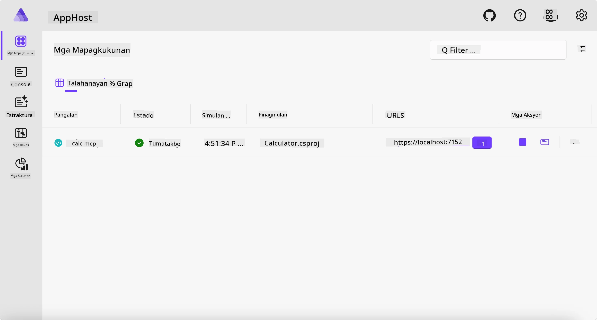
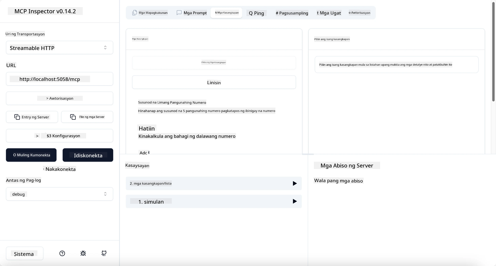
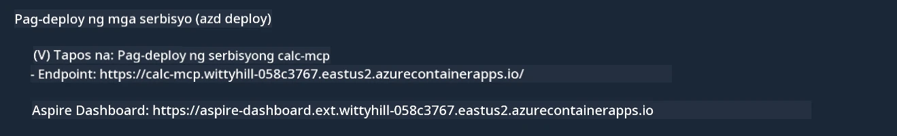

# Halimbawa

Ipinapakita ng nakaraang halimbawa kung paano gamitin ang lokal na .NET na proyekto gamit ang uri na `stdio`. At kung paano patakbuhin ang server nang lokal sa loob ng isang container. Ito ay isang magandang solusyon sa maraming sitwasyon. Gayunpaman, maaari ring maging kapaki-pakinabang na patakbuhin ang server nang malayo, tulad ng sa isang cloud environment. Dito pumapasok ang uri na `http`.

Tumingin sa solusyon sa folder na `04-PracticalImplementation`, maaaring mukhang mas komplikado ito kaysa sa naunang halimbawa. Pero sa totoo lang, hindi naman. Kung titignan mong mabuti ang proyekto sa `src/Calculator`, makikita mong karamihan ay pareho lang ang code sa naunang halimbawa. Ang nag-iisang pagkakaiba ay gumagamit tayo ng ibang library na `ModelContextProtocol.AspNetCore` para hawakan ang mga kahilingan sa HTTP. At binago natin ang method na `IsPrime` upang maging private, para ipakita lang na maaari kang magkaroon ng private methods sa iyong code. Ang natitirang bahagi ng code ay pareho lang tulad ng dati.

Ang iba pang mga proyekto ay mula sa [Aspire](https://aspire.dev/get-started/what-is-aspire/). Ang pagkakaroon ng Aspire sa solusyon ay magpapabuti ng karanasan ng developer habang nagde-develop at nagte-test pati na rin tumutulong sa observability. Hindi ito kinakailangan para patakbuhin ang server, ngunit magandang praktis na mayroon ito sa iyong solusyon.

## Simulan ang server nang lokal

1. Mula sa VS Code (gamit ang C# DevKit na extension), pumunta sa direktoryo na `04-PracticalImplementation/samples/csharp`.
1. Isagawa ang sumusunod na utos upang simulan ang server:

   ```bash
    dotnet watch run --project ./src/AppHost
   ```

1. Kapag nagbukas ang web browser ng Aspire dashboard, tandaan ang `http` na URL. Dapat ito ay ganito `http://localhost:5058/`.

   

## Subukan ang Streamable HTTP gamit ang MCP Inspector

Kung mayroon kang Node.js 22.7.5 pataas, maaari mong gamitin ang MCP Inspector upang subukan ang iyong server.

Simulan ang server at patakbuhin ang sumusunod na utos sa terminal:

```bash
npx @modelcontextprotocol/inspector http://localhost:5058
```



- Piliin ang `Streamable HTTP` bilang Uri ng Transport.
- Sa field na Url, ilagay ang URL ng server na naitala kanina, at idagdag ang `/mcp`. Dapat itong `http` (hindi `https`) na tulad ng `http://localhost:5058/mcp`.
- piliin ang Connect button.

Maganda sa Inspector na nagbibigay ito ng malinaw na visibility sa nangyayari.

- Subukang ilista ang mga magagamit na tool
- Subukan ang ilan sa mga ito, dapat gumana ito tulad ng dati.

## Subukan ang MCP Server gamit ang GitHub Copilot Chat sa VS Code

Upang gamitin ang Streamable HTTP transport kasama ang GitHub Copilot Chat, baguhin ang konfigurasyon ng `calc-mcp` server na nilikha dati upang ganito ang itsura:

```jsonc
// .vscode/mcp.json
{
  "servers": {
    "calc-mcp": {
      "type": "http",
      "url": "http://localhost:5058/mcp"
    }
  }
}
```

Gawin ang ilang mga pagsubok:

- Magtanong ng "3 prime numbers after 6780". Pansinin kung paano gagamitin ni Copilot ang mga bagong tool na `NextFivePrimeNumbers` at babalik lang ng unang 3 prime numbers.
- Magtanong ng "7 prime numbers after 111", upang makita kung ano ang mangyayari.
- Magtanong ng "John has 24 lollies and wants to distribute them all to his 3 kids. How many lollies does each kid have?", upang makita kung ano ang mangyayari.

## I-deploy ang server sa Azure

I-deploy natin ang server sa Azure para mas maraming tao ang makagamit nito.

Mula sa terminal, pumunta sa folder na `04-PracticalImplementation/samples/csharp` at patakbuhin ang sumusunod na utos:

```bash
azd up
```

Kapag natapos na ang deployment, dapat makita mo ang mensahe na ganito:



Kunin ang URL at gamitin ito sa MCP Inspector at sa GitHub Copilot Chat.

```jsonc
// .vscode/mcp.json
{
  "servers": {
    "calc-mcp": {
      "type": "http",
      "url": "https://calc-mcp.gentleriver-3977fbcf.australiaeast.azurecontainerapps.io/mcp"
    }
  }
}
```

## Ano ang susunod?

Sinubukan natin ang iba’t ibang uri ng transport at mga testing tools. Ipinadala rin natin ang iyong MCP server sa Azure. Pero paano kung kailangan ng server nating maka-access sa mga pribadong resources? Halimbawa, isang database o isang pribadong API? Sa susunod na kabanata, titingnan natin kung paano natin mapapabuti ang seguridad ng ating server.

---

<!-- CO-OP TRANSLATOR DISCLAIMER START -->
**Pagtatanggi**:
Ang dokumentong ito ay isinalin gamit ang serbisyo ng AI translation na [Co-op Translator](https://github.com/Azure/co-op-translator). Bagama't nagsusumikap kami para sa katumpakan, pakatandaan na ang awtomatikong pagsasalin ay maaaring maglaman ng mga pagkakamali o hindi pagkakatugma. Ang orihinal na dokumento sa orihinal nitong wika ang dapat ituring na pangunahing sanggunian. Para sa mahahalagang impormasyon, inirerekomenda ang propesyonal na pagsasalin ng tao. Hindi kami mananagot sa anumang maling pagkakaintindi o maling interpretasyon na nagmula sa paggamit ng pagsasaling ito.
<!-- CO-OP TRANSLATOR DISCLAIMER END -->