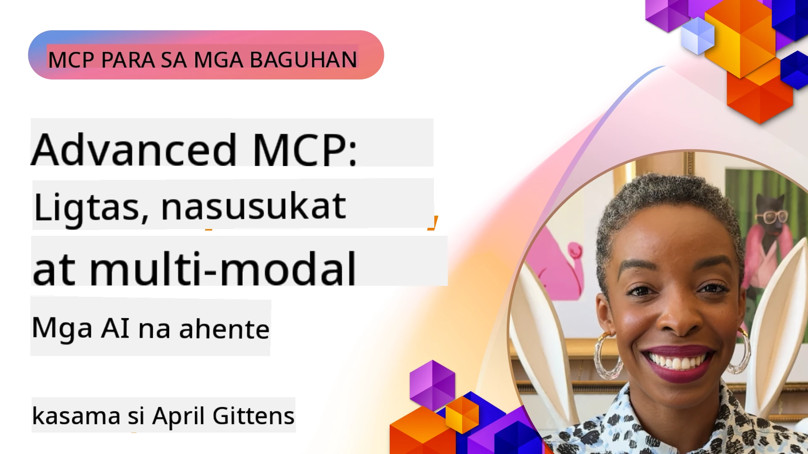

# Mga Pinalawak na Paksa sa MCP

_(I-click ang imahe sa itaas upang panoorin ang video ng araling ito)_

Sinasaklaw ng kabanatang ito ang isang serye ng mga pinalawak na paksa sa pagpapatupad ng Model Context Protocol (MCP), kabilang ang multi-modal na integrasyon, scalability, pinakamahusay na mga gawi sa seguridad, at integrasyon sa enterprise. Ang mga paksang ito ay mahalaga para sa pagbuo ng matatag at handa para sa produksyon na mga aplikasyon ng MCP na kayang tugunan ang mga pangangailangan ng mga makabagong sistema ng AI.

## Pangkalahatang-ideya

Tinutuklas ng araling ito ang mga pinalawak na konsepto sa pagpapatupad ng Model Context Protocol, na nakatuon sa multi-modal na integrasyon, scalability, pinakamahusay na mga gawi sa seguridad, at integrasyon sa enterprise. Ang mga paksang ito ay mahalaga para sa pagbuo ng mga aplikasyon ng MCP na pang-produksyon na kayang hawakan ang mga kumplikadong kinakailangan sa mga kapaligirang pang-enterprise.

> **Paalala sa kasalukuyang espesipikasyon:** Ang MCP `2026-07-28` ay nag-deprecate ng Roots at
> Sampling primitives na tinatalakay sa mga aralin 5.4 at 5.6. Inilipat din nito ang
> eksperimentong tampok na Tasks na tinukoy sa Protocol Features (5.16) sa isang
> dedikadong Tasks extension. Ang mga araling iyon ay pinananatili para sa legacy
> `2025-11-25` na mga implementasyon at kasama ang mga patnubay sa migrasyon. Tingnan ang
> [What’s Changed in MCP: The 2026-07-28 Specification](../01-CoreConcepts/mcp-2026-07-28.md).

## Mga Layunin sa Pagkatuto

Sa pagtatapos ng araling ito, magagawa mong:

- Magpatupad ng mga kakayahan sa multi-modal sa loob ng mga balangkas ng MCP
- Magdisenyo ng mga scalable na arkitektura ng MCP para sa mga senaryo na may mataas na pangangailangan
- Mag-apply ng pinakamahusay na mga gawi sa seguridad na naaayon sa mga prinsipyo ng seguridad ng MCP
- Isama ang MCP sa mga enterprise AI system at mga balangkas
- I-optimize ang pagganap at pagiging maaasahan sa mga kapaligiran ng produksyon

## Mga Aralin at Halimbawang Proyekto

| Link | Pamagat | Paglalarawan |
|------|-------|-------------|
| [5.1 Integration with Azure](./mcp-integration/README.md) | Integrasyon sa Azure | Matutunan kung paano isama ang iyong MCP Server sa Azure |
| [5.2 Multi modal sample](./mcp-multi-modality/README.md) | Mga halimbawa ng MCP Multi modal  | Mga halimbawa para sa audio, imahe at multi modal na tugon |
| [5.3 MCP OAuth2 sample](../../../05-AdvancedTopics/mcp-oauth2-demo) | MCP OAuth2 Demo | Minimal na Spring Boot app na nagpapakita ng OAuth2 gamit ang MCP, parehong bilang Authorization at Resource Server. Ipinapakita ang ligtas na pag-isyu ng token, mga protektadong endpoints, deployment sa Azure Container Apps, at integrasyon sa API Management. |
| [5.4 Root Contexts](./mcp-root-contexts/README.md) | Root contexts  | Matutunan ang legacy na `2025-11-25` Roots primitive at kasalukuyang mga opsyon sa migrasyon (deprecated sa `2026-07-28`) |
| [5.5 Routing](./mcp-routing/README.md) | Routing | Matutunan ang iba't ibang uri ng routing |
| [5.6 Sampling](./mcp-sampling/README.md) | Sampling | Matutunan ang legacy na `2025-11-25` Sampling primitive at kasalukuyang mga opsyon sa migrasyon (deprecated sa `2026-07-28`) |
| [5.7 Scaling](./mcp-scaling/README.md) | Scaling  | Matutunan ang tungkol sa scaling |
| [5.8 Security](./mcp-security/README.md) | Seguridad  | Siguraduhin ang iyong MCP Server |
| [5.9 Web Search sample](./web-search-mcp/README.md) | Web Search MCP | Python MCP server at kliyente na nagsasama gamit ang SerpAPI para sa real-time na paghahanap sa web, balita, produkto, at Q&A. Ipinapakita ang multi-tool orchestration, integrasyon ng panlabas na API, at matatag na paghawak ng error. |
| [5.10 Realtime Streaming](./mcp-realtimestreaming/README.md) | Streaming  | Ang real-time na data streaming ay naging mahalaga sa mundo ngayon na pinapagana ng datos, kung saan kailangan ng mga negosyo at aplikasyon ng agarang access sa impormasyon upang makagawa ng napapanahong mga desisyon.|
| [5.11 Realtime Web Search](./mcp-realtimesearch/README.md) | Web Search | Kung paano binabago ng MCP ang real-time na paghahanap sa web sa pamamagitan ng pagbibigay ng standardized na paraan sa pamamahala ng konteksto sa mga AI model, search engine, at aplikasyon.| 
| [5.12  Entra ID Authentication for Model Context Protocol Servers](./mcp-security-entra/README.md) | Entra ID Authentication | Nagbibigay ang Microsoft Entra ID ng matibay na cloud-based na identity at access management solution, na tumutulong upang matiyak na tanging mga awtorisadong gumagamit at aplikasyon lamang ang maaaring makipag-ugnayan sa iyong MCP server.|
| [5.13 Microsoft Foundry Agent Integration](./mcp-foundry-agent-integration/README.md) | Microsoft Foundry Integration | Matutunan kung paano isama ang mga Model Context Protocol server sa mga ahente ng Microsoft Foundry, na nagpapagana ng makapangyarihang orkestrasyon ng tool at enterprise AI na mga kakayahan gamit ang standardized na mga koneksyon ng panlabas na pinagkukunan ng data.|
| [5.14 Context Engineering](./mcp-contextengineering/README.md) | Context Engineering | Ang hinaharap na oportunidad ng mga teknik sa context engineering para sa mga MCP server, kabilang ang pagpapa-optimize ng konteksto, dynamic na pamamahala ng konteksto, at mga estratehiya para sa epektibong prompt engineering sa loob ng mga balangkas ng MCP.|
| [5.15 MCP Custom Transport](./mcp-transport/README.md) | Custom Transport | Matutunan kung paano ipatupad ang mga custom na mekanismo sa transport para sa mga espesyal na senaryo ng komunikasyon sa MCP.|
| [5.16 Protocol Features Deep Dive](./mcp-protocol-features/README.md) | Protocol Features | Pag-master sa mga pinalawak na tampok ng protocol kabilang ang progress notifications, pagkansela ng request, mga template ng resource, at mga pattern sa paghawak ng error.|
| [5.17 Adversarial Multi-Agent Reasoning](./mcp-adversarial-agents/README.md) | Adversarial Agents | Gumamit ng dalawang ahente na may magkasalungat na posisyon, na naghahati sa isang MCP tool set, upang mahuli ang mga hallucination, ipakita ang mga edge case, at makagawa ng mas maayos na output sa pamamagitan ng istrukturadong debate.|

> **Paalala sa kasaysayan `2025-11-25`:** ipinakilala ng rebisyong iyon ang eksperimentong
> Tasks at pinalawak ang ilang mga tampok ng protocol. Noong `2026-07-28`, inilipat ang Tasks sa
> isang opisyal na extension at ang Roots ay naging deprecated. Huwag gamitin ang
> kalagayan ng tampok na `2025-11-25` bilang kasalukuyang gabay; tingnan ang
> [2026-07-28 changelog](https://modelcontextprotocol.io/specification/2026-07-28/changelog).

## Karagdagang Sanggunian

Para sa pinakabagong impormasyon tungkol sa mga pinalawak na paksa sa MCP, tumukoy sa:
- [MCP Documentation](https://modelcontextprotocol.io/)
- [MCP Specification (2026-07-28)](https://modelcontextprotocol.io/specification/2026-07-28/)
- [GitHub Repository](https://github.com/modelcontextprotocol)
- [OWASP MCP Top 10](https://microsoft.github.io/mcp-azure-security-guide/mcp/) - Mga panganib sa seguridad at mga paraan ng mitigasyon
- [MCP Security Summit Workshop (Sherpa)](https://azure-samples.github.io/sherpa/) - Hands-on na pagsasanay sa seguridad

## Mga Pangunahing Kaisipan

- Pinapalawak ng mga implementasyon ng multi-modal MCP ang mga kakayahan ng AI lampas sa pagproseso ng teksto
- Ang scalability ay mahalaga para sa deployment sa enterprise at maaaring tugunan sa pamamagitan ng horizontal at vertical scaling
- Pinoprotektahan ng komprehensibong mga hakbang sa seguridad ang datos at tinitiyak ang tamang kontrol ng access
- Pinapalakas ng integrasyon sa enterprise gamit ang mga platform tulad ng Azure OpenAI at Microsoft AI Foundry ang mga kakayahan ng MCP
- Nakikinabang ang mga advanced na implementasyon ng MCP mula sa mga optimized na arkitektura at maingat na pamamahala ng mga yaman

## Ehersisyo

Magdisenyo ng isang enterprise-grade MCP implementation para sa isang partikular na kaso ng paggamit:

1. Tukuyin ang mga pangangailangan sa multi-modal para sa iyong kaso ng paggamit
2. Ilahad ang mga kontrol sa seguridad na kailangan upang protektahan ang sensitibong datos
3. Disenyo ng scalable na arkitektura na maaaring humawak ng iba't ibang load
4. Magplano ng mga punto ng integrasyon sa mga enterprise AI system
5. Idokumento ang mga potensyal na bottleneck sa pagganap at mga estratehiya sa mitigasyon

## Karagdagang mga Mapagkukunan

- [Azure OpenAI Documentation](https://learn.microsoft.com/en-us/azure/ai-services/openai/)
- [Microsoft AI Foundry Documentation](https://learn.microsoft.com/en-us/ai-services/)

---

## Ano ang susunod

Tuklasin ang mga aralin sa module na ito simula sa: [5.1 MCP Integration](./mcp-integration/README.md)

Kapag natapos mo na ang module na ito, magpatuloy sa: [Module 6: Community Contributions](../06-CommunityContributions/README.md)

---

<!-- CO-OP TRANSLATOR DISCLAIMER START -->
**Pagtatanggi**:
Ang dokumentong ito ay isinalin gamit ang serbisyo ng AI translation na [Co-op Translator](https://github.com/Azure/co-op-translator). Bagama't nagsusumikap kami para sa katumpakan, pakatandaan na ang awtomatikong pagsasalin ay maaaring maglaman ng mga pagkakamali o hindi pagkakatugma. Ang orihinal na dokumento sa orihinal nitong wika ang dapat ituring na pangunahing sanggunian. Para sa mahahalagang impormasyon, inirerekomenda ang propesyonal na pagsasalin ng tao. Hindi kami mananagot sa anumang maling pagkakaintindi o maling interpretasyon na nagmula sa paggamit ng pagsasaling ito.
<!-- CO-OP TRANSLATOR DISCLAIMER END -->