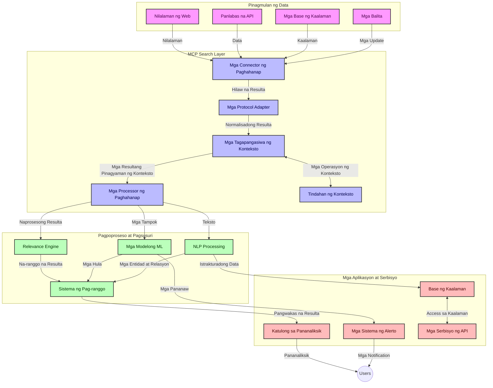
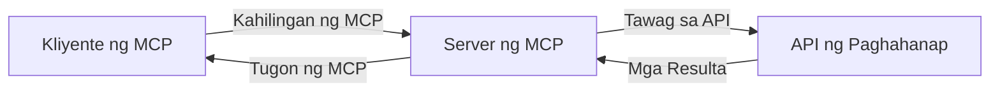
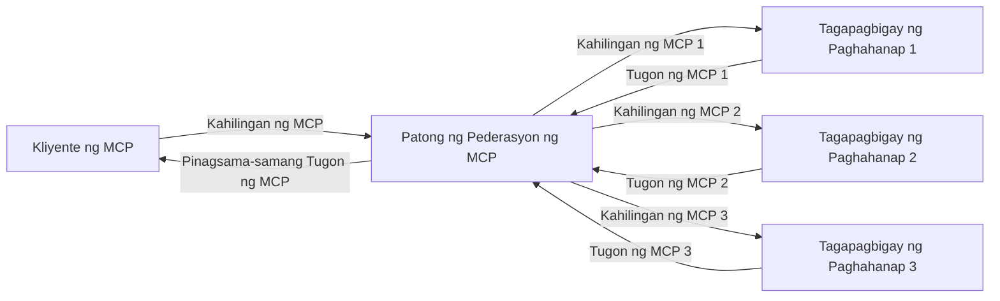
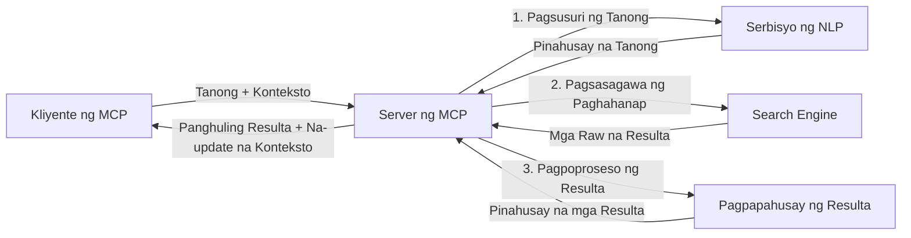

# Protocol ng Konteksto ng Modelo para sa Real-Time na Paghahanap sa Web

## Pangkalahatang-ideya

Ang real-time na paghahanap sa web ay naging mahalaga sa kasalukuyang kapaligirang pinapatakbo ng impormasyon, kung saan ang mga aplikasyon ay nangangailangan ng agarang access sa pinakabagong impormasyon sa buong internet upang makapagbigay ng may kaugnayan at napapanahong mga tugon. Ang Model Context Protocol (MCP) ay kumakatawan sa isang makabuluhang pagsulong sa pag-optimize ng mga prosesong ito ng real-time na paghahanap, pinapahusay ang kahusayan ng paghahanap, pinananatili ang integridad ng konteksto, at pinapabuti ang pangkalahatang pagganap ng sistema.

Tinutuklas ng module na ito kung paano binabago ng MCP ang real-time na paghahanap sa web sa pamamagitan ng pagbibigay ng isang standardisadong pamamaraan para sa pamamahala ng konteksto sa mga AI na modelo, mga search engine, at mga aplikasyon.

### Ano ang Iyong Matututunan

Sa komprehensibong gabay na ito, matutuklasan mo:

- Paano lumilikha ang MCP ng walang patid na tulay sa pagitan ng mga AI na modelo at kakayahan sa real-time na paghahanap sa web
- Mga disenyo ng arkitektura para sa pagpapatupad ng epektibo at scalable na mga solusyon sa paghahanap gamit ang MCP
- Mga teknik para mapanatili ang konteksto ng paghahanap sa maraming mga query at interaksyon
- Praktikal na mga implementasyon ng code sa Python at JavaScript para sa iba't ibang mga senaryo ng paghahanap
- Mga pamamaraan upang balansehin ang kaugnayan, pagiging bago, at pagganap sa mga sistemang naghahanap na pinapatakbo ng MCP

## Panimula sa Real-Time na Paghahanap sa Web

Ang real-time na paghahanap sa web ay isang teknolohikal na pamamaraan na nagpapahintulot sa tuloy-tuloy na pag-query, pagproseso, at pagsusuri ng impormasyon sa web habang ito ay inilalathala o ina-update, nagpapahintulot sa mga sistema na magbigay ng sariwa at may kaugnayang impormasyon na may minimal na latency. Hindi tulad ng mga tradisyunal na sistema ng paghahanap na gumagana sa indexed na data na maaaring ilang oras o araw na ang tanda, ang real-time na paghahanap ay proseso ng live na datos mula sa web, na naghahatid ng pananaw at impormasyon na sumasalamin sa kasalukuyang estado ng nilalaman online.

### Pangunahing Konsepto ng Real-Time na Paghahanap sa Web:

- **Tuloy-tuloy na Pagproseso ng Query**: Pinoproseso ang mga query sa paghahanap laban sa mga patuloy na ina-update na pinagkukunan ng data
- **Prayoridad sa Bagong Impormasyon**: Dinisenyo ang mga sistema upang bigyan ng prayoridad ang sariwang impormasyon
- **Balanse ng Kaugnayan**: Pinananatili ang balanse sa pagitan ng kaugnayan at pagiging bago
- **Scalable na Arkitektura**: Kailangang kayanin ng mga sistema ang pabago-bagong dami ng query at data
- **Pag-unawa sa Konteksto**: Mahalagang mapanatili ang konteksto ng user sa iba't ibang mga pagkakataon ng paghahanap para sa makahulugang resulta
- **Dynamic na Pagbabago ng Query**: Adaptive na binabago ang mga query base sa konteksto at mga nakaraang resulta
- **Pagsasama ng Maramihang Pinagmulan**: Pinagsasama ang mga resulta mula sa iba't ibang search provider at mga pinanggalingang web
- **Semantikong Pag-unawa**: Pinoproseso ang mga query at nilalaman batay sa kahulugan kaysa sa mga salitang susi lamang
- **Real-Time na Pagraranggo**: Patuloy na inaayos ang pagraranggo ng mga resulta habang may bagong impormasyon

### Ang Model Context Protocol at Real-Time na Paghahanap sa Web

Pinagtutugunan ng Model Context Protocol (MCP) ang ilang mahahalagang hamon sa mga kapaligiran ng real-time na paghahanap sa web:

1. **Pagpapanatili ng Konteksto ng Paghahanap**: Ipinastandard ng MCP kung paano pinananatili ang konteksto sa mga distributed na bahagi ng paghahanap, na tinitiyak na ang mga AI na modelo at mga processing node ay may access sa may kaugnayang kasaysayan ng query at mga kagustuhan ng user.

2. **Epektibong Pamamahala ng Query**: Sa pamamagitan ng pagbibigay ng nakaayos na mga mekanismo para sa transmisyon ng konteksto, binabawasan ng MCP ang overhead ng paulit-ulit na pagsasama ng konteksto sa bawat pagkakataon ng paghahanap.

3. **Interoperability**: Lumilikha ang MCP ng isang karaniwang wika para sa pagbabahagi ng konteksto sa pagitan ng iba't ibang teknolohiya sa paghahanap at AI na mga modelo, na nagpapahintulot ng mas flexible at extensible na mga arkitektura.

4. **Search-Optimized Context**: Maaaring bigyang prayoridad ng mga implementasyon ng MCP kung aling mga elemento ng konteksto ang pinaka-kaugnay para sa epektibong paghahanap, na nag-ooptimize para sa parehong pagganap at katumpakan.

5. **Adaptive na Pagproseso ng Paghahanap**: Sa tamang pamamahala ng konteksto gamit ang MCP, maaaring dynamically na ayusin ng mga sistema ng paghahanap ang pagproseso ayon sa nagbabagong mga pangangailangan ng user at mga tanawin ng impormasyon.

Sa mga modernong aplikasyon mula sa news aggregation hanggang sa research assistants, ang pagsasama ng MCP sa mga teknolohiya ng paghahanap sa web ay nagpapahintulot sa mas intelihente, konteksto-may kamalayang paghahanap na maaaring magbigay ng patuloy na mas may kaugnayang mga resulta habang nagpapatuloy ang mga interaksyon ng user.

## Mga Layunin sa Pagkatuto

Sa pagtatapos ng araling ito, magagawa mong:

- Maunawaan ang mga pundamental ng real-time na paghahanap sa web at ang mga hamon nito sa mga modernong aplikasyon
- Ipaliwanag kung paano pinapahusay ng Model Context Protocol (MCP) ang mga kakayahan sa real-time na paghahanap sa web
- Magpatupad ng mga solusyon sa paghahanap na batay sa MCP gamit ang mga popular na framework at API
- Magdisenyo at mag-deploy ng scalable, mataas ang pagganap na arkitektura sa paghahanap gamit ang MCP
- Ilapat ang mga konsepto ng MCP sa iba't ibang kaso ng paggamit kabilang ang semantic search, research assistance, at AI-augmented browsing
- Suriin ang mga umuusbong na trend at mga hinaharap na inobasyon sa mga teknolohiyang naghahanap na batay sa MCP
- Bumuo ng mga konteksto-mayamayan na mga sistema sa paghahanap na natututo mula sa mga interaksyon ng user
- Isama ang mga kakayahan sa paghahanap sa web sa mga AI assistant gamit ang standardisadong mga protocol ng MCP
- Lumikha ng mga multi-stage na search pipeline na unti-unting pinapalinis ang mga resulta batay sa konteksto
- I-optimize ang pagganap ng paghahanap habang pinapanatili ang komprehensibong kamalayan sa konteksto

### Kahulugan at Kahalagahan

Ang real-time na paghahanap sa web ay kinapapalooban ng tuloy-tuloy na pag-query, retrieval, at paghahatid ng impormasyon mula sa web na may minimal na pagkaantala. Hindi tulad ng tradisyunal na mga search engine na pana-panahong nag-crawl at nag-iindex ng web, nilalayon ng real-time na paghahanap na lumabas agad ang impormasyon sa oras na maging available ito, na nagpapahintulot ng agarang access sa pinaka-kasalukuyang nilalaman.

Mga pangunahing katangian ng real-time na paghahanap sa web ay kinabibilangan ng:

- **Kabaguhan**: Binibigyang-priyoridad ang pinakabagong nilalaman at mga update
- **Tuloy-tuloy na Pagproseso**: Patuloy na nagmo-monitor ng bagong impormasyon
- **Pagbabago ng Query**: Pinapahusay ang mga query sa paghahanap base sa konteksto at feedback
- **Agarang Paghahatid**: Nagbibigay ng mga resulta ng paghahanap nang may minimal na delay
- **Pagpapanatili ng Konteksto**: Nagtatayo sa mga naunang query para sa pinahusay na kaugnayan

### Mga Hamon sa Tradisyunal na Paghahanap sa Web

Ang mga tradisyunal na pamamaraan sa paghahanap sa web ay may ilang mga limitasyon kapag inilapat sa mga real-time na senaryo:

1. **Fragsmentasyon ng Konteksto**: Hirap mapanatili ang konteksto ng paghahanap sa maraming mga query
2. **Kabaguhan ng Impormasyon**: Mga hamon sa pag-access at pagbibigay priyoridad sa pinaka-bagong impormasyon
3. **Kompleksidad sa Integrasyon**: Mga problema sa interoperability sa pagitan ng mga sistema ng paghahanap at mga aplikasyon
4. **Mga Isyu sa Latency**: Pagtimbang sa komprehensibong paghahanap at mga kinakailangan sa oras ng tugon
5. **Pagtatakda ng Kaugnayan**: Pagtiyak ng katumpakan at kaugnayan habang binibigyang-priyoridad ang pagiging bago

## Pag-unawa sa Model Context Protocol (MCP) para sa Paghahanap

### Ano ang MCP sa Mga Konteksto ng Paghahanap?

Ang Model Context Protocol (MCP) ay isang standardisadong komunikasyon na protocol na idinisenyo upang mapadali ang epektibong pakikipag-ugnayan sa pagitan ng mga AI na modelo at mga aplikasyon. Sa konteksto ng real-time na paghahanap sa web, nagbibigay ang MCP ng balangkas para sa:

- Pagpapanatili ng konteksto ng paghahanap sa kabuuan ng mga sunud-sunod na query
- Standardisasyon ng mga format ng query at resulta ng paghahanap
- Optimisasyon sa transmisyon ng mga parameter ng paghahanap at mga resulta
- Pagpapahusay ng komunikasyon mula modelo-patungong search engine

### Pangunahing Mga Sangkap at Arkitektura

Binubuo ang arkitektura ng MCP para sa real-time na paghahanap sa web ng ilang mga pangunahing sangkap:

1. **Mga Handler ng Konteksto ng Query**: Namamahala at nagpapanatili ng konteksto ng paghahanap sa maraming query
2. **Mga Processor ng Paghahanap**: Pinoproseso ang mga papasok na request sa paghahanap gamit ang mga teknik na may kamalayan sa konteksto
3. **Mga Protocol Adapter**: Nagko-convert sa pagitan ng iba't ibang mga API ng paghahanap habang pinananatili ang konteksto
4. **Imbakan ng Konteksto**: Epektibong nag-iimbak at kumukuha ng kasaysayan ng paghahanap at mga kagustuhan
5. **Mga Connector sa Paghahanap**: Kumokonekta sa iba't ibang search engine at web API



### Paano Pinapabuti ng MCP ang Real-Time na Paghahanap sa Web

Tinatalakay ng MCP ang mga hamon sa tradisyunal na paghahanap sa web sa pamamagitan ng:

- **Pagpapatuloy ng Konteksto**: Pinananatili ang mga ugnayan sa pagitan ng mga query sa buong session ng paghahanap
- **Optimisadong Transmisyon**: Binabawasan ang sobra-sobrang parameter ng paghahanap sa pamamagitan ng matalinong pamamahala ng konteksto
- **Standardisadong Interface**: Nagbibigay ng magkakaparehong mga API para sa mga bahagi ng paghahanap
- **Pinababang Latency**: Pinapaliit ang overhead sa pagproseso gamit ang epektibong pamamahala ng konteksto
- **Pinalakas na Kaugnayan**: Pinapahusay ang kaugnayan ng paghahanap sa pamamagitan ng pagpapanatili ng intensyon ng user sa maraming mga query


## Integrasyon at Implementasyon

Ang mga real-time na sistema ng paghahanap sa web ay nangangailangan ng maingat na disenyo ng arkitektura at implementasyon upang mapanatili ang parehong pagganap at kontekstwal na integridad. Ang Model Context Protocol ay nag-aalok ng isang standardisadong pamamaraan para sa integrasyon ng mga AI model at teknolohiya sa paghahanap, na nagpapahintulot para sa mas sopistikadong, may kamalayang konteksto na mga pipeline ng paghahanap.

### Pangkalahatang-ideya ng Integrasyon ng MCP sa mga Arkitektura ng Paghahanap

Ang pagpapatupad ng MCP sa mga real-time na kapaligiran ng paghahanap sa web ay may kasamang ilang mahahalagang konsiderasyon:

1. **Search Context Serialization**: Nagbibigay ang MCP ng mga epektibong mekanismo para sa pag-encode ng kontekstwal na impormasyon sa loob ng mga kahilingan sa paghahanap, na tinitiyak na ang mahalagang konteksto ay sinusundan ang query sa buong processing pipeline. Kasama rito ang mga standardized na format ng serialization na na-optimize para sa metadata na may kaugnayan sa paghahanap.

2. **Stateful Search Processing**: Pinapagana ng MCP ang mas intelihenteng stateful na pagproseso sa pamamagitan ng pagpapanatili ng konsistent na representasyon ng konteksto sa iba't ibang mga pag-uulit ng paghahanap. Ito ay partikular na mahalaga sa multi-stage na mga pipeline ng paghahanap kung saan pinapahusay ng pagrefine ng konteksto ang mga resulta.

3. **Query Expansion and Refinement**: Ang mga implementasyon ng MCP sa mga sistema ng paghahanap ay maaaring magpadali ng sopistikadong pagpapalawak at pagrefine ng query base sa naipon na konteksto, na nagpapahintulot para sa mas kaugnay na mga resulta habang umuusad ang session ng paghahanap.

4. **Result Caching and Prioritization**: Sa pamamagitan ng standardisasyon sa paghawak ng konteksto, tinutulungan ng MCP ang pamamahala ng caching at pag-priyoridad ng mga resulta, na nagpapahintulot sa mga bahagi na umangkop base sa nagbabagong konteksto ng paghahanap.

5. **Search Federation and Aggregation**: Pinapadali ng MCP ang mas sopistikadong federasyon ng paghahanap sa maraming backend sa pamamagitan ng pagbibigay ng nakabalangkas na representasyon ng konteksto ng paghahanap, na nagpapahintulot sa mas makahulugang pagsasama-sama ng mga resulta mula sa iba't ibang mga pinagmulan.

Ang pagpapatupad ng MCP sa iba't ibang teknolohiya ng paghahanap ay lumilikha ng isang pinag-isang pamamaraan sa pamamahala ng konteksto, na nagpapababa ng pangangailangan para sa pasadyang code ng integrasyon habang pinapahusay ang kakayahan ng sistema na mapanatili ang makahulugang konteksto habang umuunlad ang mga query sa paghahanap.

### MCP sa Iba't Ibang Implementasyon ng Paghahanap sa Web

Sinusunod ng mga halimbawang ito ang kasalukuyang espesipikasyon ng MCP na nakatuon sa isang JSON-RPC na nakabatay na protocol na may kani-kaniyang mga mekanismo ng transportasyon. Ipinapakita ng code kung paano ka makaka-implementa ng customized na mga integrasyon ng paghahanap habang pinapanatili ang buong pagiging compatible sa protocol ng MCP.


<details>
<summary>Python Implementation gamit ang Generic Search API</summary>

```python
import asyncio
import json
import aiohttp
from typing import Dict, Any, Optional, List
from contextlib import asynccontextmanager
from collections.abc import AsyncIterator

# Mag-import ng mga karaniwang MCP na librarya
from mcp.client.session import ClientSession
from mcp.client.streamable_http import streamablehttp_client
from mcp.types import TextContent, CreateMessageRequestParams, CreateMessageResult
from mcp.server.fastmcp import FastMCP

# Gumawa ng FastMCP server para sa paghahanap sa web
search_server = FastMCP("WebSearch")

# Klase para humawak ng mga operasyon sa paghahanap sa web
class WebSearchHandler:
    def __init__(self, api_endpoint: str, api_key: str):
        self.api_endpoint = api_endpoint
        self.api_key = api_key
        self.session = None
        
    async def initialize(self):
        """Initialize the HTTP session"""
        self.session = aiohttp.ClientSession(
            headers={"Authorization": f"Bearer {self.api_key}"}
        )
    
    async def close(self):
        """Close the HTTP session"""
        if self.session:
            await self.session.close()
            
    async def perform_search(self, query: str, max_results: int = 5, 
                           include_domains: List[str] = None, 
                           exclude_domains: List[str] = None,
                           time_period: str = "any") -> Dict[str, Any]:
        """Perform web search using the search API"""
        # Bumuo ng mga parameter ng paghahanap
        search_params = {
            "q": query,
            "limit": max_results,
            "time": time_period
        }
        
        if include_domains:
            search_params["site"] = ",".join(include_domains)
            
        if exclude_domains:
            search_params["exclude_site"] = ",".join(exclude_domains)
        
        # Isagawa ang kahilingan sa paghahanap
        try:
            async with self.session.get(
                self.api_endpoint,
                params=search_params
            ) as response:
                if response.status != 200:
                    error_text = await response.text()
                    raise Exception(f"Search API error: {response.status} - {error_text}")
                
                search_data = await response.json()
                
                # I-transform ang API-specific na tugon sa isang karaniwang format
                results = []
                for item in search_data.get("results", []):
                    results.append({
                        "title": item.get("title", ""),
                        "url": item.get("url", ""),
                        "snippet": item.get("snippet", ""),
                        "date": item.get("published_date", ""),
                        "source": item.get("source", "")
                    })
                
                return {
                    "query": query,
                    "totalResults": len(results),
                    "results": results
                }
        except Exception as e:
            print(f"Search API request error: {e}")
            raise

# I-initialize ang tagapamahala ng paghahanap
search_handler = WebSearchHandler(
    api_endpoint="https://api.search-service.example/search",
    api_key="your-api-key-here"
)

# I-setup ang lifespan para pamahalaan ang tagapamahala ng paghahanap
@asyncio.asynccontextmanager
async def app_lifespan(server: FastMCP):
    """Manage application lifecycle"""
    await search_handler.initialize()
    try:
        yield {"search_handler": search_handler}
    finally:
        await search_handler.close()

# Itakda ang lifespan para sa server
search_server = FastMCP("WebSearch", lifespan=app_lifespan)

# Irehistro ang isang kasangkapan sa paghahanap sa web
@search_server.tool()
async def web_search(query: str, max_results: int = 5, 
                   include_domains: List[str] = None,
                   exclude_domains: List[str] = None,
                   time_period: str = "any") -> Dict[str, Any]:
    """
    Search the web for information
    
    Args:
        query: The search query
        max_results: Maximum number of results to return (default: 5)
        include_domains: List of domains to include in search results
        exclude_domains: List of domains to exclude from search results
        time_period: Time period for results ("day", "week", "month", "any")
        
    Returns:
        Dictionary containing search results
    """
    ctx = search_server.get_context()
    search_handler = ctx.request_context.lifespan_context["search_handler"]
    
    results = await search_handler.perform_search(
        query=query,
        max_results=max_results,
        include_domains=include_domains,
        exclude_domains=exclude_domains,
        time_period=time_period
    )
    
    return results

# Halimbawa ng paggamit ng kliyente
async def client_example():
    # Kumonekta sa search server gamit ang Streamable HTTP transport
    async with streamablehttp_client("http://localhost:8000/mcp") as (read, write, _):
        async with ClientSession(read, write) as session:
            # I-initialize ang koneksyon
            await session.initialize()
            
            # Tawagin ang web_search na kasangkapan
            search_results = await session.call_tool(
                "web_search", 
                {
                    "query": "latest developments in AI and Model Context Protocol",
                    "max_results": 5,
                    "time_period": "day",
                    "include_domains": ["github.com", "microsoft.com"]
                }
            )
            
            print(f"Search results: {search_results}")

# Halimbawa ng pagpapatakbo ng server
if __name__ == "__main__":
    # Patakbuhin ang server gamit ang Streamable HTTP transport
    search_server.run(transport="streamable-http")
```
</details> 

<details>
<summary>JavaScript Implementation gamit ang Browser-Based Search</summary>


```javascript
// Implementasyon ng MCP server para sa paghahanap sa web
import { McpServer, ResourceTemplate } from '@modelcontextprotocol/sdk/server/mcp.js';
import { StreamableHTTPServerTransport } from '@modelcontextprotocol/sdk/server/streamableHttp.js';
import { z } from 'zod';

// Lumikha ng MCP server para sa paghahanap sa web
const searchServer = new McpServer({
    name: "BrowserSearch",
    description: "A server that provides web search capabilities"
});

// Klase ng serbisyo ng paghahanap
class SearchService {
    constructor(searchApiUrl, apiKey) {
        this.searchApiUrl = searchApiUrl;
        this.apiKey = apiKey;
    }

    async performSearch(parameters) {
        const {
            query = '',
            maxResults = 5,
            includeDomains = [],
            excludeDomains = [],
            timePeriod = 'any'
        } = parameters;
        
        // Bumuo ng URL ng paghahanap gamit ang mga parametro
        const url = new URL(this.searchApiUrl);
        url.searchParams.append('q', query);
        url.searchParams.append('limit', maxResults);
        url.searchParams.append('time', timePeriod);
        
        if (includeDomains.length > 0) {
            url.searchParams.append('site', includeDomains.join(','));
        }
        
        if (excludeDomains.length > 0) {
            url.searchParams.append('exclude_site', excludeDomains.join(','));
        }
        
        try {
            const response = await fetch(url.toString(), {
                method: 'GET',
                headers: {
                    'Authorization': `Bearer ${this.apiKey}`,
                    'Content-Type': 'application/json'
                }
            });
            
            if (!response.ok) {
                const errorText = await response.text();
                throw new Error(`Search API error: ${response.status} - ${errorText}`);
            }
            
            const searchData = await response.json();
            
            // I-transform ang sagot na partikular sa API sa isang standard na format
            const results = searchData.results?.map(item => ({
                title: item.title || '',
                url: item.url || '',
                snippet: item.snippet || '',
                date: item.published_date || '',
                source: item.source || ''
            })) || [];
            
            return {
                query,
                totalResults: results.length,
                results
            };
        } catch (error) {
            console.error('Search API request error:', error);
            throw error;
        }
    }
}

// I-initialize ang serbisyo ng paghahanap
const searchService = new SearchService(
    'https://api.search-service.example/search',
    'your-api-key-here'
);

// I-setup ang tagapagbigay ng konteksto para sa server
searchServer.setContextProvider(() => {
    return {
        searchService
    };
});

// Irehistro ang tool sa paghahanap sa web
searchServer.tool({
    name: 'web_search',
    description: 'Search the web for information',
    parameters: {
        type: 'object',
        properties: {
            query: {
                type: 'string',
                description: 'The search query'
            },
            maxResults: {
                type: 'integer',
                description: 'Maximum number of results to return',
                default: 5
            },
            includeDomains: {
                type: 'array',
                items: { type: 'string' },
                description: 'List of domains to include in search results'
            },
            excludeDomains: {
                type: 'array',
                items: { type: 'string' },
                description: 'List of domains to exclude from search results'
            },
            timePeriod: {
                type: 'string',
                description: 'Time period for results',
                enum: ['day', 'week', 'month', 'any'],
                default: 'any'
            }
        },
        required: ['query']
    },
    handler: async (params, context) => {
        const { searchService } = context;
        return await searchService.performSearch(params);
    }
});

// Halimbawa ng kliyenteng code para kumonekta sa search server
import { Client } from '@modelcontextprotocol/sdk/client/index.js';
import { StreamableHTTPClientTransport } from '@modelcontextprotocol/sdk/client/streamableHttp.js';

async function connectToSearchServer() {
    // Kumonekta sa search server
    const transport = new StreamableHTTPClientTransport(
        new URL('http://localhost:8000/mcp')
    );
    
    const client = new Client({
        name: 'search-client',
        version: '1.0.0'
    });
    
    await client.connect(transport);
    
    // Isagawa ang tool sa paghahanap
    const searchResults = await client.callTool({
        name: 'web_search',
        arguments: {
            query: 'Model Context Protocol implementation examples',
            maxResults: 10,
            timePeriod: 'week',
            includeDomains: ['github.com', 'docs.microsoft.com']
        }
    });
    
    console.log('Search results:', searchResults);
    
    // Linisin
    await client.disconnect();
}

// Simulan ang server
const transport = new StreamableHTTPServerTransport();
await searchServer.connect(transport);
console.log('Search server running at http://localhost:8000/mcp');

// Sa hiwalay na proseso o pagkatapos masimulan ang server
// connectToSearchServer().catch(console.error);
```
</details> 


## Paunawa sa Mga Halimbawa ng Code

> **Mahalagang Tala**: Ipinapakita ng mga halimbawang code sa ibaba ang integrasyon ng Model Context Protocol (MCP) sa functionality ng paghahanap sa web. Bagama't sinusunod nila ang mga pattern at estruktura ng opisyal na MCP SDKs, pinasimple ang mga ito para sa layuning pang-edukasyon.
> 
> Ipinapakita ng mga halimbawang ito:
> 
> 1. **Python Implementation**: Isang FastMCP na implementasyon ng server na nagbibigay ng web search tool at nakakonekta sa isang external na search API. Ipinapakita ng halimbawang ito ang wastong pamamahala ng lifespan, paghawak ng konteksto, at implementasyon ng tool na sumusunod sa mga pattern ng [opisyal na MCP Python SDK](https://github.com/modelcontextprotocol/python-sdk). Ginagamit ng server ang inirerekomendang Streamable HTTP transport na pumalit sa mas luma na SSE transport para sa production deployments.
> 
> 2. **JavaScript Implementation**: Isang TypeScript/JavaScript na implementasyon gamit ang FastMCP pattern mula sa [opisyal na MCP TypeScript SDK](https://github.com/modelcontextprotocol/typescript-sdk) upang lumikha ng search server na may tamang mga depinisyon ng tool at mga koneksyon ng kliyente. Sinusunod nito ang pinakabagong inirerekomendang mga pattern para sa pamamahala ng session at pagpapanatili ng konteksto.
> 
> Ang mga halimbawang ito ay mangangailangan pa ng karagdagang paghawak sa error, authentication, at espesipikong code ng integrasyon ng API para sa paggamit sa production. Ang mga search API endpoint na ipinakita (`https://api.search-service.example/search`) ay mga placeholder at kailangang palitan ng aktwal na mga endpoint ng search service.
> 
> Para sa kumpletong detalye ng implementasyon at ang pinakabagong mga pamamaraan, pakitingnan ang [opisyal na espesipikasyon ng MCP](https://spec.modelcontextprotocol.io/) at dokumentasyon ng SDK.

## Pangunahing Mga Konsepto

### Balangkas ng Model Context Protocol (MCP)

Sa kanyang pundasyon, ang Model Context Protocol ay nagbibigay ng isang standardisadong paraan para sa mga AI model, aplikasyon, at serbisyo upang magpalitan ng konteksto. Sa real-time na paghahanap sa web, mahalaga ang balangkas na ito para sa paglikha ng magkakaugnay, multi-turn na karanasan sa paghahanap. Kasama sa mga pangunahing bahagi:

1. **Client-Server Architecture**: Nagpapatatag ng malinaw na paghihiwalay sa pagitan ng mga kliyente ng paghahanap (mga humihiling) at mga server ng paghahanap (mga nagbibigay), na nagpapahintulot ng flexible na mga modelo ng deployment.

2. **JSON-RPC Communication**: Ginagamit ng protocol ang JSON-RPC para sa pagpapalitan ng mensahe, na ginagawa itong compatible sa mga teknolohiya sa web at madaling ipatupad sa iba't ibang platform.

3. **Context Management**: Itinakda ng MCP ang mga nakabalangkas na pamamaraan para sa pagpapanatili, pag-update, at paggamit ng konteksto ng paghahanap sa iba't ibang pakikipag-ugnayan.

4. **Tool Definitions**: Ang mga kakayahan sa paghahanap ay inilalantad bilang mga standardisadong tool na may malinaw na mga parameter at mga halaga ng balik.

5. **Streaming Support**: Sinusuportahan ng protocol ang streaming ng mga resulta, na mahalaga sa real-time na paghahanap kung saan maaaring dumarating nang paunti-unti ang mga resulta.

### Mga Pattern ng Integrasyon sa Paghahanap sa Web

Kapag ini-integrate ang MCP sa paghahanap sa web, lumilitaw ang ilang mga pattern:

#### 1. Direct Search Provider Integration



Sa pattern na ito, direktang nakikipag-interface ang MCP server sa isa o higit pang mga search API, isinasalin ang mga kahilingan ng MCP sa mga tawag na specific sa API at ini-format ang mga resulta bilang mga tugon ng MCP.

#### 2. Federated Search with Context Preservation



Ang pattern na ito ay naghahati ng mga query sa paghahanap sa maraming MCP-compatible na mga search provider, bawat isa ay maaaring may espesyalidad sa iba't ibang uri ng nilalaman o kakayahan sa paghahanap, habang pinapanatili ang isang pinag-isang konteksto.

#### 3. Context-Enhanced Search Chain



Sa pattern na ito, ang proseso ng paghahanap ay nahahati sa maraming yugto, kung saan ang konteksto ay pinayayaman sa bawat hakbang, na nagreresulta sa unti-unting mas kaugnay na mga resulta.

### Mga Sangkap ng Konteksto sa Paghahanap

Sa MCP-based na paghahanap sa web, karaniwan nang kasama sa konteksto ang:

- **Kasaysayan ng Query**: Mga naunang query sa paghahanap sa session
- **Mga Preferensya ng User**: Wika, rehiyon, mga setting ng safe search
- **Kasaysayan ng Pakikipag-ugnayan**: Aling mga resulta ang na-click, oras na ginugol sa mga resulta
- **Mga Parameter ng Paghahanap**: Mga filter, mga ayos ng sort, at iba pang mga modifier ng paghahanap
- **Kaalaman sa Domain**: Kontekstong may kaugnayan sa paksa na mahalaga sa paghahanap
- **Temporal na Konteksto**: Mga salik ng kahalagahan batay sa oras
- **Mga Preferensya sa Pinagmulan**: Mga pinagkakatiwalaang o mas gustong pinanggagalingan ng impormasyon

## Mga Gamit at Aplikasyon

### Pananaliksik at Pangangalap ng Impormasyon

Pinapalakas ng MCP ang mga daloy ng pananaliksik sa pamamagitan ng:

- Pagpapanatili ng konteksto ng pananaliksik sa buong mga session ng paghahanap
- Pagpapahintulot ng mas sopistikado at kontekstwal na may kaugnayang mga query
- Pagsuporta sa multi-source na federasyon ng paghahanap
- Pagpapadali ng pagkuha ng kaalaman mula sa mga resulta ng paghahanap

### Real-Time na Pagmamanman ng Balita at Mga Uso

Nagbibigay ang paghahanap na pinapagana ng MCP ng mga bentahe para sa pagmamanman ng balita:

- Halos real-time na pagtuklas ng mga lumalabas na mga kuwento ng balita
- Kontekstwal na pagsala ng kaugnay na impormasyon
- Pagsubaybay ng paksa at entity sa maraming mga pinagmulan
- Mga personalisadong alerto sa balita base sa konteksto ng user

### AI-Augmented Browsing at Pananaliksik

Lumilikha ang MCP ng mga bagong posibilidad para sa AI-augmented na pagba-browse:

- Mga kontekstwal na rekomendasyon sa paghahanap base sa kasalukuyang aktibidad sa browser
- Seamless na integrasyon ng paghahanap sa web sa LLM-powered na mga assistant
- Multi-turn na pagrefine ng paghahanap na may pinananatiling konteksto
- Pinahusay na fact-checking at beripikasyon ng impormasyon

## Mga Hinaharap na Uso at Inobasyon

### Ebolusyon ng MCP sa Paghahanap sa Web

Sa pagtitig sa hinaharap, inaasahan naming uunlad ang MCP upang tugunan ang:


- **Multimodal na Paghahanap**: Pagsasama ng paghahanap ng teksto, larawan, audio, at video na may napanatiliang konteksto
- **Desentralisadong Paghahanap**: Pagsuporta sa mga distributed at federated na ecosystem ng paghahanap
- **Privacy sa Paghahanap**: Mga mekanismo ng privacy-preserving na may kamalayan sa konteksto
- **Pag-unawa sa Query**: Malalim na semantic parsing ng natural na wika ng mga query sa paghahanap

### Mga Potensyal na Pag-unlad sa Teknolohiya

Mga umuusbong na teknolohiya na huhubog sa hinaharap ng MCP search:

1. **Neural Search Architectures**: Mga naka-embed na sistema ng paghahanap na na-optimize para sa MCP
2. **Personalized Search Context**: Pag-aaral ng mga indibidwal na pattern ng paghahanap ng gumagamit sa paglipas ng panahon
3. **Knowledge Graph Integration**: Paghahanap na may konteksto na pinahusay ng domain-specific knowledge graphs
4. **Cross-Modal Context**: Pagpapanatili ng konteksto sa iba't ibang mga modality ng paghahanap

## Mga Hands-On na Pagsasanay

### Pagsasanay 1: Pagse-setup ng Basic MCP Search Pipeline

Sa pagsasanay na ito, matututunan mo kung paano:
- I-configure ang isang basic na paligid sa MCP search
- Mag-implement ng mga context handler para sa web search
- Subukan at i-validate ang pagpapanatili ng konteksto sa iba't ibang pag-uulit ng paghahanap

### Pagsasanay 2: Paggawa ng Research Assistant gamit ang MCP Search

Gumawa ng kompletong aplikasyon na:
- Nagpoproseso ng mga tanong sa pananaliksik sa natural na wika
- Nagsasagawa ng context-aware na web searches
- Nagsisintesis ng impormasyon mula sa iba't ibang mga pinagmulan
- Nagpapakita ng organisadong mga natuklasan sa pananaliksik

### Pagsasanay 3: Pagpapatupad ng Multi-Source Search Federation gamit ang MCP

Advanced na pagsasanay na sumasaklaw sa:
- Context-aware na query dispatching sa maraming search engine
- Pag-ranggo at pag-aggregate ng mga resulta
- Contextual na deduplication ng mga resulta ng paghahanap
- Paghawak ng metadata na tukoy sa pinagmulan

## Karagdagang Mga Mapagkukunan

- [Model Context Protocol Specification](https://spec.modelcontextprotocol.io/) - Opisyal na MCP specification at detalyadong dokumentasyon ng protocol
- [Model Context Protocol Documentation](https://modelcontextprotocol.io/) - Detalyadong mga tutorial at gabay sa pagpapatupad
- [MCP Python SDK](https://github.com/modelcontextprotocol/python-sdk) - Opisyal na Python na implementasyon ng MCP protocol
- [MCP TypeScript SDK](https://github.com/modelcontextprotocol/typescript-sdk) - Opisyal na TypeScript na implementasyon ng MCP protocol
- [MCP Reference Servers](https://github.com/modelcontextprotocol/servers) - Mga reference implementation ng MCP servers
- [Bing Web Search API Documentation](https://learn.microsoft.com/en-us/bing/search-apis/bing-web-search/overview) - Microsoft's web search API
- [Google Custom Search JSON API](https://developers.google.com/custom-search/v1/overview) - Programmable search engine ng Google
- [SerpAPI Documentation](https://serpapi.com/search-api) - Search engine results page API
- [Meilisearch Documentation](https://www.meilisearch.com/docs) - Open-source na search engine
- [Elasticsearch Documentation](https://www.elastic.co/guide/index.html) - Distributed na search at analytics engine
- [LangChain Documentation](https://python.langchain.com/docs/get_started/introduction) - Paggawa ng mga aplikasyon gamit ang LLMs

## Mga Resulta ng Pagkatuto

Sa pagtatapos ng modyul na ito, magagawa mo na:

- Maunawaan ang mga pundasyon ng real-time na paghahanap sa web at ang mga hamon nito
- Ipakita kung paano pinapalakas ng Model Context Protocol (MCP) ang mga kakayahan ng real-time na web search
- Magpatupad ng mga solusyon sa paghahanap na nakabase sa MCP gamit ang mga popular na framework at API
- Magdisenyo at mag-deploy ng scalable, mataas na performance na search architectures gamit ang MCP
- Ilapat ang mga konsepto ng MCP sa iba't ibang gamit kabilang ang semantic search, research assistance, at AI-augmented browsing
- Suriin ang mga umuusbong na trend at mga inobasyon sa hinaharap sa teknolohiya ng paghahanap na nakabase sa MCP


### Mga Pagsasaalang-alang sa Tiwala at Kaligtasan

Kapag nagpapatupad ng mga solusyon sa web search na nakabase sa MCP, tandaan ang mga mahahalagang prinsipyo mula sa MCP specification:

1. **Pahintulot at Kontrol ng Gumagamit**: Dapat malinaw na pumayag at maunawaan ng mga gumagamit ang lahat ng access sa data at mga operasyon. Ito ay lalong mahalaga para sa mga implementasyon ng web search na maaaring gumamit ng mga panlabas na pinagmulan ng data.

2. **Privacy ng Data**: Siguraduhin ang tamang paghawak sa mga query at resulta ng paghahanap, lalo na kapag maaaring may sensitibong impormasyon. Magpatupad ng angkop na kontrol sa access para protektahan ang data ng gumagamit.

3. **Kaligtasan ng Tool**: Magpatupad ng wastong authorization at validation para sa mga search tool, dahil posibleng magdulot ito ng panganib sa seguridad sa pamamagitan ng arbitrary code execution. Ang mga paglalarawan ng asal ng tool ay hindi dapat pagkatiwalaan maliban kung nakuha mula sa isang pinagkakatiwalaang server.

4. **Malinaw na Dokumentasyon**: Magbigay ng malinaw na dokumentasyon tungkol sa mga kakayahan, limitasyon, at mga pagsasaalang-alang sa seguridad ng iyong implementasyon ng paghahanap na nakabase sa MCP, alinsunod sa mga gabay sa pagpapatupad mula sa MCP specification.

5. **Matibay na Daloy ng Pahintulot**: Gumawa ng matibay na daloy ng pahintulot at awtorisasyon na malinaw na ipinaliwanag kung ano ang ginagawa ng bawat tool bago payagan ang paggamit nito, lalo na para sa mga tool na nakikipag-ugnayan sa mga panlabas na web resources.

Para sa kumpletong detalye tungkol sa MCP seguridad at mga pagsasaalang-alang sa tiwala, sumangguni sa [opisyal na dokumentasyon](https://modelcontextprotocol.io/specification/2025-11-25/basic/security_best_practices).

## Ano ang susunod

- [5.12 Entra ID Authentication para sa Model Context Protocol Servers](../mcp-security-entra/README.md)

---

<!-- CO-OP TRANSLATOR DISCLAIMER START -->
**Pagtatanggi**:
Ang dokumentong ito ay isinalin gamit ang serbisyo ng AI translation na [Co-op Translator](https://github.com/Azure/co-op-translator). Bagama't nagsusumikap kami para sa katumpakan, pakatandaan na ang awtomatikong pagsasalin ay maaaring maglaman ng mga pagkakamali o hindi pagkakatugma. Ang orihinal na dokumento sa orihinal nitong wika ang dapat ituring na pangunahing sanggunian. Para sa mahahalagang impormasyon, inirerekomenda ang propesyonal na pagsasalin ng tao. Hindi kami mananagot sa anumang maling pagkakaintindi o maling interpretasyon na nagmula sa paggamit ng pagsasaling ito.
<!-- CO-OP TRANSLATOR DISCLAIMER END -->