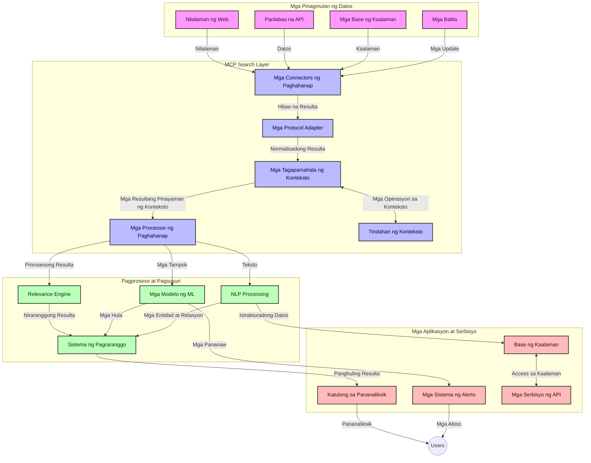
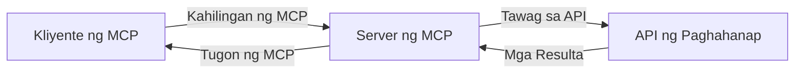
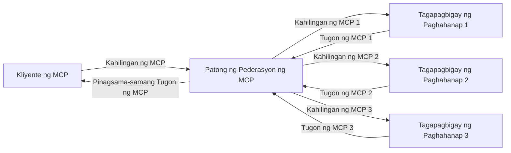
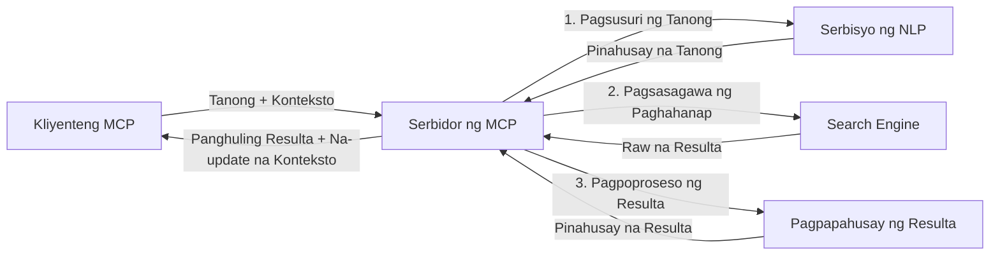

# Model Context Protocol para sa Real-Time na Pagsusuri sa Web

## Pangkalahatang-ideya

Ang real-time na pagsusuri sa web ay naging mahalaga sa makabagong kapaligiran na puno ng impormasyon, kung saan ang mga aplikasyon ay nangangailangan ng agarang akses sa napapanahong impormasyon mula sa internet upang magbigay ng kaugnay at napapanahong mga tugon. Ang Model Context Protocol (MCP) ay kumakatawan sa isang mahalagang pag-usbong sa pag-optimize ng mga prosesong ito ng real-time na pagsusuri, pinapahusay ang kahusayan ng paghahanap, pinananatili ang integridad ng konteksto, at pinapabuti ang pangkalahatang pagganap ng sistema.

Tinutuklas ng modyul na ito kung paano binabago ng MCP ang real-time na pagsusuri sa web sa pamamagitan ng pagbibigay ng isang standardisadong pamamaraan para sa pamamahala ng konteksto sa mga AI modelo, mga search engine, at mga aplikasyon.

### Ano ang Matututunan Mo

Sa komprehensibong gabay na ito, matutuklasan mo:

- Paano nililikha ng MCP ang tulay na walang putol sa pagitan ng AI na mga modelo at mga kakayahan sa real-time na paghahanap sa web
- Mga arkitektural na pattern para sa pagpapatupad ng epektibo at scalable na mga solusyon sa paghahanap gamit ang MCP
- Mga pamamaraan sa pagpapanatili ng konteksto ng paghahanap sa maraming tanong at interaksyon
- Mga praktikal na implementasyon ng code sa Python at JavaScript para sa iba't ibang mga senaryo ng paghahanap
- Mga paraan upang balansehin ang kaugnayan, kasariwaan, at pagganap sa mga sistemang paghahanap na pinapagana ng MCP

## Panimula sa Real-Time na Pagsusuri sa Web

Ang real-time na pagsusuri sa web ay isang teknolohikal na pamamaraan na nagpapahintulot ng tuloy-tuloy na pagtatanong, pagproseso, at pagsusuri ng impormasyon mula sa web habang ito ay inilalathala o ina-update, na nagbibigay-daan sa mga sistema na magbigay ng sariwa at kaugnay na impormasyon nang may napakaliit na pagkaantala. Hindi tulad ng tradisyunal na mga sistema ng paghahanap na nagtatrabaho sa indexed na datos na maaaring ilang oras o araw ang tanda, ang real-time na paghahanap ay sumusuri ng direktang datos mula sa web, naghahatid ng mga pananaw at impormasyon na sumasalamin sa kasalukuyang estado ng nilalaman online.

### Pangunahing Konsepto ng Real-Time na Pagsusuri sa Web:

- **Tuloy-tuloy na Pagproseso ng Query**: Ang mga query sa paghahanap ay pinoproseso laban sa datos na palaging ina-update
- **Pagbibigay-priyoridad sa Kasariwaan**: Idinisenyo ang mga sistema upang unahin ang mga sariwang impormasyon
- **Pagbabalanse ng Kaugnayan**: Pinananatili ang balanse sa pagitan ng kaugnayan at kasariwaan
- **Scalable na Arkitektura**: Dapat kayanin ng mga sistema ang pabago-bagong dami ng query at datos
- **Pag-unawa sa Konteksto**: Mahalaga ang pagpapanatili ng konteksto ng gumagamit sa maraming pag-ulit ng paghahanap para sa makahulugang mga resulta
- **Dynamic na Pagrebisa ng Query**: Adaptive na pagbabago ng mga query batay sa konteksto at mga nakaraang resulta
- **Integrasyon ng Maramihang Pinagmumulan**: Pinagsasama ang mga resulta mula sa iba’t ibang mga proveedor ng paghahanap at mga pinagkukunan ng web
- **Semantic na Pag-unawa**: Proseso ng mga query at nilalaman batay sa kahulugan, hindi lamang mga keyword
- **Real-Time na Pag-ranggo**: Patuloy na inaayos ang ranggo ng mga resulta habang may mga bagong impormasyong lumalabas

### Ang Model Context Protocol at Real-Time na Pagsusuri sa Web

Tinatalakay ng Model Context Protocol (MCP) ang ilang mga kritikal na hamon sa mga kapaligiran ng real-time na pagsusuri sa web:

1. **Pagpapanatili ng Konteksto ng Paghahanap**: Sinusukat ng MCP kung paano pinananatili ang konteksto sa buong mga ipinamahaging bahagi ng paghahanap, tiniyak na may akses ang mga AI modelo at mga processing node sa kaugnay na kasaysayan ng query at mga kagustuhan ng gumagamit.

2. **Epektibong Pamamahala ng Query**: Sa pamamagitan ng pagbibigay ng nakaayos na mga mekanismo para sa transmisyon ng konteksto, binabawasan ng MCP ang overhead ng paulit-ulit na pag-uulit ng konteksto sa bawat pag-ulit ng paghahanap.

3. **Interoperability**: Lumilikha ang MCP ng isang karaniwang wika para sa pagbabahagi ng konteksto sa pagitan ng iba’t ibang teknolohiya ng paghahanap at AI na mga modelo, na naglalaman ng mas flexible at extensible na mga arkitektura.

4. **Kontekstong Pinahusay para sa Paghahanap**: Maaaring unahin ng mga implementasyon ng MCP kung aling mga elemento ng konteksto ang pinakakaugnay para sa epektibong paghahanap, na nag-o-optimize para sa parehong pagganap at katumpakan.

5. **Adaptibong Pagproseso ng Paghahanap**: Sa wastong pamamahala ng konteksto gamit ang MCP, maaaring dinamikal na baguhin ng mga sistema ng paghahanap ang pagproseso batay sa nagbabagong pangangailangan ng gumagamit at kalakaran ng impormasyon.

Sa mga makabagong aplikasyon na mula sa pagtipon ng balita hanggang sa mga research assistant, ang integrasyon ng MCP sa mga teknolohiya ng web search ay nagpapahintulot ng mas intelligenteng, may kamalayang konteksto na paghahanap na makakapagbigay ng patuloy na mas kaugnay na mga resulta habang nagpapatuloy ang mga interaksyon ng gumagamit.

## Mga Layunin sa Pagkatuto

Sa pagtatapos ng araling ito, magagawa mong:

- Maunawaan ang mga pundasyon ng real-time na pagsusuri sa web at ang mga hamon nito sa mga makabagong aplikasyon
- Ipaliwanag kung paano pinapalakas ng Model Context Protocol (MCP) ang mga kakayahan ng real-time na pagsusuri sa web
- Magpatupad ng mga solusyon sa paghahanap batay sa MCP gamit ang mga popular na framework at API
- Magdisenyo at mag-deploy ng scalable, mataas ang pagganap na mga arkitektura ng paghahanap gamit ang MCP
- Ilapat ang mga konsepto ng MCP sa iba't ibang paggamit kabilang ang semantic na paghahanap, pagtulong sa pananaliksik, at AI-augmented browsing
- Suriin ang mga umuusbong na trend at mga hinaharap na inobasyon sa teknolohiya ng paghahanap na batay sa MCP
- Bumuo ng mga konteksto-na may kamalayang mga sistema ng paghahanap na natututo mula sa mga interaksyon ng gumagamit
- Isama ang mga kakayahan ng web search sa mga AI assistant gamit ang standardisadong mga protocol ng MCP
- Lumikha ng mga multi-stage na pipeline ng paghahanap na unti-unting pinapabuti ang mga resulta batay sa konteksto
- I-optimize ang pagganap ng paghahanap habang pinananatili ang komprehensibong kamalayan sa konteksto

### Depinisyon at Kahalagahan

Ang real-time na pagsusuri sa web ay kinabibilangan ng tuloy-tuloy na pagtatanong, pagkuha, at paghahatid ng impormasyon sa web na may napakaliit na pagkaantala. Hindi tulad ng mga tradisyunal na search engine na pana-panahong nagc-crawl at nag-iindex ng web, layunin ng real-time na paghahanap na ipakita ang impormasyon habang ito ay nagiging available, na nagbibigay-daan sa agarang akses sa pinakabagong nilalaman.

Pangunahing mga katangian ng real-time na pagsusuri sa web ay kinabibilangan ng:

- **Kabaguhan**: Pagbibigay-priyoridad sa mga bagong nilalaman at update
- **Tuloy-tuloy na Pagproseso**: Palaging pagmamanman para sa mga bagong impormasyon
- **Pag-aangkop ng Query**: Pagpapino ng mga query sa paghahanap batay sa konteksto at feedback
- **Agarang Paghahatid**: Pagbibigay ng mga resulta ng paghahanap na may napakaliit na delay
- **Pagpapanatili ng Konteksto**: Pagtatayo sa mga naunang query para sa mas pinahusay na kaugnayan

### Mga Hamon sa Tradisyunal na Web Search

Nakakaranas ang mga tradisyunal na pamamaraan ng web search ng ilang mga limitasyon kapag inilapat sa mga senaryo ng real-time:

1. **Pagkakahiwalay ng Konteksto**: Hirap sa pagpapanatili ng konteksto ng paghahanap sa maraming query
2. **Kabaguhan ng Impormasyon**: Mga hamon sa pag-access at pagbibigay-priyoridad sa pinakabagong impormasyon
3. **Kompleksidad ng Integrasyon**: Mga problema sa interoperability sa pagitan ng mga sistema ng paghahanap at aplikasyon
4. **Mga Isyu sa Latency**: Pagbabalanse sa komprehensibong paghahanap at mga kinakailangan sa oras ng pagtugon
5. **Pag-tune ng Kaugnayan**: Pagtitiyak ng katumpakan at kaugnayan habang inuuna ang kasariwaan

## Pag-unawa sa Model Context Protocol (MCP) para sa Paghahanap

### Ano ang MCP sa mga Konteksto ng Paghahanap?

Ang Model Context Protocol (MCP) ay isang standardisadong protocol sa komunikasyon na idinisenyo upang mapadali ang epektibong interaksyon sa pagitan ng mga AI na modelo at aplikasyon. Sa konteksto ng real-time na web search, nagbibigay ang MCP ng balangkas para sa:

- Pagpapanatili ng konteksto ng paghahanap sa buong sunod-sunod ng mga query
- Pagstandardisa ng mga format ng query ng paghahanap at mga resulta
- Pag-optimize ng transmisyon ng mga parameter ng paghahanap at mga resulta
- Pagpapahusay ng komunikasyon mula modelo-sa-search engine

### Pangunahing mga Komponent at Arkitektura

Binubuo ang arkitektura ng MCP para sa real-time na pagsusuri sa web ng ilang mahahalagang bahagi:

1. **Mga Tagapamahala ng Konteksto ng Query**: Namamahala at nagpapanatili ng konteksto ng paghahanap sa maraming query
2. **Mga Search Processor**: Pinoproseso ang mga papasok na kahilingan sa paghahanap gamit ang mga teknik na may kamalayan sa konteksto
3. **Mga Protocol Adapter**: Nagko-convert sa pagitan ng iba't ibang API ng paghahanap habang pinapanatili ang konteksto
4. **Imbakan ng Konteksto**: Mahusay na nag-iimbak at kumukuha ng kasaysayan ng paghahanap at mga kagustuhan
5. **Mga Connector ng Paghahanap**: Kumokonekta sa iba't ibang mga search engine at web API



### Paano Pinapahusay ng MCP ang Real-Time na Pagsusuri sa Web

Tinutugunan ng MCP ang mga hamon ng tradisyunal na web search sa pamamagitan ng:

- **Pagpapatuloy ng Konteksto**: Pinananatili ang mga ugnayan sa pagitan ng mga query sa buong session ng paghahanap
- **Na-optimize na Transmisyon**: Binabawasan ang dobleng parameter ng paghahanap gamit ang matalinong pamamahala ng konteksto
- **Standardisadong Interface**: Nagbibigay ng consistent na API para sa mga bahagi ng paghahanap
- **Pagbawas ng Latency**: Pinapaliit ang overhead ng pagproseso sa pamamagitan ng epektibong pamamahala ng konteksto
- **Pinahusay na Kaugnayan**: Pinapabuti ang kaugnayan ng paghahanap sa pamamagitan ng pagpapanatili ng intensyon ng gumagamit sa maraming query

## Integrasyon at Implementasyon

Nangangailangan ang mga sistema ng real-time na pagsusuri sa web ng maingat na disenyo ng arkitektura at implementasyon upang mapanatili ang parehong pagganap at integridad ng konteksto. Nag-aalok ang Model Context Protocol ng standardisadong paraan para sa integrasyon ng mga AI modelo at teknolohiya ng paghahanap, na nagpapahintulot ng mas sopistikadong, konteksto-na may kamalayang mga pipeline ng paghahanap.

### Pangkalahatang-ideya ng Integrasyon ng MCP sa mga Arkitektura ng Paghahanap

Ang pagpapatupad ng MCP sa mga kapaligiran ng real-time na paghahanap sa web ay may ilang mahahalagang konsiderasyon:

1. **Serialization ng Konteksto ng Paghahanap**: Nagbibigay ang MCP ng epektibong mga mekanismo para sa pag-encode ng impormasyon ng konteksto sa loob ng mga kahilingan ng paghahanap, tiniyak na ang mahalagang konteksto ay sumusunod sa query sa buong pipeline ng pagproseso. Kabilang dito ang mga standard na format ng serialization na na-optimize para sa metadata na kaugnay ng paghahanap.

2. **Stateful na Pagproseso ng Paghahanap**: Pinapagana ng MCP ang mas matalinong stateful na pagproseso sa pamamagitan ng pagpapanatili ng pare-parehong representasyon ng konteksto sa buong mga pag-ulit ng paghahanap. Ito ay partikular na mahalaga sa mga multi-stage na pipeline ng paghahanap kung saan pinapabuti ng pag-refine ng konteksto ang mga resulta.

3. **Pagpapalawak at Pagpapino ng Query**: Maaaring pahintulutan ng mga implementasyon ng MCP sa mga sistema ng paghahanap ang mas sopistikadong pagpapalawak at pagpapino ng query batay sa naipon na konteksto, na nagpapahintulot ng unti-unting mas kaugnay na mga resulta habang nagpapatuloy ang session ng paghahanap.

4. **Caching at Pagbibigay-Prioridad sa Resulta**: Sa pamamagitan ng pag-standardisa ng pamamahala ng konteksto, tumutulong ang MCP sa pamamahala ng caching ng mga resulta at pagbibigay-priyoridad, na nagpapahintulot sa mga bahagi na umangkop batay sa nagbabagong konteksto ng paghahanap.

5. **Federasyon at Aggregasyon ng Paghahanap**: Pinadadali ng MCP ang mas sopistikadong federasyon ng paghahanap sa maraming backend sa pamamagitan ng pagbibigay ng nakaayos na mga representasyon ng konteksto ng paghahanap, na nagpapahintulot ng mas makahulugang pagsasama-sama ng mga resulta mula sa iba't ibang pinagmulan.

Ang implementasyon ng MCP sa iba't ibang teknolohiya ng paghahanap ay lumilikha ng isang pinag-isang pamamaraan para sa pamamahala ng konteksto, na binabawasan ang pangangailangan para sa custom na code sa integrasyon habang pinapalakas ang kakayahan ng sistema na mapanatili ang makahulugang konteksto habang umuunlad ang mga query sa paghahanap.

### MCP sa Iba't Ibang Implementasyon ng Paghahanap sa Web

Ang mga halimbawang ito ay sumusunod sa kasalukuyang espesipikasyon ng MCP na nakatuon sa isang JSON-RPC na protocol na may mga natatanging mekanismo sa transportasyon. Ipinapakita ng code kung paano mo maaaring ipatupad ang mga custom na integrasyon sa paghahanap habang pinananatili ang buong pagkakatugma sa protocol ng MCP.


<details>
<summary>Implementasyon sa Python gamit ang Generic Search API</summary>

```python
import asyncio
import json
import aiohttp
from typing import Dict, Any, Optional, List
from contextlib import asynccontextmanager
from collections.abc import AsyncIterator

# Mag-import ng mga standard na MCP na librarya
from mcp.client.session import ClientSession
from mcp.client.streamable_http import streamablehttp_client
from mcp.types import TextContent, CreateMessageRequestParams, CreateMessageResult
from mcp.server.fastmcp import FastMCP

# Gumawa ng FastMCP server para sa paghahanap sa web
search_server = FastMCP("WebSearch")

# Klase para hawakan ang mga operasyon ng paghahanap sa web
class WebSearchHandler:
    def __init__(self, api_endpoint: str, api_key: str):
        self.api_endpoint = api_endpoint
        self.api_key = api_key
        self.session = None
        
    async def initialize(self):
        """Initialize the HTTP session"""
        self.session = aiohttp.ClientSession(
            headers={"Authorization": f"Bearer {self.api_key}"}
        )
    
    async def close(self):
        """Close the HTTP session"""
        if self.session:
            await self.session.close()
            
    async def perform_search(self, query: str, max_results: int = 5, 
                           include_domains: List[str] = None, 
                           exclude_domains: List[str] = None,
                           time_period: str = "any") -> Dict[str, Any]:
        """Perform web search using the search API"""
        # Bumuo ng mga parameter para sa paghahanap
        search_params = {
            "q": query,
            "limit": max_results,
            "time": time_period
        }
        
        if include_domains:
            search_params["site"] = ",".join(include_domains)
            
        if exclude_domains:
            search_params["exclude_site"] = ",".join(exclude_domains)
        
        # Isagawa ang kahilingan sa paghahanap
        try:
            async with self.session.get(
                self.api_endpoint,
                params=search_params
            ) as response:
                if response.status != 200:
                    error_text = await response.text()
                    raise Exception(f"Search API error: {response.status} - {error_text}")
                
                search_data = await response.json()
                
                # I-transform ang tugon na specific sa API sa isang standard na format
                results = []
                for item in search_data.get("results", []):
                    results.append({
                        "title": item.get("title", ""),
                        "url": item.get("url", ""),
                        "snippet": item.get("snippet", ""),
                        "date": item.get("published_date", ""),
                        "source": item.get("source", "")
                    })
                
                return {
                    "query": query,
                    "totalResults": len(results),
                    "results": results
                }
        except Exception as e:
            print(f"Search API request error: {e}")
            raise

# I-initialize ang tagapangasiwa ng paghahanap
search_handler = WebSearchHandler(
    api_endpoint="https://api.search-service.example/search",
    api_key="your-api-key-here"
)

# I-setup ang lifespan upang pamahalaan ang tagapangasiwa ng paghahanap
@asyncio.asynccontextmanager
async def app_lifespan(server: FastMCP):
    """Manage application lifecycle"""
    await search_handler.initialize()
    try:
        yield {"search_handler": search_handler}
    finally:
        await search_handler.close()

# Itakda ang lifespan para sa server
search_server = FastMCP("WebSearch", lifespan=app_lifespan)

# Magrehistro ng isang kasangkapan para sa paghahanap sa web
@search_server.tool()
async def web_search(query: str, max_results: int = 5, 
                   include_domains: List[str] = None,
                   exclude_domains: List[str] = None,
                   time_period: str = "any") -> Dict[str, Any]:
    """
    Search the web for information
    
    Args:
        query: The search query
        max_results: Maximum number of results to return (default: 5)
        include_domains: List of domains to include in search results
        exclude_domains: List of domains to exclude from search results
        time_period: Time period for results ("day", "week", "month", "any")
        
    Returns:
        Dictionary containing search results
    """
    ctx = search_server.get_context()
    search_handler = ctx.request_context.lifespan_context["search_handler"]
    
    results = await search_handler.perform_search(
        query=query,
        max_results=max_results,
        include_domains=include_domains,
        exclude_domains=exclude_domains,
        time_period=time_period
    )
    
    return results

# Halimbawang paggamit ng kliyente
async def client_example():
    # Kumonekta sa search server gamit ang Streamable HTTP transport
    async with streamablehttp_client("http://localhost:8000/mcp") as (read, write, _):
        async with ClientSession(read, write) as session:
            # I-initialize ang koneksyon
            await session.initialize()
            
            # Tawagin ang web_search na kasangkapan
            search_results = await session.call_tool(
                "web_search", 
                {
                    "query": "latest developments in AI and Model Context Protocol",
                    "max_results": 5,
                    "time_period": "day",
                    "include_domains": ["github.com", "microsoft.com"]
                }
            )
            
            print(f"Search results: {search_results}")

# Halimbawa ng pagpapatakbo ng server
if __name__ == "__main__":
    # Patakbuhin ang server gamit ang Streamable HTTP transport
    search_server.run(transport="streamable-http")
```
</details> 

<details>
<summary>Implementasyon sa JavaScript gamit ang Browser-Based Search</summary>


```javascript
// Implementasyon ng MCP server para sa web search
import { McpServer, ResourceTemplate } from '@modelcontextprotocol/sdk/server/mcp.js';
import { StreamableHTTPServerTransport } from '@modelcontextprotocol/sdk/server/streamableHttp.js';
import { z } from 'zod';

// Gumawa ng MCP server para sa web search
const searchServer = new McpServer({
    name: "BrowserSearch",
    description: "A server that provides web search capabilities"
});

// Klase ng search service
class SearchService {
    constructor(searchApiUrl, apiKey) {
        this.searchApiUrl = searchApiUrl;
        this.apiKey = apiKey;
    }

    async performSearch(parameters) {
        const {
            query = '',
            maxResults = 5,
            includeDomains = [],
            excludeDomains = [],
            timePeriod = 'any'
        } = parameters;
        
        // Buuin ang URL ng paghahanap na may mga parametro
        const url = new URL(this.searchApiUrl);
        url.searchParams.append('q', query);
        url.searchParams.append('limit', maxResults);
        url.searchParams.append('time', timePeriod);
        
        if (includeDomains.length > 0) {
            url.searchParams.append('site', includeDomains.join(','));
        }
        
        if (excludeDomains.length > 0) {
            url.searchParams.append('exclude_site', excludeDomains.join(','));
        }
        
        try {
            const response = await fetch(url.toString(), {
                method: 'GET',
                headers: {
                    'Authorization': `Bearer ${this.apiKey}`,
                    'Content-Type': 'application/json'
                }
            });
            
            if (!response.ok) {
                const errorText = await response.text();
                throw new Error(`Search API error: ${response.status} - ${errorText}`);
            }
            
            const searchData = await response.json();
            
            // I-transform ang API-specific na tugon sa isang standard na format
            const results = searchData.results?.map(item => ({
                title: item.title || '',
                url: item.url || '',
                snippet: item.snippet || '',
                date: item.published_date || '',
                source: item.source || ''
            })) || [];
            
            return {
                query,
                totalResults: results.length,
                results
            };
        } catch (error) {
            console.error('Search API request error:', error);
            throw error;
        }
    }
}

// I-initialize ang search service
const searchService = new SearchService(
    'https://api.search-service.example/search',
    'your-api-key-here'
);

// I-setup ang context provider para sa server
searchServer.setContextProvider(() => {
    return {
        searchService
    };
});

// Irehistro ang web search tool
searchServer.tool({
    name: 'web_search',
    description: 'Search the web for information',
    parameters: {
        type: 'object',
        properties: {
            query: {
                type: 'string',
                description: 'The search query'
            },
            maxResults: {
                type: 'integer',
                description: 'Maximum number of results to return',
                default: 5
            },
            includeDomains: {
                type: 'array',
                items: { type: 'string' },
                description: 'List of domains to include in search results'
            },
            excludeDomains: {
                type: 'array',
                items: { type: 'string' },
                description: 'List of domains to exclude from search results'
            },
            timePeriod: {
                type: 'string',
                description: 'Time period for results',
                enum: ['day', 'week', 'month', 'any'],
                default: 'any'
            }
        },
        required: ['query']
    },
    handler: async (params, context) => {
        const { searchService } = context;
        return await searchService.performSearch(params);
    }
});

// Halimbawa ng client code para kumonekta sa search server
import { Client } from '@modelcontextprotocol/sdk/client/index.js';
import { StreamableHTTPClientTransport } from '@modelcontextprotocol/sdk/client/streamableHttp.js';

async function connectToSearchServer() {
    // Kumonekta sa search server
    const transport = new StreamableHTTPClientTransport(
        new URL('http://localhost:8000/mcp')
    );
    
    const client = new Client({
        name: 'search-client',
        version: '1.0.0'
    });
    
    await client.connect(transport);
    
    // Ipatupad ang search tool
    const searchResults = await client.callTool({
        name: 'web_search',
        arguments: {
            query: 'Model Context Protocol implementation examples',
            maxResults: 10,
            timePeriod: 'week',
            includeDomains: ['github.com', 'docs.microsoft.com']
        }
    });
    
    console.log('Search results:', searchResults);
    
    // Linisin
    await client.disconnect();
}

// Simulan ang server
const transport = new StreamableHTTPServerTransport();
await searchServer.connect(transport);
console.log('Search server running at http://localhost:8000/mcp');

// Sa hiwalay na proseso o pagkatapos simulan ang server
// connectToSearchServer().catch(console.error);
```
</details> 


## Paunawa sa Mga Halimbawa ng Code

> **Mahalagang Paunawa**: Ang mga halimbawa ng code sa ibaba ay nagpapakita ng integrasyon ng Model Context Protocol (MCP) sa functionality ng web search. Bagaman sinusunod nila ang mga pattern at istruktura ng opisyal na MCP SDK, pinaliit ang mga ito para sa layunin ng edukasyon.
> 
> Ipinapakita ng mga halimbawa ang:
> 
> 1. **Implementasyon sa Python**: Isang pagpapapatupad ng FastMCP server na nagbibigay ng tool sa web search at kumokonekta sa isang panlabas na API ng paghahanap. Ipinapakita ng halimbawa ang wastong pamamahala ng lifespan, pamamahala ng konteksto, at pagpapatupad ng mga tool ayon sa mga pattern ng [opisyal na MCP Python SDK](https://github.com/modelcontextprotocol/python-sdk). Ginagamit ng server ang inirerekomendang Streamable HTTP transport na pinalitan na ang mas lumang SSE transport para sa mga production deployment.
> 
> 2. **Implementasyon sa JavaScript**: Isang TypeScript/JavaScript na implementasyon gamit ang FastMCP pattern mula sa [opisyal na MCP TypeScript SDK](https://github.com/modelcontextprotocol/typescript-sdk) upang lumikha ng search server na may wastong mga depinisyon ng tool at mga koneksyon sa kliyente. Sinusunod nito ang pinakabagong inirerekomendang mga pattern para sa pamamahala ng session at pagpapanatili ng konteksto.
> 
> Nangangailangan ang mga halimbawang ito ng karagdagang paghawak sa error, authentication, at tiyak na code ng integrasyon ng API para sa paggamit sa produksyon. Ang mga endpoint ng search API na ipinakita (`https://api.search-service.example/search`) ay mga placeholder at kailangang palitan ng mga aktwal na endpoint ng search service.
> 
> Para sa kumpletong detalye ng implementasyon at ang pinakabagong mga pamamaraan,
> sumangguni sa [opisyal na espesipikasyon ng MCP](https://modelcontextprotocol.io/specification/2026-07-28/)
> at sa dokumentasyon ng SDK.

## Pangunahing Mga Konsepto

### Ang Balangkas ng Model Context Protocol (MCP)

Sa pinakapundasyon nito, nagbibigay ang Model Context Protocol ng isang standardisadong paraan para sa mga AI modelo, aplikasyon, at serbisyo na magpalitan ng konteksto. Sa real-time na pagsusuri sa web, mahalaga ang balangkas na ito para lumikha ng magkakaugnay, maraming-bilog na mga karanasan sa paghahanap. Kabilang sa mga pangunahing bahagi nito:

1. **Arkitekturang Client-Server**: Nagtatatag ang MCP ng malinaw na paghihiwalay sa pagitan ng mga kliyente sa paghahanap (mga humihiling) at mga server ng paghahanap (mga nagbibigay), na nagpapahintulot ng flexible na mga modelo ng deployment.

2. **Komunikasyon sa JSON-RPC**: Ginagamit ng protocol ang JSON-RPC para sa palitan ng mga mensahe, na ginagawang compatible ito sa mga teknolohiya sa web at madaling ipatupad sa iba't ibang mga plataporma.

3. **Pamamahala ng Konteksto**: Tinutukoy ng MCP ang mga nakaayos na pamamaraan para sa pagpapanatili, pag-update, at paggamit ng konteksto ng paghahanap sa maraming interaksyon.

4. **Mga Depinisyon ng Tool**: Ang mga kakayahan sa paghahanap ay inilalantad bilang standardisadong mga tool na may malinaw na mga parameter at mga halaga ng return.

5. **Suporta sa Streaming**: Sinusuportahan ng protocol ang streaming ng mga resulta, na mahalaga para sa real-time na paghahanap kung saan maaaring dumarating nang paunti-unti ang mga resulta.

### Mga Pattern ng Integrasyon sa Web Search

Kapag iniintegrate ang MCP sa web search, lumilitaw ang ilang mga pattern:

#### 1. Direktang Integrasyon sa Provider ng Paghahanap



Sa pattern na ito, direktang nakikipag-interface ang MCP server sa isa o higit pang mga API ng paghahanap, isinasalin ang mga kahilingan ng MCP sa mga tawag na partikular sa API at inaayos ang mga resulta bilang mga tugon ng MCP.

#### 2. Federated Search na may Pagpapanatili ng Konteksto



Inilalathala ng pattern na ito ang mga query sa paghahanap sa maraming MCP-compatible na mga provider ng paghahanap, na bawat isa ay maaaring dalubhasa sa iba’t ibang uri ng nilalaman o kakayahan sa paghahanap, habang pinananatili ang pinag-isang konteksto.

#### 3. Chain ng Paghahanap na Pinahusay ng Konteksto



Sa pattern na ito, hinahati ang proseso ng paghahanap sa maraming yugto, na pinayayaman ang konteksto sa bawat hakbang, na nagreresulta sa unti-unting mas kaugnay na mga resulta.

### Mga Komponent ng Konteksto ng Paghahanap

Sa web search na batay sa MCP, karaniwang kasama ang konteksto:

- **Kasaysayan ng Query**: Mga naunang query ng paghahanap sa session
- **Mga Kagustuhan ng Gumagamit**: Wika, rehiyon, mga setting ng ligtas na paghahanap
- **Kasaysayan ng Interaksyon**: Anong mga resulta ang na-click, oras na ginugol sa mga resulta
- **Mga Parameter ng Paghahanap**: Mga filter, pagkakasunud-sunod ng pag-sort, at iba pang mga modifier ng paghahanap
- **Kaalamang Pang-domain**: Konteksto na may kaugnayan sa partikular na paksa ng paghahanap
- **Temporal na Konteksto**: Mga salik ng kaugnayan base sa oras
- **Mga Kagustuhan sa Pinagmulan**: Pinagkakatiwalaan o paboritong mga pinagkukunan ng impormasyon

## Mga Kaso ng Paggamit at Mga Aplikasyon

### Pananaliksik at Pangangalap ng Impormasyon

Pinapahusay ng MCP ang mga proseso ng pananaliksik sa pamamagitan ng:

- Pagpapanatili ng konteksto ng pananaliksik sa buong mga session ng paghahanap
- Pagbibigay-daan sa mas sopistikado at kontekstwal na mga kaugnay na query
- Pagsuporta sa multi-source na federasyon ng paghahanap
- Pagpapadali ng pagkuha ng kaalaman mula sa mga resulta ng paghahanap

### Real-Time na Pagsubaybay ng Balita at Mga Trend

Nag-aalok ang MCP-powered na paghahanap ng mga kalamangan para sa pagsubaybay ng balita:

- Halos real-time na pagtuklas ng mga umuusbong na kwento ng balita
- Kontekstwal na pagsasala ng kaugnay na impormasyon
- Pagsubaybay ng paksa at entidad sa maraming mga pinagkukunan
- Personal na mga alerto ng balita batay sa konteksto ng gumagamit

### AI-Augmented na Pagba-browse at Pananaliksik

Lumilikha ang MCP ng mga bagong posibilidad para sa AI-augmented na pagba-browse:

- Kontekstwal na mga suhestiyon sa paghahanap batay sa kasalukuyang aktibidad sa browser
- Walang patid na integrasyon ng web search sa mga LLM-powered assistant
- Multi-turn na pagpapino ng paghahanap na may pinananatiling konteksto
- Pinahusay na fact-checking at pag-verify ng impormasyon

## Mga Hinaharap na Trend at Inobasyon

### Ebolusyon ng MCP sa Web Search

Sa hinaharap, inaasahan naming mag-evolve ang MCP upang tugunan ang:


- **Multimodal Search**: Pagsasama-sama ng text, larawan, audio, at video search na may napanatiling konteksto
- **Decentralized Search**: Pagsuporta sa mga distributed at federated search ecosystem
- **Search Privacy**: Mga mekanismong nagpoprotekta sa privacy sa pag-search na may kamalayan sa konteksto
- **Query Understanding**: Malalim na semantic parsing ng mga natural language search query

### Mga Potensyal na Pagsulong sa Teknolohiya

Mga umuusbong na teknolohiya na huhubog sa hinaharap ng MCP search:

1. **Neural Search Architectures**: Mga search system na batay sa embedding na inoptimize para sa MCP
2. **Personalized Search Context**: Pag-aaral ng mga indibidwal na pattern ng user sa pag-search sa paglipas ng panahon
3. **Knowledge Graph Integration**: Pinahusay na kontekstwal na paghahanap gamit ang mga knowledge graph na partikular sa domain
4. **Cross-Modal Context**: Pagpapanatili ng konteksto sa iba't ibang modality ng paghahanap

## Mga Hands-On na Pagsasanay

### Pagsasanay 1: Pagsasaayos ng Basic MCP Search Pipeline

Sa pagsasanay na ito, matututunan mo kung paano:
- I-configure ang isang basic na MCP search environment
- Magpatupad ng context handlers para sa web search
- Subukan at i-validate ang pagpapanatili ng konteksto sa iba't ibang pag-uulit ng paghahanap

### Pagsasanay 2: Paggawa ng Research Assistant gamit ang MCP Search

Gumawa ng isang kompletong aplikasyon na:
- Nagpoproseso ng mga natural language research question
- Gumagawa ng kontekstuwal na web search
- Nagsasama-sama ng impormasyon mula sa iba't ibang mga pinagmulan
- Nagpapakita ng organisadong mga natuklasan sa pananaliksik

### Pagsasanay 3: Pagpapatupad ng Multi-Source Search Federation gamit ang MCP

Advanced na pagsasanay na sumasaklaw sa:
- Kontekstuwal na paghahatid ng query sa maraming search engine
- Pagra-ranggo at pag-aaggragate ng mga resulta
- Kontekstuwal na deduplikasyon ng mga resulta ng paghahanap
- Paghawak ng source-specific metadata

## Karagdagang mga Mapagkukunan

- [Model Context Protocol Specification](https://modelcontextprotocol.io/specification/2026-07-28/) - Opisyal na MCP specification at detalyadong dokumentasyon ng protocol
- [Model Context Protocol Documentation](https://modelcontextprotocol.io/) - Detalyadong mga tutorial at gabay sa pagpapatupad
- [MCP Python SDK](https://github.com/modelcontextprotocol/python-sdk) - Opisyal na Python na implementasyon ng MCP protocol
- [MCP TypeScript SDK](https://github.com/modelcontextprotocol/typescript-sdk) - Opisyal na TypeScript na implementasyon ng MCP protocol
- [MCP Reference Servers](https://github.com/modelcontextprotocol/servers) - Mga reference na implementasyon ng MCP servers
- [Bing Web Search API Documentation](https://learn.microsoft.com/en-us/bing/search-apis/bing-web-search/overview) - Web search API ng Microsoft
- [Google Custom Search JSON API](https://developers.google.com/custom-search/v1/overview) - Programmable search engine ng Google
- [SerpAPI Documentation](https://serpapi.com/search-api) - API ng search engine results page
- [Meilisearch Documentation](https://www.meilisearch.com/docs) - Open-source na search engine
- [Elasticsearch Documentation](https://www.elastic.co/guide/index.html) - Distributed search at analytics engine
- [LangChain Documentation](https://python.langchain.com/docs/get_started/introduction) - Paggawa ng mga aplikasyon gamit ang LLMs

## Mga Aspekto ng Pagkatuto

Sa pagtapos ng module na ito, magagawa mong:

- Maunawaan ang mga batayan ng real-time web search at ang mga hamon nito
- Ipaliwanag kung paano pinapasigla ng Model Context Protocol (MCP) ang mga kakayahan sa real-time web search
- Magpatupad ng mga MCP-based search solution gamit ang mga popular na framework at API
- Magdisenyo at mag-deploy ng scalable, high-performance na search architectures gamit ang MCP
- Ipatupad ang mga konsepto ng MCP sa iba't ibang kaso ng paggamit kabilang ang semantic search, research assistance, at AI-augmented browsing
- Suriin ang mga umuusbong na uso at mga hinaharap na inobasyon sa mga teknolohiyang MCP-based search


### Mga Pagsasaalang-alang sa Tiwala at Seguridad

Sa pagpapatupad ng MCP-based web search solutions, tandaan ang mga mahahalagang prinsipyo mula sa MCP specification:

1. **Pahintulot at Kontrol ng User**: Dapat malinaw na pumayag ang mga user at maintindihan ang lahat ng pag-access at operasyon ng data. Mahalaga ito lalo na sa mga web search implementation na maaaring maka-access ng mga external na pinagmulan ng data.

2. **Privacy ng Data**: Siguraduhing tama ang paghawak sa mga query at resulta ng paghahanap, lalo na kung ito ay maaaring maglaman ng sensitibong impormasyon. Magpatupad ng angkop na access controls upang protektahan ang data ng user.

3. **Kaligtasan ng Tool**: Magpatupad ng wastong awtorisasyon at validation para sa mga search tool, dahil ito ay posibleng magsilbing panganib sa seguridad sa pamamagitan ng arbitrary code execution. Ang mga paglalarawan ng gawi ng tool ay dapat ituring na hindi pinagkakatiwalaan maliban na lang kung ito ay mula sa pinagkakatiwalaang server.

4. **Malinaw na Dokumentasyon**: Magbigay ng malinaw na dokumentasyon tungkol sa mga kakayahan, limitasyon, at mga pagsasaalang-alang sa seguridad ng iyong MCP-based na search implementation, alinsunod sa mga gabay sa pagpapatupad mula sa MCP specification.

5. **Matatag na Daloy ng Pahintulot**: Gumawa ng matatag na mga daloy ng pahintulot at awtorisasyon na malinaw na nagpapaliwanag kung ano ang ginagawa ng bawat tool bago payagan ang paggamit nito, lalo na para sa mga tool na nakikipag-ugnayan sa mga panlabas na web resource.

Para sa kumpletong detalye tungkol sa MCP na seguridad at mga pagsasaalang-alang sa tiwala, sumangguni sa
[opisyal na dokumentasyon](https://modelcontextprotocol.io/specification/2026-07-28/basic/security_best_practices).

## Ano ang susunod

- [5.12 Entra ID Authentication para sa Model Context Protocol Servers](../mcp-security-entra/README.md)

---

<!-- CO-OP TRANSLATOR DISCLAIMER START -->
**Pagtatanggi**:
Ang dokumentong ito ay isinalin gamit ang serbisyo ng AI translation na [Co-op Translator](https://github.com/Azure/co-op-translator). Bagama't nagsusumikap kami para sa katumpakan, pakatandaan na ang awtomatikong pagsasalin ay maaaring maglaman ng mga pagkakamali o hindi pagkakatugma. Ang orihinal na dokumento sa orihinal nitong wika ang dapat ituring na pangunahing sanggunian. Para sa mahahalagang impormasyon, inirerekomenda ang propesyonal na pagsasalin ng tao. Hindi kami mananagot sa anumang maling pagkakaintindi o maling interpretasyon na nagmula sa paggamit ng pagsasaling ito.
<!-- CO-OP TRANSLATOR DISCLAIMER END -->