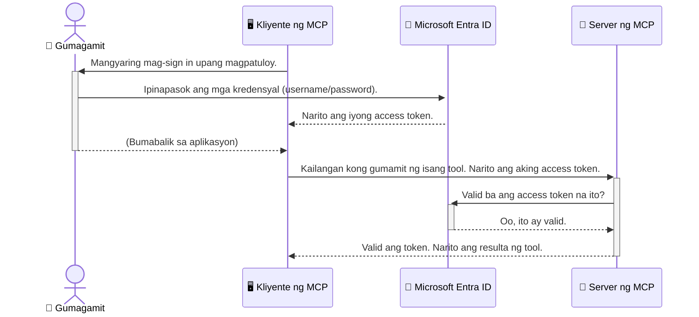

# Pag-seguro sa Mga AI Workflow: Entra ID Authentication para sa Model Context Protocol Servers

> [!NOTE]
> Pinoprotektahan ng remote server code sa araling ito ang legacy na `/sse` at `/message`
> endpoints at target ang MCP `2025-11-25`. Panatilihin ang mga paraan nito sa pagkilala at pag-validate ng token,
> ngunit gumamit ng `2026-07-28`-compatible na Streamable HTTP transport para sa mga bagong
> implementasyon.

## Panimula
Ang pag-seguro sa iyong Model Context Protocol (MCP) server ay kasinghalaga ng pagsara ng pintuan ng iyong bahay. Ang pagbukas ng MCP server ay naglalantad sa iyong mga kagamitan at datos sa hindi awtorisadong pag-access, na maaaring magdulot ng seguridad na paglabag. Nagbibigay ang Microsoft Entra ID ng matibay na cloud-based na solusyon sa pagkilala at pamamahala ng access, na tumutulong upang matiyak na tanging mga awtorisadong gumagamit at aplikasyon lamang ang makakakonekta sa iyong MCP server. Sa seksyong ito, matututunan mo kung paano protektahan ang iyong mga AI workflow gamit ang Entra ID authentication.

## Mga Layunin ng Pagkatuto
Sa pagtatapos ng seksyong ito, magagawa mong:

- Maunawaan ang kahalagahan ng pag-seguro sa MCP servers.
- Ipaliwanag ang mga batayan ng Microsoft Entra ID at OAuth 2.0 authentication.
- Kilalanin ang pagkakaiba sa pagitan ng public at confidential clients.
- Magpatupad ng Entra ID authentication sa parehong lokal (public client) at remote (confidential client) MCP server scenario.
- Mag-apply ng mga pinakamainam na kasanayan sa seguridad habang bumubuo ng mga AI workflow.

## Seguridad at MCP

Katulad ng hindi mo iiwanang nakabukas ang pinto ng iyong bahay, hindi mo dapat iiwanang bukas ang iyong MCP server para sa sinuman. Mahalagang i-secure ang iyong mga AI workflow para makabuo ng matibay, mapagkakatiwalaan, at ligtas na mga aplikasyon. Ipapakilala sa kabanatang ito kung paano gamitin ang Microsoft Entra ID upang i-secure ang iyong MCP servers, tinitiyak na tanging mga awtorisadong gumagamit at aplikasyon lamang ang makakakonekta sa iyong mga kagamitan at datos.

## Bakit Mahalaga ang Seguridad para sa MCP Servers

Isipin na ang iyong MCP server ay may kasangkapang makakapagpadala ng mga email o makakapag-access sa database ng mga customer. Ang isang hindi secured na server ay nangangahulugan na maaaring gamitin ng kahit sino ang kasangkapan, na nagdudulot ng hindi awtorisadong pag-access sa datos, spam, o iba pang masamang gawain.

Sa pamamagitan ng pagpapatupad ng authentication, tinitiyak mo na bawat kahilingan sa iyong server ay na-verify, pinapatunayan ang pagkakakilanlan ng gumagamit o aplikasyon na gumagawa ng kahilingan. Ito ang unang at pinakamahalagang hakbang sa pag-seguro ng iyong mga AI workflow.

## Panimula sa Microsoft Entra ID

[**Microsoft Entra ID**](https://adoption.microsoft.com/microsoft-security/entra/) ay isang cloud-based na serbisyo sa pamamahala ng pagkakakilanlan at access. Isipin ito bilang isang unibersal na tagapagbantay ng seguridad para sa iyong mga aplikasyon. Pinangangasiwaan nito ang komplikadong proseso ng pagpapatunay ng pagkakakilanlan ng gumagamit (authentication) at pagtukoy kung ano ang pinapayagan nilang gawin (authorization).

Sa paggamit ng Entra ID, maaari mong:

- Pahintulutan ang ligtas na pag-sign-in para sa mga gumagamit.
- Protektahan ang mga API at serbisyo.
- Pamahalaan ang mga patakaran ng access mula sa isang sentral na lokasyon.

Para sa MCP servers, nagbibigay ang Entra ID ng matibay at malawak na pinagkakatiwalaang solusyon upang pamahalaan kung sino ang maaaring gumamit ng kakayahan ng iyong server.

---

## Pag-unawa sa Magic: Paano Gumagana ang Entra ID Authentication

Gumagamit ang Entra ID ng mga bukas na pamantayan tulad ng **OAuth 2.0** para hawakan ang authentication. Bagama't maaaring maging kumplikado ang mga detalye, simple lang ang pangunahing konsepto at mauunawaan gamit ang isang talinghaga.

### Isang Banayad na Panimula sa OAuth 2.0: Ang Susi ng Valet

Isipin ang OAuth 2.0 tulad ng isang serbisyo ng valet para sa iyong kotse. Kapag dumating ka sa isang restawran, hindi mo ibinibigay sa valet ang pangunahing susi mo. Sa halip, binibigay mo ang **valet key** na may limitadong pahintulot—maaari nitong paandarin ang kotse at isara ang mga pinto, ngunit hindi nito mabubuksan ang trunk o glove compartment.

Sa talinghagang ito:

- **Ikaw** ang **User**.
- **Ang iyong kotse** ay ang **MCP Server** na may mahalagang mga kagamitan at datos.
- Ang **Valet** ay ang **Microsoft Entra ID**.
- Ang **Parking Attendant** ay ang **MCP Client** (ang aplikasyon na sumusubok i-access ang server).
- Ang **Valet Key** ay ang **Access Token**.

Ang access token ay isang ligtas na string ng teksto na natatanggap ng MCP client mula sa Entra ID pagkatapos mong mag-sign in. Ipinapakita ng client ang token na ito sa MCP server sa bawat kahilingan. Maaaring i-verify ng server ang token upang tiyakin na lehitimo ang kahilingan at may kinakailangang permiso ang client, nang hindi kailanman kailangang hawakan ang aktuwal mong kredensyal (tulad ng iyong password).

### Ang Daloy ng Authentication

Ganito ang proseso sa praktika:



### Pagpapakilala sa Microsoft Authentication Library (MSAL)

Bago tayo sumisid sa code, mahalagang ipakilala ang isang pangunahing bahagi na makikita mo sa mga halimbawa: ang **Microsoft Authentication Library (MSAL)**.

Ang MSAL ay isang library na binuo ng Microsoft na nagpapadali sa mga developer na hawakan ang authentication. Sa halip na kailangang ikaw ang magsulat ng komplikadong code para sa seguridad ng mga token, pamamahala ng pag-sign in, at pag-refresh ng mga sesyon, inaalagaan ng MSAL ang mabigat na gawain.

Lubos na inirerekomenda ang paggamit ng library na tulad ng MSAL dahil:

- **Ligtas ito:** Ipinapatupad nito ang mga industry-standard na protocol at pinakabuting kasanayan sa seguridad, na nagpapababa ng panganib ng mga kahinaan sa iyong code.
- **Pinapadali ang Pag-develop:** Inililihim nito ang pagiging kumplikado ng OAuth 2.0 at OpenID Connect na mga protocol, na nagbibigay-daan sa iyo upang magdagdag ng matibay na authentication sa iyong aplikasyon gamit ang ilang linya ng code lamang.
- **Pinangangalagaan:** Aktibong pinapanatili at ina-update ng Microsoft ang MSAL upang tugunan ang mga bagong banta sa seguridad at pagbabago sa platform.

Sinusuportahan ng MSAL ang iba't ibang mga wika at framework ng aplikasyon, kabilang ang .NET, JavaScript/TypeScript, Python, Java, Go, at mga mobile platform tulad ng iOS at Android. Ibig sabihin, maaari mong gamitin ang parehong mga pattern ng authentication sa buong teknolohiyang stack mo.

Para sa karagdagang kaalaman tungkol sa MSAL, maaari mong tingnan ang opisyal na [MSAL overview documentation](https://learn.microsoft.com/entra/identity-platform/msal-overview).

---

## Pag-seguro sa Iyong MCP Server gamit ang Entra ID: Isang Hakbang-hakbang na Gabay

Ngayon, galugarin natin kung paano i-secure ang isang lokal na MCP server (na nakikipag-usap gamit ang `stdio`) gamit ang Entra ID. Ang halimbawa na ito ay gumagamit ng **public client**, na angkop para sa mga aplikasyon na tumatakbo sa makina ng gumagamit, tulad ng desktop app o lokal na development server.

### Scenario 1: Pag-seguro sa Isang Lokal na MCP Server (gamit ang Public Client)

Sa senaryong ito, titingnan natin ang isang MCP server na tumatakbo nang lokal, nakikipag-usap sa pamamagitan ng `stdio`, at gumagamit ng Entra ID para i-authenticate ang gumagamit bago pahintulutan ang access sa mga kasangkapan nito. Ang server ay magkakaroon ng isang kasangkapan na kumukuha ng impormasyon ng profile ng gumagamit mula sa Microsoft Graph API.

#### 1. Pagsasaayos ng Aplikasyon sa Entra ID

Bago sumulat ng anumang code, kailangan mong irehistro ang iyong aplikasyon sa Microsoft Entra ID. Sinasabi nito sa Entra ID tungkol sa iyong aplikasyon at binibigyan ito ng pahintulot na gamitin ang serbisyo ng authentication.

1. Pumunta sa **[Microsoft Entra portal](https://entra.microsoft.com/)**.
2. Pumunta sa **App registrations** at i-click ang **New registration**.
3. Bigyan ng pangalan ang iyong aplikasyon (halimbawa, "My Local MCP Server").
4. Para sa **Supported account types**, piliin ang **Accounts in this organizational directory only**.
5. Maaari mong iwanang blangko ang **Redirect URI** para sa halimbawang ito.
6. I-click ang **Register**.

Pagkatapos mairehistro, tandaan ang **Application (client) ID** at **Directory (tenant) ID**. Kakailanganin mo ang mga ito sa iyong code.

#### 2. Ang Code: Isang Pagsusuri

Tingnan natin ang mga pangunahing bahagi ng code na humahawak sa authentication. Ang buong code para sa halimbawa na ito ay makikita sa [Entra ID - Local - WAM](https://github.com/Azure-Samples/mcp-auth-servers/tree/main/src/entra-id-local-wam) na folder ng [mcp-auth-servers GitHub repository](https://github.com/Azure-Samples/mcp-auth-servers).

**`AuthenticationService.cs`**

Ang klaseng ito ang responsable sa paghawak ng pakikisalamuha sa Entra ID.

- **`CreateAsync`**: Inia-initialize nito ang `PublicClientApplication` mula sa MSAL (Microsoft Authentication Library). Nakakonfigura ito gamit ang iyong `clientId` at `tenantId` ng aplikasyon.
- **`WithBroker`**: Pinapagana nito ang paggamit ng broker (tulad ng Windows Web Account Manager), na nagbibigay ng mas ligtas at walang putol na karanasan sa single sign-on.
- **`AcquireTokenAsync`**: Ito ang pangunahing pamamaraan. Sinusubukan nito munang kumuha ng token nang tahimik (ibig sabihin, hindi na kailangang mag-sign in muli ang gumagamit kung may balidong sesyon na). Kung hindi makakuha ng silent token, magpapa-sign in ito sa gumagamit nang interactive.

```csharp
// Simplified for clarity
public static async Task<AuthenticationService> CreateAsync(ILogger<AuthenticationService> logger)
{
    var msalClient = PublicClientApplicationBuilder
        .Create(_clientId) // Your Application (client) ID
        .WithAuthority(AadAuthorityAudience.AzureAdMyOrg)
        .WithTenantId(_tenantId) // Your Directory (tenant) ID
        .WithBroker(new BrokerOptions(BrokerOptions.OperatingSystems.Windows))
        .Build();

    // ... cache registration ...

    return new AuthenticationService(logger, msalClient);
}

public async Task<string> AcquireTokenAsync()
{
    try
    {
        // Try silent authentication first
        var accounts = await _msalClient.GetAccountsAsync();
        var account = accounts.FirstOrDefault();

        AuthenticationResult? result = null;

        if (account != null)
        {
            result = await _msalClient.AcquireTokenSilent(_scopes, account).ExecuteAsync();
        }
        else
        {
            // If no account, or silent fails, go interactive
            result = await _msalClient.AcquireTokenInteractive(_scopes).ExecuteAsync();
        }

        return result.AccessToken;
    }
    catch (Exception ex)
    {
        _logger.LogError(ex, "An error occurred while acquiring the token.");
        throw; // Optionally rethrow the exception for higher-level handling
    }
}
```

**`Program.cs`**

Dito inaayos ang MCP server at isinasama ang authentication service.

- **`AddSingleton<AuthenticationService>`**: Inirerehistro nito ang `AuthenticationService` sa dependency injection container para magamit ng ibang bahagi ng aplikasyon (tulad ng ating kasangkapan).
- **`GetUserDetailsFromGraph` tool**: Ang kasangkapang ito ay nangangailangan ng instance ng `AuthenticationService`. Bago ito gumawa ng anumang bagay, tinatawag nito ang `authService.AcquireTokenAsync()` upang makakuha ng valid na access token. Kung matagumpay ang authentication, ginagamit nito ang token para tawagan ang Microsoft Graph API at kunin ang detalye ng gumagamit.

```csharp
// Simplified for clarity
[McpServerTool(Name = "GetUserDetailsFromGraph")]
public static async Task<string> GetUserDetailsFromGraph(
    AuthenticationService authService)
{
    try
    {
        // This will trigger the authentication flow
        var accessToken = await authService.AcquireTokenAsync();

        // Use the token to create a GraphServiceClient
        var graphClient = new GraphServiceClient(
            new BaseBearerTokenAuthenticationProvider(new TokenProvider(authService)));

        var user = await graphClient.Me.GetAsync();

        return System.Text.Json.JsonSerializer.Serialize(user);
    }
    catch (Exception ex)
    {
        return $"Error: {ex.Message}";
    }
}
```

#### 3. Paano Nagsasama-sama ang Lahat

1. Kapag sinubukan ng MCP client gamitin ang `GetUserDetailsFromGraph` tool, unang tinatawag ng tool ang `AcquireTokenAsync`.
2. Pinapaandar ng `AcquireTokenAsync` ang MSAL library upang suriin kung may valid na token.
3. Kung walang token na makita, ang MSAL, sa pamamagitan ng broker, ay hihilingin sa gumagamit na mag-sign in gamit ang kanilang Entra ID account.
4. Kapag naka-sign in na ang gumagamit, naglalabas ang Entra ID ng access token.
5. Natatanggap ng tool ang token at ginagamit ito para gumawa ng ligtas na tawag sa Microsoft Graph API.
6. Ibabalik ang detalye ng gumagamit sa MCP client.

Tinitiyak ng prosesong ito na tanging mga authenticated na gumagamit lamang ang makakagamit ng kasangkapan, na epektibong nagse-secure sa iyong lokal na MCP server.

### Scenario 2: Pag-seguro ng Isang Remote MCP Server (gamit ang Confidential Client)

Kapag ang iyong MCP server ay tumatakbo sa isang remote na makina (tulad ng cloud server) at nakikipag-usap sa pamamagitan ng protocol tulad ng HTTP Streaming, iba ang mga kinakailangan sa seguridad. Sa kasong ito, dapat mong gamitin ang **confidential client** at ang **Authorization Code Flow**. Ito ay mas ligtas na pamamaraan dahil ang mga sikreto ng aplikasyon ay hindi kailanman nahahayag sa browser.

Ang halimbawang ito ay gumagamit ng TypeScript-based MCP server na gumagamit ng Express.js upang hawakan ang HTTP requests.

#### 1. Pagsasaayos ng Aplikasyon sa Entra ID

Ang pagsasaayos sa Entra ID ay katulad ng sa public client, ngunit may isang mahalagang kaibahan: kailangan mong gumawa ng **client secret**.

1. Pumunta sa **[Microsoft Entra portal](https://entra.microsoft.com/)**.
2. Sa iyong app registration, pumunta sa tab na **Certificates & secrets**.
3. I-click ang **New client secret**, bigyan ito ng paglalarawan, at i-click ang **Add**.
4. **Mahalaga:** Kopyahin agad ang value ng secret. Hindi mo na ito muling makikita.
5. Kailangan mo ring isaayos ang isang **Redirect URI**. Pumunta sa tab na **Authentication**, i-click ang **Add a platform**, piliin ang **Web**, at ilagay ang redirect URI para sa iyong aplikasyon (halimbawa, `http://localhost:3001/auth/callback`).

> **⚠️ Mahagang Paalala sa Seguridad:** Para sa mga aplikasyon sa produksyon, mariing inirerekomenda ng Microsoft ang paggamit ng **secretless authentication** na mga pamamaraan tulad ng **Managed Identity** o **Workload Identity Federation** sa halip na client secrets. Ang client secrets ay may mga panganib sa seguridad dahil maaari itong malantad o makompromiso. Nagbibigay ang managed identities ng mas ligtas na paraan sa pamamagitan ng pag-aalis ng pangangailangan na mag-imbak ng mga kredensyal sa iyong code o configuration.
>
> Para sa karagdagang impormasyon tungkol sa managed identities at kung paano ito ipapatupad, tingnan ang [Managed identities for Azure resources overview](https://learn.microsoft.com/entra/identity/managed-identities-azure-resources/overview).

#### 2. Ang Code: Isang Pagsusuri

Gumagamit ang halimbawang ito ng session-based na pamamaraan. Kapag na-authenticate ang gumagamit, iniimbak ng server ang access token at refresh token sa isang session at binibigyan ang gumagamit ng session token. Ginagamit ang session token para sa mga susunod na kahilingan. Ang buong code para sa halimbawa na ito ay makikita sa [Entra ID - Confidential client](https://github.com/Azure-Samples/mcp-auth-servers/tree/main/src/entra-id-cca-session) na folder ng [mcp-auth-servers GitHub repository](https://github.com/Azure-Samples/mcp-auth-servers).

**`Server.ts`**

Inaayos ng file na ito ang Express server at ang MCP transport layer.

- **`requireBearerAuth`**: Ito ay middleware na nagpoprotekta sa `/sse` at `/message` endpoints. Sinusuri nito ang valid bearer token sa `Authorization` header ng kahilingan.
- **`EntraIdServerAuthProvider`**: Isang custom na klase na nagpapatupad ng `McpServerAuthorizationProvider` interface. Ito ang responsable sa paghawak ng OAuth 2.0 flow.
- **`/auth/callback`**: Pinangangasiwaan ng endpoint na ito ang redirect mula sa Entra ID pagkatapos makapag-authenticate ang gumagamit. Pinapalitan nito ang authorization code para sa access token at refresh token.

```typescript
// Pinadali para sa kalinawan
const app = express();
const { server } = createServer();
const provider = new EntraIdServerAuthProvider();

// Protektahan ang SSE endpoint
app.get("/sse", requireBearerAuth({
  provider,
  requiredScopes: ["User.Read"]
}), async (req, res) => {
  // ... kumonekta sa transportasyon ...
});

// Protektahan ang message endpoint
app.post("/message", requireBearerAuth({
  provider,
  requiredScopes: ["User.Read"]
}), async (req, res) => {
  // ... hawakan ang mensahe ...
});

// Hawakan ang OAuth 2.0 callback
app.get("/auth/callback", (req, res) => {
  provider.handleCallback(req.query.code, req.query.state)
    .then(result => {
      // ... hawakan ang tagumpay o pagkabigo ...
    });
});
```

**`Tools.ts`**

Nagdedeklara ang file na ito ng mga kasangkapang ibinibigay ng MCP server. Ang `getUserDetails` tool ay kahawig ng nasa nakaraang halimbawa, ngunit kinukuha ang access token mula sa session.

```typescript
// Pinadali para sa kalinawan
server.setRequestHandler(CallToolRequestSchema, async (request) => {
  const { name } = request.params;
  const context = request.params?.context as { token?: string } | undefined;
  const sessionToken = context?.token;

  if (name === ToolName.GET_USER_DETAILS) {
    if (!sessionToken) {
      throw new AuthenticationError("Authentication token is missing or invalid. Ensure the token is provided in the request context.");
    }

    // Kunin ang token ng Entra ID mula sa session store
    const tokenData = tokenStore.getToken(sessionToken);
    const entraIdToken = tokenData.accessToken;

    const graphClient = Client.init({
      authProvider: (done) => {
        done(null, entraIdToken);
      }
    });

    const user = await graphClient.api('/me').get();

    // ... ibalik ang mga detalye ng user ...
  }
});
```

**`auth/EntraIdServerAuthProvider.ts`**

Hinihawakan ng klaseng ito ang lohika para sa:

- Pag-redirect ng gumagamit sa Entra ID sign-in page.
- Pagpalit ng authorization code para sa access token.
- Pag-iimbak ng mga token sa `tokenStore`.
- Pag-refresh ng access token kapag ito ay nag-expire.


#### 3. Paano Lahat Ito Nagtutulungan

1. Kapag unang sinubukan ng isang user na kumonekta sa MCP server, makikita ng `requireBearerAuth` middleware na wala silang valid na session at ire-redirect sila sa Entra ID sign-in page.
2. Mag-sign in ang user gamit ang kanilang Entra ID account.
3. Iri-redirect ng Entra ID ang user pabalik sa `/auth/callback` endpoint na may authorization code.
4. Ipapalit ng server ang code para sa access token at refresh token, itatago ang mga ito, at gagawa ng session token na ipapadala sa kliyente.
5. Maaari na ngayong gamitin ng kliyente ang session token na ito sa `Authorization` header para sa lahat ng mga susunod na kahilingan sa MCP server.
6. Kapag tinawag ang `getUserDetails` tool, gagamitin nito ang session token para hanapin ang Entra ID access token at gagamitin ito para tumawag sa Microsoft Graph API.

Mas kumplikado ang daloy na ito kaysa sa public client flow, ngunit ito ay kinakailangan para sa mga internet-facing endpoints. Dahil naa-access ang mga remote MCP servers sa pampublikong internet, kailangan nilang magkaroon ng mas matibay na mga hakbang sa seguridad upang maprotektahan laban sa hindi awtorisadong pag-access at posibleng mga atake.


## Pinakamahuhusay na Kasanayan sa Seguridad

- **Palaging gamitin ang HTTPS**: I-encrypt ang komunikasyon sa pagitan ng kliyente at server upang maprotektahan ang mga token mula sa interception.
- **Ipatupad ang Role-Based Access Control (RBAC)**: Huwag lang suriin *kung* ang user ay awtentikado; suriin *kung ano* ang pinapahintulutan nilang gawin. Maaari kang magtakda ng mga role sa Entra ID at suriin ang mga ito sa iyong MCP server.
- **Mag-monitor at mag-audit**: I-log ang lahat ng mga authentication event para makita at matugunan ang mga kahina-hinalang aktibidad.
- **Pamahalaan ang rate limiting at throttling**: Ang Microsoft Graph at iba pang APIs ay nagpatupad ng rate limiting upang pigilan ang pang-aabuso. Ipatupad ang exponential backoff at retry logic sa iyong MCP server upang maayos na mapangasiwaan ang HTTP 429 (Too Many Requests) na mga tugon. Isaalang-alang ang paggamit ng cache sa madalas na ina-access na data upang mabawasan ang mga API calls.
- **Secure na pag-iimbak ng token**: Itago nang ligtas ang mga access token at refresh token. Para sa mga lokal na aplikasyon, gamitin ang mga secure storage mechanism ng system. Para sa mga server na aplikasyon, isaalang-alang ang paggamit ng encrypted storage o secure key management services tulad ng Azure Key Vault.
- **Pamamahala ng expiration ng token**: May limitadong buhay ang mga access token. Ipatupad ang awtomatikong pag-refresh ng token gamit ang refresh tokens upang mapanatili ang tuloy-tuloy na karanasan ng user nang hindi na kailangang mag-sign in muli.
- **Isaalang-alang ang paggamit ng Azure API Management**: Bagama't ang pagpapatupad ng seguridad nang direkta sa iyong MCP server ay nagbibigay ng malapit na kontrol, ang mga API Gateways tulad ng Azure API Management ay maaari nang gawin ang maraming mga usapin sa seguridad nang awtomatiko, kabilang ang authentication, authorization, rate limiting, at monitoring. Nagbibigay sila ng sentralisadong layer ng seguridad na nasa pagitan ng iyong mga kliyente at MCP servers. Para sa karagdagang detalye sa paggamit ng API Gateways sa MCP, tingnan ang aming [Azure API Management Your Auth Gateway For MCP Servers](https://techcommunity.microsoft.com/blog/integrationsonazureblog/azure-api-management-your-auth-gateway-for-mcp-servers/4402690).


## Pangunahing Mga Natutunan

- Mahalaga ang pag-secure ng iyong MCP server upang maprotektahan ang iyong data at mga tools.
- Nagbibigay ang Microsoft Entra ID ng matatag at scalable na solusyon para sa authentication at authorization.
- Gumamit ng **public client** para sa mga lokal na aplikasyon at **confidential client** para sa mga remote server.
- Ang **Authorization Code Flow** ang pinakaligtas na opsyon para sa mga web application.


## Ehersisyo

1. Isipin ang isang MCP server na maaaring iyong itatayo. Ito ba ay isang lokal na server o isang remote server?
2. Batay sa iyong sagot, gagamit ka ba ng public o confidential client?
3. Anong permiso ang hihingin ng iyong MCP server para sa pagsasagawa ng mga aksyon laban sa Microsoft Graph?


## Mga Hands-on na Ehersisyo

### Ehersisyo 1: Magrehistro ng Aplikasyon sa Entra ID
Pumunta sa Microsoft Entra portal.
Magrehistro ng bagong aplikayson para sa iyong MCP server.
Itala ang Application (client) ID at Directory (tenant) ID.

### Ehersisyo 2: I-secure ang Lokal na MCP Server (Public Client)
- Sundin ang code example upang isama ang MSAL (Microsoft Authentication Library) para sa user authentication.
- Subukan ang authentication flow sa pamamagitan ng pagtawag sa MCP tool na kumukuha ng user details mula sa Microsoft Graph.

### Ehersisyo 3: I-secure ang Remote MCP Server (Confidential Client)
- Magrehistro ng confidential client sa Entra ID at gumawa ng client secret.
- I-configure ang iyong Express.js MCP server upang gamitin ang Authorization Code Flow.
- Subukan ang mga protektadong endpoints at kumpirmahin ang access base sa token.

### Ehersisyo 4: Ipatupad ang Pinakamahuhusay na Kasanayan sa Seguridad
- I-enable ang HTTPS para sa iyong lokal o remote na server.
- Ipatupad ang role-based access control (RBAC) sa lohika ng iyong server.
- Magdagdag ng pamamahala sa expiration ng token at secure na pag-iimbak ng token.

## Mga Sanggunian

1. **MSAL Overview Documentation**  
   Alamin kung paano pinapayagan ng Microsoft Authentication Library (MSAL) ang secure na pagkuha ng token sa iba't ibang platform:  
   [MSAL Overview on Microsoft Learn](https://learn.microsoft.com/en-gb/entra/msal/overview)

2. **Azure-Samples/mcp-auth-servers GitHub Repository**  
   Mga reference implementation ng MCP servers na nagpapakita ng mga authentication flow:  
   [Azure-Samples/mcp-auth-servers on GitHub](https://github.com/Azure-Samples/mcp-auth-servers)

3. **Managed Identities for Azure Resources Overview**  
   Unawain kung paano alisin ang mga sikreto gamit ang system- o user-assigned managed identities:  
   [Managed Identities Overview on Microsoft Learn](https://learn.microsoft.com/en-us/entra/identity/managed-identities-azure-resources/)

4. **Azure API Management: Your Auth Gateway for MCP Servers**  
   Malalimang pagtalakay sa paggamit ng APIM bilang secure OAuth2 gateway para sa MCP servers:  
   [Azure API Management Your Auth Gateway For MCP Servers](https://techcommunity.microsoft.com/blog/integrationsonazureblog/azure-api-management-your-auth-gateway-for-mcp-servers/4402690)

5. **Microsoft Graph Permissions Reference**  
   Komprehensibong listahan ng delegated at application permissions para sa Microsoft Graph:  
   [Microsoft Graph Permissions Reference](https://learn.microsoft.com/zh-tw/graph/permissions-reference)


## Mga Kinalabasan sa Pagkatuto
Pagkatapos makumpleto ang seksyong ito, magagawa mong:

- Ipaliwanag kung bakit kritikal ang authentication para sa MCP servers at mga AI workflow.
- Isaayos at i-configure ang Entra ID authentication para sa parehong lokal at remote na mga senaryo ng MCP server.
- Piliin ang angkop na uri ng kliyente (public o confidential) batay sa deployment ng iyong server.
- Ipatupad ang ligtas na mga kasanayan sa pag-code, kasama ang pag-iimbak ng token at role-based authorization.
- Mapanatag na maprotektahan ang iyong MCP server at mga tool nito mula sa hindi awtorisadong pag-access.

## Ano ang susunod 

- [5.13 Model Context Protocol (MCP) Integration with Microsoft Foundry](../mcp-foundry-agent-integration/README.md)

---

<!-- CO-OP TRANSLATOR DISCLAIMER START -->
**Pagtatanggi**:
Ang dokumentong ito ay isinalin gamit ang serbisyo ng AI translation na [Co-op Translator](https://github.com/Azure/co-op-translator). Bagama't nagsusumikap kami para sa katumpakan, pakatandaan na ang awtomatikong pagsasalin ay maaaring maglaman ng mga pagkakamali o hindi pagkakatugma. Ang orihinal na dokumento sa orihinal nitong wika ang dapat ituring na pangunahing sanggunian. Para sa mahahalagang impormasyon, inirerekomenda ang propesyonal na pagsasalin ng tao. Hindi kami mananagot sa anumang maling pagkakaintindi o maling interpretasyon na nagmula sa paggamit ng pagsasaling ito.
<!-- CO-OP TRANSLATOR DISCLAIMER END -->