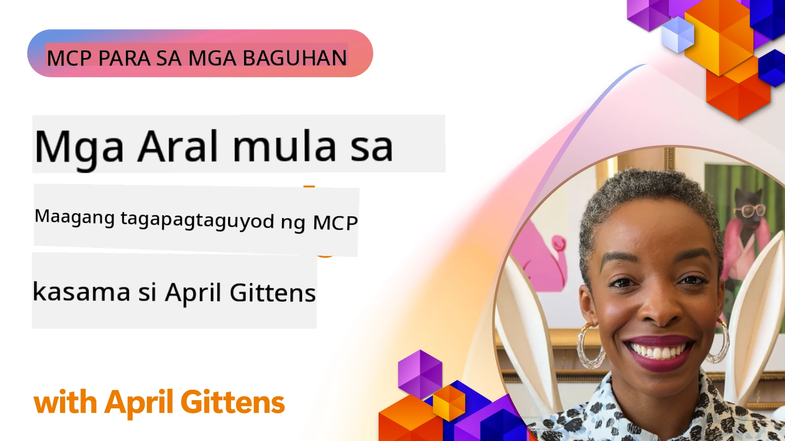

# 🌟 Mga Aral mula sa mga Maagang Gumamit

[](https://youtu.be/jds7dSmNptE)

_(I-click ang larawan sa itaas upang panoorin ang video ng aral na ito)_

## 🎯 Ano ang Saklaw ng Modulong Ito

Tinutuklas ng modulong ito kung paano ginagamit ng mga totoong organisasyon at mga developer ang Model Context Protocol (MCP) upang lutasin ang mga tunay na hamon at magpasimula ng inobasyon. Sa pamamagitan ng detalyadong mga kaso ng pag-aaral, mga praktikal na proyekto, at mga halimbawa, matutuklasan mo kung paano pinapayagan ng MCP ang ligtas at napapalawak na integrasyon ng AI na nag-uugnay ng mga modelo ng wika, mga tool, at datos ng enterprise.

### 📚 Tingnan ang MCP sa Aksyon

Nais mo bang makita ang mga prinsipyong ito na inilapat sa mga production-ready na tool? Tingnan ang aming [**10 Microsoft MCP Servers Na Nagbabago sa Produktibidad ng Developer**](microsoft-mcp-servers.md), na nagpapakita ng mga totoong Microsoft MCP servers na maaari mong gamitin ngayon.

## Pangkalahatang-ideya

Tinutuklas ng aral na ito kung paano ginamit ng mga maagang gumamit ang Model Context Protocol (MCP) upang lutasin ang mga totoong hamon at magpasimula ng inobasyon sa iba't ibang industriya. Sa pamamagitan ng detalyadong mga kaso ng pag-aaral at mga praktikal na proyekto, makikita mo kung paano pinapayagan ng MCP ang pamantayang, ligtas, at napapalawak na integrasyon ng AI—na nag-uugnay sa mga malalaking modelo ng wika, mga tool, at datos ng enterprise sa isang pinag-isang balangkas. Makakakuha ka ng praktikal na karanasan sa pagdisenyo at pagbuo ng mga solusyong batay sa MCP, matututo mula sa mga napatunayang pattern ng pagpapatupad, at matutuklasan ang mga pinakamahusay na kasanayan para sa paglalagay ng MCP sa mga production na kapaligiran. Itinatampok din ng aral ang mga umuusbong na uso, mga hinaharap na direksyon, at mga open-source na mapagkukunan upang matulungan kang manatili sa unahan ng teknolohiyang MCP at ng umuunlad nitong ekosistema.

## Mga Layunin sa Pagkatuto

- Suriin ang mga totoong aplikasyon ng MCP sa iba't ibang industriya
- Magdisenyo at bumuo ng kumpletong aplikasyon na batay sa MCP
- Tuklasin ang mga umuusbong na uso at mga hinaharap na direksyon sa teknolohiyang MCP
- Ilapat ang mga pinakamahusay na kasanayan sa mga aktwal na sitwasyon ng pag-unlad

## Mga Totoong Aplikasyon ng MCP

### Kaso ng Pag-aaral 1: Enterprise Customer Support Automation

Isinagawa ng isang multinasyunal na korporasyon ang isang solusyong batay sa MCP upang maging pamantayan ang mga interaksyon ng AI sa kanilang mga sistema ng customer support. Pinayagan nito silang:

- Lumikha ng isang pinag-isang interface para sa maraming provider ng LLM
- Panatilihin ang pare-parehong pamamahala ng prompt sa mga departamento
- Ipatupad ang matibay na mga kontrol sa seguridad at pagsunod
- Madaling lumipat-lipat sa pagitan ng iba't ibang AI model batay sa partikular na pangangailangan

**Teknikal na Pagpapatupad:**

```python
# Implementasyon ng Python MCP server para sa suporta ng customer
import logging
import asyncio
from modelcontextprotocol import create_server, ServerConfig
from modelcontextprotocol.server import MCPServer
from modelcontextprotocol.transports import create_http_transport
from modelcontextprotocol.resources import ResourceDefinition
from modelcontextprotocol.prompts import PromptDefinition
from modelcontextprotocol.tool import ToolDefinition

# I-configure ang pag-log
logging.basicConfig(level=logging.INFO)

async def main():
    # Gumawa ng configuration ng server
    config = ServerConfig(
        name="Enterprise Customer Support Server",
        version="1.0.0",
        description="MCP server for handling customer support inquiries"
    )
    
    # I-initialize ang MCP server
    server = create_server(config)
    
    # Irehistro ang mga knowledge base resources
    server.resources.register(
        ResourceDefinition(
            name="customer_kb",
            description="Customer knowledge base documentation"
        ),
        lambda params: get_customer_documentation(params)
    )
    
    # Irehistro ang mga prompt templates
    server.prompts.register(
        PromptDefinition(
            name="support_template",
            description="Templates for customer support responses"
        ),
        lambda params: get_support_templates(params)
    )
    
    # Irehistro ang mga support tools
    server.tools.register(
        ToolDefinition(
            name="ticketing",
            description="Create and update support tickets"
        ),
        handle_ticketing_operations
    )
    
    # Simulan ang server gamit ang HTTP transport
    transport = create_http_transport(port=8080)
    await server.run(transport)

if __name__ == "__main__":
    asyncio.run(main())
```

**Mga Resulta:** 30% pagbawas sa gastos ng modelo, 45% pagpapahusay sa pagkakapare-pareho ng sagot, at pinahusay na pagsunod sa mga operasyon sa buong mundo.

### Kaso ng Pag-aaral 2: Healthcare Diagnostic Assistant

Bumuo ang isang tagapagbigay ng serbisyong pangkalusugan ng imprastraktura ng MCP upang pagsamahin ang maraming espesyal na medikal na modelo ng AI habang sinisigurong protektado ang sensitibong datos ng pasyente:

- Walang-sagabal na paglipat sa pagitan ng pangkalahatan at espesiyalistang medikal na mga modelo
- Mahigpit na mga kontrol sa privacy at mga audit trail
- Integrasyon sa umiiral na mga sistema ng Electronic Health Record (EHR)
- Pare-parehong pag-ingenyero ng prompt para sa terminolohiyang medikal

**Teknikal na Pagpapatupad:**

```csharp
// C# MCP host application implementation in healthcare application
using Microsoft.Extensions.DependencyInjection;
using ModelContextProtocol.SDK.Client;
using ModelContextProtocol.SDK.Security;
using ModelContextProtocol.SDK.Resources;

public class DiagnosticAssistant
{
    private readonly MCPHostClient _mcpClient;
    private readonly PatientContext _patientContext;
    
    public DiagnosticAssistant(PatientContext patientContext)
    {
        _patientContext = patientContext;
        
        // Configure MCP client with healthcare-specific settings
        var clientOptions = new ClientOptions
        {
            Name = "Healthcare Diagnostic Assistant",
            Version = "1.0.0",
            Security = new SecurityOptions
            {
                Encryption = EncryptionLevel.Medical,
                AuditEnabled = true
            }
        };
        
        _mcpClient = new MCPHostClientBuilder()
            .WithOptions(clientOptions)
            .WithTransport(new HttpTransport("https://healthcare-mcp.example.org"))
            .WithAuthentication(new HIPAACompliantAuthProvider())
            .Build();
    }
    
    public async Task<DiagnosticSuggestion> GetDiagnosticAssistance(
        string symptoms, string patientHistory)
    {
        // Create request with appropriate resources and tool access
        var resourceRequest = new ResourceRequest
        {
            Name = "patient_records",
            Parameters = new Dictionary<string, object>
            {
                ["patientId"] = _patientContext.PatientId,
                ["requestingProvider"] = _patientContext.ProviderId
            }
        };
        
        // Request diagnostic assistance using appropriate prompt
        var response = await _mcpClient.SendPromptRequestAsync(
            promptName: "diagnostic_assistance",
            parameters: new Dictionary<string, object>
            {
                ["symptoms"] = symptoms,
                patientHistory = patientHistory,
                relevantGuidelines = _patientContext.GetRelevantGuidelines()
            });
            
        return DiagnosticSuggestion.FromMCPResponse(response);
    }
}
```

**Mga Resulta:** Pinahusay na mga mungkahi sa diagnosis para sa mga doktor habang nananatiling ganap na sumusunod sa HIPAA at malaking pagbawas sa paglipat-lipat ng konteksto sa pagitan ng mga sistema.

### Kaso ng Pag-aaral 3: Financial Services Risk Analysis

Isinagawa ng isang institusyong pinansyal ang MCP upang maging pamantayan ang kanilang mga proseso ng pagsusuri sa panganib sa iba't ibang departamento:

- Lumikhang isang pinag-isang interface para sa credit risk, fraud detection, at investment risk models
- Ipatupad ang mahigpit na mga kontrol sa access at pagberba ng modelo
- Sinigurong maa-audit ang lahat ng rekomendasyon ng AI
- Panatilihin ang pare-parehong pag-format ng datos sa iba't ibang mga sistema

**Teknikal na Pagpapatupad:**

```java
// Java MCP server para sa pagtatasa ng panganib sa pananalapi
import org.mcp.server.*;
import org.mcp.security.*;

public class FinancialRiskMCPServer {
    public static void main(String[] args) {
        // Gumawa ng MCP server na may mga tampok sa pagsunod sa pananalapi
        MCPServer server = new MCPServerBuilder()
            .withModelProviders(
                new ModelProvider("risk-assessment-primary", new AzureOpenAIProvider()),
                new ModelProvider("risk-assessment-audit", new LocalLlamaProvider())
            )
            .withPromptTemplateDirectory("./compliance/templates")
            .withAccessControls(new SOCCompliantAccessControl())
            .withDataEncryption(EncryptionStandard.FINANCIAL_GRADE)
            .withVersionControl(true)
            .withAuditLogging(new DatabaseAuditLogger())
            .build();
            
        server.addRequestValidator(new FinancialDataValidator());
        server.addResponseFilter(new PII_RedactionFilter());
        
        server.start(9000);
        
        System.out.println("Financial Risk MCP Server running on port 9000");
    }
}
```

**Mga Resulta:** Pinahusay na pagsunod sa regulasyon, 40% mas mabilis na mga cycle ng pagpapatupad ng modelo, at pinahusay na pagkakapare-pareho ng pagsusuri sa panganib sa iba't ibang departamento.

### Kaso ng Pag-aaral 4: Microsoft Playwright MCP Server para sa Browser Automation

Bumuo ang Microsoft ng [Playwright MCP server](https://github.com/microsoft/playwright-mcp) upang payagan ang ligtas at pamantayang browser automation sa pamamagitan ng Model Context Protocol. Ang production-ready server na ito ay nagbibigay-daan sa mga AI agent at LLM na makipag-ugnayan sa mga web browser sa kontrolado, maaudit, at napapalawak na paraan—pinapagana ang mga gamit tulad ng automated web testing, pagkuha ng datos, at end-to-end workflows.

> **🎯 Production Ready Tool**
> 
> Ipinapakita ng kasong ito ang isang totoong MCP server na maaari mong gamitin ngayon! Alamin pa ang tungkol sa Playwright MCP Server at 9 pang iba pang production-ready na Microsoft MCP servers sa aming [**Microsoft MCP Servers Guide**](microsoft-mcp-servers.md#8--playwright-mcp-server).

**Pangunahing Mga Tampok:**
- Ipinapakita ang mga kakayahan sa browser automation (navigasyon, pag-fill ng mga form, pagkuha ng screenshot, atbp.) bilang mga MCP tool
- Ipinapatupad ang mahigpit na mga kontrol sa access at sandboxing upang maiwasan ang hindi awtorisadong mga aksyon
- Nagbibigay ng detalyadong audit logs para sa lahat ng interaksyon sa browser
- Sumusuporta sa integrasyon sa Azure OpenAI at iba pang provider ng LLM para sa agent-driven automation
- Pinapagana ang GitHub Copilot's Coding Agent na may web browsing capabilities

**Teknikal na Pagpapatupad:**

```typescript
// TypeScript: Pagrehistro ng mga Playwright browser automation tool sa isang MCP server
import { createServer, ToolDefinition } from 'modelcontextprotocol';
import { launch } from 'playwright';

const server = createServer({
  name: 'Playwright MCP Server',
  version: '1.0.0',
  description: 'MCP server for browser automation using Playwright'
});

// Magrehistro ng tool para sa pag-navigate sa isang URL at pagkuha ng screenshot
server.tools.register(
  new ToolDefinition({
    name: 'navigate_and_screenshot',
    description: 'Navigate to a URL and capture a screenshot',
    parameters: {
      url: { type: 'string', description: 'The URL to visit' }
    }
  }),
  async ({ url }) => {
    const browser = await launch();
    const page = await browser.newPage();
    await page.goto(url);
    const screenshot = await page.screenshot();
    await browser.close();
    return { screenshot };
  }
);

// Simulan ang MCP server
server.listen(8080);
```

**Mga Resulta:**

- Pinagana ang ligtas at programmatic na browser automation para sa mga AI agent at LLM
- Nabawasan ang manual na pagsubok at pinahusay ang coverage ng pagsusuri para sa mga web application
- Nagbigay ng reusable at napapalawak na balangkas para sa integrasyon ng tool na nakabatay sa browser sa mga enterprise na kapaligiran
- Pinapagana ang web browsing capabilities ng GitHub Copilot

**Mga Sanggunian:**

- [Playwright MCP Server GitHub Repository](https://github.com/microsoft/playwright-mcp)
- [Microsoft AI and Automation Solutions](https://azure.microsoft.com/en-us/products/ai-services/)

### Kaso ng Pag-aaral 5: Azure MCP – Enterprise-Grade Model Context Protocol bilang Serbisyo

Ang Azure MCP Server ([https://aka.ms/azmcp](https://aka.ms/azmcp)) ay ang managed, enterprise-grade implementasyon ng Microsoft ng Model Context Protocol, na idinisenyo upang magbigay ng scalable, secure, at compliant na mga kakayahan ng MCP server bilang isang cloud service. Pinapayagan ng Azure MCP ang mga organisasyon na mabilis na mag-deploy, mag-manage, at mag-integrate ng MCP servers sa Azure AI, datos, at mga serbisyong pang-seguridad, na nagpapababa ng operational overhead at nagpapabilis ng pag-adopt ng AI.

> **🎯 Production Ready Tool**
> 
> Ito ay isang totoong MCP server na maaari mong gamitin ngayon! Alamin pa ang tungkol sa Microsoft Foundry MCP Server sa aming [**Microsoft MCP Servers Guide**](microsoft-mcp-servers.md).


- Buong pamamahala ng hosting ng MCP server na may built-in na scaling, monitoring, at seguridad
- Katutubong integrasyon sa Azure OpenAI, Azure AI Search, at iba pang mga serbisyo ng Azure
- Enterprise authentication at authorization gamit ang Microsoft Entra ID
- Suporta para sa custom tools, mga template ng prompt, at mga resource connector
- Pagsunod sa mga enterprise na pangangailangan sa seguridad at regulasyon

**Teknikal na Pagpapatupad:**

```yaml
# Example: Azure MCP server deployment configuration (YAML)
apiVersion: mcp.microsoft.com/v1
kind: McpServer
metadata:
  name: enterprise-mcp-server
spec:
  modelProviders:
    - name: azure-openai
      type: AzureOpenAI
      endpoint: https://<your-openai-resource>.openai.azure.com/
      apiKeySecret: <your-azure-keyvault-secret>
  tools:
    - name: document_search
      type: AzureAISearch
      endpoint: https://<your-search-resource>.search.windows.net/
      apiKeySecret: <your-azure-keyvault-secret>
  authentication:
    type: EntraID
    tenantId: <your-tenant-id>
  monitoring:
    enabled: true
    logAnalyticsWorkspace: <your-log-analytics-id>
```

**Mga Resulta:**  
- Pinababa ang oras mula sa proyekto hanggang sa pagpapahalaga para sa mga enterprise AI projects sa pamamagitan ng pagbibigay ng handa nang gamitin, compliant MCP server platform
- Pinadali ang integrasyon ng LLMs, tools, at mga pinagkukunan ng datos ng enterprise
- Pinahusay ang seguridad, kakayahang pagmamasid, at operational efficiency para sa MCP workloads
- Pinabuti ang kalidad ng code gamit ang pinakamahusay na kasanayan ng Azure SDK at kasalukuyang mga pattern ng authentication

**Mga Sanggunian:**  
- [Azure MCP Documentation](https://aka.ms/azmcp)
- [Azure MCP Server GitHub Repository](https://github.com/Azure/azure-mcp)
- [Azure AI Services](https://azure.microsoft.com/en-us/products/ai-services/)
- [Microsoft MCP Center](https://mcp.azure.com)

## Kaso ng Pag-aaral 6: NLWeb 
MCP (Model Context Protocol) ay isang umuusbong na protocol para sa Chatbots at AI assistants upang makipag-ugnayan sa mga tool. Bawat NLWeb instance ay isang MCP server rin, na sumusuporta sa isang pangunahing metodo, ask, na ginagamit upang magtanong sa isang website ng tanong sa natural na wika. Ang isinaling sagot ay nagagamit ang schema.org, isang malawakang ginamit na bokabularyo para ilarawan ang web data. Sa madaling salita, ang MCP ay NLWeb bilang Http ay sa HTML. Pinagsasama ng NLWeb ang mga protocol, mga format ng Schema.org, at sample na code upang matulungan ang mga site na mabilis na makalikha ng mga endpoint na ito, na kapaki-pakinabang kapwa sa mga tao sa pamamagitan ng mga conversational interfaces at mga makina sa pamamagitan ng natural na agent-to-agent na interaksyon.

May dalawang natatanging bahagi ang NLWeb.
- Isang protocol, napakasimple simulan, upang makipag-interface sa isang site sa natural na wika at isang format, gamit ang json at schema.org para sa isinaling sagot. Tingnan ang dokumentasyon sa REST API para sa karagdagang detalye.
- Isang diretso na implementasyon ng (1) na gumagamit ng umiiral na markup, para sa mga site na maaaring i-abstract bilang mga listahan ng item (mga produkto, resipe, atraksyon, pagsusuri, atbp.). Kasama ng isang set ng mga user interface widget, madaling makapagbigay ang mga site ng mga conversational interface sa kanilang nilalaman. Tingnan ang dokumentasyon sa Life of a chat query para sa karagdagang detalye kung paano ito gumagana.
 
**Mga Sanggunian:**  
- [Azure MCP Documentation](https://aka.ms/azmcp)
- [NLWeb](https://github.com/microsoft/NlWeb)

### Kaso ng Pag-aaral 7: Microsoft Foundry MCP Server – Enterprise AI Agent Integration

Ipinapakita ng mga Microsoft Foundry MCP server kung paano maaaring gamitin ang MCP upang isaayos at pamahalaan ang mga AI agent at workflow sa mga enterprise na kapaligiran. Sa pamamagitan ng integrasyon ng MCP sa Microsoft Foundry, maaaring gawing pamantayan ng mga organisasyon ang mga interaksyon ng agent, samantalahin ang workflow management ng Foundry, at tiyaking ligtas at scalable ang mga deployment.

> **🎯 Production Ready Tool**
> 
> Ito ay isang totoong MCP server na maaari mong gamitin ngayon! Alamin pa ang tungkol sa Microsoft Foundry MCP Server sa aming [**Microsoft MCP Servers Guide**](microsoft-mcp-servers.md#9--microsoft-foundry-mcp-server).

**Pangunahing Mga Tampok:**
- Komprehensibong access sa AI ecosystem ng Azure, kabilang ang mga katalogo ng modelo at pamamahala ng deployment
- Pag-iindex ng kaalaman gamit ang Azure AI Search para sa mga aplikasyon ng RAG
- Mga tool para sa pagsusuri ng performance ng AI modelo at quality assurance
- Integrasyon sa Microsoft Foundry Catalog at Labs para sa mga modelong pananaliksik
- Mga kakayahan sa pamamahala at pagsusuri ng agent para sa production na mga senaryo

**Mga Resulta:**
- Mabilis na prototyping at matatag na pagmamanman ng mga workflow ng AI agent
- Walang putol na integrasyon sa mga serbisyo ng Azure AI para sa mga advanced na senaryo
- Pinag-isang interface para sa pagbuo, pag-deploy, at pagmamanman ng mga pipeline ng agent
- Pinahusay na seguridad, pagsunod, at operational efficiency para sa mga enterprise
- Pinalakas ang pag-adopt ng AI habang pinananatili ang kontrol sa mga kumplikadong prosesong pinapagana ng agent

**Mga Sanggunian:**
- [Microsoft Foundry MCP Server GitHub Repository](https://github.com/azure-ai-foundry/mcp-foundry)
- [Integrating Azure AI Agents with MCP (Microsoft Foundry Blog)](https://devblogs.microsoft.com/foundry/integrating-azure-ai-agents-mcp/)

### Kaso ng Pag-aaral 8: Foundry MCP Playground – Eksperimentasyon at Prototyping

Nag-aalok ang Foundry MCP Playground ng handa nang gamitin na kapaligiran para sa pagsubok ng MCP servers at integrasyon ng Microsoft Foundry. Maaaring mabilis na gumawa ng prototype, subukan, at suriin ng mga developer ang mga AI modelo at workflow ng agent gamit ang mga mapagkukunan mula sa Microsoft Foundry Catalog at Labs. Pinadadali ng playground ang setup, nagbibigay ng mga sample na proyekto, at sumusuporta sa kolaboratibong pag-unlad, na nagpapadali sa pagtuklas ng mga pinakamahusay na kasanayan at mga bagong senaryo nang may minimal na abala. Lalo itong kapaki-pakinabang para sa mga koponang naghahanap na patunayan ang mga ideya, magbahagi ng mga eksperimento, at pabilisin ang pagkatuto nang hindi nangangailangan ng kumplikadong imprastraktura. Sa pamamagitan ng pagpapababa ng hadlang sa pagsisimula, tinutulungan ng playground na pasiglahin ang inobasyon at kontribusyon ng komunidad sa ekosistema ng MCP at Microsoft Foundry.

**Mga Sanggunian:**

- [Foundry MCP Playground GitHub Repository](https://github.com/azure-ai-foundry/foundry-mcp-playground)

### Kaso ng Pag-aaral 9: Microsoft Learn Docs MCP Server – AI-Powered na Pag-access sa Dokumentasyon

Ang Microsoft Learn Docs MCP Server ay isang cloud-hosted na serbisyo na nagbibigay ng mga AI assistant ng real-time access sa opisyal na dokumentasyon ng Microsoft sa pamamagitan ng Model Context Protocol. Ang production-ready na server na ito ay kumokonekta sa malawak na ekosistema ng Microsoft Learn at nagpapaandar ng semantic search sa lahat ng opisyal na mapagkukunan ng Microsoft.

> **🎯 Production Ready Tool**
> 
> Ito ay isang totoong MCP server na maaari mong gamitin ngayon! Alamin pa ang tungkol sa Microsoft Learn Docs MCP Server sa aming [**Microsoft MCP Servers Guide**](microsoft-mcp-servers.md#1--microsoft-learn-docs-mcp-server).

**Pangunahing Mga Tampok:**
- Real-time na access sa opisyal na dokumentasyon ng Microsoft, Azure docs, at Microsoft 365 documentation
- Advanced na semantic search capabilities na nakakaunawa ng konteksto at intensyon
- Palaging up-to-date na impormasyon habang nailalathala ang Microsoft Learn content
- Malawakang coverage sa Microsoft Learn, Azure documentation, at mga pinagkukunan ng Microsoft 365
- Nagbabalik ng hanggang 10 mataas na kalidad na mga piraso ng nilalaman na may mga pamagat ng artikulo at URL

**Bakit Ito Mahalaga:**
- Nilulutas ang "lipas na kaalaman ng AI" na problema para sa mga teknolohiyang Microsoft
- Tinitiyak na may access ang mga AI assistant sa mga pinakabagong tampok ng .NET, C#, Azure, at Microsoft 365
- Nagbibigay ng awtoritatibo, unang-partidong impormasyon para sa tumpak na pagbuo ng code
- Mahalagang tool para sa mga developer na nagtatrabaho sa mabilis na umuunlad na teknolohiya ng Microsoft

**Mga Resulta:**
- Lubos na pinahusay ang katumpakan ng AI-generated code para sa mga teknolohiyang Microsoft
- Nabawasang oras sa paghahanap ng kasalukuyang dokumentasyon at mga pinakamahusay na kasanayan
- Pinahusay ang produktibidad ng developer sa pamamagitan ng context-aware na retrieval ng dokumentasyon
- Walang putol na integrasyon sa workflows ng pagbuo nang hindi umiiwan sa IDE

**Mga Sanggunian:**
- [Microsoft Learn Docs MCP Server GitHub Repository](https://github.com/MicrosoftDocs/mcp)
- [Microsoft Learn Documentation](https://learn.microsoft.com/)

## Mga Praktikal na Proyekto

### Proyekto 1: Bumuo ng Multi-Provider MCP Server

**Layunin:** Lumikha ng MCP server na maaaring mag-route ng mga kahilingan sa maraming provider ng AI model batay sa partikular na mga pamantayan.

**Mga Kinakailangan:**

- Suportahan ang hindi bababa sa tatlong iba't ibang provider ng modelo (hal., OpenAI, Anthropic, mga lokal na modelo)
- Ipatupad ang mekanismo ng routing batay sa metadata ng kahilingan
- Lumikha ng isang configuration system para sa pamamahala ng mga credential ng provider
- Magdagdag ng caching upang i-optimize ang performance at mga gastos
- Bumuo ng simpleng dashboard para sa pagmamanman ng paggamit

**Mga Hakbang sa Pagpapatupad:**

1. I-set up ang pangunahing imprastruktura ng MCP server
2. Ipatupad ang mga provider adapter para sa bawat serbisyo ng AI model
3. Lumikha ng routing logic batay sa mga attribute ng kahilingan
4. Magdagdag ng mga mekanismo ng caching para sa madalas na mga kahilingan
5. Bumuo ng monitoring dashboard
6. Subukan gamit ang iba't ibang pattern ng kahilingan

**Mga Teknolohiya:** Pumili mula sa Python (.NET/Java/Python batay sa iyong gusto), Redis para sa caching, at isang simpleng web framework para sa dashboard.

### Proyekto 2: Enterprise Prompt Management System

**Layunin:** Bumuo ng MCP-based na sistema para sa pamamahala, pagberba, at pag-deploy ng mga prompt template sa buong organisasyon.

**Mga Kinakailangan:**


- Gumawa ng sentralisadong imbakan para sa mga prompt template
- Magpatupad ng versioning at mga workflow para sa pag-apruba
- Bumuo ng kakayahan sa pagsubok ng template gamit ang mga halimbawa ng input
- Paunlarin ang role-based access controls
- Gumawa ng API para sa pagkuha at deployment ng mga template

**Mga Hakbang sa Pagpapatupad:**

1. Idisenyo ang database schema para sa imbakan ng template
2. Gumawa ng pangunahing API para sa mga CRUD na operasyon ng template
3. Ipatupad ang sistema ng versioning
4. Bumuo ng workflow para sa pag-apruba
5. Paunlarin ang testing framework
6. Gumawa ng simpleng web interface para sa pamamahala
7. I-integrate sa isang MCP server

**Mga Teknolohiya:** Ang iyong napiling backend framework, SQL o NoSQL database, at frontend framework para sa management interface.

### Proyekto 3: MCP-Based Content Generation Platform

**Layunin:** Bumuo ng isang content generation platform na gumagamit ng MCP upang magbigay ng konsistenteng resulta sa iba't ibang uri ng nilalaman.

**Mga Kinakailangan:**

- Suportahan ang maraming format ng nilalaman (mga blog post, social media, kopya sa marketing)
- Magpatupad ng generation na batay sa template na may mga opsyon sa pagpapasadya
- Gumawa ng sistema para sa pagrepaso at pagbibigay ng feedback sa nilalaman
- Subaybayan ang mga sukatan ng performance ng nilalaman
- Suportahan ang versioning at iterasyon ng nilalaman

**Mga Hakbang sa Pagpapatupad:**

1. Isaayos ang infrastructure ng MCP client
2. Gumawa ng mga template para sa iba't ibang uri ng nilalaman
3. Bumuo ng content generation pipeline
4. Ipatupad ang sistema ng pagrepaso
5. Paunlarin ang sistema ng pagsubaybay ng mga sukatan
6. Gumawa ng user interface para sa pamamahala ng template at content generation

**Mga Teknolohiya:** Iyong piniling programming language, web framework, at sistema ng database.

## Mga Hinaharap na Direksyon para sa Teknolohiyang MCP

### Mga Umuusbong na Uso

1. **Multi-Modal MCP**
   - Paglawak ng MCP upang pagtibayin ang pakikipag-ugnayan sa mga modelo ng larawan, audio, at video
   - Pagbuo ng mga kakayahan sa cross-modal reasoning
   - Standardisadong mga format ng prompt para sa iba't ibang modality

2. **Federated MCP Infrastructure**
   - Mga distributed na network ng MCP na maaaring magbahagi ng mga resources sa iba't ibang organisasyon
   - Standardisadong mga protocol para sa secure na pagbabahagi ng mga modelo
   - Mga teknik sa privacy-preserving computation

3. **MCP Marketplaces**
   - Mga ecosystem para sa pagbabahagi at pagpapalago ng pera mula sa MCP templates at plugins
   - Mga proseso para sa quality assurance at sertipikasyon
   - Integrasyon sa mga marketplace ng modelo

4. **MCP para sa Edge Computing**
   - Pag-aakma ng MCP standards para sa mga resource-constrained edge device
   - Mga optimized na protocol para sa mga low-bandwidth na kapaligiran
   - Espesyal na mga implementasyon ng MCP para sa mga IoT ecosystem

5. **Balangkas Pang-regulasyon**
   - Pagbuo ng mga extension ng MCP para sa pagsunod sa mga regulasyon
   - Standardisadong audit trail at explainability interface
   - Integrasyon sa mga umuusbong na balangkas ng pamamahala sa AI

### Mga Solusyon ng MCP mula sa Microsoft

Nakabuo ang Microsoft at Azure ng ilang open-source na imbakan para tulungan ang mga developer na magpatupad ng MCP sa iba't ibang senaryo:

#### Microsoft Organization

1. [playwright-mcp](https://github.com/microsoft/playwright-mcp) - Isang Playwright MCP server para sa automation at pagsubok ng browser
2. [files-mcp-server](https://github.com/microsoft/files-mcp-server) - Isang implementasyon ng OneDrive MCP server para sa lokal na pagsubok at kontribusyon ng komunidad
3. [NLWeb](https://github.com/microsoft/NlWeb) - Ang NLWeb ay isang koleksyon ng mga open protocol at mga kaugnay na open source na mga tool. Ang pangunahing pokus nito ay ang pagtatag ng isang pundamental na layer para sa AI Web

#### Azure-Samples Organization

1. [mcp](https://github.com/Azure-Samples/mcp) - Mga link sa mga sample, tool, at mapagkukunan para sa pagbuo at pag-integrate ng MCP server sa Azure gamit ang iba't ibang wika
2. [mcp-auth-servers](https://github.com/Azure-Samples/mcp-auth-servers) - Mga reference MCP server na nagpapakita ng authentication gamit ang kasalukuyang Model Context Protocol na espesipikasyon
3. [remote-mcp-functions](https://github.com/Azure-Samples/remote-mcp-functions) - Landing page para sa Remote MCP Server implementations sa Azure Functions na may mga link sa mga repos para sa partikular na wika
4. [remote-mcp-functions-python](https://github.com/Azure-Samples/remote-mcp-functions-python) - Quickstart template para sa pagbuo at deployment ng custom remote MCP server gamit ang Azure Functions at Python
5. [remote-mcp-functions-dotnet](https://github.com/Azure-Samples/remote-mcp-functions-dotnet) - Quickstart template para sa pagbuo at deployment ng custom remote MCP server gamit ang Azure Functions at .NET/C#
6. [remote-mcp-functions-typescript](https://github.com/Azure-Samples/remote-mcp-functions-typescript) - Quickstart template para sa pagbuo at deployment ng custom remote MCP server gamit ang Azure Functions at TypeScript
7. [remote-mcp-apim-functions-python](https://github.com/Azure-Samples/remote-mcp-apim-functions-python) - Azure API Management bilang AI Gateway patungo sa Remote MCP server gamit ang Python
8. [AI-Gateway](https://github.com/Azure-Samples/AI-Gateway) - APIM ❤️ AI experiments kasama ang mga kakayahan ng MCP, na nag-iintegrate sa Azure OpenAI at AI Foundry

Nagbibigay ang mga imbakan na ito ng iba't ibang implementasyon, template, at mapagkukunan para sa paggamit ng Model Context Protocol sa iba't ibang programming language at serbisyo ng Azure. Saklaw nila ang iba't ibang gamit mula sa simpleng implementasyon ng server hanggang sa authentication, cloud deployment, at mga scenario ng enterprise integration.

#### MCP Resources Directory

Ang [MCP Resources directory](https://github.com/microsoft/mcp/tree/main/Resources) sa opisyal na Microsoft MCP repository ay nagbibigay ng piniling koleksyon ng mga sample na mapagkukunan, prompt template, at mga definisyon ng tool para gamitin sa mga Model Context Protocol server. Dinisenyo ang direktoryong ito upang tulungan ang mga developer na mabilis na makapagsimula sa MCP sa pamamagitan ng pag-aalok ng mga reusable na bahagi at mga halimbawa ng best practice para sa:

- **Prompt Templates:** Mga handa nang gamitin na prompt template para sa karaniwang mga gawain at senaryo sa AI, na maaaring iakma para sa iyong sariling implementasyon ng MCP server.
- **Tool Definitions:** Mga halimbawang schema ng tool at metadata para sa pagsasaayos ng integrasyon at pagtawag ng tool sa iba't ibang MCP server.
- **Resource Samples:** Mga halimbawang definisyon ng mapagkukunan para sa pagkonekta sa mga data source, API, at mga panlabas na serbisyo sa loob ng MCP framework.
- **Reference Implementations:** Mga praktikal na sample na nagpapakita kung paano istraktura at ayusin ang mga mapagkukunan, prompt, at mga tool sa mga totoong proyekto ng MCP.

Pinapabilis ng mga mapagkukunang ito ang pag-unlad, nagpo-promote ng standardisasyon, at tumutulong tiyakin ang mga best practice sa pagbuo at deployment ng mga solusyong batay sa MCP.

#### MCP Resources Directory

- [MCP Resources (Sample Prompts, Tools, and Resource Definitions)](https://github.com/microsoft/mcp/tree/main/Resources)

### Mga Oportunidad sa Pananaliksik

- Mga teknik sa epektibong pag-optimize ng prompt sa loob ng mga framework ng MCP
- Mga modelong pangseguridad para sa multi-tenant MCP deployment
- Benchmarking ng performance sa iba't ibang implementasyon ng MCP
- Pormal na mga pamamaraan ng pagsuri para sa mga MCP server

## Konklusyon

Ang Model Context Protocol (MCP) ay mabilis na humuhubog sa hinaharap ng standardisadong, ligtas, at interoperable na integrasyon ng AI sa iba't ibang industriya. Sa pamamagitan ng mga case study at hands-on na proyekto sa araling ito, nakita mo kung paano ginagamit ng mga unang adopter—kabilang ang Microsoft at Azure—ang MCP upang lutasin ang mga totoong suliranin, pabilisin ang pagtanggap ng AI, at tiyakin ang pagsunod, seguridad, at scalability. Pinahihintulutan ng modular na diskarte ng MCP ang mga organisasyon na ikonekta ang malalaking language model, mga tool, at enterprise data sa isang pinag-isang, maaaudit na framework. Habang patuloy na umuusbong ang MCP, ang pagiging aktibo sa komunidad, paggalugad sa mga open-source na mapagkukunan, at paglalapat ng mga best practice ang magiging susi sa pagbuo ng matatag at hinaharap-na-handang mga solusyon sa AI.

## Karagdagang Mga Mapagkukunan

- [MCP Foundry GitHub Repository](https://github.com/azure-ai-foundry/mcp-foundry)
- [Foundry MCP Playground](https://github.com/azure-ai-foundry/foundry-mcp-playground)
- [Pagsasama ng Azure AI Agents sa MCP (Microsoft Foundry Blog)](https://devblogs.microsoft.com/foundry/integrating-azure-ai-agents-mcp/)
- [MCP GitHub Repository (Microsoft)](https://github.com/microsoft/mcp)
- [MCP Resources Directory (Sample Prompts, Tools, and Resource Definitions)](https://github.com/microsoft/mcp/tree/main/Resources)
- [MCP Community & Documentation](https://modelcontextprotocol.io/introduction)
- [MCP Specification (2026-07-28)](https://modelcontextprotocol.io/specification/2026-07-28/)
- [Azure MCP Documentation](https://aka.ms/azmcp)
- [OWASP MCP Top 10](https://microsoft.github.io/mcp-azure-security-guide/mcp/) - Mga best practice sa seguridad
- [Playwright MCP Server GitHub Repository](https://github.com/microsoft/playwright-mcp)
- [Files MCP Server (OneDrive)](https://github.com/microsoft/files-mcp-server)
- [Azure-Samples MCP](https://github.com/Azure-Samples/mcp)
- [MCP Auth Servers (Azure-Samples)](https://github.com/Azure-Samples/mcp-auth-servers)
- [Remote MCP Functions (Azure-Samples)](https://github.com/Azure-Samples/remote-mcp-functions)
- [Remote MCP Functions Python (Azure-Samples)](https://github.com/Azure-Samples/remote-mcp-functions-python)
- [Remote MCP Functions .NET (Azure-Samples)](https://github.com/Azure-Samples/remote-mcp-functions-dotnet)
- [Remote MCP Functions TypeScript (Azure-Samples)](https://github.com/Azure-Samples/remote-mcp-functions-typescript)
- [Remote MCP APIM Functions Python (Azure-Samples)](https://github.com/Azure-Samples/remote-mcp-apim-functions-python)
- [AI-Gateway (Azure-Samples)](https://github.com/Azure-Samples/AI-Gateway)
- [Microsoft AI and Automation Solutions](https://azure.microsoft.com/en-us/products/ai-services/)

## Mga Ehersisyo

1. Suriin ang isa sa mga case study at magmungkahi ng alternatibong paraan ng pagpapatupad.
2. Pumili ng isa sa mga ideya ng proyekto at gumawa ng detalyadong teknikal na espesipikasyon.
3. Magsaliksik ng isang industriya na hindi natalakay sa mga case study at ibuod kung paano matutugunan ng MCP ang mga tiyak na hamon nito.
4. Galugarin ang isa sa mga hinaharap na direksyon at gumawa ng konsepto para sa bagong MCP extension upang suportahan ito.

## Ano ang Susunod

Galugarin pa: [Microsoft MCP Servers](./microsoft-mcp-servers.md)

Magpatuloy sa: [Module 8: Best Practices](../08-BestPractices/README.md)

---

<!-- CO-OP TRANSLATOR DISCLAIMER START -->
**Pagtatanggi**:
Ang dokumentong ito ay isinalin gamit ang serbisyo ng AI translation na [Co-op Translator](https://github.com/Azure/co-op-translator). Bagama't nagsusumikap kami para sa katumpakan, pakatandaan na ang awtomatikong pagsasalin ay maaaring maglaman ng mga pagkakamali o hindi pagkakatugma. Ang orihinal na dokumento sa orihinal nitong wika ang dapat ituring na pangunahing sanggunian. Para sa mahahalagang impormasyon, inirerekomenda ang propesyonal na pagsasalin ng tao. Hindi kami mananagot sa anumang maling pagkakaintindi o maling interpretasyon na nagmula sa paggamit ng pagsasaling ito.
<!-- CO-OP TRANSLATOR DISCLAIMER END -->