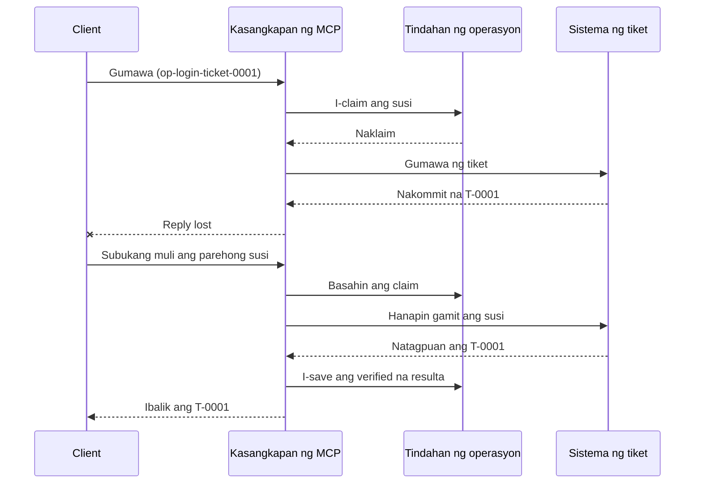
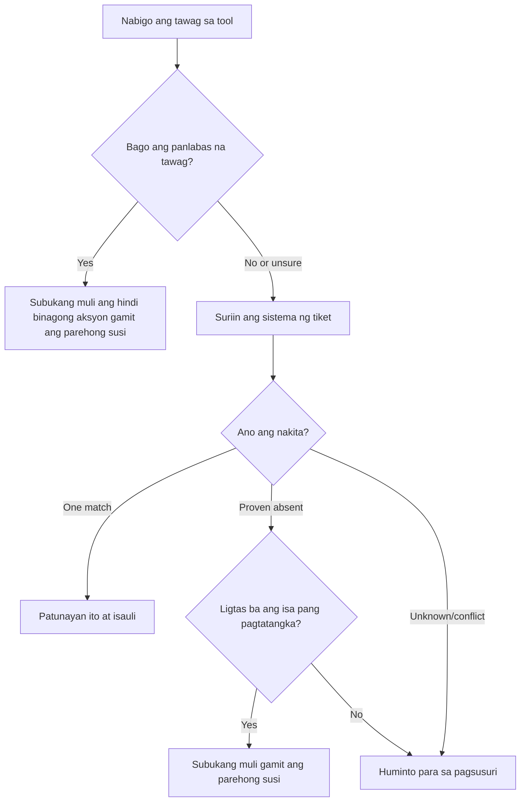

# Ligtas na Pagsubok Muli para sa Mga MCP Tool: Isang Pattern ng Reliability Sidecar

Ang nawawalang tugon ay hindi nangangahulugang nawawala ang aksyon. Maaaring gumawa ang isang tool sa support-ticket
ng tiket na `T-0001` at pagkatapos ay mawalan ng koneksyon bago makita ng kliyente
ang resulta. Kung susubukan muli nang walang pag-iingat ang kliyente, maaaring lumikha ito ng `T-0002`.

Ipinapakita ng araling ito kung paano kilalanin ang hindi tiyak na resulta, panatilihin ang isang matatag na
pagkakakilanlan para sa inaasahang aksyon, at suriin ang sistema ng tiket bago muling
subukan. Ang kalakip na ehersisyong Python ay tumatakbo nang lokal gamit ang standard library
at SQLite.

## Bakit Nangangahulugan ng "Hindi Malamang Resulta" ang Timeout

Ipagpalagay na tumawag ang kliyente sa `create_support_ticket` gamit ang operation key
na `op-login-ticket-0001`:



Nabigo ang koneksyon pagkatapos ma-commit ang tiket ngunit bago dumating ang resulta.
Ang kliyente ay alam lamang na nawawala ang tugon. Hindi nito alam kung ang
tiket ay nawala. Ang muling paggamit ng operation key ay nagpapahintulot sa tool na mahanap at maibalik
ang `T-0001` sa halip na lumikha ng `T-0002`.

## Ano ang Ginagawa ng Reliability Sidecar

Ang reliability sidecar ay application code na nagpapanatili ng estado ng recovery sa paligid ng isang
tool. Maaaring ito ay isang library, middleware, isang serbisyo na suportado ng database, o simpleng
bahagi ng implementasyon ng tool. Hindi ito kailangang isang hiwalay na proseso,
at hindi ito isang MCP protocol feature.

May apat na gawain ang sidecar:

1. i-save ang inaasahang aksyon bago tawagan ang panlabas na sistema;
2. pahintulutan lamang ang isang manggagawa na akuin ang aksyon na iyon;
3. tandaan ang sapat na estado upang maka-recover pagkatapos ng crash; at
4. suriin ang panlabas na sistema kapag hindi sigurado ang resulta.

Ang araling ito ay nakatuon sa panghuling MCP specification `2026-07-28`. Walang protocol-level session ang MCP,
kaya ang operation key ay isang ordinaryong argumento ng tool na suportado ng matibay na estado ng application.
Ang parehong pattern ay gumagana rin sa mga naunang bersyon ng MCP.


## Apat na ID na Nagtutugon sa Iba't Ibang Problema

Ang mga identifier na ito ay magkaugnay, ngunit hindi sila maaaring palitan:

| Identifier | Ano ang ini-identify nito | Nakakaligtas ba sa retry? |
| --- | --- | --- |
| JSON-RPC ID | Isang request at tugon | Hindi; gumamit ng bagong request ID |
| MCP Task ID | Isang pangmatagalang task | Oo; panatilihin ito para sa polling |
| Operation key | Isang inaasahang aksyon | Oo; gamitin muli ito para sa aksyon na iyon |
| Ticket ID | Ang naka-imbak na resulta | Oo; ibalik ito pagkatapos ng beripikasyon |

Nakakatulong ang mga notipikasyon tungkol sa progreso at trace context upang obserbahan ang isang request.
Ang pagkansela ay humihiling na itigil ang gawain. Wala sa mga ito ang pumipigil sa dobleng tiket.

## Gumawa ng Proteksyon

Lumikha ng operation key bago ang unang tawag sa tool at i-save ito kasama ang
workflow. Bawat pagtatangka na lumikha ng parehong inaasahang tiket ay gumagamit ng parehong key:

```json
{
  "operation_key": "op-login-ticket-0001",
  "title": "Cannot sign in"
}
```

Ang ibang inaasahang tiket ay magkakaroon ng bagong key. Sa produksyon, gumawa ng isang opaque,
hindi mahuhulaan na halaga sa halip na ilagay ang datos ng customer sa key.

Narito ang kompletong MCP tool schema na ginamit sa araling ito:

```json
{
  "name": "create_support_ticket",
  "title": "Create support ticket",
  "description": "Creates or recovers one support ticket for an operation key.",
  "inputSchema": {
    "$schema": "https://json-schema.org/draft/2020-12/schema",
    "type": "object",
    "properties": {
      "operation_key": {
        "type": "string",
        "minLength": 16,
        "maxLength": 128,
        "description": "Stable key reused for the same intended action."
      },
      "title": {
        "type": "string",
        "minLength": 1,
        "maxLength": 200
      }
    },
    "required": ["operation_key", "title"],
    "additionalProperties": false
  },
  "outputSchema": {
    "$schema": "https://json-schema.org/draft/2020-12/schema",
    "type": "object",
    "properties": {
      "ticket_id": {
        "type": "string"
      },
      "operation_key": {
        "type": "string"
      },
      "status": {
        "type": "string",
        "const": "verified"
      }
    },
    "required": ["ticket_id", "operation_key", "status"],
    "additionalProperties": false
  }
}
```

Ang authenticated caller identity ay nagmumula sa server context, hindi mula sa
tool input na galing sa modelo. I-scope ang bawat naka-imbak na operasyon sa:

- ang caller na iyon, tenant, o service account;
- ang pangalan at bersyon ng tool; at
- isang hash ng naka-normalize na mga input na nagtatakda ng panlabas na aksyon.

Sinasagot ng input hash ang isang simpleng tanong: "Ito bang retry ay humihiling ng parehong
tiket?" Kung ang key ay pagmamay-ari na ng ibang titulo, tanggihan ang tawag.

Ang pagbabalik ng mas maagang resulta para sa nabagong input ay magtatakip ng isang error sa kontrata.

I-save ang claim gamit ang isang atomic database operation. Ang "Atomic" ay nangangahulugan na dalawang workers
ay hindi parehong makakakita ng walang laman na rekord at parehong magiging may-ari. Hindi sapat ang process-local
lock kapag ang isa pang instance ng server ay maaaring makatanggap ng retry.

Ang workflow ay lumilikha ng key habang ang aksyon ay `planned`. Pagkatapos ay iniimbak ng sample
ang mga estado na ito:

- `claimed`: isang worker ang nagpareserba ng operasyon;
- `completed`: ang ticket system ay nagbalik ng resulta; at
- `verified`: isang pagbabasa mula sa ticket system ang nagpapatunay ng resulta.

Maaaring mag-iwan ng crash ng estado na naka-imbak sa `claimed` kahit na ang ticket ay
nalikha na. Ituring ang bawat nonterminal claim bilang hindi tiyak hanggang sa maayos ito ng panlabas na ebidensya.
Huwag ipalagay na ang `claimed` ay nangangahulugang "walang nangyari."

## Mag-recover Bago Ka Mag-retry

Kapag nabigo ang tawag ng tool, alamin kung ano ang alam bago magpadala ng isa pang external
na pagsusulat:



Ang validation na nabigo bago tawagan ang ticket API ay isang kilalang kabiguan.
I-retry ang hindi nabagong aksyon gamit ang parehong operation key. Kung ang pagwawasto sa input
ay nagbabago sa nilalayong ticket, gumawa ng bagong key para sa bagong aksyon.

Kung maaaring naabot ng kahilingan ang ticket system, i-reconcile muna ito.
Ang reconciliation ay nangangahulugang paghahambing ng naka-save na claim sa authoritative ticket
record. Ibalik ang umiiral na ticket kapag natagpuan ang eksaktong isang tumutugmang rekord.
Mag-retry lamang kung ang ticket ay malinaw na wala at ligtas ang isa pang pagtatangka ayon sa downstream contract.


Hindi palaging konklusibo ang "Not found". Maaaring kailanganin ng isang provider na may eventually consistent
search ang isang nakapirming paghihintay at isa pang tsek. Kung hindi masusuri ang sistema,
nagbibigay ng magkasalungat na resulta, o hindi ligtas na ma-deduplicate ang isa pang pagtatangka,
itigil at iulat ang `outcome unknown`. Ang paghinto dito ay minsang tinatawag na
"failing closed": tumatangging hulaan ng workflow.

## Ebidente, Mga Gawain, at Kanselasyon

Sinasabi ng tugon ng tool kung ano ang iniulat ng tool. Sinasabi ng naka-imbak na checkpoint kung ano ang
naitala ng workflow. Ang pinakamalakas na ebidensya ay galing sa sistema na nagmamay-ari ng
resulta: para sa halimbawa ito, isang pagbabasa mula sa ticket system na nakakita ng eksaktong isang
tumutugmang ticket.

Itugma ang ebidensya sa panganib. Maaaring sapat na ang provider message ID para sa isang
notification na mababa ang panganib. Ang mga bayad, deployments, at mga mapanirang aksyon ay maaaring
mangailangan ng provider status, ledger, o ebidensyang manual na pagsusuri.

Pinapalawak ng MCP Tasks ang pattern na ito para sa pangmatagalang trabaho. Ang Task
ID ay nagpapahintulot sa kliyente na magpatuloy sa polling pagkatapos ng disconnect, ngunit hindi nito tinutukoy
o dineduplicate ang ticket mismo. Kapag ginamit ang Tasks, ang mga pagkakakilanlan ay konektado
ng ganito:

```text
operation key -> Task ID -> ticket ID -> verification evidence
```

Ang kanselasyon ay magkatuwang, hindi rollback. Maaaring malikha pa rin ang ticket
pagkatapos makilala ang kanselasyon, kaya't ang hindi tiyak na resulta ay nangangailangan pa rin ng
reconciliation.

## Patakbuhin ang Failure-Injection Exercise

Ang sample ay gumagamit ng dalawang SQLite files: ang isa ay kumakatawan sa operation store at ang
isa pa ay kumakatawan sa external ticket system. Walang transaksyon na sumasaklaw sa
parehong files. Ang failure ay ini-inject pagkatapos ma-commit ang ticket ngunit bago pa
maitala ng sidecar ang pagkumpleto.

Tinatanggap ng direktang pamamaraan sa Python ang `caller_id` bilang stand-in para sa authenticated
server context. Huwag magdagdag ng `caller_id` sa schema ng model-controlled MCP input.


Hulaan ang resulta bago patakbuhin ang mga pagsusulit:

| Path | Resulta pagkatapos ng retry | Bilang ng Ticket |
| --- | --- | --- |
| Blind retry | Lumilikha ng `T-0002` pagkatapos mawala ang tugon para sa `T-0001` | 2 |

| Guarded retry | Nakakahanap at nagbabalik ng `T-0001` | 1 |

Patakbuhin:

```bash
cd 08-BestPractices/reliability-sidecars/python
python -m unittest discover -p "test_*.py" -v
```

Ipinapakita ng anim na pagsubok na:

1. ang isang blind retry ay lumilikha ng dobleng kopya;
2. ang pagkawala ng tugon kasama ang muling pagsimula ay nakakabawi ng isang tiket mula sa matibay na claim;
3. ang isang verified retry ay muling ginagamit ang na-save na resulta;
4. tinatanggihan ang nabagong input o salungat na panlabas na ebidensya;
5. ang umiiral na claim na walang panlabas na ebidensya ay ligtas na tumitigil; at
6. ang sabay-sabay na mga claim ay tumatanggap ng isang may-ari nang hindi nire-regress ang isang verified na resulta.

Buksan ang halimbawa:

- [Python implementation](../../../../08-BestPractices/reliability-sidecars/python/reliability_sidecar.py)
- [Deterministic tests](../../../../08-BestPractices/reliability-sidecars/python/test_reliability_sidecar.py)

Ang halimbawa ay sadyang hindi isinasama ang stale-claim leases. Ang polisiya sa production takeover
ay nangangailangan ng isang bounded lease, atomic ownership transfer, at isa pang panlabas
na tseke bago isakatuparan.

## Opsyonal na Implementasyon ng Komunidad

Ang Agent Enhancer Utilities ay isang implementasyon ng komunidad ng pattern na ito
sa antas ng aplikasyon. Ang planner nito ang pumipili ng paraan ng pagbawi, habang
ang checkpoint ay nagtatala ng estado ng claim at hindi tiyak na resulta. Ang domain tool o server ng MCP
pa rin ang nagsasagawa at nagbe-verify ng totoong aksyon. Ang serbisyong ito ay hindi bahagi
ng espesipikasyon ng MCP at hindi kinakailangan para sa leksiyon na ito.

| Konsepto ng leksiyon | Bahagi ng Agent Enhancer | Mahalagang limitasyon |
| --- | --- | --- |
| Plano ng pagbawi | `workflow-guard-planner` | Hindi tumatawag sa domain tool |
| Claim at pagbawi | `workflow-checkpoint` | Ang `external_proof` ay nananatiling `false` |
| Eksaktong sidecar replay | `lab.invoke_tool` | Gumagamit ng hiwalay na idempotency key |
| Beripikahin ang totoong aksyon | Destination search/read-back | Ang Domain MCP ang may-ari nito |

Para sa eksaktong retry ng isang sidecar call, tinatanggap ng `lab.invoke_tool` ang panlabas na
`idempotency_key`. Ang key na iyon ang nagtatakda ng sidecar invocation; hindi ito ang
business `operation_key` na ginagamit para sa tiket.

Ang naka-tag na pampublikong kontrata at isang opsyonal na halimbawa na naka-network ay available
dito:

- [Reliability Sidecar Contract v1](https://github.com/artiehinz/Agent-Enhancer-Utilities/blob/v1.6.0/docs/RELIABILITY_SIDECAR_CONTRACT_V1.md)
- [Planner and mock-domain example](https://github.com/artiehinz/Agent-Enhancer-Utilities/tree/v1.6.0/examples/reliability-sidecar)

Ipinapakita ng mga link na ito ang pattern ng aplikasyon. Hindi nila sinasabi na ang
naka-host na serbisyo ay sumusunod sa MCP `2026-07-28`, at ang estado ng checkpoint ay hindi kailanman itinuturing
na panlabas na ebidensya ng tiket.

## Production Checklist

- [ ] Lumikha at i-save ang operation key bago ang unang panlabas na pagsubok.
- [ ] I-bind ang key sa caller, bersyon ng tool, at normalized na hash ng input.
- [ ] Tanggihan ang nabagong input sa ilalim ng umiiral na key.
- [ ] Tumanggap ng isang may-ari gamit ang atomic shared-store operation.
- [ ] I-forward ang key sa downstream provider kapag sinusuportahan nito ang idempotency.
- [ ] I-reconcile ang hindi tiyak na resulta bago ang isa pang pagsusulat.
- [ ] Panatilihin ang mga beripikadong resulta at ebidensya para sa buong retry window.
- [ ] Huminto para sa pagsusuri kapag ang panlabas na resulta ay hindi ligtas na maitakda.

## Mga Sanggunian

- [MCP Specification `2026-07-28`](https://modelcontextprotocol.io/specification/2026-07-28)
- [MCP `2026-07-28` tool guidance](https://modelcontextprotocol.io/specification/2026-07-28/server/tools)
- [MCP Tasks extension](https://modelcontextprotocol.io/extensions/tasks/overview)
- [JSON-RPC 2.0 specification](https://www.jsonrpc.org/specification)

---

<!-- CO-OP TRANSLATOR DISCLAIMER START -->
**Pagtatanggi**:
Ang dokumentong ito ay isinalin gamit ang serbisyo ng AI translation na [Co-op Translator](https://github.com/Azure/co-op-translator). Bagama't nagsusumikap kami para sa katumpakan, pakatandaan na ang awtomatikong pagsasalin ay maaaring maglaman ng mga pagkakamali o hindi pagkakatugma. Ang orihinal na dokumento sa orihinal nitong wika ang dapat ituring na pangunahing sanggunian. Para sa mahahalagang impormasyon, inirerekomenda ang propesyonal na pagsasalin ng tao. Hindi kami mananagot sa anumang maling pagkakaintindi o maling interpretasyon na nagmula sa paggamit ng pagsasaling ito.
<!-- CO-OP TRANSLATOR DISCLAIMER END -->