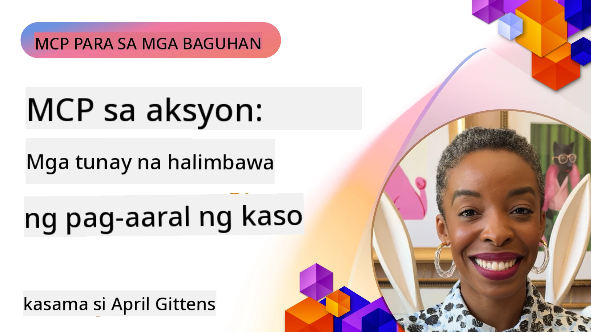

# MCP sa Aksyon: Mga Totoong Pag-aaral ng Kaso

_(I-click ang larawan sa itaas upang mapanood ang video ng araling ito)_

Binabago ng Model Context Protocol (MCP) ang paraan ng pakikipag-ugnayan ng mga AI application sa data, mga kagamitan, at mga serbisyo. Ipinapakita ng seksyong ito ang mga totoong pag-aaral ng kaso na nagpapakita ng praktikal na mga aplikasyon ng MCP sa iba't ibang senaryo ng negosyo.

## Pangkalahatang-ideya

Ipinapakita ng seksyong ito ang mga kongkretong halimbawa ng mga pagpapatupad ng MCP, na nagha-highlight kung paano ginagamit ng mga organisasyon ang protocol na ito upang lutasin ang mga kumplikadong hamon sa negosyo. Sa pag-aaral ng mga pag-aaral ng kaso na ito, makakakuha ka ng mga pananaw sa pagiging versatile, scalability, at praktikal na benepisyo ng MCP sa mga totoong senaryo.

## Mga Pangunahing Layunin ng Pagkatuto

Sa pamamagitan ng pag-explore ng mga pag-aaral ng kaso na ito, iyong:

- Mauunawaan kung paano naiaaplay ang MCP upang lutasin ang mga tiyak na problema sa negosyo
- Matutunan ang iba't ibang mga pattern sa integrasyon at mga arkitekturang pamamaraan
- Makikilala ang mga pinakamahusay na kasanayan para sa pagpapatupad ng MCP sa mga kapaligirang pang-enterprise
- Makakakuha ng mga pananaw sa mga hamon at solusyong naranasan sa mga totoong pagpapatupad
- Matukoy ang mga oportunidad upang i-apply ang magkatulad na mga pattern sa iyong sariling mga proyekto

## Mga Tampok na Pag-aaral ng Kaso

### 1. [Azure AI Travel Agents – Reference Implementation](./travelagentsample.md)

Sinusuri ng pag-aaral ng kasong ito ang komprehensibong reference solution ng Microsoft na nagpapakita kung paano bumuo ng multi-agent, AI-powered na travel planning application gamit ang MCP, Azure OpenAI, at Azure AI Search. Ipinapakita ng proyekto ang:

- Multi-agent orchestration sa pamamagitan ng MCP
- Integrasyon ng data ng enterprise gamit ang Azure AI Search
- Ligtas, scalable na arkitektura gamit ang mga serbisyo ng Azure
- Palawig na tooling gamit ang reusable na mga component ng MCP
- Conversational user experience na pinapaganahan ng Azure OpenAI

Nagbibigay ang mga detalye ng arkitektura at implementasyon ng mahahalagang pananaw sa pagbuo ng kumplikadong multi-agent na mga sistema gamit ang MCP bilang coordination layer.

### 2. [Pag-update ng Azure DevOps Items mula sa YouTube Data](./UpdateADOItemsFromYT.md)

Ipinapakita ng pag-aaral ng kasong ito ang praktikal na aplikasyon ng MCP para sa pag-automate ng mga workflow process. Ipinapakita nito kung paano magagamit ang mga tool ng MCP upang:

- Kunin ang data mula sa mga online platform (YouTube)
- I-update ang mga work item sa Azure DevOps system
- Lumikha ng mga repeatable automation workflow
- Mag-integrate ng data mula sa magkakaibang mga sistema

Ipinapakita ng halimbawa na ito kung paano ang mga simpleng pagpapatupad ng MCP ay maaaring magdulot ng malaking efficiency gains sa pamamagitan ng pag-automate ng mga rutinang gawain at pagpapabuti ng consistency ng data sa mga sistema.

### 3. [Real-Time na Pagkuha ng Dokumentasyon gamit ang MCP](./docs-mcp/README.md)

Ginagabayan ka ng pag-aaral ng kasong ito sa pag-connect ng isang Python console client sa isang Model Context Protocol (MCP) server upang kumuha at mag-log ng real-time, context-aware na dokumentasyon mula sa Microsoft. Matututuhan mo kung paano:

- Kumonekta sa MCP server gamit ang Python client at opisyal na MCP SDK
- Gumamit ng streaming HTTP clients para sa episyente, real-time na pagkuha ng data
- Tawagan ang mga tools sa dokumentasyon sa server at direktang i-log ang mga tugon sa console
- Isama ang napapanahong dokumentasyon ng Microsoft sa iyong workflow nang hindi umaalis sa terminal

Kasama sa kabanatang ito ang praktikal na assignment, minimal na sample code na gumagana, at mga link sa karagdagang mga mapagkukunan para sa mas malalim na pag-aaral. Tingnan ang buong walkthrough at code sa naka-link na kabanata upang maunawaan kung paano mababago ng MCP ang access sa dokumentasyon at productivity ng developer sa mga console-based na kapaligiran.

### 4. [Interactive Study Plan Generator Web App gamit ang MCP](./docs-mcp/README.md)

Ipinapakita ng pag-aaral ng kasong ito kung paano bumuo ng interactive na web app gamit ang Chainlit at ang Model Context Protocol (MCP) upang lumikha ng personalized na mga study plan para sa anumang paksa. Maitatakda ng mga user ang isang subject (halimbawa, "AI-900 certification") at tagal ng pag-aaral (hal., 8 linggo), at magbibigay ang app ng linggo-linggong breakdown ng mga inirekomendang nilalaman. Nagbibigay ang Chainlit ng conversational chat interface, kaya ang karanasan ay engaging at adaptive.

- Conversational web app na pinapagana ng Chainlit
- Mga user-driven na prompts para sa paksa at tagal
- Mga rekomendasyon ng nilalaman linggo-linggo gamit ang MCP
- Real-time, adaptive na mga tugon sa chat interface

Ipinapakita ng proyekto kung paano maaaring pagsamahin ang conversational AI at MCP upang lumikha ng dynamic, user-driven na mga educational tool sa isang modernong web environment.

### 5. [Mga Dokumento sa Editor gamit ang MCP Server sa VS Code](./docs-mcp/README.md)

Ipinapakita ng pag-aaral ng kasong ito kung paano mo maiuugnay ang Microsoft Learn Docs nang direkta sa iyong VS Code environment gamit ang MCP server—hindi na kailangang magpalipat-lipat ng tabs sa browser! Makikita mo kung paano:

- Mabilis na maghanap at magbasa ng docs sa loob ng VS Code gamit ang MCP panel o command palette
- Mag-refer sa dokumentasyon at maglagay ng mga link direkta sa iyong README o markdown files ng kurso
- Pagsamahin ang GitHub Copilot at MCP para sa seamless, AI-powered na workflow ng dokumentasyon at code
- I-validate at pagandahin ang iyong dokumentasyon gamit ang real-time na feedback at katumpakan mula sa Microsoft
- Isama ang MCP sa mga workflow ng GitHub para sa tuloy-tuloy na pag-validate ng dokumentasyon

Kasama sa implementasyon ang:

- Halimbawang `.vscode/mcp.json` configuration para sa madaling setup
- Mga screenshot-based walkthrough ng karanasan sa loob ng editor
- Mga tip para pagsamahin ang Copilot at MCP para sa pinakamataas na productivity

Ang senaryong ito ay perpekto para sa mga author ng kurso, manunulat ng dokumentasyon, at mga developer na nais manatiling nakatuon sa kanilang editor habang nagtatrabaho sa mga docs, Copilot, at mga validation tool—lahat ay pinapagana ng MCP.

### 6. [Paglikha ng APIM MCP Server](./apimsample.md)

Nagbibigay ang pag-aaral ng kasong ito ng step-by-step na gabay kung paano gumawa ng MCP server gamit ang Azure API Management (APIM). Tinatalakay nito ang:

- Pag-setup ng MCP server sa Azure API Management
- Pagkakalantad ng API operations bilang mga MCP tools
- Pag-configure ng mga polisiya para sa rate limiting at seguridad
- Pagsusuri ng MCP server gamit ang Visual Studio Code at GitHub Copilot

Ipinapakita ng halimbawa na ito kung paano magamit ang mga kakayahan ng Azure upang makalikha ng matatag na MCP server na maaaring gamitin sa iba't ibang aplikasyon, pinapalakas ang integrasyon ng mga AI system sa enterprise APIs.

### 7. [GitHub MCP Registry — Pagpapabilis ng Agentic Integration](https://github.com/mcp)

Sinusuri ng pag-aaral ng kasong ito kung paano tinutugunan ng GitHub MCP Registry, na inilunsad noong Setyembre 2025, ang kritikal na hamon sa AI ecosystem: ang pira-pirasong pagtuklas at pag-deploy ng Model Context Protocol (MCP) servers.

#### Pangkalahatang-ideya
Nilulutas ng **MCP Registry** ang lumalaking problema ng magkahiwalay na MCP servers sa iba't ibang repositoryo at registry, na nagpapabagal at nagiging prone sa error ang integrasyon noon. Pinagana ng mga server na ito ang mga AI agent na makipag-ugnayan sa mga external na sistema tulad ng mga API, database, at mga pinagmumulan ng dokumentasyon.

#### Pahayag ng Suliranin
Nakaranas ang mga developer na gumagawa ng agentic workflows ng mga sumusunod na suliranin:
- **Mahinang pagkakatuklas** ng MCP servers sa iba't ibang platform
- **Nauulit-ulit na mga tanong sa setup** na pira-piraso sa mga forum at dokumentasyon
- **Mga panganib sa seguridad** mula sa hindi beripikado at hindi pinagkakatiwalaang mga pinagmulan
- **Kakulangan ng standardisasyon** sa kalidad at kompatibilidad ng server

#### Arkitektura ng Solusyon
Pinagsasama ng MCP Registry ng GitHub ang mga pinagkakatiwalaang MCP server na may mga pangunahing tampok:
- **One-click install** na integrasyon via VS Code para sa napadaling setup
- **Signal-over-noise sorting** batay sa stars, aktibidad, at community validation
- **Direktang integrasyon** sa GitHub Copilot at iba pang MCP-compatible na tools
- **Open contribution model** na nagpapahintulot sa community at mga enterprise partner na mag-ambag

#### Epekto sa Negosyo
Naghatid ang registry ng nasusukat na mga pagpapabuti:
- **Mas mabilis na onboarding** para sa mga developer gamit ang mga tool katulad ng Microsoft Learn MCP Server, na nag-stream ng opisyal na dokumentasyon diretso sa mga agent
- **Pinahusay na productivity** sa pamamagitan ng mga specialized server tulad ng `github-mcp-server`, na nagpapagana ng natural language GitHub automation (paglikha ng PR, CI reruns, pagsusuri ng code)
- **Mas matatag na tiwala sa ekosistema** sa pamamagitan ng curated na listahan at transparent na mga pamantayan ng configuration

#### Halaga sa Estratehiya
Para sa mga practitioner na dalubhasa sa agent lifecycle management at reproducible workflows, ang MCP Registry ay nagbibigay ng:
- **Modular na deployment ng agent** gamit ang standardized na mga component
- **Registry-backed evaluation pipelines** para sa consistent na pagsubok at validation
- **Cross-tool interoperability** na nagpapagana ng tuloy-tuloy na integrasyon sa iba't ibang AI platform

Ipinapakita ng pag-aaral ng kasong ito na ang MCP Registry ay higit pa sa isang direktoryo—ito'y isang pundamental na plataporma para sa scalable, totoong paggamit ng model integration at pag-deploy ng agentic system.

### 8. [Pag-publish sa Social Networks mula sa isang Agent](./publora-social-publishing.md)

Pinapakita ng pag-aaral ng kasong ito ang isang **write-capable na remote MCP server** — na ang mga tool ay nagsasagawa ng hindi na mababaling aksyon sa ngalan ng user — gamit ang social publishing bilang bagong halimbawa. Ang isang agent ay gumagawa ng draft ng post, ini-approve ito ng tao, at saka ito isinaschedule ng server sa mga network.

Ang interesante rito ay ang mga design constraints na ipinapataw ng publishing, na naaangkop sa anumang server na sumusulat sa halip na nagbabasa:

- **Open discovery, authenticated execution** — ang `tools/list` ay sinasagot nang walang credentials upang makapag-introspect ang mga registry at kliyente, samantalang bawat `tools/call` ay nangangailangan ng token at kung wala, magbabalik ito ng `401` kasama ang `WWW-Authenticate` header
- **OAuth registration nang walang out-of-band na hakbang** — dynamic client registration ngayon, gamit ang Client ID Metadata Documents bilang direksyon na tinuturo ng `2026-07-28` na espesipikasyon
- **Tool annotations** (`readOnlyHint`, `destructiveHint`, `idempotentHint`) na ginagamit ng mga kliyente upang mag-desisyon kung ano ang i-confirm — mga pahiwatig sa halip na pagpapatupad, at isang bagay na inaasahan na ngayon ng connector directory sa review
- **Hindi mapapasubalian na mga identifier**, kaya ang isang hallucinated na halaga ay maliwanag na magf-fail sa halip na kumilos sa isang mukhang plausible
- **Mga idempotency keys sa post-creating tools**, kaya ang pag-uulit ng agent runtime ay hindi magreresulta sa duplicate na pag-publish
- **Isang no-op target na inilarawan sa tool schema** na sinusuri ang buong write path at hindi nagpapublish ng anuman, para sa mga reviewer at CI

Nagtatapos ang kabanata sa isang maikling checklist na maaari mong gamitin sa isang server na iyong binubuo.

## Konklusyon

Ipinapakita ng walong komprehensibong pag-aaral ng kaso na ito ang kahanga-hangang versatility at praktikal na mga aplikasyon ng Model Context Protocol sa iba't ibang totoong senaryo. Mula sa kumplikadong multi-agent travel planning systems at enterprise API management hanggang sa streamline na workflows ng dokumentasyon at ang rebolusyonaryong GitHub MCP Registry, ipinapakita ng mga halimbawa kung paano nagbibigay ang MCP ng standardized, scalable na paraan upang ipag-ugnay ang mga AI system sa mga kagamitan, data, at serbisyo na kailangan nila upang maghatid ng pambihirang halaga.

Sumasaklaw ang mga pag-aaral ng kaso sa maraming dimensyon ng pagpapatupad ng MCP:
- **Enterprise Integration**: Azure API Management at Azure DevOps automation
- **Multi-Agent Orchestration**: Travel planning gamit ang koordinadong mga AI agent
- **Developer Productivity**: VS Code integration at real-time na pag-access sa dokumentasyon
- **Ecosystem Development**: Ang MCP Registry ng GitHub bilang pundamental na plataporma
- **Educational Applications**: Interactive na mga study plan generator at mga conversational interface

Sa pag-aaral ng mga pagpapatupad na ito, makakakuha ka ng mahahalagang pananaw sa:
- **Arkitekturang pattern** para sa iba't ibang scale at gamit
- **Mga estratehiya ng pagpapatupad** na nagbabalanse ng functionality at maintainability
- **Seguridad at scalability** na mga konsiderasyon para sa production deployment
- **Pinakamahusay na kasanayan** para sa pag-develop ng MCP server at client integration
- **Pag-iisip ng ekosistema** para sa pagbuo ng magkakaugnay na AI-powered na solusyon

Ang mga halimbawa ng kolektibong ito ay nagpapakita na ang MCP ay hindi lamang isang teoretikal na balangkas kundi isang mature at handang gamitin na protocol na nagpapagana ng praktikal na solusyon sa mga kumplikadong problema sa negosyo. Kung ikaw man ay gumagawa ng simpleng automation tools o mas sopistikadong multi-agent na mga sistema, ang mga pattern at pamamaraan na ipinakita dito ay nagbibigay ng matibay na pundasyon para sa iyong mga proyekto sa MCP.

## Karagdagang Mga Mapagkukunan

- [Azure AI Travel Agents GitHub Repository](https://github.com/Azure-Samples/azure-ai-travel-agents)
- [Azure DevOps MCP Tool](https://github.com/microsoft/azure-devops-mcp)
- [Playwright MCP Tool](https://github.com/microsoft/playwright-mcp)
- [Microsoft Docs MCP Server](https://github.com/MicrosoftDocs/mcp)
- [GitHub MCP Registry — Pagpapabilis ng Agentic Integration](https://github.com/mcp)
- [MCP Community Examples](https://github.com/microsoft/mcp)

## Ano ang Susunod

- Nakaraan: [Module 8: Best Practices](../08-BestPractices/README.md)
- Susunod: [Module 10: Streamlining AI Workflows: Building an MCP Server with AI Toolkit](../10-StreamliningAIWorkflowsBuildingAnMCPServerWithAIToolkit/README.md)

---

<!-- CO-OP TRANSLATOR DISCLAIMER START -->
**Pagtatanggi**:
Ang dokumentong ito ay isinalin gamit ang serbisyo ng AI translation na [Co-op Translator](https://github.com/Azure/co-op-translator). Bagama't nagsusumikap kami para sa katumpakan, pakatandaan na ang awtomatikong pagsasalin ay maaaring maglaman ng mga pagkakamali o hindi pagkakatugma. Ang orihinal na dokumento sa orihinal nitong wika ang dapat ituring na pangunahing sanggunian. Para sa mahahalagang impormasyon, inirerekomenda ang propesyonal na pagsasalin ng tao. Hindi kami mananagot sa anumang maling pagkakaintindi o maling interpretasyon na nagmula sa paggamit ng pagsasaling ito.
<!-- CO-OP TRANSLATOR DISCLAIMER END -->