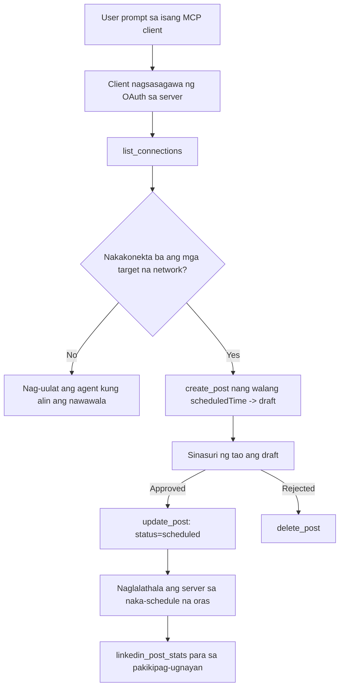

# Pag-aaral ng Kaso: Pag-publish sa mga Social Network mula sa isang Ahente na may Remote MCP Server

> **Paalala:** Maraming mga serbisyo at open-source na proyekto ang maaaring mag-publish sa mga social network, at maaaring direktang i-integrate ng isang koponan ang API ng bawat network. Ang senaryong nasa ibaba ay isang halimbawa kung paano maaaring idisenyo at gamitin ang isang **write-capable remote MCP server**. Ang Publora ay isang komersyal na serbisyo na may libreng tier; ang mga pattern na inilarawan dito ay naaangkop sa anumang MCP server na gumagawa ng mga hindi mababaling aksyon para sa isang user.

## Pangkalahatang-ideya

Magaling ang mga ahente sa paggawa ng draft ng nilalaman ngunit hindi sa paghahatid nito. Maaaring makabuo ang isang modelo ng anunsyo sa loob ng ilang segundo, tapos humihinto ang trabaho: ang pag-publish nito ay nangangailangan ng isang API sa bawat network, isang OAuth app kada network, at iba’t ibang mga patakaran sa media para sa bawat isa. Karamihan sa mga koponan ay nagagawa ito sa pamamagitan ng mano-manong pagkopya ng teksto sa browser.

Tinutukoy ng pag-aaral na ito kung paano nagsasara ang huling hakbang sa pamamagitan ng isang solong remote MCP server, at — mas kapaki-pakinabang para sa sinumang bumubuo nito — sa mga desisyong disenyo na kailangang maitama ng isang **write-capable** server. Ang pagbabasa ng data ay mapagpatawad. Ang pag-publish ay hindi: ang maling tawag sa tool ay makikita ng audience at hindi na maaaring bawiin.

## Senaryo

Ang isang maliit na koponan ng developer-relations ay gumagawa ng mga draft ng post sa loob ng ahente (Claude, VS Code, Cursor — hindi mahalaga ang client). Nais nila na ang ahente ay:

- makita kung aling mga social account ang nakakonekta ng koponan,
- gumawa ng draft ng post at panatilihin ito bilang draft para aprubahan ng tao,
- maglakip ng imahe,
- mag-iskedyul nito sa ilang mga network sa napiling oras,
- at mag-ulat sa kalaunan kung paano ito nagganap.

Mahalaga, nais nilang *hindi* makapag-publish nang aksidente ang ahente habang sila ay nagsusubok pa lamang.

## Mga Ginamit na Tool

- [Publora MCP Server](https://github.com/publora/mcp-server) — isang remote MCP server (`streamable-http`) na naglalantad ng mga tool para sa pag-publish, pag-iskedyul, media at LinkedIn analytics. Nakarehistro sa opisyal na MCP registry bilang `com.publora/mcp-server`.

## Hakbang-hakbang na Workflow

1. **Ikonekta ang server.** Ang mga client na gumagamit ng OAuth ay tinatapos ang authorization-code flow na may PKCE laban sa sariling consent screen ng server; ang mga client na hindi, tulad ng headless CLI, ay gumagamit ng Publora API key sa header. Suportado ang parehong paraan, at alin man ang makukuha mo ay depende sa client, hindi sa server.
2. **Ilista ang mga koneksyon.** Tinatawag ng ahente ang `list_connections` at natatanggap ang mga nakakonektang account kasama ang kanilang mga identifier.
3. **Gumawa ng draft.** Tinatawag ng ahente ang `create_post` *nang walang* naka-iskedyul na oras. Ang post ay iniimbak bilang draft — walang naipublish.
4. **Maglakip ng media.** Ipinapasa ang mga pampublikong URL ng imahe sa parehong tawag; dinadownload at kinukumpirma ng server ang mga ito.
5. **Mag-iskedyul.** Pagkatapos aprubahan ng tao, tinatakda ng `update_post` ang status sa scheduled gamit ang ISO 8601 na oras.
6. **Sukatin.** Para sa LinkedIn, ibinabalik ng `linkedin_post_stats` ang engagement kapag live na ang post.

## Halimbawa ng Prompt

```text
Which social accounts do I have connected?
Draft a post announcing our new changelog page, attach the screenshot at
https://example.com/changelog.png, and keep it as a draft — do not publish it.
Once I approve, schedule it to LinkedIn and Bluesky for tomorrow at 09:00 UTC.
```

## Mermaid Flowchart



## Teknikal na Pagpapatupad

Ang mga aral sa ibaba ay ang mga maaaring ilipat na bahagi ng pag-aaral na ito.

### Bukas na pagtuklas, na-authenticate na pagpapatupad

Ang `tools/list` ay ipinapasa nang walang credentials; bawat `tools/call` ay nangangailangan ng token
at kung hindi, nagbabalik ng `401` na may `WWW-Authenticate` na header na nagtuturo sa
protected-resource metadata. Ang legacy endpoint ng server ay tumutugon din sa
hindi-authenticated na `initialize` para sa mga client na nasa mga bersyon ng protocol bago
`2026-07-28`; ang kasalukuyang mga client ay hindi na gumagamit ng handshake na iyon.

Ang paghahati na ito na specific sa server ay nagpapahintulot sa mga registry, katalogo, at mga client na inspeksyunin ang mga pangalan ng tool,
schema, at anotasyon nang walang sikreto habang pinipigilan ang anonymous
na pagpapatupad. Ang bukas na pagtuklas ay isang pagpipiliang deployment, hindi isang kinakailangan ng MCP; ang
isang sinesegurowang deployment ay maaaring mangailangan din ng awtorisasyon para sa `tools/list`.

### Rehistrasyon: dynamic client registration, at ano ang pumapalit dito

Ipinapahayag ng server ang `/.well-known/oauth-protected-resource` at `/.well-known/oauth-authorization-server`, at sinusuportahan ang authorization-code flow na may PKCE (`S256`), refresh tokens, at **dynamic client registration**.

Tinanggal ng dynamic registration ang manwal na hakbang para sa mga legacy client: kung wala ito,
bawat client ay kailangan ng naunang `client_id` mula sa vendor.

Ituring ito bilang compatibility behaviour at hindi bilang disenyo na kokopyahin. Binabawal ng rebisyon ng specification noong `2026-07-28` ang dynamic client registration pabor sa Client ID Metadata Documents, kung saan nagho-host ang client ng metadata document sa isang matatag na HTTPS URL at ang URL na iyon *ay* ang `client_id`. Patuloy pa rin ang DCR ngayon, pero ang isang server na ginagawa ngayon ay dapat magplano para sa CIMD at panatilihin ang DCR para lamang sa mga lumang client.

### Hindi dekorasyon ang mga anotasyon ng tool

Bawat tool ay may `title` at mga naaangkop na pahiwatig: `readOnlyHint`, `destructiveHint`, `idempotentHint`, `openWorldHint`.

Dalawang dahilan para pag-ibayuhin ang mga ito. Una, ginagamit ng mga client ang mga pahiwatig upang magpasya kung ano ang dapat i-confirm sa user — maaaring awtomatikong patakbuhin ng isang client ang isang read-only lookup at huminto para sa pag-apruba bago mag-delete. Malinaw sa specification na ang mga anotasyon ay mga hindi pinagkakatiwalaang pahiwatig, hindi mekanismo ng awtorisasyon: nililikha nila kung ano ang inaalok ng client, hindi nito pinipigilan ang anumang bagay sa server, at dapat pa ring ipatupad ng server ang sarili nitong mga patakaran. Pangalawa, ang mga pangunahing directory ng connector ngayon ay *nangangailangan* nito para sa review; ang isang server na ang mga tools ay walang pamagat at pahiwatig ay ibabalik kahit gaano pa ito kagana.

### Gawing hindi mahuhulaan ang mga identifier

Ang mga platform identifier ay opaque strings na ibinabalik ng `list_connections`, at malinaw na sinasabi ng schema description na dapat kopyahin ang mga ito nang eksakto at hindi hulaan. Tinanggihan ng server ang anumang iba pa.

Magaling sa paghuhula ang mga modelo. Ang kahit anong write-capable server ay dapat mag-assume na may identifier na balak mapanghula at dapat gumawa ng maliwanag at maagang pagkabigo sa ganitong pangyayari, kaysa iakto ang isang kahawig na halaga.

### Mag-fail bago mag-publish, na may makatwirang mensahe

May ilang network na tumatanggi sa text-only posts at nangangailangan ng imahe o video. Kinukumpirma ito kapag ang post ay naka-iskedyul na, at nilalagay ng error ang pangalan ng platform at ang kulang na pangangailangan.

Maaaring makabangon ang ahente mula sa "Instagram requires media — maglakip ng imahe o video" nang walang dagdag na pagbalik. Hindi ito makakabangon mula sa pangkalahatang `400`.

### Gawing ligtas ang mga retry

Ang dalawang tool na lumilikha ng nilalaman, `create_post` at `update_post`, ay tumatanggap ng isang idempotency key: ang muling paggamit nito sa magkatulad na kahilingan ay inuulit ang orihinal na tugon sa halip na gumawa ng pangalawang post. Nagre-retry ang mga agent runtime sa mga timeout; kung walang idempotency, ang mabagal na tugon ay nagdudulot ng duplicate na pag-publish. Ang iba pang mga write tool — deletions, media steps, LinkedIn reactions at comments — ay hindi tumatanggap nito, kaya ang pag-retry doon ay hindi awtomatikong ligtas. Magandang malaman kung alin sa iyong mga pagbabago ang protektado at alin ang hindi.

### Magbigay ng paraan na subukan na walang nai-publish

Tinatanggap ng server ang isang reserved target, `publora-playground`, na kinukumpirma at kinikilala tulad ng totoong destinasyon at pagkatapos ay tinatanggihan — walang umaabot sa isang live na account. Inilarawan ito sa mismong schema ng tool, na maaaring basahin ng anumang client nang walang credentials: ang `platforms` field ng `create_post` ay nagdodokumento nito bilang "isang connection-test target na hindi nangangailangan ng totoong koneksyon — kinikilala at tinatanggihan ang post, walang naipublish". Tawagin ito sa pamamagitan ng pagpasa nito bilang nag-iisang entry: `platforms: ["publora-playground"]`.

Ito ay isa sa pinaka-kapaki-pakinabang na detalye sa buong surface. Pinapayagan ng mga reviewer ng connector directory, mga contributor at CI na maisagawa ang buong write path mula simula hanggang dulo nang walang panganib sa totoong audience. Anumang MCP server na may hindi mababalik na aksyon ay nakikinabang mula sa dokumentadong no-op target.

## Mga Resulta at Epekto

- Ang hakbang ng pag-publish ay nailipat mula sa browser papunta sa parehong usapan kung saan isinusulat ang nilalaman, at ang draft-first na gawi ay nagpapanatili ng tao sa loop. Maging tumpak sa kung ano ang ibig sabihin nito: ang draft ay isang kaugalian, hindi isang hangganan. Ang parehong credential ay maaaring mag-iskedyul o mag-publish, kaya ang sinumang nangangailangan ng tunay na aprubal ay kailangang ipatupad ito sa labas ng tool surface — hiwalay na credentials, o isang patakaran sa harap ng server.
- Ang mga pagkakaiba-iba sa bawat network — mga pangangailangan sa media, threading, reply controls — ay pinangangasiwaan nang isang beses sa server sa halip na bawat ahenteng nakikipag-usap dito.
- Ang parehong server ay sumusuporta sa ilang MCP client nang walang paunang inilabas na credentials.
    Maaaring gumamit ang mga kasalukuyang client ng Client ID Metadata Documents; nananatiling fallback
    ang DCR para sa mga lumang client.
- Ang mga constraints sa disenyo sa itaas ay hinubog ng mga review sa connector directory pati na rin ng mga user: ang mga anotasyon, OAuth at isang ligtas na test target ay hinihingi ng kahit isa sa kanila.

## Mga Sanggunian

- [Publora MCP Server (source)](https://github.com/publora/mcp-server)
- [Publora API and MCP documentation](https://docs.publora.com)
- [MCP Registry entry: `com.publora/mcp-server`](https://registry.modelcontextprotocol.io/v0/servers?search=com.publora/mcp-server)
- [MCP specification — Authorization](https://modelcontextprotocol.io/specification/2026-07-28/basic/authorization)
- [MCP specification — Tool annotations](https://modelcontextprotocol.io/docs/concepts/tools)

## Ano ang Susunod

- Kunin ang MCP server na iyong binubuo at tingnan ang tatlong pinakamurang mga pagpapabuti dito: mga anotasyon sa bawat tool, isang idempotency key sa bawat pagsusulat, at isang dokumentadong no-op target.
- Subukan ang paghahati ng open-discovery: tawagan ang `tools/list` laban sa isang pampublikong remote server nang walang credentials, pagkatapos tawagan ang isang tool at inspeksyunin ang `401` na hamon.
- Isaalang-alang kung ano ang ibig sabihin ng "undo" para sa iyong domain. May mga draft at pagtanggal ang pag-publish; kung walang katumbas ang iyong mga aksyon, ang kumpirmasyon ay dapat nasa disenyo ng tool, hindi sa prompt.

---

<!-- CO-OP TRANSLATOR DISCLAIMER START -->
**Pagtatanggi**:
Ang dokumentong ito ay isinalin gamit ang serbisyo ng AI translation na [Co-op Translator](https://github.com/Azure/co-op-translator). Bagama't nagsusumikap kami para sa katumpakan, pakatandaan na ang awtomatikong pagsasalin ay maaaring maglaman ng mga pagkakamali o hindi pagkakatugma. Ang orihinal na dokumento sa orihinal nitong wika ang dapat ituring na pangunahing sanggunian. Para sa mahahalagang impormasyon, inirerekomenda ang propesyonal na pagsasalin ng tao. Hindi kami mananagot sa anumang maling pagkakaintindi o maling interpretasyon na nagmula sa paggamit ng pagsasaling ito.
<!-- CO-OP TRANSLATOR DISCLAIMER END -->