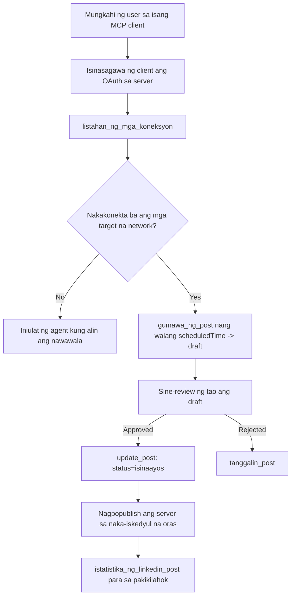

# Case Study: Paglalathala sa Mga Social Network mula sa Isang Ahente gamit ang Remote MCP Server

> **Paunawa:** Maraming serbisyo at open-source na proyekto ang maaaring maglathala sa mga social network, at maaari ring isama ng isang koponan ang API ng bawat network nang direkta. Ang sumusunod na senaryo ay ibinigay bilang isang halimbawa kung paano maaaring idisenyo at gamitin ang isang **write-capable remote MCP server**. Ang Publora ay isang komersyal na serbisyo na may libreng tier; ang mga pattern na inilarawan dito ay naaangkop sa anumang MCP server na nagsasagawa ng hindi na mababalik na mga aksyon sa ngalan ng gumagamit.

## Pangkalahatang Ideya

Magaling ang mga ahente sa paggawa ng draft ng nilalaman ngunit mahina sa paghahatid nito. Maaaring magsulat ang isang modelo ng anunsyo ng release sa loob ng ilang segundo, at pagkatapos ay humihinto ang trabaho: nangangahulugan ang paglalathala nito ng isang API para sa bawat network, isang OAuth app para sa bawat network, at magkakaibang hanay ng mga patakaran sa media para sa bawat isa. Karamihan sa mga koponan ay nilulutas ito sa pamamagitan ng pagkopya ng teksto sa isang browser nang mano-mano.

Tiningnan sa case study na ito kung paano nasasara ang huling hakbang gamit ang isang remote MCP server lamang, at — mas kapaki-pakinabang para sa sinumang bumubuo nito — sa mga desisyon sa disenyo na kailangang tama ng isang **write-capable** server. Ang pagbasa ng data ay may patawad. Ang paglalathala ay hindi: ang maling tawag sa tool ay nakikita ng publiko at hindi maaaring bawiin.

## Senaryo

Isang maliit na koponan sa developer-relations ang gumagawa ng mga post sa loob ng isang ahente (Claude, VS Code, Cursor — walang importansya ang client). Gusto nilang ang ahente ay:

- makita kung alin sa mga social account ang nakakonekta ng koponan,
- gumawa ng draft ng post at itago ito bilang draft para aprubahan ng tao,
- maglakip ng larawan,
- iskedyul ito sa ilang mga network sa napiling oras,
- at sa kalaunan iulat kung paano ito nag-perform.

Mahalaga, gusto nilang *hindi* makapag-publish ang ahente nang aksidenteng habang sila ay nag-eeksperimento pa lang.

## Mga Ginamit na Tools

- [Publora MCP Server](https://github.com/publora/mcp-server) — isang remote MCP server (`streamable-http`) na nagpapakita ng mga tool para sa paglalathala, pag-iskedyul, media at LinkedIn analytics. Nakarehistro sa opisyal na MCP registry bilang `com.publora/mcp-server`.

## Hakbang-hakbang na Workflow

1. **Ikonekta ang server.** Ang mga client na gumagamit ng OAuth ay kumukumpleto ng authorization-code flow na may PKCE laban sa consent screen ng server; ang mga client na hindi, tulad ng headless na CLI, ay gumagamit ng Publora API key sa header. Suportado ang parehong mga paraan, at alin ang makukuha mo ay depende sa client, hindi sa server.
2. **Ilista ang mga koneksyon.** Tumatawag ang ahente ng `list_connections` at tumatanggap ng mga nakakonektang account kasama ang kanilang mga identifier.
3. **Gumawa ng draft.** Tumatawag ang ahente ng `create_post` *nang walang* naka-iskedyul na oras. Ang post ay iniimbak bilang draft — walang nalathala.
4. **Maglakip ng media.** Ipinapasa ang mga pampublikong URL ng larawan sa parehong tawag; dinadownload at nire-validate ng server ang mga ito.
5. **Mag-iskedyul.** Pagkatapos aprubahan ng tao, itinatakda ng `update_post` ang status bilang naka-iskedyul gamit ang oras na ISO 8601.
6. **Sukatin.** Para sa LinkedIn, ibinabalik ng `linkedin_post_stats` ang engagement kapag live na ang post.

## Halimbawang Prompt

```text
Which social accounts do I have connected?
Draft a post announcing our new changelog page, attach the screenshot at
https://example.com/changelog.png, and keep it as a draft — do not publish it.
Once I approve, schedule it to LinkedIn and Bluesky for tomorrow at 09:00 UTC.
```

## Mermaid Flowchart



## Teknikal na Implementasyon

Ang mga aral sa ibaba ay ang maaaring ilipat na bahagi ng case study na ito.

### Bukas na pagtuklas, authenticated na pagpapatupad

Ang `tools/list` ay ibinibigay nang walang kredensyal; bawat `tools/call` ay nangangailangan ng token at kung hindi ay nagbabalik ng `401` na may `WWW-Authenticate` na header na nagtuturo sa metadata ng protected-resource. (Sinasagot din ng server ang hindi authenticated na `initialize`, na mahalaga lamang para sa mga client sa mga protocol version bago ang `2026-07-28`; tinanggal ng rebisyon na iyon ang handshake nang buo.)

Mahalaga ang paghahati na ito sa pagsasanay. Maaari ng mga registries, katalogo at client na suriin ang tool surface — mga pangalan, schema, anotasyon — nang hindi nagtatago ng lihim, habang walang kahit ano ang maaaring *ipatupad* nang anonymous. Ang server na nangangailangan ng token para sa `initialize` ay epektibong invisible sa mga tooling; ang server na nagpapahintulot ng anonymous na `tools/call` ay isang liability.

### Rehistrasyon: dynamic client registration, at ano ang pumalit dito

Inaanunsyo ng server ang `/.well-known/oauth-protected-resource` at `/.well-known/oauth-authorization-server`, at sinusuportahan ang authorization-code flow na may PKCE (`S256`), refresh tokens, at **dynamic client registration**.

Inaalis ng dynamic registration ang manwal na hakbang: kung wala ito, bawat client ay nangangailangan ng pre-issued na `client_id`, na nangangahulugang isang out-of-band na kahilingan sa vendor para sa bawat bagong client.

Itratong ito bilang compatibility behavior kaysa bilang disenyo na kokopyahin. Ang `2026-07-28` na rebisyon ng espesipikasyon ay nagde-deprecate ng dynamic client registration pabor sa Client ID Metadata Documents, kung saan ang client ang nagho-host ng metadata document sa isang matatag na HTTPS na URL at ang URL na iyon *ay* ang `client_id`. Patuloy pa ring gumagana ang DCR, ngunit dapat magplano para sa CIMD at panatilihin ang DCR para lang sa mga lumang client ang server na binubuo ngayon.

### Hindi upang palamuti lang ang mga anotasyon ng tool

Bawat tool ay may `title` at mga angkop na hint: `readOnlyHint`, `destructiveHint`, `idempotentHint`, `openWorldHint`.

May dalawang dahilan para pag-ukulan ito ng pansin. Una, ginagamit ng client ang mga hint para magdesisyon kung ano ang kokumpirmahin sa user — maaaring awtomatikong patakbuhin ng client ang read-only lookup at huminto muna para sa pag-apruba bago mag-delete. Eksplisitong sinasabi ng espesipikasyon na ang mga anotasyon ay hindi pinagkakatiwalaang hint, hindi mekanismo ng awtorisasyon: nililinya nila kung ano ang iniaalok gawin ng client, hindi sila pumipigil sa anumang aksyon sa server, at kailangang ipatupad pa rin ng server ang sarili nitong mga patakaran. Pangalawa, hinihingi na ngayon ng pangunahing mga connector directory ang mga ito para sa pagsusuri; ang server na walang mga title at hint sa tools ay ibabalik kahit gaano pa ito kabilis gumana.

### Gawing hindi mahulaan ang mga identifier

Ang mga platform identifier ay mga opaque na string na binabalik ng `list_connections`, at sinasabi ng paglalarawan ng schema nang tahasan na dapat silang kopyahin nang eksakto at wag hulaan. Tinanggihan ng server ang anumang iba pa.

Marunong manghula ang mga modelo. Dapat ipalagay ng anumang write-capable server na ang isang identifier ay maaaring imahinahin balang araw at gawing maliwanag at maagang mabigo ang daang iyon, kaysa umaksyon sa isang mukhang kapani-paniwala na halaga.

### Mabigo bago mag-publish, na may mensaheng maaaring pagkilosan

May ilang network na tumatanggi sa text-only na mga post at nangangailangan ng larawan o video. Nivavalidate iyon kapag na-iskedyul na ang post, at binabanggit ng error ang platform at ang nawawalang requirement.

Maaaring maka-recover ang ahente mula sa "Instagram requires media — maglakip ng larawan o video" nang hindi na nagpapadala pang muli. Hindi ito makakarekober mula sa pangkalahatang `400`.

### Gawing ligtas ang mga ulit-ulitin

Ang dalawang tool na lumilikha ng nilalaman, `create_post` at `update_post`, ay tumatanggap ng idempotency key: kapag ginamit muli ito nang may kaparehong kahilingan ay inuulit ang orihinal na tugon sa halip na gumawa ng pangalawang post. Ang mga runtime ng ahente ay nagri-retry kapag nag-timeout; kung walang idempotency, ang mabagal na tugon ay nagiging duplikadong paglalathala. Ang ibang write tools — deletions, media steps, LinkedIn reactions at comments — ay hindi tumatanggap nito, kaya ang retry doon ay hindi awtomatikong ligtas. Mabuting malaman kung alin sa iyong mga mutasyon ang protektado at kung alin ang hindi.

### Magbigay ng paraan para subukan na walang nalalathala

Tumatanggap ang server ng isang reserved target, `publora-playground`, na vine-validate at kinikilala tulad ng totoong destinasyon at pagkatapos ay itinatapon — walang anuman ang umaabot sa isang live na account. Inilarawan ito mismo sa schema ng tool, na maaaring basahin ng anumang client nang walang kredensyal: ang `platforms` field ng `create_post` ay nagdodokumento nito bilang "isang connection-test target na hindi nangangailangan ng tunay na koneksyon — kinikilala at itinatapon ang post, walang nalalathala". Tawagin ito sa pamamagitan ng pagpasa nito bilang nag-iisang entry: `platforms: ["publora-playground"]`.

Ito ang isa sa pinaka-kapaki-pakinabang na detalye sa buong surface. Maaari ng mga tagasuri ng connector directory, mga contributor at CI na subukin ang buong write path nang walang panganib sa totoong madla. Anumang MCP server na may hindi na mababaling mga aksyon ay nakikinabang mula sa dokumentadong no-op target.

## Mga Resulta at Epekto

- Ang hakbang sa paglalathala ay lumipat mula sa browser papunta sa parehong usapan kung saan isinulat ang nilalaman, at ang draft-first na ugali ay nagpapanatili ng tao sa loop. Maging eksakto kung ano ito: ang draft ay isang kaugalian, hindi isang hangganan. Ang parehong kredensyal ay maaaring mag-iskedyul o mag-publish, kaya sinuman na nangangailangan ng tunay na approval gate ay kailangang ipatupad ito sa labas ng tool surface — magkahiwalay na kredensyal, o isang patakaran sa harap ng server.
- Ang mga pagkakaiba sa bawat network — mga kinakailangan sa media, threading, kontrol sa sagot — ay hinawakan nang isang beses sa server imbes sa bawat ahente na nakikipag-usap dito.
- Ang parehong server ay sumusuporta sa iba't ibang MCP client nang walang paggawa para sa bawat client, dahil bukas ang discovery at dynamic ang registration.
- Ang mga disenyo sa itaas ay hinubog ng mga pagsusuri sa connector directory hangga't ng mga gumagamit: mga anotasyon, OAuth at ligtas na test target ay kinakailangan ng bawat isa sa kanila.

## Mga Sanggunian

- [Publora MCP Server (pinagmulan)](https://github.com/publora/mcp-server)
- [Publora API at dokumentasyon ng MCP](https://docs.publora.com)
- [MCP Registry entry: `com.publora/mcp-server`](https://registry.modelcontextprotocol.io/v0/servers?search=com.publora/mcp-server)
- [Espesipikasyon ng MCP — Awtorisasyon](https://modelcontextprotocol.io/specification/draft/basic/authorization)
- [Espesipikasyon ng MCP — Mga anotasyon ng tool](https://modelcontextprotocol.io/docs/concepts/tools)

## Ano ang Susunod

- Kunin ang MCP server na iyong binubuo at suriin ang tatlong pinakamurang panalo dito: mga anotasyon sa bawat tool, isang idempotency key sa bawat write, at isang dokumentadong no-op target.
- Subukan ang open-discovery split: tawagan ang `tools/list` laban sa isang pampublikong remote server nang walang kredensyal, at pagkatapos ay tawagan ang isang tool at inspeksyunin ang `401` na challenge.
- Isipin kung ano ang ibig sabihin ng "undo" sa iyong domain. Ang paglalathala ay may mga draft at pagbura; kung wala ang iyong mga aksyon ng katumbas, ang kumpirmasyon ay dapat na bahagi ng disenyo ng tool, hindi ng prompt.

---

<!-- CO-OP TRANSLATOR DISCLAIMER START -->
**Pagtatanggi**:
Ang dokumentong ito ay isinalin gamit ang serbisyo ng AI translation na [Co-op Translator](https://github.com/Azure/co-op-translator). Bagama't nagsusumikap kami para sa katumpakan, pakatandaan na ang awtomatikong pagsasalin ay maaaring maglaman ng mga pagkakamali o hindi pagkakatugma. Ang orihinal na dokumento sa orihinal nitong wika ang dapat ituring na pangunahing sanggunian. Para sa mahahalagang impormasyon, inirerekomenda ang propesyonal na pagsasalin ng tao. Hindi kami mananagot sa anumang maling pagkakaintindi o maling interpretasyon na nagmula sa paggamit ng pagsasaling ito.
<!-- CO-OP TRANSLATOR DISCLAIMER END -->