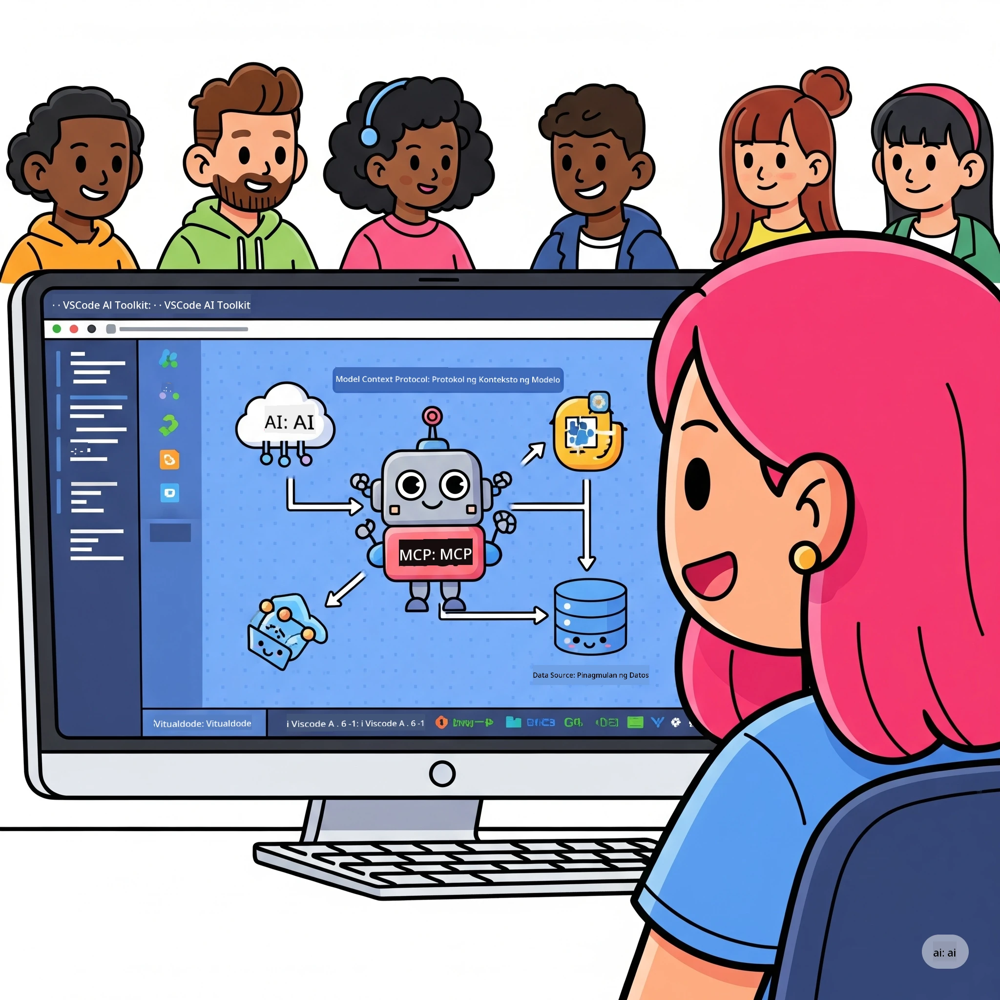
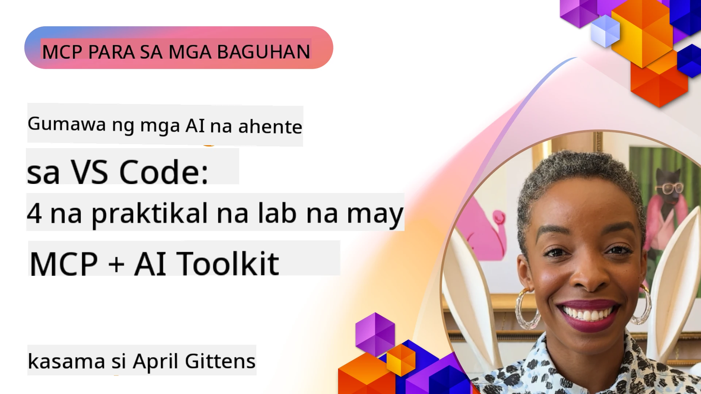

# Pinasimpleng AI Workflows: Pagtatayo ng MCP Server gamit ang Microsoft Foundry Toolkit

## 🎯  Pangkalahatang-ideya

_(I-click ang larawan sa itaas upang panoorin ang video ng araling ito)_

Maligayang pagdating sa **Model Context Protocol (MCP) Workshop**! Ang komprehensibong workshop na ito ay pinagsasama ang dalawang makabagong teknolohiya upang baguhin ang pagbuo ng mga AI application:

> **Tandaan sa Pagkakatugma:** ang kodigo ng workshop ay binuo at nasubukan gamit ang MCP
> `2025-11-25`, tulad ng ipinapakita ng badge sa itaas. Gamitin ang
> [kasalukuyang `2026-07-28` specification](https://modelcontextprotocol.io/specification/2026-07-28/)
> para sa mga bagong implementasyon ng protocol at suriin ang mga tala ng paglabas ng SDK bago
> ilipat ang mga labs.

- **🔗 Model Context Protocol (MCP)**: Isang bukas na pamantayan para sa tuloy-tuloy na integrasyon ng AI-tool
- **🛠️ Microsoft Foundry Toolkit Extension para sa VS Code**: Makapangyarihang extension mula sa Microsoft para sa pagbuo ng AI

### 🎓 Ano ang Iyong Matututunan

Sa pagtatapos ng workshop, matututuhan mo ang sining ng paggawa ng matatalinong aplikasyon na nag-uugnay ng mga modelong AI sa mga totoong mundo na mga kasangkapan at serbisyong. Mula sa automated testing hanggang sa custom API integrations, magkakaroon ka ng praktikal na kakayahan upang lutasin ang mga kumplikadong hamon sa negosyo.

## 🏗️ Teknolohiyang Stack

### 🔌 Model Context Protocol (MCP)

Ang MCP ay ang **"USB-C para sa AI"** - isang unibersal na pamantayan na nag-uugnay ng mga modelong AI sa mga panlabas na kasangkapan at pinagkukunan ng datos.

**✨ Pangunahing Katangian:**

- 🔄 **Standardized Integration**: Unibersal na interface para sa mga koneksyon ng AI-tool
- 🏛️ **Flexible Architecture**: Lokal at remote na mga server gamit ang stdio/SSE transport
- 🧰 **Rich Ecosystem**: Mga kasangkapan, prompt, at mga yaman sa isang protocol
- 🔒 **Enterprise-Ready**: Built-in na seguridad at pagiging maaasahan

**🎯 Bakit Mahalaga ang MCP:**
Katulad ng USB-C na nagwakas sa gulo ng mga kable, inaalis ng MCP ang komplikasyon ng integrasyon ng AI. Isang protocol, walang katapusang posibilidad.

### 🤖 Microsoft Foundry Toolkit Extension para sa VS Code

Ang pangunahing extension ng Microsoft para sa pagbuo ng AI na nagbabago sa VS Code bilang isang AI powerhouse.

**🚀 Pangunahing Kakayahan:**

- 📦 **Model Catalog**: Akses sa mga modelo mula sa Azure AI, GitHub, Hugging Face, Ollama
- ⚡ **Local Inference**: ONNX-optimized na CPU/GPU/NPU na pagpapatupad
- 🏗️ **Agent Builder**: Visual na pagbuo ng AI agent na may MCP integration
- 🎭 **Multi-Modal**: Suporta sa teksto, bisyon, at istrukturadong output

**💡 Benepisyo sa Pag-unlad:**

- Zero-config na deployment ng modelo
- Visual prompt engineering
- Real-time na testing playground
- Tuloy-tuloy na MCP server integration

## 📚 Paglalakbay sa Pagkatuto

### [🚀 Module 1: Microsoft Foundry Toolkit Fundamentals](./lab1/README.md)

**Tagal**: 15 minuto

- 🛠️ I-install at i-configure ang Microsoft Foundry Toolkit para sa VS Code
- 🗂️ Tuklasin ang Model Catalog (100+ modelo mula sa GitHub, ONNX, OpenAI, Anthropic, Google)
- 🎮 Master ang Interactive Playground para sa real-time na pagsubok ng modelo
- 🤖 Bumuo ng iyong unang AI agent gamit ang Agent Builder
- 📊 Suriin ang performance ng modelo gamit ang built-in na metrics (F1, relevance, similarity, coherence)
- ⚡ Matutunan ang batch processing at mga kakayahan ng multi-modal support

**🎯 Resulta ng Pagkatuto**: Gumawa ng isang functional na AI agent na may komprehensibong pag-unawa sa mga kakayahan ng Microsoft Foundry Toolkit

### [🌐 Module 2: MCP with Microsoft Foundry Toolkit Fundamentals](./lab2/README.md)

**Tagal**: 20 minuto

- 🧠 Masterin ang arkitektura at mga konsepto ng Model Context Protocol (MCP)
- 🌐 Tuklasin ang MCP server ecosystem ng Microsoft
- 🤖 Bumuo ng isang browser automation agent gamit ang Playwright MCP server
- 🔧 I-integrate ang MCP servers sa Microsoft Foundry Toolkit Agent Builder
- 📊 I-configure at subukan ang mga MCP tool sa loob ng iyong mga agent
- 🚀 I-export at i-deploy ang mga MCP-powered agent para sa production na gamit

**🎯 Resulta ng Pagkatuto**: Mag-deploy ng AI agent na pinapalakas ng panlabas na mga tool sa pamamagitan ng MCP

### [🔧 Module 3: Advanced MCP Development with Microsoft Foundry Toolkit](./lab3/README.md)

**Tagal**: 20 minuto

- 💻 Gumawa ng custom na MCP server gamit ang Microsoft Foundry Toolkit
- 🐍 I-configure at gamitin ang pinakabagong MCP Python SDK (v1.9.3)
- 🔍 I-set up at gamitin ang MCP Inspector para sa debugging
- 🛠️ Bumuo ng Weather MCP Server gamit ang propesyonal na debugging workflows
- 🧪 Mag-debug ng MCP server sa parehong Agent Builder at Inspector na mga kapaligiran

**🎯 Resulta ng Pagkatuto**: Mag-develop at mag-debug ng custom MCP server gamit ang modernong mga kasangkapan

### [🐙 Module 4: Practical MCP Development - Custom GitHub Clone Server](./lab4/README.md)

**Tagal**: 30 minuto

- 🏗️ Bumuo ng isang tunay na GitHub Clone MCP Server para sa mga development workflow
- 🔄 Ipatupad ang matalinong pag-clone ng repositoryo na may validation at error handling
- 📁 Lumikha ng matalinong pamamahala ng directory at VS Code integration
- 🤖 Gamitin ang GitHub Copilot Agent Mode na may custom MCP tools
- 🛡️ Ilapat ang production-ready reliability at cross-platform compatibility

**🎯 Resulta ng Pagkatuto**: Mag-deploy ng production-ready MCP server na nagpapadali sa totoong mga development workflow

## 💡 Mga Aplikasyon sa Real-World at Epekto

### 🏢 Mga Gamit sa Enterprise

#### 🔄 DevOps Automation

Baguhin ang iyong development workflow gamit ang matalinong automation:

- **Smart Repository Management**: AI-driven na pagsusuri ng kodigo at mga desisyon sa pag-merge
- **Intelligent CI/CD**: Automated na pag-optimize ng pipeline base sa mga pagbabago sa kodigo
- **Issue Triage**: Awtomatikong klasipikasyon at pagtatalaga ng mga bug

#### 🧪 Rebolusyon sa Quality Assurance

Palakasin ang testing gamit ang AI-powered automation:

- **Intelligent Test Generation**: Gumawa ng komprehensibong test suite nang awtomatiko
- **Visual Regression Testing**: AI-powered na pagtuklas ng pagbabago sa UI
- **Performance Monitoring**: Proaktibong pagtukoy at paglutas ng mga isyu

#### 📊 Data Pipeline Intelligence

Bumuo ng mas matalinong data processing workflow:

- **Adaptive ETL Processes**: Self-optimizing na mga data transformation
- **Anomaly Detection**: Real-time na pagsubaybay sa kalidad ng datos
- **Intelligent Routing**: Matalinong pamamahala ng daloy ng datos

#### 🎧 Pagsasaayos ng Customer Experience

Lumikha ng pambihirang interaksyon sa mga customer:

- **Context-Aware Support**: AI agents na may akses sa kasaysayan ng customer
- **Proactive Issue Resolution**: Predictive na serbisyo sa customer
- **Multi-Channel Integration**: Pinag-isang AI experience sa iba't ibang plataporma

## 🛠️ Mga Kinakailangan at Setup

### 💻 Mga Kinakailangan sa Sistema

| Komponent | Kinakailangan | Tala |
|-----------|-------------|-------|
| **Operating System** | Windows 10+, macOS 10.15+, Linux | Anumang modernong OS |
| **Visual Studio Code** | Pinakabagong stable na bersyon | Kinakailangan para sa Microsoft Foundry Toolkit |
| **Node.js** | v18.0+ at npm | Para sa pagbuo ng MCP server |
| **Python** | 3.10+ | Opsyonal para sa MCP server gamit ang Python |
| **Memorya** | Minimum na 8GB RAM | 16GB inirerekomenda para sa mga lokal na modelo |

### 🔧 Kapaligiran sa Pag-unlad

#### Inirerekomendang VS Code Extensions

- **Microsoft Foundry Toolkit** (ms-windows-ai-studio.windows-ai-studio)
- **Python** (ms-python.python)
- **Python Debugger** (ms-python.debugpy)
- **GitHub Copilot** (GitHub.copilot) - Opsyonal ngunit kapaki-pakinabang

#### Opsyonal na mga Kasangkapan

- **uv**: Modernong Python package manager
- **MCP Inspector**: Visual debugging tool para sa mga MCP server
- **Playwright**: Para sa mga halimbawa ng web automation

## 🎖️ Mga Resulta ng Pagkatuto at Landas ng Sertipikasyon

### 🏆 Checklist ng Kagalingan sa Kasanayan

Sa pagsasagawa ng workshop na ito, makakamit mo ang kadalubhasaan sa:

#### 🎯 Pangunahing Kakayahan

- [ ] **MCP Protocol Mastery**: Malalim na pag-unawa sa arkitektura at mga pattern ng implementasyon
- [ ] **Microsoft Foundry Toolkit Proficiency**: Ekspertong paggamit ng Microsoft Foundry Toolkit para sa mabilisang pag-unlad
- [ ] **Custom Server Development**: Bumuo, mag-deploy, at magpanatili ng production MCP servers
- [ ] **Tool Integration Excellence**: Tuloy-tuloy na pag-uugnay ng AI sa umiiral na mga workflow ng pag-unlad
- [ ] **Problem-Solving Application**: Ilapat ang natutunang kasanayan sa mga totoong hamon sa negosyo

#### 🔧 Teknikal na Kasanayan

- [ ] I-set up at i-configure ang Microsoft Foundry Toolkit sa VS Code
- [ ] Disenyo at implementasyon ng custom MCP servers
- [ ] Integrasyon ng GitHub Models gamit ang MCP architecture
- [ ] Gumawa ng automated na mga workflow sa testing gamit ang Playwright
- [ ] Mag-deploy ng AI agents para sa production na gamit
- [ ] Mag-debug at mag-optimize ng performance ng MCP server

#### 🚀 Advanced na Kakayahan

- [ ] Arkitekto ng enterprise-scale na integrasyon ng AI
- [ ] Magpatupad ng mga pinakamahusay na kasanayan sa seguridad para sa mga aplikasyon ng AI
- [ ] Disenyo ng scalable na arkitektura ng MCP server
- [ ] Gumawa ng custom na tool chains para sa mga partikular na domain
- [ ] Maging mentor sa AI-native na pag-unlad

## 📖 Karagdagang mga Mapagkukunan

- [MCP Specification (2026-07-28)](https://modelcontextprotocol.io/specification/2026-07-28/)
- [Microsoft Foundry Toolkit GitHub Repository](https://github.com/microsoft/vscode-ai-toolkit)
- [Sample MCP Servers Collection](https://github.com/modelcontextprotocol/servers)
- [Best Practices Guide](https://modelcontextprotocol.io/docs/best-practices)
- [OWASP MCP Top 10](https://microsoft.github.io/mcp-azure-security-guide/mcp/) - Pinakamahusay na mga kasanayan sa seguridad

---

**🚀 Handang baguhin ang iyong AI development workflow?**

Sama-sama nating itayo ang hinaharap ng matatalinong aplikasyon gamit ang MCP at Microsoft Foundry Toolkit!

## Ano ang Susunod

Magpatuloy sa: [Module 11: MCP Server Hands-On Labs](../11-MCPServerHandsOnLabs/README.md)

---

<!-- CO-OP TRANSLATOR DISCLAIMER START -->
**Pagtatanggi**:
Ang dokumentong ito ay isinalin gamit ang serbisyo ng AI translation na [Co-op Translator](https://github.com/Azure/co-op-translator). Bagama't nagsusumikap kami para sa katumpakan, pakatandaan na ang awtomatikong pagsasalin ay maaaring maglaman ng mga pagkakamali o hindi pagkakatugma. Ang orihinal na dokumento sa orihinal nitong wika ang dapat ituring na pangunahing sanggunian. Para sa mahahalagang impormasyon, inirerekomenda ang propesyonal na pagsasalin ng tao. Hindi kami mananagot sa anumang maling pagkakaintindi o maling interpretasyon na nagmula sa paggamit ng pagsasaling ito.
<!-- CO-OP TRANSLATOR DISCLAIMER END -->