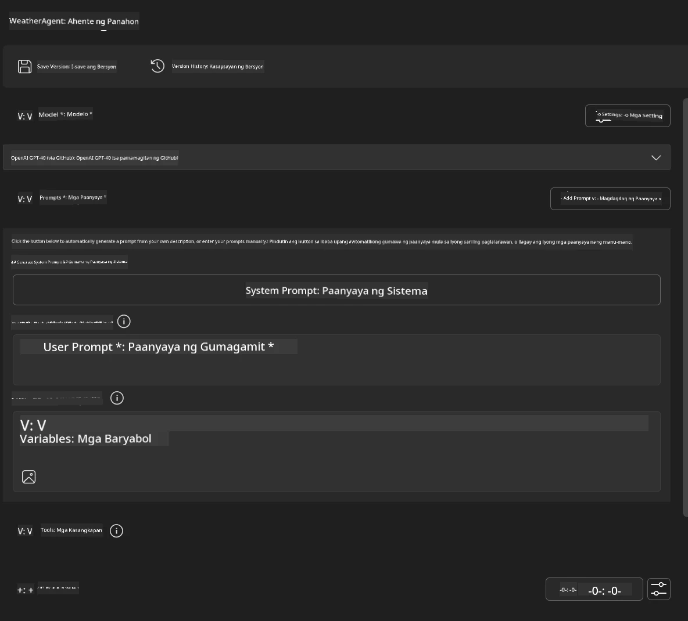
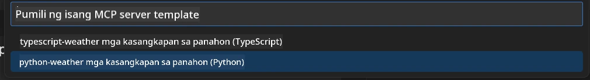
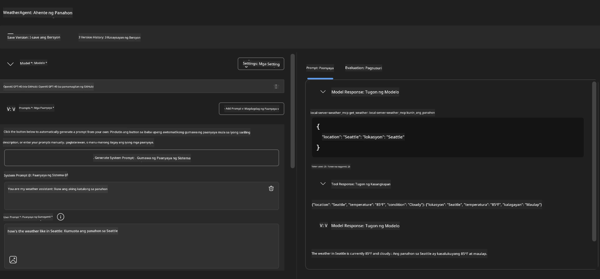
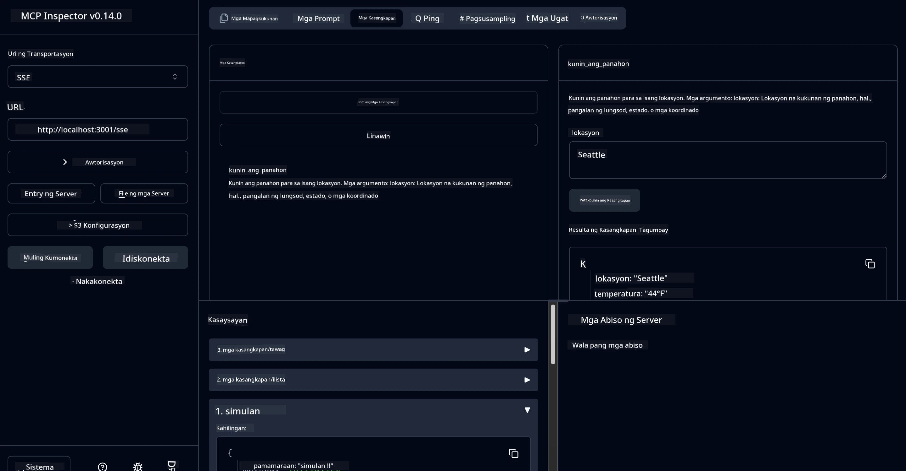

# 🔧 Module 3: Advanced MCP Development gamit ang Microsoft Foundry Toolkit

> [!NOTE]
> Ang mga URL ng Inspector sa lab na ito ay gumagamit ng lumang `/sse` endpoint at naka-target sa
> naka-pin na MCP SDK `1.9.3` at Inspector `0.14.0` na dependencies. Hindi ito
> kasalukuyang `2026-07-28` na mga halimbawa ng Streamable HTTP.


## 🎯 Mga Layunin sa Pag-aaral

Sa pagtatapos ng lab na ito, magagawa mong:

- ✅ Gumawa ng mga custom na MCP server gamit ang Microsoft Foundry Toolkit
- ✅ I-configure at gamitin ang pinakabagong MCP Python SDK (v1.9.3)
- ✅ I-setup at gamitin ang MCP Inspector para sa debugging
- ✅ I-debug ang MCP servers sa parehong Agent Builder at Inspector na mga kapaligiran
- ✅ Unawain ang mga advanced na workflow sa pag-develop ng MCP server

## 📋 Mga Kinakailangan

- Natapos ang Lab 2 (MCP Fundamentals)
- VS Code na may Microsoft Foundry Toolkit extension na naka-install
- Python 3.10+ environment
- Node.js at npm para sa setup ng Inspector

## 🏗️ Ano ang Bubuoin Mo

Sa lab na ito, gagawa ka ng **Weather MCP Server** na nagpapakita ng:
- Custom na implementasyon ng MCP server
- Integrasyon sa Microsoft Foundry Toolkit Agent Builder
- Mga propesyonal na workflow sa pag-debug
- Mga modernong pattern sa paggamit ng MCP SDK

---

## 🔧 Pangkalahatang-ideya ng Mga Pangunahing Komponent

### 🐍 MCP Python SDK
Ang Model Context Protocol Python SDK ang pundasyon para sa paggawa ng mga custom na MCP server. Gagamitin mo ang bersyon 1.9.3 na may pinahusay na mga kakayahan sa pag-debug.

### 🔍 MCP Inspector
Isang makapangyarihang tool sa pag-debug na nagbibigay ng:
- Real-time na pagmamanman ng server
- Visualisasyon ng pagpapatupad ng tool
- Pagsisiyasat sa mga network request/response
- Interactive na testing na kapaligiran

---

## 📖 Sunud-sunod na Implementasyon

### Hakbang 1: Gumawa ng WeatherAgent sa Agent Builder

1. **Buksan ang Agent Builder** sa VS Code sa pamamagitan ng Microsoft Foundry Toolkit extension
2. **Lumikha ng bagong agent** gamit ang sumusunod na configuration:
   - Pangalan ng Agent: `WeatherAgent`



### Hakbang 2: Simulan ang MCP Server Project

1. **Pumunta sa Tools** → **Add Tool** sa Agent Builder
2. **Piliin ang "MCP Server"** mula sa mga available na opsyon
3. **Pumili ng "Create A new MCP Server"**
4. **Piliin ang `python-weather` template**
5. **Pangalanan ang iyong server:** `weather_mcp`



### Hakbang 3: Buksan at Suriin ang Proyekto

1. **Buksan ang nalikhang proyekto** sa VS Code
2. **Suriin ang istruktura ng proyekto:**
   ```
   weather_mcp/
   ├── src/
   │   ├── __init__.py
   │   └── server.py
   ├── inspector/
   │   ├── package.json
   │   └── package-lock.json
   ├── .vscode/
   │   ├── launch.json
   │   └── tasks.json
   ├── pyproject.toml
   └── README.md
   ```

### Hakbang 4: I-upgrade sa Pinakabagong MCP SDK

> **🔍 Bakit Mag-upgrade?** Gusto nating gamitin ang pinakabagong MCP SDK (v1.9.3) at Inspector service (0.14.0)  para sa pinahusay na mga tampok at mas mahusay na kakayahan sa pag-debug.

#### 4a. I-update ang Mga Depedensiyang Python

**I-edit ang `pyproject.toml`:** i-update ang [./code/weather_mcp/pyproject.toml](../../../../10-StreamliningAIWorkflowsBuildingAnMCPServerWithAIToolkit/lab3/code/weather_mcp/pyproject.toml)


#### 4b. I-update ang Konfigurasyon ng Inspector

**I-edit ang `inspector/package.json`:** i-update ang [./code/weather_mcp/inspector/package.json](../../../../10-StreamliningAIWorkflowsBuildingAnMCPServerWithAIToolkit/lab3/code/weather_mcp/inspector/package.json)

#### 4c. I-update ang Mga Depedensiya ng Inspector

**I-edit ang `inspector/package-lock.json`:** i-update ang [./code/weather_mcp/inspector/package-lock.json](../../../../10-StreamliningAIWorkflowsBuildingAnMCPServerWithAIToolkit/lab3/code/weather_mcp/inspector/package-lock.json)

> **📝 Tala:** Ang file na ito ay naglalaman ng malawak na depedensyang mga depinisyon. Nasa ibaba ang pangunahing istruktura - ang buong nilalaman ay nagsisiguro ng tamang resolusyon ng depedensya.


> **⚡ Buong Package Lock:** Ang kumpletong package-lock.json ay may humigit-kumulang 3000 linya ng mga depedensyang depinisyon. Ang nasa itaas ay nagpapakita ng pangunahing istruktura - gamitin ang ibinigay na file para sa kumpletong resolusyon ng depedensya.

### Hakbang 5: I-configure ang VS Code Debugging

*Tandaan: Pakikopya ang file sa tinukoy na path upang palitan ang katumbas na lokal na file*

#### 5a. I-update ang Launch Configuration

**I-edit ang `.vscode/launch.json`:**

```json
{
  "version": "0.2.0",
  "configurations": [
    {
      "name": "Attach to Local MCP",
      "type": "debugpy",
      "request": "attach",
      "connect": {
        "host": "localhost",
        "port": 5678
      },
      "presentation": {
        "hidden": true
      },
      "internalConsoleOptions": "neverOpen",
      "postDebugTask": "Terminate All Tasks"
    },
    {
      "name": "Launch Inspector (Edge)",
      "type": "msedge",
      "request": "launch",
      "url": "http://localhost:6274?timeout=60000&serverUrl=http://localhost:3001/sse#tools",
      "cascadeTerminateToConfigurations": [
        "Attach to Local MCP"
      ],
      "presentation": {
        "hidden": true
      },
      "internalConsoleOptions": "neverOpen"
    },
    {
      "name": "Launch Inspector (Chrome)",
      "type": "chrome",
      "request": "launch",
      "url": "http://localhost:6274?timeout=60000&serverUrl=http://localhost:3001/sse#tools",
      "cascadeTerminateToConfigurations": [
        "Attach to Local MCP"
      ],
      "presentation": {
        "hidden": true
      },
      "internalConsoleOptions": "neverOpen"
    }
  ],
  "compounds": [
    {
      "name": "Debug in Agent Builder",
      "configurations": [
        "Attach to Local MCP"
      ],
      "preLaunchTask": "Open Agent Builder",
    },
    {
      "name": "Debug in Inspector (Edge)",
      "configurations": [
        "Launch Inspector (Edge)",
        "Attach to Local MCP"
      ],
      "preLaunchTask": "Start MCP Inspector",
      "stopAll": true
    },
    {
      "name": "Debug in Inspector (Chrome)",
      "configurations": [
        "Launch Inspector (Chrome)",
        "Attach to Local MCP"
      ],
      "preLaunchTask": "Start MCP Inspector",
      "stopAll": true
    }
  ]
}
```

**I-edit ang `.vscode/tasks.json`:**

```
{
  "version": "2.0.0",
  "tasks": [
    {
      "label": "Start MCP Server",
      "type": "shell",
      "command": "python -m debugpy --listen 127.0.0.1:5678 src/__init__.py sse",
      "isBackground": true,
      "options": {
        "cwd": "${workspaceFolder}",
        "env": {
          "PORT": "3001"
        }
      },
      "problemMatcher": {
        "pattern": [
          {
            "regexp": "^.*$",
            "file": 0,
            "location": 1,
            "message": 2
          }
        ],
        "background": {
          "activeOnStart": true,
          "beginsPattern": ".*",
          "endsPattern": "Application startup complete|running"
        }
      }
    },
    {
      "label": "Start MCP Inspector",
      "type": "shell",
      "command": "npm run dev:inspector",
      "isBackground": true,
      "options": {
        "cwd": "${workspaceFolder}/inspector",
        "env": {
          "CLIENT_PORT": "6274",
          "SERVER_PORT": "6277",
        }
      },
      "problemMatcher": {
        "pattern": [
          {
            "regexp": "^.*$",
            "file": 0,
            "location": 1,
            "message": 2
          }
        ],
        "background": {
          "activeOnStart": true,
          "beginsPattern": "Starting MCP inspector",
          "endsPattern": "Proxy server listening on port"
        }
      },
      "dependsOn": [
        "Start MCP Server"
      ]
    },
    {
      "label": "Open Agent Builder",
      "type": "shell",
      "command": "echo ${input:openAgentBuilder}",
      "presentation": {
        "reveal": "never"
      },
      "dependsOn": [
        "Start MCP Server"
      ],
    },
    {
      "label": "Terminate All Tasks",
      "command": "echo ${input:terminate}",
      "type": "shell",
      "problemMatcher": []
    }
  ],
  "inputs": [
    {
      "id": "openAgentBuilder",
      "type": "command",
      "command": "ai-mlstudio.agentBuilder",
      "args": {
        "initialMCPs": [ "local-server-weather_mcp" ],
        "triggeredFrom": "vsc-tasks"
      }
    },
    {
      "id": "terminate",
      "type": "command",
      "command": "workbench.action.tasks.terminate",
      "args": "terminateAll"
    }
  ]
}
```


---

## 🚀 Pagpapatakbo at Pagsusuri ng Iyong MCP Server

### Hakbang 6: I-install ang Mga Depedensiya

Pagkatapos gawin ang mga pagbabago sa konfigurasyon, patakbuhin ang mga sumusunod na utos:

**I-install ang mga Python dependencies:**
```bash
uv sync
```

**I-install ang mga Inspector dependencies:**
```bash
cd inspector
npm install
```

### Hakbang 7: I-debug gamit ang Agent Builder

1. **Pindutin ang F5** o gamitin ang **"Debug in Agent Builder"** na konfigurasyon
2. **Piliin ang compound na konfigurasyon** mula sa debug panel
3. **Maghintay na magsimula ang server** at magbukas ang Agent Builder
4. **Subukan ang iyong weather MCP server** gamit ang mga natural na wika na query

Input prompt tulad nito

SYSTEM_PROMPT

```
You are my weather assistant
```

USER_PROMPT

```
How's the weather like in Seattle
```



### Hakbang 8: I-debug gamit ang MCP Inspector

1. **Gamitin ang "Debug in Inspector"** konfigurasyon (Edge o Chrome)
2. **Buksan ang Inspector interface** sa `http://localhost:6274`
3. **Siyasatin ang interactive testing na kapaligiran:**
   - Tingnan ang mga available na tool
   - Subukan ang pagpapatupad ng tool
   - I-monitor ang mga network request
   - I-debug ang mga tugon ng server



---

## 🎯 Mga Pangunahing Resulta ng Pagkatuto

Sa pagkumpleto ng lab na ito, nagawa mo na:

- [x] **Nakalikha ng custom na MCP server** gamit ang mga template ng Microsoft Foundry Toolkit
- [x] **Na-upgrade sa pinakabagong MCP SDK** (v1.9.3) para sa pinahusay na functionality
- [x] **Na-configure ang mga propesyonal na workflow sa pag-debug** para sa parehong Agent Builder at Inspector
- [x] **Nai-set up ang MCP Inspector** para sa interactive na testing ng server
- [x] **Nai-master ang VS Code debugging configurations** para sa MCP development

## 🔧 Mga Advanced na Tampok na Natuklasan

| Tampok | Paglalarawan | Paggamit |
|---------|-------------|----------|
| **MCP Python SDK v1.9.3** | Pinakabagong protocol implementation | Modernong pag-develop ng server |
| **MCP Inspector 0.14.0** | Interactive na debugging tool | Real-time na pagsusuri ng server |
| **VS Code Debugging** | Integrated na development environment | Propesyonal na workflow sa pag-debug |
| **Agent Builder Integration** | Direct na koneksyon sa Microsoft Foundry Toolkit | End-to-end na pagsubok ng agent |

## 📚 Karagdagang Mga Sanggunian

- [MCP Python SDK Dokumentasyon](https://modelcontextprotocol.io/docs/sdk/python)
- [Microsoft Foundry Toolkit Extension Gabay](https://code.visualstudio.com/docs/ai/ai-toolkit)
- [VS Code Debugging Dokumentasyon](https://code.visualstudio.com/docs/editor/debugging)
- [Model Context Protocol Specipikasyon](https://modelcontextprotocol.io/docs/concepts/architecture)

---

**🎉 Binabati kita!** Matagumpay mong natapos ang Lab 3 at ngayon ay maaari ka nang gumawa, mag-debug, at mag-deploy ng mga custom na MCP server gamit ang mga propesyonal na workflow sa pag-develop.

### 🔜 Magpatuloy sa Susunod na Module

Handa ka na bang i-apply ang iyong mga MCP skills sa isang tunay na development workflow? Magpatuloy sa **[Module 4: Practical MCP Development - Custom GitHub Clone Server](../lab4/README.md)** kung saan:
- Buuin ang production-ready na MCP server na nag-a-automate ng mga operasyon ng GitHub repository
- Magpatupad ng functionality sa pag-clone ng GitHub repository sa pamamagitan ng MCP
- I-integrate ang mga custom na MCP server sa VS Code at GitHub Copilot Agent Mode
- Subukan at i-deploy ang mga custom MCP server sa mga production na kapaligiran
- Matutunan ang praktikal na workflow automation para sa mga developer

---

<!-- CO-OP TRANSLATOR DISCLAIMER START -->
**Pagtatanggi**:
Ang dokumentong ito ay isinalin gamit ang serbisyo ng AI translation na [Co-op Translator](https://github.com/Azure/co-op-translator). Bagama't nagsusumikap kami para sa katumpakan, pakatandaan na ang awtomatikong pagsasalin ay maaaring maglaman ng mga pagkakamali o hindi pagkakatugma. Ang orihinal na dokumento sa orihinal nitong wika ang dapat ituring na pangunahing sanggunian. Para sa mahahalagang impormasyon, inirerekomenda ang propesyonal na pagsasalin ng tao. Hindi kami mananagot sa anumang maling pagkakaintindi o maling interpretasyon na nagmula sa paggamit ng pagsasaling ito.
<!-- CO-OP TRANSLATOR DISCLAIMER END -->