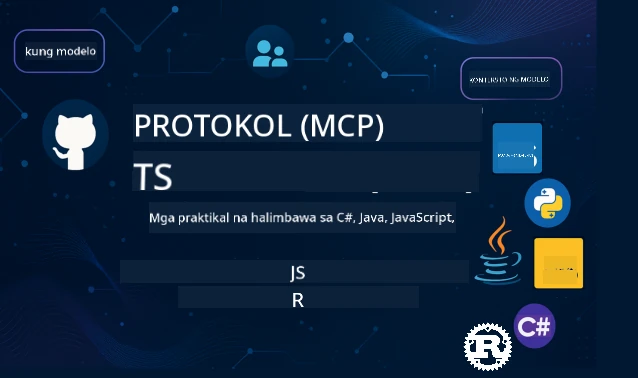

 

[](https://GitHub.com/microsoft/mcp-for-beginners/graphs/contributors)
[](https://GitHub.com/microsoft/mcp-for-beginners/issues)
[](https://GitHub.com/microsoft/mcp-for-beginners/pulls)
[](http://makeapullrequest.com)

[](https://GitHub.com/microsoft/mcp-for-beginners/watchers)
[](https://GitHub.com/microsoft/mcp-for-beginners/fork)
[](https://GitHub.com/microsoft/mcp-for-beginners/stargazers)


[](https://discord.gg/nTYy5BXMWG)

Sundin ang mga hakbang na ito upang makapagsimula gamit ang mga resources na ito:
1. **I-fork ang Repository**: I-click ang [](https://GitHub.com/microsoft/mcp-for-beginners/fork)
2. **I-clone ang Repository**:   `git clone https://github.com/microsoft/mcp-for-beginners.git`
3. **Sumali sa** [](https://discord.gg/nTYy5BXMWG)


### 🌐 Suporta sa Iba't Ibang Wika

#### Sinusuportahan sa pamamagitan ng GitHub Action (Awtomatiko at Palaging Napapanahon)

<!-- CO-OP TRANSLATOR LANGUAGES TABLE START -->
[Arabic](../ar/README.md) | [Bengali](../bn/README.md) | [Bulgarian](../bg/README.md) | [Burmese (Myanmar)](../my/README.md) | [Chinese (Simplified)](../zh-CN/README.md) | [Chinese (Traditional, Hong Kong)](../zh-HK/README.md) | [Chinese (Traditional, Macau)](../zh-MO/README.md) | [Chinese (Traditional, Taiwan)](../zh-TW/README.md) | [Croatian](../hr/README.md) | [Czech](../cs/README.md) | [Danish](../da/README.md) | [Dutch](../nl/README.md) | [Estonian](../et/README.md) | [Finnish](../fi/README.md) | [French](../fr/README.md) | [German](../de/README.md) | [Greek](../el/README.md) | [Hebrew](../he/README.md) | [Hindi](../hi/README.md) | [Hungarian](../hu/README.md) | [Indonesian](../id/README.md) | [Italian](../it/README.md) | [Japanese](../ja/README.md) | [Kannada](../kn/README.md) | [Korean](../ko/README.md) | [Lithuanian](../lt/README.md) | [Malay](../ms/README.md) | [Malayalam](../ml/README.md) | [Marathi](../mr/README.md) | [Nepali](../ne/README.md) | [Nigerian Pidgin](../pcm/README.md) | [Norwegian](../no/README.md) | [Persian (Farsi)](../fa/README.md) | [Polish](../pl/README.md) | [Portuguese (Brazil)](../pt-BR/README.md) | [Portuguese (Portugal)](../pt-PT/README.md) | [Punjabi (Gurmukhi)](../pa/README.md) | [Romanian](../ro/README.md) | [Russian](../ru/README.md) | [Serbian (Cyrillic)](../sr/README.md) | [Slovak](../sk/README.md) | [Slovenian](../sl/README.md) | [Spanish](../es/README.md) | [Swahili](../sw/README.md) | [Swedish](../sv/README.md) | [Tagalog (Filipino)](./README.md) | [Tamil](../ta/README.md) | [Telugu](../te/README.md) | [Thai](../th/README.md) | [Turkish](../tr/README.md) | [Ukrainian](../uk/README.md) | [Urdu](../ur/README.md) | [Vietnamese](../vi/README.md)

> **Mas Gusto Mo Bang I-clone Lokally?**

> Kasama ng repositoryong ito ang 50+ na pagsasalin ng wika na malaki ang dagdag sa laki ng download. Para mag-clone nang walang mga pagsasalin, gamitin ang sparse checkout:
> ```bash
> git clone --filter=blob:none --sparse https://github.com/microsoft/mcp-for-beginners.git
> cd mcp-for-beginners
> git sparse-checkout set --no-cone '/*' '!translations' '!translated_images'
> ```
> Bibigyan ka nito ng lahat ng kailangan mo para matapos ang kurso sa mas mabilis na pag-download.
<!-- CO-OP TRANSLATOR LANGUAGES TABLE END -->

# 🚀 Kurikulum ng Model Context Protocol (MCP) para sa mga Baguhan

## **Matuto ng MCP gamit ang Hands-on na mga Halimbawa ng Code sa C#, Java, JavaScript, Rust, Python, at TypeScript**

## 🧠 Pangkalahatang-ideya ng Kurikulum ng Model Context Protocol
Maligayang pagdating sa iyong paglalakbay patungo sa Model Context Protocol! Kung nagtaka ka na kung paano nakikipag-ugnayan ang mga AI application sa iba't ibang tools at serbisyo, malalaman mo na ngayon ang eleganteng solusyon na nagbabago sa paraan ng paggawa ng mga developer ng matatalinong sistema.

Isipin ang MCP bilang isang unibersal na tagasalin para sa mga AI application - tulad ng kung paano pinapayagan ng mga USB port na ikonekta mo ang anumang device sa iyong computer, pinapayagan ng MCP ang mga AI model na kumonekta sa anumang tool o serbisyo sa isang pamantayang paraan. Kahit ikaw ay gumagawa ng iyong unang chatbot o nagtatrabaho sa mga kumplikadong AI workflow, ang pag-unawa sa MCP ay magbibigay sa iyo ng kapangyarihan na lumikha ng mas kaya at mas nababaluktot na mga aplikasyon.

Ang kurikulum na ito ay idinisenyo nang may pasensya at malasakit para sa iyong pag-aaral. Magsisimula tayo sa mga simpleng konsepto na alam mo na at unti-unting palalalimin ang iyong kakayahan sa pamamagitan ng praktikal na pagsasanay sa iyong paboritong programming language. Bawat hakbang ay may malinaw na paliwanag, praktikal na mga halimbawa, at maraming suporta sa buong proseso.

Sa oras na matapos mo ang paglalakbay na ito, magkakaroon ka ng kumpiyansa na gumawa ng sarili mong MCP servers, i-integrate ito sa mga popular na AI platform, at maintindihan kung paano binabago ng teknolohiyang ito ang hinaharap ng pagbuo ng AI. Simulan natin ang kapanapanabik na pakikipagsapalaran na ito!

### Opisyal na Dokumentasyon at Mga Espesipikasyon

Lalo pang magiging mahalaga ang mga resources na ito habang lumalalim ang iyong pag-unawa, ngunit huwag magmadaling basahin ang lahat agad-agad. Magsimula sa mga bahagi na pinaka-interesado ka!
- 📘 [MCP Documentation](https://modelcontextprotocol.io/) – Ito ang iyong pangunahing mapagkunan para sa mga hakbang-hakbang na tutorial at gabay para sa gumagamit. Ang dokumentasyon ay isinulat para sa mga baguhan, na may malinaw na mga halimbawa na maaari mong sundan ayon sa iyong bilis.
- 📜 [MCP Specification](https://modelcontextprotocol.io/docs/) – Isipin ito bilang iyong komprehensibong reference manual. Habang tinatapos mo ang kurikulum, madalas kang babalik dito para tingnan ang mga tiyak na detalye at tuklasin ang mga advanced na tampok.
- 📜 [Orihinal na MCP Specification](https://modelcontextprotocol.io/specification/versioning) – Naglalaman ito ng mga karagdagang teknikal na detalye na maaaring makatulong para sa mga advanced na implementasyon. Naroon ito sa panahon na kailangan mo, pero huwag muna itong alalahanin sa simula.
- 🧑‍💻 [MCP GitHub Repository](https://github.com/modelcontextprotocol) – Dito mo makikita ang mga SDK, tools, at mga halimbawang code sa iba't ibang programming language. Para itong isang kayamanan ng mga praktikal na halimbawa at handang gamitin na mga bahagi.
- 🌐 [MCP Community](https://github.com/orgs/modelcontextprotocol/discussions) – Sumali sa mga kapwa mag-aaral at mga eksperto sa pagtalakay tungkol sa MCP. Ito ay isang suportadong komunidad kung saan malugod tinatanggap ang mga tanong at bukas ang palitan ng kaalaman.
  
## Mga Layunin sa Pag-aaral

Sa pagtatapos ng kurikulum na ito, mararamdaman mong kumpiyansa at sabik sa iyong mga bagong kakayahan. Narito ang iyong makakamit:

• **Maunawaan ang mga batayan ng MCP**: Maiintindihan mo kung ano ang Model Context Protocol at bakit nito binabago ang paraan ng pakikipagtulungan ng mga AI application, gamit ang mga paghahambing at halimbawa na madaling maunawaan.

• **Gumawa ng iyong unang MCP server**: Magtatayo ka ng gumaganang MCP server sa iyong paboritong programming language, magsisimula sa mga simpleng halimbawa at paunti-unting papalapitin ang iyong kasanayan.

• **Ikonekta ang mga AI model sa totoong mga tool**: Matututuhan mo kung paano tulayin ang pagitan ng mga AI model at mga aktwal na serbisyo, na nagbibigay sa iyong mga aplikasyon ng makapangyarihang bagong kakayahan.

• **Ipapatupad ang pinakamahusay na mga kasanayan sa seguridad**: Maiintindihan mo kung paano panatilihing ligtas at segurado ang iyong mga implementasyon ng MCP, pinoprotektahan ang iyong mga aplikasyon at mga user.

• **Mag-deploy nang may kumpiyansa**: Malalaman mo kung paano dalhin ang iyong mga proyekto ng MCP mula sa development papuntang produksyon, gamit ang mga praktikal na estratehiya na epektibo sa totoong mundo.

• **Sumali sa komunidad ng MCP**: Maging bahagi ka ng lumalaking komunidad ng mga developer na humuhubog sa hinaharap ng pagbuo ng AI application. 

## Mahahalagang Pagsusuri

Bago tayo sumabak sa mga detalye ng MCP, tiyakin muna natin na komportable ka sa ilang pundasyong konsepto. Huwag mag-alala kung hindi ka eksperto sa mga ito - ipapaliwanag namin lahat ng kailangan mong malaman habang umuusad tayo!

### Pag-unawa sa Mga Protocol (Ang Saligan)

Isipin ang protocol bilang mga patakaran para sa isang pag-uusap. Kapag tumawag ka sa isang kaibigan, pareho kayong alam na sasabihin "hello" sa pagsagot, magpapalitan ng salita, at sasabihang "goodbye" kapag tapos na. Kailangan din ng mga computer program ng similar na mga alituntunin para epektibong makipagkomunikasyon.

Ang MCP ay isang protocol - isang hanay ng pinagkasunduang mga alituntunin na tumutulong sa mga AI model at aplikasyon na magkaroon ng produktibong "pag-uusap" sa mga tool at serbisyo. Katulad ng mga patakaran sa pag-uusap na nagpapadali sa komunikasyon ng tao, pinapadali ng MCP ang komunikasyon ng mga AI application nang mas maaasahan at makapangyarihan.

### Relasyon ng Client-Server (Paano Nagtutulungan ang mga Programa)

Araw-araw ka nang gumagamit ng client-server na relasyon! Kapag gumagamit ka ng web browser (ang client) para bumisita sa isang website, nakakonekta ka sa isang web server na nagpapadala sa iyo ng nilalaman ng pahina. Alam ng browser kung paano humiling ng impormasyon, at alam ng server kung paano tumugon.

Sa MCP, may katulad tayong relasyon: ang mga AI model ay kumikilos bilang mga client na humihiling ng impormasyon o aksyon, habang ang mga MCP server ay nagbibigay ng mga kakayahang iyon. Para itong isang matulunging katulong (ang server) na maaaring tanungin ng AI para magsagawa ng mga tiyak na gawain.

### Bakit Mahalaga ang Standardization (Pagsasama-sama ng mga Bagay)

Isipin mo kung bawat tagagawa ng sasakyan ay may ibang hugis ng gas pump - kailangan mo ng ibang adapter para sa bawat kotse! Ang standardization ay ibig sabihin ng pagsang-ayon sa mga karaniwang paraan upang mapaandar nang maayos ang mga bagay.

Nagbibigay ang MCP ng ganitong standardization para sa mga AI application. Sa halip na bawat AI model ay mangailangan ng custom na code para gumana sa bawat tool, nililikha ng MCP ang isang unibersal na paraan para sa komunikasyon. Ibig sabihin, makakagawa ang mga developer ng tools nang isang beses lang at gagana ito sa maraming iba't ibang AI system.

## 🧭 Pangkalahatang-ideya ng Iyong Landas sa Pag-aaral

Ang iyong paglalakbay sa MCP ay maingat na inayos upang palaguin ang iyong kumpiyansa at kasanayan nang paunti-unti. Bawat yugto ay nagpapakilala ng mga bagong konsepto habang pinapalakas ang mga natutunan mo na.

### 🌱 Yugto ng Saligan: Pag-unawa sa mga Pangunahing Kaalaman (Mga Module 0-2)

Dito nagsisimula ang iyong pakikipagsapalaran! Ipapakilala namin sa iyo ang mga konsepto ng MCP gamit ang mga pamilyar na paghahambing at simpleng mga halimbawa. Maiintindihan mo kung ano ang MCP, bakit ito umiiral, at paano ito pasok sa mas malawak na mundo ng pagbuo ng AI.

• **Module 0 - Panimula sa MCP**: Sisiyasatin natin kung ano ang MCP at bakit ito napakahalaga para sa mga modernong AI application. Makikita mo ang mga tunay na halimbawa ng MCP sa aksyon at maiintindihan kung paano nito nilulutas ang mga karaniwang problema na kinahaharap ng mga developer.

• **Module 1 - Mga Pangunahing Konsepto na Ipinaliwanag**: Dito matututunan mo ang mga mahalagang bahagi ng MCP. Gagamit tayo ng maraming paghahambing at biswal na halimbawa upang maging natural at madaling maunawaan ang mga konsep na ito.

• **Module 2 - Seguridad sa MCP**: Maaaring nakakatakot ang seguridad, pero ipapakita namin kung paano kasama sa MCP ang mga katangiang pangkaligtasan at ituturo namin ang mga pinakamahusay na kasanayan para maprotektahan ang iyong aplikasyon mula sa simula.

### 🔨 Yugto ng Pagtatayo: Paglikha ng Iyong Unang Implementasyon (Module 3)

Ngayon ay magsisimula na ang tunay na kasiyahan! Magkakaroon ka ng hands-on na karanasan sa pagbuo ng mga aktwal na MCP server at client. Huwag mag-alala - magsisimula tayo sa mga simpleng halimbawa at gagabayan ka sa bawat hakbang.

Kasama sa module na ito ang maramihang hands-on na gabay na magpapahintulot sa iyo na magsanay sa iyong paboritong programming language. Gagawa ka ng iyong unang server, bubuo ng client upang makakonekta dito, at magsasama pa ng integration sa mga popular na development tool tulad ng VS Code.
Kasama sa bawat gabay ang kompletong mga halimbawa ng code, mga tip sa pag-aayos ng problema, at mga paliwanag kung bakit kami gumagawa ng mga tiyak na desisyon sa disenyo. Sa pagtatapos ng yugtong ito, magkakaroon ka ng gumaganang mga implementasyon ng MCP na maaari mong ipagmamalaki!

### 🚀 Yugtong Paglago: Mga Advanced na Konsepto at Aplikasyon sa Tunay na Mundo (Mga Module 4-5)

Kapag na-master mo na ang mga batayan, handa ka nang tuklasin ang mas sopistikadong mga tampok ng MCP. Tatalakayin natin ang mga praktikal na estratehiya sa implementasyon, mga teknik sa debugging, at mga advanced na paksa tulad ng multi-modal AI integration.

Matututuhan mo rin kung paano i-scale ang iyong mga implementasyon ng MCP para sa paggamit sa produksyon at makipag-ugnayan sa mga cloud platform tulad ng Azure. Inihahanda ka ng mga modulong ito na bumuo ng mga solusyon ng MCP na kayang hawakan ang mga pangangailangan sa tunay na mundo.

### 🌟 Yugtong Mastery: Komunidad at Espesyalisasyon (Mga Module 6-11)

Ang huling yugto ay nakatuon sa pagsali sa komunidad ng MCP at sa pag-espesyalisa sa mga larangang pinakainteresado ka. Matututuhan mo kung paano mag-ambag sa mga open-source na proyekto ng MCP, magpatupad ng mga advanced na pattern sa authentication, at bumuo ng komprehensibong mga solusyon na may database integration.

Nararapat bigyang pansin ang Module 11 - isang kumpletong 13-lab na hands-on na landas sa pagkatuto na nagtuturo sa iyo na bumuo ng mga production-ready na MCP server na may PostgreSQL integration. Para itong capstone project na pinagsasama-sama ang lahat ng iyong natutunan!

### 📚 Kumpletong Estruktura ng Kurikulum

| Module | Paksa | Deskripsyon | Link |
|--------|-------|-------------|------|
| **Module 1-3: Mga Pangunahing Kaalaman** | | | |
| 00 | Panimula sa MCP | Pangkalahatang-ideya ng Model Context Protocol at ang kahalagahan nito sa mga AI pipeline | [Basahin pa](./00-Introduction/README.md) |
| 01 | Paliwanag ng Mga Pangunahing Konsepto | Masusing pagtalakay sa mga pangunahing konsepto ng MCP | [Basahin pa](./01-CoreConcepts/README.md) |
| 02 | Seguridad sa MCP | Mga banta sa seguridad at pinakamahuhusay na kasanayan | [Basahin pa](./02-Security/README.md) |
| 03 | Pagsisimula sa MCP | Pagsasaayos ng kapaligiran, mga batayang server/kliyente, integrasyon | [Basahin pa](./03-GettingStarted/README.md) |
| **Module 3: Pagbuo ng Iyong Unang Server at Kliyente** | | | |
| 3.1 | Unang Server | Gumawa ng iyong unang MCP server | [Gabay](./03-GettingStarted/01-first-server/README.md) |
| 3.2 | Unang Kliyente | Bumuo ng batayang MCP client | [Gabay](./03-GettingStarted/02-client/README.md) |
| 3.3 | Kliyente na may LLM | Isama ang malalaking modelo ng wika | [Gabay](./03-GettingStarted/03-llm-client/README.md) |
| 3.4 | Integrasyon sa VS Code | Gumamit ng mga MCP server sa VS Code | [Gabay](./03-GettingStarted/04-vscode/README.md) |
| 3.5 | stdio Server | Gumawa ng mga server gamit ang stdio transport | [Gabay](./03-GettingStarted/05-stdio-server/README.md) |
| 3.6 | HTTP Streaming | Magpatupad ng HTTP streaming sa MCP | [Gabay](./03-GettingStarted/06-http-streaming/README.md) |
| 3.7 | AI Toolkit | Gamitin ang AI Toolkit sa MCP | [Gabay](./03-GettingStarted/07-aitk/README.md) |
| 3.8 | Pagsubok | Subukan ang iyong implementasyon ng MCP server | [Gabay](./03-GettingStarted/08-testing/README.md) |
| 3.9 | Deployment | I-deploy ang mga MCP server sa produksyon | [Gabay](./03-GettingStarted/09-deployment/README.md) |
| 3.10 | Advanced na paggamit ng server | Gamitin ang mga advanced na server para sa mas sopistikadong paggamit ng mga tampok at pinahusay na arkitektura | [Gabay](./03-GettingStarted/10-advanced/README.md) |
| 3.11 | Simpleng auth | Isang kabanata na nagpapakita ng authentication mula sa simula at RBAC | [Gabay](./03-GettingStarted/11-simple-auth/README.md) |
| **Module 4-5: Praktikal at Advanced** | | | |
| 04 | Praktikal na Implementasyon | SDKs, debugging, testing, reusable prompt templates | [Basahin pa](./04-PracticalImplementation/README.md) |
| 05 | Mga Advanced na Paksa sa MCP | Multi-modal AI, scaling, enterprise use | [Basahin pa](./05-AdvancedTopics/README.md) |
| 5.1 | Integrasyon sa Azure | MCP Integration sa Azure | [Gabay](./05-AdvancedTopics/mcp-integration/README.md) |
| 5.2 | Multi-modality | Pagtrabaho sa maraming modality | [Gabay](./05-AdvancedTopics/mcp-multi-modality/README.md) |
| 5.3 | OAuth2 Demo | Magpatupad ng OAuth2 authentication | [Gabay](./05-AdvancedTopics/mcp-oauth2-demo/README.md) |
| 5.4 | Root Contexts | Unawain at ipatupad ang root contexts | [Gabay](./05-AdvancedTopics/mcp-root-contexts/README.md) |
| 5.5 | Routing | Mga estratehiya sa routing ng MCP | [Gabay](./05-AdvancedTopics/mcp-routing/README.md) |
| 5.6 | Sampling | Mga teknik sa sampling sa MCP | [Gabay](./05-AdvancedTopics/mcp-sampling/README.md) |
| 5.7 | Scaling | I-scale ang mga implementasyon ng MCP | [Gabay](./05-AdvancedTopics/mcp-scaling/README.md) |
| 5.8 | Seguridad | Mga advanced na konsiderasyon sa seguridad | [Gabay](./05-AdvancedTopics/mcp-security/README.md) |
| 5.9 | Web Search | Magpatupad ng mga kakayahan sa web search | [Gabay](./05-AdvancedTopics/web-search-mcp/README.md) |
| 5.10 | Realtime Streaming | Bumuo ng realtime streaming functionality | [Gabay](./05-AdvancedTopics/mcp-realtimestreaming/README.md) |
| 5.11 | Realtime Search | Magpatupad ng realtime search | [Gabay](./05-AdvancedTopics/mcp-realtimesearch/README.md) |
| 5.12 | Entra ID Auth | Authentication gamit ang Microsoft Entra ID | [Gabay](./05-AdvancedTopics/mcp-security-entra/README.md) |
| 5.13 | Foundry Integration | Integrasyon sa Azure AI Foundry | [Gabay](./05-AdvancedTopics/mcp-foundry-agent-integration/README.md) |
| 5.14 | Context Engineering | Mga teknik para sa epektibong context engineering | [Gabay](./05-AdvancedTopics/mcp-contextengineering/README.md) |
| 5.15 | MCP Custom Transport | Mga custom na implementasyon ng Transport | [Gabay](./05-AdvancedTopics/mcp-transport/README.md) |
| **Module 6-10: Komunidad at Pinakamahuhusay na Kasanayan** | | | |
| 06 | Mga Ambag ng Komunidad | Paano mag-ambag sa MCP ecosystem | [Gabay](./06-CommunityContributions/README.md) |
| 07 | Mga Aral mula sa Maagang Paggamit | Mga kuwento ng implementasyon sa tunay na mundo | [Gabay](./07-LessonsFromEarlyAdoption/README.md) |
| 08 | Pinakamahuhusay na Kasanayan para sa MCP | Performance, fault-tolerance, resilience | [Gabay](./08-BestPractices/README.md) |
| 09 | Mga Kaso ng Pag-aaral ng MCP | Mga praktikal na halimbawa ng implementasyon | [Gabay](./09-CaseStudy/README.md) |
| 10 | Hands-on Workshop | Pagbuo ng MCP Server gamit ang AI Toolkit | [Lab](./10-StreamliningAIWorkflowsBuildingAnMCPServerWithAIToolkit/README.md) |
| **Module 11: MCP Server Hands On Lab** | | | |
| 11 | MCP Server Database Integration | Komprehensibong 13-lab na hands-on na landas ng pagkatuto para sa PostgreSQL integration | [Labs](./11-MCPServerHandsOnLabs/README.md) |
| 11.1 | Panimula | Pangkalahatang-ideya ng MCP na may database integration at retail analytics use case | [Lab 00](./11-MCPServerHandsOnLabs/00-Introduction/README.md) |
| 11.2 | Core Architecture | Pag-unawa sa arkitektura ng MCP server, mga layer ng database, at mga pattern ng seguridad | [Lab 01](./11-MCPServerHandsOnLabs/01-Architecture/README.md) |
| 11.3 | Seguridad at Multi-Tenancy | Row Level Security, authentication, at multi-tenant data access | [Lab 02](./11-MCPServerHandsOnLabs/02-Security/README.md) |
| 11.4 | Pag-setup ng Kapaligiran | Pag-set up ng development environment, Docker, mga resource ng Azure | [Lab 03](./11-MCPServerHandsOnLabs/03-Setup/README.md) |
| 11.5 | Disenyo ng Database | Pag-setup ng PostgreSQL, disenyo ng retail schema, at sample data | [Lab 04](./11-MCPServerHandsOnLabs/04-Database/README.md) |
| 11.6 | Implementasyon ng MCP Server | Pagbuo ng FastMCP server na may database integration | [Lab 05](./11-MCPServerHandsOnLabs/05-MCP-Server/README.md) |
| 11.7 | Pagbuo ng Mga Tool | Paglikha ng mga tool sa database query at schema introspection | [Lab 06](./11-MCPServerHandsOnLabs/06-Tools/README.md) |
| 11.8 | Semantic Search | Pagpapatupad ng vector embeddings gamit ang Azure OpenAI at pgvector | [Lab 07](./11-MCPServerHandsOnLabs/07-Semantic-Search/README.md) |
| 11.9 | Pagsubok at Debugging | Mga estratehiya sa pagsubok, mga tool sa debugging, at mga paraan ng pagpapatunay | [Lab 08](./11-MCPServerHandsOnLabs/08-Testing/README.md) |
| 11.10 | Integrasyon sa VS Code | Pag-configure ng VS Code MCP integration at paggamit ng AI Chat | [Lab 09](./11-MCPServerHandsOnLabs/09-VS-Code/README.md) |
| 11.11 | Mga Estratehiya sa Deployment | Docker deployment, Azure Container Apps, at mga konsiderasyon sa scaling | [Lab 10](./11-MCPServerHandsOnLabs/10-Deployment/README.md) |
| 11.12 | Monitoring | Application Insights, logging, pag-monitor ng performance | [Lab 11](./11-MCPServerHandsOnLabs/11-Monitoring/README.md) |
| 11.13 | Pinakamahuhusay na Kasanayan | Pag-optimize ng performance, pag-secure ng seguridad, at mga tip para sa produksyon | [Lab 12](./11-MCPServerHandsOnLabs/12-Best-Practices/README.md) |

### 💻 Mga Halimbawang Proyekto ng Code

Isa sa mga pinaka-kapanapanabik na bahagi ng pag-aaral ng MCP ay ang makita ang iyong mga kasanayan sa pag-code na unti-unting lumalalim. Dinisenyo namin ang aming mga halimbawa ng code upang magsimula sa simpleng anyo at maging mas sopistikado habang lumalalim ang iyong pagkaunawa. Ganito kami nagpapakilala ng mga konsepto - gamit ang code na madaling maintindihan pero nagpapakita ng tunay na prinsipyo ng MCP, mauunawaan mo hindi lamang kung ano ang ginagawa ng code na ito, kundi kung bakit ito ganito ang estruktura at kung paano ito umaakma sa mas malalaking mga aplikasyon ng MCP.

#### Mga Basic MCP Calculator Sample

| Wika | Deskripsyon | Link |
|----------|-------------|------|
| C# | Halimbawa ng MCP Server | [Tingnan ang Code](./03-GettingStarted/samples/csharp/README.md) |
| Java | MCP Calculator | [Tingnan ang Code](./03-GettingStarted/samples/java/calculator/README.md) |
| JavaScript | MCP Demo | [Tingnan ang Code](./03-GettingStarted/samples/javascript/README.md) |
| Python | MCP Server | [Tingnan ang Code](../../03-GettingStarted/samples/python/mcp_calculator_server.py) |
| TypeScript | MCP Halimbawa | [Tingnan ang Code](./03-GettingStarted/samples/typescript/README.md) |
| Rust | MCP Halimbawa | [Tingnan ang Code](./03-GettingStarted/samples/rust/README.md) |

#### Mga Advanced na Implementasyon ng MCP

| Wika | Deskripsyon | Link |
|----------|-------------|------|
| C# | Advanced na Sample | [Tingnan ang Code](./04-PracticalImplementation/samples/csharp/README.md) |
| Java kasama ang Spring | Halimbawa ng Container App | [Tingnan ang Code](./04-PracticalImplementation/samples/java/containerapp/README.md) |
| JavaScript | Advanced na Sample | [Tingnan ang Code](./04-PracticalImplementation/samples/javascript/README.md) |
| Python | Kumplikadong Implementasyon | [Tingnan ang Code](../../04-PracticalImplementation/samples/python/READMEmd) |
| TypeScript | Container Sample | [Tingnan ang Code](./04-PracticalImplementation/samples/typescript/README.md) |


## 🎯 Mga Kinakailangan para sa Pag-aaral ng MCP

Para magamit nang husto ang kurikulum na ito, dapat ay mayroon kang:

- Pangunahing kaalaman sa programming sa kahit isa sa mga sumusunod na wika: C#, Java, JavaScript, Python, o TypeScript
- Pag-unawa sa client-server model at mga API
- Pamilyaridad sa mga konsepto ng REST at HTTP
- (Opsyonal) Background sa mga konsepto ng AI/ML

- Pagsali sa aming mga talakayan sa komunidad para sa suporta

## 📚 Gabay sa Pag-aaral at Mga Mapagkukunan

Kasama sa repository na ito ang ilang mga mapagkukunan upang makatulong sa iyong paggalugad at epektibong pag-aaral:

### Gabay sa Pag-aaral

Isang komprehensibong [Gabay sa Pag-aaral](./study_guide.md) ay magagamit upang gabayan ka sa mabisang paggamit ng repository na ito. Ipinapakita ng visual curriculum map kung paano magkakaugnay ang lahat ng mga paksa at nagbibigay ito ng patnubay kung paano gamitin nang maayos ang mga sample projects. Napaka-kapaki-pakinabang nito lalo na kung ikaw ay isang visual learner na gustong makita ang kabuuang larawan.

Kasama sa gabay ang:
- Isang visual curriculum map na nagpapakita ng lahat ng mga paksang sakop
- Detalyadong paghahati-hati ng bawat seksyon ng repository
- Patnubay kung paano gamitin ang mga sample projects
- Rekomendadong mga landas sa pag-aaral para sa iba't ibang antas ng kasanayan
- Karagdagang mga mapagkukunan para suportahan ang iyong paglalakbay sa pag-aaral

### Changelog

Pinananatili namin ang isang detalyadong [Changelog](./changelog.md) na sumusubaybay sa lahat ng mahahalagang update sa mga materyales ng kurikulum, upang ikaw ay manatiling napapanahon sa mga pinakabagong pag-unlad at karagdagan.
- Bagong nilalaman
- Mga pagbabago sa estruktura
- Mga pagpapabuti sa tampok
- Mga update sa dokumentasyon

## 🛠️ Paano Epektibong Gamitin ang Kurikulum na Ito

Kasama sa bawat aralin sa gabay na ito ang:
1. Malinaw na mga paliwanag ng mga konsepto ng MCP  
2. Mga halimbawa ng live code sa iba't ibang wika  
3. Mga ehersisyo para makabuo ng tunay na MCP na mga aplikasyon  
4. Karagdagang mga mapagkukunan para sa mga advanced na nag-aaral

## Nilalaman Sa Hiling

### [MCP Dev Days Hulyo 2025](https://developer.microsoft.com/en-us/reactor/series/S-1563/)
#### [➡️Panoorin sa Kahilingan - MCP Dev Days](https://developer.microsoft.com/en-us/reactor/series/S-1563/)
Maghanda para sa dalawang araw ng malalim na teknikal na kaalaman, koneksyon sa komunidad, at hands-on na pagkatuto sa MCP Dev Days, isang virtual na kaganapan na nakatuon sa Model Context Protocol (MCP) — ang umuusbong na pamantayan na nag-uugnay sa AI models at sa mga kagamitan na kanilang ginagamit.
Maaari mong panoorin ang MCP Dev Days sa pamamagitan ng pagrerehistro sa aming pahina ng kaganapan: https://aka.ms/mcpdevdays.

#### [Araw 1: MCP Productivity, DevTools, & Community:](https://developer.microsoft.com/en-us/reactor/series/S-1563/)

Tungkol ito sa pagbibigay kapangyarihan sa mga developer na gamitin ang MCP sa kanilang workflow ng pag-develop at pagdiriwang ng kahanga-hangang MCP na komunidad. Sasamahan tayo ng mga miyembro ng komunidad at mga kasosyo tulad ng Arcade, Block, Okta, at Neon upang makita kung paano sila nakikipagtulungan sa Microsoft upang bumuo ng isang bukas, mapapalawak na MCP ecosystem. Mga totoong demonstrasyon sa VS Code, Visual Studio, GitHub Copilot, at mga popular na kasangkapan ng komunidad
Praktikal, kontekstwal na mga workflow ng pag-develop
Mga sesyon at pananaw na pinangungunahan ng komunidad
Kung nagsisimula ka pa lang sa MCP o nakabubuo na gamit ito, ang Araw 1 ay maghahanda ng inspirasyon at mga maaaring isagawa na aral.

#### [Araw 2: Magtayo ng MCP Servers nang May Kumpiyansa](https://developer.microsoft.com/en-us/reactor/series/S-1563/)

Para sa mga tagabuo ng MCP. Tatagal tayo sa mga estratehiya sa implementasyon at pinakamahusay na mga kasanayan sa paggawa ng MCP servers at pagsasama ng MCP sa iyong AI workflows.

#### Mga Paksa kasama ang:

- Pagtatayo ng MCP Servers at pagsasama sa mga agent experiences
- Prompt-driven na pag-develop
- Mga pinakamahusay na kasanayan sa seguridad
- Paggamit ng mga building blocks tulad ng Functions, ACA, at API Management
- Pagtutugma sa registry at mga tools (1P + 3P)

Kung ikaw ay isang developer, tagabuo ng kasangkapan, o AI product strategist, punong-puno ang araw na ito ng mga kaalaman na kailangan mo upang makabuo ng scalable, secure, at handang-harapin ang hinaharap na MCP na mga solusyon.

### MCP Boot Camp Agosto 2025
Matuto sa malaliman at intensibong mga video session kung paano gumawa ng MCP servers, isama ito sa VS Code, at i-deploy nang propesyonal sa Azure batay sa nilalaman mula sa MCP for Beginners na kurikulum. Makakakuha ka ng praktikal na kasanayan sa teknolohiyang ginagamit na ng mga malalaking kumpanya.

#### [➡️Panoorin sa Kahilingan MCP Bootcamp | English](https://developer.microsoft.com/en-us/reactor/series/s-1568/)
#### [➡️Panoorin sa Kahilingan MCP Bootcamp | Brasil](https://developer.microsoft.com/en-us/reactor/series/S-1566/)
#### [➡️Panoorin sa Kahilingan MCP Bootcamp | Spanish](https://developer.microsoft.com/en-us/reactor/series/S-1567/)

### Tara Matuto ng MCP gamit ang C# - Tutorial Series
Tara at alamin ang Model Context Protocol (MCP), isang makabagong framework na idinisenyo upang gawing pamantayan ang pakikipag-ugnayan sa pagitan ng mga AI model at mga client application. Sa beginner-friendly na sesyon na ito, ipakikilala namin sa iyo ang MCP at gagabayan ka sa paggawa ng iyong unang MCP server.
#### C#: [https://aka.ms/letslearnmcp-csharp](https://aka.ms/letslearnmcp-csharp)
#### Java: [https://aka.ms/letslearnmcp-java](https://aka.ms/letslearnmcp-java)
#### JavaScript: [https://aka.ms/letslearnmcp-javascript](https://aka.ms/letslearnmcp-javascript)
#### Python: [https://aka.ms/letslearnmcp-python](https://aka.ms/letslearnmcp-python)

## 🎓 Nagsisimula ang Iyong Paglalakbay sa MCP

Binabati kita! Kakagawa mo pa lang ng unang hakbang sa isang kapanapanabik na paglalakbay na magpapalawak ng iyong kakayahan sa pagprograma at magkokonekta sa iyo sa pinakabago sa pag-develop ng AI.

### Ano ang Iyong Naitamo Na

Sa pagbabasa mo ng panimula na ito, nasimulan mo na ang pagtatayo ng iyong pundasyon sa kaalaman sa MCP. Naiintindihan mo kung ano ang MCP, bakit ito mahalaga, at paano susuportahan ka ng kurikulum na ito sa iyong pag-aaral. Isang malaking tagumpay ito at simula ng iyong kadalubhasaan sa mahalagang teknolohiyang ito.

### Ang Pakikipagsapalaran sa Hinaharap

Habang umuusad ka sa mga modules, tandaan na bawat eksperto ay minsang nagsimula bilang baguhan. Ang mga konseptong maaaring mukhang kumplikado ngayon ay magiging pangalawang kalikasan mo habang nagsasanay at naglalapat ka nito. Bawat maliit na hakbang ay nagtatayo patungo sa makapangyarihang mga kakayahan na maglilingkod sa iyo sa buong karera mo sa pag-develop.

### Ang Iyong Network ng Suporta

Sumasali ka sa isang komunidad ng mga nag-aaral at eksperto na masigasig sa MCP at handang tumulong sa iba upang magtagumpay. Kung nahihirapan ka sa isang coding na hamon o nasasabik na ibahagi ang isang breakthrough, narito ang komunidad upang suportahan ang iyong paglalakbay.

Kung ikaw ay natigil o may mga tanong tungkol sa paggawa ng mga AI app, sumali sa mga kapwa nag-aaral at mga nakaranasang developer sa mga talakayan tungkol sa MCP. Isang sumusuportang komunidad ito kung saan malugod ang mga tanong at malayang naibabahagi ang kaalaman.

[](https://discord.gg/nTYy5BXMWG)

Kung mayroon kang mga puna sa produkto o mga error habang bumubuo, bisitahin ang:

[](https://aka.ms/foundry/forum)

### Handa Ka Na Bang Magsimula?

Nagsisimula na ang iyong pakikipagsapalaran sa MCP! Simulan sa Module 0 upang saliksikin ang iyong unang mga hands-on na karanasan sa MCP, o tuklasin ang mga sample projects upang makita kung ano ang iyong bubuuin. Tandaan - bawat eksperto ay nagsimula sa kinaroroonan mo ngayon, at sa tiyaga at pagsasanay, mamamangha ka sa iyong makakamtan.

Maligayang pagdating sa mundo ng Model Context Protocol development. Magtulungan tayo upang makabuo ng isang kahanga-hangang bagay!

## 🤝 Pagsuporta sa Komunidad ng Pagkatuto

Lumalakas ang kurikulum na ito sa mga ambag mula sa mga nag-aaral tulad mo! Kung nag-aayos ka man ng typo, nagbibigay ng mas malinaw na paliwanag, o nagdadagdag ng bagong halimbawa, ang iyong mga ambag ay tumutulong sa ibang mga baguhan upang magtagumpay.

Salamat kay Microsoft Valued Professional [Shivam Goyal](https://www.linkedin.com/in/shivam2003/) para sa pag-aambag ng mga halimbawa ng code.

Dinisenyo ang proseso ng pag-aambag na maging malugod at sumusuporta. Karamihan sa mga ambag ay nangangailangan ng Contributor License Agreement (CLA), ngunit gagabayan ka ng mga automated tools sa proseso nang maayos.

## 📜 Open Source Learning

Ang buong kurikulum na ito ay available sa ilalim ng MIT [LICENSE](../../LICENSE), ibig sabihin maaari mo itong gamitin, baguhin, at ibahagi nang malaya. Sinusuportahan nito ang aming misyon na gawing accessible ang kaalaman sa MCP para sa mga developer saan man.

## 🤝 Mga Patnubay sa Pag-aambag

Tinatanggap ng proyektong ito ang mga ambag at suhestiyon. Karamihan sa mga ambag ay nangangailangan na sang-ayunan mo ang
Contributor License Agreement (CLA) na nagsasaad na mayroon kang karapatang, at talagang binibigay mo, ang mga karapatan para gamitin namin ang iyong ambag. Para sa mga detalye, bisitahin ang <https://cla.opensource.microsoft.com>.

Kapag nagsumite ka ng pull request, awtomatikong tinitiyak ng CLA bot kung kailangan mong magbigay ng
CLA at iniaayos nito nang naaayon ang PR (hal., status check, komento). Sundin lamang ang mga tagubilin na ibibigay ng bot. Isang beses mo lang kailangan gawin ito sa lahat ng repos na gumagamit ng aming CLA.

Inampon ng proyektong ito ang [Microsoft Open Source Code of Conduct](https://opensource.microsoft.com/codeofconduct/).
Para sa karagdagang impormasyon, tingnan ang [Code of Conduct FAQ](https://opensource.microsoft.com/codeofconduct/faq/) o
makipag-ugnayan sa [opencode@microsoft.com](mailto:opencode@microsoft.com) para sa anumang karagdagang mga tanong o komento.

---

*Handa ka na bang simulan ang iyong paglalakbay sa MCP? Magsimula sa [Module 00 - Panimula sa MCP](./00-Introduction/README.md) at gawin ang iyong unang hakbang sa mundo ng Model Context Protocol development!*

## 🎒 Iba Pang Kurso
Gumagawa ang aming koponan ng iba pang mga kurso! Tingnan ang:

<!-- CO-OP TRANSLATOR OTHER COURSES START -->
### LangChain
[](https://aka.ms/langchain4j-for-beginners)
[](https://aka.ms/langchainjs-for-beginners?WT.mc_id=m365-94501-dwahlin)

---

### Azure / Edge / MCP / Agents
[](https://github.com/microsoft/AZD-for-beginners?WT.mc_id=academic-105485-koreyst)
[](https://github.com/microsoft/edgeai-for-beginners?WT.mc_id=academic-105485-koreyst)
[](https://github.com/microsoft/mcp-for-beginners?WT.mc_id=academic-105485-koreyst)
[](https://github.com/microsoft/ai-agents-for-beginners?WT.mc_id=academic-105485-koreyst)

---

### Generative AI Series
[](https://github.com/microsoft/generative-ai-for-beginners?WT.mc_id=academic-105485-koreyst)
[-9333EA?style=for-the-badge&labelColor=E5E7EB&color=9333EA)](https://github.com/microsoft/Generative-AI-for-beginners-dotnet?WT.mc_id=academic-105485-koreyst)
[-C084FC?style=for-the-badge&labelColor=E5E7EB&color=C084FC)](https://github.com/microsoft/generative-ai-for-beginners-java?WT.mc_id=academic-105485-koreyst)
[-E879F9?style=for-the-badge&labelColor=E5E7EB&color=E879F9)](https://github.com/microsoft/generative-ai-with-javascript?WT.mc_id=academic-105485-koreyst)

---

### Core Learning
[](https://aka.ms/ml-beginners?WT.mc_id=academic-105485-koreyst)
[](https://aka.ms/datascience-beginners?WT.mc_id=academic-105485-koreyst)
[](https://aka.ms/ai-beginners?WT.mc_id=academic-105485-koreyst)
[](https://github.com/microsoft/Security-101?WT.mc_id=academic-96948-sayoung)
[](https://aka.ms/webdev-beginners?WT.mc_id=academic-105485-koreyst)
[](https://aka.ms/iot-beginners?WT.mc_id=academic-105485-koreyst)
[](https://github.com/microsoft/xr-development-for-beginners?WT.mc_id=academic-105485-koreyst)

---
 
### Copilot Series
[](https://aka.ms/GitHubCopilotAI?WT.mc_id=academic-105485-koreyst)
[](https://github.com/microsoft/mastering-github-copilot-for-dotnet-csharp-developers?WT.mc_id=academic-105485-koreyst)
[](https://github.com/microsoft/CopilotAdventures?WT.mc_id=academic-105485-koreyst)
<!-- CO-OP TRANSLATOR OTHER COURSES END -->

---

<!-- CO-OP TRANSLATOR DISCLAIMER START -->
**Paalala**:  
Ang dokumentong ito ay isinalin gamit ang AI translation service na [Co-op Translator](https://github.com/Azure/co-op-translator). Bagama't nagsusumikap kami para sa katumpakan, pakatandaan na ang mga awtomatikong pagsasalin ay maaaring maglaman ng mga pagkakamali o di-tumpak na impormasyon. Ang orihinal na dokumento sa orihinal nitong wika ang dapat ituring na opisyal na sanggunian. Para sa mahahalagang impormasyon, inirerekomenda ang propesyonal na pagsasalin ng tao. Hindi kami mananagot sa anumang hindi pagkakaunawaan o maling interpretasyon na nagmula sa paggamit ng pagsasaling ito.
<!-- CO-OP TRANSLATOR DISCLAIMER END -->