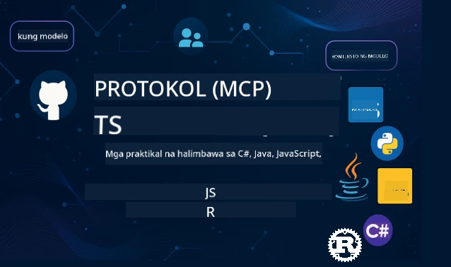

 

[](https://GitHub.com/microsoft/mcp-for-beginners/graphs/contributors)
[](https://GitHub.com/microsoft/mcp-for-beginners/issues)
[](https://GitHub.com/microsoft/mcp-for-beginners/pulls)
[](http://makeapullrequest.com)

[](https://GitHub.com/microsoft/mcp-for-beginners/watchers)
[](https://GitHub.com/microsoft/mcp-for-beginners/fork)
[](https://GitHub.com/microsoft/mcp-for-beginners/stargazers)


[](https://discord.gg/nTYy5BXMWG)

Sundin ang mga hakbang na ito upang makapagsimula sa paggamit ng mga resources na ito:
1. **I-fork ang Repositoryo**: I-click ang [](https://GitHub.com/microsoft/mcp-for-beginners/fork)
2. **I-clone ang Repositoryo**:   `git clone https://github.com/microsoft/mcp-for-beginners.git`
3. **Sumali sa** [](https://discord.gg/nTYy5BXMWG)


### 🌐 Suporta sa Maramihang Wika

#### Sinusuportahan sa pamamagitan ng GitHub Action (Awtomatiko at Laging Napapanahon)

<!-- CO-OP TRANSLATOR LANGUAGES TABLE START -->
[Arabic](../ar/README.md) | [Bengali](../bn/README.md) | [Bulgarian](../bg/README.md) | [Burmese (Myanmar)](../my/README.md) | [Chinese (Simplified)](../zh-CN/README.md) | [Chinese (Traditional, Hong Kong)](../zh-HK/README.md) | [Chinese (Traditional, Macau)](../zh-MO/README.md) | [Chinese (Traditional, Taiwan)](../zh-TW/README.md) | [Croatian](../hr/README.md) | [Czech](../cs/README.md) | [Danish](../da/README.md) | [Dutch](../nl/README.md) | [Estonian](../et/README.md) | [Finnish](../fi/README.md) | [French](../fr/README.md) | [German](../de/README.md) | [Greek](../el/README.md) | [Hebrew](../he/README.md) | [Hindi](../hi/README.md) | [Hungarian](../hu/README.md) | [Indonesian](../id/README.md) | [Italian](../it/README.md) | [Japanese](../ja/README.md) | [Kannada](../kn/README.md) | [Korean](../ko/README.md) | [Lithuanian](../lt/README.md) | [Malay](../ms/README.md) | [Malayalam](../ml/README.md) | [Marathi](../mr/README.md) | [Nepali](../ne/README.md) | [Nigerian Pidgin](../pcm/README.md) | [Norwegian](../no/README.md) | [Persian (Farsi)](../fa/README.md) | [Polish](../pl/README.md) | [Portuguese (Brazil)](../pt-BR/README.md) | [Portuguese (Portugal)](../pt-PT/README.md) | [Punjabi (Gurmukhi)](../pa/README.md) | [Romanian](../ro/README.md) | [Russian](../ru/README.md) | [Serbian (Cyrillic)](../sr/README.md) | [Slovak](../sk/README.md) | [Slovenian](../sl/README.md) | [Spanish](../es/README.md) | [Swahili](../sw/README.md) | [Swedish](../sv/README.md) | [Tagalog (Filipino)](./README.md) | [Tamil](../ta/README.md) | [Telugu](../te/README.md) | [Thai](../th/README.md) | [Turkish](../tr/README.md) | [Ukrainian](../uk/README.md) | [Urdu](../ur/README.md) | [Vietnamese](../vi/README.md)

> **Mas gusto mo bang I-clone Lokally?**
>
> Kasama sa repositoryong ito ang 50+ na mga pagsasalin ng wika na malaki ang nadaragdag sa laki ng pag-download. Para mag-clone nang walang mga pagsasalin, gamitin ang sparse checkout:
>
> **Bash / macOS / Linux:**
> ```bash
> git clone --filter=blob:none --sparse https://github.com/microsoft/mcp-for-beginners.git
> cd mcp-for-beginners
> git sparse-checkout set --no-cone '/*' '!translations' '!translated_images'
> ```
>
> **CMD (Windows):**
> ```cmd
> git clone --filter=blob:none --sparse https://github.com/microsoft/mcp-for-beginners.git
> cd mcp-for-beginners
> git sparse-checkout set --no-cone "/*" "!translations" "!translated_images"
> ```
>
> Bibigyan ka nito ng lahat ng kailangan mo para makumpleto ang kurso nang mas mabilis ang pag-download.
<!-- CO-OP TRANSLATOR LANGUAGES TABLE END -->

# 🚀 Kurikulum ng Model Context Protocol (MCP) para sa mga Nagsisimula

## **Matutunan ang MCP gamit ang Mga Praktikal na Halimbawa ng Code sa C#, Java, JavaScript, Rust, Python, at TypeScript**

## 🧠 Pangkalahatang Ideya ng Kurikulum ng Model Context Protocol
Maligayang pagdating sa iyong paglalakbay sa Model Context Protocol! Kung kailanman ay naisip mo kung paano nakikipag-ugnayan ang mga AI application sa iba't ibang mga tool at serbisyo, malapit mo nang matuklasan ang eleganteng solusyon na nagbabago sa paraan ng paggawa ng mga developer ng matalinong sistema.

Isipin ang MCP bilang isang unibersal na tagasalin para sa AI applications - tulad ng kung paano pinapayagan ka ng mga USB port na ikonekta ang anumang device sa iyong computer, pinapayagan ng MCP ang mga AI model na kumonekta sa anumang tool o serbisyo sa isang naka-standardize na paraan. Kung ikaw man ay gumagawa ng iyong unang chatbot o nagtatrabaho sa mga kumplikadong AI workflows, ang pag-unawa sa MCP ay magbibigay sa'yo ng kapangyarihang makagawa ng mas makapangyarihan at mas nababagong mga aplikasyon.

Ang kurikulum na ito ay dinisenyo nang may pasensya at malasakit para sa iyong pag-aaral. Magsisimula tayo sa mga simpleng konsepto na alam mo na at unti-unting palalalimin ang iyong kasanayan sa pamamagitan ng praktikal na pagsasanay gamit ang paborito mong programming language. Bawat hakbang ay may malinaw na paliwanag, praktikal na mga halimbawa, at maraming pampasigla sa daan.

Sa oras na matapos mo ang paglalakbay na ito, magkakaroon ka ng kumpiyansa na bumuo ng iyong sariling MCP servers, i-integrate ito sa mga sikat na AI platform, at maintindihan kung paano hinuhubog ng teknolohiyang ito ang hinaharap ng AI development. Simulan na natin ang kapanapanabik na pakikipagsapalaran na ito!

### Opisyal na Dokumentasyon at Mga Espesipikasyon

Ang kurikulum na ito ay naka-align sa **MCP Specification 2025-11-25** (ang pinakabagong stable na release). Gumagamit ang MCP specification ng versioning na batay sa petsa (format na YYYY-MM-DD) upang masigurong malinaw ang pagsubaybay ng bersyon ng protocol.

Ang mga resources na ito ay lalong nagiging mahalaga habang lumalawak ang iyong pang-unawa, ngunit huwag kang ma-pressure na basahin lahat agad-agad. Magsimula sa mga bahagi na pinaka-interesado ka!
- 📘 [Dokumentasyon ng MCP](https://modelcontextprotocol.io/) – Ito ang iyong go-to resource para sa mga step-by-step tutorial at gabay ng user. Ang dokumentasyon ay isinulat para sa mga nagsisimula, na nagbibigay ng malinaw na mga halimbawa na maaari mong sundan sa sarili mong bilis.
- 📜 [Espesipikasyon ng MCP](https://modelcontextprotocol.io/specification/2025-11-25) – Isipin ito bilang iyong komprehensibong reference manual. Habang tinatapos mo ang kurikulum, babalikan mo ito upang tuklasin ang mga tiyak na detalye at mas advanced na mga tampok.
- 📜 [Versioning ng MCP Specification](https://modelcontextprotocol.io/specification/versioning) – Naglalaman ito ng impormasyon tungkol sa kasaysayan ng bersyon ng protocol at kung paano ginagamit ng MCP ang versioning na batay sa petsa (YYYY-MM-DD format).
- 🧑‍💻 [MCP GitHub Repository](https://github.com/modelcontextprotocol) – Dito mo mahahanap ang mga SDK, tool, at mga sample na code sa maraming programming languages. Para itong isang treasure trove ng praktikal na mga halimbawa at mga component na handa nang gamitin.
- 🌐 [Komunidad ng MCP](https://github.com/orgs/modelcontextprotocol/discussions) – Sumali sa mga kapwa nag-aaral at mga bihasang developer sa mga diskusyon tungkol sa MCP. Ito ay isang suportadong komunidad kung saan malugod ang mga tanong at malayang naibabahagi ang kaalaman.
  
## Mga Layunin sa Pagkatuto

Sa pagtatapos ng kurikulum na ito, mararamdaman mong kumpiyansa at nasasabik sa iyong bagong mga kakayahan. Narito ang iyong makakamit:

• **Maunawaan ang mga pundasyon ng MCP**: Maiintindihan mo kung ano ang Model Context Protocol at bakit ito nagrerebolusyon sa paraan ng pag-uugnay ng mga AI application, gamit ang mga halimbawa at analogiya na madaling maintindihan.

• **Magtayo ng iyong unang MCP server**: Magagawa mong lumikha ng gumaganang MCP server sa iyong piniling programming language, nagsisimula sa mga simpleng halimbawa at palalalimin ang iyong mga kasanayan hakbang-hakbang.

• **Ikonekta ang mga AI model sa tunay na mga tool**: Matututuhan mo kung paano tulayin ang pagitan ng mga AI model at aktwal na mga serbisyo, na magbibigay ng makapangyarihang bagong kakayahan sa iyong mga aplikasyon.

• **Ipatupad ang pinakamahusay na mga kasanayan sa seguridad**: Maiintindihan mo kung paano panatilihing ligtas ang iyong mga implementasyon ng MCP, pinoprotektahan ang parehong iyong mga aplikasyon at ang mga gumagamit mo.

• **I-deploy nang may kumpiyansa**: Malalaman mo kung paano dalhin ang iyong mga proyekto ng MCP mula sa development hanggang production, gamit ang mga praktikal na estratehiya sa deployment na epektibo sa totoong mundo.

• **Sumali sa komunidad ng MCP**: Maging bahagi ka ng lumalaking komunidad ng mga developer na hinuhubog ang kinabukasan ng pagbuo ng mga AI application. 

## Mahahalagang Paunang Kaalaman

Bago tayo lumalim sa mga espesipiko ng MCP, siguraduhin muna natin na komportable ka sa ilang mga pundamental na konsepto. Huwag mag-alala kung hindi ka eksperto sa mga ito – ipapaliwanag namin ang lahat ng kailangan mong malaman habang nagpapatuloy tayo!

### Pag-unawa sa Mga Protocol (Ang Pundasyon)

Isipin ang isang protocol bilang mga patakaran para sa isang pag-uusap. Kapag tumawag ka sa kaibigan, pareho kayong alam na dapat sabihin ang "hello" pagkasagot, magpalitan ng salita, at magpaalam kapag tapos na. Kailangan din ng mga computer program ng ganitong uri ng mga patakaran upang epektibong makipag-ugnayan.

Ang MCP ay isang protocol – isang set ng pinagkasunduang mga patakaran na tumutulong sa mga AI model at application na magkaroon ng produktibong "pag-uusap" sa mga tool at serbisyo. Tulad ng pagkakaroon ng mga patakaran sa pag-uusap na nagpapadali sa komunikasyon ng tao, nagbibigay ng MCP ng mas maaasahan at mas makapangyarihang komunikasyon sa mga AI application.

### Relasyon ng Client-Server (Paano Nagkakatrabaho ang mga Programa nang Sama-sama)

Ginagamit mo na araw-araw ang mga relasyon ng client-server! Kapag gumamit ka ng web browser (client) upang bisitahin ang isang website, nakakonekta ka sa isang web server na nagpapadala sa'yo ng laman ng pahina. Alam ng browser kung paano humingi ng impormasyon, at alam ng server kung paano sumagot.

Sa MCP, mayroon tayong katulad na relasyon: Ang mga AI model ay gumaganap bilang mga client na humihingi ng impormasyon o aksyon, habang ang mga MCP server ay nagbibigay ng mga kakayahang iyon. Parang may assistant na tumutulong (ang server) na maaaring hingan ng AI para gumawa ng mga partikular na gawain.

### Bakit Mahalaga ang Standardization (Pagpapagana ng Mga Bagay nang Sama-sama)

Isipin kung bawat tagagawa ng sasakyan ay gumagamit ng magkakaibang hugis ng gas pump — kailangan mo ng ibang adapter para sa bawat kotse! Ang standardization ay ang pagsang-ayon sa mga karaniwang pamamaraan upang magtulungan nang maayos ang mga bagay.

Nagbibigay ang MCP ng ganitong standardization para sa mga AI application. Sa halip na bawat AI model ay mangailangan ng custom code upang makipagtrabaho sa bawat tool, lumilikha ang MCP ng unibersal na paraan ng komunikasyon. Ibig sabihin, maaaring gumawa ang mga developer ng tool minsan lamang at gumana ito sa maraming iba't ibang AI system.

## 🧭 Pangkalahatang Tanaw ng Iyong Landas sa Pagkatuto

Ang iyong paglalakbay sa MCP ay maingat na nakabalangkas upang unti-unting palakasin ang iyong kumpiyansa at mga kasanayan. Bawat yugto ay nagpapakilala ng mga bagong konsepto habang pinapatibay ang mga natutunan mo na.

### 🌱 Yugto ng Pundasyon: Pag-unawa sa Mga Pangunahing Kaalaman (Mga Module 0-2)

Dito nagsisimula ang iyong pakikipagsapalaran! Ipapakilala namin sa'yo ang mga konsepto ng MCP gamit ang mga pamilyar na analogiya at simpleng mga halimbawa. Maiintindihan mo kung ano ang MCP, bakit ito umiiral, at paano ito nakapaloob sa mas malaking mundo ng pag-develop ng AI.

• **Module 0 - Panimula sa MCP**: Sisimulan natin sa pagtuklas kung ano ang MCP at bakit ito napakahalaga para sa mga modernong AI application. Makikita mo ang mga totoong halimbawa ng MCP sa pagkilos at maiintindihan kung paano nito nilulutas ang mga karaniwang problema na kinakaharap ng mga developer.

• **Module 1 - Paliwanag ng Pangunahing Konsepto**: Dito matututuhan mo ang mahahalagang pundasyon ng MCP. Gagamit tayo ng maraming analogiya at biswal na mga halimbawa upang matiyak na ang mga konseptong ito ay magiging natural at malinaw para sa'yo.

• **Module 2 - Seguridad sa MCP**: Maaaring nakakatakot ang seguridad, pero ipapakita namin kung paano kasama sa MCP ang mga built-in na tampok para sa kaligtasan at ituturo namin sa'yo ang mga pinakamahusay na kasanayan para maprotektahan ang iyong mga aplikasyon mula sa simula.

### 🔨 Yugto ng Pagtatayo: Paglikha ng Iyong Unang Implementasyon (Module 3)

Ngayon nagsisimula na ang totoong kasiyahan! Magkakaroon ka ng hands-on na karanasan sa paggawa ng tunay na MCP servers at clients. Huwag mag-alala — magsisimula tayo sa mga simple at gagabayan ka namin sa bawat hakbang.
Kasama sa module na ito ang maraming hands-on na gabay na nagpapahintulot sa iyo na magsanay sa iyong paboritong programming na wika. Gagawa ka ng iyong unang server, bubuo ng isang kliyente upang kumonekta dito, at mag-iintegrate pa sa mga sikat na development tool tulad ng VS Code.

Bawat gabay ay may kasamang kompletong mga halimbawa ng code, mga tip sa pag-troubleshoot, at mga paliwanag kung bakit namin ginagawa ang mga partikular na disenyo. Sa pagtatapos ng yugtong ito, magkakaroon ka ng gumaganang mga implementasyon ng MCP na maaari mong ipagmalaki!

### 🚀 Phase ng Paglago: Mga Advanced na Konsepto at Aplikasyon sa Totoong Mundo (Modules 4-5)

Sa pagkakaroon ng master sa mga batayan, handa ka nang tuklasin ang mas sopistikadong mga tampok ng MCP. Sasaklawin namin ang mga praktikal na estratehiya sa pagpapatupad, mga teknik sa pag-debug, at mga advanced na paksa tulad ng multi-modal AI integration.

Matututuhan mo rin kung paano i-scale ang iyong mga implementasyong MCP para sa production at mag-integrate sa mga cloud platform tulad ng Azure. Inihahanda ka ng mga module na ito para bumuo ng mga solusyon ng MCP na kayang harapin ang mga totoong pangangailangan.

### 🌟 Phase ng Mastery: Komunidad at Pagsasanay (Modules 6-11)

Nakatuon ang huling phase sa pagsali sa komunidad ng MCP at pagsasanay sa mga larangang pinaka-interesado ka. Matututuhan mo kung paano mag-ambag sa mga open-source na proyekto ng MCP, magpatupad ng mga advanced na pattern ng authentication, at bumuo ng komprehensibong mga solusyon na may integrasyon sa database.

Nararapat bigyang-diin ang Module 11 - ito ay isang kumpletong 13-lab na hands-on na landas sa pag-aaral na nagtuturo sa iyo na bumuo ng production-ready MCP servers gamit ang PostgreSQL integration. Para itong capstone project na pinagsasama-sama ang lahat ng iyong natutunan!

### 📚 Kumpletong Istruktura ng Kurikulum

| Module | Paksa | Paglalarawan | Link |
|--------|-------|-------------|------|
| **Module 0-3: Mga Pangunahing Kaalaman** | | | |
| 00 | Panimula sa MCP | Pangkalahatang-ideya ng Model Context Protocol at ang kahalagahan nito sa AI pipelines | [Basahin pa](./00-Introduction/README.md) |
| 01 | Mga Pangunahing Konsepto na Ipinaliwanag | Malalim na pagtalakay sa mga pangunahing konsepto ng MCP | [Basahin pa](./01-CoreConcepts/README.md) |
| 02 | Seguridad sa MCP | Mga banta sa seguridad at pinakamahusay na mga gawi | [Basahin pa](./02-Security/README.md) |
| 03 | Pagsisimula sa MCP | Pagsasaayos ng kapaligiran, mga pangunahing server/kliyente, integrasyon | [Basahin pa](./03-GettingStarted/README.md) |
| **Module 3: Paggawa ng Iyong Unang Server at Kliyente** | | | |
| 3.1 | Unang Server | Gumawa ng iyong unang MCP server | [Gabay](./03-GettingStarted/01-first-server/README.md) |
| 3.2 | Unang Kliyente | Bumuo ng isang batayang MCP client | [Gabay](./03-GettingStarted/02-client/README.md) |
| 3.3 | Kliyenteng may LLM | Mag-integrate ng malalaking language model | [Gabay](./03-GettingStarted/03-llm-client/README.md) |
| 3.4 | Integrasyon sa VS Code | Gumamit ng MCP servers sa VS Code | [Gabay](./03-GettingStarted/04-vscode/README.md) |
| 3.5 | stdio Server | Gumawa ng mga server gamit ang stdio transport | [Gabay](./03-GettingStarted/05-stdio-server/README.md) |
| 3.6 | HTTP Streaming | Ipatupad ang HTTP streaming sa MCP | [Gabay](./03-GettingStarted/06-http-streaming/README.md) |
| 3.7 | AI Toolkit | Gamitin ang AI Toolkit kasama ang MCP | [Gabay](./03-GettingStarted/07-aitk/README.md) |
| 3.8 | Pagsusuri | Subukan ang implementasyon ng iyong MCP server | [Gabay](./03-GettingStarted/08-testing/README.md) |
| 3.9 | Deployment | I-deploy ang mga MCP server sa production | [Gabay](./03-GettingStarted/09-deployment/README.md) |
| 3.10 | Advanced na paggamit ng server | Gamitin ang mga advanced na server para sa mga mas advanced na tampok at pinabuting arkitektura | [Gabay](./03-GettingStarted/10-advanced/README.md) |
| 3.11 | Simpleng auth | Isang kabanata na nagpapakita ng auth mula sa simula at RBAC | [Gabay](./03-GettingStarted/11-simple-auth/README.md) |
| 3.12 | MCP Hosts | Isaayos ang Claude Desktop, Cursor, Cline, at iba pang MCP hosts | [Gabay](./03-GettingStarted/12-mcp-hosts/README.md) |
| 3.13 | MCP Inspector | Mag-debug at mag-test ng MCP servers gamit ang Inspector tool | [Gabay](./03-GettingStarted/13-mcp-inspector/README.md) |
| 3.14 | Sampling | Gamitin ang sampling upang makipagtulungan sa cliet | [Gabay](./03-GettingStarted/14-sampling/README.md) |
| 3.15 | MCP Apps | Bumuo ng MCP Apps | [Gabay](./03-GettingStarted/15-mcp-apps/README.md) |

| **Module 4-5: Praktikal at Advanced** | | | |
| 04 | Praktikal na Pagpapatupad | SDKs, debugging, testing, reusable prompt templates | [Basahin pa](./04-PracticalImplementation/README.md) |
| 4.1 | Pagination | Pamahalaan ang malalaking resulta gamit ang cursor-based pagination | [Gabay](./04-PracticalImplementation/pagination/README.md) |
| 05 | Mga Advanced na Paksa sa MCP | Multi-modal AI, scaling, paggamit sa enterprise | [Basahin pa](./05-AdvancedTopics/README.md) |
| 5.1 | Integrasyon sa Azure | MCP Integration sa Azure | [Gabay](./05-AdvancedTopics/mcp-integration/README.md) |
| 5.2 | Multi-modality | Paggamit ng maraming modalities | [Gabay](./05-AdvancedTopics/mcp-multi-modality/README.md) |
| 5.3 | OAuth2 Demo | Magpatupad ng OAuth2 authentication | [Gabay](./05-AdvancedTopics/mcp-oauth2-demo/README.md) |
| 5.4 | Root Contexts | Unawain at ipatupad ang root contexts | [Gabay](./05-AdvancedTopics/mcp-root-contexts/README.md) |
| 5.5 | Routing | Mga estratehiya sa routing ng MCP | [Gabay](./05-AdvancedTopics/mcp-routing/README.md) |
| 5.6 | Sampling | Mga teknik sa sampling sa MCP | [Gabay](./05-AdvancedTopics/mcp-sampling/README.md) |
| 5.7 | Scaling | Iskalahin ang mga implementasyon ng MCP | [Gabay](./05-AdvancedTopics/mcp-scaling/README.md) |
| 5.8 | Seguridad | Mga advanced na konsiderasyon sa seguridad | [Gabay](./05-AdvancedTopics/mcp-security/README.md) |
| 5.9 | Web Search | Ipatupad ang kakayahan sa web search | [Gabay](./05-AdvancedTopics/web-search-mcp/README.md) |
| 5.10 | Realtime Streaming | Bumuo ng realtime streaming functionality | [Gabay](./05-AdvancedTopics/mcp-realtimestreaming/README.md) |
| 5.11 | Realtime Search | Ipatupad ang realtime search | [Gabay](./05-AdvancedTopics/mcp-realtimesearch/README.md) |
| 5.12 | Entra ID Auth | Authentication gamit ang Microsoft Entra ID | [Gabay](./05-AdvancedTopics/mcp-security-entra/README.md) |
| 5.13 | Foundry Integration | Mag-integrate sa Azure AI Foundry | [Gabay](./05-AdvancedTopics/mcp-foundry-agent-integration/README.md) |
| 5.14 | Context Engineering | Mga teknik para sa epektibong context engineering | [Gabay](./05-AdvancedTopics/mcp-contextengineering/README.md) |
| 5.15 | MCP Custom Transport | Mga custom na implementasyon ng Transport | [Gabay](./05-AdvancedTopics/mcp-transport/README.md) |
| 5.16 | Mga Tampok ng Protocol | Progress notifications, cancellation, resource templates | [Gabay](./05-AdvancedTopics/mcp-protocol-features/README.md) |
| **Module 6-10: Komunidad at Pinakamahusay na mga Gawi** | | | |
| 06 | Ambag sa Komunidad | Paano mag-ambag sa MCP ecosystem | [Gabay](./06-CommunityContributions/README.md) |
| 07 | Mga Aral mula sa Maagang Paggamit | Mga kwento ng implementasyon sa totoong mundo | [Gabay](./07-LessonsfromEarlyAdoption/README.md) |
| 08 | Pinakamahusay na mga Gawi para sa MCP | Performance, fault-tolerance, resilience | [Gabay](./08-BestPractices/README.md) |
| 09 | Mga Case Study ng MCP | Mga praktikal na halimbawa ng implementasyon | [Gabay](./09-CaseStudy/README.md) |
| 10 | Hands-on Workshop | Paggawa ng MCP Server gamit ang AI Toolkit | [Lab](./10-StreamliningAIWorkflowsBuildingAnMCPServerWithAIToolkit/README.md) |
| **Module 11: MCP Server Hands On Lab** | | | |
| 11 | Integrasyon ng MCP Server sa Database | Kumpletong 13-lab na hands-on na landas sa pag-aaral para sa PostgreSQL integration | [Labs](./11-MCPServerHandsOnLabs/README.md) |
| 11.1 | Panimula | Pangkalahatang-ideya ng MCP na may database integration at retail analytics use case | [Lab 00](./11-MCPServerHandsOnLabs/00-Introduction/README.md) |
| 11.2 | Core Architecture | Pag-unawa sa arkitektura ng MCP server, mga layer ng database, at mga pattern ng seguridad | [Lab 01](./11-MCPServerHandsOnLabs/01-Architecture/README.md) |
| 11.3 | Seguridad at Multi-Tenancy | Row Level Security, authentication, at multi-tenant data access | [Lab 02](./11-MCPServerHandsOnLabs/02-Security/README.md) |
| 11.4 | Pagsasaayos ng Kapaligiran | Pagsisetup ng development environment, Docker, Azure resources | [Lab 03](./11-MCPServerHandsOnLabs/03-Setup/README.md) |
| 11.5 | Disenyo ng Database | Setup ng PostgreSQL, retail schema design, at sample data | [Lab 04](./11-MCPServerHandsOnLabs/04-Database/README.md) |
| 11.6 | Implementasyon ng MCP Server | Pagbuo ng FastMCP server na may database integration | [Lab 05](./11-MCPServerHandsOnLabs/05-MCP-Server/README.md) |
| 11.7 | Pagbuo ng Tool | Paggawa ng mga database query tool at schema introspection | [Lab 06](./11-MCPServerHandsOnLabs/06-Tools/README.md) |
| 11.8 | Semantic Search | Pag-implementa ng vector embeddings gamit ang Azure OpenAI at pgvector | [Lab 07](./11-MCPServerHandsOnLabs/07-Semantic-Search/README.md) |
| 11.9 | Pagsusuri at Pag-debug | Mga estratehiya sa testing, mga tool sa debugging, at mga pamamaraan ng validation | [Lab 08](./11-MCPServerHandsOnLabs/08-Testing/README.md) |
| 11.10 | Integrasyon sa VS Code | Pagsasaayos ng VS Code MCP integration at paggamit ng AI Chat | [Lab 09](./11-MCPServerHandsOnLabs/09-VS-Code/README.md) |
| 11.11 | Mga Estratehiya sa Deployment | Docker deployment, Azure Container Apps, at mga konsiderasyon sa scaling | [Lab 10](./11-MCPServerHandsOnLabs/10-Deployment/README.md) |
| 11.12 | Pagmo-monitor | Application Insights, logging, performance monitoring | [Lab 11](./11-MCPServerHandsOnLabs/11-Monitoring/README.md) |
| 11.13 | Pinakamahusay na mga Gawi | Optimization ng performance, pagpapalakas ng seguridad, at mga tip sa production | [Lab 12](./11-MCPServerHandsOnLabs/12-Best-Practices/README.md) |

### 💻 Mga Halimbawang Proyekto ng Code

Isa sa mga pinaka-kapanapanabik na bahagi ng pag-aaral ng MCP ay ang makita ang pag-unlad ng iyong mga kasanayan sa code nang paunti-unti. Dinisenyo namin ang aming mga halimbawa ng code upang magsimula sa pagiging simple at lumago sa pagiging sopistikado habang lumalalim ang iyong pag-unawa. Ganito namin ipinapakilala ang mga konsepto - gamit ang code na madaling maintindihan ngunit nagpapakita ng tunay na mga prinsipyo ng MCP, mauunawaan mo hindi lang kung ano ang ginagawa ng code na ito, kundi kung bakit ito nakaayos sa ganitong paraan at kung paano ito kasya sa mas malalaking aplikasyong MCP.

#### Mga Pangunahing Halimbawa ng MCP Calculator

| Wika | Paglalarawan | Link |
|----------|-------------|------|
| C# | Halimbawa ng MCP Server | [Tingnan ang Code](./03-GettingStarted/samples/csharp/README.md) |
| Java | MCP Calculator | [Tingnan ang Code](./03-GettingStarted/samples/java/calculator/README.md) |
| JavaScript | MCP Demo | [Tingnan ang Code](./03-GettingStarted/samples/javascript/README.md) |
| Python | MCP Server | [Tingnan ang Code](../../03-GettingStarted/samples/python/mcp_calculator_server.py) |
| TypeScript | MCP Halimbawa | [Tingnan ang Code](./03-GettingStarted/samples/typescript/README.md) |
| Rust | MCP Halimbawa | [Tingnan ang Code](./03-GettingStarted/samples/rust/README.md) |

#### Advanced na mga Implementasyon ng MCP

| Wika | Paglalarawan | Link |
|----------|-------------|------|
| C# | Advanced na Halimbawa | [Tingnan ang Code](./04-PracticalImplementation/samples/csharp/README.md) |
| Java with Spring | Halimbawa ng Container App | [Tingnan ang Code](./04-PracticalImplementation/samples/java/containerapp/README.md) |
| JavaScript | Advanced na Halimbawa | [Tingnan ang Code](./04-PracticalImplementation/samples/javascript/README.md) |
| Python | Masalimuot na Implementasyon | [Tingnan ang Code](./04-PracticalImplementation/samples/python/README.md) |
| TypeScript | Halimbawa ng Container | [Tingnan ang Code](./04-PracticalImplementation/samples/typescript/README.md) |


## 🎯 Mga Kinakailangan para sa Pag-aaral ng MCP

Para makuha ang pinakamataas na benepisyo mula sa kurikulum na ito, dapat mayroon kang:
- Pangunahing kaalaman sa programming sa hindi bababa sa isa sa mga sumusunod na wika: C#, Java, JavaScript, Python, o TypeScript  
- Pag-unawa sa modelo ng client-server at mga API  
- Pamilyar sa mga konsepto ng REST at HTTP  
- (Opsyonal) Background sa mga konsepto ng AI/ML  

- Pagsali sa aming mga talakayan sa komunidad para sa suporta  

## 📚 Gabay sa Pag-aaral at mga Mapagkukunan

Ang repositoryong ito ay naglalaman ng ilang mga mapagkukunan upang tulungan kang mag-navigate at matuto nang epektibo:

### Gabay sa Pag-aaral

Isang komprehensibong [Gabay sa Pag-aaral](./study_guide.md) ang available upang tulungan kang mag-navigate nang epektibo sa repositoryong ito. Ipinapakita ng visual na kurikulum na ito kung paano magkakaugnay ang lahat ng paksa at nagbibigay ng gabay kung paano gamitin nang mabisa ang mga sample na proyekto. Lalo itong kapaki-pakinabang kung ikaw ay isang visual na nag-aaral na nais makita ang kabuuang larawan.

Kasama sa gabay:  
- Isang visual na mapa ng kurikulum na nagpapakita ng lahat ng saklaw na paksa  
- Detalyadong paghahati ng bawat seksyon ng repositoryo  
- Gabay kung paano gamitin ang mga sample na proyekto  
- Inirerekomendang mga landas sa pag-aaral para sa iba't ibang antas ng kakayahan  
- Karagdagang mga mapagkukunan upang samahan ang iyong paglalakbay sa pag-aaral  

### Tala ng Pagbabago

Pinananatili namin ang detalyadong [Tala ng Pagbabago](./changelog.md) na sumusubaybay sa lahat ng mahahalagang update sa mga materyales ng kurikulum, upang manatili kang napapanahon sa mga pinakabagong pagbuti at dagdag.  
- Mga bagong nilalaman na idinagdag  
- Mga pagbabago sa istruktura  
- Mga pagpapahusay sa mga tampok  
- Mga update sa dokumentasyon  

## 🛠️ Paano Gamitin nang Epektibo ang Kurikulum na Ito

Bawat aralin sa gabay na ito ay naglalaman ng:

1. Maliwanag na mga paliwanag ng mga konsepto ng MCP  
2. Live na mga halimbawa ng code sa maraming wika  
3. Mga ehersisyo upang bumuo ng totoong mga MCP na aplikasyon  
4. Dagdag na mga mapagkukunan para sa mga advanced na nag-aaral  

### Matutunan Natin ang MCP gamit ang C# - Tutorial Series  
Matutunan natin ang Model Context Protocol (MCP), isang makabagong framework na idinisenyo upang i-standardize ang mga interaksyon sa pagitan ng mga AI model at mga client application. Sa pamamagitan ng beginner-friendly session na ito, ipakikilala namin sa iyo ang MCP at gagabayan ka sa paggawa ng iyong unang MCP server.  
#### C#: [https://aka.ms/letslearnmcp-csharp](https://aka.ms/letslearnmcp-csharp)  
#### Java: [https://aka.ms/letslearnmcp-java](https://aka.ms/letslearnmcp-java)  
#### JavaScript: [https://aka.ms/letslearnmcp-javascript](https://aka.ms/letslearnmcp-javascript)  
#### Python: [https://aka.ms/letslearnmcp-python](https://aka.ms/letslearnmcp-python)  

## 🎓 Nagsisimula ang Iyong Paglalakbay sa MCP

Binabati kita! Kakagawa mo pa lang ng unang hakbang sa isang kapana-panabik na paglalakbay na magpapalawak ng iyong kakayahan sa programming at magkokonekta sa iyo sa pinaka-advanced na bahagi ng pag-unlad ng AI.

### Ang mga Naabot Mo Na

Sa pagbasa mo ng pambungad na ito, nagsimula ka na sa pagtatayo ng iyong pundasyon sa kaalaman tungkol sa MCP. Naiintindihan mo kung ano ang MCP, bakit ito mahalaga, at kung paano susuportahan ng kurikulum na ito ang iyong pag-aaral. Isang malaking tagumpay ito at simula ng iyong kadalubhasaan sa mahalagang teknolohiyang ito.

### Ang Pakikipagsapalaran sa Harap

Habang nagpapatuloy ka sa mga module, tandaan na bawat eksperto ay nagsimula bilang baguhan. Ang mga konseptong tila mahirap sa ngayon ay magiging kasanayan mo habang nagpapraktis at inilalapat mo ito. Bawat maliit na hakbang ay bumubuo patungo sa makapangyarihang kakayahan na magsisilbi sa iyo sa buong karera mo sa pag-develop.

### Iyong Network ng Suporta

Sumasali ka sa isang komunidad ng mga nag-aaral at eksperto na masigasig sa MCP at handang tumulong sa iba upang magtagumpay. Kung ikaw man ay nahihirapan sa isang coding challenge o nasasabik na ibahagi ang isang breakthrough, nandito ang komunidad upang suportahan ang iyong paglalakbay.

Kung ikaw ay mahirapan o may tanong tungkol sa paggawa ng mga AI app, sumali sa mga kapwa nag-aaral at bihasang developer sa mga talakayan tungkol sa MCP. Isang suportadong komunidad ito kung saan malugod ang mga tanong at malayang ibinahagi ang kaalaman.

[](https://discord.gg/nTYy5BXMWG)

Kung mayroon kang feedback tungkol sa produkto o mga error habang bumubuo, bisitahin:

[](https://aka.ms/foundry/forum)

### Handa Ka Na Bang Magsimula?

Nagsisimula na ang iyong pakikipagsapalaran sa MCP ngayon! Simulan sa Module 0 upang sumugod sa iyong unang hands-on na karanasan sa MCP, o tingnan ang mga sample na proyekto upang makita kung ano ang iyong bubuuin. Tandaan - bawat eksperto ay nagsimula mismo kung nasaan ka ngayon, at sa pasensya at pagsasanay, mamamangha ka sa kakayahan mong makamit.

Maligayang pagdating sa mundo ng pagbuo ng Model Context Protocol. Gumawa tayo ng isang kahanga-hangang bagay nang magkakasama!

## 🤝 Pag-aambag sa Komunidad ng Pag-aaral

Ang kurikulum na ito ay lumalakas sa mga kontribusyon mula sa mga nag-aaral tulad mo! Kung ikaw man ay nag-aayos ng typo, nagmumungkahi ng mas malinaw na paliwanag, o nagdadagdag ng bagong halimbawa, ang iyong mga kontribusyon ay tumutulong sa ibang mga baguhan na magtagumpay.

Salamat sa Microsoft Valued Professional [Shivam Goyal](https://www.linkedin.com/in/shivam2003/) para sa pagbibigay ng mga code sample.

Ang proseso ng kontribusyon ay idinisenyo upang maging magiliw at sumusuporta. Karamihan sa mga kontribusyon ay nangangailangan ng Contributor License Agreement (CLA), ngunit gagabayan ka ng mga automated na tool sa proseso nang maayos.

## 📜 Open Source na Pag-aaral

Ang buong kurikulum na ito ay available sa ilalim ng MIT [LICENSE](../../LICENSE), na nangangahulugang maaari mo itong gamitin, baguhin, at ibahagi nang malaya. Suportado nito ang aming misyon na gawing accessible ang kaalaman tungkol sa MCP sa mga developer saan man.

## 🤝 Mga Alituntunin sa Kontribusyon

Tinatanggap ng proyekto na ito ang mga kontribusyon at mungkahi. Karamihan sa mga kontribusyon ay nangangailangan ng pagsang-ayon mo sa  
Contributor License Agreement (CLA) na nagsasaad na may karapatan ka, at talaga namang ibinibigay mo, ang mga karapatan sa amin  
para gamitin ang iyong kontribusyon. Para sa mga detalye, bisitahin ang <https://cla.opensource.microsoft.com>.

Kapag nagsumite ka ng pull request, isang CLA bot ang awtomatikong magtatakda kung kailangan mong magbigay ng  
CLA at ilalagay ito sa PR nang naaayon (hal. status check, komento). Sundin lamang ang mga tagubiling ibinibigay ng bot. Isang beses mo lang ito kailangang gawin sa lahat ng repos na gumagamit ng aming CLA.

Inampon ng proyekto na ito ang [Microsoft Open Source Code of Conduct](https://opensource.microsoft.com/codeofconduct/).  
Para sa karagdagang impormasyon, tingnan ang [Code of Conduct FAQ](https://opensource.microsoft.com/codeofconduct/faq/) o kontakin ang [opencode@microsoft.com](mailto:opencode@microsoft.com) para sa anumang karagdagang mga tanong o komento.

---

*Handa ka na bang simulan ang iyong MCP na paglalakbay? Magsimula sa [Module 00 - Panimula sa MCP](./00-Introduction/README.md) at simulan ang iyong unang hakbang sa mundo ng pagbuo ng Model Context Protocol!*


## 🎒 Iba Pang Mga Kurso  
Gumagawa din ang aming koponan ng iba pang mga kurso! Tingnan:

<!-- CO-OP TRANSLATOR OTHER COURSES START -->
### LangChain  
[](https://aka.ms/langchain4j-for-beginners)  
[](https://aka.ms/langchainjs-for-beginners?WT.mc_id=m365-94501-dwahlin)  
[](https://github.com/microsoft/langchain-for-beginners?WT.mc_id=m365-94501-dwahlin)  
---

### Azure / Edge / MCP / Agents  
[](https://github.com/microsoft/AZD-for-beginners?WT.mc_id=academic-105485-koreyst)  
[](https://github.com/microsoft/edgeai-for-beginners?WT.mc_id=academic-105485-koreyst)  
[](https://github.com/microsoft/mcp-for-beginners?WT.mc_id=academic-105485-koreyst)  
[](https://github.com/microsoft/ai-agents-for-beginners?WT.mc_id=academic-105485-koreyst)  

---

### Serbisyo ng Generative AI  
[](https://github.com/microsoft/generative-ai-for-beginners?WT.mc_id=academic-105485-koreyst)  
[-9333EA?style=for-the-badge&labelColor=E5E7EB&color=9333EA)](https://github.com/microsoft/Generative-AI-for-beginners-dotnet?WT.mc_id=academic-105485-koreyst)  
[-C084FC?style=for-the-badge&labelColor=E5E7EB&color=C084FC)](https://github.com/microsoft/generative-ai-for-beginners-java?WT.mc_id=academic-105485-koreyst)  
[-E879F9?style=for-the-badge&labelColor=E5E7EB&color=E879F9)](https://github.com/microsoft/generative-ai-with-javascript?WT.mc_id=academic-105485-koreyst)  

---

### Pangunahing Pag-aaral  
[](https://aka.ms/ml-beginners?WT.mc_id=academic-105485-koreyst)  
[](https://aka.ms/datascience-beginners?WT.mc_id=academic-105485-koreyst)  
[](https://aka.ms/ai-beginners?WT.mc_id=academic-105485-koreyst)  
[](https://github.com/microsoft/Security-101?WT.mc_id=academic-96948-sayoung)  
[](https://aka.ms/webdev-beginners?WT.mc_id=academic-105485-koreyst)  
[](https://aka.ms/iot-beginners?WT.mc_id=academic-105485-koreyst)  
[](https://github.com/microsoft/xr-development-for-beginners?WT.mc_id=academic-105485-koreyst)  

---

### Copilot Series  
[](https://aka.ms/GitHubCopilotAI?WT.mc_id=academic-105485-koreyst)
[](https://github.com/microsoft/mastering-github-copilot-for-dotnet-csharp-developers?WT.mc_id=academic-105485-koreyst)
[](https://github.com/microsoft/CopilotAdventures?WT.mc_id=academic-105485-koreyst)
<!-- CO-OP TRANSLATOR OTHER COURSES END -->

---

<!-- CO-OP TRANSLATOR DISCLAIMER START -->
**Paalala**:
Ang dokumentong ito ay isinalin gamit ang AI translation service na [Co-op Translator](https://github.com/Azure/co-op-translator). Bagaman aming pinagsisikapan ang katumpakan, pakatandaan na ang awtomatikong pagsasalin ay maaaring maglaman ng mga pagkakamali o di-katiyakan. Ang orihinal na dokumento sa kanyang orihinal na wika ang dapat ituring na pinagmumulan ng awtoridad. Para sa mahahalagang impormasyon, inirerekomenda ang propesyonal na pagsasaling-wika ng tao. Hindi kami mananagot sa anumang hindi pagkakaunawaan o maling interpretasyon na nagmula sa paggamit ng pagsasaling ito.
<!-- CO-OP TRANSLATOR DISCLAIMER END -->