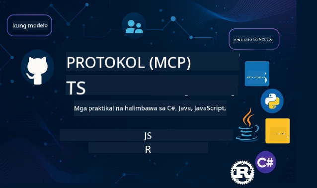

 

[](https://GitHub.com/microsoft/mcp-for-beginners/graphs/contributors)
[](https://GitHub.com/microsoft/mcp-for-beginners/issues)
[](https://GitHub.com/microsoft/mcp-for-beginners/pulls)
[](http://makeapullrequest.com)
[](https://mcptoplist.com/server/mcp.so%2Fmcp-for-beginners%2Fmicrosoft)

[](https://GitHub.com/microsoft/mcp-for-beginners/watchers)
[](https://GitHub.com/microsoft/mcp-for-beginners/fork)
[](https://GitHub.com/microsoft/mcp-for-beginners/stargazers)


[](https://discord.gg/nTYy5BXMWG)

Sundin ang mga hakbang na ito upang makapagsimula gamit ang mga mapagkukunang ito:
1. **I-fork ang Repository**: I-click ang [](https://GitHub.com/microsoft/mcp-for-beginners/fork)
2. **I-clone ang Repository**:   `git clone https://github.com/microsoft/mcp-for-beginners.git`
3. **Sumali sa** [](https://discord.gg/nTYy5BXMWG)


### 🌐 Suportang Maraming Wika

#### Sinusuportahan sa pamamagitan ng GitHub Action (Awtomatiko at Laging Napapanahon)

<!-- CO-OP TRANSLATOR LANGUAGES TABLE START -->
[Arabic](../ar/README.md) | [Bengali](../bn/README.md) | [Bulgarian](../bg/README.md) | [Burmese (Myanmar)](../my/README.md) | [Chinese (Simplified)](../zh-CN/README.md) | [Chinese (Traditional, Hong Kong)](../zh-HK/README.md) | [Chinese (Traditional, Macau)](../zh-MO/README.md) | [Chinese (Traditional, Taiwan)](../zh-TW/README.md) | [Croatian](../hr/README.md) | [Czech](../cs/README.md) | [Danish](../da/README.md) | [Dutch](../nl/README.md) | [Estonian](../et/README.md) | [Finnish](../fi/README.md) | [French](../fr/README.md) | [German](../de/README.md) | [Greek](../el/README.md) | [Hebrew](../he/README.md) | [Hindi](../hi/README.md) | [Hungarian](../hu/README.md) | [Indonesian](../id/README.md) | [Italian](../it/README.md) | [Japanese](../ja/README.md) | [Kannada](../kn/README.md) | [Khmer](../km/README.md) | [Korean](../ko/README.md) | [Lithuanian](../lt/README.md) | [Malay](../ms/README.md) | [Malayalam](../ml/README.md) | [Marathi](../mr/README.md) | [Nepali](../ne/README.md) | [Nigerian Pidgin](../pcm/README.md) | [Norwegian](../no/README.md) | [Persian (Farsi)](../fa/README.md) | [Polish](../pl/README.md) | [Portuguese (Brazil)](../pt-BR/README.md) | [Portuguese (Portugal)](../pt-PT/README.md) | [Punjabi (Gurmukhi)](../pa/README.md) | [Romanian](../ro/README.md) | [Russian](../ru/README.md) | [Serbian (Cyrillic)](../sr/README.md) | [Slovak](../sk/README.md) | [Slovenian](../sl/README.md) | [Spanish](../es/README.md) | [Swahili](../sw/README.md) | [Swedish](../sv/README.md) | [Tagalog (Filipino)](./README.md) | [Tamil](../ta/README.md) | [Telugu](../te/README.md) | [Thai](../th/README.md) | [Turkish](../tr/README.md) | [Ukrainian](../uk/README.md) | [Urdu](../ur/README.md) | [Vietnamese](../vi/README.md)

> **Mas Gusto Mong Mag-clone Nang Lokal?**
>
> Kasama sa repository na ito ang 50+ na pagsasalin ng wika na malaki ang pinapataas ng laki ng pag-download. Para mag-clone nang walang mga pagsasalin, gamitin ang sparse checkout:
>
> **Bash / macOS / Linux:**
> ```bash
> git clone --filter=blob:none --sparse https://github.com/microsoft/mcp-for-beginners.git
> cd mcp-for-beginners
> git sparse-checkout set --no-cone '/*' '!translations' '!translated_images'
> ```
>
> **CMD (Windows):**
> ```cmd
> git clone --filter=blob:none --sparse https://github.com/microsoft/mcp-for-beginners.git
> cd mcp-for-beginners
> git sparse-checkout set --no-cone "/*" "!translations" "!translated_images"
> ```
>
> Ito ay nagbibigay sa iyo ng lahat ng kailangan mo upang makumpleto ang kurso nang mas mabilis ang pag-download.
<!-- CO-OP TRANSLATOR LANGUAGES TABLE END -->

# 🚀 Kurikulum ng Model Context Protocol (MCP) para sa Mga Nagsisimula

## **Matuto ng MCP gamit ang Mga Halimbawang Kodigo sa C#, Java, JavaScript, Rust, Python, at TypeScript**

## 🧠 Pangkalahatang-ideya ng Kurikulum ng Model Context Protocol
Maligayang pagdating sa iyong paglalakbay sa Model Context Protocol! Kung nagtataka ka kung paano nakikipag-usap ang mga AI application sa iba't ibang mga kasangkapan at serbisyo, malapit mo nang matuklasan ang eleganteng solusyon na nagbabago kung paano bumuo ang mga developer ng matatalinong sistema.

Isipin ang MCP bilang isang unibersal na tagasalin para sa mga AI application - gaya ng pagpapahintulot ng mga USB port na ikonekta mo ang anumang aparato sa iyong kompyuter, pinapahintulutan ng MCP ang mga AI model na kumonekta sa anumang kasangkapan o serbisyo sa isang pamantayang paraan. Kahit na bumubuo ka ng iyong unang chatbot o nagtatrabaho sa kumplikadong mga AI workflow, bibigyan ka ng pag-unawa sa MCP ng kapangyarihan na gumawa ng mas makapangyarihan at flexible na mga aplikasyon.

Dinisenyo ang kurikulum na ito na may pasensya at malasakit para sa iyong paglalakbay sa pagkatuto. Magsisimula tayo sa mga simpleng konsepto na alam mo na at unti-unting bubuuin ang iyong kasanayan sa pamamagitan ng praktikal na pagsasanay sa paborito mong programming language. Kasama sa bawat hakbang ang malinaw na mga paliwanag, praktikal na mga halimbawa, at maraming paghihikayat sa bawat pagkakataon.

Sa pagtatapos ng paglalakbay na ito, magkakaroon ka ng kumpiyansa upang bumuo ng sarili mong MCP servers, isama ito sa mga popular na AI platform, at maintindihan kung paano binabago ng teknolohiyang ito ang hinaharap ng pag-develop ng AI. Simulan natin ang kapanapanabik na paglalakbay na ito nang magkasama!

### Opisyal na Dokumentasyon at Mga Espesipikasyon

Ang kurikulum na ito ay nakaayon sa **MCP Specification 2025-11-25** (ang pinakabagong stable release). Ang MCP specification ay gumagamit ng date-based versioning (YYYY-MM-DD format) upang matiyak ang malinaw na pagsubaybay ng bersyon ng protocol.

> **Tumingin sa hinaharap:** may naka-iskedyul na release candidate para sa susunod na bersyon ng espesipikasyon, **2026-07-28**, na ilalabas sa Hulyo 28, 2026. Ginagawang stateless ang protocol sa transport layer, pormal na itinatag ang Extensions framework (MCP Apps, Tasks), pinatitibay ang awtorisasyon, at ipinababalewala ang Roots, Sampling, at Logging. Tingnan ang [What's Changing in MCP: The 2026-07-28 Release Candidate](./01-CoreConcepts/mcp-2026-07-28-release-candidate.md) para sa buong detalye.

Nagiging mas mahalaga ang mga mapagkukunang ito habang lumalawak ang iyong pagkaunawa, ngunit huwag matakot na basahin lahat agad. Magsimula sa mga bahagi na pinaka-interesado ka!
- 📘 [MCP Documentation](https://modelcontextprotocol.io/) – Ito ang iyong pangunahing sanggunian para sa sunod-sunod na mga tutorial at gabay ng gumagamit. Ang dokumentasyon ay isinulat para sa mga nagsisimula, na nagbibigay ng malinaw na mga halimbawa na maaari mong sundan sa iyong sariling bilis.
- 📜 [MCP Specification](https://modelcontextprotocol.io/specification/2025-11-25) – Isipin ito bilang iyong komprehensibong manu-manong sanggunian. Sa pagtatrabaho mo sa kurikulum, madalas kang babalik dito upang hanapin ang mga partikular na detalye at tuklasin ang mga advanced na tampok.
- 📜 [MCP Specification Versioning](https://modelcontextprotocol.io/specification/versioning) – Naglalaman ito ng impormasyon tungkol sa kasaysayan ng bersyon ng protocol at kung paano ginagamit ng MCP ang date-based versioning (YYYY-MM-DD format).
- 🧑‍💻 [MCP GitHub Repository](https://github.com/modelcontextprotocol) – Dito makikita mo ang mga SDK, mga kasangkapan, at mga halimbawa ng kodigo sa maraming programming language. Para itong isang kayamanan ng praktikal na mga halimbawa at mga bahagi na handa nang gamitin.
- 🌐 [MCP Community](https://github.com/orgs/modelcontextprotocol/discussions) – Sumali sa mga kapwa mag-aaral at bihasang developer sa mga diskusyon tungkol sa MCP. Isa itong sumusuportang komunidad kung saan malugod ang mga tanong at malayang ibinabahagi ang kaalaman.
  
## Mga Layunin sa Pagkatuto

Sa pagtatapos ng kurikulum na ito, magiging kumpiyansa at nasasabik ka sa iyong mga bagong kakayahan. Narito ang iyong makakamit:

• **Intindihin ang mga pangunahing kaalaman sa MCP**: Maiintindihan mo kung ano ang Model Context Protocol at bakit nito binabago kung paano nagtutulungan ang mga AI application, gamit ang mga analohiya at halimbawa na madaling maintindihan.

• **Bumuo ng iyong unang MCP server**: Gagawa ka ng gumaganang MCP server sa paborito mong programming language, nagsisimula sa mga simpleng halimbawa at unti-unting pinalalawak ang iyong kasanayan.

• **Ikonekta ang mga AI model sa mga totoong kasangkapan**: Matututuhan mo kung paano tulayin ang pagitan ng mga AI model at aktwal na mga serbisyo, na nagbibigay sa iyong mga aplikasyon ng makapangyarihang mga bagong kakayahan.

• **Ipapatupad ang mga pinakamahusay na kasanayan sa seguridad**: Maiintindihan mo kung paano panatilihing ligtas at secure ang iyong mga implementasyon ng MCP, pinoprotektahan ang parehong iyong mga aplikasyon at mga gumagamit.

• **Mag-deploy nang may kumpiyansa**: Malalaman mo kung paano dalhin ang iyong mga proyekto ng MCP mula sa development patungo sa production, gamit ang mga praktikal na estratehiya sa deployment na epektibo sa totoong mundo.

• **Sumali sa komunidad ng MCP**: Maging bahagi ka ng lumalawak na komunidad ng mga developer na humuhubog sa hinaharap ng pag-develop ng mga AI application.

## Mahalagang Kaliwanagan

Bago tayo sumuong sa mga espesipikong tungkol sa MCP, siguraduhin muna nating komportable ka sa ilang mga pundamental na konsepto. Huwag mag-alala kung hindi ka eksperto sa mga ito - ipapaliwanag namin lahat ng kailangan mong malaman habang sumusulong tayo!

### Pag-unawa sa Mga Protocol (Ang Pundasyon)

Isipin ang isang protocol na parang mga panuntunan sa isang usapan. Kapag tumawag ka sa kaibigan, pareho kayong alam na magsasabi ng "hello" kapag sumagot, magpapalitan ng pagsasalita, at sasabi ng "goodbye" kapag tapos na. Kailangan din ng mga computer program ng katulad na mga panuntunan para epektibong makipag-ugnayan.

Ang MCP ay isang protocol - isang set ng pinagkasunduang mga panuntunan na tumutulong sa mga AI model at aplikasyon na magkaroon ng produktibong "mga usapan" sa mga kasangkapan at serbisyo. Gaya ng pagmumungkahi ng mga panuntunan sa usapan na ginagawang mas maayos ang komunikasyon ng tao, ginagawang mas maaasahan at makapangyarihan ang komunikasyon ng mga AI application ng MCP.

### Mga Relasyon ng Kliyente-Server (Paano Nagkakatrabaho ang Mga Program)

Ginagamit mo na ang mga relasyon ng kliyente-server araw-araw! Kapag gumagamit ka ng web browser (ang kliyente) para bisitahin ang isang website, kumokonekta ka sa web server na nagpapadala sa iyo ng nilalaman ng pahina. Alam ng browser kung paano hilingin ang impormasyon, at alam ng server kung paano sumagot.

Sa MCP, meron tayong kahalintulad na relasyon: ang mga AI model ay kumikilos bilang mga kliyente na humihiling ng impormasyon o aksyon, habang ang mga MCP server ang nagbibigay ng mga kakayahang iyon. Parang may isang matulunging katulong (ang server) na pwedeng tanungin ng AI para gawin ang mga partikular na gawain.

### Bakit Mahalaga ang Standardization (Pagpapagawa ng Tumutugmang Bagay)

Isipin kung ang bawat tagagawa ng sasakyan ay may kakaibang hugis ng gas pump - kailangan mo sana ng ibang adapter para sa bawat sasakyan! Ang standardization ay nangangahulugang pagsang-ayon sa mga karaniwang paraan para magtulungan nang walang aberya.

Nagbibigay ang MCP ng standardization para sa mga AI application. Sa halip na bawat AI model ay nangangailangan ng pasadyang kodigo para maging compatible sa bawat kasangkapan, lumilikha ang MCP ng unibersal na paraan ng komunikasyon. Ibig sabihin, makakapagbuo ang mga developer ng mga kasangkapan nang isang beses lang at gagana ito sa maraming iba't ibang sistema ng AI.

## 🧭 Iyong Pangkalahatang Landas ng Pagkatuto

Maingat na inayos ang iyong MCP na paglalakbay upang palakasin ang iyong kumpiyansa at kasanayan nang paunti-unti. Bawat yugto ay nagpapakilala ng mga bagong konsepto habang pinapalakas ang mga natutunan mo na.

### 🌱 Yugto ng Pundasyon: Pag-unawa sa Mga Pangunahing Kaalaman (Mga Module 0-2)

Dito magsisimula ang iyong pakikipagsapalaran! Ipapakilala namin sa iyo ang mga konsepto ng MCP gamit ang mga pamilyar na analohiya at simpleng mga halimbawa. Maiintindihan mo kung ano ang MCP, bakit ito umiiral, at paano ito pumapasok sa mas malaking mundo ng pag-develop ng AI.


• **Module 0 - Panimula sa MCP**: Sis simulan natin sa pag-explore kung ano ang MCP at bakit ito napakahalaga para sa mga modernong aplikasyon ng AI. Makikita mo ang mga totoong halimbawa ng MCP sa aksyon at mauunawaan kung paano nito nilulutas ang mga karaniwang problema na kinakaharap ng mga developer.

• **Module 1 - Ipinaliwanag na Pangunahing Konsepto**: Dito matututunan mo ang mahahalagang pundasyon ng MCP. Gagamit tayo ng maraming paghahambing at biswal na halimbawa upang siguraduhing ang mga konseptong ito ay maging natural at madaling maunawaan.

• **Module 2 - Seguridad sa MCP**: Maaaring nakakatakot ang seguridad, ngunit ipapakita namin sa iyo kung paano may mga built-in na tampok na pangkaligtasan ang MCP at ituturo ang pinakamahusay na mga gawi para maprotektahan ang iyong mga aplikasyon mula sa simula.

### 🔨 Yugto ng Pagtatayo: Paglikha ng Iyong Unang mga Implementasyon (Module 3)

Ngayon magsisimula na ang tunay na kasiyahan! Makakakuha ka ng praktikal na karanasan sa paggawa ng aktwal na mga MCP server at client. Huwag mag-alala - sisimulan natin ito nang simple at gagabayan ka sa bawat hakbang.

Kasama sa module na ito ang maraming mga gabay na hands-on na magbibigay-daan sa iyo upang magpraktis sa iyong paboritong programming language. Gagawa ka ng iyong unang server, bubuo ng client upang kumonekta dito, at mag-iintegrate pa sa mga sikat na development tools tulad ng VS Code.

Ang bawat gabay ay may kumpletong mga halimbawa ng code, mga tip sa pag-troubleshoot, at mga paliwanag kung bakit tayo gumagawa ng mga partikular na disenyo. Sa pagtatapos ng yugtong ito, magkakaroon ka ng gumaganang MCP implementations na maipagmamalaki mo!

### 🚀 Yugto ng Paglago: Mga Advanced na Konsepto at Paggamit sa Totoong Mundo (Modules 4-5)

Kapag na-master mo na ang mga pangunahing kaalaman, handa ka nang tuklasin ang mas sopistikadong mga tampok ng MCP. Tatalakayin natin ang mga praktikal na estratehiya ng implementasyon, mga teknik sa pag-debug, at mga advanced na paksa tulad ng multi-modal AI integration.

Matututuhan mo rin kung paano i-scale ang iyong mga MCP implementation para sa produksyon at kung paano mag-integrate sa mga cloud platform tulad ng Azure. Inihahanda ka ng mga module na ito upang bumuo ng mga solusyon ng MCP na kayang tumugon sa mga tunay na pangangailangan.

### 🌟 Yugto ng Kadakilaan: Komunidad at Espesyalisasyon (Modules 6-11)

Nakatuon ang huling yugtong ito sa pagsali sa komunidad ng MCP at sa pag-espesyalis sa mga larangang pinaka-interesado ka. Matututunan mo kung paano mag-ambag sa mga open-source na proyekto ng MCP, magpatupad ng mga advanced na pattern ng authentication, at bumuo ng komprehensibong mga solusyon na naka-integrate sa database.

Karapat-dapat na banggitin ang Module 11 - isang kumpletong learning path na may 13 labs na hands-on na nagtuturo sa iyo kung paano bumuo ng production-ready MCP servers kasama ang PostgreSQL integration. Parang capstone project ito na pinagsasama-sama ang lahat ng iyong natutunan!

### 📚 Kumpletong Estruktura ng Kurikulum

| Module | Paksa | Paglalarawan | Link |
|--------|-------|-------------|------|
| **Module 0-3: Mga Pangunahing Kaalaman** | | | |
| 00 | Panimula sa MCP | Pangkalahatang-ideya ng Model Context Protocol at ang kahalagahan nito sa AI pipelines | [Read more](./00-Introduction/README.md) |
| 01 | Ipinaliwanag na Pangunahing Konsepto | Masusing pagtalakay ng mga pangunahing konsepto ng MCP | [Read more](./01-CoreConcepts/README.md) |
| 1.1 | Ano ang Nagbabago sa MCP (2026-07-28 RC) | Stateless protocol, Extensions framework, at mga feature na itinatanggal sa susunod na bersyon ng spec | [Guide](./01-CoreConcepts/mcp-2026-07-28-release-candidate.md) |
| 02 | Seguridad sa MCP | Mga banta sa seguridad at pinakamahusay na mga gawi | [Read more](./02-Security/README.md) |
| 03 | Pagsisimula sa MCP | Setup ng environment, mga basic na server/client, integrasyon | [Read more](./03-GettingStarted/README.md) |
| **Module 3: Pagbuo ng Iyong Unang Server & Client** | | | |
| 3.1 | Unang Server | Gumawa ng iyong unang MCP server | [Guide](./03-GettingStarted/01-first-server/README.md) |
| 3.2 | Unang Client | Bumuo ng basic na MCP client | [Guide](./03-GettingStarted/02-client/README.md) |
| 3.3 | Client na may LLM | Integrate ng large language models | [Guide](./03-GettingStarted/03-llm-client/README.md) |
| 3.4 | Integrasyon sa VS Code | Gumamit ng MCP servers sa VS Code | [Guide](./03-GettingStarted/04-vscode/README.md) |
| 3.5 | stdio Server | Gumawa ng server gamit ang stdio transport | [Guide](./03-GettingStarted/05-stdio-server/README.md) |
| 3.6 | HTTP Streaming | Ipatupad ang HTTP streaming sa MCP | [Guide](./03-GettingStarted/06-http-streaming/README.md) |
| 3.7 | Microsoft Foundry Toolkit | Gamitin ang Microsoft Foundry Toolkit sa MCP | [Guide](./03-GettingStarted/07-aitk/README.md) |
| 3.8 | Pagsusuri | Subukan ang iyong implementasyon ng MCP server | [Guide](./03-GettingStarted/08-testing/README.md) |
| 3.9 | Deployment | I-deploy ang MCP servers sa produksyon | [Guide](./03-GettingStarted/09-deployment/README.md) |
| 3.10 | Advanced na paggamit ng server | Gumamit ng advanced na mga server para sa advanced na paggamit ng mga feature at pinahusay na arkitektura | [Guide](./03-GettingStarted/10-advanced/README.md) |
| 3.11 | Simpleng auth | Isang kabanata na nagpapakita ng authentication mula sa simula at RBAC | [Guide](./03-GettingStarted/11-simple-auth/README.md) |
| 3.12 | MCP Hosts | I-configure ang Claude Desktop, Cursor, Cline, at iba pang MCP hosts | [Guide](./03-GettingStarted/12-mcp-hosts/README.md) |
| 3.13 | MCP Inspector | I-debug at subukan ang MCP servers gamit ang Inspector tool | [Guide](./03-GettingStarted/13-mcp-inspector/README.md) |
| 3.14 | Sampling | Gamitin ang sampling para makipagtulungan sa client | [Guide](./03-GettingStarted/14-sampling/README.md) |
| 3.15 | MCP Apps | Bumuo ng MCP Apps | [Guide](./03-GettingStarted/15-mcp-apps/README.md) |
| **Module 4-5: Praktikal at Advanced** | | | |
| 04 | Praktikal na Implementasyon | SDKs, pag-debug, pagsusuri, reusable prompt templates | [Read more](./04-PracticalImplementation/README.md) |
| 4.1 | Pagination | Pamahalaan ang malalaking resulta gamit ang cursor-based pagination | [Guide](./04-PracticalImplementation/pagination/README.md) |
| 05 | Mga Advanced na Paksa sa MCP | Multi-modal AI, scaling, gamit sa enterprise | [Read more](./05-AdvancedTopics/README.md) |
| 5.1 | Integrasyon sa Azure | Integrasyon ng MCP sa Azure | [Guide](./05-AdvancedTopics/mcp-integration/README.md) |
| 5.2 | Multi-modality | Paggamit ng maraming modalities | [Guide](./05-AdvancedTopics/mcp-multi-modality/README.md) |
| 5.3 | OAuth2 Demo | Implementasyon ng OAuth2 authentication | [Guide](./05-AdvancedTopics/mcp-oauth2-demo/README.md) |
| 5.4 | Root Contexts | Unawain at ipatupad ang root contexts | [Guide](./05-AdvancedTopics/mcp-root-contexts/README.md) |
| 5.5 | Routing | Mga estratehiya ng MCP routing | [Guide](./05-AdvancedTopics/mcp-routing/README.md) |
| 5.6 | Sampling | Mga teknik sa sampling sa MCP | [Guide](./05-AdvancedTopics/mcp-sampling/README.md) |
| 5.7 | Scaling | I-scale ang mga implementasyon ng MCP | [Guide](./05-AdvancedTopics/mcp-scaling/README.md) |
| 5.8 | Seguridad | Mga advanced na konsiderasyon sa seguridad | [Guide](./05-AdvancedTopics/mcp-security/README.md) |
| 5.9 | Web Search | Ipatupad ang kakayahan sa web search | [Guide](./05-AdvancedTopics/web-search-mcp/README.md) |
| 5.10 | Realtime Streaming | Bumuo ng realtime streaming functionality | [Guide](./05-AdvancedTopics/mcp-realtimestreaming/README.md) |
| 5.11 | Realtime Search | Ipatupad ang realtime search | [Guide](./05-AdvancedTopics/mcp-realtimesearch/README.md) |
| 5.12 | Entra ID Auth | Authentication gamit ang Microsoft Entra ID | [Guide](./05-AdvancedTopics/mcp-security-entra/README.md) |
| 5.13 | Foundry Integration | Integrasyon sa Microsoft Foundry | [Guide](./05-AdvancedTopics/mcp-foundry-agent-integration/README.md) |
| 5.14 | Context Engineering | Mga teknik para sa epektibong context engineering | [Guide](./05-AdvancedTopics/mcp-contextengineering/README.md) |
| 5.15 | Custom Transport sa MCP | Mga implementasyon ng custom transport | [Guide](./05-AdvancedTopics/mcp-transport/README.md) |
| 5.16 | Mga Tampok ng Protocol | Mga notification ng progreso, pagkansela, mga resource templates | [Guide](./05-AdvancedTopics/mcp-protocol-features/README.md) |
| 5.17 | Adversarial Multi-Agent Reasoning | Dalawang ahente ang nagtatalo sa magkasalungat na panig gamit ang mga shared MCP tools, tinatasa ng isang judge agent | [Guide](./05-AdvancedTopics/mcp-adversarial-agents/README.md) |
| **Module 6-10: Komunidad at Pinakamahusay na Gawi** | | | |
| 06 | Mga Ambag ng Komunidad | Paano mag-ambag sa MCP ecosystem | [Guide](./06-CommunityContributions/README.md) |
| 07 | Mga Aral mula sa Maagang Paggamit | Mga kuwento ng totoong implementasyon | [Guide](./07-LessonsfromEarlyAdoption/README.md) |
| 08 | Pinakamahusay na Gawi para sa MCP | Performance, fault-tolerance, resilience | [Guide](./08-BestPractices/README.md) |
| 09 | Mga Pag-aaral ng Kaso ng MCP | Mga praktikal na halimbawa ng implementasyon | [Guide](./09-CaseStudy/README.md) |
| 10 | Hands-on Workshop | Pagbuo ng MCP Server gamit ang Microsoft Foundry Toolkit | [Lab](./10-StreamliningAIWorkflowsBuildingAnMCPServerWithAIToolkit/README.md) |
| **Module 11: MCP Server Hands On Lab** | | | |
| 11 | Integrasyon ng MCP Server sa Database | Komprehensibong 13-lab na hands-on learning path para sa PostgreSQL integration | [Labs](./11-MCPServerHandsOnLabs/README.md) |
| 11.1 | Panimula | Pangkalahatang-ideya ng MCP na may database integration at retail analytics use case | [Lab 00](./11-MCPServerHandsOnLabs/00-Introduction/README.md) |
| 11.2 | Pangunahing Arkitektura | Pag-unawa sa arkitektura ng MCP server, mga layer ng database, at mga pattern sa seguridad | [Lab 01](./11-MCPServerHandsOnLabs/01-Architecture/README.md) |
| 11.3 | Seguridad at Multi-Tenancy | Row Level Security, authentication, at multi-tenant data access | [Lab 02](./11-MCPServerHandsOnLabs/02-Security/README.md) |
| 11.4 | Setup ng Kapaligiran | Pag-set up ng development environment, Docker, mga resource sa Azure | [Lab 03](./11-MCPServerHandsOnLabs/03-Setup/README.md) |
| 11.5 | Disenyo ng Database | Pag-setup ng PostgreSQL, disenyo ng retail schema, at sample na data | [Lab 04](./11-MCPServerHandsOnLabs/04-Database/README.md) |
| 11.6 | Implementasyon ng MCP Server | Pagbuo ng FastMCP server na may database integration | [Lab 05](./11-MCPServerHandsOnLabs/05-MCP-Server/README.md) |
| 11.7 | Pagbuo ng Tool | Paglikha ng mga tool sa query ng database at schema introspection | [Lab 06](./11-MCPServerHandsOnLabs/06-Tools/README.md) |
| 11.8 | Semantic Search | Pagpapatupad ng vector embeddings gamit ang Azure OpenAI at pgvector | [Lab 07](./11-MCPServerHandsOnLabs/07-Semantic-Search/README.md) |
| 11.9 | Pagsusuri at Pag-debug | Mga estratehiya sa pagsusuri, mga tool sa pag-debug, at mga pamamaraan sa pagpapatunay | [Lab 08](./11-MCPServerHandsOnLabs/08-Testing/README.md) |
| 11.10 | Integrasyon sa VS Code | Pag-configure ng VS Code MCP integration at paggamit ng AI Chat | [Lab 09](./11-MCPServerHandsOnLabs/09-VS-Code/README.md) |
| 11.11 | Mga Estratehiya sa Deployment | Deployment gamit ang Docker, Azure Container Apps, at mga konsiderasyon sa scaling | [Lab 10](./11-MCPServerHandsOnLabs/10-Deployment/README.md) |
| 11.12 | Pagsubaybay | Application Insights, logging, at pagsubaybay ng performance | [Lab 11](./11-MCPServerHandsOnLabs/11-Monitoring/README.md) |
| 11.13 | Pinakamahusay na Gawi | Pag-optimize ng performance, pagpapalakas ng seguridad, at mga tip para sa produksyon | [Lab 12](./11-MCPServerHandsOnLabs/12-Best-Practices/README.md) |
| **Module 12: Mga Tool ng MCP** | | | |
| 12.1 | Tooling | Paggamit ng MCP sa Copilot App | [ Guide ](./12-tooling/README.md) |

### 💻 Mga Halimbawang Proyekto ng Code

Isa sa mga pinaka-kapanapanabik na bahagi ng pag-aaral ng MCP ay ang makita ang pagpapaunlad ng iyong mga kakayahan sa coding nang paunti-unti. Dinisenyo namin ang aming mga halimbawa ng code upang magsimula sa simpleng paraan at unti-unting maging mas sopistikado habang lumalalim ang iyong pag-unawa. Ganito namin ipinapakilala ang mga konsepto - gamit ang code na madaling maunawaan ngunit nagpapakita ng mga tunay na prinsipyo ng MCP, mauunawaan mo hindi lamang kung ano ang ginagawa ng code, kundi kung bakit ito nakaayos sa ganitong paraan at kung paano ito nababagay sa mas malalaking aplikasyon ng MCP.

#### Pangunahing Mga Halimbawa ng MCP Calculator

| Wika | Paglalarawan | Link |
|----------|-------------|------|

| C# | Halimbawa ng MCP Server | [Tingnan ang Code](./03-GettingStarted/samples/csharp/README.md) |
| Java | MCP Calculator | [Tingnan ang Code](./03-GettingStarted/samples/java/calculator/README.md) |
| JavaScript | MCP Demo | [Tingnan ang Code](./03-GettingStarted/samples/javascript/README.md) |
| Python | MCP Server | [Tingnan ang Code](../../03-GettingStarted/samples/python/mcp_calculator_server.py) |
| TypeScript | Halimbawa ng MCP | [Tingnan ang Code](./03-GettingStarted/samples/typescript/README.md) |
| Rust | Halimbawa ng MCP | [Tingnan ang Code](./03-GettingStarted/samples/rust/README.md) |

#### Mga Advanced na Implementasyon ng MCP

| Wika | Paglalarawan | Link |
|----------|-------------|------|
| C# | Advanced na Halimbawa | [Tingnan ang Code](./04-PracticalImplementation/samples/csharp/README.md) |
| Java na may Spring | Halimbawa ng Container App | [Tingnan ang Code](./04-PracticalImplementation/samples/java/containerapp/README.md) |
| JavaScript | Advanced na Halimbawa | [Tingnan ang Code](./04-PracticalImplementation/samples/javascript/README.md) |
| Python | Komplikadong Implementasyon | [Tingnan ang Code](./04-PracticalImplementation/samples/python/README.md) |
| TypeScript | Halimbawa ng Container | [Tingnan ang Code](./04-PracticalImplementation/samples/typescript/README.md) |


## 🎯 Mga Kailangan upang Matutunan ang MCP

Upang makuha ang pinakamahusay na benepisyo sa kurikulum na ito, dapat kang:

- Mayroong pangunahing kaalaman sa programming sa kahit isa sa mga sumusunod na wika: C#, Java, JavaScript, Python, o TypeScript
- Pag-unawa sa client-server na modelo at mga API
- Pamilyar sa mga konsepto ng REST at HTTP
- (Opsyonal) Background sa mga konsepto ng AI/ML

- Sumali sa aming mga talakayan ng komunidad para sa suporta

## 📚 Gabay sa Pag-aaral at mga Mapagkukunan

Kasama sa repositoryong ito ang ilang mga mapagkukunan upang tulungan kang mag-navigate at matuto nang mahusay:

### Gabay sa Pag-aaral

Isang komprehensibong [Gabay sa Pag-aaral](./study_guide.md) ang magagamit upang tulungan kang mag-navigate nang epektibo sa repositoryong ito. Ipinapakita ng visual na kurikulum na ito kung paano magkakaugnay ang lahat ng mga paksa at nagbibigay ng gabay kung paano gamitin nang maayos ang mga sample na proyekto. Mahalaga ito lalo na kung ikaw ay isang visual learner na gusto makita ang kabuuang larawan.

Kasama sa gabay ang:
- Isang visual na mapa ng kurikulum na nagpapakita ng lahat ng mga paksang tinatalakay
- Detalyadong paghati-hati ng bawat seksyon ng repositoryo
- Gabay kung paano gamitin ang mga sample na proyekto
- Mga inirerekomendang landas ng pag-aaral para sa iba't ibang antas ng kasanayan
- Karagdagang mga mapagkukunan upang suportahan ang iyong paglalakbay sa pag-aaral

### Changelog

Pinapanatili namin ang detalyadong [Changelog](./changelog.md) na nagtatala ng lahat ng mahahalagang update sa materyales ng kurikulum, kaya't maaari kang manatiling napapanahon sa mga pinakabagong pagbuti at dagdag.
- Mga bagong nilalaman na idinagdag
- Mga pagbabago sa estruktura
- Mga pagpapabuti sa mga tampok
- Mga update sa dokumentasyon

## 🛠️ Paano Epektibong Gamitin ang Kurikulum na Ito

Bawat aralin sa gabay na ito ay naglalaman ng:

1. Malinaw na paliwanag ng mga konsepto ng MCP  
2. Live na mga halimbawa ng code sa iba't ibang wika  
3. Mga ehersisyo upang makabuo ng mga totoong aplikasyon ng MCP  
4. Karagdagang mga mapagkukunan para sa mga advanced na nag-aaral

### Tara, Matutunan Natin ang MCP gamit ang C# - Series ng Tutorial
Alamin ang Model Context Protocol (MCP), isang makabagong framework na nilikha upang gawing pare-pareho ang pakikipag-ugnayan sa pagitan ng mga modelo ng AI at mga client na aplikasyon. Sa sesyong ito na angkop sa mga baguhan, ipakikilala namin ang MCP at gagabayan ka kung paano gumawa ng iyong unang MCP server.
#### C#: [https://aka.ms/letslearnmcp-csharp](https://aka.ms/letslearnmcp-csharp)
#### Java: [https://aka.ms/letslearnmcp-java](https://aka.ms/letslearnmcp-java)
#### JavaScript: [https://aka.ms/letslearnmcp-javascript](https://aka.ms/letslearnmcp-javascript)
#### Python: [https://aka.ms/letslearnmcp-python](https://aka.ms/letslearnmcp-python)

## 🎓 Nagsisimula ang Iyong Paglalakbay sa MCP

Congratulations! Kakagawa mo lang ng unang hakbang sa isang kapanapanabik na paglalakbay na magpapalawak ng iyong kakayahan sa programming at mag-uugnay sa iyo sa pinakabagong pag-unlad sa AI.

### Ano ang Naabot Mo Na

Sa pagbabasa mo ng paunang ito, nagsimula ka nang bumuo ng pundasyon ng iyong kaalaman sa MCP. Naiintindihan mo na kung ano ang MCP, bakit ito mahalaga, at kung paano susuportahan ng kurikulum na ito ang iyong pag-aaral. Malaking tagumpay iyon at simula ng iyong kadalubhasaan sa mahalagang teknolohiyang ito.

### Ang Pakikipagsapalaran sa Unahan

Sa pagsulong mo sa mga module, tandaan na bawat eksperto ay nagsimula bilang baguhan. Ang mga konseptong maaaring mukhang mahirap ngayon ay magiging pangalawang kalikasan habang ikaw ay nagsasanay at nag-aaplay nito. Bawat maliit na hakbang ay bumubuo tungo sa makapangyarihang kakayahan na sasamahan ka sa iyong karera sa pag-develop.

### Ang Iyong Network ng Suporta

Sumali ka sa isang komunidad ng mga mag-aaral at eksperto na masigasig tungkol sa MCP at sabik tumulong upang magtagumpay ang iba. Kung ikaw ay nahihirapan sa isang hamon sa coding o nais ibahagi ang isang tagumpay, nandito ang komunidad upang suportahan ang iyong paglalakbay.

Kung ikaw ay natigil o may mga tanong tungkol sa paggawa ng AI apps, sumali sa mga kapwa nag-aaral at bihasang developer sa mga talakayan tungkol sa MCP. Isang suportadong komunidad ito kung saan malugod ang mga tanong at malayang naibabahagi ang kaalaman.

[](https://discord.gg/nTYy5BXMWG)

Kung mayroon kang feedback sa produkto o mga error habang nagde-develop, bisitahin:

[](https://aka.ms/foundry/forum)

### Handa Ka Na Bang Magsimula?

Nagsisimula na ang iyong pakikipagsapalaran sa MCP! Simulan sa Module 0 upang maranasan ang iyong unang mga hands-on na MCP, o tuklasin ang mga sample na proyekto para makita kung ano ang iyong gagawin. Tandaan - bawat eksperto ay nagsimula sa eksaktong lugar kung nasaan ka ngayon, at sa pagtitiyaga at pagsasanay, mamamangha ka sa iyong makakamtan.

Maligayang pagdating sa mundo ng pag-develop ng Model Context Protocol. Gawin nating kamangha-mangha ang ating pagtatayo!

## 🤝 Pagsuporta sa Komunidad ng mga Nag-aaral

Lumalakas ang kurikulum na ito sa tulong ng mga kontribusyon mula sa mga nag-aaral tulad mo! Kung ikaw man ay nag-aayos ng typo, nagmumungkahing mas malinaw na paliwanag, o nagdadagdag ng bagong halimbawa, ang iyong mga kontribusyon ay tumutulong sa ibang mga baguhan na magtagumpay.

Pasasalamat kay Microsoft Valued Professional [Shivam Goyal](https://www.linkedin.com/in/shivam2003/) para sa pag-ambag ng mga code sample.

Dinisenyo ang proseso ng kontribusyon upang maging malugod at suportado. Karamihan sa mga kontribusyon ay nangangailangan ng Contributor License Agreement (CLA), ngunit gagabayan ka ng mga automated na tool sa proseso nang maayos.

## 📜 Open Source na Pag-aaral

Ang buong kurikulum na ito ay nasa ilalim ng MIT [LICENSE](../../LICENSE), ibig sabihin malaya mong magagamit, babaguhin, at maibabahagi ito. Suportado nito ang aming misyon na gawing accessible ang kaalaman sa MCP sa mga developer saan man.
## 🤝 Mga Alituntunin sa Kontribusyon

Tinatanggap ng proyektong ito ang mga kontribusyon at suhestiyon. Karamihan sa mga kontribusyon ay nangangailangan na sumang-ayon ka sa isang
Contributor License Agreement (CLA) na nagpapatunay na may karapatan ka at talagang ibinibigay sa amin
ang mga karapatan upang gamitin ang iyong kontribusyon. Para sa detalye, bisitahin ang <https://cla.opensource.microsoft.com>.

Kapag nag-submit ka ng pull request, awtomatikong matutukoy ng CLA bot kung kailangan mong magbigay
ng CLA at bibigyan ang PR ng tamang tanda (hal., status check, comment). Sundin lamang ang mga instruksyon
na ibibigay ng bot. Isang beses mo lang ito kailangang gawin sa lahat ng repos na gumagamit ng aming CLA.

Inampon ng proyektong ito ang [Microsoft Open Source Code of Conduct](https://opensource.microsoft.com/codeofconduct/).
Para sa karagdagang impormasyon tingnan ang [Code of Conduct FAQ](https://opensource.microsoft.com/codeofconduct/faq/) o
kontakin ang [opencode@microsoft.com](mailto:opencode@microsoft.com) para sa anumang dagdag na tanong o komento.

---

*Handa ka na bang simulan ang iyong MCP na paglalakbay? Magsimula sa [Module 00 - Panimula sa MCP](./00-Introduction/README.md) at gawin ang iyong unang mga hakbang sa mundo ng pag-develop ng Model Context Protocol!*


## 🎒 Iba Pang Mga Kurso
Gumagawa ang aming koponan ng iba pang mga kurso! Tingnan ang:

<!-- CO-OP TRANSLATOR OTHER COURSES START -->
### LangChain
[](https://aka.ms/langchain4j-for-beginners)
[](https://aka.ms/langchainjs-for-beginners?WT.mc_id=m365-94501-dwahlin)
[](https://github.com/microsoft/langchain-for-beginners?WT.mc_id=m365-94501-dwahlin)
---

### Azure / Edge / MCP / Agents
[](https://github.com/microsoft/AZD-for-beginners?WT.mc_id=academic-105485-koreyst)
[](https://github.com/microsoft/edgeai-for-beginners?WT.mc_id=academic-105485-koreyst)
[](https://github.com/microsoft/mcp-for-beginners?WT.mc_id=academic-105485-koreyst)
[](https://github.com/microsoft/ai-agents-for-beginners?WT.mc_id=academic-105485-koreyst)

---
 
### Series ng Generative AI
[](https://github.com/microsoft/generative-ai-for-beginners?WT.mc_id=academic-105485-koreyst)
[-9333EA?style=for-the-badge&labelColor=E5E7EB&color=9333EA)](https://github.com/microsoft/Generative-AI-for-beginners-dotnet?WT.mc_id=academic-105485-koreyst)
[-C084FC?style=for-the-badge&labelColor=E5E7EB&color=C084FC)](https://github.com/microsoft/generative-ai-for-beginners-java?WT.mc_id=academic-105485-koreyst)
[-E879F9?style=for-the-badge&labelColor=E5E7EB&color=E879F9)](https://github.com/microsoft/generative-ai-with-javascript?WT.mc_id=academic-105485-koreyst)

---
 
### Core Learning
[](https://aka.ms/ml-beginners?WT.mc_id=academic-105485-koreyst)
[](https://aka.ms/datascience-beginners?WT.mc_id=academic-105485-koreyst)
[](https://aka.ms/ai-beginners?WT.mc_id=academic-105485-koreyst)

[](https://github.com/microsoft/Security-101?WT.mc_id=academic-96948-sayoung)
[](https://aka.ms/webdev-beginners?WT.mc_id=academic-105485-koreyst)
[](https://aka.ms/iot-beginners?WT.mc_id=academic-105485-koreyst)
[](https://github.com/microsoft/xr-development-for-beginners?WT.mc_id=academic-105485-koreyst)

---
 
### Copilot Series
[](https://aka.ms/GitHubCopilotAI?WT.mc_id=academic-105485-koreyst)
[](https://github.com/microsoft/mastering-github-copilot-for-dotnet-csharp-developers?WT.mc_id=academic-105485-koreyst)
[](https://github.com/microsoft/CopilotAdventures?WT.mc_id=academic-105485-koreyst)
<!-- CO-OP TRANSLATOR OTHER COURSES END -->

---

<!-- CO-OP TRANSLATOR DISCLAIMER START -->
**Pagtatanggi**:
Ang dokumentong ito ay isinalin gamit ang serbisyo ng AI translation na [Co-op Translator](https://github.com/Azure/co-op-translator). Bagama't nagsusumikap kami para sa katumpakan, pakatandaan na ang awtomatikong pagsasalin ay maaaring maglaman ng mga pagkakamali o hindi pagkakatugma. Ang orihinal na dokumento sa orihinal nitong wika ang dapat ituring na pangunahing sanggunian. Para sa mahahalagang impormasyon, inirerekomenda ang propesyonal na pagsasalin ng tao. Hindi kami mananagot sa anumang maling pagkakaintindi o maling interpretasyon na nagmula sa paggamit ng pagsasaling ito.
<!-- CO-OP TRANSLATOR DISCLAIMER END -->